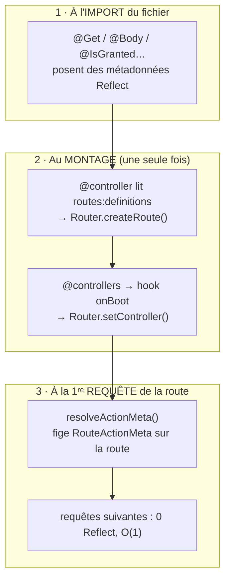
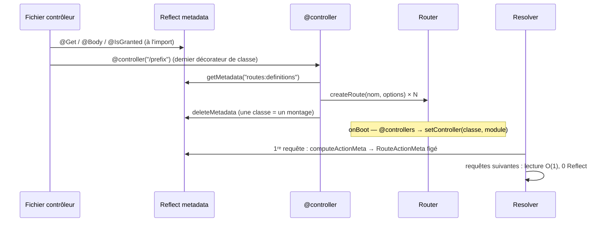

# Décorateurs — la surface déclarative des contrôleurs

> Un contrôleur Nodefony ne s'enregistre pas, ne se configure pas, ne se branche pas : il se
> **décrit**. `@controller` dit où il vit, `@Get` dit quand il répond, `@Body` dit ce qu'il reçoit,
> `@HttpCode` dit comment il répond, `@IsGranted` dit qui a le droit. Cette page est **la table de
> référence** des 36 décorateurs du module : pour chacun, sa cible, son effet et un exemple court.
> Tout est ancré sur `nodefony/decorators/routerDecorators.ts` — le fichier unique qui les porte tous.

📍 [Documentation](../../../../../docs/index.md) › [Framework](index.md) › **Décorateurs**

## 🧠 Le modèle mental — trois temps, jamais confondus

C'est LA chose à comprendre : un décorateur **ne fait rien** au moment où tu l'écris. Il écrit une
étiquette. Trois moments distincts se partagent le travail, et chaque bizarrerie de la page découle
de ce découpage.



1. **À l'import**, chaque décorateur appelle `Reflect.defineMetadata` et rend la main. Zéro route
   créée, zéro service résolu.
2. **Au montage**, `controller()` (`routerDecorators.ts:75`) relit ces métadonnées et fabrique les
   objets `Route` ; `controllers()` (`routerDecorators.ts:18`) accroche le contrôleur au module sur
   le hook `onBoot` du kernel.
3. **À la première requête** de chaque route, `resolveActionMeta()` (`routerDecorators.ts:1593`)
   consolide toutes les étiquettes de l'action en **un objet figé** posé sur la route. Les requêtes
   suivantes ne lisent plus aucune métadonnée.

> [!IMPORTANT]
> Conséquence directe : **une route n'existe que si son fichier a été importé**. Un contrôleur oublié
> dans le tableau `@controllers([...])` ne produit aucune erreur — il produit un `404`.

## 📖 Lexique

| Terme                  | Sens                                                                                                                 |
| ---------------------- | -------------------------------------------------------------------------------------------------------------------- |
| Décorateur             | Annotation TS (`@Get(…)`) exécutée à l'import, qui attache une information à une classe, une méthode ou un argument. |
| Décorateur legacy      | Le format historique TypeScript (`experimentalDecorators`), le seul utilisé ici — voir « Le contrat TypeScript ».    |
| Métadonnée (`Reflect`) | Étiquette clé→valeur rangée sur une classe par `reflect-metadata`, relisible plus tard sans toucher au code.         |
| Cible                  | Ce que le décorateur annote : **classe**, **méthode**, ou **paramètre** d'une méthode.                               |
| Décorateur **dual**    | Utilisable en classe (vaut pour toutes les actions) **et** en méthode (une seule action).                            |
| Action                 | La méthode du contrôleur qui traite la requête.                                                                      |
| Montage                | Le moment où `@controller` transforme les métadonnées en routes réelles dans le `Router`.                            |
| `RouteActionMeta`      | Le résumé figé (par route) de tous les décorateurs de l'action — lu par le `Resolver`.                               |
| Clause (autorisation)  | Un `@IsGranted`/`@RequireScope` : plusieurs attributs en **OU**, plusieurs clauses en **ET**.                        |
| Scope (`api:action`)   | Droit porté par un **jeton machine** (clé API, JWT) ; ne bride jamais un humain.                                     |
| ALS                    | _AsyncLocalStorage_ : la bulle Node qui transporte la requête courante sans la passer en argument.                   |
| Mutation               | Méthode non sûre : `POST`/`PUT`/`PATCH`/`DELETE` (RFC 9110 §9.2.1).                                                  |
| Hot path / cold path   | Chemin parcouru à **chaque** requête / chemin parcouru rarement (montage, 1ʳᵉ requête).                              |

## Qu'est-ce qu'un décorateur, concrètement ?

Imagine des **étiquettes collées sur une machine** avant sa mise en service. Aucune ne fait tourner
la machine ; elles disent au monteur quoi brancher : « alimentation 220 V », « ne pas ouvrir sans
habilitation », « sortie : 3 bars ». Le monteur passe une fois, lit toutes les étiquettes, et câble
en conséquence.

Un décorateur Nodefony, c'est exactement ça :

```typescript
@Get("/{id}")                       // étiquette : réponds à GET /prefix/{id}
@HttpCode(200)                      // étiquette : statut par défaut 200
@IsGranted("ROLE_USER")             // étiquette : réservé aux porteurs du rôle
async read(@Param("id") id: string) // étiquette d'argument : passe-moi la variable d'URL `id`
```

Sans décorateurs, il faudrait écrire à la main un fichier de routes (le chemin, la méthode, le nom du
contrôleur, l'action, les droits), le maintenir en parallèle du code, et le voir diverger. **Le
décorateur supprime la double vérité** : la déclaration vit sur l'action qu'elle décrit.

### Le contrat TypeScript — décorateurs _legacy_, et pourquoi ça compte

Nodefony utilise le format **legacy** de TypeScript : `experimentalDecorators: true` **et**
`emitDecoratorMetadata: true` (`tsconfig.json:5-6`, repris par le module —
`framework/tsconfig.json:5-6`). Ce n'est pas un détail historique, c'est ce qui rend possible :

- les **décorateurs de paramètre** (`@Param`, `@Body`…) — le format standard ES ne les propose pas ;
- l'**injection par type** du conteneur : `emitDecoratorMetadata` fait émettre au compilateur la
  liste des types du constructeur sous la clé `design:paramtypes`, que l'injecteur relit pour
  résoudre les dépendances sans les nommer (cf `injectable()`, `kernelDecorator.ts:82`).

Concrètement, dans une app générée par `nodefony create app`, ces deux options sont **déjà** dans le
`tsconfig.json`. Tu n'as rien à faire — sauf si tu pars d'un `tsconfig` à toi : sans elles, les
décorateurs ne compilent pas.

> [!WARNING]
> `reflect-metadata` doit être chargé **avant** tout décorateur. `routerDecorators.ts:1` l'importe
> pour toi dès que tu importes un décorateur du framework — mais si tu écris ton propre décorateur
> dans un fichier chargé plus tôt, mets-y `import "reflect-metadata";` en tête.

## La vision Nodefony

Trois partis pris expliquent la forme de cette surface, et un développeur qui les connaît ne se fait
jamais surprendre.

**1 — Un décorateur n'écrit QUE des métadonnées.** Aucun décorateur du framework ne contient de
logique de sécurité, de session ou d'idempotence. `IsGranted()` (`routerDecorators.ts:839`) pose une
clause ; c'est le `Resolver` qui appellera le moteur d'autorisation, **résolu par son nom** dans le
conteneur (`Resolver._enforceSecurity()`, `Resolver.ts:576`). Pourquoi ce détour : `@nodefony/framework`
ne dépend **pas** de `@nodefony/security` — sans ça, les deux modules formeraient un cycle. Le prix à
payer est visible : une route gardée alors que le module `security` est absent renvoie **403**, pas
une erreur de démarrage (fail-closed, `Resolver.ts:582`).

**2 — Tout est figé une fois, puis relu en O(1).** Les métadonnées de l'action sont consolidées au
premier passage dans `computeActionMeta()` (`routerDecorators.ts:1549`) puis gelées sur la route.
L'objet `RouteActionMeta` (`routerDecorators.ts:1361`) est **partagé par toutes les requêtes** — le
framework ne le mute jamais, et ton code non plus. Une action non décorée obtient des champs à `null`,
ce qui vaut **zéro branche** dans le chemin chaud.

**3 — Les mêmes décorateurs pour HTTP et WebSocket.** C'est le différenciateur du framework : un
contrôleur ne change pas de forme selon le transport. Une action WS se déclare avec `@route` et le
transport `WEBSOCKET` dans ses `requirements` ; ses paramètres s'injectent avec les mêmes `@Body`,
`@Query`, `@CurrentUser`.

## 🚀 Démarrage rapide

Vu depuis une app créée par `nodefony create app`. Rien à configurer : **les décorateurs ne se
règlent pas, ils se déclarent**.

### Le contrôleur

```typescript
// nodefony/controller/BookController.ts — complet, compile tel quel
import {
  Controller,
  controller,
  Get,
  Post,
  Delete,
  Param,
  Query,
  Body,
  HttpCode,
  Header,
  IsGranted,
  CurrentUser,
} from "@nodefony/framework";
import type { IUser } from "@nodefony/user";

interface BookInput {
  title: string;
  author: string;
}

// Le préfixe s'applique à TOUTES les routes de la classe.
@controller("/api/books")
class BookController extends Controller {
  // GET /api/books?q=… — `@Query` sans valeur present → undefined, jamais throw.
  @Get("")
  async list(@Query("q") q?: string) {
    return this.renderJson({ items: [], q: q ?? null });
  }

  // GET /api/books/{id} — `{id}` est capturé et injecté par son NOM.
  @Get("/{id}")
  async read(@Param("id") id: string) {
    return this.renderJson({ id, title: "Le Horla" });
  }

  // POST /api/books — 201 + en-tête posés AVANT l'exécution de l'action.
  // @IsGranted est évalué encore avant : un 403 n'instancie même pas ce contrôleur.
  @Post("")
  @HttpCode(201)
  @Header("Cache-Control", "no-store")
  @IsGranted(["ROLE_USER"])
  async create(@Body() dto: BookInput, @CurrentUser() user: IUser) {
    return this.renderJson({ id: "b_42", ...dto, owner: user.identifier });
  }

  // DELETE /api/books/{id} — `subject: "id"` passe la variable d'URL au voter
  // métier (« cet utilisateur est-il propriétaire de CE livre ? »).
  @Delete("/{id}")
  @HttpCode(204)
  @IsGranted("book.delete", { subject: "id" })
  // ⚠️ PAS `remove` : `Controller` hérite de `Service.remove()` — voir les Pièges.
  async destroy(@Param("id") id: string) {
    void id;
    return null; // 204 : le Resolver envoie une réponse vide (RFC 9110)
  }
}

export default BookController;
```

### Le branchement (une ligne, dans le module de l'app)

```typescript
// index.ts du module — `nodefony create controller` fait ce câblage pour toi
import { Kernel, Module } from "nodefony";
import { Controller, controller, controllers, Get } from "@nodefony/framework";

@controller("/hello")
class HelloController extends Controller {
  @Get("")
  async index() {
    return this.renderJson({ hello: "nodefony" });
  }
}

// Sans cette ligne, les routes existent mais aucun module ne les porte → 404.
@controllers([HelloController])
class AppModule extends Module {
  constructor(kernel: Kernel) {
    super("app", kernel, import.meta.url, {});
  }
}

export default AppModule;
```

### Ce qu'on observe

```bash
# 1) Lecture publique
curl -s http://localhost:5151/api/books/42
# {"id":"42","title":"Le Horla"}

# 2) Création sans rôle → 403 rendu AVANT l'instanciation du contrôleur
curl -si -X POST http://localhost:5151/api/books \
  -H 'Content-Type: application/json' -d '{"title":"X","author":"Y"}' | head -1
# HTTP/1.1 403 Forbidden

# 3) Créée avec le rôle : le 201 et l'en-tête viennent des décorateurs
curl -si -b /tmp/jar -X POST http://localhost:5151/api/books \
  -H 'Content-Type: application/json' -d '{"title":"X","author":"Y"}' | head -3
# HTTP/1.1 201 Created
# Cache-Control: no-store

# 4) Méthode non déclarée pour ce chemin → 405 avec l'agrégat des méthodes
curl -si -X PUT http://localhost:5151/api/books/42 | head -2
# HTTP/1.1 405 Method Not Allowed
# Allow: GET, DELETE
```

## 🧰 La table de référence — toute la surface décorateur

Six familles, **36 décorateurs**, un seul fichier source. Le tableau de synthèse sert à choisir en
5 secondes ; les tables détaillées qui suivent donnent l'effet exact et un exemple.

<!-- prettier-ignore -->
| Famille | Ce qu'elle décide | Décorateurs |
| --- | --- | --- |
| **Déclaration** | Où vit le contrôleur, quelles routes il porte | `@controllers` `@controller` `@route` `@Domain` `@Scope` |
| **Méthodes HTTP** | Quand l'action répond | `@Get` `@Post` `@Put` `@Patch` `@Delete` `@Options` `@Head` `@All` |
| **Paramètres** | Ce que l'action reçoit en arguments | `@Param` `@Query` `@Body` `@Headers` `@Cookie` `@Session` `@CurrentUser` `@Req` `@Res` `@UploadedFile` `@UploadedFiles` |
| **Réponse** | Statut, en-têtes, redirection | `@HttpCode` `@Header` `@Redirect` |
| **Sécurité** | Qui passe, qui décide, quelles défenses | `@IsGranted` `@RequireScope` `@Anonymous` `@BypassFirewall` `@Csp` `@CsrfProtect` `@CsrfExempt` |
| **Cycle de la requête** | Session, anti-rejeu | `@UseSession` `@Idempotent` |

> Tous s'importent depuis `"@nodefony/framework"` — jamais par un chemin relatif interne.

### Déclaration — classe, module, route

<!-- prettier-ignore -->
| Décorateur | Cible | Effet | Exemple |
| --- | --- | --- | --- |
| `@controllers([…])` | **module** | Rattache des contrôleurs au module sur le hook `onBoot` ; sans lui, aucune route n'est servie (`controllers()`, `routerDecorators.ts:18`) | `@controllers([BookController])` |
| `@controller("/prefix")` | **classe** | Pose le préfixe d'URL **et déclenche la création des routes** de la classe (`controller()`, `routerDecorators.ts:75`) | `@controller("/api/books")` |
| `@route(nom, options)` | méthode | Forme complète : nom explicite, chemin, `requirements`, `defaults`, hôte (`route()`, `routerDecorators.ts:157`) | `@route("ws-echo", { path: "/echo", requirements: { methods: ["WEBSOCKET"] } })` |
| `@Domain(motif \| motifs)` | **dual** | Restreint la route (ou la classe) à un ou plusieurs vhosts ; hors domaine → **403** (`Domain()`, `routerDecorators.ts:625`) | `@Domain("*.cdn.example.com")` |
| `@Scope("singleton")` | **classe** | Une seule instance de contrôleur partagée par toutes les requêtes (`Scope()`, `routerDecorators.ts:729`) | `@Scope("singleton")` |

**`@controller` est le déclencheur.** Il relit les métadonnées posées par `@route`/`@Get`/… puis les
**efface** (`Reflect.deleteMetadata`, `routerDecorators.ts:135`) : une classe ne se monte qu'une
fois. Il traite au passage la route « magique » `path: "*"` en **dernier**, quel que soit son ordre
d'écriture (`routerDecorators.ts:281`) — sinon un attrape-tout masquerait les routes précises.

**`@Scope("singleton")` est un contrat, pas une optimisation.** L'instance étant partagée, l'action
ne doit lire ni écrire **aucun** état de requête sur `this` : tout passe par les arguments décorés et
les accesseurs, qui retrouvent la requête courante via l'ALS. Le défaut reste `"request"` — une
instance par requête (`ControllerScope`, `Controller.ts:110`).

> [!NOTE]
> Le core `nodefony` exporte lui aussi un `Scope` (les portées du conteneur d'injection). Celui des
> contrôleurs s'importe **depuis `@nodefony/framework`** — l'homonymie est signalée dans le code
> (`routerDecorators.ts:545`).

### Méthodes HTTP

Toutes les fabriques sortent du même moule, `httpMethodDecorator()` (`routerDecorators.ts:455`) :
elles nomment la route automatiquement `ClasseName::methode` et posent `requirements.methods`.

| Décorateur               | Méthode filtrée | Ancre                                 | Exemple             |
| ------------------------ | --------------- | ------------------------------------- | ------------------- |
| `@Get(path?, opts?)`     | `GET`           | `Get` (`routerDecorators.ts:476`)     | `@Get("/{id}")`     |
| `@Post(path?, opts?)`    | `POST`          | `Post` (`routerDecorators.ts:477`)    | `@Post("")`         |
| `@Put(path?, opts?)`     | `PUT`           | `Put` (`routerDecorators.ts:478`)     | `@Put("/{id}")`     |
| `@Delete(path?, opts?)`  | `DELETE`        | `Delete` (`routerDecorators.ts:479`)  | `@Delete("/{id}")`  |
| `@Patch(path?, opts?)`   | `PATCH`         | `Patch` (`routerDecorators.ts:480`)   | `@Patch("/{id}")`   |
| `@Options(path?, opts?)` | `OPTIONS`       | `Options` (`routerDecorators.ts:481`) | `@Options("/{id}")` |
| `@Head(path?, opts?)`    | `HEAD`          | `Head` (`routerDecorators.ts:367`)    | `@Head("/{id}")`    |
| `@All(path?, opts?)`     | **aucune**      | `All()` (`routerDecorators.ts:374`)   | `@All("/proxy/*")`  |

Deux points qu'un dev découvre sinon à ses dépens :

- **Le nom de route est automatique et déterministe** : `BookController::read`. Utile pour les logs,
  l'écran Routes de Studio et `forward()`. Deux actions homonymes dans deux classes ne collisionnent
  pas ; deux méthodes de même nom dans la même classe, si (c'est impossible en TS).
- **`@All` n'émet aucun `requirements.methods`** — la route matche donc **toutes** les méthodes et ne
  produit jamais de `405`. À réserver aux proxies et attrape-tout ; une API REST gagne à déclarer ses
  méthodes, ne serait-ce que pour l'en-tête `Allow`.

Le second argument accepte les options de route non redondantes — `Omit<RouteOptions, "path" | "method">`
(`routerDecorators.ts:338`), soit `defaults`, `requirements`, `host`, `bypassFirewall`
(`RouteOptions`, `Route.ts:94`) :

```typescript
@Get("/{page}", { defaults: { page: "1" }, requirements: { scheme: "https" } })
async index(@Param("page") page: string) { /* … */ }
```

### Paramètres — ce que l'action reçoit

Onze décorateurs, tous produits par `paramDecoratorFactory()` (`routerDecorators.ts:1148`) sauf
`@Body`, qui accepte une option supplémentaire. Chacun pose `{ source, key, index }` ; la valeur est
calculée par `resolveParamArg()` (`routerDecorators.ts:1048`), une fonction **pure** — ce qui la rend
testable sans démarrer de serveur.

| Décorateur          | Sans clé renvoie…                    | Avec clé renvoie…                          | Ancre                                        |
| ------------------- | ------------------------------------ | ------------------------------------------ | -------------------------------------------- |
| `@Param("id")`      | toutes les variables d'URL (objet)   | la variable d'URL nommée                   | `Param` (`routerDecorators.ts:1143`)         |
| `@Query("q")`       | toute la query string                | un paramètre de la query string            | `Query` (`routerDecorators.ts:1169`)         |
| `@Body("field")`    | le corps parsé entier                | un champ du corps parsé                    | `Body()` (`routerDecorators.ts:1178`)        |
| `@Headers("x-foo")` | tous les en-têtes de requête         | un en-tête (**lookup en minuscules**)      | `Headers` (`routerDecorators.ts:1201`)       |
| `@Cookie("sid")`    | la map des cookies                   | un cookie (objet `Cookie`, champ `.value`) | `Cookie` (`routerDecorators.ts:1202`)        |
| `@Session("user")`  | l'objet `Session` vivant             | `session.get(clé)`                         | `Session` (`routerDecorators.ts:1203`)       |
| `@CurrentUser()`    | l'utilisateur résolu par le firewall | —                                          | `CurrentUser` (`routerDecorators.ts:1205`)   |
| `@Req()`            | la requête brute du contexte         | —                                          | `Req` (`routerDecorators.ts:1181`)           |
| `@Res()`            | la réponse du contexte               | —                                          | `Res` (`routerDecorators.ts:1207`)           |
| `@UploadedFile()`   | le **premier** fichier téléversé     | —                                          | `UploadedFile` (`routerDecorators.ts:1208`)  |
| `@UploadedFiles()`  | tous les fichiers téléversés         | —                                          | `UploadedFiles` (`routerDecorators.ts:1209`) |

La liste des sources possibles est fermée et typée : `ParamSource` (`routerDecorators.ts:365`).

#### Trois comportements à connaître

**`@CurrentUser` lit l'ALS, jamais un argument caché.** La valeur vient de `RequestContext.getUser()`
(`routerDecorators.ts:1205`) : l'utilisateur posé par le firewall. C'est **l'utilisateur**, jamais le
justificatif (mot de passe, jeton). Hors zone authentifiée, la valeur est `undefined` — le décorateur
n'authentifie rien, il expose ce qui a déjà été prouvé.

**`@Session` active la session à lui seul.** La simple présence d'un paramètre `@Session` vaut
déclaration d'intention : `resolveSessionIntent()` (`routerDecorators.ts:794`) la détecte et pose
l'intent, exactement comme `@UseSession()`. Une route sans l'un ni l'autre ne paie aucune session.

**`@Body({ stream: true })` court-circuite le parsing.** Pour un gros téléversement (vidéo,
sauvegarde), on injecte le **flux brut** de la requête au lieu du corps chargé en mémoire ; le
pipeline saute alors le parsing pour cette route, décision prise en amont par
`routeExpectsBodyStream()` (`routerDecorators.ts:1334`) :

```typescript
@Post("/upload")
async upload(@Body({ stream: true }) stream: NodeJS.ReadableStream) {
  await pipeline(stream, createWriteStream("/data/upload.bin")); // 0 pic mémoire
  return this.renderJson({ ok: true });
}
```

> [!TIP]
> L'ordre d'écriture des paramètres décorés n'a aucune importance : chaque valeur est placée à son
> **index déclaré** par `buildParamArgs()` (`routerDecorators.ts:1316`), et les trous restent
> `undefined`. Tu peux mélanger décorés et non décorés — les non décorés reçoivent `undefined`.

### Réponse — statut, en-têtes, redirection

| Décorateur                | Cible   | Effet                                                                                      | Exemple                               |
| ------------------------- | ------- | ------------------------------------------------------------------------------------------ | ------------------------------------- |
| `@HttpCode(201)`          | méthode | Fixe le statut **avant** l'exécution de l'action (`HttpCode()`, `routerDecorators.ts:548`) | `@HttpCode(204)`                      |
| `@Header("X-Foo", "bar")` | méthode | Ajoute un en-tête ; **s'empile** (plusieurs `@Header` cumulent, `routerDecorators.ts:580`) | `@Header("Cache-Control","no-store")` |
| `@Redirect("/url", 302)`  | méthode | Redirige **si** l'action ne renvoie rien (`Redirect()`, `routerDecorators.ts:589`)         | `@Redirect("/login", 302)`            |

Les deux premiers sont appliqués par `Resolver._applyResponseMeta()` (`Resolver.ts:650`) **avant**
l'appel de l'action : ton code peut donc les écraser ensuite (`this.renderJson(data, 202)` gagne).

`@Redirect` a une subtilité utile : si l'action **retourne un objet** portant `url` (et
éventuellement `statusCode`), cet objet **prend le dessus** sur les valeurs du décorateur
(`Resolver._handleRedirect()`, `Resolver.ts:666`) — la cible peut donc être calculée à l'exécution :

```typescript
@Get("/go")
@Redirect("/fallback", 302)          // cible par défaut
async go(@Query("to") to?: string) {
  return to ? { url: to, statusCode: 307 } : undefined; // undefined → /fallback
}
```

> [!WARNING]
> Redirection sans statut explicite ailleurs dans le code : `Response.redirect()` vaut **301** par
> défaut (permanent, mis en cache par les navigateurs). Passe toujours le code —
> `this.redirect(url, 302)`.

### Sécurité — qui passe, qui décide, quelles défenses

Sept décorateurs, **tous duals** (classe ou méthode) et **tous sans logique** : ils posent une
étiquette que le `Resolver` ou le firewall consommera.

| Décorateur                               | Effet                                                                                                    | Ancre                                        |
| ---------------------------------------- | -------------------------------------------------------------------------------------------------------- | -------------------------------------------- |
| `@IsGranted(attr \| attrs, { subject })` | Exige un attribut (rôle `ROLE_*` ou règle métier). Tableau = **OU** ; empilés = **ET** ; refus → **403** | `IsGranted()` (`routerDecorators.ts:839`)    |
| `@RequireScope(scope \| scopes)`         | Exige un scope `api:action` d'un **jeton machine** ; no-op pour une session humaine                      | `RequireScope()` (`routerDecorators.ts:936`) |
| `@Anonymous()`                           | Rend l'action publique : annule l'autorisation **et** l'authentification (le « permitAll »)              | `Anonymous()` (`routerDecorators.ts:912`)    |
| `@BypassFirewall`                        | Court-circuite le firewall (sonde de liveness, webhook signé, endpoint de login). **Sans parenthèses**   | `BypassFirewall` (`routerDecorators.ts:686`) |
| `@Csp({ "frame-src": [...] })`           | Ajoute des directives CSP **à cette réponse** ; classe + méthode fusionnent additivement                 | `Csp()` (`routerDecorators.ts:1001`)         |
| `@CsrfProtect()`                         | Opt-**in** au jeton anti-CSRF (double-submit signé) en plus de la défense globale                        | `CsrfProtect` (`routerDecorators.ts:1090`)   |
| `@CsrfExempt()`                          | Opt-**out** de la défense CSRF **en gardant** l'authentification (webhook, POST cross-origin légitime)   | `CsrfExempt` (`routerDecorators.ts:1099`)    |

#### Rôles et scopes — deux axes, un seul verdict

`@IsGranted` et `@RequireScope` écrivent dans **deux jeux de métadonnées distincts**, puis
`computeSecurityRequirement()` (`routerDecorators.ts:1444`) les fusionne en une exigence unique dont
toutes les clauses sont en **ET**. Une seule chaîne d'application côté `Resolver`, deux jurés
différents côté `security` (le voteur de rôles, le voteur de scopes).

```typescript
@controller("/api/orders")
@IsGranted("ROLE_USER") // vaut pour TOUTES les actions de la classe
class OrderController extends Controller {
  @Get("") // hérite ROLE_USER
  async list() {}

  @Post("")
  @RequireScope("orders:write") // + un scope si l'appelant est une clé API
  async create() {} // ⇒ ROLE_USER ET orders:write

  @Get("/health")
  @Anonymous() // annule la garde de classe → route publique
  async health() {}
}
```

Pourquoi deux axes plutôt qu'un : **les rôles disent qui tu es**, **les scopes disent ce qu'une clé a
le droit de faire**. Un humain connecté ne doit pas être bridé par une notion prévue pour restreindre
un jeton délégué — d'où le no-op côté session.

#### La différence entre `@Anonymous`, `@BypassFirewall` et `@CsrfExempt`

Trois façons d'ouvrir une porte, trois portées — les confondre coûte cher :

| Décorateur        | Authentification |   Autorisation   | Défense CSRF | Cas d'usage typique                   |
| ----------------- | :--------------: | :--------------: | :----------: | ------------------------------------- |
| `@Anonymous()`    |     ignorée      |     ignorée      |  conservée   | page publique d'un contrôleur protégé |
| `@BypassFirewall` |     ignorée      | (rien à évaluer) |  conservée   | sonde `/health`, endpoint de login    |
| `@CsrfExempt()`   |  **conservée**   |  **conservée**   |   ignorée    | webhook signé, API cross-origin       |

`@Anonymous()` pose en réalité **deux** marqueurs : « pas d'autorisation » et « pas de firewall »
(`routerDecorators.ts:719-734`) — c'est un `@BypassFirewall` doublé d'une annulation des clauses
héritées de la classe.

> [!CAUTION]
> `@BypassFirewall` s'écrit **sans parenthèses** : c'est un drapeau, pas une fabrique. Écrire
> `@BypassFirewall()` appelle la fonction avec `undefined` en cible et **n'ouvre rien** — la route
> reste gardée. Le sens du défaut est volontaire (_fail-closed_) : un oubli laisse la route fermée,
> jamais ouverte par erreur.

### Cycle de la requête — session et anti-rejeu

| Décorateur                           | Cible | Effet                                                                                                      | Ancre                             |
| ------------------------------------ | ----- | ---------------------------------------------------------------------------------------------------------- | --------------------------------- |
| `@UseSession({ readOnly?, eager? })` | dual  | Déclare le besoin d'une session serveur ; **méthode > classe** (`UseSession()`, `routerDecorators.ts:761`) | `@UseSession({ readOnly: true })` |
| `@Idempotent({ required? })`         | dual  | Protège une mutation du double effet via `Idempotency-Key` (`Idempotent()`, `routerDecorators.ts:1103`)    | `@Idempotent()`                   |

**`@UseSession` est la seule façon d'ouvrir une session** (avec un paramètre `@Session`, ou la reprise
d'un cookie existant). Il n'existe plus de « démarrer partout » global : une route qui ne déclare rien
ne coûte aucune lecture de stockage. Les deux options sont `readOnly` (lire sans jamais persister —
zéro écriture) et `eager` (activer tôt, pour régénérer l'identifiant juste après une authentification).
La forme exacte est celle de `SessionIntent` (`ISession.ts:18`).

**`@Idempotent` est strict par défaut** : une mutation sans `Idempotency-Key` reçoit **400**. Le mode
souple s'obtient par `@Idempotent({ required: false })` — sans effet en WebSocket, toujours strict
puisqu'une socket rejoue par nature. Les cinq verdicts, les statuts 409/422, la clé scopée par
identité et les stockages distribués sont traités dans la page dédiée →
[idempotence](./idempotence.md).

### Le voisinage — décorateurs des autres modules

Ils ne viennent pas de `@nodefony/framework`, mais complètent la même DX ; on les cite pour éviter les
recherches inutiles.

| Décorateur                          | Paquet               | Rôle                                                                                           |
| ----------------------------------- | -------------------- | ---------------------------------------------------------------------------------------------- |
| `@services([…])`                    | `nodefony`           | Déclare les services d'un module (`services()`, `kernelDecorator.ts:24`)                       |
| `@injectable()`                     | `nodefony`           | Rend une classe résoluble par le conteneur (`injectable()`, `kernelDecorator.ts:135`)          |
| `@inject("nom")`                    | `nodefony`           | Injecte un service à une position de constructeur (`inject()`, `kernelDecorator.ts:114`)       |
| `@Inject("nom")`                    | `nodefony`           | Idem, sur une propriété (`Inject()`, `kernelDecorator.ts:143`)                                 |
| `@RealtimeAction("méthode")`        | `@nodefony/realtime` | Expose une action JSON-RPC sur socket (`RealtimeAction()`, `realtimeDecorators.ts:101`)        |
| `@RealtimeChannel("canal", policy)` | `@nodefony/realtime` | Déclare un canal temps réel et sa politique (`RealtimeChannel()`, `realtimeDecorators.ts:142`) |
| `@RealtimeInbound("méthode")`       | `@nodefony/realtime` | Traite un message entrant typé (`RealtimeInbound()`, `realtimeDecorators.ts:182`)              |

Injection et portées → [injection-portees](../../../../../docs/architecture/injection-portees.md) ·
socket → [realtime](../../realtime/docs/index.md).

> [!NOTE]
> **`@nodefony/security` n'exporte aucun décorateur.** Toutes les annotations de sécurité
> (`@IsGranted`, `@RequireScope`, `@Anonymous`, `@Csp`, `@Csrf*`, `@BypassFirewall`) vivent **ici**,
> dans le framework, précisément pour qu'aucun cycle de dépendance ne se forme. Le moteur qui les
> applique, lui, est dans security → [firewall](../../security/docs/firewall.md) ·
> [autorisation](../../security/docs/authorization.md).

## 🔌 HTTP et WebSocket — les mêmes décorateurs

Un contrôleur ne change pas de forme selon le transport : ce sont les `requirements.methods` qui
déclarent le canal, `WEBSOCKET` étant une pseudo-méthode du type `HTTPMethod` (`Context.ts:100`).

```typescript
@controller("/ws/chat")
class ChatController extends Controller {
  // Handshake + chaque message arrivent dans CETTE action.
  @route("chat-echo", {
    path: "/echo",
    requirements: { methods: ["WEBSOCKET"] },
  })
  async echo(message: string | Buffer | null) {
    if (!message) return this.renderJson({ handshake: true }); // 1er passage
    return this.render(message.toString());
  }

  // DUPLEX : la même action est joignable en GET et par une frame `api.request`.
  @route("chat-rooms", {
    path: "/rooms",
    requirements: { methods: ["GET", "WEBSOCKET"] },
  })
  async rooms(@Query("limit") limit?: string) {
    return this.renderJson({ rooms: [], limit: limit ?? "25" });
  }
}
```

Trois faits à retenir :

- **Il n'existe pas de décorateur `@Ws`.** Le transport se déclare dans les `requirements` — via
  `@route`, ou via `@All("/x", { requirements: { methods: ["WEBSOCKET"] } })` si tu préfères la forme
  courte (les fabriques `@Get`/`@Post` écrasent, elles, `requirements.methods` par leur propre méthode,
  `routerDecorators.ts:476`).
- **Les décorateurs de paramètre fonctionnent pareil.** Pour une invocation par socket, le corps de
  la mutation voyage dans l'ALS et **prime** sur le corps HTTP (vide dans ce cas) — c'est traité dans
  `resolveParamArg()` (`routerDecorators.ts:1227`), et `@Query` lit la query du chemin **invoqué**,
  pas celle du handshake (`Resolver._buildParamArgs()`, `Resolver.ts:637`).
- **Les gardes s'appliquent identiquement.** `@IsGranted` protège une action joignable par socket
  exactement comme une action HTTP : la décision est prise avant l'instanciation, quel que soit le
  transport.

Les décorateurs propres au temps réel (canaux, actions JSON-RPC) appartiennent à `@nodefony/realtime`
→ [socket Nodefony](../../realtime/docs/index.md).

## ⚙️ Options communes et règles de précédence

Quand la même chose est déclarée à deux endroits, qui gagne ? Les règles sont fixes, et elles ne sont
pas toutes identiques — c'est la source d'erreur n°1.

<!-- prettier-ignore -->
| Sujet | Règle | Ancre |
| --- | --- | --- |
| `@Domain` | option `host` de la route > méthode > classe | `controller()` (`routerDecorators.ts:88`) |
| `@BypassFirewall` | **cumulatif** : `true` de la route, de la méthode ou de la classe suffit | `routerDecorators.ts:686` |
| `@UseSession` | méthode > classe (fusion des champs) | `resolveSessionIntent()` (`routerDecorators.ts:794`) |
| `@Idempotent` | méthode > classe | `computeIdempotent()` (`routerDecorators.ts:1530`) |
| `@IsGranted` / `@RequireScope` | **cumul en ET** : classe **plus** méthode | `computeSecurityRequirement()` (`routerDecorators.ts:1444`) |
| `@Anonymous` | méthode → annule tout ce que la classe a posé | `routerDecorators.ts:912` |
| `@Csp` | fusion **additive** classe + méthode (sources concaténées) | `mergeCspDirectives()` (`routerDecorators.ts:1000`) |
| `@CsrfProtect` / `@CsrfExempt` | OU logique : classe **ou** méthode suffit | `computeActionMeta()` (`routerDecorators.ts:1370`) |
| `@Header` | s'empile (plusieurs en-têtes) ; même clé → dernier écrit gagne | `Header()` (`routerDecorators.ts:580`) |
| `@HttpCode` | un seul par action (le dernier posé écrase) | `HttpCode()` (`routerDecorators.ts:548`) |

### Où placer les décorateurs de classe

TypeScript applique les décorateurs de classe **de bas en haut** : celui écrit le plus près de la
classe s'exécute en premier. Deux régimes en découlent :

- **Lus AU MONTAGE** — `@Domain`, `@BypassFirewall` : ils doivent avoir posé leur métadonnée **avant**
  que `@controller` ne construise les routes, donc **sous** `@controller`.
- **Lus PARESSEUSEMENT** (à la 1ʳᵉ requête) — `@IsGranted`, `@RequireScope`, `@Csp`, `@Csrf*`,
  `@Idempotent`, `@UseSession`, `@Scope` : l'ordre est indifférent.

Une seule règle à retenir, sûre dans tous les cas : **`@controller` en haut, le reste en dessous.**

```typescript
@controller("/admin") // ← toujours en premier
@Domain("admin.example.com")
@IsGranted("ROLE_ADMIN")
class AdminController extends Controller {
  /* … */
}
```

## 🏗️ Architecture interne — de l'import à la requête



Le snapshot `RouteActionMeta` (`routerDecorators.ts:1361`) regroupe **tout** ce que les décorateurs
ont dit de l'action :

<!-- prettier-ignore -->
| Champ | Vient de | `null`/`false` quand |
| --- | --- | --- |
| `paramsMeta` | `@Param`/`@Body`/… | aucun paramètre décoré |
| `httpCode` | `@HttpCode` | absent |
| `headerEntries` | `@Header` | absent (entrées pré-dépliées une fois) |
| `redirectMeta` | `@Redirect` | absent |
| `sessionIntent` | `@UseSession` / `@Session` | la route ne veut pas de session |
| `security` | `@IsGranted` + `@RequireScope` | action non gardée (ou `@Anonymous`) |
| `cspDirectives` | `@Csp` | aucune directive déclarée |
| `csrfProtect` / `csrfExempt` | `@CsrfProtect` / `@CsrfExempt` | non déclarés |
| `idempotent` | `@Idempotent` | action non protégée |

Le `Resolver` consomme ce snapshot dans un ordre qui a du sens sécurité :
**garde d'abord, instanciation ensuite**. `security !== null` déclenche
`_enforceSecurity()` (`Resolver.ts:576`) **avant** `newController()` — un `403` n'instancie pas le
contrôleur et n'exécute pas son `initialize()`. Puis viennent les arguments
(`_buildParamArgs()`, `Resolver.ts:619`), les métadonnées de réponse
(`_applyResponseMeta()`, `Resolver.ts:650`), l'action, et enfin la redirection éventuelle.

Un usage cold path mérite d'être connu : `extractActionScopes()` (`routerDecorators.ts:1445`) parcourt
les routes au démarrage pour bâtir le **catalogue des scopes déclarés** — le formulaire de création
de clés API dans Studio propose les scopes réellement utilisés par le code, jamais une liste
maintenue à part.

## ⚡ Performance & mémoire

Un décorateur non employé doit coûter **zéro**. C'est tenu par trois mécanismes vérifiables :

- **Lecture unique.** `resolveActionMeta()` (`routerDecorators.ts:1593`) mémorise le snapshot sur la
  route au premier passage — ensuite, plus aucun appel `Reflect.getMetadata` ni `Object.entries` par
  requête. Le même schéma vaut pour la détection du flux brut
  (`routeExpectsBodyStream()`, `routerDecorators.ts:1334`).
- **`null` plutôt que structure vide.** Une action sans garde a `security: null` : le `Resolver` teste
  un `null` et passe — ni résolution de service, ni `await`, ni allocation (`Resolver.ts:334`). Idem
  pour `idempotent`, `cspDirectives`, `paramsMeta`.
- **Objets gelés et partagés.** Les exigences de sécurité et d'idempotence sont créées **une fois** et
  `Object.freeze`-ées (`routerDecorators.ts:1292`, `:1340`) : une seule instance pour la durée de vie
  du processus, quelle que soit la charge. Corollaire : ne les mute jamais.

Coût résiduel côté montage seulement : la reconstruction de la pile d'appels dans `route()`
(`stackTrace`, `routerDecorators.ts:169`) pour retrouver le fichier source. Elle a lieu **à l'import**, une fois par
route, jamais pendant une requête.

## 🧩 Extension — écrire son propre décorateur

Le module montre le patron à suivre : un décorateur maison **ne fait qu'écrire une métadonnée**, et
un point du pipeline la relit. Pour un simple drapeau dual (classe + méthode), le framework fournit
déjà la fabrique `booleanMarkerDecorator()` (`routerDecorators.ts:1065`), dont `@CsrfProtect` et
`@CsrfExempt` sont les deux usages.

Le squelette d'un drapeau maison, en dehors du framework :

```typescript
import "reflect-metadata";

const AUDIT_METADATA = "app:audit";

/** `@Audited()` — marque une action à tracer. Dual : classe ou méthode. */
export function Audited() {
  return function (
    target: any,
    propertyKey?: string,
    descriptor?: PropertyDescriptor,
  ): any {
    if (propertyKey === undefined) {
      Reflect.defineMetadata(AUDIT_METADATA, true, target); // classe → constructeur
      return target;
    }
    Reflect.defineMetadata(AUDIT_METADATA, true, target, propertyKey); // méthode → prototype
    return descriptor;
  };
}
```

Deux invariants à respecter, tirés du code du module :

1. **Classe → constructeur, méthode → prototype keyé par nom.** C'est la convention de toutes les
   métadonnées du fichier (`routerDecorators.ts:864` pour `@IsGranted`) ; s'en écarter rend la
   fusion classe/méthode impossible.
2. **Aucune I/O, aucun service, aucun import lourd dans le décorateur.** Il s'exécute à l'import, hors
   de tout kernel : y résoudre un service planterait le simple fait de charger le fichier.

La lecture, elle, se fait au **cold path** (montage ou première requête), jamais à chaque requête.

## 📡 Observabilité — Studio

Le **Playground** (`/nodefony/playground`, dev uniquement) construit un formulaire par action **à
partir des décorateurs** : transports déclarés, paramètres décorés triés par index, et badges de
gardes (`@IsGranted`, scopes, `@Idempotent`, CSRF, intent de session, bypass firewall). C'est le
miroir exact de ce que cette page décrit — si un badge manque, c'est que le décorateur n'est pas là.

L'écran **Routes** et le point d'API `/nodefony/framework/api/routes` listent les routes issues de
`@controller`/`@route`, avec leur nom auto-généré et leurs `requirements`.

## ⚠️ Pièges (symptôme → cause → correction)

<!-- prettier-ignore -->
| Symptôme | Cause (dans le code) | Correction |
| --- | --- | --- |
| `404` sur une route pourtant décorée | Contrôleur jamais importé, ou absent de `@controllers([…])` | L'ajouter au tableau `@controllers` du module |
| `Action « remove » … : ce nom est RÉSERVÉ` au démarrage — ou `TS2416` au build | L'action reprend le nom d'un membre de `Controller` : la classe étend `Service`, qui expose déjà `remove(name): boolean` ([`Service.ts:452`](../../../nodefony/src/Service.ts)), `set`, `get`, `clean`… Le décorateur refuse le nom avant que le conflit n'atteigne le compilateur. | Renommer l'action (`destroy`, `deleteOne`…). Le nom d'une action est libre : c'est le chemin du décorateur qui fait l'URL. |
| `404` après avoir déplacé `@controller` sous `@Domain` | `@controller` monte les routes ; les décorateurs lus au montage doivent être **sous** | Remettre `@controller` en **premier** (le plus haut) |
| Le vhost de `@Domain` classe est ignoré | `@Domain` placé **au-dessus** de `@controller` → posé trop tard | Placer `@Domain` sous `@controller` |
| `@BypassFirewall` n'ouvre rien | Écrit **avec** parenthèses — c'est un drapeau, pas une fabrique | `@BypassFirewall` (sans `()`) |
| Une route de classe reste publique malgré l'option | `bypassFirewall` est **cumulatif** : le `true` de la classe l'emporte | Retirer `@BypassFirewall` de la classe et le poser action par action |
| `403` alors que le rôle est bon | Module `security` absent, ou route hors zone firewall → aucun jeton (fail-closed) | Charger `@nodefony/security` et couvrir la route par une zone |
| `@CurrentUser()` vaut `undefined` | Route hors zone firewall — l'identité n'est jamais résolue hors zone | Couvrir la route par une zone (voir [firewall](../../security/docs/firewall.md)) |
| `@Session()` toujours `null` | Aucun intent : ni `@UseSession`, ni paramètre `@Session`, ni cookie repris | Ajouter `@UseSession()` sur l'action ou la classe |
| `@Headers("X-Foo")` vaut `undefined` | Node met les en-têtes en minuscules ; la recherche est normalisée mais la clé compte | Utiliser la forme minuscule (`"x-foo"`) |
| `@Redirect` ne redirige pas | L'action a retourné une valeur — la redirection ne joue que sur `undefined`/`null` | Ne rien retourner, ou retourner `{ url, statusCode }` |
| Réponse `301` inattendue sur un `redirect()` manuel | `Response.redirect()` vaut 301 par défaut | Passer le code : `this.redirect(url, 302)` |
| Une méthode nommée `session`/`request`/`response` est refusée | Même règle : ce sont des **accesseurs** de `Controller`. Sans le garde-fou ils ne cassaient rien au build — ils masquaient l'action en silence. | Renommer l'action (aussi : `get`, `set`, `method`, `context`, `route`) |
| Deux requêtes se mélangent leurs données | `@Scope("singleton")` avec un état de requête stocké sur `this` | Revenir au défaut per-request, ou n'utiliser que des arguments décorés |
| La route `*` avale toutes les autres | Attendu : elle est montée en dernier mais matche tout ce qui reste | Vérifier que les routes précises sont bien déclarées (elles gagnent) |

## 🧪 Tests & couverture

Quatre suites unitaires et deux bancs d'intégration couvrent la surface — les chiffres exacts vivent
dans la carte régénérée depuis vitest, jamais figés ici :

- **unit `routerDecorators`** : création de route par `@controller`, application du préfixe, routes
  multiples, effacement des métadonnées après montage, route magique `*` montée en dernier, stockage
  des métadonnées `@Param`/`@Body`/`@Query` ;
- **unit `httpMethodDecorators`** : nommage automatique `Classe::méthode`, `requirements.methods` par
  verbe, `@All` sans contrainte, `405` sur méthode non déclarée, `@HttpCode`/`@Header`
  (accumulation)/`@Redirect` et leurs combinaisons ;
- **unit `paramDecorators`** : pose des métadonnées, accumulation sur une même méthode, résolution de
  chaque source, robustesse sur contexte partiel (WS), placement positionnel des arguments ;
- **unit `securityDecorators`** : OU interne d'une clause, ET entre clauses empilées, fusion
  classe+méthode, `subject`, annulation par `@Anonymous`, axe scope, descripteur gelé,
  `@CurrentUser` depuis l'ALS ;
- **intégration** (`@nodefony/http`, serveur réel) : `decorators` (paramètres bout en bout) et
  `decorators-response` (statut et en-têtes réellement émis).

Ce qui **manque** aujourd'hui : aucun banc de charge ni test mémoire dédié à la surface décorateur —
c'est cohérent avec le fait que tout y est cold path (montage, première requête), mais un
`@Scope("singleton")` mal utilisé se prouverait mieux sous charge (skill `nodefony-load-test`).

Couverture : `npm run coverage` dans `@nodefony/framework`.

## 🔗 Pour aller plus loin

- ⬆️ **Retour au hub** : [@nodefony/framework — vue du module](index.md) · [Toute la documentation](../../../../../docs/index.md)
- 🧭 **Pages sœurs** : [routing](./routing.md) (comment une route est compilée et choisie) ·
  [controller](./controller.md) (cycle de vie et helpers de rendu) ·
  [idempotence](./idempotence.md) (`@Idempotent` en profondeur)
- 🔐 **Le moteur derrière les gardes** : [firewall](../../security/docs/firewall.md) ·
  [autorisation](../../security/docs/authorization.md) · [CSRF](../../security/docs/csrf.md)
- 🔌 **Socket et décorateurs temps réel** : [realtime](../../realtime/docs/index.md)
- 🏗️ **Où tout ça s'insère** : [pipeline-requete](../../../../../docs/architecture/pipeline-requete.md) ·
  [injection-portees](../../../../../docs/architecture/injection-portees.md)
