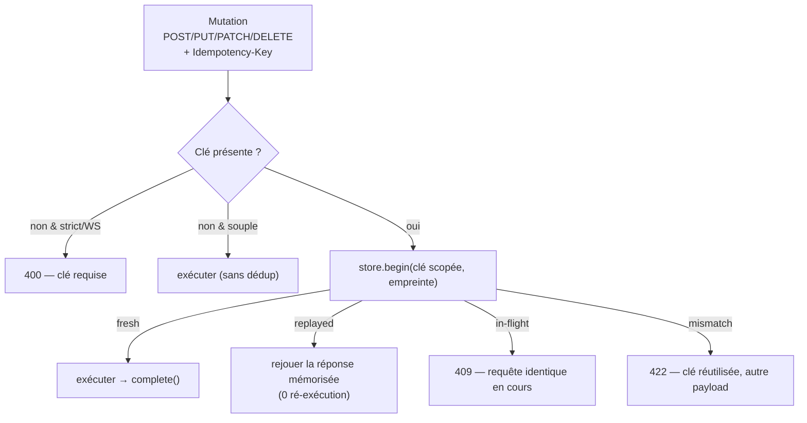
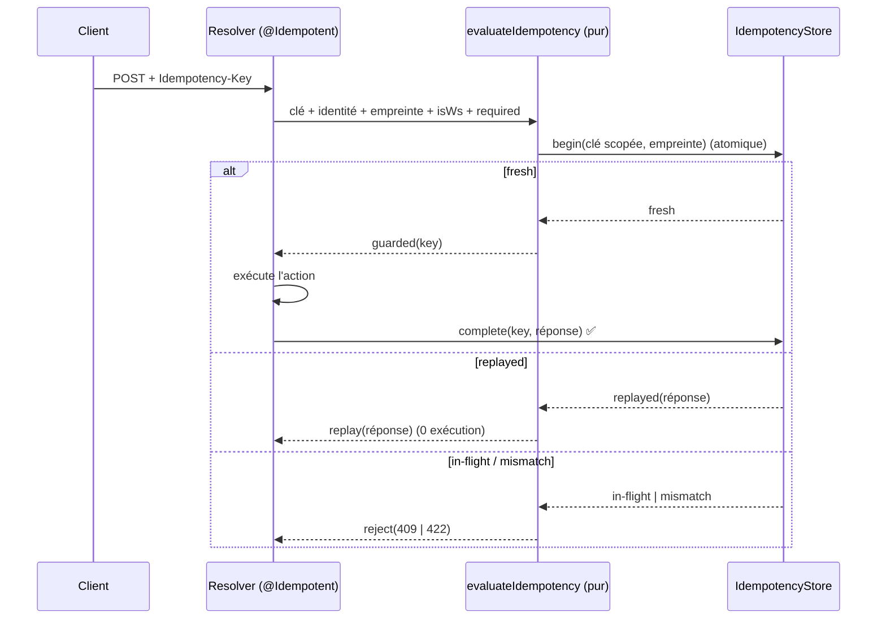
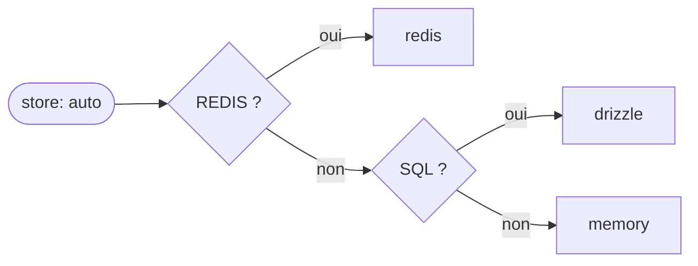

# Idempotence des mutations

> Rejouer une mutation ne doit jamais la ré-exécuter : un paiement retenté ne débite qu'une fois.
> Nodefony implémente le modèle `Idempotency-Key` (draft IETF, convention Stripe) en un seul point de
> décision partagé par HTTP et WebSocket — chaque affirmation ci-dessous est ancrée sur le code.

## Schéma général



## Lexique

| Terme                   | Développé / sens                                                                                   |
| ----------------------- | -------------------------------------------------------------------------------------------------- |
| Idempotence             | Propriété d'une opération qui, rejouée à l'identique, produit le **même effet qu'un seul appel**.  |
| Mutation                | Requête **non sûre** qui change l'état : `POST`/`PUT`/`PATCH`/`DELETE` (RFC 9110 §9.2.1).          |
| `Idempotency-Key`       | En-tête HTTP portant un identifiant client unique par intention d'écriture (convention Stripe).    |
| Empreinte (fingerprint) | Hachage SHA-256 du payload (route + params + corps) pour détecter une clé réutilisée autrement.    |
| Rejeu (replay)          | Ré-émission de la même requête (retry réseau, reconnexion WebSocket, double-clic).                 |
| in-flight               | Une exécution portant cette clé est **déjà en cours** (réservation atomique non encore complétée). |
| TTL / bail (lease)      | Durée de vie d'une réponse mémorisée / d'une réservation in-flight.                                |
| Store                   | Le cache qui mémorise les clés : `memory` (par pod), `redis` ou `drizzle` (distribué).             |
| IDOR                    | Insecure Direct Object Reference : accéder à la ressource d'autrui — ici, rejouer **sa** clé.      |
| ALS                     | AsyncLocalStorage : contexte Node.js qui suit la requête (porte la clé côté WebSocket).            |
| RFC / draft IETF        | Standards Internet ; ici `draft-ietf-httpapi-idempotency-key-header-06` + RFC 9110.                |

## Qu'est-ce que l'idempotence — et quelle faille elle bloque

Imagine un paiement. Le client envoie `POST /charge`, mais le réseau coupe avant la réponse. A-t-il
été débité ? Le client **retente**. Sans garde-fou, le serveur exécute **deux fois** : double débit.
C'est le **double-effet** — le problème que l'idempotence élimine.

Une opération **idempotente** peut être rejouée sans dommage : le deuxième appel identique **ne
refait rien**, il renvoie le résultat du premier. On y parvient en faisant porter au client une
**clé** (`Idempotency-Key`) qui identifie _l'intention_ : le serveur mémorise « cette intention est
déjà traitée » et, au rejeu, **rejoue la réponse** au lieu de ré-exécuter.

Ce n'est pas _que_ de la résilience — c'est aussi de la **sécurité**, sur trois fronts, tous présents
dans le code :

- **Anti double-effet** sur rejeu (retry réseau, reconnexion WebSocket, double-clic) — le cœur.
- **Anti-IDOR** : la clé est **scopée par identité** — un utilisateur ne peut **jamais** rejouer la
  clé d'un autre (`resolveIdentity`, `src/packages/@nodefony/framework/nodefony/src/idempotency.ts:100`).
- **Anti-DoS** : une clé > 255 octets est traitée comme absente et le cache mémoire est **borné**
  (`IDEMPOTENCY_KEY_MAX`, `idempotency.ts:36` ; cap FIFO, `service/IdempotencyStore.ts:18`).

## La vision Nodefony

La sémantique normative (quels statuts, quel scope, quelle empreinte) est décidée à **un seul
endroit** : le helper **pur** `evaluateIdempotency`
(`src/packages/@nodefony/framework/nodefony/src/idempotency.ts:142`). Il ne connaît **aucun
transport** : il rend un _verdict_ neutre (`execute` · `guarded` · `replay` · `reject`,
`idempotency.ts:50`) que chaque appelant traduit dans son monde — court-circuit HTTP côté data plane
admin, `RpcError` côté WebSocket. Résultat : **HTTP et WebSocket partagent exactement la même règle
d'idempotence**, cohérente avec le différenciateur du framework.

Deux traits propres à Nodefony, assumés :

- **Le WebSocket est toujours strict** : `requiredEffective = required || isWs`
  (`idempotency.ts:160`). Une socket reconnecte et rejoue par nature → muter sans clé y serait un
  piège ; la clé y est donc **toujours** exigée, même quand le mode HTTP est souple.
- **Le scope de clé est `[identité, clé client]`** (`idempotency.ts:182`), sérialisé en JSON (pas de
  séparateur magique ambigu) — l'anti-IDOR est structurel, pas un contrôle ajouté après coup.

## Démarrage rapide

Le décorateur `@Idempotent` protège une action de mutation. Par défaut il est **strict** (clé exigée) :

```typescript
import {
  Controller,
  controller,
  Post,
  Idempotent,
  Body,
} from "@nodefony/framework";

@controller("/api/payments")
class PaymentController extends Controller {
  // Strict : une requête sans Idempotency-Key est rejetée en 400.
  @Idempotent()
  @Post("/charge")
  async charge(@Body() body: unknown) {
    // exécuté UNE fois par clé ; les rejeux renvoient la réponse mémorisée.
    return this.renderJson(await this.get("billing").charge(body));
  }
}
```

Mode souple (honore la clé si présente, exécute sinon — mais **reste strict en WebSocket**) :

```typescript
@Idempotent({ required: false })
@Post("/subscribe")
async subscribe(@Body() body: unknown) { /* … */ }
```

### Le scénario complet — ce que le client voit

Une clé = une intention ; on la **réutilise telle quelle** sur chaque tentative. Premier appel : la
mutation s'exécute et la réponse est mémorisée.

```http
POST /api/payments/charge            →  1er envoi
Idempotency-Key: 3f6a9c1e-8b2d-4e17-b0aa-2c9f7e1d4a55
Content-Type: application/json

{ "amount": 4200, "currency": "eur" }
```

```http
HTTP/1.1 200 OK                       ←  exécuté UNE fois
{ "chargeId": "ch_9F2a", "status": "captured", "amount": 4200 }
```

Le réseau coupe, le client **retente avec la même clé** — le serveur **rejoue** la réponse, sans
re-débiter :

```http
POST /api/payments/charge            →  retry (même clé, même corps)
Idempotency-Key: 3f6a9c1e-8b2d-4e17-b0aa-2c9f7e1d4a55
{ "amount": 4200, "currency": "eur" }
```

```http
HTTP/1.1 200 OK                       ←  REJOUÉ (0 nouvelle exécution)
{ "chargeId": "ch_9F2a", "status": "captured", "amount": 4200 }
```

Les cas d'erreur, d'un coup d'œil :

| Situation                                 | Réponse                               |
| ----------------------------------------- | ------------------------------------- |
| Mode strict, aucun `Idempotency-Key`      | `400 Idempotency-Key required`        |
| Une exécution identique est déjà en cours | `409 Conflict`                        |
| Même clé, **corps différent**             | `422 Idempotency-Key is already used` |
| Mutation par **WebSocket** sans clé       | rejet (le WS est toujours strict)     |

## Architecture interne — le parcours d'une mutation



La porte est câblée dans le `Resolver` (`src/packages/@nodefony/framework/nodefony/src/Resolver.ts:460`),
**seulement** si l'action porte `@Idempotent` — sinon `RouteActionMeta.idempotent` vaut `null` et le
hot path ne paie **rien** (`routerDecorators.ts:326`). Étapes clés du helper :

1. **Résoudre la clé** — ALS (pont WebSocket) sinon en-tête `Idempotency-Key`, ≤ 255 octets
   (`resolveIdempotencyKey`, `idempotency.ts:68`).
2. **Résoudre l'identité** — `username`/`identifier`/`id` de `request.user`, fallback `userId` de l'ALS
   (`resolveIdentity`, `idempotency.ts:100`).
3. **Empreinte** — SHA-256 de (route + params + corps) (`computeFingerprint`, `idempotency.ts:123`).
4. **Réserver atomiquement** — `store.begin(key, fingerprint)` (`idempotency.ts:183`).

## Configuration

La **source unique** des options et de leurs défauts est le schéma Zod
`src/packages/@nodefony/framework/nodefony/config/config.ts:42` (bloc `idempotency`) — la table
ci-dessous en est dérivée, jamais recopiée à la main.

| Option        | Type    | Défaut   | Effet                                                                                                                                                                                                 |
| ------------- | ------- | -------- | ----------------------------------------------------------------------------------------------------------------------------------------------------------------------------------------------------- |
| `store`       | string  | `"auto"` | Backing du cache. `auto` suit l'infra (Redis → `redis`, sinon SQL → `drizzle`, sinon `memory`). Un nom distribué non câblé **fait échouer le boot** (fail-loud, pas de dédup silencieuse en cluster). |
| `gcIntervalS` | int ≥ 0 | `600`    | Purge des clés expirées (s), **hors** hot-path. N'agit que pour un store **sans** expiration native (`drizzle`) ; `redis` (TTL) et `memory` (purge passive) l'ignorent. `0` = timer désarmé.          |
| `gcJitter`    | bool    | `true`   | Étale le départ du GC par process — anti _thundering-herd_ sur un store SQL partagé.                                                                                                                  |

### Comment `store: "auto"` se résout au boot



`auto` choisit le premier backing dont l'infrastructure est **déjà déclarée** — aucune config
dupliquée :

| Détecté                 | Backing choisi | Pourquoi                                           |
| ----------------------- | -------------- | -------------------------------------------------- |
| `NF_REDIS_URL`          | `redis`        | `SET NX` + TTL natif — reco prod multi-pod         |
| sinon `NF_DATABASE_URL` | `drizzle`      | table + GC applicatif (dédup cross-pod sans Redis) |
| sinon rien              | `memory`       | cache per-pod (affinité socket au pod)             |

Pour forcer un backing (recommandé en prod multi-pod), surcharger dans l'app :

```typescript
use("@nodefony/framework", { idempotency: { store: "redis" } });
```

> [!TIP]
> Le schéma Zod est exposé en **JSON Schema** à Studio (`Module.configSchema()`) → le panneau de config
> admin affiche chaque option avec type, défaut et description, depuis la **même** source de vérité que
> cette table. Aucune divergence possible.

## Stores — le contrat et ses implémentations

Le contrat `IIdempotencyStore` (`begin` / `complete` / `abort` / `listPage`) vit au **core**
(re-exporté, `interfaces/IIdempotencyStore.ts`) pour que `redis`/`drizzle` l'implémentent **sans cycle**
de dépendance vers `framework`.

- **`memory`** (`service/IdempotencyStore.ts`) — `Map` **lazy** (allouée au 1ᵉʳ `begin`, `:46`/`:108`),
  TTL réponse 600 s, bail in-flight 60 s, cap 1000 avec **éviction FIFO** (`:14-18`, `:164`).
  Réservation atomique par le mono-thread JS (`begin`, `:107`). Affinité socket au pod.
- **`redis`** (`src/RedisIdempotencyStore.ts`) — réservation par `SET … NX` + TTL natif (`PX`),
  distribué multi-pod.
- **`drizzle`** (`@nodefony/drizzle/nodefony/src/DrizzleIdempotencyStore.ts`) — table SQL,
  réservation atomique par `INSERT … ON CONFLICT(key) DO UPDATE … WHERE expiré` (équivalent SQL du
  `SET NX PX`), GC applicatif (pas de TTL natif).
- **enregistrement** — `registerIdempotencyStore(name, …)` (`src/idempotencyStoreRegistry.ts`),
  câblé par les adapters ; GC pour les stores sans TTL natif (`src/idempotencyGc.ts`).

### Dialectes / bases pris en charge

L'idempotence distribuée est disponible sur **deux familles**, soit **4 backends concrets** :

| Backing         | Base / dialecte                   | TTL natif | Note                                              |
| --------------- | --------------------------------- | :-------: | ------------------------------------------------- |
| `redis`         | Redis                             |    oui    | Reco prod multi-pod (`SET NX PX`).                |
| `drizzle` (SQL) | **PostgreSQL**, **MySQL/MariaDB** |    non    | Dédup cross-pod sans Redis ; GC applicatif.       |
| `drizzle` (SQL) | **SQLite**                        |    non    | **Banc de test** de la sémantique (mono-machine). |
| `memory`        | — (RAM du pod)                    |    n/a    | Per-pod, affinité socket au pod.                  |

> [!WARNING]
> **MongoDB (`@nodefony/mongoose`) n'implémente PAS l'idempotence** (ni l'audit) — seulement le token
> store (`mongoose/nodefony/registerStores.ts:37`). En cluster Mongo, utiliser `redis` pour la dédup.

## L'entité de persistance (store SQL)

Le store `drizzle` matérialise une seule table, `idempotency_key`
(`@nodefony/drizzle/nodefony/entity/idempotencyEntity.ts`), portable par dialecte via le colKit :

| Colonne       | Type logique | SQLite             | PostgreSQL | MySQL          | Rôle                                                                                 |
| ------------- | ------------ | ------------------ | ---------- | -------------- | ------------------------------------------------------------------------------------ |
| `key`         | text (PK)    | `text`             | `text`     | `varchar(512)` | Clé **déjà scopée** `[identité, clé client]` — anti-IDOR. PK = réservation atomique. |
| `fingerprint` | text         | `text`             | `text`     | `text`         | SHA-256 du payload — mismatch ⇒ 422.                                                 |
| `state`       | text         | `text`             | `text`     | `text`         | `if` (in-flight) \| `done` (réponse mémorisée).                                      |
| `response`    | json (null)  | `text mode:json`   | `jsonb`    | `json`         | Réponse mémorisée `{status, headers?, body}` ; `null` tant qu'in-flight.             |
| `expiresAt`   | epochMs      | `integer` (64-bit) | `bigint`   | `bigint`       | Échéance (bail in-flight puis rétention). **Index** (accélère le GC).                |

Le nom logique de l'entité est `idempotency_key` (`IDEMPOTENCY_ENTITY_NAME`), regroupée sous
`@nodefony/framework` dans l'ERD Studio (`module: "framework"`).

## Observabilité — Studio

- **Playground** (`/nodefony/playground`) : l'explorateur de routes affiche un badge **`@Idempotent`**
  (strict/souple) sur chaque mutation protégée — le développeur voit d'un coup d'œil ce qui est
  dédoublonné (`studio/frontend/src/routes/playground/PlaygroundFormat.tsx:69-80`).
- **ERD** : la table `idempotency_key` apparaît dans le diagramme d'entités, sous `@nodefony/framework`.
- **API admin** : le contrat expose `listPage` (clés vivantes : `key`, `state`, `expiresAt`) via le
  data plane admin (`AdminApiController`, `IIdempotencyStore.listPage`) — base d'un futur écran de
  supervision des clés dans Studio.

## Normes appliquées

- **`draft-ietf-httpapi-idempotency-key-header-06`** : modèle de la clé et statuts. Clé réutilisée avec
  un autre payload → **422** (`draft §2.7`, `idempotency.ts:186`).
- **RFC 9110 §9.2.1** : définition des méthodes non sûres (mutations) — `MUTATION_METHODS`
  (`idempotency.ts:25`). Les méthodes sûres et le pseudo-verbe `WEBSOCKET` rendent `@Idempotent` inerte.
- **RFC 9110 §15.5.21** : sémantique du 422 (Unprocessable Content).

## Sécurité

Résumé de la section « qu'est-ce que c'est » : anti double-effet, **anti-IDOR** (scope `[identité, clé]`),
**anti-DoS** (clé ≤ 255, cache borné). Le fingerprint garantit qu'une clé ne peut pas être détournée
pour une autre requête (422). En cluster, un store distribué (`redis`) est **exigé** pour que la dédup
tienne entre pods — d'où le _fail-loud_ si un store distribué nommé n'est pas câblé.

## Performance & mémoire

Coût **nul** hors mutations décorées : `idempotent = null` → 0 branche dans le hot path
(`routerDecorators.ts:326`). Le store mémoire n'alloue sa `Map` qu'au 1ᵉʳ `begin`, ne pose **aucun
timer/listener**, et purge en passif + éviction FIFO au cap (`service/IdempotencyStore.ts:39-46,164`).
Le fingerprint est un hash court (comparaison O(1), anti-DoS mémoire).

## Pièges (symptôme → cause → correction)

| Symptôme                                 | Cause                                                      | Correction                                                     |
| ---------------------------------------- | ---------------------------------------------------------- | -------------------------------------------------------------- |
| 400 « Idempotency-Key required » en HTTP | `@Idempotent()` est strict par défaut                      | Envoyer l'en-tête, ou `@Idempotent({ required: false })`       |
| 409 en boucle                            | Une exécution in-flight n'a jamais fait `complete`/`abort` | Vérifier que l'action ne throw pas avant la fin du bail (60 s) |
| 422 inattendu                            | Même clé réutilisée avec un **payload différent**          | Une clé = une intention ; générer une nouvelle clé par requête |
| Dédup qui ne tient pas en cluster        | `store: memory` sur plusieurs pods                         | `store: redis` (SET NX + TTL) — reco prod multi-pod            |
| Mutation WebSocket rejetée sans clé      | Le WS est **toujours** strict (`required                   |                                                                | isWs`) | Toujours poser une clé côté client pour les mutations WS |

## Tests

Types de tests présents pour la brique :

| Type                  | Où                                                                                                                                                                                                                                                                                          |
| --------------------- | ------------------------------------------------------------------------------------------------------------------------------------------------------------------------------------------------------------------------------------------------------------------------------------------- |
| Unitaires             | `framework/tests/unit/idempotency.test.ts` (verdicts, 400/409/422, scope, borne de clé), `IdempotencyStore.test.ts` (TTL, bail, FIFO), `RedisIdempotencyStore.test.ts` (SET NX), `idempotencyGc.test.ts`, `idempotencyStoreRegistry.test.ts`, `resolverIdempotency.test.ts` (seam Resolver) |
| Intégration + **E2E** | `@nodefony/drizzle` : `idempotency-store.test.ts`, **`idempotency-mysql.e2e.test.ts`** (base réelle)                                                                                                                                                                                        |
| Doubles de test       | `tests/support/idempotencyDoubles.ts`                                                                                                                                                                                                                                                       |
| Charge / mémoire      | **aucun test de charge dédié** (la porte est un chemin froid ; bencher via `nodefony-load-test` si besoin)                                                                                                                                                                                  |

Skills de test : `nodefony-security-review` (rejeu/statuts normatifs), `nodefony-load-test` (si mesure de la porte souhaitée).

**Couverture** : `npm run coverage` dans `@nodefony/framework` (vitest, reporter `json-summary` →
`.coverage/`). Le rapport est **régénérable** — le % courant vit dans le rapport vitest (et dans la
carte de couverture de l'aperçu HTML), **jamais figé** dans ce Markdown (anti-péremption).

## Pour aller plus loin

- Le résolveur et le seam d'idempotence → `src/packages/@nodefony/framework/docs/` (routage & contrôleurs)
- Le store distribué Redis → `src/packages/@nodefony/redis/docs/`
- Vue d'ensemble du pipeline → [vue-ensemble](../../docs/architecture/vue-ensemble.md)
