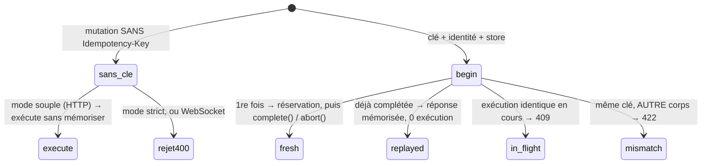
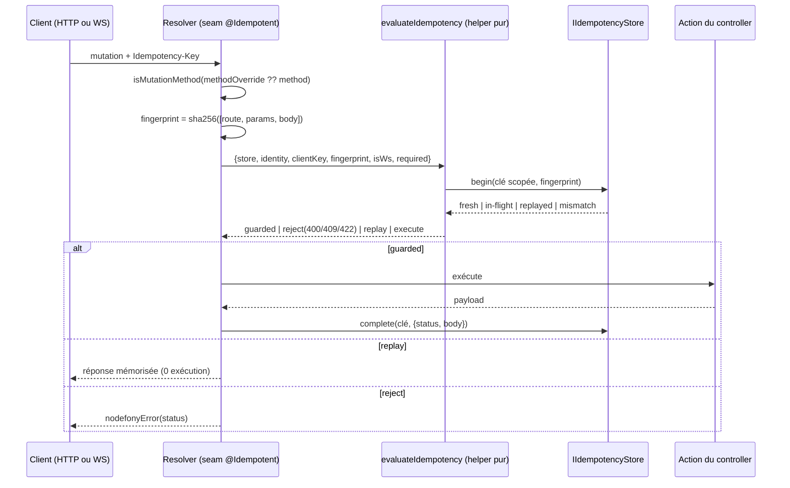

# Idempotence des mutations

> Ton client envoie `POST /charge`, le réseau coupe avant la réponse, il retente. Sans garde-fou, tu
> débites deux fois. L'idempotence garantit qu'une mutation **rejouée à l'identique ne s'exécute
> qu'une fois** — la seconde reçoit la réponse mémorisée de la première. Nodefony décide toute la
> sémantique (statuts, scope, empreinte) dans **un helper pur** partagé par HTTP et WebSocket, puis
> délègue le stockage à un **store pluggable** (mémoire, Redis, SQL).

📍 [Documentation](../../../../../docs/index.md) › [Framework](index.md) › **Idempotence**

## 🧠 Le modèle mental — un verrou par intention

C'est LA chose à comprendre. `store.begin(clé, empreinte)` est **atomique** et rend l'un de quatre
verdicts (`IdempotencyOutcome`, `src/nodefony/src/types/IIdempotencyStore.ts:34`) ; le helper les
traduit en une décision neutre que le pipeline applique.



Les quatre verdicts du store et leur traduction, décidés par `evaluateIdempotency()`
(`idempotency.ts:142`) :

- **fresh** → tu détiens la réservation : exécute l'action, puis **obligatoirement** `complete(clé,
réponse)` (succès) ou `abort(clé)` (échec). Verdict rendu : `guarded`.
- **replayed** → la réponse de la 1ʳᵉ exécution est renvoyée telle quelle, l'action **n'est pas
  rejouée**. Verdict rendu : `replay`.
- **in-flight** → une exécution identique est **déjà en cours** → `409` (le client réessaiera).
- **mismatch** → la clé a déjà servi pour un **autre** payload → `422` (`idempotency.ts:189`).

S'il ne faut retenir qu'une image : `begin` est un **verrou atomique par intention**, et tout le
reste du pipeline ne fait que traduire son verdict.

## 📖 Lexique

| Terme             | Sens (dans ce module)                                                                              |
| ----------------- | -------------------------------------------------------------------------------------------------- |
| Mutation          | Méthode non sûre : `POST`/`PUT`/`PATCH`/`DELETE` (RFC 9110 §9.2.1). GET/HEAD/OPTIONS = no-op.      |
| `Idempotency-Key` | En-tête client : un identifiant par **intention** d'écriture (convention Stripe, draft IETF).      |
| Empreinte         | SHA-256 de `route + params + corps` — détecte une clé réutilisée pour autre chose.                 |
| Bail (_lease_)    | Durée pendant laquelle une réservation _in-flight_ tient sans `complete`/`abort` (60 s).           |
| Rétention (TTL)   | Durée pendant laquelle une réponse mémorisée reste rejouable (10 min).                             |
| in-flight         | Réservation posée, pas encore complétée ni abandonnée.                                             |
| Verdict           | Décision neutre du helper : `execute` / `guarded` / `replay` / `reject`.                           |
| Scope de clé      | La clé réellement stockée = `[identité, clé client]` → anti-IDOR.                                  |
| IDOR              | _Insecure Direct Object Reference_ : lire la donnée d'autrui en devinant son identifiant.          |
| Store             | Backend qui porte les clés (`memory`, `redis`, `drizzle`) derrière le contrat `IIdempotencyStore`. |
| GC                | _Garbage Collection_ : purge périodique des clés expirées — nécessaire seulement sans TTL natif.   |
| Fail-soft         | Le store indisponible n'échoue pas la mutation : elle s'exécute **sans** dédup.                    |
| Fail-loud         | Un store distribué demandé mais non câblé fait échouer le boot plutôt que dédupliquer en silence.  |

## Qu'est-ce que c'est ?

Imagine un **ticket de vestiaire**. Tu déposes ton manteau, on te donne un numéro. Si tu présentes
deux fois le même numéro, on ne te donne pas deux manteaux : on te rend **le même**. La clé
d'idempotence est ce numéro — le client la choisit, le serveur s'engage à ne servir l'intention
qu'une fois.

Sans ce ticket, trois choses cassent :

1. **Double-effet sur rejeu** — le cœur du problème. Un retry réseau, une reconnexion WebSocket, un
   double-clic : la même intention arrive deux fois et produit deux débits, deux commandes, deux
   e-mails. Le client ne peut pas distinguer « la requête a échoué » de « la réponse s'est perdue »,
   donc il **doit** retenter ; c'est au serveur de rendre le retry inoffensif.
2. **IDOR sur le cache** — si la clé stockée était la clé brute du client, il suffirait de deviner
   `order-42` pour lire la **réponse mémorisée d'un autre utilisateur**. Nodefony stocke
   `JSON.stringify([identité, cléClient])` (`idempotency.ts:182`) : l'anti-IDOR n'est pas un contrôle
   ajouté, il est **structurel**, encodé dans la clé de cache. Le JSON sert de frontière non ambiguë
   (aucun séparateur magique qui pourrait entrer en collision).
3. **DoS du cache** — une clé arbitrairement longue, ou un flot de clés uniques, remplirait la
   mémoire. Une clé > 255 octets est traitée comme **absente** plutôt que stockée
   (`IDEMPOTENCY_KEY_MAX`, `idempotency.ts:36`) et le cache mémoire est **borné** (`DEFAULT_CAP`,
   `IdempotencyStore.ts:18`).

> [!IMPORTANT]
> L'idempotence n'est pas qu'une commodité de résilience : c'est une brique de **sécurité**. Une
> mutation rejouable sans garde-fou est un vecteur d'abus financier (double débit provoqué), et un
> cache mal scopé est une fuite de données entre comptes.

## La vision Nodefony

Le constat de conception qui compte : la sémantique IETF (quels statuts, quel scope, quelle
empreinte) est décidée dans **un helper pur**, `evaluateIdempotency()` (`idempotency.ts:142`), qui ne
connaît **aucun transport**. Il rend un verdict neutre (`IdempotencyVerdict`, `idempotency.ts:50`)
que **deux** appelants traduisent dans leur monde :

- le **data plane admin** — `AdminApiController.idempotencyGate()`
  (`AdminApiController.ts:158`) → réponse `{status, headers, body}` ;
- les **controllers userland** décorés `@Idempotent` — seam `Resolver._callWithIdempotency()`
  (`Resolver.ts:460`) → `nodefonyError` typée, ou réponse rejouée.

Conséquence pratique : il est **impossible** que l'idempotence HTTP et l'idempotence WebSocket
divergent — elles partagent la même fonction. C'est le différenciateur du framework (HTTP + WS
co-citoyens dans le même contexte controller) appliqué à une brique de sécurité.

Second choix structurant : **le stockage est pluggable**. Le contrat `IIdempotencyStore` vit au
**CORE** (`src/nodefony/src/types/IIdempotencyStore.ts:106`), pas dans `@nodefony/framework` — pour
que `@nodefony/redis` et `@nodefony/drizzle`, qui sont **sous** framework dans le graphe de
dépendances, puissent l'implémenter sans créer de cycle.

## 🚀 Démarrage rapide

Objectif : rendre `POST /api/payments/charge` rejouable sans double débit, dans une app générée par
`nodefony create app`.

### 1. Le controller — une seule ligne à ajouter

```typescript
// nodefony/controllers/PaymentController.ts — complet, compile tel quel
import {
  controller,
  Controller,
  Post,
  Body,
  Idempotent,
} from "@nodefony/framework";

interface ChargeInput {
  amount: number;
}

@controller("/api/payments")
class PaymentController extends Controller {
  // STRICT par défaut : une mutation SANS `Idempotency-Key` est rejetée 400,
  // AVANT que ton code ne tourne. Le rejeu de la MÊME clé renvoie la réponse
  // mémorisée sans ré-exécuter l'action.
  @Idempotent()
  @Post("/charge")
  async charge(@Body() body: ChargeInput) {
    // ⚠️ Retourne le PAYLOAD BRUT (pas `this.renderJson(...)`) : c'est cette
    // valeur qui est mémorisée et rejouée telle quelle.
    return { chargeId: "ch_9F2a", amount: body.amount };
  }
}

export default PaymentController;
```

(Wiring : `@controllers([PaymentController])` dans le module de l'app — `nodefony create controller`
le fait pour toi.)

### 2. Le store — rien à écrire en dev, un mot en cluster

Le store par défaut est **posé automatiquement** par le module framework (`@services([… ,
MemoryIdempotencyStore])`, `src/packages/@nodefony/framework/index.ts:40`). En mono-pod, tu n'as
rien à configurer. Pour un cluster multi-pod, nomme un store **distribué** :

```typescript
// nodefony.config.ts — extrait
use("@nodefony/framework", {
  idempotency: {
    // "auto" (défaut) suit l'infra déclarée. En cluster, nommer explicitement :
    // un nom distribué non câblé fait ÉCHOUER le boot en production (fail-loud)
    // plutôt que dédupliquer per-pod en silence.
    store: "redis",
    // Purge des clés expirées — utile UNIQUEMENT pour un store SQL (drizzle).
    gcIntervalS: 600,
  },
});
```

### 3. Ce qu'on observe

```bash
# 1) Sans clé : rejet AVANT le controller (mode strict)
curl -si -X POST http://localhost:5151/api/payments/charge \
  -H 'Content-Type: application/json' -d '{"amount":4200}' | head -1
# HTTP/1.1 400 Bad Request        ← "Idempotency-Key required"

# 2) 1er envoi avec une clé → l'action s'exécute
curl -s -X POST http://localhost:5151/api/payments/charge \
  -H 'Idempotency-Key: 3f6a9c1e-2b7d-4a10-9d31-8e5c2f0a7b64' \
  -H 'Content-Type: application/json' -d '{"amount":4200}'
# {"chargeId":"ch_9F2a","amount":4200}

# 3) Retry — MÊME clé, MÊME corps → réponse MÉMORISÉE, 0 re-débit
curl -s -X POST http://localhost:5151/api/payments/charge \
  -H 'Idempotency-Key: 3f6a9c1e-2b7d-4a10-9d31-8e5c2f0a7b64' \
  -H 'Content-Type: application/json' -d '{"amount":4200}'
# {"chargeId":"ch_9F2a","amount":4200}     ← identique, l'action n'a PAS tourné

# 4) MÊME clé, corps DIFFÉRENT → 422 (une clé = une intention)
curl -si -X POST http://localhost:5151/api/payments/charge \
  -H 'Idempotency-Key: 3f6a9c1e-2b7d-4a10-9d31-8e5c2f0a7b64' \
  -H 'Content-Type: application/json' -d '{"amount":9900}' | head -1
# HTTP/1.1 422 Unprocessable Content
```

> [!WARNING]
> **Le piège n°1** : en verdict `fresh`, la réservation est _in-flight_ tant que `complete` **ou**
> `abort` n'a pas été appelé. Le seam `@Idempotent` gère ce couple pour toi (`try/catch`,
> `Resolver.ts:539` et `Resolver.ts:563`). Si tu appelles le store **à la main** (cas avancé), c'est
> **ta** responsabilité : sans `abort` sur erreur, la clé reste bloquée jusqu'à l'expiration du bail
> (60 s), et tout rejeu identique reçoit `409` pendant ce temps.

### Le mode souple — quand la clé est optionnelle

`@Idempotent({ required: false })` honore la clé si elle est présente et exécute sinon. Utile pour
une route que d'anciens clients appellent déjà sans clé, le temps de la migration :

```ts ignore
@Idempotent({ required: false })
@Post("/subscribe")
async subscribe(@Body() body: SubscribeInput) { /* … */ }
```

Précédence **méthode > classe** (`computeIdempotent()`, `routerDecorators.ts:1561`), comme
`@UseSession`. Poser `@Idempotent()` sur la **classe** couvre toutes les mutations du controller ;
une méthode peut resserrer ou relâcher le mode. Les méthodes sûres (GET…) restent des no-op même
sous une classe décorée.

## 🔌 HTTP et WebSocket — la même porte

Une socket **reconnecte et rejoue par nature** : muter sans clé y serait un piège à double-effet
garanti. D'où la règle, dans le helper partagé : `requiredEffective = required || isWs`
(`idempotency.ts:160`). Une mutation par socket **exige toujours** une clé, même quand le mode HTTP
est souple.

| Situation                                    | `@Idempotent()` (strict) | `@Idempotent({ required:false })` |
| -------------------------------------------- | ------------------------ | --------------------------------- |
| HTTP, clé présente                           | dédup complète           | dédup complète                    |
| HTTP, clé absente                            | **400**                  | exécute sans mémoriser            |
| WebSocket (pont `api.request`), clé présente | dédup complète           | dédup complète                    |
| WebSocket, clé absente                       | **400**                  | **400** (toujours strict)         |

Deux mécanismes rendent ça possible côté socket :

- **La clé voyage par l'ALS** — le pont WS la pose dans `RequestContext`, et
  `resolveIdempotencyKey()` (`idempotency.ts:68`) donne la **priorité à l'ALS** sur l'en-tête HTTP.
- **La méthode logique voyage par `methodOverride`** — sur une socket, `context.method` vaut
  `WEBSOCKET`, qui n'est **pas** une mutation. Sans override, la porte serait sautée et un rejeu de
  frame `socket.mutate` créerait un doublon. Le Resolver teste donc
  `isMutationMethod(this.methodOverride ?? context.method)` (`Resolver.ts:473`).

Le pont utilise `executeActionGuarded()` (`Resolver.ts:425`) : porte d'idempotence **sans** rendu HTTP
— la valeur nue est enveloppée par le peer WS, jamais écrite sur un transport HTTP.

## 🏗️ Architecture interne



### Le parcours d'une mutation, étape par étape

1. **Court-circuit hot path.** `callController()` (`Resolver.ts:396`) lit `meta.idempotent` sur les
   métadonnées d'action **figées par route**. `null` sur la quasi-totalité des routes → une
   comparaison, flux normal, **zéro** lookup de store et zéro allocation.
2. **No-op sur méthode sûre.** Une action `GET` sous une classe `@Idempotent` repart directement en
   exécution (`Resolver.ts:473`).
3. **Empreinte du payload.** `computeFingerprint()` (`idempotency.ts:123`) hache
   `[nom de route, params de route, corps]` (`Resolver.ts:497`). Le corps vient de l'ALS (pont WS) ou
   du body HTTP parsé.
4. **Identité.** `resolveIdentity()` (`idempotency.ts:100`) dérive l'identité de `request.user`
   (`username` → `identifier` → `id`), avec repli sur l'`userId` de l'ALS. **`null` = pas de cache** :
   le verdict devient `execute` (`idempotency.ts:176`) — jamais de partage cross-identité.
5. **Réservation.** `store.begin()` compose la clé scopée et tranche.
6. **Mémorisation.** En succès, `complete(clé, {status, body})` où `status` est le code de réponse
   courant et `body` la **valeur retournée** par l'action (`Resolver.ts:539`). En erreur,
   `abort(clé)` libère la clé : **un échec ne se mémorise pas**, il doit rester réessayable.

> [!CAUTION]
> **La réponse mémorisée est la valeur RETOURNÉE, pas la réponse rendue.** Une action qui pilote la
> response elle-même (`this.renderJson(...)`, stream, `send()`) n'est pas rejouée fidèlement : le
> double-effet reste évité, mais le corps rejoué est vide. Pire, si le corps retourné n'est pas
> sérialisable (retour d'un objet Response circulaire), un store SQL/Redis lève au `stringify`. Le
> Resolver attrape ce cas : il **journalise un WARNING explicite** puis mémorise le statut avec un
> corps `null` (`Resolver.ts:549`) — la dédup est préservée plutôt que perdue en silence.

### Où la porte est câblée

| Appelant                     | Point d'entrée                                                       | Traduction du verdict              |
| ---------------------------- | -------------------------------------------------------------------- | ---------------------------------- |
| Controller userland HTTP     | `callController()` (`Resolver.ts:396`)                               | `nodefonyError` + rendu normal     |
| Controller userland via WS   | `executeActionGuarded()` (`Resolver.ts:425`)                         | valeur nue, enveloppée par le peer |
| Data plane admin `/nodefony` | `AdminApiController.idempotencyGate()` (`AdminApiController.ts:158`) | `{status, headers, body}`          |

## ⚙️ Configuration

Source unique = schéma Zod `idempotencySchema`
(`src/packages/@nodefony/framework/nodefony/config/config.ts:42`).

| Option        | Type      | Défaut   | Effet                                                                                                                       |
| ------------- | --------- | -------- | --------------------------------------------------------------------------------------------------------------------------- |
| `store`       | `string`  | `"auto"` | Backing du cache. `auto` suit l'infra déclarée ; `memory` / `redis` / `drizzle` sont explicites (`config.ts:43`).           |
| `gcIntervalS` | `int ≥ 0` | `600`    | Intervalle de purge des clés expirées, **hors** hot-path. Sans effet pour `redis` (TTL natif) et `memory` (`config.ts:57`). |
| `gcJitter`    | `bool`    | `true`   | Étale le départ du GC par process — anti _thundering-herd_ sur un store SQL partagé (`config.ts:68`).                       |

### Comment `store: "auto"` se résout VRAIMENT

`Framework.onKernelBoot()` (`src/packages/@nodefony/framework/index.ts:189`) délègue à
`resolveAutoStore("ephemeral", …)` (`src/nodefony/src/config/infra.ts:241`), borné aux backends
**réellement enregistrés** (`listIdempotencyBackends()`, `idempotencyStoreRegistry.ts:81`). L'ordre
réel est le suivant :

| Ordre | Condition                                                                | Résolution                             | Ancre          |
| ----- | ------------------------------------------------------------------------ | -------------------------------------- | -------------- |
| 1     | `NF_STORE=<x>` et `<x>` enregistré pour cette brique                     | `<x>` (override global)                | `infra.ts:251` |
| 2     | Infra **cache** déclarée (`NF_REDIS_URL`) et `redis` enregistré          | `redis`                                | `infra.ts:258` |
| 3     | Infra **database** déclarée (`NF_DATABASE_URL`) et le backend enregistré | `drizzle` (SQL) / `mongoose` (Mongo)   | `infra.ts:261` |
| 4     | Une préférence existait mais son backend n'est pas enregistré            | `fallback` = `memory`, raison ANNONCÉE | `infra.ts:274` |
| 5     | **Aucune infra déclarée** mais un backend local persistant est chargé    | `drizzle`, puis `mongoose`             | `infra.ts:288` |
| 6     | Rien de tout ça                                                          | `memory` (volatil)                     | `infra.ts:295` |

> [!NOTE]
> L'étape **5** surprend souvent : dans une app dev qui charge `@nodefony/drizzle` **sans** déclarer
> `NF_DATABASE_URL`, `auto` ne résout **pas** vers `memory` mais vers `drizzle` (SQLite local) — pour
> que les données survivent au redémarrage. La résolution effective est toujours **journalisée au
> boot** (`index.ts:207`) : lis cette ligne plutôt que de la déduire.

MongoDB mérite une mention : `mongoose` n'implémente **pas encore** de store d'idempotence. Déclarer
`NF_DATABASE_URL=mongodb://…` fait donc tomber la résolution en étape **4** → repli `memory` avec la
raison annoncée — et un repli `memory` en cluster ne déduplique plus rien entre pods : le rejeu que
cette brique promet d'empêcher passe sur un autre pod. En attendant le store Mongo (objectif « full
NoSQL », `MIGRATION_STATUS.md` P7.11), la dédup cross-pod passe par `redis`.

### Le contrat de dégradation : fail-loud, jamais silencieux

Quand un store **explicitement nommé** ne peut pas s'initialiser (nom inconnu, `redis` demandé sans
le module `@nodefony/redis` chargé), la politique dépend de l'environnement
(`index.ts:132`) :

- **production** → **boot avorté** (`index.ts:281`). En cluster multi-pod, dégrader vers un cache
  per-pod produirait du double-effet non dédupliqué : c'est un défaut de sécurité, pas une commodité.
- **dev / test** (mono-pod) → **WARNING fort + repli sur le cache mémoire** déjà en place. La dédup
  per-pod suffit hors cluster, et on ne casse pas le routeur pour une option d'infra absente en local.

Un garde-fou supplémentaire : `store: "memory"` **en production** émet un WARNING dédié
(`index.ts:212`) — la dédup n'y est que per-pod.

## 🧩 Les stores d'idempotence

Tous respectent le même contrat `IIdempotencyStore`
(`src/nodefony/src/types/IIdempotencyStore.ts:106`) : `begin` / `complete` / `abort` obligatoires,
`gc` **optionnel**, plus `listPage` et `size` pour l'introspection.

### Choisir en 5 secondes

| Store     | Atomicité de `begin`                            | Expiration         | `gc()` | Multi-pod | Pour…                                    |
| --------- | ----------------------------------------------- | ------------------ | :----: | :-------: | ---------------------------------------- |
| `memory`  | mono-thread JS                                  | passive + cap FIFO |   ❌   |    ❌     | dev, tests, mono-pod                     |
| `redis`   | `SET … NX PX`                                   | TTL natif (`PX`)   |   ❌   |    ✅     | cluster — le choix par défaut recommandé |
| `drizzle` | `INSERT … ON CONFLICT DO UPDATE … WHERE expiré` | applicative        |   ✅   |    ✅     | cluster qui a déjà du SQL, pas de Redis  |

### `memory` — le défaut per-pod, gratuit

`MemoryIdempotencyStore` (`IdempotencyStore.ts:44`) est enregistré d'office comme service DI
`idempotencyStore` par le manifeste `@services` du module framework — zéro configuration.

- **Atomicité par le mono-thread JS** : `begin()` (`IdempotencyStore.ts:107`) lit et écrit la `Map`
  sans point de suspension → deux `begin` concurrents ne peuvent pas se croiser.
- **Constantes** : rétention `DEFAULT_TTL_MS` = 600 s (`IdempotencyStore.ts:14`), bail
  `DEFAULT_LEASE_MS` = 60 s (`IdempotencyStore.ts:16`), plafond `DEFAULT_CAP` = 1000 entrées
  (`IdempotencyStore.ts:18`). Elles ne sont **pas** configurables.
- **Lazy** : la `Map` n'est allouée qu'au **1ᵉʳ** `begin` (`IdempotencyStore.ts:46`) ; aucun timer,
  aucun listener.
- **Purge passive** : les entrées expirées ne sont retirées qu'à l'écriture, dans `evictIfNeeded()`
  (`IdempotencyStore.ts:164`), qui purge d'abord les mortes puis évince en **FIFO** jusqu'à repasser
  sous le cap. Coût nul tant qu'on n'écrit pas.
- **Garde anti-résurrection** : `complete()` (`IdempotencyStore.ts:134`) n'écrit **que** si la clé est
  encore _notre_ in-flight — jamais de résurrection d'une clé déjà `abort`-ée ou évincée.

⚠️ Limite structurelle : la dédup est **affine au pod**. Un rejeu routé vers un autre pod n'est pas
dédupliqué.

### `redis` — le choix cluster

`RedisIdempotencyStore` (`RedisIdempotencyStore.ts:121`) vit dans `@nodefony/framework` (le
consommateur du contrat), pas dans `@nodefony/redis` : il résout le service `redis` **par nom** dans
le container (couplage structurel, zéro dépendance directe, zéro cycle). La fabrique est enregistrée
au chargement du module framework (`index.ts:119`).

- **`SET key … NX PX`** = réservation atomique **côté serveur** (`RedisIdempotencyStore.ts:237`) : le
  `409` in-flight fonctionne vraiment entre pods. Deux requêtes concurrentes sur deux pods, un seul
  `SET NX` gagne.
- **TTL natif** sur le bail _et_ sur la réponse mémorisée → `gc()` **superflu**, donc **non
  implémenté** : rien à planifier.
- **Empreinte préservée à la complétion** : `complete()` (`RedisIdempotencyStore.ts:300`) **relit**
  l'entrée in-flight pour reporter son empreinte dans l'entrée `done`. Sans cela, un rejeu de la clé
  avec un autre payload **après** complétion ne serait plus détecté (le 422 serait perdu).
- **Course rare gérée** : si la clé expire entre le `SET NX` échoué et le `GET`, la réservation est
  retentée **une** fois ; encore prise → `in-flight` (`RedisIdempotencyStore.ts:258`).
- **Namespace** : `nf:idem:<clé>` (`RedisIdempotencyStore.ts:11`).
- **Dégradation gracieuse** : connexion `main` fermée (boot / shutdown) → `begin` renvoie `fresh`,
  `complete`/`abort` sont des no-op. La mutation s'exécute **sans dédup** plutôt que d'être bloquée.

> [!WARNING]
> Ce fail-soft est un **compromis assumé** : pendant une coupure Redis, un rejeu peut ré-exécuter la
> mutation. Le client rejouera sa clé au rétablissement. Si ton domaine ne tolère aucun double-effet,
> traite l'indisponibilité du store comme un incident bloquant en amont (readiness du pod).

### `drizzle` — le cluster sans Redis

`DrizzleIdempotencyStore` (`DrizzleIdempotencyStore.ts:102`). Motivation : un cluster qui possède
déjà Postgres mais pas Redis obtient la dédup cross-pod **sans nouvelle infra**.

- **Réservation atomique en UNE instruction** — un `INSERT` avec
  `onConflictDoUpdate` (`DrizzleIdempotencyStore.ts:234`) dont la garde `setWhere` ne réécrit que si
  l'entrée est morte (`DrizzleIdempotencyStore.ts:244`). Le `returning` ne rend une ligne que si
  l'INSERT a passé (clé neuve) ou si le `DO UPDATE` a **volé** une entrée expirée → `fresh`. Zéro
  ligne = contention → on lit l'état réel.
- **Invariant capital** : le store ne renvoie **jamais** `fresh` hors réservation atomique gagnée.
  Même la course rare « la clé a expiré entre l'upsert et le SELECT » renvoie prudemment `in-flight`
  (`DrizzleIdempotencyStore.ts:264`), jamais `fresh`.
- **MySQL/MariaDB** : ni `RETURNING`, ni `WHERE` sur l'`ON DUPLICATE KEY UPDATE`, et un `affectedRows`
  ambigu → la réservation passe par `reserveIdempotencyKeyMysql()`
  (`DrizzleIdempotencyStore.ts:213`), qui la reconstruit en deux instructions chacune atomique.
- **Pas de TTL natif** → `gc()` (`DrizzleIdempotencyStore.ts:318`) = `DELETE WHERE expiresAt <= now`.
  C'est le **seul** store qui expose `gc`, donc le seul que le framework planifie (voir plus bas).
- **Mutations conditionnelles** : `complete()` (`DrizzleIdempotencyStore.ts:276`) et `abort()`
  (`DrizzleIdempotencyStore.ts:294`) portent `WHERE state = 'if'` — jamais d'écrasement d'une réponse
  déjà mémorisée, jamais de résurrection d'une clé libérée. `complete` ne touche pas `fingerprint`.
- **Résolution lazy + dégradation gracieuse** : le handle Drizzle est résolu à **chaque** appel
  (`DrizzleIdempotencyStore.from()`, `DrizzleIdempotencyStore.ts:172`). ORM non connecté → `begin`
  renvoie `fresh` (sans dédup), le reste est no-op.

Le câblage est **automatique** : charger `@nodefony/drizzle` enregistre l'entité **et** la fabrique
(`registerStores.ts:316`). Activation = `store: "drizzle"` (ou `NF_IDEMPOTENCY_STORE=drizzle`), rien
d'autre à écrire.

### Le GC — armé pour un seul store

`scheduleIdempotencyGc()` (`idempotencyGc.ts:32`) arme un `GcScheduler` **uniquement si le store
expose `gc()`** (`idempotencyGc.ts:37`). Un store à TTL natif (`redis`) ou à purge passive (`memory`)
ne l'expose pas ; le brancher sur un timer serait un no-op coûteux. Le scheduler est armé au boot
(`nodefony/framework/index.ts:311`) et arrêté à `onTerminate`.

`gcIntervalS: 0` désarme le timer — à réserver au cas où la purge est déléguée (cron, `CronJob` k8s).

## 🗄️ Entité de persistance (store SQL)

Table `idempotency_key`, décrite par une **spec colKit** unique
(`idempotencyEntity.ts:66`) déclinée par dialecte via `createIdempotencyTable(dialect)`
(`idempotencyEntity.ts:85`).

| Colonne       | Type logique | SQLite             | PostgreSQL | MySQL / MariaDB | Rôle                                                                                  |
| ------------- | ------------ | ------------------ | ---------- | --------------- | ------------------------------------------------------------------------------------- |
| `key`         | text (PK)    | `text`             | `text`     | `varchar(512)`  | Clé **déjà scopée** `[identité, clé]`. Sa contrainte d'unicité **porte** l'atomicité. |
| `fingerprint` | text         | `text`             | `text`     | `text`          | Empreinte du payload ; différente pour la même clé vivante ⇒ 422.                     |
| `state`       | text         | `text`             | `text`     | `text`          | `if` (in-flight) \| `done` (réponse mémorisée).                                       |
| `response`    | json         | `text mode:"json"` | `jsonb`    | `json`          | Réponse mémorisée `{status, headers?, body}` ; `null` tant qu'in-flight.              |
| `expiresAt`   | epoch ms     | `integer` 64-bit   | `bigint`   | `bigint`        | Bail (60 s) puis rétention (10 min). **Indexé** — accélère le `gc`.                   |

Deux détails qui expliquent des surprises réelles :

- **`varchar(512)` en MySQL** n'est pas un caprice : un `TEXT` InnoDB n'est pas indexable sans
  préfixe, et 512 caractères couvrent `JSON.stringify([identité, clé ≤ 255])`.
- **Aucun `DEFAULT` SQL** : le DDL dérivé n'en émet pas (`idempotencyEntity.ts:38`). Toutes les
  colonnes sont posées explicitement par le store — jamais d'INSERT cassé par un défaut manquant.

`registerIdempotencyEntities(connector, dialect)` (`idempotencyEntity.ts:146`) doit être appelé
**avant** `orm.connect()` (la table est créée au connect) — le module drizzle s'en charge tout seul.

> [!NOTE]
> **SQLite = banc de test de la sémantique.** Un fichier SQLite est mono-machine (verrou d'écriture)
> → aucun intérêt multi-pod (`idempotencyEntity.ts:26`). La cible réelle est PostgreSQL ou
> MySQL/MariaDB, où l'atomicité de l'instruction tient sous concurrence inter-pods.

## 🗃️ Dialectes et bases pris en charge

| Backing         | Base                     | Atomicité / expiration                          | Multi-pod | GC applicatif |
| --------------- | ------------------------ | ----------------------------------------------- | :-------: | :-----------: |
| `redis`         | Redis                    | `SET NX` + TTL natif (`PX`)                     |    ✅     |      n/a      |
| `drizzle` (SQL) | PostgreSQL               | `INSERT … ON CONFLICT DO UPDATE … WHERE expiré` |    ✅     |      ✅       |
| `drizzle` (SQL) | MySQL 8.4 / MariaDB 11.4 | `INSERT IGNORE` + `UPDATE … WHERE expiré`       |    ✅     |      ✅       |
| `drizzle` (SQL) | SQLite                   | idem, mais mono-machine → **test**              |    ❌     |      ✅       |
| `memory`        | RAM du pod               | mono-thread JS ; cap FIFO 1000 ; TTL 10 min     |    ❌     |      n/a      |

> [!CAUTION]
> **MongoDB (`@nodefony/mongoose`) n'implémente PAS de store d'idempotence.** Sélectionner
> `store: "mongoose"` échoue à la résolution (fail-loud) ; laisser `auto` avec une infra Mongo replie
> sur `memory` avec une raison annoncée. En cluster Mongo, la dédup passe par `redis`.

## 🧰 API publique

Signatures complètes : `.ai/symbols.json`. Ce qui compte à l'usage :

### Le décorateur

`@Idempotent(options?)` (`routerDecorators.ts:1103`) — dual **classe + méthode**. N'écrit que des
métadonnées (`IdempotentMeta`, `routerDecorators.ts:443`), zéro import de `@nodefony/security`, zéro
cycle. La porte est appliquée par le Resolver.

### Le contrat de store

| Membre                    | Obligatoire | Rôle                                                                                                            |
| ------------------------- | :---------: | --------------------------------------------------------------------------------------------------------------- |
| `begin(key, fingerprint)` |     ✅      | Réserve atomiquement, rend le verdict (`src/nodefony/src/types/IIdempotencyStore.ts:118`).                      |
| `complete(key, response)` |     ✅      | Mémorise la réponse d'une clé in-flight → rejeux futurs = `replayed`.                                           |
| `abort(key)`              |     ✅      | Libère une clé in-flight dont l'exécution a échoué. Rien n'est mémorisé.                                        |
| `gc(now?)`                |     ❌      | Purge des expirées — **uniquement** sans expiration native (`src/nodefony/src/types/IIdempotencyStore.ts:139`). |
| `listPage(query)`         |     ✅      | Page de clés vivantes, pour l'introspection admin (`src/nodefony/src/types/IIdempotencyStore.ts:153`).          |
| `size`                    |     ✅      | Nombre d'entrées vivantes, **sync best-effort** (`src/nodefony/src/types/IIdempotencyStore.ts:159`).            |

Les helpers du seam sont exportés et réutilisables : `isMutationMethod()` (`idempotency.ts:28`),
`resolveIdempotencyKey()` (`idempotency.ts:68`), `resolveIdentity()` (`idempotency.ts:100`),
`computeFingerprint()` (`idempotency.ts:123`), `evaluateIdempotency()` (`idempotency.ts:142`).

### `listPage` — capacités RÉELLES par store

Le contrat annonce **deux modes** exclusifs, chaque store déclarant celui qu'il sait faire. Voici ce
que le code fait, store par store — à lire avant d'écrire un client :

<!-- prettier-ignore -->
| Capacité | `memory` | `drizzle` (SQL) | `redis` |
| --- | --- | --- | --- |
| Mode | **offset** | **offset** | **curseur** |
| `offset` | ✅ | ✅ | ❌ **ignoré** |
| `total` (`withTotal`) | ✅ (refusable) | ✅ (refusable, `COUNT`) | ❌ **jamais** rendu |
| `cursor` / `nextCursor` | ❌ **ignoré** | ❌ **ignoré** | ✅ curseur composite |
| Ordre | `expiresAtMs` ASC | `expiresAtMs` ASC, `key` ASC | ❌ **aucun ordre garanti** |
| `order` (tri demandé) | ❌ ignoré | ❌ ignoré | ❌ ignoré |
| `q` (préfixe de clé) | ✅ `startsWith` | ✅ `LIKE` ancré, `%`/`_` échappés | ✅ descendu dans `MATCH` |
| `state` | ✅ | ✅ | ✅ (filtre après lecture) |
| Page pleine à `limit` | ✅ | ✅ | ❌ peut être plus courte |
| Exclusion des expirées | ✅ à la lecture | ✅ `expiresAt > now` | ✅ par TTL natif |
| Ancre | `IdempotencyStore.ts:72` | `DrizzleIdempotencyStore.ts:340` | `RedisIdempotencyStore.ts:166` |

Le mode **curseur** de Redis mérite une explication, parce qu'il piège : `SCAN COUNT` **n'est pas un
plafond** mais un indice d'effort — Redis peut rendre plus de clés que demandé. Sans précaution, la
page dépasserait `limit` et violerait le contrat `IPage` (`src/nodefony/src/types/IPage.ts:108`). D'où
le **curseur composite** `"<consommé>:<curseurRedis>"` (`encodeCursor()`,
`RedisIdempotencyStore.ts:57`) : on ne rend que `limit` éléments et on mémorise combien de clés du
lot ont été consommées ; la page suivante rejoue le **même** `SCAN` et reprend là.

> [!IMPORTANT]
> **Une clé rendue par `listPage` ne contient JAMAIS la réponse mémorisée ni l'empreinte.**
> `IIdempotencyKeyEntry` (`src/nodefony/src/types/IIdempotencyStore.ts:51`) n'expose que `key`,
> `state`, `expiresAtMs` et `hasResponse` (un booléen). Le corps mémorisé est la donnée métier d'un
> utilisateur : le laisser sortir par ce chemin recréerait exactement l'IDOR sur le cache que le
> scope de clé interdit.

Deux réserves à connaître :

- Le champ `tenantId` d'`IPageQuery` est un **slot réservé** au multi-tenant : le passer n'a
  aujourd'hui **aucun effet de filtrage**.
- `size` est une **approximation per-pod** pour les stores distribués (compteur local incrémenté au
  `fresh`, décrémenté au `complete`/`abort`), désalignée cross-pod et non décrémentée si un bail
  expire sans complétion. La vérité cluster passe par la base ou `redis-cli`, jamais par ce getter.

## 🧩 Extension — brancher son propre store

Le registre (`idempotencyStoreRegistry.ts`) ne porte que les **overrides distribués opt-in** : le
défaut mémoire est posé par `@services`, jamais par le registre.

```ts ignore
import { registerIdempotencyStore } from "@nodefony/framework";
import type { IIdempotencyStore } from "nodefony";

registerIdempotencyStore("mon-backend", (ctx) => {
  // ctx.module → container kernel (résoudre un service par NOM, jamais d'import direct)
  // ctx.config → config framework validée + gelée
  return new MonStore(/* … */) satisfies IIdempotencyStore;
});
```

Trois règles héritées du code existant, à respecter sous peine de double-effet :

1. **`begin` doit être atomique côté backend.** Un `GET` puis `SET` séparés laissent deux retries
   concurrents obtenir `fresh` — précisément ce que l'idempotence doit empêcher.
2. **Ne jamais rendre `fresh` hors réservation gagnée.** En cas de doute (course, état illisible),
   rendre `in-flight` : le client réessaiera, c'est sans danger.
3. **`complete` doit préserver l'empreinte** de l'entrée in-flight, sinon un rejeu avec un autre
   payload après complétion ne produit plus de 422.

Fonctions du registre : `registerIdempotencyStore()` (`idempotencyStoreRegistry.ts:48`),
`getIdempotencyStoreFactory()` (`idempotencyStoreRegistry.ts:56`), `listIdempotencyStores()`
(distribués seuls, `idempotencyStoreRegistry.ts:67`), `listIdempotencyBackends()` (avec `memory`,
pour l'affichage Studio, `idempotencyStoreRegistry.ts:81`).

## 📜 Normes appliquées

<!-- prettier-ignore -->
| Sujet | Norme | Ancrage |
| --- | --- | --- |
| En-tête `Idempotency-Key`, statuts, rejeu | `draft-ietf-httpapi-idempotency-key-header-06` | `evaluateIdempotency()` (`idempotency.ts:142`) |
| Clé réutilisée avec un autre payload → 422 | draft §2.2 / §2.7 | `idempotency.ts:189` |
| Exécution concurrente identique → 409 | draft §2.6 | `idempotency.ts:197` |
| Clé requise absente → 400 | draft §2.7 | `idempotency.ts:165` |
| Méthodes non sûres = mutations | RFC 9110 §9.2.1 | `MUTATION_METHODS` (`idempotency.ts:25`) |
| Sémantique du 422 | RFC 9110 §15.5.21 | `IdempotencyVerdict` (`idempotency.ts:50`) |
| Borne de clé (convention Stripe) | 255 octets | `IDEMPOTENCY_KEY_MAX` (`idempotency.ts:36`) |

## ⚡ Performance et mémoire

Le coût est **nul hors mutations décorées**. Sans `@Idempotent`, `RouteActionMeta.idempotent` vaut
`null` (`routerDecorators.ts:1103`) : `callController()` fait **une comparaison** et repart en flux
normal — zéro lookup de container, zéro `await` supplémentaire, zéro allocation (`Resolver.ts:396`).
La métadonnée est **figée par route** et mémoïsée : aucune lecture `Reflect` par requête.

Sur le chemin décoré :

- Le store mémoire n'alloue sa `Map` qu'au 1ᵉʳ `begin`, ne pose **aucun timer ni listener**, et purge
  en passif (`IdempotencyStore.ts:164`).
- L'empreinte est un hash SHA-256 court → comparaison O(1), et le payload n'est jamais conservé en
  clair.
- Le GC est **hors hot-path** et armé pour un seul store (SQL) ; le jitter évite que N pods purgent
  au même instant.
- Un store distribué ajoute **un aller-retour réseau** par mutation (`begin`), plus un au `complete`.
  C'est le prix de la dédup cross-pod, payé uniquement sur les routes décorées.

Constat honnête : **il n'existe pas de banc de charge dédié à l'idempotence**. La porte est un chemin
froid par construction ; si ton profil de trafic la place sur un chemin chaud, mesure-la avec le skill
`nodefony-load-test`.

## 📡 Observabilité — Studio

Trois surfaces existent aujourd'hui :

- **Playground** (`/nodefony/playground`) — chaque mutation protégée porte un badge `@Idempotent` (strict ou souple)
  (`playground/PlaygroundFormat.tsx:69`). L'écran génère une clé par exécution et propose « Rejouer
  même clé » dès que `action.guards.idempotent` est posé (`playground/ActionPanel.tsx:516`) : c'est la
  façon la plus rapide de voir un rejeu, un `409` ou un `422` en vrai.
- **Stores** — la brique `idempotency` y apparaît avec sa nature **éphémère**, le backend configuré,
  le backend résolu, la liste des backends disponibles et la raison de la résolution — brique
  `idempotency` (`stores/storesModel.ts:150`). C'est là qu'on vérifie qu'`auto` a choisi ce qu'on
  croyait.
- **ERD** — la table `idempotency_key` est regroupée sous `@nodefony/framework`
  (`idempotencyEntity.ts:133`), pas sous l'ORM qui l'héberge.

> [!NOTE]
> Il n'existe **pas encore** d'écran ni d'endpoint admin listant les clés d'idempotence vivantes :
> `listPage` est implémenté par les trois stores et couvert par un banc de contrat, mais aucun
> producteur `/nodefony/<ns>/api/*` ne l'expose. Pour inspecter le parc en attendant : `redis-cli
--scan --pattern 'nf:idem:*'`, ou un `SELECT` sur `idempotency_key`.

## ⚠️ Pièges

| Symptôme                                               | Cause (dans le code)                                                                 | Correction                                                                   |
| ------------------------------------------------------ | ------------------------------------------------------------------------------------ | ---------------------------------------------------------------------------- |
| Rejeu qui renvoie un corps **vide**                    | L'action a retourné `this.renderJson(...)` au lieu du payload (`Resolver.ts:549`)    | Retourner la **valeur brute** ; un WARNING le signale déjà dans les logs     |
| `409` en boucle sur un endpoint                        | Action qui lève avant `complete`/`abort` → in-flight bloqué jusqu'au bail (60 s)     | Le seam le gère ; en usage manuel du store, `try/finally` obligatoire        |
| `422 Idempotency-Key is already used`                  | Même clé, **payload différent** (empreinte ≠, `idempotency.ts:189`)                  | Une clé = une intention ; nouvelle clé par requête distincte                 |
| Rien n'est dédupliqué **malgré** la clé                | Pas d'identité fiable → verdict `execute` (`idempotency.ts:176`)                     | S'assurer que le firewall a résolu l'utilisateur **avant** la mutation       |
| Rien n'est dédupliqué, clé « un peu longue »           | Clé > 255 octets → traitée comme **absente** (`idempotency.ts:36`)                   | Utiliser un UUID ; en mode strict la requête part en 400, pas en silence     |
| Dédup qui saute en cluster                             | `store: memory` (per-pod)                                                            | `redis` (`SET NX`) ou `drizzle` (Postgres/MySQL)                             |
| `400 Idempotency-Key required` inattendu               | Mode strict par défaut, **ou** requête WebSocket (toujours stricte)                  | Envoyer la clé, ou `@Idempotent({ required:false })` — sans effet en WS      |
| `auto` résout `drizzle` alors qu'on attendait `memory` | Repli local persistant quand aucune infra n'est déclarée (`infra.ts:288`)            | Comportement voulu ; forcer avec `store: "memory"` ou `NF_STORE=memory`      |
| Boot qui échoue en prod sur l'idempotence              | Store distribué nommé mais non câblé → fatal (`index.ts:132`)                        | Charger le module manquant (`@nodefony/redis`) ou corriger le nom            |
| Aucune purge sur un store SQL                          | `intervalS` à 0 → scheduler désarmé, dit dans le log de boot (`idempotencyGc.ts:49`) | Remettre un intervalle, ou assumer une purge externe (cron)                  |
| `listPage` : `total` toujours absent                   | Backend Redis = mode **curseur**, `total` jamais rendu                               | Boucler sur `nextCursor` ; ne pas coder de pagination par offset côté client |

## 🧪 Tests et couverture

Les chiffres exacts vivent dans la carte régénérée depuis vitest — jamais figés ici. Le répertoire des
familles couvertes :

- **Unitaires** (`@nodefony/framework`) : `idempotency.test.ts` (les verdicts, la résolution de clé,
  l'identité, l'empreinte) · `IdempotencyStore.test.ts` (store mémoire : réservation, empreinte,
  isolation des identités, expiration, borne mémoire) · `RedisIdempotencyStore.test.ts` (réservation
  atomique, rejeu, libération, TTL natif, course `SET NX` puis `GET` vide) ·
  `idempotencyStoreRegistry.test.ts` (registre) · `idempotencyGc.test.ts` (armement conditionnel du
  GC) · `resolverIdempotency.test.ts` (le **seam** Resolver : rejeu sans ré-exécution, scope
  d'identité).
- **Intégration** (`@nodefony/drizzle`) : `idempotency-store.test.ts` (sémantique séquentielle SQLite)
  et `idempotency-pagination.test.ts` (listing déroulé sur les **trois** dialectes depuis un seul
  fichier).
- **E2E base réelle** : `idempotency-mysql.e2e.test.ts` (verdicts, vol d'entrée expirée, concurrence
  deux pods), gaté par `NF_MYSQL_URL`.
- **Banc de contrat** : `idempotencyPaginationContract.ts` (core) — **une** suite backend-agnostique
  branchée sur mémoire, Redis et Drizzle × 3 dialectes. Elle porte une exigence de **sécurité** autant
  que de pagination : un backend qui laisserait remonter la réponse mémorisée fait échouer le test
  marqué 🔒.

Ce qui **manque**, dit franchement :

- Aucun **test de charge** dédié à la porte d'idempotence.
- Le mode **curseur** de Redis n'est prouvé que contre un **double déterministe** (`FakeRedis`), pas
  contre un serveur Redis réel — alors que le curseur composite existe justement à cause d'un
  comportement (`SCAN COUNT` n'est pas un plafond) observé sur un serveur réel.
- L'atomicité **cross-pod** est prouvée sur PostgreSQL et MySQL/MariaDB ; SQLite ne valide que la
  sémantique séquentielle (mono-fichier).

Couverture : `npm run coverage` dans `@nodefony/framework` et `@nodefony/drizzle`. Skills utiles :
`nodefony-load-test` (charge), `nodefony-check-memory-health` (mémoire), `nodefony-security-review`
(revue sécurité).

## 🔗 Pour aller plus loin

- ⬆️ **Retour au hub** : [@nodefony/framework — vue du module](index.md) · [Toute la documentation](../../../../../docs/index.md)
- 🧭 **Pages sœurs** : [Pipeline de requête](../../../../../docs/architecture/pipeline-requete.md) · [Firewall (l'identité qui scope la clé)](../../security/docs/firewall.md)
- 🗄️ **Stores distribués** : [@nodefony/redis](../../redis/docs/index.md) · [@nodefony/drizzle](../../drizzle/docs/index.md)
- 📖 **Contrat de pagination** partagé par tous les stores : `IPage` / `IPageQuery`
  (`src/nodefony/src/types/IPage.ts:18`)
- 🧠 **Contexte de requête** (ALS : identité, clé WS, corps) → [request-context](../../../../nodefony/docs/request-context.md)
