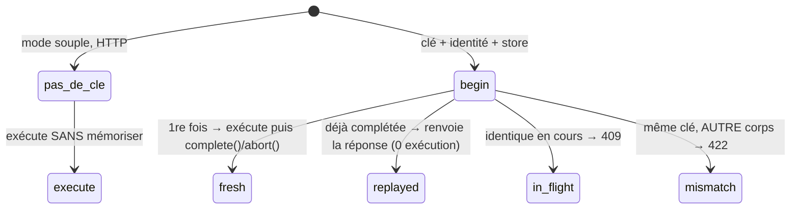

# Idempotence des mutations

> Le problème concret : ton client envoie `POST /charge`, le réseau coupe avant la réponse, il retente.
> Sans garde-fou, tu débites deux fois. L'idempotence garantit qu'une mutation **rejouée à l'identique
> ne s'exécute qu'une fois** — la seconde reçoit la réponse mémorisée de la première. Nodefony décide
> toute la sémantique (statuts, scope, empreinte) à **un seul endroit**, un helper pur partagé par HTTP
> et WebSocket. Tout ci-dessous est ancré sur le code.

## Le modèle mental — une machine à états

C'est LA chose à comprendre. `store.begin(clé, empreinte)` est atomique et renvoie l'un de cinq
verdicts (`idempotency.ts:50`, `evaluateIdempotency` `:142`) ; chacun dicte QUOI faire :



- **fresh** → tu détiens la réservation : exécute l'action, puis **obligatoirement** `complete(clé,
réponse)` (succès) ou `abort(clé)` (échec).
- **replayed** → la réponse de la 1re exécution est renvoyée telle quelle, l'action **n'est pas
  rejouée**.
- **in-flight** → une exécution identique est **déjà en cours** → `409` (le client réessaiera).
- **mismatch** → la clé a déjà servi pour un **autre** payload → `422` (draft §2.7 / RFC 9110 §15.5.21).

Si tu retiens une seule image, c'est celle-ci : `begin` est un **verrou atomique par intention**, et le
reste du pipeline traduit son verdict.

## Lexique

| Terme             | Sens (dans ce module)                                                                         |
| ----------------- | --------------------------------------------------------------------------------------------- |
| Mutation          | Méthode non sûre : `POST`/`PUT`/`PATCH`/`DELETE` (RFC 9110 §9.2.1). GET/HEAD/OPTIONS = no-op. |
| `Idempotency-Key` | En-tête client, un identifiant par **intention** d'écriture (convention Stripe).              |
| Empreinte         | SHA-256 de `route + params + corps` — détecte une clé réutilisée pour autre chose.            |
| in-flight         | Réservation posée mais pas encore `complete`/`abort` (bail de 60 s).                          |
| Verdict           | Décision neutre rendue par le helper : `execute`/`guarded`/`replay`/`reject`.                 |
| Scope de clé      | La clé réellement stockée = `[identité, clé client]` → anti-IDOR.                             |

## Qu'est-ce que ça bloque, concrètement

Trois failles, toutes traitées dans le code — et ce n'est pas que de la résilience :

1. **Double-effet sur rejeu** (retry réseau, reconnexion WebSocket, double-clic) — le cœur.
2. **IDOR** : un utilisateur ne peut **jamais** rejouer la clé d'un autre, parce que la clé stockée est
   `JSON.stringify([identité, cléClient])` (`idempotency.ts:182`). L'anti-IDOR n'est pas un contrôle
   ajouté : il est **structurel**, encodé dans la clé de cache. Le JSON sert de frontière non ambiguë
   (pas de séparateur magique qui pourrait entrer en collision).
3. **DoS du cache** : une clé > 255 octets est traitée comme **absente** plutôt que stockée
   (`IDEMPOTENCY_KEY_MAX`, `idempotency.ts:36`), et le cache mémoire est **borné** (cap FIFO,
   `IdempotencyStore.ts:18`).

## La vision Nodefony — une seule vérité normative

Le constat de conception qui compte : la sémantique IETF (quels statuts, quel scope, quelle empreinte)
est décidée dans **un helper pur**, `evaluateIdempotency` (`idempotency.ts:142`), qui **ne connaît
aucun transport**. Il rend un verdict neutre que **deux** appelants traduisent dans leur monde : le
data plane admin (réponse HTTP `{status,headers,body}`) et les contrôleurs userland `@Idempotent` (seam
`Resolver`). Conséquence pratique : impossible que l'idempotence HTTP et l'idempotence WebSocket
divergent — elles partagent la même fonction. C'est le différenciateur du framework (HTTP+WS unifiés)
appliqué à une brique de sécurité.

## Démarrage rapide — et la discipline qui te piège

```typescript
import {
  Controller,
  controller,
  Post,
  Idempotent,
  Body,
} from "@nodefony/framework";

@controller("/api/payments")
class PaymentController extends Controller {
  @Idempotent() // STRICT par défaut : POST sans Idempotency-Key → 400
  @Post("/charge")
  async charge(@Body() body: unknown) {
    return this.renderJson(await this.get("billing").charge(body));
  }
}
```

Le scénario réel, côté client — **même clé sur chaque tentative** :

```http
POST /api/payments/charge          →  1er envoi
Idempotency-Key: 3f6a9c1e-…        { "amount": 4200 }
HTTP/1.1 200 OK                     { "chargeId": "ch_9F2a" }   ← exécuté une fois

POST /api/payments/charge          →  retry (réseau coupé), MÊME clé
Idempotency-Key: 3f6a9c1e-…        { "amount": 4200 }
HTTP/1.1 200 OK                     { "chargeId": "ch_9F2a" }   ← REJOUÉ, 0 re-débit
```

> [!WARNING]
> **Le piège n°1** : en verdict `fresh`, la réservation est _in-flight_ tant que tu n'as pas appelé
> `complete` **ou** `abort`. Si ton action **throw** avant, la clé reste bloquée jusqu'à l'expiration du
> **bail (60 s)** — pendant ce temps, tout rejeu identique reçoit `409`. Le seam `@Idempotent` gère le
> couple `complete`/`abort` pour toi ; si tu appelles le store à la main (cas avancé), c'est **ta**
> responsabilité, en `try/finally`.

Mode souple quand une clé est optionnelle (mais **toujours strict en WebSocket**, voir plus bas) :

```typescript
@Idempotent({ required: false })
@Post("/subscribe")
async subscribe(@Body() b: unknown) { /* honore la clé si présente, exécute sinon */ }
```

## Concurrence — pourquoi `begin` doit être atomique

Deux retries peuvent arriver **en même temps** (le client impatient, un load-balancer qui rejoue). Si
`begin` n'était pas atomique, les deux passeraient en `fresh` et exécuteraient. D'où l'exigence : la
réservation est atomique **par backend** — mono-thread JS en mémoire (`IdempotencyStore.begin`,
`IdempotencyStore.ts:107`), `SET … NX` en Redis, `INSERT … ON CONFLICT(key) DO UPDATE … WHERE expiré`
en SQL (drizzle). C'est cette primitive qui garantit qu'**un seul** des retries simultanés obtient
`fresh` ; l'autre obtient `in-flight` (409). `begin` est `await`é car un store distribué est async — le
verdict est donc `Promise<IdempotencyVerdict>`.

## Le cas WebSocket — strict, toujours

`requiredEffective = required || isWs` (`idempotency.ts:160`). Constat : une socket **reconnecte et
rejoue par nature** ; muter sans clé y serait un piège à double-effet garanti. Donc une mutation par
socket **exige toujours** une clé, même quand le mode HTTP est souple. Côté client WS : joins une
`Idempotency-Key` à chaque message de mutation, sinon rejet.

## Configuration

Source unique = schéma Zod (`framework/nodefony/config/config.ts:42`, bloc `idempotency`) :

| Option        | Type    | Défaut   | Effet                                                                                                                                    |
| ------------- | ------- | -------- | ---------------------------------------------------------------------------------------------------------------------------------------- |
| `store`       | string  | `"auto"` | Backing. `auto` suit l'infra ; un nom distribué **non câblé fait échouer le boot** (fail-loud : jamais de dédup silencieuse en cluster). |
| `gcIntervalS` | int ≥ 0 | `600`    | Purge des clés expirées, **hors** hot-path. Sans effet pour Redis (TTL natif) et mémoire (purge passive) ; utile pour drizzle.           |
| `gcJitter`    | bool    | `true`   | Étale le GC par process — anti _thundering-herd_ sur un store SQL partagé.                                                               |

Résolution de `store: "auto"` : `NF_REDIS_URL` → `redis` ; sinon `NF_DATABASE_URL` → `drizzle` ; sinon
`memory`. Forcer en prod multi-pod : `use("@nodefony/framework", { idempotency: { store: "redis" } })`.

## L'entité de persistance (store SQL)

Table `idempotency_key` (`@nodefony/drizzle/nodefony/entity/idempotencyEntity.ts`), portable par
dialecte :

| Colonne       | Type logique | SQLite           | PostgreSQL | MySQL          | Rôle                                                                                                   |
| ------------- | ------------ | ---------------- | ---------- | -------------- | ------------------------------------------------------------------------------------------------------ |
| `key`         | text (PK)    | `text`           | `text`     | `varchar(512)` | Clé **déjà scopée** `[identité, clé]` → anti-IDOR. La PK porte l'atomicité de `begin` (`ON CONFLICT`). |
| `fingerprint` | text         | `text`           | `text`     | `text`         | Empreinte du payload ; différente pour la même clé ⇒ 422.                                              |
| `state`       | text         | `text`           | `text`     | `text`         | `if` (in-flight) \| `done` (réponse mémorisée).                                                        |
| `response`    | json (null)  | `text mode:json` | `jsonb`    | `json`         | Réponse mémorisée `{status,headers?,body}` ; `null` tant qu'in-flight.                                 |
| `expiresAt`   | epochMs      | `integer` 64-bit | `bigint`   | `bigint`       | Bail in-flight (60 s) puis rétention (10 min). **Indexé** (accélère le GC).                            |

> [!NOTE]
> **SQLite = banc de test uniquement** (mono-machine, lock d'écriture → aucun intérêt multi-pod, cf.
> commentaire de `idempotencyEntity.ts`). La cible réelle est PostgreSQL/MySQL, où l'atomicité de
> `ON CONFLICT` tient sous concurrence inter-pods.

## Dialectes / bases pris en charge

| Backing         | Base                      | Atomicité / expiration                      | Multi-pod |
| --------------- | ------------------------- | ------------------------------------------- | :-------: |
| `redis`         | Redis                     | `SET NX` + TTL natif (`PX`)                 |    ✅     |
| `drizzle` (SQL) | PostgreSQL, MySQL/MariaDB | `INSERT … ON CONFLICT`, GC applicatif       |    ✅     |
| `drizzle` (SQL) | SQLite                    | idem mais mono-machine → **test**           |    ❌     |
| `memory`        | RAM du pod                | mono-thread JS ; cap FIFO 1000 ; TTL 10 min |    ❌     |

> [!CAUTION]
> **MongoDB (`@nodefony/mongoose`) n'implémente PAS l'idempotence** (ni l'audit) — seulement le token
> store (`mongoose/nodefony/registerStores.ts:37`). En cluster Mongo, la dédup passe par `redis`.

## Le store mémoire, de près (ce que « bail » et « rétention » veulent dire)

`MemoryIdempotencyStore` (`IdempotencyStore.ts`) : `Map` allouée **au 1er `begin`** (lazy) ; réponse
retenue **600 s** (`DEFAULT_TTL_MS`, une fenêtre de rejeu plausible), bail in-flight **60 s**
(`DEFAULT_LEASE_MS`, au-delà = exécution réputée abandonnée → la clé redevient volable), cap **1000**
avec éviction FIFO. Deux gardes subtiles à connaître :

- `complete()` n'écrit **que si la clé est encore _notre_ in-flight** — jamais de résurrection d'une clé
  déjà `abort`-ée ou évincée (`IdempotencyStore.ts:140`).
- Purge **passive** : les entrées expirées ne sont retirées qu'à l'écriture (au `complete`), pas par un
  timer — 0 coût tant qu'on n'écrit pas.

## Performance & mémoire

Coût **nul hors mutations décorées** : sans `@Idempotent`, `RouteActionMeta.idempotent` vaut `null` → 0
branche dans le hot path (`routerDecorators.ts:326`). Le store mémoire n'alloue sa `Map` qu'au 1er
`begin`, ne pose **aucun timer/listener**, purge en passif. L'empreinte est un hash court (comparaison
O(1)). Constat honnête : **pas de test de charge dédié** — la porte est un chemin froid ; bencher via
`nodefony-load-test` si besoin.

## Normes appliquées

- `draft-ietf-httpapi-idempotency-key-header-06` : clé + statuts ; réutilisation avec autre payload →
  **422** (`idempotency.ts:186`).
- RFC 9110 §9.2.1 : méthodes non sûres = mutations (`MUTATION_METHODS`, `idempotency.ts:25`).
- RFC 9110 §15.5.21 : sémantique du 422.

## Observabilité — Studio

Le **Playground** affiche un badge `@Idempotent` (strict/souple) sur chaque mutation protégée
(`studio/frontend/src/routes/playground/PlaygroundFormat.tsx:69-80`). La table `idempotency_key`
apparaît dans l'ERD sous `@nodefony/framework`. Le contrat expose `listPage` (clés vivantes) via le
data plane admin — socle d'un futur écran de supervision.

## Pièges (symptôme → cause → correction)

| Symptôme                                 | Cause (dans le code)                                              | Correction                                                                |
| ---------------------------------------- | ----------------------------------------------------------------- | ------------------------------------------------------------------------- |
| `409` en boucle sur un endpoint          | Action qui throw avant `complete`/`abort` → in-flight bloqué 60 s | Garantir `complete`/`abort` (try/finally) ; attendre l'expiration du bail |
| `422 Idempotency-Key is already used`    | Même clé, **payload différent** (fingerprint ≠)                   | Une clé = une intention ; nouvelle clé par requête distincte              |
| Dédup qui saute en cluster               | `store: memory` (per-pod)                                         | `store: redis` (SET NX) ou `drizzle` (PG/MySQL)                           |
| `400 Idempotency-Key required` inattendu | `@Idempotent()` est strict par défaut, ou requête WS              | Envoyer la clé, ou `@Idempotent({ required:false })` (HTTP seulement)     |
| Rien n'est dédupliqué malgré la clé      | Pas d'identité fiable (`user` absent) → verdict `execute`         | S'assurer que le firewall a posé `request.user` (auth avant la mutation)  |

## Tests — compteur, répertoire & couverture

Voir la carte ci-dessous. Points notables : `idempotency.test.ts` couvre les cinq verdicts et les
statuts 400/409/422 ; `IdempotencyStore.test.ts` teste TTL, bail et éviction FIFO ;
`resolverIdempotency.test.ts` teste l'enforcement au seam Resolver ; e2e MySQL réel via drizzle. `npm
run coverage` dans `@nodefony/framework` régénère le rapport (le % vit là, pas ici).

## Pour aller plus loin

- Résolveur / seam d'enforcement → `src/packages/@nodefony/framework/docs/index.md`
- Store distribué Redis → `src/packages/@nodefony/redis/docs/` · SQL → `src/packages/@nodefony/drizzle/docs/`
- Pourquoi HTTP+WS partagent la logique → [pipeline-requete](../../../docs/architecture/pipeline-requete.md)
