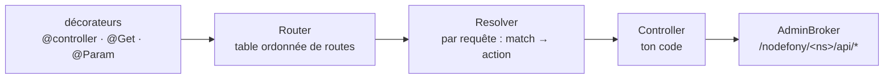

# @nodefony/framework — routes, contrôleurs, décorateurs

> C'est ici qu'on écrit son application. `@nodefony/http` construit le contexte d'une requête ; ce
> module décide **quoi en faire** : quelle route, quel contrôleur, quelle action, avec quels droits.
> Il porte la DX du framework — les décorateurs — et ses invariants — résolution ordonnée, idempotence,
> data plane d'administration. Un contrôleur y déclare ses actions **HTTP et WebSocket avec les mêmes
> décorateurs**.

📍 [Documentation](../../../../../docs/index.md) › **@nodefony/framework**

## 🧭 Par où commencer

Trois parcours selon ce que tu viens faire. L'ordre compte : chaque étape suppose la précédente.

**J'écris ma première route** — le chemin le plus court vers une application qui répond.

1. [Décorateurs](decorateurs.md) — la surface que tu tapes : `@controller`, `@Get`, `@Body`, `@Param`.
   **Commence ici**, c'est la table de référence.
2. [Contrôleurs](controller.md) — ce dont tu hérites, comment répondre, comment échouer proprement.
3. [Routage](routing.md) — pourquoi telle route gagne sur telle autre, et comment lire un `405`.

**Je débugge une route qui ne répond pas comme prévu.**

1. [Routage](routing.md) — l'ordre de déclaration **est** la priorité ; la passe 405 ; les vhosts.
2. [Contrôleurs](controller.md) — l'ordre réel du cycle de vie, et ce que `initialize()` peut ou non
   supposer.
3. [Pipeline de requête](../../../../../docs/architecture/pipeline-requete.md) — ce qui s'est passé
   avant que ta route soit même consultée.

**Je fiabilise des mutations** — paiements, commandes, tout ce qu'on ne veut pas jouer deux fois.

1. [Idempotence](idempotence.md) — `@Idempotent`, la clé, les stores, ce qui se passe au rejeu.
2. [Contrôleurs](controller.md) — codes de retour et réponses vides (204) sans piège.
3. [Sécurité](../../security/docs/index.md) — l'autorisation qui va avec.

## 🗂️ Les briques du module

Le tableau pour choisir vite ; les cards en dessous pour savoir ce qu'on y trouve.

| Brique                          | Ce qu'elle résout                                  | Tu en as besoin quand…                                    |
| ------------------------------- | -------------------------------------------------- | --------------------------------------------------------- |
| [Décorateurs](decorateurs.md)   | déclarer routes, paramètres, réponses, gardes      | toujours — c'est la surface d'écriture                    |
| [Contrôleurs](controller.md)    | recevoir la requête, répondre, gérer l'erreur      | toujours                                                  |
| [Routage](routing.md)           | apparier une URL à une action, arbitrer, expliquer | deux routes se disputent, ou un 404/405 surprend          |
| [Idempotence](idempotence.md)   | empêcher le double effet d'une mutation rejouée    | paiement, commande, tout effet non rejouable              |
| [Admin (data plane)](admin.md)  | monter les API d'admin `/nodefony/<ns>/api/*`      | ton module expose des stats ou actions à Studio et au CLI |
| [Templates (Eta)](templates.md) | rendre des vues HTML côté serveur                  | tu renvoies des pages HTML plutôt que du JSON             |

```nodefony-cards
[
  { "icon": "🏷️", "title": "decorateurs", "href": "decorateurs.md",
    "desc": "La table de référence complète — classe, méthode HTTP, paramètre, réponse, sécurité, WebSocket — chacun avec son effet et un exemple court.",
    "meta": "la page qu'on garde ouverte en écrivant un contrôleur" },
  { "icon": "🎛️", "title": "controller", "href": "controller.md",
    "desc": "Ce dont hérite un contrôleur, d'où viennent request / response / session, comment répondre (auto-JSON, codes, flux de fichiers), comment les erreurs remontent, et l'ordre réel du cycle de vie.",
    "meta": "toujours — c'est ce dont tu hérites" },
  { "icon": "🚦", "title": "routing", "href": "routing.md",
    "desc": "Une table ordonnée où le premier motif qui correspond gagne : l'arbitrage sans score de spécificité, la partition littéral/dynamique qui accélère sans changer la sémantique, le 405 et son en-tête Allow, les vhosts, le duplex HTTP+WebSocket sur un même chemin.",
    "meta": "deux routes se disputent, ou un 404/405 surprend" },
  { "icon": "🔁", "title": "idempotence", "href": "idempotence.md",
    "desc": "@Idempotent, la clé d'idempotence, les trois stores et leurs capacités réelles, le GC des entrées expirées, et ce que le client observe quand il rejoue la même clé.",
    "meta": "paiement, commande, tout effet non rejouable" },
  { "icon": "🛡️", "title": "admin", "href": "admin.md",
    "desc": "Le data plane d'administration : comment un module déclare son API d'admin via AdminBroker, la convention de route /nodefony/<ns>/api/*, le RBAC fail-closed (ROLE_NODEFONY_ADMIN), le duplex HTTP/WebSocket, le catalogue et le Playground.",
    "meta": "exposer une API d'admin cohérente CLI ↔ Web" },
  { "icon": "📄", "title": "templates", "href": "templates.md",
    "desc": "Le moteur de vues Eta : rendre une vue depuis un contrôleur (renderView, render), résolution des chemins de vues, passage de variables, échappement HTML par défaut contre le XSS, rendu d'erreurs.",
    "meta": "produire du HTML côté serveur plutôt que du JSON" }
]
```

## 🏛️ Place dans le framework



Le module s'appuie sur `@nodefony/http` (contexte, serveurs) et se fait garder par
`@nodefony/security` (firewall, CSRF). L'inverse n'est pas vrai : `@nodefony/http` ne peut pas
importer ce module — ce serait un cycle.

## 🧰 Surface publique

Depuis une application : `Controller`, `Router`, `Resolver`, `Route`, `controllers()`, les décorateurs
de route, de paramètre et de garde, `IdempotencyStore`, `AdminBroker`. Les signatures exactes vivent
dans `.ai/symbols.json` et les types générés — jamais recopiées ici, où elles se périmeraient.

## ⚙️ Configuration

Bloc Zod (`nodefony/config/config.ts`), déclaré depuis l'application via
`use("@nodefony/framework", { … })` : `router`, `adminBroker`, et `idempotency` (choix du store et
réglages du GC — détaillé dans la page [Idempotence](idempotence.md)).

## 📜 Normes appliquées

RFC 9110 (méthodes, `405` et en-tête `Allow`, redirections), RFC 6455 §7.4 (codes de fermeture
WebSocket, dont le `1002` d'erreur de sous-protocole), et le brouillon IETF `Idempotency-Key`.

## 📡 Observabilité — Studio

L'écran **Routes** liste la table telle qu'elle est réellement montée, et le **Playground** permet de
jouer une route en voyant ses badges `@IsGranted` / `@Idempotent`. Chaque module publie son data plane
via `AdminBroker`.

## 🧪 Tests & couverture

Les chiffres exacts vivent dans la carte de l'aperçu, régénérée depuis vitest — jamais figés ici.

| Type        | Où                       | Ce qui est prouvé                                       |
| ----------- | ------------------------ | ------------------------------------------------------- |
| Unitaire    | `nodefony/tests/unit/**` | routeur, resolver, contrôleur, décorateurs, idempotence |
| Intégration | via `@nodefony/http`     | la route réelle répond sur un serveur vivant            |
| E2E         | via `@nodefony/drizzle`  | idempotence rejouée contre une vraie base               |

## ⚠️ Pièges (symptôme → cause → correction)

| Symptôme                                      | Cause                                                           | Correction                                    |
| --------------------------------------------- | --------------------------------------------------------------- | --------------------------------------------- |
| `404` sur une route qui « existe »            | Contrôleur jamais importé — les routes naissent à l'import      | L'ajouter à `@controllers([…])` du module     |
| Une route paramétrée mange un chemin littéral | L'ordre de déclaration **est** la priorité                      | Déclarer le littéral avant le paramétré       |
| Action WebSocket jamais atteinte              | Transport `WEBSOCKET` non déclaré sur la route                  | L'ajouter aux méthodes de la route            |
| `TS2416` sur une action `remove`              | Le nom entre en collision avec une méthode héritée de `Service` | Renommer l'action — l'URL vient du décorateur |
| Double effet d'une mutation rejouée           | Route sensible sans clé d'idempotence                           | Voir [idempotence](idempotence.md)            |

## 🔗 Pour aller plus loin

- Le trajet complet d'une requête → [pipeline-requete](../../../../../docs/architecture/pipeline-requete.md)
- La couche transport en dessous → [@nodefony/http](../../http/docs/index.md)
- Le pare-feu qui garde les actions → [@nodefony/security](../../security/docs/index.md)
- Portées d'injection des contrôleurs → [injection-portees](../../../../../docs/architecture/injection-portees.md)
- Vue d'ensemble du framework → [vue-ensemble](../../../../../docs/architecture/vue-ensemble.md)
