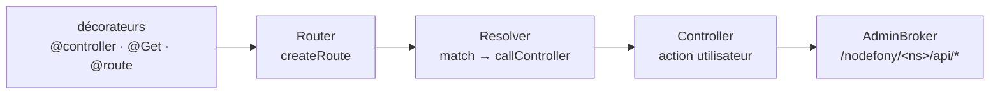

# @nodefony/framework — vue du module

> La couche applicative : routeur, résolveur, contrôleurs, décorateurs de routes, idempotence, data
> plane d'administration et moteur de templates Eta. C'est là qu'un développeur écrit ses routes — HTTP
> **et** WebSocket, avec les mêmes décorateurs. Point d'entrée du module. Ancré sur le code.

## Schéma général

## Lexique

| Terme      | Sens                                                                            |
| ---------- | ------------------------------------------------------------------------------- |
| Router     | Enregistre les routes et en trouve une pour une requête.                        |
| Route      | Un motif d'URL + méthode + action de contrôleur.                                |
| Resolver   | Résout la route d'une requête et appelle l'action (par requête).                |
| Controller | Classe utilisateur qui traite une requête et rend une réponse.                  |
| Décorateur | Annotation TS (`@Get`, `@IsGranted`…) qui déclare le comportement d'une action. |
| Data plane | Endpoints d'administration exposés par un module (`/nodefony/<ns>/api/*`).      |

## Qu'est-ce que ce module

`@nodefony/http` construit le contexte ; `@nodefony/framework` décide **quoi faire** de la requête :
quelle route, quel contrôleur, quelle action, avec quels droits. Il fournit la DX (les décorateurs) et
les invariants (résolution, garde de sécurité avant instanciation, idempotence, data plane admin).

## La vision Nodefony

Les décorateurs sont évalués à l'import et déclarent les routes (`nodefony/decorators/routerDecorators.ts`).
Le `Router` (`nodefony/service/router.ts`) sépare deux flux à la compilation : les routes **statiques**
(chemin littéral) vont dans une `Map path.toLowerCase() → candidates` — **lookup O(1)** ; les routes
**dynamiques** (`{var}`, wildcard, métacaractère regex) restent un **scan regex ordonné**
(`router.ts:55-71`). `resolve()` fusionne les deux flux **par position d'insertion** : la séquence de
correspondance reste celle de la déclaration, prévisible.

Le `Resolver` (`nodefony/src/Resolver.ts:86`) fait `match → callController → executeAction`. Le constat
de sécurité qui compte : la **garde `@IsGranted` s'évalue AVANT `newController`** — un `403`
court-circuite l'instanciation DI **et** le `initialize()` du contrôleur (Zero Trust : on ne construit
rien pour un appelant non autorisé, `Resolver.ts:329-333`). Quand la route n'est pas gardée (≈ 99 % des
cas, `security === null`), c'est **0 lookup, 0 await, 0 alloc** — la sécurité ne taxe pas le hot path.

Un contrôleur déclare ses routes HTTP **et** WS avec les **mêmes** décorateurs. Côté WS, le pointeur
`controller` du container est **partagé par la connexion** et réécrit à chaque re-routage (invoke,
forward) : le Resolver reconstruit l'instance si la classe courante diffère de celle de la route
(`Resolver.ts:340-347`), et une route WS-pontable doit déclarer explicitement le transport `WEBSOCKET`
(`Route.ts:548`) — le transport seul ne suffit pas à distinguer l'action invoquée par un message.

## Les briques du module (→ pages dédiées)

| Brique           | Rôle                                                      | Page                            |
| ---------------- | --------------------------------------------------------- | ------------------------------- |
| Routeur & routes | Enregistrement, résolution statique/dynamique             | [routing](./routing.md)         |
| Contrôleurs      | Cycle d'une action, helpers `render`/`renderJson`/`send`  | [controller](./controller.md)   |
| Décorateurs      | `@controller`, `@Get`/`@Post`, `@route`, `@Param`/`@Body` | [decorateurs](./decorateurs.md) |
| Idempotence      | Anti double-effet des mutations (Idempotency-Key)         | [idempotence](./idempotence.md) |
| Data plane admin | `AdminBroker`, `/nodefony/<ns>/api/*`                     | [admin](./admin.md)             |
| Templates (Eta)  | Rendu de vues serveur                                     | [templates](./templates.md)     |

## Surface publique

Exports clés : `Controller`, `Router`, `Resolver`, `Route`, `controllers()`, les décorateurs de route
et de garde, `IdempotencyStore`, `AdminBroker`. Signatures : `.ai/symbols.json`.

## Configuration

Bloc Zod (`nodefony/config/config.ts`) : `router`, `adminBroker`, `idempotency` (store/gc — voir la
page idempotence). Détail par brique.

## Normes appliquées

RFC 9110 (méthodes, 405), draft idempotency-key-header, Fetch Metadata (via security), en-têtes
`RateLimit-*` (via http).

## Observabilité — Studio

**Playground** (explorateur de routes avec badges `@IsGranted`/`@Idempotent`), **Routes**, data plane
admin par module.

## Tests & couverture

Le module est couvert par **535 cas** sur 36 fichiers (routing, resolver, controller, décorateurs,
idempotence — dont le _seam_ Resolver — admin, templates), avec des doubles de test et un e2e
d'idempotence rejoué MySQL. Photo régénérée depuis vitest — la vérité vit dans `npm run coverage`
(`@nodefony/framework`).

## Pièges (symptôme → cause → correction)

| Symptôme                            | Cause                                                  | Correction                                           |
| ----------------------------------- | ------------------------------------------------------ | ---------------------------------------------------- |
| `404` sur une route qui « existe »  | Décorateur non importé (routes déclarées à l'import)   | S'assurer que le contrôleur est bien chargé/scanné   |
| `403` avant même le contrôleur      | `@IsGranted` : garde évaluée **avant** l'instanciation | Attendu (Zero Trust) — vérifier le rôle/scope requis |
| Action WS jamais atteinte           | Route sans transport `WEBSOCKET` déclaré               | Déclarer `methods: ["WEBSOCKET"]` sur la route       |
| Double effet d'une mutation rejouée | Pas d'`Idempotency-Key` sur une route sensible         | Voir [idempotence](./idempotence.md)                 |
| `405` sur une méthode               | Méthode non déclarée pour la route (RFC 9110)          | Ajouter la méthode au décorateur                     |

## Pour aller plus loin

- Pipeline de requête → [pipeline-requete](../../../docs/architecture/pipeline-requete.md)
- Idempotence → [idempotence](./idempotence.md) · Sécurité → `src/packages/@nodefony/security/docs/index.md`
- Vue d'ensemble → [vue-ensemble](../../../docs/architecture/vue-ensemble.md)
