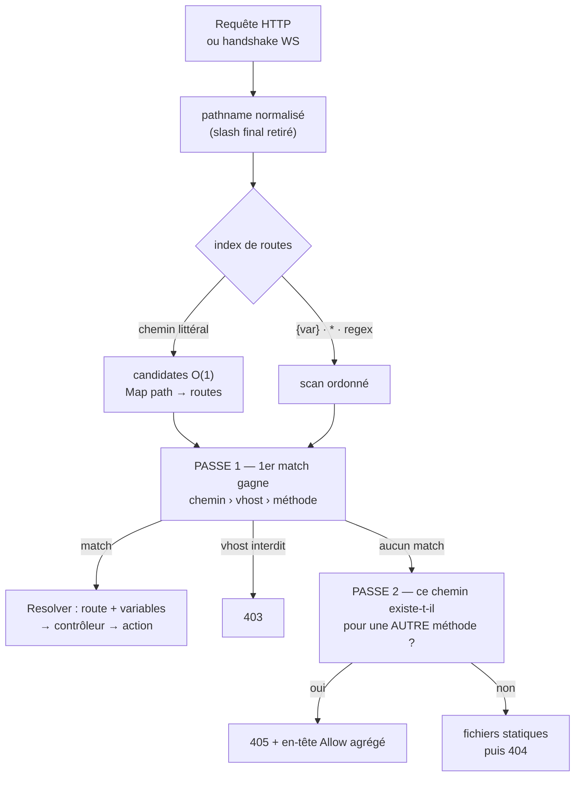

# Routage — de l'URL à l'action

> Le routage répond à **une** question, sur chaque requête : quel bout de ton code doit traiter cette
> URL ? Nodefony y répond avec une **table ordonnée de routes** où le **premier motif qui correspond
> gagne** — pas de score de spécificité, pas de magie. La même table sert le **HTTP et le WebSocket** :
> une action WS se déclare comme une action HTTP, avec un transport différent. Tout ci-dessous est
> ancré sur le code.

📍 [Documentation](../../../../../docs/index.md) › [Framework](index.md) › **Routage**

## 🧠 Le modèle mental — une table ordonnée, le premier match gagne

Une route, c'est un **motif d'URL** + des **contraintes** (méthode, domaine, sous-protocole) + une
**action de contrôleur**. Le `Router` garde toutes les routes du processus dans **une seule liste**,
dans leur **ordre de déclaration**, et la parcourt jusqu'au premier motif satisfait.



Trois faits à retenir avant tout le reste :

1. **L'ordre de déclaration EST la priorité.** Une route paramétrée déclarée avant une route
   littérale gagne sur le chemin littéral — c'est figé par le banc de non-régression
   (`routing-nonregression.test.ts:83`).
2. **Le routeur ne lève jamais de 404.** Aucun match = `resolver.resolve === false`, sans exception ;
   le 404 est décidé plus loin, après le repli sur les fichiers statiques
   (`HttpError("Not Found", 404)`, `http-kernel.ts:688`).
3. **Le chemin est vérifié avant la méthode, et le domaine entre les deux** — c'est ce qui produit un
   `403` plutôt qu'un `405` bavard quand la route appartient à un autre vhost (`Route.match()`,
   `Route.ts:212`).

## 📖 Lexique

| Terme                | Sens (dans cette page)                                                                             |
| -------------------- | -------------------------------------------------------------------------------------------------- |
| Route                | Un motif d'URL + ses contraintes + l'action de contrôleur qui la sert.                             |
| Table de routes      | La liste `Route[]` unique du processus, dans l'ordre de déclaration.                               |
| Motif (`pattern`)    | L'expression régulière compilée depuis le chemin déclaré.                                          |
| Variable de route    | Un segment capturé, noté `{nom}` — jamais à cheval sur un `/`.                                     |
| Wildcard / catch-all | Le `*` final, qui absorbe tout le reste du chemin (y compris les `/`).                             |
| Requirement          | Contrainte attachée à la route : `methods`, `protocol`, `domain`, ou une regex par variable.       |
| Littérale/dynamique  | Partition interne : chemin sans métacaractère (lookup direct) vs chemin à motif (scan).            |
| Passe 1 / Passe 2    | Recherche du match, puis (si échec) calcul de l'en-tête `Allow` d'un 405.                          |
| `Allow`              | En-tête listant les méthodes servies par un chemin (RFC 9110 §15.5.6).                             |
| Vhost                | Hôte virtuel : le même serveur sert plusieurs noms de domaine, avec des routes différentes.        |
| Duplex               | Un même chemin servi en HTTP **et** en WebSocket.                                                  |
| `methodOverride`     | Méthode HTTP **logique** d'une invocation WS, quand le transport seul (`WEBSOCKET`) ne suffit pas. |
| Resolver             | L'objet par requête qui porte la route trouvée, ses variables, puis appelle l'action.              |

## Qu'est-ce que le routage ?

Imagine le standard téléphonique d'un immeuble. Un appel arrive avec un numéro (`/api/books/42`) ;
le standard consulte **son tableau**, ligne par ligne, et passe la communication au premier poste dont
le numéro correspond. Si personne ne correspond, il essaie la boîte aux lettres (les fichiers
statiques), et sinon il répond « ce numéro n'existe pas » (404).

Le routage, c'est ce tableau. Trois problèmes qu'il doit résoudre, et que tous les frameworks
tranchent différemment :

- **Correspondre** — reconnaître `/api/books/42` comme « la fiche du livre 42 » et en extraire `42`.
- **Arbitrer** — quand deux lignes du tableau correspondent, laquelle gagne ?
- **Expliquer un refus** — un chemin connu appelé avec la mauvaise méthode ne mérite pas un 404
  (« ça n'existe pas »), mais un **405 avec la liste des méthodes acceptées**.

## La vision Nodefony

**L'arbitrage est explicite, pas calculé.** Beaucoup de routeurs trient les routes par « spécificité »
(le motif le plus précis gagne) — pratique jusqu'au jour où l'on ne comprend plus pourquoi telle route
passe devant telle autre. Nodefony garde l'**ordre de déclaration** : la table est parcourue de haut en
bas, le premier motif satisfait l'emporte (`Router.resolve()`, `router.ts:190`). Le compromis assumé :
c'est à toi de déclarer le littéral avant le paramétré. En échange, tu peux **lire** l'ordre dans ton
contrôleur.

**La performance ne change pas la sémantique.** Sous le capot, la table est partitionnée : les chemins
**littéraux** (aucun `{var}`, aucun métacaractère) vivent dans une `Map path → candidates` en lookup
O(1) ; les chemins **dynamiques** restent un scan regex (`buildRouteIndex()`, `router.ts:92`). À la
résolution, les deux flux sont fusionnés **par position d'insertion** — la séquence de candidats est
exactement celle du scan linéaire complet, moins les littérales d'un autre chemin, qui ne pouvaient de
toute façon pas correspondre (`Router.resolve()`, `router.ts:221`). C'est cette équivalence que fige le
banc de non-régression : un refacto du routeur doit le repasser à l'identique.

**Une seule table pour HTTP et WebSocket.** Il n'y a pas de « routeur WS » séparé : une action WS est
une route dont les méthodes déclarées contiennent `WEBSOCKET` (`Route.matchRequirements()`,
`Route.ts:649`). C'est le différenciateur du framework — le même contrôleur, le même contexte, les
mêmes décorateurs.

**Le routeur passe avant les fichiers statiques.** Une requête qui correspond à une route ne paie
jamais le `stat` du serveur de fichiers : le repli statique n'est tenté que si la résolution a échoué
(`serverStatic.handle()`, `http-kernel.ts:1200`).

> [!NOTE]
> **Le routage n'a aucune option de configuration.** Le schéma Zod du module n'expose qu'un sac
> d'options de Service pour le `Router` (`config.ts:36`) — tout se déclare par **décorateurs**, dans le
> contrôleur, à côté du code qu'ils servent. Pas de `routes.yaml`, pas de table centrale à maintenir.

## 🚀 Démarrage rapide

Dans une app générée par `nodefony create app`, le routage est déjà actif : `@nodefony/framework` est
dans le manifeste `modules` de `nodefony.config.ts`. Il ne reste qu'à écrire un contrôleur.

### Le contrôleur — cinq routes qui couvrent tous les cas

```ts
// nodefony/controllers/CatalogController.ts — complet, compile tel quel
import {
  Controller,
  controller,
  route,
  Get,
  Post,
  Param,
  Query,
} from "@nodefony/framework";
import type { ContextType } from "@nodefony/http";

// Le préfixe s'ajoute DEVANT le chemin de chaque route de la classe.
@controller("/api/catalog")
class CatalogController extends Controller {
  constructor(context: ContextType) {
    super("catalog", context);
  }

  // GET /api/catalog        — chemin littéral, lookup O(1)
  @Get("")
  async list(@Query("page") page?: string) {
    return this.renderJson({ page: Number(page ?? 1) });
  }

  // GET /api/catalog/book/{isbn} — `{isbn}` = UN segment, jamais deux
  @Get("/book/{isbn}")
  async one(@Param("isbn") isbn: string) {
    return this.renderJson({ isbn });
  }

  // POST sur le MÊME chemin qu'aucun GET ne sert → un GET ici renverra 405
  @Post("/book")
  async create() {
    return this.renderJson({ created: true });
  }

  // `@route` = la forme explicite : nom choisi + contraintes libres.
  // HEAD n'est PAS déduit de GET — il se déclare (cf Pièges).
  @route("route-catalog-files", {
    path: "/files/*",
    requirements: { methods: ["GET", "HEAD"] },
  })
  async files(rest: string) {
    return this.renderJson({ rest });
  }

  // MÊME contrôleur, transport WebSocket : `message` vaut null au handshake,
  // puis porte chaque frame reçue.
  @route("route-catalog-live", {
    path: "/live",
    requirements: { methods: ["WEBSOCKET"] },
  })
  async live(message: string | Buffer | null) {
    if (!message) return this.renderJson({ handshake: true });
    return this.render(message.toString());
  }
}

export default CatalogController;
```

### Le câblage — déclarer le contrôleur au module de l'app

Les routes sont créées à l'**import** du fichier (les décorateurs s'évaluent alors) ; `@controllers`
rattache la classe au module au boot. `nodefony create controller` écrit ces deux lignes pour toi.

```ts ignore
// index.ts (racine de l'app) — extrait
import { Kernel, Module } from "nodefony";
import { controllers } from "@nodefony/framework";
import config from "./nodefony.config.js";
import CatalogController from "./nodefony/controllers/CatalogController.js";

@controllers([CatalogController])
class App extends Module {
  constructor(kernel: Kernel) {
    super("app", kernel, import.meta.url, config);
  }
}

export default App;
```

### Ce qu'on observe

```bash
# 1) Chemin littéral + query string (la query n'entre PAS dans le matching)
curl -s 'http://localhost:5151/api/catalog?page=2'
# {"page":2}

# 2) Variable de route, valeur URL-décodée
curl -s http://localhost:5151/api/catalog/book/978-2-1234
# {"isbn":"978-2-1234"}

# 3) Slash final ignoré, casse ignorée — même route
curl -so /dev/null -w '%{http_code}\n' http://localhost:5151/API/Catalog/
# 200

# 4) Chemin connu, mauvaise méthode → 405 + Allow (RFC 9110 §15.5.6)
curl -si http://localhost:5151/api/catalog/book | grep -Ei '^(HTTP|allow)'
# HTTP/1.1 405 Method Not Allowed
# Allow: POST

# 5) Wildcard : tout le reste du chemin, séparateurs compris
curl -s http://localhost:5151/api/catalog/files/2026/rapport.pdf
# {"rest":"2026/rapport.pdf"}

# 6) Chemin inconnu → repli statique, puis 404
curl -so /dev/null -w '%{http_code}\n' http://localhost:5151/api/catalog/nope/nope
# 404
```

Le WebSocket, sur le **même serveur** et la même table :

```bash
npx wscat -c ws://localhost:5151/api/catalog/live
# < {"handshake":true}
# > bonjour
# < bonjour
```

## Déclarer une route — trois formes

La **syntaxe** des décorateurs est détaillée dans [decorateurs](./decorateurs.md) ; ce qui suit est ce
que chaque forme **produit dans la table**.

| Forme                                     | Nom de la route                    | Méthodes déclarées               | Quand l'utiliser                             |
| ----------------------------------------- | ---------------------------------- | -------------------------------- | -------------------------------------------- |
| `@Get` `@Post` `@Put` `@Delete` `@Patch`… | auto : `` `Classe::methode` ``     | exactement une                   | le cas courant, REST                         |
| `@All(path)`                              | auto : `` `Classe::methode` ``     | **aucune** → toutes les méthodes | proxy, capture-tout, page de repli           |
| `@route(nom, options)`                    | **le tien** (stable, réutilisable) | `requirements.methods` (libre)   | WebSocket, multi-méthodes, contraintes fines |

- Les décorateurs de méthode HTTP délèguent tous à `@route` avec un nom auto `Classe::methode`, et
  posent `requirements: { methods }` (`httpMethodDecorator()`, `routerDecorators.ts:340`).
- `@All` n'émet **aucun** requirement de méthode : la route sert alors GET, POST, DELETE… et ne peut
  donc jamais produire un 405 sur la méthode (`All()`, `routerDecorators.ts:374`).
- `@route` est la forme complète : elle seule permet `protocol` (sous-protocole WS), un nom lisible, et
  des requirements par variable.

**Comment une déclaration devient une route.** Les décorateurs de méthode **accumulent** des métadonnées
sur le constructeur (clé `routes:definitions`, `routerDecorators.ts:16`) ; c'est `@controller(prefix)`
qui les lit et appelle `Router.createRoute()` pour chacune (`controller()`, `routerDecorators.ts:129`).

> [!WARNING]
> **`@route`/`@Get` doivent être SOUS `@controller`** — les décorateurs de classe s'évaluent après ceux
> de méthode, et `@controller` doit trouver les métadonnées déjà posées. Un `@controller` placé au
> mauvais endroit ne crée **aucune** route, sans erreur : symptôme = 404 partout sur ce contrôleur.

## Motifs de chemin et paramètres

Le chemin déclaré est compilé **une fois**, à la création de la route, en une expression régulière
ancrée et **insensible à la casse** (`Route.compile()`, `Route.ts:300`). La grammaire tient en cinq
briques (`REG_ROUTE`, `Route.ts:17`) :

| Écriture           | Motif compilé | Capture           | Exemple                                               |
| ------------------ | ------------- | ----------------- | ----------------------------------------------------- |
| `/books`           | littéral      | —                 | `/books` (et `/BOOKS`, et `/books/`)                  |
| `/books/{id}`      | `([^/]+)`     | `id`              | `/books/42` ✅ · `/books/a/b` ❌ (un seul segment)    |
| `/books/{id}(\d+)` | `(\d+)`       | `id`, contrainte  | `/books/42` ✅ · `/books/abc` ❌ (**ne matche pas**)  |
| `/files/*`         | `(.*)/?`      | `*` et `wildcard` | `/files/a/b.txt` ✅ · `/files` ❌ (le `/` est requis) |
| `/report.{fmt}`    | `\.([^/]+)`   | `fmt`             | `/report.json` → `fmt = "json"`                       |

Et trois comportements qui surprennent la première fois :

- **Le slash final est retiré avant le matching** — `/books/` et `/books` désignent la même route
  (`Route.cleanPathname()`, `Route.ts:204`). Corollaire : `/files/*` ne matche pas `/files/`, qui a été
  normalisé en `/files`.
- **Les valeurs sont URL-décodées** — `%C3%A9t%C3%A9` arrive dans l'action comme `été`
  (`decode()`, `Route.ts:79`).
- **La query string n'entre jamais dans le matching** — seul le `pathname` est comparé. Les paramètres
  de query se lisent avec `@Query` (voir [decorateurs](./decorateurs.md)).

### Une valeur par défaut rend le segment OPTIONNEL

C'est le mécanisme le moins évident, et le plus utile. Déclarer un `defaults` pour une variable change
le motif compilé : le segment devient facultatif (`[^/]*`) **et son slash aussi** (`/?`), puis la valeur
par défaut est réinjectée quand la capture est vide (`checkDefaultParameters()`, `Route.ts:99` ·
`Route.hydrateDefaultParameters()`, `Route.ts:469`).

```ts ignore
@route("route-page", { path: "/page/{slug}", defaults: { slug: "home" } })
async page(slug: string) {
  return this.renderJson({ slug });
}
```

| Requête     | `slug` reçu | Pourquoi                                      |
| ----------- | ----------- | --------------------------------------------- |
| `/page/faq` | `"faq"`     | capture normale                               |
| `/page`     | `"home"`    | segment absent → défaut réinjecté             |
| `/page/`    | `"home"`    | slash final retiré, puis même cas que `/page` |

### Comment les valeurs arrivent dans l'action

Les captures sont passées **positionnellement**, dans l'ordre des variables du chemin — c'est pourquoi
la signature `async method6(metier: string, format: string)` suit l'ordre de `/{metier}/{format}`. Un
wildcard est exposé sous les clés `wildcard` et `*`. Le `Resolver` en fabrique aussi un instantané
nom → valeur par requête (`Resolver.getMatchedParams()`, `Resolver.ts:170`), lu par le contexte pour
les métadonnées et par les décorateurs `@Param`.

> [!IMPORTANT]
> Dès qu'**un seul** décorateur de paramètre (`@Param`, `@Query`, `@Body`…) est présent sur l'action,
> les arguments positionnels sont **remplacés** par les valeurs des décorateurs. On ne mélange pas les
> deux conventions dans une même signature.

## ⚙️ Ordre de résolution — trois situations

L'ordre n'est pas un détail d'implémentation : c'est **ta** politique de routage. Trois situations
concrètes, tirées du banc de non-régression.

### Situation 1 — une fiche par identifiant, et une page « nouveau »

Tu sers `/books/{id}` et tu veux aussi `/books/new` pour le formulaire de création. Les deux motifs
correspondent à `/books/new` : `{id}` capturerait `"new"` comme un identifiant.

```ts ignore
// ✅ le littéral D'ABORD — il gagne, et /books/42 tombe ensuite sur la paramétrée
@Get("/books/new")   newForm() {}
@Get("/books/{id}")  show(@Param("id") id: string) {}

// ❌ l'inverse : `show` reçoit id = "new", `newForm` n'est JAMAIS atteinte
```

Aucune spécificité n'est calculée : la première route déclarée qui correspond gagne
(`routing-nonregression.test.ts:83`). La même règle vaut pour le catch-all `*`, qui absorbe tout ce qui
le suit — un `@All("*")` déclaré tôt masque le reste du contrôleur.

> [!TIP]
> Une exception utile : dans un contrôleur, une route dont le chemin vaut **exactement** `"*"` est
> repoussée **en dernier** au moment du montage — la capture-tout d'un contrôleur ne masque donc jamais
> ses propres routes, quel que soit l'ordre d'écriture (`hasMagic`, `routerDecorators.ts:237`). Ça ne
> vaut **que** pour `"*"` seul : `/files/*` reste ordonné comme les autres.

### Situation 2 — le même chemin, deux méthodes

Deux routes peuvent partager un chemin et se distinguer par la méthode. La passe 1 essaie la première,
qui **lève** un 405 sur la méthode ; l'exception est mémorisée et le scan **continue** jusqu'à la route
qui accepte la méthode (`Router.resolve()`, `router.ts:247`).

```ts ignore
@Get("/book/{id}")    show() {}
@Delete("/book/{id}") remove() {}   // DELETE /book/42 → arrive bien ici
```

Si **aucune** route n'accepte la méthode, la **passe 2** entre en scène : elle reparcourt la table,
collecte toutes les méthodes servies par ce chemin **sur ce vhost**, et lève un 405 dont l'en-tête
`Allow` est l'**agrégat** (`collectSupportedMethods()`, `router.ts:261` ; en-tête posé sur la réponse,
`router.ts:279`). C'est la conformité RFC 9110 §15.5.6 : `Allow` liste tout ce que la ressource
accepte, pas seulement ce que la dernière route scannée acceptait.

| Requête           | Réponse                                        |
| ----------------- | ---------------------------------------------- |
| `DELETE /book/42` | 200 — la 2ᵉ route accepte                      |
| `PATCH /book/42`  | **405**, `Allow: GET, DELETE`                  |
| `GET /inexistant` | pas d'exception — repli statique, puis **404** |

### Situation 3 — une route réservée à un domaine

Une route restreinte par `@Domain` est **invisible** aux requêtes des autres vhosts : elle lève un 403
au lieu de participer au match (`Route.matchHostname()`, `Route.ts:489`). Le point de sécurité est
l'**ordre des vérifications** : le domaine est vérifié **avant** la méthode. Sans cela, une route d'un
autre vhost pourrait répondre 405 en révélant SES méthodes — une fuite d'information cross-domaine
(`Route.match()`, `Route.ts:232`). La passe 2 applique la même règle : les routes d'un autre vhost sont
exclues du calcul de `Allow` (`isDomainAllowed`, `router.ts:270`).

Si une autre route du même chemin sert **tous** les vhosts, le scan continue jusqu'à elle : le 403
n'interrompt pas la recherche, il ne conclut que s'il ne reste aucune candidate.

## 🔌 HTTP et WebSocket — la même table

Une action WebSocket est une route ordinaire dont les méthodes déclarées contiennent la pseudo-méthode
`WEBSOCKET`. C'est tout ce qui la distingue.

```ts ignore
@route("route-chat", {
  path: "/chat/{room}",
  requirements: { methods: ["WEBSOCKET"], protocol: "chat-v1" },
})
async chat(room: string, message: string | Buffer | null) { /* … */ }
```

Ce qui change par rapport au HTTP :

- **La route est résolue AVANT l'acceptation du handshake.** Le contexte WS passe par le même
  `handleFrontController()`, puis seulement `context.connect()` (`http-kernel.ts:1537`). Un chemin
  inconnu ou un sous-protocole non conforme ferme la connexion **sans jamais l'ouvrir**.
- **Le sous-protocole est un requirement de route.** Un `protocol` déclaré et non satisfait lève une
  erreur de code **1002** (Protocol Error, RFC 6455 §7.4) au lieu d'un statut HTTP
  (`acceptedProtocol`, `Route.ts:587`).
- **Le 405 ne s'applique pas au WebSocket.** La passe 2 est réservée au HTTP : sur un contexte WS,
  l'exception d'origine est préservée (`Router.resolve()`, `router.ts:190`).
- **Un `Resolver` par connexion, réutilisé à chaque frame.** Il est créé au handshake, puis chaque
  message rejoue `match()` sur la route déjà trouvée avant d'appeler l'action
  (`WebsocketContext.handle()`, `WebsocketContext.ts:271` · boucle message,
  `callController`, `WebsocketContext.ts:508`).
  L'action est donc invoquée une fois au handshake (`message` vaut `null`), puis une fois par frame.

### Duplex — le même chemin en HTTP et en WS

Déclarer `methods: ["GET", "WEBSOCKET"]` rend une action joignable par les deux transports. C'est ce
que fait le data plane d'administration pour toutes ses lectures (`AdminBroker.mountAll()` →
`Router.createRoute()`, `AdminBroker.ts:125`). Deux conséquences :

- **La pseudo-méthode `WEBSOCKET` apparaît dans l'agrégat `Allow`** d'un chemin duplex — décision
  assumée : c'est un jeton d'extension légal, et il révèle la surface duplex de la ressource
  (`routing-nonregression.test.ts:164`).
- **Une invocation WS d'une mutation doit dire quelle méthode logique elle vise.** Sur une socket,
  `context.method` vaut toujours `WEBSOCKET` : insuffisant pour distinguer un GET d'un POST sur le même
  chemin. Le pont transporte donc une **méthode logique** (`methodOverride`, `Resolver.ts:116`) que la
  route doit déclarer **en plus** du transport — une route `POST` qui n'annonce pas `WEBSOCKET` reste
  **injoignable** par socket (zéro contournement, `Route.ts:546`).

Le routage par **message** (invoquer un chemin porté par une frame, sans toucher l'URL de la connexion)
passe par le même `resolve()`, avec un chemin fourni en argument — l'état partagé de la socket n'est
jamais muté (`Router.resolve()`, `router.ts:190`). Détails côté socket :
[socket Nodefony](../../../../../docs/architecture/realtime-socket-nodefony.md).

## Vhosts — une route par domaine

`@Domain` restreint une méthode (ou tout un contrôleur) à un ou plusieurs noms d'hôte. Les motifs
acceptent l'exact (`"marseille.fr"`) et le joker d'un label (`"*.cdn.example.com"`), compilés une fois
au boot en expressions ancrées (`Route.compileHost()`, `Route.ts:468`).

```ts ignore
@controller("/")
@Domain("marseille.fr") // SOUS @controller : les décorateurs de classe
class MarseilleController extends Controller {
  // s'appliquent de bas en haut
  @Get("/") home() {} // marseille.fr/ → 200 · autre-vhost/ → 403
}
```

Précédence, du plus fort au plus faible : `@route({ host })` › `@Domain` sur la méthode › `@Domain` sur
la classe (`controller()`, `routerDecorators.ts:89`). Une route sans domaine est servie sur **tous** les
vhosts, et ne coûte rien au matching (`hostRegexp` absent → aucun test, `Route.matchHostname()`,
`Route.ts:483`).

> [!WARNING]
> `@Domain` déclare quels vhosts une route **sert** ; il ne remplace pas la barrière d'entrée. Un
> `Host` inconnu du serveur est rejeté en amont (421 Misdirected Request, `checkValidDomain()`,
> `http-kernel.ts:1610`) via la liste `trustedHosts` de `@nodefony/http`.

## Préfixes — contrôleur, module, data plane

Trois niveaux de préfixe coexistent, et un seul est à ta main.

1. **Le préfixe de contrôleur** — `@controller("/api/catalog")` est concaténé devant le chemin de
   chaque route de la classe, puis le chemin est normalisé : les `//` sont réduits et le slash final
   retiré (`Route.setPattern()`, `Route.ts:551`). Un chemin vide (`@Get("")`) désigne donc le préfixe
   lui-même.
2. **Le module propriétaire** — il n'ajoute **aucun** préfixe d'URL. `@controllers([…])` enregistre la
   classe au boot et propage le nom du module sur les routes déjà créées, pour l'introspection et les
   logs (`Router.setController()`, `router.ts:356`). Un module tiers et ton app peuvent porter deux
   contrôleurs homonymes sans collision : la clé du registre est `module:Classe` (`router.ts:367`).
3. **Le data plane d'administration** — réservé, non négociable : `/nodefony/<namespace>/api/<endpoint>`
   (`AdminBroker.resolvePath()`, `AdminBroker.ts:91`). Trois segments minimum, pour ne jamais entrer en
   collision avec les routes de l'application ni avec la SPA de Studio.

> [!TIP]
> Les routes de tes modules ne sont **pas** préfixées par leur nom de module — deux modules peuvent
> déclarer `/api/users`. C'est le premier déclaré (ordre du manifeste `modules`) qui gagne. Préfixe tes
> contrôleurs applicatifs pour éviter la collision silencieuse.

## Nommer une route, la retrouver, l'appeler

Chaque route porte un **nom unique** dans le processus : celui que tu donnes à `@route`, ou l'auto-nom
`Classe::methode` des décorateurs de méthode (`routerDecorators.ts:348`). Le nom est le handle stable
d'une route — il survit à un changement de chemin.

| Besoin                                   | Comment                                                                   |
| ---------------------------------------- | ------------------------------------------------------------------------- |
| Retrouver une route par son nom          | `router.getRoutes("ma-route")` → l'objet `Route` (`router.ts:326`)        |
| Lister toutes les routes                 | `router.getRoutes("")` → la table complète (`router.ts:326`)              |
| Savoir quelles routes couvrent un chemin | `router.matchRoutes("/api/x")` → les résultats de regex (`router.ts:315`) |
| Appeler une autre action, en interne     | `this.forward("module:Controller:action")` (`Controller.ts:416`)          |
| Retirer une route                        | `router.removeRoutes("ma-route")` (`router.ts:335`)                       |

**Il n'existe pas de générateur d'URL inverse côté serveur** (pas de `path("ma-route", {id})` à la
Symfony). Le chemin déclaré est lisible sur l'objet `Route` (`route.path`), et la substitution des
`{var}` est faite là où on en a besoin — par exemple par la console Studio, qui remplace chaque
variable par sa valeur encodée (`buildUrl()`, `PlaygroundModel.ts:88`). Pour un lien interne, écris le
chemin ; pour un appel interne, utilise `forward()`.

**`forward()` n'est pas une redirection** : il résout `module:Controller:action` et exécute l'action
dans le **même** contexte de requête, sans repasser par le réseau (`Resolver.parsePathernController()`,
`Resolver.ts:185`). Une vraie redirection HTTP passe par `this.redirect(url, 302)` ou `@Redirect`.

## 🧰 API publique

Le routage s'utilise **par décorateurs** ; l'API impérative sert l'outillage (introspection, tests,
modules qui montent des routes dynamiquement). Signatures complètes : `.ai/symbols.json`.

| Symbole                                    | Usage réel                                                              |
| ------------------------------------------ | ----------------------------------------------------------------------- |
| `Router.createRoute(nom, options)`         | Monter une route sans décorateur (data plane, module dynamique).        |
| `Router.setController(classe, module)`     | Rattacher une classe à un module (fait par `@controllers`).             |
| `router.resolve(context)`                  | Le cœur : rend un `Resolver` (`resolve === true` si trouvé).            |
| `router.getRoutes(nom)` · `removeRoutes()` | Introspection et démontage.                                             |
| `Route#path` · `#variables` · `#pattern`   | Ce que la route déclare, après compilation.                             |
| `Route#toObject()` · `#toLogLine()`        | Sérialisation pour l'API admin · ligne de log lisible (`Route.ts:402`). |
| `Resolver#route` · `#variables`            | Ce que la requête courante a matché.                                    |
| `Resolver#getMatchedParams()`              | Les variables en `nom → valeur` (`Resolver.ts:170`).                    |

> [!CAUTION]
> **La table de routes est un état de processus, pas d'instance** : `Router.routes` est une liste
> module-level partagée par tout le processus (`router.ts:48`). `removeRoutes()` sans argument la
> **vide pour tout le monde** — réservé aux bancs de test, qui sauvegardent et restaurent la table
> autour de chaque cas.

## ⚡ Performance & mémoire

Le routage est sur le chemin chaud de **chaque** requête : tout y est précalculé au boot, rien n'y est
alloué par requête.

- **Compilation unique au montage** : motif d'URL, motifs de domaine, `Set` de méthodes en majuscules,
  chaîne `Allow`, et regex des requirements par variable sont figés à la création de la route
  (`Route.compileRequirements()`, `Route.ts:324`). Le matching ne fait plus que des lookups.
- **Un seul calcul de chemin par requête** : le `pathname` normalisé est calculé une fois puis passé à
  chaque route scannée — sinon le getter `URL.pathname`, la regex de normalisation et l'allocation de
  chaîne seraient refaits pour **chaque** route de la table (`Route.cleanPathname()`, `Route.ts:204`).
- **Lookup O(1) pour les chemins littéraux**, scan pour les seuls chemins à motif — sans changer la
  séquence de candidats (`buildRouteIndex()`, `router.ts:92`). L'index est invalidé par toute mutation
  de la table, avec un garde-fou sur une photo `longueur/première/dernière` qui rattrape même les
  mutations directes de la liste (`routeIndex`, `router.ts:201`).
- **Zéro journalisation en production** : le log « route trouvée » est promu au niveau NOTICE hors
  production seulement, et le test est résolu une fois puis mémoïsé — en production, aucune chaîne
  n'est même construite (`routeNoticePromoted`, `router.ts:232`).
- **Métadonnées d'action mémoïsées par route** au premier passage (`@HttpCode`, `@Header`, `@Redirect`,
  paramètres, intention de session) : plus aucune lecture `Reflect` par requête
  (`resolveActionMeta`, `Resolver.ts:142`).

## 📜 Normes appliquées

| Sujet                                    | Norme             | Où le code s'y conforme                                         |
| ---------------------------------------- | ----------------- | --------------------------------------------------------------- |
| 405 + en-tête `Allow` agrégé             | RFC 9110 §15.5.6  | passe 2 (`collectSupportedMethods()`, `router.ts:261`)          |
| Cible identifiée par l'URI, hôte compris | RFC 9110 §7.2     | hôte vérifié avant la méthode (`Route.match()`, `Route.ts:232`) |
| 403 sur ressource d'un autre vhost       | RFC 9110 §15.5.4  | `Route.matchHostname()` (`Route.ts:489`)                        |
| 404 quand rien ne correspond             | RFC 9110 §15.5.5  | après repli statique (`http-kernel.ts:688`)                     |
| 421 sur `Host` non servi                 | RFC 9110 §15.5.20 | `checkValidDomain()` (`http-kernel.ts:1610`)                    |
| Erreur de sous-protocole WS = 1002       | RFC 6455 §7.4     | `Route.matchRequirements()` (`Route.ts:649`)                    |
| Décodage pourcent des segments           | RFC 3986 §2.1     | `decode()` (`Route.ts:79`)                                      |

## 📡 Observabilité — Studio

La table de routes est introspectable en ligne, sans lire le code :

- **`GET /nodefony/framework/api/routes`** — dump de toutes les routes enregistrées : nom, chemin,
  méthodes, contrôleur (`FrameworkAdminApi.ts:123`). Variante paginée/triée/filtrée côté serveur :
  `routes/page`.
- **`GET /nodefony/framework/api/info`** — résumé : nombre de routes, méthodes servies, modules
  propriétaires (`FrameworkAdminApi.ts:183`).
- **Écran Routes** de Studio (`studio/frontend/src/routes/RoutesView.tsx`) — la même table, filtrable.
- **Playground** (développement uniquement) — un formulaire par action, généré depuis la table :
  transports (dont le duplex), paramètres décorés, gardes de sécurité. Il **exécute** de vraies actions,
  donc il n'est monté qu'en développement (`PlaygroundAdminApi.ts`).

Au boot, avec le debug actif, chaque route est aussi journalisée en une ligne
`[MÉTHODES] chemin → @module/Controller.action` (`Route.toLogLine()`, `Route.ts:402`).

## ⚠️ Pièges (symptôme → cause → correction)

<!-- prettier-ignore -->
| Symptôme | Cause (dans le code) | Correction |
| --- | --- | --- |
| 404 sur toutes les routes d'un contrôleur | `@controller` évalué avant les `@route`/`@Get` de la classe | Placer `@controller` **au-dessus** de la classe, décorateurs de méthode dans la classe |
| 404 sur une route pourtant écrite | Le fichier du contrôleur n'est jamais importé — les routes naissent à l'import | Le déclarer dans `@controllers([…])` du module |
| `405` alors que la méthode « est déclarée » | `method: "GET"` dans `@route` n'est **pas** filtrant | Utiliser `requirements: { methods: ["GET"] }` ou `@Get` |
| `405` sur une requête `HEAD` d'une route `@Get` | `HEAD` n'est pas déduit de `GET` : c'est une méthode distincte | Déclarer `requirements: { methods: ["GET", "HEAD"] }` |
| Une route paramétrée avale un chemin littéral | Premier match dans l'ordre de déclaration, aucune spécificité | Déclarer le littéral **avant** le paramétré |
| `/files/*` ne répond pas sur `/files` | Le slash final est retiré avant le matching ; le motif exige `/files/` | Déclarer une seconde route pour le chemin nu |
| `{id}` ne capture pas `a/b` | Une variable vaut `[^/]+` — un seul segment, par construction | Utiliser un wildcard `*` si le `/` doit être capturé |
| `500` au lieu d'un non-match sur une contrainte | Un requirement par variable non satisfait **lève** (chaîne brute, `Route.ts:286`) | Préférer la contrainte inline `{id}(\d+)`, qui ne matche pas |
| `403` inattendu sur une route qui « existe » | La route est restreinte à un autre vhost (`@Domain`) | Retirer la restriction, ou servir ce vhost |
| Action WebSocket jamais atteinte | Transport `WEBSOCKET` absent des méthodes déclarées | `requirements: { methods: ["WEBSOCKET"] }` |
| Une action nommée `session`/`request`/`method` est refusée | Le décorateur refuse tout nom déjà porté par `Controller` — il masquerait l'action | Renommer l'action (réservés : tout membre de `Controller`/`Service` — `session`, `get`, `set`, `remove`, `request`, `response`, `method`…) |
| Les routes d'un test « fuient » sur le test suivant | `Router.routes` est un état de processus partagé | Sauvegarder/restaurer la table autour de chaque cas |

## 🧪 Tests & couverture

Le routage est le sous-système du framework le plus densément couvert — les chiffres exacts vivent dans
la carte de tests de la page (régénérée depuis vitest, jamais figés dans la prose).

- **Unitaires — la grammaire et l'objet `Route`** : `Route.test.ts` (compilation du motif, matching,
  variables, décodage, défauts, requirements, préfixe, hôte, hash) et `Router.test.ts` (création,
  lecture, suppression, `matchRoutes`).
- **Unitaires — la déclaration** : `routerDecorators.test.ts` (les métadonnées posées par `@route`,
  `@controller`, `@Param`/`@Body`/`@Query`) et `httpMethodDecorators.test.ts` (auto-nommage,
  `requirements.methods`).
- **Banc de contrat — la sémantique observable** : `routing-nonregression.test.ts` fige onze familles
  d'invariants (A→K) : ordre d'insertion, 405 agrégé, absence de throw sur non-match, restriction de
  domaine, exemption WS de la passe 2, routage par message, normalisation, extraction des variables,
  table vivante, contrat du resolver, désambiguïsation `methodOverride`. **Tout refacto du routeur doit
  le repasser à l'identique.**
- **Unitaires — l'optimisation** : `routing-index.test.ts` prouve que l'index littérales/dynamiques
  n'altère pas la séquence de candidats (dont le garde-fou contre les mutations directes de la table).
- **Intégration (serveur réel)** : `tests/routing/Router.test.ts` de `@nodefony/http` exerce les routes
  du module de test — variables, défauts, contraintes de méthode, wildcard.

**Ce qui manque, dit franchement** : aucun banc d'attaque dédié au routage (`*.attack.test.ts`) et
aucun test de charge dédié — le coût de la résolution est mesuré indirectement par les bancs HTTP de
`tests/load/**`. La couverture du vhost est portée par `tests/integration/domain-routing.test.ts`
(`@nodefony/http`), hors périmètre compté ici.

Lancer : `npm test` (unitaires) et `npm run test:integration` (serveur requis) dans
`@nodefony/framework` ; couverture via `npm run coverage`. Pour la charge, voir le skill
`nodefony-load-test`.

## 🔗 Pour aller plus loin

- ⬆️ **Retour au hub** : [@nodefony/framework — vue du module](index.md) · [Toute la documentation](../../../../../docs/index.md)
- 🧭 **Pages sœurs** : [Décorateurs](./decorateurs.md) (la syntaxe de déclaration) · [Contrôleur](./controller.md) (ce qui se passe après la résolution) · [Idempotence](./idempotence.md) (protéger les mutations rejouées)
- Où le routage s'insère dans le traitement d'une requête → [pipeline de requête](../../../../../docs/architecture/pipeline-requete.md)
- Le contexte et les transports qui alimentent le routeur → [@nodefony/http](../../http/docs/index.md)
- Qui a le droit d'atteindre une route → [firewall](../../security/docs/firewall.md)
- Le routage par message sur une socket → [socket Nodefony](../../../../../docs/architecture/realtime-socket-nodefony.md)
