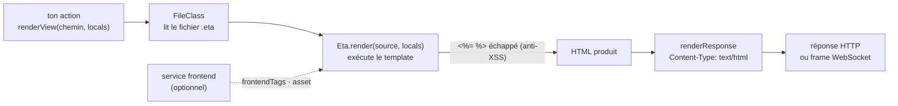
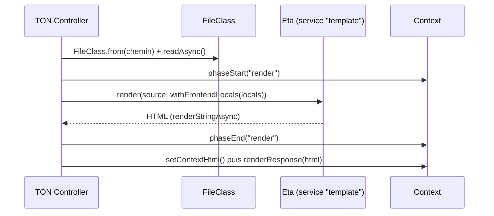

# Templates — le moteur de rendu de vues (Eta)

> Quand une route doit renvoyer une **page HTML** plutôt que du JSON, il faut coller des données dans
> du texte : c'est le rôle du moteur de templates. Nodefony n'en a qu'un — **Eta** — et le branche au
> minimum : ton contrôleur appelle `renderView()`, le framework lit le fichier `.eta`, l'exécute avec
> tes variables et pose `Content-Type: text/html`. La défense clé est l'**échappement HTML par
> défaut** (anti-XSS). Ancré sur `Eta.ts`, `Template.ts` et `Controller.renderView()`.

📍 [Documentation](../../../../../docs/index.md) › [Framework](index.md) › **Templates**

## 🧠 Le modèle mental — un formulaire à trous

Un template est un texte **à trous** (le HTML fixe) que le moteur remplit avec des **données** (les
locals) pour produire la page finale. Nodefony fait ce remplissage **côté serveur** (SSR), à chaque
requête, puis renvoie le résultat comme n'importe quel corps de réponse.



Deux idées à retenir :

1. **Le contrôleur lit le fichier, le moteur ne fait que rendre une chaîne.** `renderView()` résout le
   chemin, lit l'octet, puis passe la **source** à Eta (`Controller.renderView()`, `Controller.ts:308`).
   Il n'y a **pas** de dossier `views/` magique connu du moteur.
2. **L'échappement est automatique.** Une donnée interpolée par `<%= %>` est neutralisée (`<` devient
   `&lt;`) avant d'entrer dans le HTML — c'est la protection XSS, active par défaut
   (`autoEscape`, `Eta.ts:16`).

## 📖 Lexique

| Terme            | Sens (dans cette page)                                                                                |
| ---------------- | ----------------------------------------------------------------------------------------------------- |
| Template / vue   | Un fichier `.eta` : du HTML fixe + des balises qui insèrent des données.                              |
| Moteur de vues   | Le composant qui exécute le template avec des données → produit la page. Ici **Eta**.                 |
| Eta              | Moteur de templates écrit en TypeScript, syntaxe `<% %>` façon EJS. Unique moteur de Nodefony.        |
| Local(s)         | Les variables passées au template (`{ name, nodefony }`) — les « données » qui remplissent les trous. |
| SSR              | _Server-Side Rendering_ : la page HTML est fabriquée sur le serveur, pas dans le navigateur.          |
| Interpolation    | Insérer une valeur dans la sortie : `<%= valeur %>` (échappée) ou `<%~ valeur %>` (brute).            |
| Échappement HTML | Transformer `< > & " '` en entités (`&lt;`…) pour qu'une donnée soit **affichée**, jamais exécutée.   |
| XSS              | _Cross-Site Scripting_ : un attaquant injecte du HTML/JS via une donnée ; l'échappement le désamorce. |
| `autoEscape`     | L'option Eta qui échappe `<%= %>` par défaut (activée dans Nodefony).                                 |
| `useWith`        | L'option Eta qui expose les locals **nus** (`<%= name %>`) au lieu de `<%= it.name %>`.               |
| Phase `render`   | Le temps chronométré de production du corps par le moteur (visible dans la debug bar).                |

## Qu'est-ce que c'est ?

Imagine une lettre type avec des blancs : « Bonjour **\___**, ta commande **\___** est prête. » Le moteur
de templates prend cette lettre (le fichier `.eta`) et les données (`{ nom, commande }`), remplit les
blancs, et te rend la lettre finie. C'est exactement ce qu'un serveur fait pour produire une page HTML
personnalisée à partir d'un gabarit unique.

Le piège de cette opération, c'est la **sécurité**. Si une donnée vient de l'utilisateur (un pseudo,
un commentaire) et qu'on la recolle **nue** dans le HTML, un attaquant peut y glisser
`<script>vole_le_cookie()</script>` : le navigateur de la **victime** l'exécutera comme du code de ton
site. C'est une faille **XSS**. La parade est l'**échappement** : on remplace `<` par `&lt;`, `>` par
`&gt;`, etc. — le navigateur **affiche** alors le texte au lieu de l'**exécuter**.

> [!IMPORTANT]
> Eta échappe **par défaut** avec `<%= %>`. Tu ne désactives cette protection **que** volontairement,
> avec `<%~ %>` (sortie brute) — à réserver à du HTML que **tu** as produit et en qui tu as confiance,
> jamais à une donnée utilisateur.

## La vision Nodefony

Nodefony a **un seul** moteur de vues : **Eta** (il remplace Twig et EJS, retirés). Le choix est
documenté au source (`Eta`, `Eta.ts:34`) : écrit en TypeScript (types fournis, pas de `@types/*`), ESM
natif, échappement natif, et surtout des délimiteurs `<% %>` qui **n'entrent pas en collision** avec la
syntaxe TS/JSON/JSX — décisif car le même moteur sert aussi à générer du code (le scaffold `create`).

Le branchement est **délibérément minimal** :

- Le service Eta est enregistré au boot sous le nom `template` (`@services([Router, Eta, …])`,
  `nodefony/framework/index.ts:76`) ; chaque contrôleur le récupère à sa construction
  (`this.get<Eta>("template")`, `Controller.ts:253`).
- Le moteur ne connaît **que le rendu d'une chaîne** : `Eta.render(source, data)` appelle
  `renderStringAsync` (`Eta.ts:51`). C'est le contrôleur qui lit le fichier — pas Eta.
- Deux options seulement sont posées, plus le cache : `autoEscape`, `useWith`, `cache`
  (`defaultOption`, `Eta.ts:15`). Il n'y a **pas** de racine `views/`, donc **pas** de résolution
  d'`include`/layout par nom (voir Pièges).

> [!NOTE]
> Le rendu **d'erreurs** ne passe **pas** par les templates : une exception devient un corps **JSON
> structuré** (`ErrorRenderer.renderHttp()`, `error-renderer.ts:227`), jamais une page Eta. Le moteur
> de vues ne sert que le HTML **que tu rends explicitement**.

## 🚀 Démarrage rapide

Une vue Eta est un fichier `.eta` ; l'action la rend avec `renderView(chemin, locals)`. Voici le tout —
le contrôleur, la vue, et ce qu'on observe.

### 1. La vue — `nodefony/views/hello.eta`

```eta
<!doctype html>
<html lang="fr">
  <head>
    <meta charset="utf-8" />
    <title><%= nodefony.name %></title>
  </head>
  <body>
    <!-- <%= %> ÉCHAPPE : si name vaut "<b>x</b>", la page affiche le texte, ne l'exécute pas -->
    <h1>Bonjour <%= name %></h1>
    <% if (name === "cci") { %>
      <p>Salut l'auteur.</p>
    <% } %>
  </body>
</html>
```

### 2. Le contrôleur — rend la vue, renvoie du HTML

```typescript
// nodefony/controllers/HelloController.ts — compile tel quel
import { Controller, controller, Get, Param } from "@nodefony/framework";
import type { ContextType } from "@nodefony/http";
import { resolve } from "node:path";

@controller("/hello")
class HelloController extends Controller {
  constructor(context: ContextType) {
    super("hello", context);
  }

  // GET /hello/:name → rend `hello.eta` avec le local `name`.
  @Get("/{name}")
  async index(@Param("name") name: string) {
    // TU résous le chemin de la vue : pas de dossier `views/` implicite.
    const view = resolve(
      this.module?.path as string,
      "nodefony",
      "views",
      "hello.eta",
    );
    // renderView lit le fichier, appelle Eta, pose Content-Type: text/html.
    // `nodefony.*` (name, requestId…) vient de metaData ; `name` est à toi et
    // prime sur les locals frontend (spread en dernier).
    return this.renderView(view, { name, ...this.context?.metaData });
  }
}

export default HelloController;
```

Câblage : `@controllers([HelloController])` sur ta classe `Module` (fait par
`nodefony create controller`). Aucune config à écrire — le service `template` existe déjà.

### 3. Ce qu'on observe

```bash
# 1) La donnée est interpolée ET échappée
curl -s http://localhost:5151/hello/cci
# <!doctype html> … <h1>Bonjour cci</h1> <p>Salut l'auteur.</p> …

# 2) En-tête posé automatiquement par renderView()
curl -si http://localhost:5151/hello/cci | grep -i content-type
# Content-Type: text/html

# 3) Une donnée « piégée » est neutralisée (anti-XSS) : le <b> devient du texte
curl -s 'http://localhost:5151/hello/%3Cb%3Ex%3C%2Fb%3E'
# <h1>Bonjour &lt;b&gt;x&lt;/b&gt;</h1>
```

> [!TIP]
> Tu n'as écrit **aucun** appel d'envoi (`send`, `res.end`). `renderView()` produit le corps **et**
> l'envoie. Pour piloter l'envoi toi-même, retourne plutôt une chaîne via `render()`
> (`Controller.render()`, `Controller.ts:290`).

## 🏗️ Architecture interne — le parcours d'un `renderView()`

Deux classes, une responsabilité chacune :

- **`Template`** (`Template.ts:2`) — la base : elle étend `Service` (donc container + logs), garde une
  référence au `module` et **décide du cache** selon l'environnement (`this.cache` vrai en `prod`,
  `Template.ts:20`).
- **`Eta`** (`Eta.ts:34`) — l'implémentation : elle instancie le moteur `eta` (`new EtaEngine()`,
  `Eta.ts:38`), applique le cache calculé par `Template` (`this.engine.configure()`, `Eta.ts:41`), et
  expose deux méthodes de rendu.

Le trajet d'un appel, étape par étape :



| #   | Étape                                        | Où                                                            |
| --- | -------------------------------------------- | ------------------------------------------------------------- |
| 1   | Résolution + lecture async du fichier        | `FileClass` dans `renderView()` (`Controller.ts:316`)         |
| 2   | Ouverture de la phase mesurée `render`       | `phaseStart("render")` (`Controller.ts:322`)                  |
| 3   | Injection des aides frontend dans les locals | `withFrontendLocals()` (`Controller.ts:345`)                  |
| 4   | Rendu de la source par le moteur             | `Eta.render()` → `renderStringAsync` (`Eta.ts:51`)            |
| 5   | `Content-Type: text/html` puis envoi         | `setContextHtml()` + `renderResponse()` (`Controller.ts:331`) |

Le point notable de l'étape 3 : `withFrontendLocals()` ajoute automatiquement `frontendTags`,
`frontendDocument` et `asset` aux locals **si** le service `frontend` est présent — et **tes** valeurs
priment (spread `param` en dernier, `Controller.ts:345`). Si le module frontend n'est pas chargé, la
fonction retourne les locals inchangés : zéro couplage dur.

## 🔐 Sécurité — échappement HTML et XSS

La règle Eta se lit sur les délimiteurs. Trois formes, trois comportements :

| Balise     | Rôle                      | Échappé ? | Pour…                                           |
| ---------- | ------------------------- | :-------: | ----------------------------------------------- |
| `<%= v %>` | interpole la valeur `v`   |  **oui**  | **toute donnée** — le cas par défaut, sûr       |
| `<%~ v %>` | interpole `v` **brut**    |    non    | du HTML de confiance que TU produis (fragments) |
| `<% … %>`  | exécute du code (if/for…) |    n/a    | logique de template (pas de sortie directe)     |

L'échappement par défaut vient de l'option `autoEscape: true` posée dans `defaultOption` (`Eta.ts:16`).
Concrètement, `<%= %>` passe la valeur dans la fonction d'échappement d'Eta, qui remplace `& < > " '`
par leurs entités HTML. Une chaîne d'attaque comme `<script>alert(1)</script>` ressort donc en texte
inerte `&lt;script&gt;alert(1)&lt;/script&gt;`.

> [!WARNING]
> `<%~ %>` **désactive** la protection. Ne l'emploie **jamais** sur une donnée qui a pu être influencée
> par un utilisateur (pseudo, commentaire, champ de formulaire, paramètre d'URL). Réserve-le à des
> fragments HTML que ton propre code a construits.

## 🧰 API publique

Deux niveaux : ce que le **service Eta** expose, et ce que le **contrôleur** t'offre au-dessus.

### Le service `Eta` (nom d'injection `template`)

| Méthode                   | Rôle                                                       | Ancre       |
| ------------------------- | ---------------------------------------------------------- | ----------- |
| `render(source, data?)`   | Rend un template depuis une **chaîne** (chemin chaud)      | `Eta.ts:51` |
| `renderFile(path, data?)` | Lit un fichier `.eta` **puis** le rend (usages CLI/outils) | `Eta.ts:66` |

`render()` est ce qu'appelle le contrôleur ; `renderFile()` lit lui-même le fichier
(`readFile` + `renderStringAsync`, `Eta.ts:71`) pour les usages qui partent d'un chemin (générateurs,
scaffold). Les deux sont **asynchrones** (I/O non bloquante).

### Les helpers du contrôleur

| Helper                              | Pour…                                                   | Ancre               |
| ----------------------------------- | ------------------------------------------------------- | ------------------- |
| `renderView(path, locals, status?)` | Rendre une vue `.eta` (lit le fichier + aides frontend) | `Controller.ts:308` |
| `render(data, encoding?, status?)`  | Envoyer un corps quelconque (ex. HTML déjà prêt)        | `Controller.ts:273` |
| `renderJson(obj, status?)`          | Réponse JSON explicite (pas un template)                | `Controller.ts:392` |

Les signatures exactes vivent dans le graphe symbolique `.ai/symbols.json` — jamais recopiées ici.

## ⚙️ Configuration et modes

Le moteur est configuré **en dur**, pas via un bloc Zod exposé à `use()`. Trois réglages seulement :

| Réglage      | Valeur Nodefony               | Effet                                                               | Ancre            |
| ------------ | ----------------------------- | ------------------------------------------------------------------- | ---------------- |
| `autoEscape` | `true`                        | `<%= %>` échappe le HTML par défaut (anti-XSS)                      | `Eta.ts:16`      |
| `useWith`    | `true`                        | locals exposés nus (`<%= name %>`) — DX façon EJS                   | `Eta.ts:17`      |
| `cache`      | `true` en prod, `false` sinon | compile-once des templates en production ; recompile à chaud en dev | `Template.ts:20` |

Le cache n'est **pas** un booléen figé : `Template` le dérive de l'environnement du kernel
(`environment === "prod"`, `Template.ts:20`) puis `Eta` l'applique au moteur (`Eta.ts:41`). En
développement, un template modifié est donc pris en compte sans redémarrer.

## 🔌 HTTP et WebSocket — le même rendu

`renderView()` est agnostique du transport : sur une action WebSocket, le rendu produit une **frame**
au lieu d'un corps HTTP. Le module de test le fait avec un template `.eta` qui produit du JSON, renvoyé
comme frame au client :

```eta
{
   "nodefony" : "<%= nodefony.name %>",
   "name" : "<%= name %>"
}
```

L'action WS appelle `renderView(view, { name, ...this.context?.metaData })` exactement comme en HTTP —
c'est le différenciateur Nodefony : une classe, deux transports, le même moteur de vues.

## 📜 Normes appliquées

| Domaine            | Norme / référence       | Comment le code s'y conforme                                          |
| ------------------ | ----------------------- | --------------------------------------------------------------------- |
| Neutralisation XSS | OWASP — Output Encoding | échappement HTML par défaut (`autoEscape`, `Eta.ts:16`)               |
| Type de média HTML | `text/html`             | posé par `setContextHtml()` dans `renderView()` (`Controller.ts:331`) |
| I/O non bloquante  | Node.js async fs        | lecture async du fichier (`readFile`, `Eta.ts:71`)                    |

## ⚡ Performance et mémoire

Le rendu de vue est la partie **réellement coûteuse** d'une réponse (lecture fichier + exécution du
template), et le framework l'isole pour ça :

- **Phase dédiée** : `renderView()` chronomètre le rendu sous la phase `render`
  (`phaseStart("render")`, `Controller.ts:322`) — distincte de `action` et de `send`. On voit ainsi si
  le temps part dans le moteur ou dans l'écriture réseau.
- **Cache en prod** : les templates sont compilés une fois (`cache` vrai en production,
  `Template.ts:20`) ; le coût de parsing n'est payé qu'au premier rendu.
- **Lecture non bloquante** : le fichier est lu en async (`FileClass.readAsync()` côté `renderView`,
  `readFile` côté `renderFile`, `Eta.ts:71`) — l'event loop n'est jamais gelé par un `readFileSync`.
- **Aides frontend paresseuses** : `withFrontendLocals()` (`Controller.ts:345`) ne construit les
  fonctions `frontendTags`/`asset` que si le service `frontend` répond — sinon il rend les locals tels
  quels, zéro allocation superflue.

## 📡 Observabilité — Studio

- **Debug bar** : la phase `render` d'une requête y apparaît aux côtés de `resolve`, `parse`, `action`
  et `send` — c'est là qu'on repère un template lent.
- **Playground** (`/nodefony/playground`, développement) : permet de jouer une route qui rend une vue
  et d'observer le HTML produit sans écrire de client.

## ⚠️ Pièges (symptôme → cause → correction)

| Symptôme                                                 | Cause (dans le code)                                                               | Correction                                                                 |
| -------------------------------------------------------- | ---------------------------------------------------------------------------------- | -------------------------------------------------------------------------- |
| `<%~ include("partial") %>` ne trouve pas la vue         | Aucune racine `views/` n'est configurée (`defaultOption`, `Eta.ts:15`)             | Compose côté contrôleur : rends chaque fragment, ou passe le HTML en local |
| Un `<b>` d'utilisateur s'exécute dans la page            | Sortie brute `<%~ %>` sur une donnée non fiable                                    | Utiliser `<%= %>` (échappé par défaut)                                     |
| `<%= it.name %>` requis alors qu'on attend `<%= name %>` | `useWith` mal compris — Nodefony l'active (`Eta.ts:17`), les locals sont nus       | Écrire `<%= name %>` directement                                           |
| Modif de template ignorée en prod                        | `cache: true` en production (`Template.ts:20`)                                     | Redémarrer le pod ; en dev le cache est off, recompile à chaud             |
| La réponse d'erreur n'est pas ma vue Eta                 | Les erreurs rendent du JSON, pas un template (`error-renderer.ts:109`)             | Pour une page d'erreur HTML, rendre explicitement une vue dans un handler  |
| `renderView()` rejette et logge une ERROR                | Fichier introuvable ou template invalide (le `catch` re-lève, `Controller.ts:333`) | Vérifier le chemin résolu (`resolve(module.path, …)`)                      |

## 🧪 Tests et couverture

L'honnêteté d'abord : le moteur de vues a **peu de tests dédiés**, et surtout **aucun** test n'exerce
le vrai moteur Eta de bout en bout. Ce qui existe :

- **unit** — `Controller.test.ts` couvre le **câblage** de `renderView()` : deux cas vérifient que la
  vue est rendue puis envoyée en HTML, et que les aides frontend sont injectées dans les locals. Mais
  ces tests emploient un **template factice** (`{ render: async () => … }`) : ils prouvent le contrat
  du contrôleur, **pas** le rendu réel, ni l'échappement.
- **intégration** — `ws-bridge-rendered-action.test.ts` (`@nodefony/http`) exerce une action **rendue**
  côté pont WS, mais via `renderJson`, **pas** un template Eta.

Ce qui **manque** (à créer) :

- aucun test du **service `Eta`** lui-même — ni `render()`, ni `renderFile()` ;
- aucun test de l'**échappement HTML / XSS** (`<%= %>` échappe, `<%~ %>` non) — pourtant c'est la
  défense de sécurité centrale de la brique ;
- aucun banc de **charge/mémoire** dédié au rendu de vue (le coût est mesuré au niveau du pipeline
  complet via `memory.test.ts` de `@nodefony/http`).

Un banc réel devrait rendre une vraie vue `.eta` sur un serveur vivant et asserter à la fois le
`Content-Type: text/html` **et** la neutralisation d'une charge XSS. Pour les axes charge/mémoire, voir
les skills `nodefony-load-test` et `nodefony-check-memory-health`.

Couverture : `npm run coverage` dans `@nodefony/framework`.

## 🔗 Pour aller plus loin

- ⬆️ **Retour au hub** : [Framework — vue d'ensemble](index.md) · [Toute la documentation](../../../../../docs/index.md)
- 🧭 **Pages sœurs** : [Contrôleurs](controller.md) (d'où l'on appelle `renderView`) · [Décorateurs](decorateurs.md) (`@Get`, `@Param`) · [Routage](routing.md)
- Le pare-feu et la CSP au-dessus du HTML rendu → [Firewall](../../security/docs/firewall.md)
- Signatures exactes des membres publics → graphe symbolique `.ai/symbols.json`
