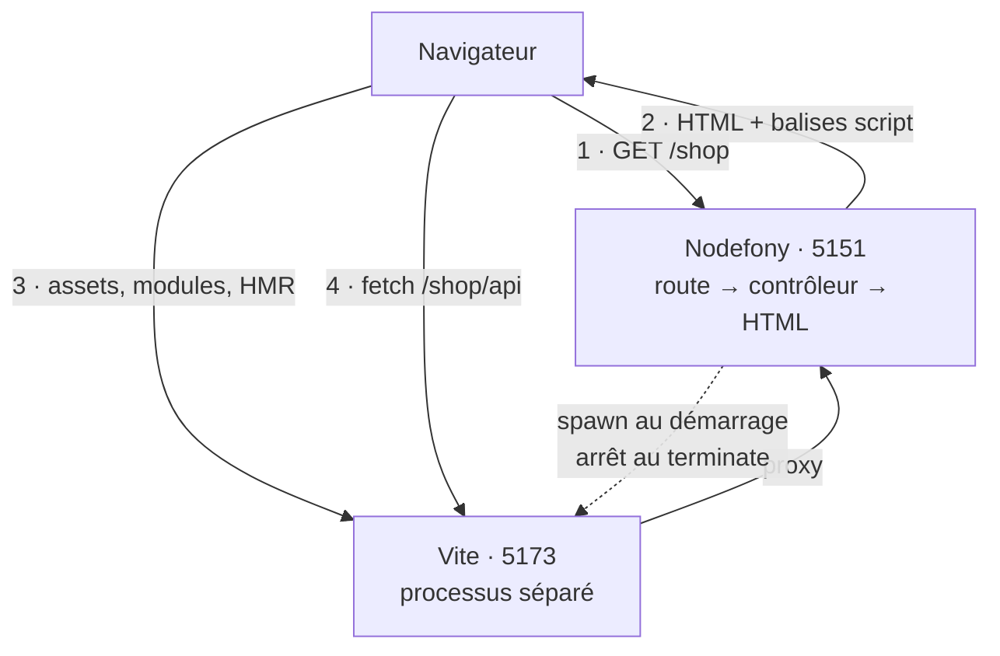
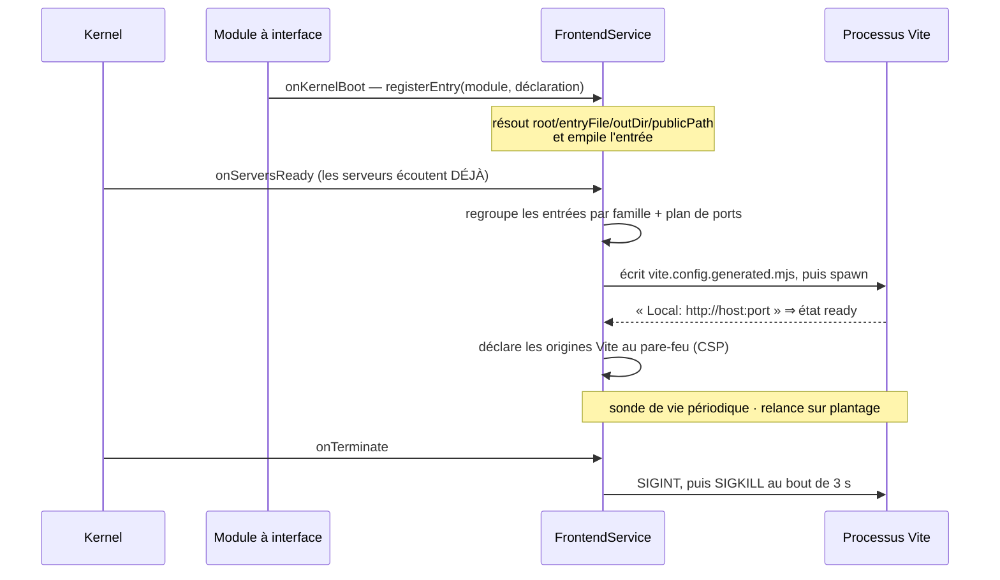

# @nodefony/frontend — le builder d'interfaces

> Le module qui donne une **interface** à ton application. Il pilote [Vite](https://vite.dev) pour
> transformer ton code React, Vue ou Angular en quelque chose que le navigateur comprend, avec
> rechargement à chaud pendant que tu développes et bundles optimisés en production. Sa particularité
> tient en deux décisions : **Vite tourne dans un processus séparé** (compiler ne ralentit jamais ton
> serveur) et **c'est Nodefony qui rend la page HTML**, pas Vite — ta page reste une page du framework,
> avec sa session, son pare-feu et son nonce de sécurité.

📍 [Documentation](../../../../../docs/index.md) › **@nodefony/frontend**

## 🧠 Le modèle mental — deux serveurs, un seul site

Le réflexe habituel est de croire qu'un projet front et un projet back sont deux applications. Ici,
il n'y en a qu'une : ton module Nodefony **déclare** son interface, et le module frontend s'occupe du
reste. Concrètement, deux serveurs tournent en développement et se partagent le travail.



Lis le schéma comme une visite : la **page** vient toujours de Nodefony (1-2) ; les **modules
JavaScript** viennent de Vite en direct (3), donc ton serveur n'est jamais sur le chemin critique des
assets ; et les **appels d'API** repartent vers Nodefony par le proxy de Vite (4). En production, Vite
disparaît : les assets sont pré-construits et servis en fichiers statiques.

## 📖 Lexique

| Terme               | Sens                                                                                                     |
| ------------------- | -------------------------------------------------------------------------------------------------------- |
| Vite                | L'outil qui transpile et sert le code front. Serveur de développement en dev, compilateur en production. |
| HMR                 | _Hot Module Replacement_ : ta modification apparaît dans le navigateur sans recharger la page.           |
| Entrée (_entry_)    | Le point de départ d'une interface (`main.tsx`). Un module = une entrée = un bundle.                     |
| Bundle              | Le résultat compilé d'une entrée : un fichier JS (plus ses morceaux) que le navigateur charge.           |
| Preset              | La recette d'un framework UI (React, Vue, Angular) : quel greffon Vite, quelles extensions.              |
| Famille d'isolation | Groupe d'entrées qui partagent **un** processus Vite. Angular a la sienne.                               |
| Superviseur         | L'objet qui lance, surveille, relance et arrête le processus Vite.                                       |
| Manifeste           | `manifest.json` produit par le build : la carte « fichier source → fichier compilé empreinté ».          |
| Empreinte           | Le hachage dans le nom d'un fichier compilé (`main-a1b2c3.js`) — permet un cache navigateur permanent.   |
| `publicPath`        | Le préfixe d'URL sous lequel les assets d'un bundle sont servis (`/_assets/shop/`).                      |
| Repli SPA           | Le comportement d'un serveur front : toute URL inconnue rend `index.html`. Source du piège n°1.          |
| CSP                 | _Content Security Policy_ : l'en-tête qui liste les origines de scripts autorisées par le navigateur.    |
| Nonce               | Jeton à usage unique posé sur un `<script>` pour l'autoriser malgré une CSP stricte.                     |
| CDN                 | _Content Delivery Network_ : un réseau de serveurs de proximité qui sert les assets à la place du tien.  |
| Préambule React     | Petit script que React Fast Refresh exige dans le `<head>` avant tout module React.                      |
| `/@fs/`             | Le préfixe par lequel Vite sert un fichier par son **chemin absolu** sur le disque.                      |
| Molette `ui`        | Le réglage d'un module distribué : servir son interface via Vite ou via des assets pré-construits.       |

## Qu'est-ce que c'est ?

Un navigateur ne sait lire ni du TSX, ni un composant Vue, ni un décorateur Angular. Il faut un
**atelier de transformation** entre ton code et lui : c'est ce qu'on appelle un builder front.
Historiquement cet atelier était lent — chaque sauvegarde reconstruisait tout le projet. Vite a
renversé le modèle : il ne compile **que le fichier demandé**, à la demande, et pousse les
modifications à chaud dans la page ouverte.

`@nodefony/frontend` n'est pas une réimplémentation de cet atelier : c'est **le chef d'orchestre** qui
le branche sur ton application — qui compile, qui rend la page, comment le front parle au back, et ce
qui remplace Vite une fois en production.

### La vision Nodefony — ce que ce module fait différemment

**Vite est un processus système, pas une bibliothèque.** Le superviseur lance le binaire Vite avec
`child_process.spawn` (`ViteProcessSupervisor.attemptSpawn()`, `ViteProcessSupervisor.ts:372`). La
conséquence est concrète : compiler dix mille modules ne coûte **rien** à la latence de tes requêtes,
et un plantage de Vite ne tue pas ton serveur — le superviseur le relance tout seul.

**C'est Nodefony qui sert le HTML.** Beaucoup de piles séparent un serveur front (qui rend la page) et
un serveur d'API (qui rend le JSON). Ici, la page d'entrée reste une route de ton contrôleur :
elle traverse le pare-feu, connaît la session, reçoit son nonce CSP. Le module se contente d'y
**injecter les bonnes balises** (`TemplateHelper.renderDevTags()`, `TemplateHelper.ts:153`).

**Un seul Vite pour N modules.** Trois modules à interface ne lancent pas trois serveurs Vite : leurs
entrées sont agrégées dans une seule instance multi-entrées. La seule exception est documentée et
justifiée — Angular est isolé, parce que son greffon transforme **tous** les `.ts` du serveur de
développement (`isolationGroup()`, `isolationGroups.ts:20`).

**Le module ne dépend ni de `@nodefony/http` ni de `@nodefony/framework`.** Tout ce dont il a besoin
d'eux (le serveur statique, le pare-feu, les certificats, le port réellement écouté) est résolu **par
nom** dans le conteneur. C'est ce qui le garde en bout de chaîne, sans cycle de dépendances.

## 🧭 Par où commencer

Quatre parcours selon ce que tu viens faire. L'ordre à l'intérieur de chacun n'est pas décoratif :
chaque étape suppose la précédente.

**Je branche une interface sur mon module** — le chemin le plus court vers une page qui vit.

1. [Démarrage rapide](#-démarrage-rapide) — un module, une entrée, une page. Copie-colle, ça marche.
2. [`registerEntry`](#registerentry--la-déclaration-dune-interface) — les sept champs de la
   déclaration, et lesquels comptent vraiment.
3. [`apiProxyPaths`](#apiproxypaths--que-le-fetch-atteigne-le-serveur) — **à ne pas sauter** : c'est
   l'oubli qui produit le bug n°1 du module.
4. [Pièges](#-pièges) — les symptômes qu'on rencontre dans l'ordre où on les rencontre.

**Je pars en production** — ce qui change quand Vite n'est plus là.

1. [Les deux modes de livraison](#-les-deux-modes-de-livraison-de-linterface) — comprendre ce qui
   remplace Vite, et qui décide.
2. [Construire pour la production](#construire-pour-la-production--frontendbuild) — la commande, le
   cache de fraîcheur, le code de sortie.
3. [`publicPath` et `assetBaseUrl`](#publicpath-et-assetbaseurl--où-vivent-les-assets) — où atterrissent
   les fichiers, et comment basculer vers un CDN sans toucher au code.
4. [Configuration](#-configuration) — ce qui n'a plus d'effet une fois hors développement.

**Je supervise ou je débugge.**

1. [Observabilité](#-observabilité--studio-et-cli) — l'état réel du superviseur, en ligne de commande
   et dans Studio.
2. [Architecture interne](#-architecture-interne) — ce qui se passe entre le démarrage du
   kernel et le premier `<script>`.
3. [Résilience](#résilience--ce-qui-se-passe-quand-vite-tombe) — relance automatique, ports occupés,
   sonde de vie.

## 🗂️ Ce que le module apporte

Le tableau pour situer en cinq secondes ; les fiches en dessous pour savoir quoi lire.

| Brique                                                                    | Ce qu'elle résout                                   | Tu en as besoin quand…                    |
| ------------------------------------------------------------------------- | --------------------------------------------------- | ----------------------------------------- |
| [`registerEntry`](#registerentry--la-déclaration-dune-interface)          | déclarer qu'un module a une interface               | toujours — c'est le point de contact      |
| [`apiProxyPaths`](#apiproxypaths--que-le-fetch-atteigne-le-serveur)       | que les appels d'API atteignent ton serveur         | ton interface parle à ton back (donc oui) |
| [Presets](#-extension)                                                    | brancher React, Vue, Angular ou du TypeScript nu    | tu choisis ton framework UI               |
| [Familles d'isolation](#familles-disolation--pourquoi-angular-a-son-vite) | faire cohabiter plusieurs frameworks                | tu mélanges Angular avec autre chose      |
| [Rendu des balises](#rendu--des-balises-ou-un-document-complet)           | injecter le front dans une page servie par Nodefony | tu écris le contrôleur de la page         |
| [Modes de livraison](#-les-deux-modes-de-livraison-de-linterface)         | Vite en dev, assets pré-construits ailleurs         | tu déploies, ou tu publies un module      |
| [Build de production](#construire-pour-la-production--frontendbuild)      | compiler, empreinter, produire le manifeste         | tu prépares une image ou un paquet        |
| [Résilience](#résilience--ce-qui-se-passe-quand-vite-tombe)               | survivre à un crash, un port occupé, un gel         | ton poste n'est pas un labo aseptisé      |

```nodefony-cards
[
  { "icon": "📝", "title": "registerEntry", "href": "#registerentry--la-déclaration-dune-interface",
    "desc": "Le point de contact unique du module. Un module l'appelle dans son onKernelBoot et dit trois choses : quel framework, quel fichier d'entrée, quels chemins d'API proxifier. Tout le reste a un défaut sensé.",
    "meta": "la seule API que la plupart des applications toucheront jamais" },
  { "icon": "🔀", "title": "apiProxyPaths", "href": "#apiproxypaths--que-le-fetch-atteigne-le-serveur",
    "desc": "En développement ton interface vient de Vite : un fetch part donc vers Vite, qui ne connaît pas la route et répond son index.html. Le symptôme (Unexpected token '<') ne parle jamais de proxy — et le data plane d'administration, lui, est proxifié d'office.",
    "meta": "à ne pas sauter : c'est l'oubli qui produit le bug n°1" },
  { "icon": "🎨", "title": "Presets", "href": "#-extension",
    "desc": "Quatre recettes prêtes — React, Vue, Angular, vanilla : quel greffon Vite charger, quelles dépendances pré-empaqueter, quelles extensions reconnaître. Les greffons sont chargés paresseusement : tu ne paies pas React si tu fais du Vue.",
    "meta": "tu choisis ton framework UI, ou tu en ajoutes un" },
  { "icon": "🧱", "title": "Familles d'isolation", "href": "#familles-disolation--pourquoi-angular-a-son-vite",
    "desc": "React, Vue et vanilla partagent une instance Vite sans se gêner. Angular non : son greffon transforme tout fichier .ts du serveur, y compris ceux des autres bundles — d'où une instance dédiée, sur son propre bloc de ports.",
    "meta": "tu mélanges Angular avec autre chose" },
  { "icon": "🖼️", "title": "Rendu des balises", "href": "#rendu--des-balises-ou-un-document-complet",
    "desc": "Deux portes d'entrée pour la même source : renderTags (tu écris ta page, on injecte les balises) et renderDocument (tu écris ton index.html, on l'injecte dedans). Plus les helpers de vue disponibles dans tes templates Eta.",
    "meta": "tu écris le contrôleur de la page" },
  { "icon": "🚚", "title": "Modes de livraison", "href": "#-les-deux-modes-de-livraison-de-linterface",
    "desc": "D'où viennent les fichiers JavaScript que charge le navigateur : Vite pendant que tu développes, assets pré-construits en production — et dans tout module installé depuis npm, qui ne doit exiger ni Vite ni compilation.",
    "meta": "à lire avant tout déploiement, et avant de publier un module" },
  { "icon": "📦", "title": "Build de production", "href": "#construire-pour-la-production--frontendbuild",
    "desc": "La commande qui compile, empreinte et produit le manifeste — entrée par entrée. Idempotente (une entrée plus fraîche que ses sources est ignorée) et tolérante : un bundle en échec n'arrête pas les autres, mais fait sortir en erreur.",
    "meta": "tu prépares une image ou un paquet" },
  { "icon": "🛟", "title": "Résilience", "href": "#résilience--ce-qui-se-passe-quand-vite-tombe",
    "desc": "Port occupé, plantage, gel, Ctrl+C, arrêt du kernel : ce que fait le superviseur dans chaque cas, et pourquoi un Ctrl+C ne doit surtout pas compter comme un plantage.",
    "meta": "ton poste n'est pas un labo aseptisé" }
]
```

## 🚀 Démarrage rapide

Vu depuis une application créée par `nodefony create app`. Trois fichiers, et une interface React qui
se recharge à chaud.

### 1. Charger le module — l'ordre compte

`@nodefony/frontend` doit être chargé **avant** les modules qui déclarent une interface : leur
`onKernelBoot()` résout le service `frontend` dans le conteneur, il doit donc déjà exister.

```ts
// nodefony.config.ts — l'orchestrateur de l'application
export default defineConfig(() => ({
  modules: [
    "@nodefony/http",
    "@nodefony/framework",
    // Le builder AVANT ses consommateurs : les modules à interface résolvent le
    // service `frontend` dans leur onKernelBoot() — il doit déjà être enregistré.
    use("@nodefony/frontend", {
      // Tout est optionnel. `https: true` réutilise les certificats de Nodefony :
      // à activer si tu ouvres ta page en https (sinon le navigateur bloque le
      // contenu mixte page sécurisée ↔ modules en clair).
      https: false,
      viteEnv: { VITE_API_BASE: "/shop/api" },
    }),
    "shop",
  ],
}));
```

### 2. Déclarer l'interface du module

Un module devient « à interface » en appelant `registerEntry` au démarrage. Le contrôleur, lui, rend
la page : il demande au service le **document complet**, construit à partir de l'`index.html` que tu
as écrit dans `frontend/`.

```ts
// src/modules/shop/index.ts — le module et son contrôleur, réunis pour l'exemple
import { Kernel, Module } from "nodefony";
import { Controller, Get, controller, controllers } from "@nodefony/framework";
import type { ContextType } from "@nodefony/http";
import type { FrontendService } from "@nodefony/frontend";

@controller("/shop")
class ShopController extends Controller {
  constructor(context: ContextType) {
    super("shop", context);
  }

  /** La page d'entrée : rendue par Nodefony, ses modules servis par Vite. */
  @Get("/")
  page() {
    this.setContextHtml();
    const frontend = this.get<FrontendService>("frontend");
    // `renderDocument` lit frontend/index.html et y injecte les balises. Le nonce
    // de la requête est propagé aux <script> → la CSP stricte reste satisfaite.
    const html =
      frontend?.renderDocument("shop", this.context?.cspNonce) ??
      "<!-- @nodefony/frontend indisponible -->";
    return this.render(html);
  }

  /** L'API que l'interface appellera — d'où la déclaration `apiProxyPaths`. */
  @Get("/api/products")
  products() {
    return this.renderJson([{ id: "1", label: "Cordage 12mm" }]);
  }
}

@controllers([ShopController])
class Shop extends Module {
  constructor(kernel: Kernel) {
    super("shop", kernel, import.meta.url, {});
  }

  /**
   * Déclare l'interface AVANT `onKernelReady` : le superviseur Vite démarre avec
   * les entrées connues à ce moment-là. Enregistrer plus tard = entrée ignorée.
   */
  override async onKernelBoot(): Promise<this> {
    const frontend = this.kernel?.container?.get("frontend") as
      FrontendService | undefined;
    if (!frontend) {
      this.log("@nodefony/frontend absent — chargé après ce module ?", "ERROR");
      return this;
    }
    frontend.registerEntry(this, {
      type: "react19",
      entry: "./frontend/src/main.tsx",
      // SANS cette ligne, fetch("/shop/api/products") depuis la page servie par
      // Vite reçoit le repli SPA (du HTML) → « Unexpected token '<' ».
      apiProxyPaths: ["/shop/api"],
    });
    return this;
  }
}

export default Shop;
```

### 3. Poser les fichiers front

Le module attend une racine front (défaut `./frontend`) contenant un `index.html` et ton point
d'entrée. Ton `index.html` est **le tien** : mets-y tes polices, tes méta, tes scripts externes.

```html
<!-- src/modules/shop/frontend/index.html -->
<!doctype html>
<html lang="fr">
  <head>
    <meta charset="utf-8" />
    <title>Boutique</title>
    <!--nodefony:frontend-->
  </head>
  <body>
    <div id="root"></div>
    <script type="module" src="/src/main.tsx"></script>
  </body>
</html>
```

Le marqueur `<!--nodefony:frontend-->` indique **où** injecter les balises ; sans lui, elles sont
posées avant `</head>`. Le `<script>` d'entrée que tu vois en bas est retiré automatiquement au rendu
(`TemplateHelper.injectIntoHtml()`, `TemplateHelper.ts:105`) : il n'est résolvable que par Vite quand
Vite sert lui-même la page, ce qui n'est pas le cas ici.

### Ce qu'on observe

```bash
# Au démarrage : l'entrée est enregistrée, puis Vite annonce son port réel
# INFO  registered entry: shop (react19) from "shop"
# INFO  vite [default] ready on 127.0.0.1:5173

# La page vient de Nodefony et porte déjà les balises Vite
curl -s http://localhost:5151/shop | grep -o 'src="http[^"]*"'
# src="http://127.0.0.1:5173/@vite/client"
# src="http://127.0.0.1:5173/@fs/…/shop/frontend/src/main.tsx"

# L'API répond en JSON — et le même appel depuis le navigateur passe par le proxy Vite
curl -s http://localhost:5151/shop/api/products
# [{"id":"1","label":"Cordage 12mm"}]

# L'état du superviseur, en une commande
npx nodefony frontend:status
# state    : ready
# endpoint : 127.0.0.1:5173
# entries  : 1
```

> [!TIP]
> Modifie un composant et sauvegarde : la page se met à jour **sans rechargement**. Si tu vois un
> rechargement complet à chaque fois, c'est normal en Angular — son greffon ne fait pas de
> remplacement à chaud, il recharge.

## ⚙️ Configuration

Tout se déclare dans `nodefony.config.ts` via `use("@nodefony/frontend", { … })`. Le schéma Zod
(`frontendConfigSchema`, `config.ts:108`) est la **source unique** des défauts : chaque `.default()`
y vit, et nulle part ailleurs. Le builder `defineFrontendConfig()` (`defineModuleConfig.ts:22`) valide
et gèle au démarrage ; `frontendConfigJsonSchema()` (`defineModuleConfig.ts:31`) expose le tout en
JSON Schema pour l'écran de configuration de Studio.

> [!NOTE]
> Cette configuration concerne le **module** (le serveur Vite, le build). Ce qui décrit **une
> interface** (entrée, racine, préfixe public) n'est pas de la configuration : c'est une déclaration
> faite au démarrage par le module consommateur, via `registerEntry`.

### Le serveur de développement

| Option                   | Type               | Défaut        | Effet                                                                             |
| ------------------------ | ------------------ | ------------- | --------------------------------------------------------------------------------- |
| `devHost`                | `string`           | `"127.0.0.1"` | Hôte de Vite, tel quel dans les `<script>` — doit être joignable du navigateur.   |
| `devPort`                | `number`           | `5173`        | Port de base. Occupé ⇒ le superviseur essaie les suivants.                        |
| `autoStartInDevelopment` | `boolean`          | `true`        | Démarrer Vite au boot en `development`. Ignoré ailleurs.                          |
| `startupTimeoutMs`       | `number`           | `30000`       | Attente du `Local: …` de Vite avant de déclarer l'échec.                          |
| `pipeViteLogs`           | `boolean`          | `true`        | Reverser la sortie de Vite dans le journal Nodefony.                              |
| `https`                  | `boolean`          | `false`       | Servir Vite en HTTPS avec **les certificats de Nodefony** (pas de doublon).       |
| `viteEnv`                | `Record<string,…>` | `{}`          | Variables passées au processus Vite ; les clés `VITE_*` atteignent le navigateur. |

### Le proxy vers ton serveur

| Option            | Type                | Défaut        | Effet                                                     |
| ----------------- | ------------------- | ------------- | --------------------------------------------------------- |
| `backendHost`     | `string`            | `"127.0.0.1"` | Hôte visé par le proxy de Vite.                           |
| `backendPort`     | `number`            | `5151`        | Port visé — **une intention**, voir l'encadré ci-dessous. |
| `backendProtocol` | `"http" \| "https"` | `"http"`      | Protocole du proxy. `https` pour viser le serveur TLS.    |

> [!IMPORTANT]
> **`backendPort` n'est pas forcément le port écouté.** Avec une politique de port automatique, un
> 5151 occupé fait glisser l'écoute sur 5153. Un proxy figé enverrait alors les appels de ton
> interface vers le serveur d'une **autre** application. Le module lit donc le port réel sur le
> serveur lui-même (`FrontendService.resolveBackendPort()`, `FrontendService.ts:429`) et journalise
> l'écart.

### Le build de production

| Option          | Type     | Défaut            | Effet                                                                      |
| --------------- | -------- | ----------------- | -------------------------------------------------------------------------- |
| `defaultRoot`   | `string` | `"./frontend"`    | Racine front d'un module (contient `index.html`), si l'entrée ne dit rien. |
| `defaultOutDir` | `string` | `"./public/dist"` | Dossier de sortie du build, si l'entrée ne dit rien.                       |
| `assetBaseUrl`  | `string` | `""`              | Base CDN des assets en production. Vide = servis depuis ton origine.       |

### La résilience du superviseur

Sous-section `resilience` (`resilienceSchema`, `config.ts:36`). Tout est optionnel ; les défauts
s'appliquent même si tu omets la section entière.

| Option                        | Défaut  | Effet                                                      |
| ----------------------------- | ------- | ---------------------------------------------------------- |
| `autoRestart`                 | `true`  | Relancer Vite après un plantage inattendu.                 |
| `maxRestarts`                 | `5`     | Au-delà, le superviseur passe en `errored` et abandonne.   |
| `restartBackoffBaseMs`        | `500`   | Base du délai exponentiel entre deux relances.             |
| `restartBackoffMaxMs`         | `8000`  | Plafond de ce délai.                                       |
| `healthCheckIntervalMs`       | `30000` | Période de la sonde de vie. `0` la désactive.              |
| `healthCheckFailureThreshold` | `3`     | Échecs consécutifs avant de tuer Vite pour le relancer.    |
| `healthCheckTimeoutMs`        | `5000`  | Délai d'une sonde individuelle.                            |
| `portRetryAttempts`           | `3`     | Ports essayés en plus du port de base quand il est occupé. |

> [!TIP]
> **En intégration continue, mets `autoRestart: false`.** Un Vite qui plante puis se relance en
> boucle fait passer ton pipeline au vert avec une interface morte. Sans relance, l'échec est visible.

## 🔌 Les deux modes de livraison de l'interface

C'est la section à lire avant tout déploiement, et **avant de publier un module** sur npm. La
question qu'elle tranche : d'où viennent les fichiers JavaScript que charge le navigateur ?

**Situation 1 — je développe l'application, les sources sont là.** Vite tourne, chaque sauvegarde se
voit immédiatement. C'est le mode `vite`.

**Situation 2 — je déploie en production.** Les sources sont peut-être là, mais compiler à chaud dans
un conteneur n'a aucun sens : les bundles sont construits une fois, empreintés, servis en fichiers
statiques. C'est le mode `static`.

**Situation 3 — j'installe le module d'un tiers qui embarque une interface d'administration.** Je ne
veux **ni** installer Vite, **ni** compiler l'interface de quelqu'un d'autre. Le paquet npm doit
contenir ses assets déjà construits. C'est encore le mode `static` — et c'est la raison principale de
son existence.

### Qui décide, et comment

Le module qui embarque une interface expose une molette `ui` avec trois positions, résolue au
démarrage par `resolveUiDelivery()` (`prebuiltUi.ts:48`, dans `@nodefony/http`) :

| Molette  | Comportement                                                                                                      |
| -------- | ----------------------------------------------------------------------------------------------------------------- |
| `auto`   | Vite **si** `development` **et** service frontend présent **et** sources présentes ; sinon assets pré-construits. |
| `static` | Force les assets pré-construits. Absents ⇒ mode `none` et raison journalisée.                                     |
| `vite`   | Force Vite. Service ou sources absents ⇒ mode `none` et raison journalisée.                                       |

Le mode résolu et **sa raison** sont toujours journalisés — jamais de dégradation silencieuse. Un
mode `none` n'arrête pas le démarrage : le module se signale indisponible, avec une raison
actionnable (« le paquet a-t-il bien construit son interface à la publication ? »).

### Ce que fait chaque mode

| Aspect               | Mode `vite`                                   | Mode `static`                                              |
| -------------------- | --------------------------------------------- | ---------------------------------------------------------- |
| D'où viennent les JS | serveur Vite, port dédié                      | dossier `dist/` servi par le serveur statique              |
| Rechargement à chaud | oui                                           | non                                                        |
| `registerEntry`      | appelé — le module est visible du superviseur | **jamais appelé** — le module est invisible du superviseur |
| Dépendance à Vite    | oui (`peerDependency`)                        | **aucune**                                                 |
| Rendu de la page     | `renderDocument` / `renderTags`               | `PrebuiltUi.renderIndex()` (`prebuiltUi.ts:196`)           |
| Nonce CSP            | posé sur chaque balise injectée               | posé par remplacement sur chaque `<script>` de l'index     |

> [!IMPORTANT]
> **Un module en mode `static` n'apparaît pas dans `listEntries()`.** C'est logique une fois le
> mécanisme compris — il n'a jamais appelé `registerEntry` — mais déroutant sur le moment : l'interface
> fonctionne parfaitement alors que le superviseur affirme ne rien connaître d'elle.

### Le cas d'un module distribué

Si tu publies un module avec une interface d'administration, la règle est simple : **construis ton
interface à la publication**, expédie `dist/frontend/` dans le paquet, et laisse la molette sur
`auto`. Chez toi (dépôt, lien local), tu gardes le rechargement à chaud ; chez ton utilisateur,
l'interface fonctionne sans qu'il installe quoi que ce soit. C'est exactement ce que fait
[Studio](../../studio/docs/index.md), premier consommateur du module.

## 🏗️ Architecture interne

### Le trajet du démarrage



**Pourquoi `onServersReady` et pas `onReady`.** Vite ne doit démarrer qu'une fois les serveurs
Nodefony en écoute (`FrontendService.init()`, `FrontendService.ts:127`). Dans l'autre ordre, le proxy
de Vite viserait un serveur inexistant et les premiers appels d'API échoueraient — un défaut
intermittent, apparaissant seulement quand le navigateur est plus rapide que le démarrage.

### Les pièces

| Pièce                   | Rôle                                                               | Ancre                                                       |
| ----------------------- | ------------------------------------------------------------------ | ----------------------------------------------------------- |
| `FrontendService`       | l'orchestrateur : entrées, familles, cycle de vie, rendu           | `FrontendService.ts:70`                                     |
| `ViteProcessSupervisor` | lance, surveille, relance et arrête **un** processus Vite          | `ViteProcessSupervisor.ts:215`                              |
| `ViteConfigGenerator`   | écrit la configuration Vite (fonction pure, testée seule)          | `ViteConfigGenerator.toMjs()` (`ViteConfigGenerator.ts:80`) |
| `ViteBuilder`           | construit l'objet de configuration Vite pour le build en processus | `ViteBuilder.buildViteConfig()` (`ViteBuilder.ts:41`)       |
| `TemplateHelper`        | produit les balises (dev) ou lit le manifeste (prod)               | `TemplateHelper.ts:36`                                      |
| `isolationGroups`       | à quelle famille appartient un preset, et sur quel bloc de ports   | `isolationGroup()` (`isolationGroups.ts:20`)                |
| `FrontendAdminApi`      | la vue sûre de l'état, pour Studio                                 | `buildFrontendStatus()` (`FrontendAdminApi.ts:139`)         |

### Une configuration Vite écrite, pas passée

Le superviseur **écrit un fichier** `vite.config.generated.mjs` à la racine front, puis lance Vite
dessus. Ce détour a une raison : Vite ne lit pas sa configuration sur l'entrée standard, et les
greffons sont des objets JavaScript — non sérialisables en JSON. Le fichier généré est donc autonome :
il importe lui-même les greffons dont les presets détectés ont besoin.

**Ne l'édite jamais** : il est réécrit à chaque démarrage. Ce qu'il contient de notable :

- une **entrée par bundle** (`input`), d'où le multi-modules dans une seule instance ;
- la `base` en **URL absolue** vers Vite — sans quoi un import transformé en `/src/App.tsx` serait
  résolu contre l'origine de Nodefony, donc en 404 ;
- `strictPort` activé dès que cette base est posée : si Vite glissait de port, la base mentirait en
  silence ;
- un `server.fs.allow` élargi aux racines de **chaque** entrée — sans quoi deux modules ayant tous
  deux `frontend/src/main.tsx` verraient le second recevoir le fichier du premier ;
- un `resolve.dedupe` sur les paquets du framework UI — deux copies de React dans la même page
  produisent l'énigmatique « Invalid hook call » et une page blanche.

### `apiProxyPaths` — que le `fetch` atteigne le serveur

C'est le mécanisme le plus important à comprendre du module, parce que son absence produit une erreur
qui ne parle pas de proxy.

Ta page est chargée depuis Vite. Un `fetch("/shop/api/products")` part donc vers **Vite** (port 5173),
pas vers Nodefony. Vite ne connaît pas cette route ; comme tout serveur de développement d'application
monopage, il répond alors son `index.html`. Ton code reçoit du HTML là où il attendait du JSON :

```
SyntaxError: Unexpected token '<', "<!DOCTYPE "... is not valid JSON
```

Déclarer `apiProxyPaths: ["/shop/api"]` inscrit ce préfixe dans le proxy de la configuration générée :
Vite transmet alors ces requêtes à Nodefony, sur le port **réellement** écouté. Trois points à
connaître :

1. **Les préfixes de tous les modules sont agrégés et dédupliqués** — un seul Vite, un seul proxy.
2. **Une clé commençant par `^` est traitée comme une expression régulière** par Vite. C'est ainsi que
   le data plane d'administration est couvert d'un coup.
3. **`/nodefony/<module>/api` est ajouté d'office**, sans que tu le déclares (`ViteConfigGenerator.ts:172`).
   Sans cela, la barre de débogage injectée en développement appellerait `/nodefony/profiler/api` et
   recevrait le repli SPA — le clic serait mort.

> [!WARNING]
> Ne proxifie **que** tes chemins d'API. Proxifier `/` renverrait aussi les modules et le rechargement
> à chaud vers Nodefony, qui n'en sait rien : plus rien ne se charge.

### Familles d'isolation — pourquoi Angular a son Vite

React, Vue et vanilla ciblent des extensions disjointes (`.tsx`, `.vue`) et cohabitent sans conflit
dans une seule instance. Angular, lui, transforme **tout** fichier `.ts` du serveur de développement,
y compris ceux des autres bundles — il échoue alors sur des fichiers hors de son `tsconfig`, ce qui
déclenche une boucle de rechargement.

D'où le regroupement par **famille** (`isolationGroup()`, `isolationGroups.ts:20`) : `angular` a la
sienne, tout le reste partage `default`. Chaque famille obtient un **bloc de ports disjoint**
(`familyPortPlan()`, `isolationGroups.ts:63`) de taille `portRetryAttempts + 1` : ainsi, une instance
qui glisse de port sur conflit ne peut jamais empiéter sur le bloc d'une autre. La famille principale
garde le port habituel (`PRIMARY_FAMILY`, `isolationGroups.ts:35`).

**Les familles démarrent indépendamment.** Si Angular échoue, React continue de fonctionner : le
démarrage n'échoue que si **aucune** famille n'a pu démarrer (`FrontendService.startDev()`,
`FrontendService.ts:289`).

### Résilience — ce qui se passe quand Vite tombe

Le superviseur est écrit pour survivre à un poste de développement réel, où les ports sont occupés et
les processus meurent.

| Situation                  | Réponse                                                                                               |
| -------------------------- | ----------------------------------------------------------------------------------------------------- |
| Port occupé au lancement   | essai sur le port suivant, jusqu'à `portRetryAttempts` (`ViteProcessSupervisor.ts:276`)               |
| Vite plante                | relance avec délai exponentiel plafonné (`scheduleRestart()`, `ViteProcessSupervisor.ts:674`)         |
| Vite ne répond plus (gelé) | sonde périodique ; après N échecs, Vite est tué pour être relancé (`ViteProcessSupervisor.ts:599`)    |
| Deux `start()` concurrents | la promesse en cours est partagée — jamais deux processus                                             |
| Ctrl+C au terminal         | le signal marque un arrêt **voulu** : pas de relance (`markShutdown`, `ViteProcessSupervisor.ts:194`) |
| Arrêt du kernel            | `SIGINT`, puis `SIGKILL` après 3 s — aucun zombie ne bloque le port (`ViteProcessSupervisor.ts:678`)  |

Deux subtilités valent d'être connues, parce qu'elles expliquent des comportements sinon
incompréhensibles :

- **Vite intercepte `SIGINT` et sort proprement**, avec un code indiscernable d'un plantage. Sans le
  marquage du signal reçu par le processus serveur, un simple Ctrl+C ferait apparaître un
  « redémarrage échoué » en erreur, sur un arrêt parfaitement normal.
- **La détection d'un port occupé est écrite à un seul endroit** (`isPortInUseMessage()`,
  `ViteProcessSupervisor.ts:164`), et tolère les deux formulations de Vite (« is in use » comme « is
  **already** in use »). Deux implémentations de la même règle avaient divergé : la reprise sur port
  ne se déclenchait jamais, et la seconde application perdait toute son interface.

Les écouteurs attachés au processus enfant sont suivis puis retirés à chaque mort
(`cleanupChildListeners()`, `ViteProcessSupervisor.ts:922`) : sans cela, les relances successives les
accumuleraient jusqu'à l'avertissement de fuite.

## 🧰 API publique

Les signatures exactes vivent dans le graphe généré (`jq '.symbols.FrontendService' .ai/symbols.json`)
et dans les types du paquet — jamais recopiées ici, où elles se périmeraient. Ce qui suit montre
**l'usage**.

### `registerEntry` — la déclaration d'une interface

`FrontendService.registerEntry()` (`FrontendService.ts:221`) est appelée par le module consommateur,
dans son `onKernelBoot()`. Elle résout les chemins relatifs, calcule le préfixe public et renvoie
l'entrée résolue (`IResolvedFrontendEntry`, `IFrontBuilder.ts:40`).

| Champ           | Requis | Défaut             | Rôle                                                       |
| --------------- | ------ | ------------------ | ---------------------------------------------------------- |
| `type`          | oui    | —                  | Le preset : `react19`, `vue3`, `angular`, `vanilla`.       |
| `entry`         | oui    | —                  | Le fichier d'entrée, relatif à la racine du module.        |
| `root`          | non    | `./frontend`       | La racine front (celle qui contient `index.html`).         |
| `outDir`        | non    | `./public/dist`    | Où le build écrit ce bundle.                               |
| `name`          | non    | nom du module      | Nom logique du bundle — c'est la clé de `renderTags(...)`. |
| `publicPath`    | non    | `/_assets/<name>/` | Préfixe d'URL des assets en production.                    |
| `apiProxyPaths` | non    | `[]`               | Les préfixes que Vite doit transmettre à Nodefony.         |

```ts ignore
frontend.registerEntry(this, {
  type: "vue3",
  entry: "./frontend/src/main.ts",
  name: "admin", // → renderTags("admin"), assets sous /_assets/admin/
  apiProxyPaths: ["/admin/api"],
});
```

> [!NOTE]
> **`entry` est relatif au module, `root` à la racine front.** Le service stocke l'entrée relative à
> `root` pour que l'URL servie par Vite et la clé du manifeste soient cohérentes par construction.
> C'est la source d'une confusion fréquente quand on lit les chemins dans les journaux.

### Rendu — des balises ou un document complet

Deux portes, une seule source. La différence tient à qui écrit la coquille HTML.

```ts ignore
// Porte 1 — tu écris la page, on injecte les balises
const tags = frontend.renderTags("shop", context.cspNonce);

// Porte 2 — tu écris frontend/index.html, on injecte dedans (recommandé)
const html = frontend.renderDocument("shop", context.cspNonce);
```

`renderDocument` (`FrontendService.ts:815`) lit l'`index.html` **de ton module**, retire le `<script>`
d'entrée source, injecte les balises au marqueur (ou avant `</head>`), et renvoie le document.
Pas d'`index.html` ? Une coquille minimale est générée. En production, l'index est mis en cache ; en
développement il est relu à chaque appel, pour que tes modifications de la coquille apparaissent.

Ce qui est injecté en développement (`TemplateHelper.renderDevTags()`, `TemplateHelper.ts:153`) :

1. le **préambule React Fast Refresh** pour les entrées `react19` — sans lui, `@vitejs/plugin-react`
   refuse de démarrer ;
2. le client Vite (`@vite/client`) qui ouvre la connexion de rechargement à chaud ;
3. ton entrée, servie par son **chemin absolu** (`/@fs/…`) plutôt que relatif — c'est ce qui permet à
   deux modules d'avoir chacun leur `frontend/src/main.tsx` sans collision ;
4. un pont qui relaie les événements de rechargement vers la barre de débogage, **sans ouvrir de
   seconde connexion** (`hmrBridgeTag()`, `TemplateHelper.ts:226`) ;
5. la barre de débogage elle-même, résolue une fois et servie via Vite (`debugBarTag()`,
   `TemplateHelper.ts:252`).

Quand Vite n'est pas prêt, le rendu ne lève **jamais** : il renvoie un commentaire HTML disant
l'état. Une page dégradée reste une page.

### Les helpers de vue

Si tu rends une vue Eta plutôt qu'une chaîne, trois helpers sont déjà dans tes variables locales
(`Controller.withFrontendLocals()`, `Controller.ts:345`) — inspirés des helpers d'assets de Symfony :

```html
<%~ frontendDocument("shop") %>
<!-- le document complet -->
<%~ frontendTags("shop") %>
<!-- juste les balises -->
" />
<!-- URL CDN si configurée -->
```

Le service `frontend` y est résolu **par nom** : le module `framework` ne dépend pas de
`@nodefony/frontend`, et une application sans interface n'a simplement pas ces helpers.

### Construire pour la production — `frontend:build`

```bash
npx nodefony frontend:build          # construit ce qui a changé
npx nodefony frontend:build --force  # reconstruit tout
```

Dans une application générée par `nodefony create app`, tu n'as pas à y penser :
**`npm run build` construit l'application entière** — le backend (rolldown) puis le front (il
chaîne `nodefony frontend:build`). Un seul geste avant `npm start` ou dans un pipeline.

`FrontendService.build()` (`FrontendService.ts:590`) appelle Vite **entrée par entrée**, et non une
fois pour toutes. Ce n'est pas un détail : chaque bundle a sa racine, son dossier de sortie, sa base
et son manifeste — c'est ce qui rend le multi-modules possible et ce qui isole Angular.

Quatre comportements à connaître :

- **Idempotent.** Une entrée dont le manifeste est plus récent que ses sources est ignorée
  (`isBuildFresh()`, `FrontendService.ts:768`) — le scan est borné au dossier front et saute
  `node_modules`. Relancer un déploiement ne recompile pas tout.
- **Les échecs sont collectés, pas propagés.** Un bundle en échec n'arrête pas les autres ; la
  commande passe le code de sortie à `1` s'il en reste un — de quoi casser un pipeline sans masquer
  les autres résultats.
- **Le résultat est un bilan** : construits / ignorés / en échec, journalisé et renvoyé.
- **Un démarrage en production sans build se répare — ou se dénonce.** `setupProd()`
  (`FrontendService.ts:629`) vérifie le manifeste de chaque entrée AVANT de monter les statics.
  Manifeste absent et Vite installé (poste de développement, devDependencies présentes) : le build
  tourne **une fois au démarrage**, annoncé en WARNING — fini l'écran blanc après un
  `nodefony production --detach` lancé trop tôt. Manifeste absent et Vite introuvable (image de
  production sans devDependencies) : impossible de compiler ici — le démarrage continue (l'API
  sert) mais une ERROR nomme l'entrée, le manifeste attendu et le geste (`npm run build` à
  l'image). Jamais de page blanche muette.

### Les commandes

| Commande                        | Rôle                                                                    |
| ------------------------------- | ----------------------------------------------------------------------- |
| `nodefony frontend:build [-f]`  | Construit les bundles de production. `-f` ignore le cache de fraîcheur. |
| `nodefony frontend:dev`         | Démarre le serveur Vite manuellement (si le démarrage auto est coupé).  |
| `nodefony frontend:status [-j]` | État du superviseur : état, point d'écoute, pid, entrées. `-j` en JSON. |

### `publicPath` et `assetBaseUrl` — où vivent les assets

`publicPath` est le **concept pivot** de la production : la même valeur sert simultanément de `base`
Vite au build, de préfixe de montage pour le serveur statique, et de préfixe des URLs émises dans la
page. Les trois restent alignés par construction — impossible d'en changer un seul et de casser les
deux autres.

Défaut : `/_assets/<name>/`, normalisé avec ses barres obliques
(`normalizePublicPath()`, `FrontendService.ts:50`). Chaque bundle a donc son espace, sans collision
entre modules.

`assetBaseUrl` ajoute une couche : la base d'un CDN. Renseignée, elle préfixe la `base` du build et
les URLs de la page, **sans toucher au montage statique** (qui reste relatif à ton origine). Basculer
vers un CDN est donc un changement de configuration, pas de code :

```ts ignore
use("@nodefony/frontend", { assetBaseUrl: "https://cdn.example.com" });
// → <script src="https://cdn.example.com/_assets/shop/main-a1b2c3.js">
```

En production, `setupProd()` (`FrontendService.ts:629`) monte chaque dossier de sortie sur son
`publicPath` via le serveur statique — résolu **par nom**, jamais par import, pour ne pas créer de
cycle. Si ce service est absent (proxy frontal, CDN devant), un avertissement le dit et rien n'est
monté : c'est un déploiement valide, pas une panne.

### Ce qui est servi en production

`renderProdTags()` (`TemplateHelper.ts:315`) lit `manifest.json` — la carte produite par Vite — et
émet, dans cet ordre : les feuilles de style d'abord (pour éviter le flash de contenu non stylé), les
préchargements des morceaux partagés, puis le script d'entrée. Le manifeste est lu **une fois par
dossier de sortie** et mis en cache : aucune lecture disque par requête. Le CSS est collecté
récursivement à travers les imports (`collectCss()`, `TemplateHelper.ts:389`), sans quoi le style
d'un morceau partagé manquerait sur certaines pages.

Manifeste absent ? Un commentaire HTML le dit, avec la commande à lancer. Pas d'exception, pas de
page blanche muette.

## 🧩 Extension

**Ajouter un framework UI** revient à écrire un preset (`IFrontPreset`, `IFrontPreset.ts:16`) : son
identifiant, ses extensions, ses dépendances à pré-empaqueter, et une fonction qui construit ses
greffons Vite. Les quatre presets fournis sont les modèles à copier — React (`react19-vite.ts:9`),
Vue (`vue3-vite.ts:11`), Angular (`angular-vite.ts:15`), vanilla (`vanilla-vite.ts:9`). Tous
importent leur greffon **paresseusement** : un preset non utilisé ne coûte ni installation, ni
chargement.

Deux points d'attention avant de se lancer :

- le preset alimente le build en processus (`ViteBuilder`), mais la configuration du **serveur de
  développement** est écrite par le générateur, qui possède sa propre correspondance type → greffon
  (`ViteConfigGenerator.toMjs()`, `ViteConfigGenerator.ts:80`). Un nouveau type doit être ajouté aux
  **deux** endroits, sinon il lève `FrontendPresetUnknownError` (`FrontendError.ts:19`) ;
- si le nouveau framework transforme des fichiers qui ne lui appartiennent pas, il lui faut sa propre
  famille d'isolation — c'est la leçon d'Angular.

**Remplacer le superviseur** est prévu par le contrat `IViteSupervisor` (`IViteSupervisor.ts:41`) :
`start`, `stop`, `status`. C'est le seul point d'isolement entre « Vite dans un processus séparé » et
toute autre stratégie.

## 🔐 Sécurité — la CSP, sans trou et sans bricolage

Une politique de sécurité du contenu stricte bloque, par construction, les scripts venus d'une autre
origine. Or en développement, tes modules viennent du port 5173 alors que ta page vient du 5151 :
**tout** serait bloqué.

La solution retenue n'est pas d'affaiblir la politique, mais de la **composer**. Une fois Vite prêt
(donc ses ports réellement connus), le service déclare ses origines au pare-feu
(`#registerCsp()`, `FrontendService.ts:887`), qui émet **un seul** en-tête, origines fusionnées et
nonce par requête. À l'arrêt, les origines sont retirées et la politique redevient stricte.

Le fragment déclaré (`#viteCspFragment()`, `FrontendService.ts:909`) mérite deux explications, parce
qu'elles piègent tout le monde :

- **`'self'` est répété dans chaque directive.** `connect-src`, `style-src`, `img-src` et `font-src`
  n'héritent **pas** de `default-src` : les omettre bloquerait tes propres appels, styles, images et
  polices.
- **`'unsafe-eval'` est nécessaire en développement** pour React Fast Refresh, que le nonce ne couvre
  pas. En revanche `'unsafe-inline'` n'est **pas** accordé aux scripts : le préambule injecté porte un
  nonce.

Les origines sont générées pour tous les hôtes légitimes de développement — boucle locale, domaine du
kernel, hôtes de confiance déclarés au module HTTP — croisés avec les ports Vite réels. Sans cela,
accéder à ton application par un hôte virtuel bloquerait tout.

> [!IMPORTANT]
> **Ce fragment n'existe qu'en développement.** En production le superviseur ne démarre pas, donc rien
> n'est déclaré : la politique reste stricte et même origine. Il n'y a pas de mode où `'unsafe-eval'`
> fuirait jusqu'à un déploiement.

Deux garde-fous complètent le tableau : le producteur de données pour Studio expose une vue **sans
chemins de fichiers absolus** (`IViteInstanceView`, `FrontendAdminApi.ts:78`), et le serveur de
développement n'autorise l'accès disque qu'aux racines explicitement listées.

## ⚡ Performance et mémoire

**Le coût par requête est nul, par construction.** Compiler se passe dans un autre processus : ni la
boucle d'événements, ni la mémoire de ton serveur ne voient passer une transformation de module.
C'est la raison d'être du choix `child_process` — mesurée au moment du choix, et la raison pour
laquelle les fils d'exécution (`worker_threads`) ont été essayés puis écartés : la sérialisation des
journaux annulait le bénéfice.

Sur le chemin chaud du rendu, trois précautions :

- le **manifeste** est lu une fois par dossier de sortie, jamais par requête ;
- l'**`index.html`** est mis en cache en production (relu en développement, où la fraîcheur prime) ;
- les **écouteurs** du processus enfant sont suivis et retirés à chaque mort
  (`trackListener()`, `ViteProcessSupervisor.ts:912`) — sans quoi les relances les accumuleraient.

La sonde de vie coûte une requête HTTP toutes les trente secondes par famille. Elle est désactivable
(`healthCheckIntervalMs: 0`) si ce budget te gêne, au prix de la détection d'un Vite gelé.

## 📡 Observabilité — Studio et CLI

En ligne de commande, `nodefony frontend:status` donne l'état, le point d'écoute réel, le pid et les
entrées servies ; `-j` produit le même contenu en JSON, exploitable par un script.

Côté data plane, le module enregistre son producteur au démarrage
(`createFrontendAdminApi()`, `FrontendAdminApi.ts:165`) :

| Route                             | Contenu                                                                                                       |
| --------------------------------- | ------------------------------------------------------------------------------------------------------------- |
| `GET /nodefony/frontend/api/vite` | État du superviseur : instance principale, toutes les familles, versions résolues du framework UI et de Vite. |

La réponse dit `available: true` dès qu'une instance est prête — c'est le signal « rechargement à
chaud actif ». Hors développement elle répond quand même, avec un état `idle` et aucun pid :
l'interface en déduit que l'UI vient des bundles compilés. La lecture ne lève **jamais**.

En développement, deux surfaces de plus : la **barre de débogage** injectée automatiquement dans
toute page front affiche le framework, l'origine Vite et un compteur de rechargements à chaud ; et la
**checklist de démarrage** affiche une ligne par bundle servi, avec l'URL à ouvrir — Vite terminant
sa compilation après le reste du kernel, le service émet deux événements dédiés pour que cette ligne
apparaisse avant le « prêt ».

## ⚠️ Pièges

<!-- prettier-ignore -->
| Symptôme | Cause | Correction |
| --- | --- | --- |
| `Unexpected token '<'` sur un `fetch` | Vite répond son repli SPA : le préfixe d'API n'est pas proxifié | déclarer `apiProxyPaths: ["/mon/api"]` dans `registerEntry` |
| Le service `frontend` est introuvable au `onKernelBoot` | ordre de chargement des modules | placer `@nodefony/frontend` **avant** ses consommateurs dans `modules` |
| L'entrée n'apparaît pas dans le superviseur | `registerEntry` appelé après `onKernelReady` | enregistrer dans `onKernelBoot`, jamais plus tard |
| `@vitejs/plugin-react can't detect preamble` | le préambule React n'est pas dans la page | rendre via `renderTags`/`renderDocument`, qui l'injectent |
| Page blanche + « Invalid hook call » | deux copies de React dans la page (deux `node_modules`) | comportement couvert par `resolve.dedupe` ; purger le pré-empaquetage de Vite |
| Deux modules affichent la **même** interface | racines identiques et URL relatives | comportement couvert : l'entrée est servie par chemin absolu `/@fs/…` |
| Vite écoute sur un autre port que `devPort` | port occupé ⇒ reprise sur le suivant | lire le port **réel** dans `frontend:status`, jamais la configuration |
| Les appels d'API partent vers une autre application | port du serveur glissé, proxy figé sur `backendPort` | comportement couvert : le port réel est lu sur le serveur ; vérifier le journal |
| `no frontend entries declared` au démarrage | aucun module n'a appelé `registerEntry` | normal si tu n'as pas d'interface ; sinon voir les deux lignes ci-dessus |
| `max restarts reached` | Vite plante en boucle | lire les lignes `[vite]` du journal — l'erreur est dans ton code front |
| Le navigateur refuse le certificat de Vite | certificat auto-signé sur une origine distincte | l'accepter sur l'origine Vite, ou installer l'autorité racine de développement |
| `Refused to load the script` (politique de sécurité) | le pare-feu n'a pas les origines Vite (Vite pas encore prêt au rendu) | recharger une fois Vite prêt ; vérifier que le nonce est bien propagé |
| Commentaire `prod manifest missing` dans la page | les bundles n'ont pas été construits, et Vite n'était pas là pour le faire au démarrage | `npm run build` (ou `npx nodefony frontend:build`) puis **recharge la page** — l'absence de manifeste n'est jamais mise en cache (`loadManifest()`, `TemplateHelper.ts:336`), le serveur voit le build sans redémarrer |
| Les assets répondent 404 en production | le serveur statique est absent ou le préfixe ne correspond pas | vérifier le montage journalisé au démarrage, et `publicPath` |
| Un module à interface est invisible de `listEntries()` | il est en mode `static` — il n'appelle jamais `registerEntry` | attendu ; regarder la molette `ui` et le mode journalisé au démarrage |
| Modifications du front sans effet | `vite.config.generated.mjs` édité à la main | ne jamais l'éditer : il est réécrit à chaque démarrage |
| Angular recharge la page entière au lieu du composant | son greffon ne fait pas de remplacement à chaud | attendu — c'est le comportement du greffon Angular |

## 🧪 Tests et couverture

Les compteurs exacts sont régénérés depuis vitest et vivent dans la carte de l'aperçu — jamais figés
dans ce texte.

| Type                      | Où                                                | Ce qui est prouvé                                                       |
| ------------------------- | ------------------------------------------------- | ----------------------------------------------------------------------- |
| Unitaire — génération     | `tests/unit/ViteConfigGenerator.test.ts`          | la configuration écrite : proxy, base absolue, HTTPS, greffons, entrées |
| Unitaire — build          | `tests/unit/ViteBuilder.test.ts`                  | la base de production dérivée de `publicPath` et `assetBaseUrl`         |
| Unitaire — isolation      | `tests/unit/isolationGroups.test.ts`              | familles, ordre déterministe, blocs de ports disjoints                  |
| Unitaire — ports          | `tests/unit/vitePortInUse.test.ts`                | la détection d'un port occupé, dans **toutes** les formulations de Vite |
| Intégration — superviseur | `tests/integration/ViteProcessSupervisor.test.ts` | vrai `spawn` : démarrage, arrêt, idempotence, relance après plantage    |
| Intégration — build       | `tests/integration/frontend-build.test.ts`        | vrai `vite.build`, manifeste lu, document rendu                         |

```bash
cd src/packages/@nodefony/frontend
npm test                  # unitaires — rapides, sans processus externe
npm run test:integration  # lance de vrais processus Vite (quelques secondes)
npm run coverage          # couverture (vitest)
```

**Ce qui n'est volontairement pas mesuré.** L'intégration lance Vite dans un **processus séparé** :
ce code n'est jamais instrumenté par la couverture. Un pourcentage global bas sur ce module ne dit
donc rien de sa fiabilité — c'est un artefact de mesure, pas une dette. Ce qui est mesurable est le
générateur de configuration, fonction pure, couvert intégralement.

**Ce qui manque.** Pas de banc de charge dédié : le module n'est pas sur le chemin d'une requête (son
coût par requête est structurellement nul), et le budget mémoire du pipeline est gardé ailleurs.
Le rendu du navigateur n'est pas testé automatiquement — la vérification passe par la transformation
Vite en ligne de commande, jamais par un navigateur sans affichage.

## 🔗 Pour aller plus loin

- ⬆️ **Retour** : [Toute la documentation](../../../../../docs/index.md) ·
  [Démarrer avec Nodefony](../../../../../docs/demarrer.md)
- 📗 **Guide pas à pas** :
  [créer un module avec une interface React](../../../../../docs/guides/frontend-react.md)
- 🖥️ **Le premier consommateur** : [`@nodefony/studio`](../../studio/docs/index.md) — l'administration
  du framework, servie par ce module en développement et par ses assets pré-construits ailleurs.
- 🔌 **La couche en dessous** : [`@nodefony/http`](../../http/docs/index.md) — serveur statique,
  certificats partagés, molette de livraison de l'interface.
- 🧭 **Le rendu des pages** : [`@nodefony/framework`](../../framework/docs/index.md) — contrôleurs,
  vues Eta et les helpers `frontendTags`/`frontendDocument`.
- 🔐 **La politique de sécurité** : [`@nodefony/security`](../../security/docs/index.md) — le pare-feu
  qui compose l'en-tête CSP à partir des origines déclarées ici.
- 🏗️ **Comment tout est construit** :
  [build et empaquetage](../../../../../docs/architecture/build-bundling.md) ·
  [vue d'ensemble du framework](../../../../../docs/architecture/vue-ensemble.md)
- 📖 [Lexique général](../../../../../docs/lexique.md) du framework.
</content>

</invoke>
