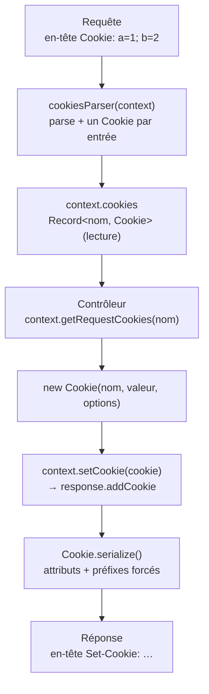

# Cookies — attributs, signature, parsing, HTTP et WebSocket

> Un cookie est le seul état que le serveur peut coller au navigateur du visiteur : une petite étiquette
> renvoyée à chaque requête. Cette page décrit la classe `Cookie` de Nodefony — comment on la construit,
> quels attributs de sécurité elle applique (et **force**), comment les cookies entrants sont lus, comment
> on lit et écrit un cookie depuis un contrôleur, et ce qui change côté WebSocket. Le cookie **de session**
> a sa propre page : [Sessions](session.md). Chaque fait est ancré sur le code.

📍 [Documentation](../../../../../docs/index.md) › [@nodefony/http](index.md) › **Cookies**

## 🧠 Le modèle mental — deux sens, une étiquette

Un cookie voyage dans **deux en-têtes différents**, et Nodefony traite les deux sens séparément :

- **Entrant** — le navigateur renvoie ses cookies dans l'en-tête `Cookie:`. Le pipeline le parse une fois
  et range chaque cookie dans `context.cookies` (lecture seule côté contrôleur).
- **Sortant** — le contrôleur crée un `Cookie`, le pose sur la réponse ; à l'envoi, chaque cookie est
  **sérialisé** en une ligne `Set-Cookie:` avec ses attributs.



Trois idées portent tout le reste :

1. **Lire et écrire ne sont pas symétriques.** On lit dans `context.cookies` (rempli par le parseur) ; on
   écrit en posant un `Cookie` sur la **réponse**. Un cookie entrant modifié en mémoire ne repart pas tout
   seul — il faut le (re)poser sur la réponse.
2. **La classe applique des défauts sûrs, et les fait respecter.** `Secure`, `HttpOnly`, `SameSite=Lax` par
   défaut ; les préfixes `__Host-`/`__Secure-` **imposent** leurs contraintes à la sérialisation.
3. **Le cookie de session est un cas particulier**, géré par le gestionnaire de sessions — décrit dans
   [Sessions](session.md), pas ici.

## 📖 Lexique

| Terme                 | Sens                                                                                                                            |
| --------------------- | ------------------------------------------------------------------------------------------------------------------------------- |
| `Cookie:` (en-tête)   | En-tête **de requête** : le navigateur y renvoie tous les cookies qu'il détient pour le domaine.                                |
| `Set-Cookie:`         | En-tête **de réponse** : le serveur y dépose un cookie (nom, valeur, attributs). Une ligne par cookie.                          |
| `HttpOnly`            | Attribut : le cookie est **invisible** à `document.cookie` (JavaScript) → un XSS ne peut pas le voler.                          |
| `Secure`              | Attribut : le cookie n'est renvoyé que sur une connexion **chiffrée** (HTTPS/WSS).                                              |
| `SameSite`            | Attribut anti-CSRF : `Strict` / `Lax` / `None` — dit si le cookie part sur une requête **inter-site**.                          |
| `Path` / `Domain`     | Portée du cookie : le préfixe d'URL et le domaine pour lesquels le navigateur le renvoie.                                       |
| `Max-Age` / `Expires` | Durée de vie : en secondes (`Max-Age`) ou date absolue (`Expires`). Absents = **cookie de session** (mort à la fermeture).      |
| `__Host-`             | Préfixe RFC 6265bis : le navigateur **exige** `Secure` + `Path=/` + **aucun** `Domain` — sinon il rejette le cookie.            |
| `__Secure-`           | Préfixe RFC 6265bis : le navigateur exige seulement `Secure`.                                                                   |
| Cookie **signé**      | Cookie dont la valeur porte un HMAC → le serveur détecte toute altération côté client (intégrité, pas confidentialité).         |
| HMAC                  | _Hash-based Message Authentication Code_ : empreinte clé-dépendante (ici `HMAC-SHA256`) — infalsifiable sans le secret.         |
| base64url             | Variante base64 **sûre en URL/cookie** (pas de `+`, `/`, `=`).                                                                  |
| Timing-safe           | Comparaison à temps constant (`crypto.timingSafeEqual`) : ne fuit pas la signature attendue par la durée de la comparaison.     |
| XSS                   | _Cross-Site Scripting_ : du JS injecté s'exécute dans la page victime — voler un cookie non `HttpOnly` en est le premier but.   |
| CSRF                  | _Cross-Site Request Forgery_ : un site tiers déclenche une requête authentifiée à l'insu de la victime — bloqué par `SameSite`. |
| Session fixation      | L'attaquant impose un identifiant de session connu de lui à la victime — `__Host-` empêche l'injection cross-sous-domaine.      |

## Qu'est-ce qu'un cookie, ici ?

Un cookie, c'est un **badge vestiaire** : le serveur remet un ticket au navigateur, qui le représente à
chaque passage. Le serveur reconnaît le porteur sans rien retenir de coûteux — juste la valeur du ticket.
Le badge peut porter des mentions : « ne pas montrer à un script » (`HttpOnly`), « seulement au guichet
sécurisé » (`Secure`), « pas valable si un autre site t'envoie » (`SameSite`).

Un cookie n'est pas neutre : c'est une **surface d'attaque**. Les attributs sont là pour la refermer.

- **`HttpOnly` bloque le vol par XSS.** Sans lui, un script injecté lit `document.cookie` et exfiltre le
  cookie de session. Avec lui, le cookie est hors de portée du JavaScript de la page.
- **`SameSite` bloque le CSRF.** Sans lui, une balise image (ou un formulaire) hébergée sur un site pirate
  déclenche une requête vers ta banque qui part **avec** le cookie de la victime. `Lax` (le défaut
  Nodefony) coupe cet envoi sur les requêtes inter-site dangereuses.
- **`__Host-` bloque la session fixation cross-sous-domaine.** Un sous-domaine compromis
  (`evil.example.com`) ne peut pas écrire un cookie qui remonterait vers `example.com` : le préfixe interdit
  `Domain` et impose `Path=/`.

## La vision Nodefony

Nodefony ne se contente pas de proposer ces attributs : il **choisit des défauts sûrs** et **fait respecter
les invariants** que le navigateur exigerait de toute façon — pour que l'erreur ne parte pas sur le fil.

**Le défaut est fermé.** Un cookie créé sans options est `Secure` + `HttpOnly` + `SameSite=Lax`
(`cookieDefaultSettings`, `cookie.ts:43`). Il faut **choisir** d'ouvrir (ex. `httpOnly: false` pour un
cookie lu en JS), jamais choisir de fermer.

**Les préfixes sont forcés, pas espérés.** Nommer un cookie `__Host-…` ne suffit pas : `serialize()`
(`cookie.ts:383`) **réécrit** la sortie — `Secure` ajouté, `Path=/` imposé, `Domain` retiré — pour que le
navigateur ne rejette jamais le cookie en silence. Idem `__Secure-` (Secure imposé) et `SameSite=None` (qui
impose `Secure`, `cookie.ts:393`).

**La signature refuse le secret prévisible.** Un cookie `signed: true` sans secret configuré **jette**
(`setValue()`, `cookie.ts:211`) : signer avec le secret public par défaut ne protégerait rien
(fail-closed). La vérification est **timing-safe** (`unsign()` → `crypto.timingSafeEqual`, `cookie.ts:380`).

**`SameSite` retombe toujours sur `Lax`, jamais sur `None`.** Toute valeur inconnue est normalisée vers
`Lax` (`setSameSite()`, `cookie.ts:250`) : `None` désactive la protection CSRF, ce n'est jamais un défaut.

**HTTP et WebSocket lisent les mêmes cookies.** Le parseur tourne pour les deux transports ; en revanche la
poignée de main WebSocket **ne peut pas** écrire de cookie (limite de la bibliothèque `ws`) — voir plus bas.

Liens utiles : [RFC 6265bis](https://datatracker.ietf.org/doc/html/draft-ietf-httpbis-rfc6265bis) ·
cookie de session → [Sessions](session.md) · en-têtes de sécurité → [En-têtes](../../security/docs/headers.md).

## 🚀 Démarrage rapide

Dans une application générée par `nodefony create app`, il n'y a **rien à configurer** pour les cookies
applicatifs : on construit un `Cookie`, on le lit ou on le pose depuis le contexte du contrôleur. Le
pipeline a déjà parsé les cookies entrants avant que ton action ne s'exécute.

### Un contrôleur qui lit et écrit un cookie

```typescript
// nodefony/controller/PreferencesController.ts — complet, compile tel quel
import { Controller, controller, Get } from "@nodefony/framework";
import { Cookie } from "@nodefony/http";
import type { Context } from "@nodefony/http";

@controller("/prefs")
class PreferencesController extends Controller {
  constructor(context: Context) {
    super("PreferencesController", context);
  }

  // LECTURE — le pipeline a déjà parsé l'en-tête `Cookie:` dans context.cookies.
  @Get("/")
  async read() {
    const theme = this.context?.getRequestCookies("theme");
    return this.renderJson({
      theme: theme instanceof Cookie ? theme.value : null,
    });
  }

  // ÉCRITURE — construire puis poser sur la réponse ; l'attribut Secure/HttpOnly
  // /SameSite=Lax est appliqué par défaut. Ici on OUVRE volontairement en JS.
  @Get("/set")
  async write() {
    const cookie = new Cookie("theme", "dark", {
      maxAge: 30 * 24 * 60 * 60, // 30 jours, EN SECONDES
      sameSite: "Lax",
      httpOnly: false, // préférence non sensible → lisible côté client
    });
    this.context?.setCookie(cookie);
    return this.renderJson({ set: cookie.serialize() });
  }
}

export default PreferencesController;
```

### Ce qu'on observe au terminal

```bash
# Poser le cookie — la ligne Set-Cookie porte les attributs sérialisés
curl -si http://127.0.0.1:5151/prefs/set | grep -i set-cookie
# set-cookie: theme=dark; Max-Age=2592000; Path=/; SameSite=Lax; Expires=…

# Le renvoyer et le lire
curl -s --cookie "theme=dark" http://127.0.0.1:5151/prefs
# {"theme":"dark"}
```

> [!NOTE]
> Le défaut `Secure` fait qu'un cookie posé en HTTP clair (`5151`) n'est stocké par le navigateur **que**
> sur `localhost` (tolérance des navigateurs). En production, on sert en HTTPS et `Secure` est correct.

### Un cookie signé (intégrité)

Pour qu'une valeur ne puisse pas être **falsifiée** côté client (sans la chiffrer), signe-la — il faut un
secret **configuré** (le secret par défaut est refusé) :

```typescript ignore
// fragment — un secret prévisible est refusé (fail-closed)
const c = new Cookie("pref", "v1", {
  signed: true,
  secret: process.env.COOKIE_SECRET!,
});
// c.value === "s:v1.<hmac base64url>" ; c.unsign() renvoie "v1" ou false si altéré
```

## 🧰 API publique

Les signatures exactes vivent dans `.ai/symbols.json` et les types générés — jamais recopiées ici. Ce qui
suit montre l'**usage réel**. La classe s'importe `import { Cookie } from "@nodefony/http"` ; les interfaces
`ICookie`, `ICookieOptions`, `IWsCookie`, `SameSiteType` en `import type`.

### Construire un cookie et ses attributs

Le constructeur accepte `(nom, valeur, options?)` ou **un cookie à copier** (surcharge,
`cookie.ts:149`). Les options fusionnent avec les défauts sûrs.

| Option     | Type                       | Défaut       | Effet                                                                  |
| ---------- | -------------------------- | ------------ | ---------------------------------------------------------------------- |
| `maxAge`   | `number` (secondes)        | `0`          | Durée de vie. `0` = cookie de session (ni `Max-Age` ni `Expires`).     |
| `expires`  | `Date \| string \| number` | —            | Date d'expiration absolue (`setExpires()`, `cookie.ts:264`).           |
| `path`     | `string`                   | `/`          | Préfixe d'URL de portée.                                               |
| `domain`   | `string`                   | `undefined`  | Domaine de portée (retiré si nom `__Host-`).                           |
| `secure`   | `boolean`                  | `true`       | HTTPS only. Forcé si `SameSite=None` ou préfixe `__Host-`/`__Secure-`. |
| `httpOnly` | `boolean`                  | `true`       | Invisible à `document.cookie` (anti-XSS).                              |
| `sameSite` | `SameSiteType`             | `Lax`        | `Strict`/`Lax`/`None`. Toute autre valeur retombe sur `Lax`.           |
| `signed`   | `boolean`                  | `false`      | Signe la valeur (HMAC). Exige `secret` configuré, sinon **jette**.     |
| `secret`   | `string`                   | (par défaut) | Clé HMAC. Le secret par défaut est **refusé** pour signer.             |
| `priority` | `High \| Medium \| Low`    | `undefined`  | Attribut `Priority` (`setPriority()`, `cookie.ts:297`).                |

Les défauts sont matérialisés dans `cookieDefaultSettings` (`cookie.ts:43`) ; la fusion se fait dans le
constructeur de `Cookie` (`cookie.ts:134`).

### Sérialiser : `serialize()` et `serializeWebSocket()`

- `serialize()` (`cookie.ts:383`) produit la **ligne `Set-Cookie`** complète (attributs dans l'ordre,
  préfixes forcés, `Max-Age` seulement s'il est positif).
- `serializeWebSocket()` (`cookie.ts:425`) produit un **objet** `IWsCookie` (mêmes invariants de sécurité)
  — utilisé quand un cookie doit être décrit hors en-tête HTTP.
- `toString()` (`cookie.ts:317`) ne rend que `nom=valeurEncodée` (sans attributs).

### Signer / vérifier : `sign()` et `unsign()`

- `sign(val, secret)` (`cookie.ts:331`) → `val.base64url(HMAC-SHA256)` — la valeur d'origine est
  **préservée** (récupérable), la signature garantit l'intégrité.
- `unsign(val?, secret?)` (`cookie.ts:355`) → la valeur en clair si la signature est valide, sinon `false`.
  Comparaison **timing-safe** (`cookie.ts:380`) ; tolère le préfixe marqueur `s:`.

### Lire et écrire depuis le contexte

| Besoin                         | Appel                                                 | Où                                       |
| ------------------------------ | ----------------------------------------------------- | ---------------------------------------- |
| Lire un cookie entrant         | `context.getRequestCookies("nom")` → `Cookie \| null` | `getRequestCookies()` (`Context.ts:660`) |
| Lire tous les cookies entrants | `context.cookies` → `Record<string, Cookie>`          | `cookies` (`Context.ts:149`)             |
| Écrire un cookie sortant       | `context.setCookie(new Cookie(…))`                    | `setCookie()` (`Context.ts:667`)         |
| Supprimer un cookie sortant    | `response.deleteCookieByName("nom")`                  | `http/Response.ts:99`                    |

Côté réponse HTTP, `addCookie()` (`http/Response.ts:101`) enregistre le cookie, et `setCookies()`
(`http/Response.ts:107`) émet **une ligne `Set-Cookie` par cookie** — un tableau passé à Node, jamais une
boucle de `setHeader` (qui écraserait tout sauf le dernier). Pour expirer un cookie chez le client :
`clearCookie()` (`cookie.ts:198`) recule `Expires` à l'époque.

### Parsing des cookies entrants

`cookiesParser(context)` (`cookie.ts:91`) lit l'en-tête `Cookie:` (via la bibliothèque `cookie`,
`parser()` `cookie.ts:54`), crée un `Cookie` par entrée et l'ajoute au contexte avec `addRequestCookie()`
(`Context.ts:650`). Il est déclenché automatiquement par le pipeline : `parseCookies()` est appelé à
l'initialisation du contexte HTTP (`HttpContext.ts:190`) **et** WebSocket (`WebsocketContext.ts:170`).

### Côté WebSocket — lecture oui, écriture non

Les cookies **entrants** sont lus au handshake, exactement comme en HTTP (même parseur). Mais la **poignée
de main WebSocket ne peut pas poser de cookie** : `setCookie()` et `setCookies()` de la réponse WS sont des
**no-op** (`websocket/Response.ts:295`), une limite de la bibliothèque `ws`. Le cookie de session, lui, est
posé pendant la **phase HTTP** qui précède l'upgrade. La forme d'un cookie décrit pour le WS est
`IWsCookie` (`ICookie.ts:19`), produite par `serializeWebSocket()`.

## ⚙️ Configuration

Les cookies **applicatifs** ne se configurent pas par schéma : on les construit dans le code, avec les
défauts sûrs de `cookieDefaultSettings` (`cookie.ts:43`). Le seul cookie **piloté par la config** est celui
de la **session** — bloc Zod `sessionCookieSchema` (`config.ts:727`), avec notamment `hostPrefix`
(`config.ts:730`) qui décide du préfixe `__Host-`. Tout cela est documenté dans [Sessions](session.md) :
cette page ne le duplique pas.

Le nom effectif du cookie de session (avec ou sans `__Host-` selon le transport) est calculé par
`getSessionCookieName()` (`Context.ts:714`) — encore un détail qui appartient à la page Sessions.

## 🛡️ Défenses par attribut

| Attribut / mécanisme       | Faille bloquée                          | Comment Nodefony l'applique                                              |
| -------------------------- | --------------------------------------- | ------------------------------------------------------------------------ |
| `HttpOnly` (défaut `true`) | Vol de cookie par **XSS**               | Défaut fermé (`cookieDefaultSettings`, `cookie.ts:43`)                   |
| `SameSite=Lax` (défaut)    | **CSRF** inter-site                     | Fallback toujours `Lax`, jamais `None` (`setSameSite()` `cookie.ts:250`) |
| `Secure` (défaut `true`)   | Interception en clair                   | Forcé aussi par `None`/préfixes (`serialize()` `cookie.ts:393`)          |
| Préfixe `__Host-`          | **Session fixation** cross-sous-domaine | `Domain` retiré + `Path=/` imposés (`serialize()` `cookie.ts:399`)       |
| Cookie signé (HMAC)        | Altération de la valeur côté client     | `sign()`/`unsign()` timing-safe (`cookie.ts:331`, `cookie.ts:380`)       |
| Refus du secret par défaut | Signature « fantôme » sans protection   | Fail-closed à la signature (`setValue()` `cookie.ts:199`)                |

## 📜 Normes appliquées

| Domaine                            | Norme                | Ancrage                                                            |
| ---------------------------------- | -------------------- | ------------------------------------------------------------------ |
| Cookies — syntaxe `Set-Cookie`     | RFC 6265bis          | `serialize()` (`cookie.ts:383`)                                    |
| `SameSite` — 3 valeurs canoniques  | RFC 6265bis §5.4.7   | `SameSiteType` (`ICookie.ts:3`), `setSameSite()` (`cookie.ts:250`) |
| Préfixes `__Host-` / `__Secure-`   | RFC 6265bis §4.1.3   | `serialize()` force les contraintes (`cookie.ts:390`)              |
| `SameSite=None` impose `Secure`    | RFC 6265bis          | `serialize()` (`cookie.ts:393`)                                    |
| Intégrité — HMAC-SHA256, base64url | RFC 2104 / RFC 4648  | `sign()` (`cookie.ts:331`)                                         |
| Vérification à temps constant      | bonne pratique OWASP | `unsign()` → `timingSafeEqual` (`cookie.ts:380`)                   |

## ⚠️ Pièges (symptôme → cause → correction)

| Symptôme                                                  | Cause                                                                     | Correction                                                               |
| --------------------------------------------------------- | ------------------------------------------------------------------------- | ------------------------------------------------------------------------ |
| Le cookie posé en HTTP clair n'est pas stocké             | Défaut `Secure: true` → le navigateur exige HTTPS (sauf `localhost`)      | Servir en HTTPS, ou `secure: false` en dev hors localhost                |
| Un cookie `__Host-` ignore mon `Domain`/`Path`            | `serialize()` **force** les contraintes du préfixe                        | Attendu (RFC 6265bis) — renommer sans préfixe si tu veux un `Domain`     |
| `new Cookie(..., { signed: true })` **jette**             | Aucun `secret` configuré → refus du secret prévisible (fail-closed)       | Passer un `secret` réel (`{ signed: true, secret: … }`)                  |
| Modifier un cookie entrant ne change rien côté client     | Lecture (`context.cookies`) et écriture (réponse) ne sont pas symétriques | (Re)poser le cookie sur la réponse : `context.setCookie(new Cookie(…))`  |
| Le cookie WS posé au handshake n'arrive jamais            | `setCookie`/`setCookies` de la réponse WS sont des no-op (`ws`)           | Poser le cookie pendant la phase HTTP avant l'upgrade (cf session)       |
| Deux `Set-Cookie` s'écrasent, un seul survit              | Un `setHeader('Set-Cookie', str)` remplace le précédent                   | Déjà géré : `setCookies()` passe un **tableau** (`http/Response.ts:117`) |
| `SameSite` mal orthographié devient `Lax` silencieusement | Fallback fail-safe sur `Lax`                                              | Attendu — vérifier la casse ; `Strict`/`Lax`/`None` seulement            |
| `maxAge` interprété en millisecondes                      | `maxAge` est en **secondes** (comme `Set-Cookie` Max-Age)                 | Passer des secondes (`30*24*60*60`), pas des ms                          |

## 📡 Observabilité

Il n'y a pas d'écran Studio dédié aux cookies applicatifs (le cookie **de session** est surfacé dans
l'écran **Sessions**). En développement, chaque écriture de cookie est journalisée en `DEBUG` par la
réponse HTTP (`ADD COOKIE ==> …`, `setCookie()` `http/Response.ts:126`) — visible via le skill
`nodefony-tail-error-logs` ou le Suivi de requête. Sur le fil, un `curl -i` montre les lignes `Set-Cookie`.

## 🧪 Tests & couverture

Les chiffres exacts vivent dans la carte de tests de cette page (régénérée depuis vitest, jamais figés dans
le Markdown).

| Type                   | Où                                                                                                    |
| ---------------------- | ----------------------------------------------------------------------------------------------------- |
| Unitaire (dédié)       | `tests/unit/Cookie.test.ts` — constructeur, copie, `toString`, `serialize`, `clearCookie`, `setValue` |
| Unitaire — RFC 6265bis | `Cookie.test.ts` — `SameSite`/`__Host-`/`__Secure-`, `None ⇒ Secure`, `serializeWebSocket`            |
| Unitaire — signature   | `Cookie.test.ts` — `sign`/`unsign` (round-trip, altération, mauvais secret, `s:`, fail-closed)        |
| Unitaire — régression  | `Cookie.test.ts` — overflow `Max-Age`/`Expires` (`maxAge=0/3600/86400/undefined`)                     |
| Adjacent (réponse)     | `tests/unit/Response.test.ts` — `addCookie`/`setCookies` côté `HttpResponse`                          |

Ce qui **manque** aujourd'hui : le round-trip `Set-Cookie` → navigateur → `Cookie:` d'un cookie
**applicatif** arbitraire n'a pas de test d'intégration dédié (il est exercé indirectement par les tests de
session et de CSRF, qui posent et relisent des cookies sur serveur réel) ; et il n'y a pas de test
d'attaque `*.attack.test.ts` centré cookies (l'altération de valeur signée est couverte unitairement).

Suites : `npm test` (unitaires — la classe `Cookie` s'y teste sans serveur). Couverture : `npm run
coverage` dans `@nodefony/http` — le pourcentage vit dans le rapport vitest, jamais figé ici. Skill
associé : `nodefony-security-review` (revue des attributs de sécurité d'un cookie dans un diff).

## 🔗 Pour aller plus loin

- ⬆️ **Retour au hub** : [@nodefony/http — vue du module](index.md) · [Toute la documentation](../../../../../docs/index.md)
- 🧭 **Pages sœurs** : [Sessions](session.md) (le cookie de session, sa config `hostPrefix`, sa révocation) · [Serveurs](servers.md)
- Le trajet complet d'une requête (où le parsing des cookies s'insère) → [pipeline-requete](../../../../../docs/architecture/pipeline-requete.md)
- En-têtes de sécurité applicatifs (CSP, Referrer-Policy…) → [En-têtes](../../security/docs/headers.md)
- Le pare-feu et CSRF par-dessus le transport → [Firewall](../../security/docs/firewall.md)
- Configuration d'application (`defineConfig`, `use`, env) → [configuration](../../../../../docs/guides/configuration.md)
