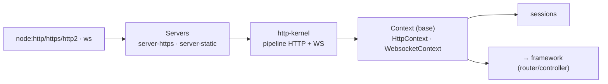

# @nodefony/http — vue du module

> La couche transport : serveurs HTTP/HTTPS/HTTP2 et WebSocket/WSS, le **contexte de requête partagé**
> entre web et temps réel, les sessions, cookies, upload, statiques, rate-limit, certificats et le
> profiler. Point d'entrée du module — il récapitule et renvoie aux pages de brique. Ancré sur le code.

## Schéma général

## Lexique

| Sigle      | Sens                                                    |
| ---------- | ------------------------------------------------------- |
| HTTP/2     | Version multiplexée de HTTP (streams, pseudo-en-têtes). |
| WS / WSS   | WebSocket (chiffré).                                    |
| Context    | L'objet-requête partagé HTTP+WS.                        |
| Rate limit | Limitation du débit de requêtes (anti-abus).            |
| ALS        | AsyncLocalStorage (suivi de requête).                   |
| Profiler   | Mesure des phases d'une requête.                        |

## Qu'est-ce que ce module

C'est la fondation réseau : ouvrir les serveurs, accepter les connexions, et **construire le contexte**
que tout le reste consomme. Sa particularité : HTTP et WebSocket ne sont pas deux mondes mais deux
entrées du **même** pipeline (voir la page dédiée).

## La vision Nodefony

Le service `http-kernel` (`nodefony/service/http-kernel.ts`) orchestre le pipeline pour les deux
transports ; `Context` (`nodefony/src/context/Context.ts:123`) est la base commune dont héritent
`HttpContext` (`:77`) et `WebsocketContext` (`:83`). Les serveurs (HTTP/HTTPS/HTTP2 + WS/WSS) partagent
la même résolution de zone et de session. Le module gère aussi les **en-têtes de sécurité de socle**
(complétés par le firewall), le rate-limit d'entrée, et l'observabilité (profiler, admin API).

## Les briques du module (→ pages dédiées)

| Brique              | Rôle                                           | Page                                                       |
| ------------------- | ---------------------------------------------- | ---------------------------------------------------------- |
| Pipeline & contexte | HTTP+WS, contexte partagé, cycle d'une requête | [pipeline](../../../docs/architecture/pipeline-requete.md) |
| Sessions            | État serveur, cookie, stores, sécurité         | [session](./session.md)                                    |
| Serveurs            | HTTP/HTTPS/HTTP2, statiques, TLS/certificats   | [servers](./servers.md)                                    |
| Cookies             | Lecture/écriture, signature, préfixes          | [cookies](./cookies.md)                                    |
| Upload              | Réception de fichiers, limites                 | [upload](./upload.md)                                      |
| Rate limit          | Limitation IP / handshake WS (RFC 6585)        | [rate-limit](./rate-limit.md)                              |
| Profiler & admin    | Phases, métriques, data plane admin            | [observabilite](./observabilite.md)                        |

## Surface publique

Exports clés : `Context`, `HttpContext`, `WebsocketContext`, `Session`, `SessionsService`, les serveurs,
`cookie`, `httpError`, le profiler. Signatures : `.ai/symbols.json` (jamais recopiées à la main).

## Configuration

Blocs Zod (`nodefony/config/config.ts`) : `session`/`cookie`, `trustProxy`, `certificates`, `upload`,
HTTP/2 (`maxConcurrentStreams`, `maxSessionMemory` — défense CVE-2023-44487), rate-limit, statiques.
Chaque page de brique détaille son bloc.

## Normes appliquées

RFC 9110/9111/9112 (HTTP/1.1, sémantique, cache), RFC 9113 (HTTP/2), RFC 6455 (WebSocket, codes de
fermeture), RFC 6265bis (cookies), RFC 6585 (429), WHATWG Fetch (CORS), W3C Trace Context.

## Observabilité — Studio

Profiler et data plane admin (`HttpAdminApi`) ; sessions surfacées dans l'écran **Sessions** de Studio ;
traces via `traceparent` (écran Traces).

## Tests & couverture

Bancs de contrat (`tests/support/*Contract.ts`), tests HTTP/WS/intégration, **tests de charge**
(`tests/load/*` : ALS, sessions, WS connexions/latence/messages, stream) et `memory.test.ts`.
`npm run coverage` dans `@nodefony/http` (le % vit dans le rapport vitest, pas ici).

## Pour aller plus loin

- Pipeline de requête → [pipeline-requete](../../../docs/architecture/pipeline-requete.md)
- Routage & contrôleurs → `src/packages/@nodefony/framework/docs/index.md`
- Vue d'ensemble → [vue-ensemble](../../../docs/architecture/vue-ensemble.md)
