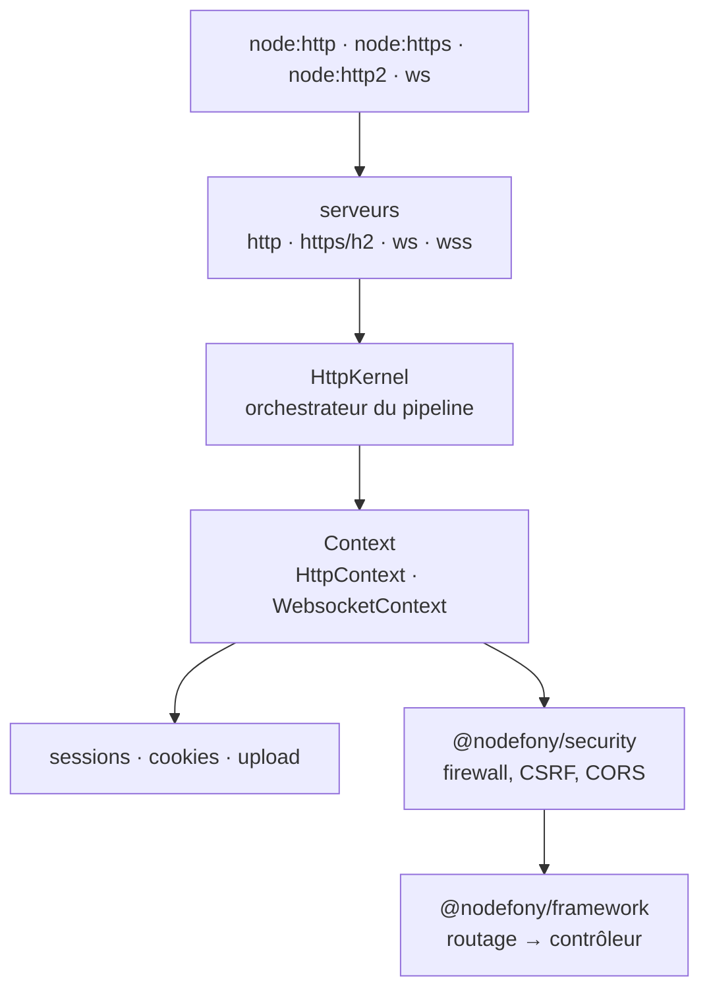

# @nodefony/http — la couche transport

> Les portes d'entrée du processus. Ce module ouvre les sockets, accepte les connexions — web **et**
> temps réel — et construit le **contexte de requête** que tout le reste du framework consomme. Sa
> particularité tient en une phrase : HTTP et WebSocket ne sont pas deux mondes, ce sont **deux entrées
> du même pipeline**. C'est de là que vient le différenciateur de Nodefony.

📍 [Documentation](../../../../../docs/index.md) › **@nodefony/http**

## 🧭 Par où commencer

Trois parcours selon ce que tu viens faire. L'ordre compte : chaque étape suppose la précédente.

**Je découvre le module** — comprendre avant de configurer.

1. [Serveurs](servers.md) — ce qui écoute, sur quels ports, et comment ça démarre et s'arrête.
2. [Pipeline de requête](../../../../../docs/architecture/pipeline-requete.md) — le trajet complet
   d'une requête, du socket jusqu'à ton contrôleur. **La page qui relie tout.**
3. [Sessions](session.md) — le premier état serveur que rencontre une application réelle.
4. [Routage et contrôleurs](../../framework/docs/index.md) — la suite du voyage, dans `@nodefony/framework`.

**Je mets en production** — ce qu'un serveur exposé doit tenir.

1. [Serveurs](servers.md) — TLS, certificats, politique de port, arrêt gracieux, sondes de vie.
2. [Sessions](session.md) — choisir un store partagé : sans lui, deux pods ne partagent aucune session.
3. [Pipeline de requête](../../../../../docs/architecture/pipeline-requete.md) — où se branchent
   rate-limit, en-têtes et firewall.
4. [Sécurité](../../security/docs/index.md) — le pare-feu applicatif se pose par-dessus ce module.

**Je fais du temps réel** — WebSocket dans le même contexte que le web.

1. [Serveurs](servers.md) — le WS n'a pas de port à lui : il se greffe sur son porteur HTTP.
2. [Sessions](session.md) — la session côté WebSocket, et pourquoi elle passe par l'ALS.
3. [La socket Nodefony](../../realtime/docs/index.md) — la couche au-dessus,
   qui multiplexe N canaux sur une connexion.

## 🗂️ Les briques du module

Le tableau pour choisir vite ; les cards en dessous pour savoir ce qu'on y trouve.

| Brique                                                                      | Ce qu'elle résout                              | Tu en as besoin quand…                            |
| --------------------------------------------------------------------------- | ---------------------------------------------- | ------------------------------------------------- |
| [Serveurs](servers.md)                                                      | ouvrir, régler, transmettre, fermer proprement | toujours — c'est la fondation                     |
| [Sessions](session.md)                                                      | de l'état serveur rattaché à un visiteur       | login, panier, préférences, WS authentifié        |
| [Pipeline de requête](../../../../../docs/architecture/pipeline-requete.md) | l'ordre exact des étapes, HTTP comme WS        | tu débugges « pourquoi ça passe / ça bloque ici » |

```nodefony-cards
[
  { "icon": "🔌", "title": "servers", "href": "servers.md",
    "desc": "Deux ports, quatre serveurs, un seul pipeline : politique de port, certificats et TLS de développement, réglage du transport, sondes de liveness/readiness, arrêt gracieux, défenses de bordure (slow-loris, floods, zombies WebSocket).",
    "meta": "commence ici — tout le reste suppose un serveur qui écoute" },
  { "icon": "🗝️", "title": "session", "href": "session.md",
    "desc": "Cycle de vie complet, cookie opaque, les quatre stores (memory, drizzle, redis, mongoose) et comment auto en choisit un, les délais NIST, la révocation, la session côté WebSocket.",
    "meta": "la brique où un choix de dev (memory) devient un bug de prod" },
  { "icon": "🔀", "title": "pipeline-requete", "href": "../../../../../docs/architecture/pipeline-requete.md",
    "desc": "Où ce module s'arrête et où le framework prend le relais, et dans quel ordre s'enchaînent contexte, rate-limit, routage, session, CSRF et firewall.",
    "meta": "page transverse — celle qui relie tout" }
]
```

> [!NOTE]
> **Le module couvre plus que ces trois pages.** Cookies, upload de fichiers, rate-limit, fichiers
> statiques, certificats et profiler sont implémentés et testés, mais n'ont pas encore leur page
> dédiée. En attendant, leur configuration est décrite dans les blocs Zod de
> `nodefony/config/config.ts`, et leur comportement dans la page [Serveurs](servers.md) pour la partie
> transport.

## 🏛️ Place dans le framework



`@nodefony/http` ne connaît ni les routes ni les contrôleurs — il ne peut pas importer
`@nodefony/framework` (ce serait un cycle). Il expose un contexte ; le framework s'y branche.

## 🧰 Surface publique

Depuis une application : `Context`, `HttpContext`, `WebsocketContext`, `Session`, `SessionsService`,
les services de serveurs, `cookie`, `httpError`, le profiler. Les signatures exactes vivent dans
`.ai/symbols.json` et dans les types générés — jamais recopiées à la main dans cette page, où elles
se périmeraient en silence.

## ⚙️ Configuration

Tout se déclare dans `nodefony.config.ts` via `use("@nodefony/http", { … })`. Les blocs Zod
(`nodefony/config/config.ts`) couvrent : `servers` (ports, transport, TLS, HTTP/2), `session` et
`cookie`, `trustProxy`, `certificates`, `upload`, le rate-limit et les fichiers statiques. Chaque page
de brique détaille son bloc et ses défauts réels.

## 📜 Normes appliquées

RFC 9110/9111/9112 (sémantique HTTP, cache, HTTP/1.1), RFC 9113 (HTTP/2), RFC 6455 (WebSocket et ses
codes de fermeture), RFC 6265bis (cookies), RFC 6585 (429), RFC 6125 (identité des certificats),
WHATWG Fetch (CORS), W3C Trace Context (`traceparent`).

## 📡 Observabilité — Studio

Le profiler mesure les phases d'une requête et alimente le data plane admin (`HttpAdminApi`). Les
sessions sont surfacées dans l'écran **Sessions** de Studio, les corrélations par `traceparent` dans
l'écran **Traces**, et l'état des serveurs dans la carte du module.

## 🧪 Tests & couverture

Le module porte la plus grosse couverture du dépôt — les chiffres exacts vivent dans la carte de
l'aperçu, régénérée depuis vitest, jamais figés dans la prose.

| Type             | Où                                    | Ce qui est prouvé                                     |
| ---------------- | ------------------------------------- | ----------------------------------------------------- |
| Unitaire         | `tests/unit/**`                       | cookies, session, erreurs, trust-proxy, requestId     |
| Intégration      | `tests/{http,integration,routing}/**` | pipeline réel sur serveur vivant, TLS, statiques      |
| WebSocket        | `tests/websockets/**`                 | handshake, protocoles, binaire, broadcast, sessions   |
| Contrat          | `tests/support/*Contract.ts`          | un store tiers respecte le contrat attendu            |
| Charge / mémoire | `tests/load/**` + `memory.test.ts`    | seuils de heap, connexions soutenues, débit de frames |

## 🔗 Pour aller plus loin

- Le trajet d'une requête → [pipeline-requete](../../../../../docs/architecture/pipeline-requete.md)
- Routage et contrôleurs → [@nodefony/framework](../../framework/docs/index.md)
- Le pare-feu par-dessus → [@nodefony/security](../../security/docs/index.md)
- Choisir un store de sessions → [session-storage](../../../../../docs/guides/session-storage.md)
- Vue d'ensemble du framework → [vue-ensemble](../../../../../docs/architecture/vue-ensemble.md)
