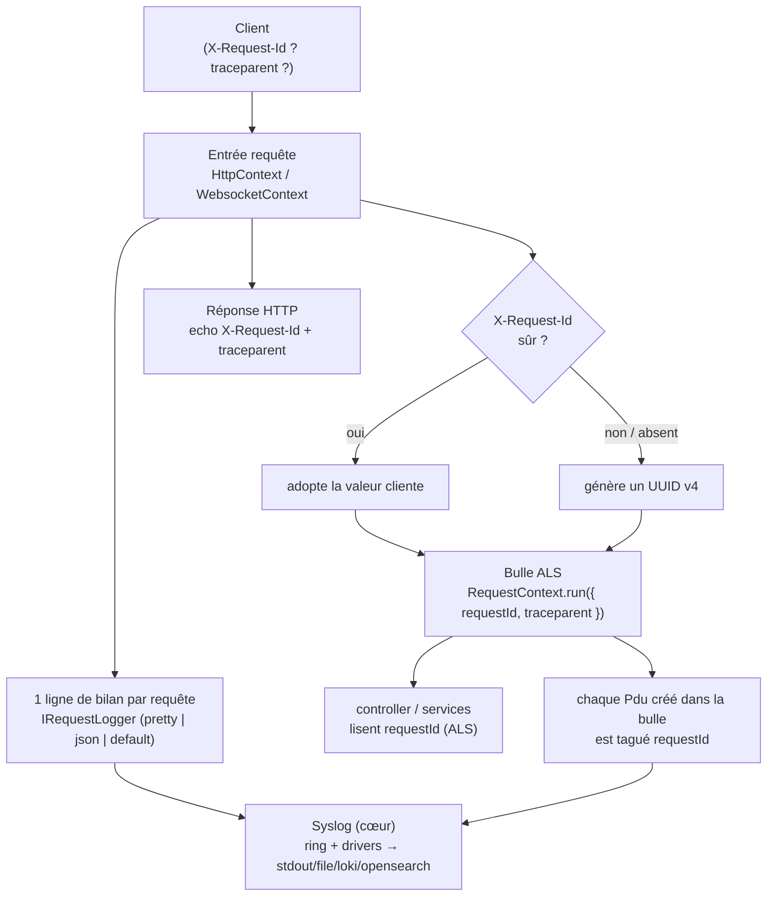

# Observabilité HTTP — journalisation de requête, corrélation, trace

> Ce que le module produit pour **voir** ce qui traverse le serveur : une ligne de log par requête
> (méthode, statut, durée, taille), un **identifiant de corrélation** (`requestId`) qui relie toutes
> les lignes d'une même requête — HTTP comme WebSocket —, et une **trace** W3C (`traceparent`) qui
> franchit les frontières de service. Cette page décrit ce que `@nodefony/http` **émet** ; pour savoir
> **où** partent ces lignes (stdout, fichier, Loki, OpenSearch), voir la page Syslog du cœur.

📍 [Documentation](../../../../../docs/index.md) › [@nodefony/http](index.md) › **Observabilité**

## 🧠 Le modèle mental — un fil rouge par requête

Le cœur de l'observabilité ici n'est pas « écrire des logs » — c'est **corréler**. Chaque requête reçoit
un `requestId` dès son entrée ; ce fil est ensuite **teinté** dans chaque ligne de log qu'elle produit,
partout dans la pile async, sans qu'on ait à le passer d'appel en appel. Le débogage cesse d'être « quelle
ligne appartient à quelle requête ? ».



Trois idées portent tout le reste :

1. **Le `requestId` est le fil rouge.** Généré à l'entrée, adopté du client s'il est sûr, propagé par
   `AsyncLocalStorage` (ALS), réfléchi au client, écrit dans chaque log.
2. **Le format de la ligne de bilan est un choix d'opérateur.** Un même contrat (`IRequestLogger`) a
   trois implémentations livrées : verbeux (défaut), joli (dev), JSON (prod).
3. **Le module émet, Syslog achemine.** Ce module fabrique le contenu (ligne, `requestId`, `traceparent`)
   et le remet à `context.log()` ; le **backplane Syslog** décide où il part (page dédiée).

## 📖 Lexique

| Terme            | Sens                                                                                                                                 |
| ---------------- | ------------------------------------------------------------------------------------------------------------------------------------ |
| `requestId`      | Identifiant unique d'une requête (UUID v4 par défaut). Corrèle toutes ses lignes de log. Stable de bout en bout.                     |
| `X-Request-Id`   | En-tête HTTP de **convention** (de-facto, non normalisé) portant le `requestId` : le client peut l'imposer, le serveur le réfléchit. |
| Corrélation      | Relier des lignes de log éparses à la **même** requête via une clé partagée (`requestId`, `pid`).                                    |
| ALS              | _AsyncLocalStorage_ : mémoire Node attachée au contexte d'exécution async — propage `requestId` sans le passer en argument.          |
| `RequestContext` | Façade Nodefony au-dessus de l'ALS : `getRequestId()`, `getUser()`, `getUserId()`, `traceparent`.                                    |
| `Pdu`            | _Process Data Unit_ : une entrée de log structurée (RFC 5424). Porte `requestId` + `pid`.                                            |
| Syslog           | Le hub de logs du cœur (ring buffer + drivers). Reçoit chaque `Pdu` — **page distincte**.                                            |
| `traceparent`    | En-tête **W3C Trace Context** : `version-traceId-spanId-flags`. Corrèle une requête à travers plusieurs services.                    |
| traceId / spanId | Identifiant global d'une trace (16 o) / d'un maillon (8 o) au sein de cette trace.                                                   |
| Access log       | Ligne récapitulative émise **en fin** de requête (méthode, statut, durée, `requestId`).                                              |
| Audit log        | Access log au format JSON canonique (1 objet/requête), destiné à l'ingestion machine (Loki/ELK/OTel).                                |
| Redaction        | Ne jamais journaliser un secret : `Authorization`/`Cookie` sont réduits à des **drapeaux de présence**.                              |
| Sampling         | N'écrire qu'une requête nominale sur N (2xx/3xx), en gardant **toutes** les erreurs — levier perf du hot path.                       |
| Phases / timing  | Découpage chronométré du pipeline (`resolve`, `action`…) ; alimente la durée et le waterfall du Suivi de requête.                    |

## Qu'est-ce que l'observabilité d'une requête ?

Imagine un colis dans un centre de tri. Sans **numéro de suivi**, chaque tapis roulant note « un colis
est passé » — mais personne ne peut reconstituer le trajet d'UN colis précis. Le `requestId` est ce
numéro de suivi : collé à l'entrée, il apparaît sur chaque scan, si bien qu'une recherche par numéro
rassemble toute l'histoire de la requête — l'authentification, la requête SQL lente, l'erreur finale.

Concrètement, l'observabilité de la couche HTTP répond à trois questions, et rien d'autre :

1. **Que s'est-il passé ?** — une ligne par requête : `GET 200 /api/x 12.3ms 127.0.0.1 [a1b2c3d4]`.
2. **Ces lignes vont-elles ensemble ?** — le `requestId` les relie ; le `pid` dit quel worker.
3. **Cette requête vient-elle d'ailleurs ?** — le `traceparent` W3C rattache la requête à une trace
   distribuée initiée par un service amont.

> [!NOTE]
> Cette page couvre ce que le module **produit**. La **destination** des logs (stdout cloud-native,
> fichier, Grafana Loki, OpenSearch) et le format RFC 5424 du `Pdu` appartiennent au backplane Syslog du
> cœur → [Journalisation (Syslog)](../../../../nodefony/docs/syslog.md).

## La vision Nodefony

Le différenciateur — **HTTP et WebSocket dans le même pipeline** — se retrouve dans l'observabilité :
un `requestId`, un `traceparent` et un contrat de logger **uniques** couvrent les deux transports.

**Le `requestId` est un citoyen du contexte, pas un décor.** Il naît dans le constructeur de base
`Context.requestId = randomUUID()` (`Context.ts:184`), voyage dans l'ALS via `RequestContext.run(...)`
(`http-kernel.ts:1151` pour HTTP, `http-kernel.ts:1438` pour WS), et se lit de n'importe où avec
`RequestContext.getRequestId()` — un controller, un service, un adapter ORM, sans jamais le threader.

**La ligne de bilan est branchable.** Le kernel ne code pas un format en dur : il consulte un
`IRequestLogger` (`IRequestLogger.ts:25`) résolu au boot depuis la config (`applyRequestLoggerFromConfig`,
`http-kernel.ts:570`), remplaçable à chaud par `httpKernel.setRequestLogger(...)` (`http-kernel.ts:738`).
Trois formateurs sont livrés ; un quatrième maison s'écrit en implémentant l'interface.

**Zero Trust sur l'entrée cliente.** Un `X-Request-Id` fourni par le client finit réfléchi en réponse,
écrit dans les logs et propagé en ALS — donc une valeur non assainie ouvrirait log-injection (CR/LF) et
throw natif de `setHeader`. Nodefony **valide puis adopte, ou rejette** (`sanitizeRequestId`,
`requestId.ts:38`) : jamais nettoyer (masquerait l'abus), toujours retomber sur l'UUID serveur.

## 🚀 Démarrage rapide

Dans une application générée par `nodefony create app`, **l'observabilité est déjà là** : chaque requête
a son `requestId`, chaque réponse le réfléchit, chaque log le porte. On n'écrit que ses **écarts** — le
format de ligne — puis on lit le `requestId` là où on en a besoin.

### 1. Choisir le format des lignes de log

Le format est un choix d'opérateur (config d'app). Défaut `auto` : joli en dev, JSON en prod.

```typescript
// nodefony.config.ts — le format des lignes de log de requête
export default defineConfig((ctx) => ({
  log: {
    // "auto" (défaut) = pretty en dev / json en prod. On force ici JSON en prod
    // pour un pipeline d'ingestion (Loki/ELK) qui parse 1 objet par requête.
    requestFormat: ctx.isProd ? "json" : "pretty",
  },
  modules: ["@nodefony/http", "@nodefony/framework"],
}));
```

### 2. Lire le `requestId` dans un contrôleur

Rien à câbler : le `requestId` est déjà sur le contexte, et déjà réfléchi au client.

```typescript
// nodefony/controller/TraceController.ts — complet, compile tel quel
import { Controller, controller, Get } from "@nodefony/framework";
import type { Context } from "@nodefony/http";

@controller("/trace")
class TraceController extends Controller {
  constructor(context: Context) {
    super("TraceController", context);
  }

  @Get("/whoami")
  async whoami() {
    // Corrèle CETTE requête à toutes ses lignes de log ; aussi réfléchi au
    // client dans l'en-tête `X-Request-Id` de la réponse.
    const requestId = this.context?.requestId;
    this.log("handler atteint", "INFO"); // ← cette ligne portera le même requestId
    return this.renderJson({ requestId });
  }
}

export default TraceController;
```

### 3. Corréler un log métier hors du contrôleur (ALS)

Un service profond n'a pas le contexte sous la main. Il lit le `requestId` dans l'ALS — même valeur,
zéro argument à faire transiter.

```typescript
// nodefony/service/AuditTrail.ts — corréler un log métier via l'ALS
import { Service, RequestContext } from "nodefony";

class AuditTrail extends Service {
  record(action: string): void {
    // Même requestId que le controller, lu depuis l'AsyncLocalStorage.
    const requestId = RequestContext.getRequestId();
    this.log(`action=${action} req=${requestId ?? "-"}`, "NOTICE");
  }
}

export default AuditTrail;
```

### 4. Observer — la corrélation de bout en bout

```bash
# On impose notre propre requestId (client) — le serveur le réfléchit s'il est sûr.
curl -si http://127.0.0.1:5151/trace/whoami -H 'X-Request-Id: demo-abc-123' | grep -i x-request-id
# x-request-id: demo-abc-123

# Sans en-tête : le serveur génère un UUID v4 et le renvoie.
curl -si http://127.0.0.1:5151/trace/whoami | grep -i x-request-id
# x-request-id: 6f1c0d2e-...-...
```

Côté serveur, en dev (format `pretty`), les lignes de la même requête partagent le `[demo-abc]` :

```text
INFO  handler atteint                                    [demo-abc]
GET  200 /trace/whoami 3.1ms 127.0.0.1                   [demo-abc]
```

> [!TIP]
> Une valeur cliente **non sûre** (espace, CR/LF, non-ASCII, > 128 car.) est **rejetée** : le serveur
> garde son UUID et le renvoie. C'est voulu — voir Sécurité.

## 🏗️ Architecture interne

### Le `requestId` — génération, adoption, réflexion

| Étape               | Où                                                                  | Comportement                                                                 |
| ------------------- | ------------------------------------------------------------------- | ---------------------------------------------------------------------------- |
| Génération          | `Context.requestId = randomUUID()` (`Context.ts:184`)               | UUID v4 posé dans le constructeur de base — HTTP **et** WS.                  |
| Adoption HTTP       | `sanitizeRequestId(headers["x-request-id"])` (`HttpContext.ts:158`) | Remplace l'UUID **si** la valeur cliente est sûre, sinon on garde l'UUID.    |
| Adoption WS         | `sanitizeRequestId(...)` au handshake (`WebsocketContext.ts:139`)   | Même validation, stable sur toute la durée de la socket (handshake → close). |
| Réflexion HTTP/1.1  | `Response.setHeader("x-request-id", …)` (`Response.ts:381`)         | Écrit dans `writeHead()`, sur **chaque** réponse.                            |
| Réflexion HTTP/2    | `this.headers["x-request-id"] = requestId` (`http2/Response.ts:71`) | Sinon les réponses du port 5152 sortiraient sans corrélation.                |
| ALS (HTTP)          | `RequestContext.run({ requestId, … })` (`http-kernel.ts:1151`)      | Ouvre la bulle → tout `Pdu` créé dedans est tagué.                           |
| ALS (WS)            | `RequestContext.run({ requestId, … })` (`http-kernel.ts:1438`)      | Handshake **et** messages (via `AsyncResource.bind`, BUG-001).               |
| Capture dans le log | `Pdu.requestId = Pdu.requestIdProvider?.()` (`Pdu.ts:221`)          | Provider injectable branché sur l'ALS côté Node — 0 lecture côté navigateur. |

> [!IMPORTANT]
> Les logs de **fin** de requête (bilan `req`, `onClose`) sont émis **hors** de la bulle ALS (déjà
> refermée). L'override `Context.log()` (`Context.ts:459`) rouvre alors une micro-bulle depuis
> `this.requestId` pour que le `Pdu` capture quand même la corrélation — sinon la ligne d'entrée d'une
> trace serait la seule à ne PAS porter son `requestId`.

### La trace W3C — `traceparent`

Nodefony implémente **W3C Trace Context** (le code s'y réfère explicitement, `trace.ts:1`). À l'entrée :

- Un `traceparent` entrant **valide** est prolongé : on garde `version`/`traceId`/`flags` et on frappe
  un nouveau `spanId` (on est un maillon enfant) — `resolveTraceparent()` (`trace.ts:83`).
- Absent ou malformé → on **forge** une trace neuve (`00-<traceId>-<spanId>-01`, échantillonnée).
- La validation refuse `version=ff` et un `traceId`/`spanId` tout-à-zéro — `parseTraceparent()`
  (`trace.ts:38`), conforme à la spec (le récepteur NE DOIT PAS propager ces valeurs).

Le `traceparent` résolu est propagé en ALS **et** réfléchi sur la réponse HTTP (`Response.ts:386`). Côté
**WebSocket**, il est propagé en ALS mais **pas** réfléchi dans la réponse de handshake — la bibliothèque
`ws` n'expose pas proprement ce chemin (`http-kernel.ts:1419`) ; la corrélation reste visible côté serveur.

### Le contrat de logger — `IRequestLogger`

Le kernel tient un `IRequestLogger` singleton (`http-kernel.ts:206`) et lui délègue le rendu de la ligne
de bilan, au teardown, via `Context.logRequest()` (`Context.ts:517`) côté HTTP et
`WebsocketContext.logRequest()` (`WebsocketContext.ts:209`) côté WS. Le contrat a trois méthodes
(`IRequestLogger.ts:25`) :

- `renderHttp(context, error?)` → `{ text, severity, msgid }` remis à `context.log()`.
- `renderWebsocket(context, error?, acceptedProtocol?)` → idem pour le WS.
- `shouldSample?(context, error?)` — **portillon** évalué AVANT le rendu : `false` = ligne sautée sans
  aucune allocation ni `JSON.stringify` (levier perf du logger d'audit).

### La trace des frames WebSocket

Chaque frame WS (RECEIVE / SEND / BROADCAST) peut être tracée pour le Suivi de requête (Studio). Le
formatage du contenu est **pur** et **borné** — `formatWsLogContent()` (`wsLogContent.ts:55`), appelé par
`WebsocketContext.logMessageContent()` (`WebsocketContext.ts:397`) :

- `string` → tronquée à `WS_LOG_CONTENT_CAP` (4096, `wsLogContent.ts:15`) + ellipse.
- **binaire** (Buffer, ArrayBuffer, TypedArray, Blob, `Buffer[]`) → résumé `[binary N B]`, **jamais**
  sérialisé (`binaryByteLength()`, `wsLogContent.ts:27`) — un dump `{"0":..,"1":..}` serait énorme et faux.
- objet « JSON » → `JSON.stringify` compact tronqué, repli `String(...)` sur cycle/`bigint`.

Le tout est **gaté hors production** : `logMessageContent` court-circuite avant toute construction de
chaîne quand l'env est `production` (`WebsocketContext.ts:401`) → 0 surcoût sur le hot path WS.

## ⚙️ Configuration

Un seul réglage d'app, côté cœur (bloc `log`), pilote le format des lignes.

| Option              | Type                                      | Défaut | Effet                                                                                |
| ------------------- | ----------------------------------------- | ------ | ------------------------------------------------------------------------------------ |
| `log.requestFormat` | `auto` \| `default` \| `pretty` \| `json` | `auto` | Format de la ligne de bilan. `auto` = pretty en dev / json en prod (`schema.ts:39`). |

`auto` est résolu au boot selon l'environnement (`applyRequestLoggerFromConfig`, `http-kernel.ts:583`) :

| Valeur    | Formateur              | Rendu                                                                                     |
| --------- | ---------------------- | ----------------------------------------------------------------------------------------- |
| `pretty`  | `PrettyRequestLogger`  | 1 ligne colorée `GET 200 /x 12.3ms 127.0.0.1 [a1b2c3d4]` (`pretty-request-logger.ts:34`). |
| `json`    | `JsonAuditLogger`      | 1 objet JSON canonique par requête (`audit-logger.ts:122`).                               |
| `default` | `DefaultRequestLogger` | Format legacy verbeux `URL : … FROM : … ID : <uuid>` (`request-logger.ts:21`).            |

> [!NOTE]
> Le **réglage fin** du logger JSON (`sampleRate`, `includeStack`, `maxCauseDepth`, `nominal`) n'est pas
> un champ déclaré du schéma d'app : il se pose **programmatiquement**, en construisant le logger et en
> l'injectant — `httpKernel.setRequestLogger(new JsonAuditLogger({ sampleRate: 10 }))` (options :
> `JsonAuditLoggerOptions`, `audit-logger.ts:78`). L'override programmatique gagne toujours sur la config.

## 🧰 Les trois formateurs (et le contrat)

Choisir en cinq secondes :

| Formateur              | Quand                  | Coût                                   | Sortie                                 |
| ---------------------- | ---------------------- | -------------------------------------- | -------------------------------------- |
| `PrettyRequestLogger`  | Développement          | quelques strings/req (chemin terminal) | 1 ligne colorée lisible à l'œil.       |
| `JsonAuditLogger`      | Production / ingestion | 1 objet + 1 `JSON.stringify`/req       | 1 PDU JSON parsable par Loki/ELK/OTel. |
| `DefaultRequestLogger` | Compat legacy          | 0 allocation (singleton stateless)     | Format historique coloré multi-champs. |

### `PrettyRequestLogger` — une ligne pour l'humain

Le plus grand gain en dev : `méthode statut url durée remote [id]`, avec couleur du statut (vert 2xx,
jaune 4xx, rouge 5xx — `colorizeStatus()`, `pretty-request-logger.ts:100`) et `requestId` tronqué aux 8
premiers caractères (`shortId()`, `pretty-request-logger.ts:116`). La durée est dérivée des phases de
timing (`pretty-request-logger.ts:121`).

### `JsonAuditLogger` — un PDU par requête, pour la machine

Émet un `AuditLogEntry` canonique (`audit-logger.ts:28`) : `ts`, `requestId`, `userId`, `type`, `method`,
`url`, `status`, `durationMs`, `remoteAddress`, `host`, `userAgent`, phases, erreur enrichie (nom, code,
`errorType`, `cause` bornée à 5, stack **dev seulement**). Deux propriétés majeures :

- **Redaction par construction** : `Authorization` et `Cookie` ne sont **jamais** sérialisés — seuls des
  drapeaux `hasAuthorization`/`hasCookie` le sont (`audit-logger.ts:211`).
- **Sampling déterministe** : `shouldSample()` (`audit-logger.ts:156`) garde 1 requête nominale sur N mais
  **jamais** une erreur ni un `status >= 400` — on ne perd aucun échec ; compteur, pas de RNG.

### `DefaultRequestLogger` — le format legacy

Singleton sans état, 0 allocation par requête (`request-logger.ts:21`). Conserve le format historique
`URL : … FROM : … ORIGIN : … ID : <uuid>`, avec `Accept-Protocol` en plus côté WebSocket.

### Écrire son propre formateur

Implémenter `IRequestLogger` (`IRequestLogger.ts:25`) et l'injecter — NCSA Common Log Format, syslog RFC
5424 texte, OpenTelemetry logs… `httpKernel.setRequestLogger(monLogger)` (`http-kernel.ts:738`). Les trois
formateurs et le type sont exportés depuis `@nodefony/http` (`index.ts:221`).

## 🔐 Sécurité

Le `requestId` client est le seul intrant **non fiable** de cette page, et il touche trois surfaces
sensibles à la fois — d'où une validation stricte.

| Menace                       | Vecteur                                                           | Défense                                                                                                     |
| ---------------------------- | ----------------------------------------------------------------- | ----------------------------------------------------------------------------------------------------------- |
| Log injection (CR/LF)        | `X-Request-Id: a\r\nFAKE LINE` écrit tel quel dans les logs       | Allowlist `[A-Za-z0-9._-]{1,128}` (`requestId.ts:26`) — CR/LF exclus.                                       |
| Response splitting / DoS     | Caractère de contrôle / non-ASCII → throw `setHeader` natif (500) | Même allowlist ; valeur non conforme **rejetée**, pas nettoyée — `sanitizeRequestId()` (`requestId.ts:38`). |
| Log flooding                 | `X-Request-Id` géant                                              | Borne `MAX_REQUEST_ID_LENGTH = 128` (`requestId.ts:18`).                                                    |
| Fuite de secret dans l'audit | `Authorization` / `Cookie` sérialisés dans le log JSON            | Drapeaux de présence seuls — valeurs jamais écrites (`audit-logger.ts:211`).                                |
| Fuite de stack en prod       | `error.stack` dans les logs d'audit publics                       | `includeStack` par défaut `false` en production (`audit-logger.ts:133`).                                    |

> [!WARNING]
> On **rejette** plutôt que d'assainir un `requestId` invalide : nettoyer donnerait au client un faux
> contrôle sur l'identifiant et masquerait la tentative d'abus (`requestId.ts:31`).

## ⚡ Performance & mémoire

La ligne de bilan et la corrélation sont sur le **chemin chaud** : leur coût est multiplié par le RPS.
Les choix visibles dans le code :

- **`requestId` gratuit à l'entropie** — `randomUUID()` de Node met en cache l'entropie (128 UUID/appel
  système) ; les ids W3C amortissent de même via un pool de 4096 o (`randomHex()`, `trace.ts:66`).
- **Provider ALS lu paresseusement** — un `Pdu` hors bulle ne paie que 1 test de référence ; le provider
  reste `null` côté navigateur/debugbar (`Pdu.ts:169`) → 0 lecture, 0 allocation.
- **Sampling avant rendu** — `shouldSample()` saute la requête **avant** `renderHttp` : 0 objet, 0
  `toISOString`, 0 `JSON.stringify`, 0 `Pdu` au ring (`audit-logger.ts:156`).
- **Audit nominal coupable** — l'option `nominal` coupe le log des 2xx/3xx si le sink texte est `null`
  (l'entrée n'atteindrait aucune destination) — ~5,9 % du profil CPU récupérés (`audit-logger.ts:104`).
- **Trace des frames WS gatée en prod** — `logMessageContent()` court-circuite avant toute construction
  de chaîne hors dev (`WebsocketContext.ts:401`) ; les events lifecycle ne créent aucun `Pdu` en production (`Context.ts:67`).

Gate mémoire avant tout commit touchant le pipeline : `npm run test:memory` (skill
`nodefony-check-memory-health`). Rejouer les chiffres de charge : skill `nodefony-load-test`.

## 📡 Observabilité — Studio

Le `requestId` est la **clé de jointure** de l'admin Studio (dev). Les écrans et le data plane :

| Surface                            | Route / endpoint                                                | Ce qu'on y voit                                                         |
| ---------------------------------- | --------------------------------------------------------------- | ----------------------------------------------------------------------- |
| **Suivi de requête** (`TraceView`) | `/nodefony/syslog/api/logs/search?requestId=…&order=asc`        | Toutes les lignes corrélées + le profil serveur (phases, requêtes SQL). |
| **Logs** (stream)                  | data plane syslog                                               | Le flux de logs live, filtrable.                                        |
| **Audit**                          | écran Audit                                                     | Les événements d'audit persistés.                                       |
| **Profiler** (dev)                 | `/nodefony/profiler/api/{requestId}` (`ProfilerAdminApi.ts:23`) | Le profil complet (waterfall des phases) d'une requête donnée.          |

Le profiler indexe ses instantanés par `requestId` (`Profiler.ts:203`) ; la debug bar lit le
`X-Request-Id` de son propre appel AJAX et va chercher le profil (`Profiler.ts:14`). Le profiler n'est
instancié **qu'en dev** (fuite d'info + coût en prod).

> [!NOTE]
> Les **sondes de santé** `/livez` / `/readyz` court-circuitent le pipeline : elles n'émettent **aucune**
> ligne de log par sonde (un journal par battement du kubelet serait un amplificateur). Détail dans
> [Serveurs](servers.md).

## 📜 Normes appliquées

| Domaine                                    | Norme                    | Ancrage                                                                      |
| ------------------------------------------ | ------------------------ | ---------------------------------------------------------------------------- |
| W3C Trace Context (`traceparent`)          | W3C Trace Context        | `resolveTraceparent()` (`trace.ts:83`), `parseTraceparent()` (`trace.ts:38`) |
| Sûreté des valeurs d'en-tête (field-value) | RFC 9110 §5.5            | `sanitizeRequestId()` allowlist (`requestId.ts:26`)                          |
| En-têtes trop volumineux / borne           | anti-abus (log flooding) | `MAX_REQUEST_ID_LENGTH` (`requestId.ts:18`)                                  |
| Log structuré (PDU, sévérités)             | RFC 5424                 | `Pdu` + `requestId`/`pid` (`Pdu.ts:157`)                                     |
| Sévérité dérivée du statut HTTP            | RFC 9110 (catégories)    | `severityFromStatus()` (`audit-logger.ts:71`)                                |
| Non-journalisation des secrets             | OWASP (logging)          | redaction présence-only (`audit-logger.ts:211`)                              |

> `X-Request-Id` n'est **pas** un en-tête normalisé (convention de-facto) ; c'est la **valeur** qu'il
> transporte qui est soumise à la sûreté RFC 9110 §5.5.

## ⚠️ Pièges (symptôme → cause → correction)

| Symptôme                                            | Cause                                                               | Correction                                                                         |
| --------------------------------------------------- | ------------------------------------------------------------------- | ---------------------------------------------------------------------------------- |
| Le `X-Request-Id` que j'envoie n'est pas réfléchi   | Valeur non conforme (espace, CR/LF, non-ASCII, > 128) → **rejetée** | Utiliser `[A-Za-z0-9._-]{1,128}` (UUID/nanoid/traceparent OK) — sinon UUID serveur |
| Les logs de fin de requête n'ont pas de `requestId` | Ils sont émis hors bulle ALS                                        | Déjà géré : l'override `log()` rouvre une micro-bulle (`Context.ts:459`)           |
| Réponse HTTP/2 sans `x-request-id`                  | Chemin de réponse h2 distinct du 1.1                                | Déjà géré (`http2/Response.ts:71`) — le port 5152 réfléchit aussi                  |
| Pas de `traceparent` renvoyé sur un WebSocket       | `ws` n'expose pas l'écriture d'en-tête au handshake                 | Attendu — la trace WS reste propagée en ALS (`http-kernel.ts:1419`)                |
| Frame WS binaire loggée en `{"0":..,"1":..}`        | Sérialisation naïve d'un Buffer                                     | Déjà géré : résumé `[binary N B]` (`wsLogContent.ts:63`)                           |
| Le format de log ne change pas malgré la config     | Un `setRequestLogger(...)` programmatique gagne sur la config       | L'override est volontaire (last setter wins) — retirer l'appel, ou le régler       |
| Logs d'audit trop volumineux en prod                | `stack` sérialisée, ou 100 % des 2xx audités                        | `includeStack:false` (défaut prod) + `sampleRate` via `setRequestLogger`           |
| `Authorization`/`Cookie` attendus dans le log JSON  | Redaction : jamais sérialisés                                       | Par conception — lire les drapeaux `hasAuthorization`/`hasCookie`                  |

## 🧪 Tests & couverture

Les chiffres exacts vivent dans la carte de tests de cette page (régénérée depuis vitest, jamais figés
dans le Markdown).

| Type                   | Où                                                                                                       |
| ---------------------- | -------------------------------------------------------------------------------------------------------- |
| Unitaire — `requestId` | `unit/requestId.test.ts` — allowlist Zero Trust (CR/LF, non-ASCII, longueur, rejet vs nettoyage)         |
| Unitaire — formateurs  | `unit/RequestLogger.test.ts` (format legacy), `unit/PrettyRequestLogger.test.ts` (ligne colorée + durée) |
| Unitaire — audit       | `unit/AuditLogger.test.ts` — forme JSON, redaction, sévérité par statut, sampling, `cause`               |
| Unitaire — trace WS    | `unit/wsLogContent.test.ts` — binaire résumé, troncature, objets JSON, cycles                            |
| Intégration — trace WS | `websockets/websocket-trace-logging.test.ts` — frames RECEIVE/SEND corrélées `requestId`, cap, binaire   |
| Intégration — santé    | `http/health.test.ts` — sondes hors pipeline (pas de log par sonde, pas de `Set-Cookie`)                 |

Ce qui **manque** aujourd'hui : pas de banc unitaire isolé pour `trace.ts` (`resolveTraceparent`/
`parseTraceparent` sont exercés indirectement via les tests HTTP `traceparent` et `httpKernel`), et pas de
test dédié à la bascule `applyRequestLoggerFromConfig` par environnement (`auto` → pretty/json) — le
comportement est couvert transitivement par les tests de format.

Suites : `npm test` (unitaires), `npm run test:integration` (serveur requis). Couverture :
`npm run coverage` dans `@nodefony/http` — le pourcentage vit dans le rapport vitest, jamais figé ici.
Skills associés : `nodefony-check-memory-health`, `nodefony-load-test`, `nodefony-security-review`.

## 🔗 Pour aller plus loin

- ⬆️ **Retour au hub** : [@nodefony/http — vue du module](index.md) · [Toute la documentation](../../../../../docs/index.md)
- 🧭 **Pages sœurs** : [Serveurs](servers.md) · [Sessions](session.md)
- Où partent les logs (stdout, fichier, Loki, OpenSearch) + format RFC 5424 → [Journalisation (Syslog)](../../../../nodefony/docs/syslog.md)
- Le trajet complet d'une requête (où s'insèrent corrélation et trace) → [pipeline-requete](../../../../../docs/architecture/pipeline-requete.md)
- Sondes de santé et arrêt gracieux → [Serveurs](servers.md)
- Configuration d'application (`defineConfig`, `use`, `log`) → [configuration](../../../../../docs/guides/configuration.md)
- Zones, authentification et audit applicatif par-dessus → [Firewall](../../security/docs/firewall.md)
