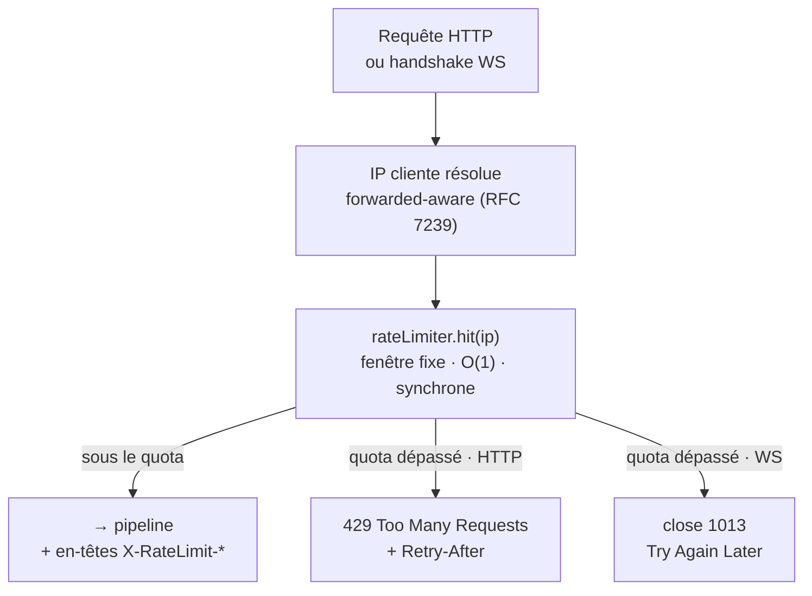
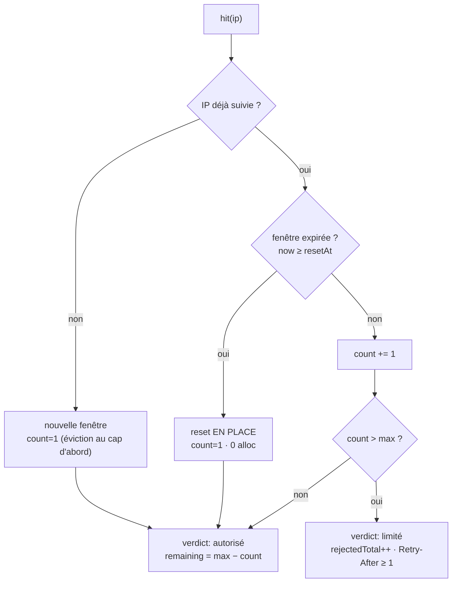

# Rate-limit — plafond de trafic par IP (429, close 1013)

> Un **tourniquet de métro** posé à l'entrée du processus : chaque IP cliente reçoit un quota de
> requêtes par fenêtre de temps ; au-delà, on la refoule — un `429 Too Many Requests` en HTTP, une
> fermeture `1013 Try Again Later` en WebSocket. Le refus se décide **avant** d'allouer le moindre
> contexte, pour qu'un flood coûte une simple recherche dans une table de hachage. C'est une **défense
> de capacité par IP**, à ne pas confondre avec le backoff anti-bruteforce du **login** (page voisine,
> côté sécurité). Chaque fait ci-dessous est ancré sur le code.

📍 [Documentation](../../../../../docs/index.md) › [@nodefony/http](index.md) › **Rate-limit**

## 🧠 Le modèle mental — une clé, une fenêtre, un verdict

Le rate-limit ne connaît qu'**une** question : « cette IP a-t-elle déjà trop parlé dans la fenêtre en
cours ? ». Tout le reste en découle.



Trois idées à retenir :

1. **La clé est l'IP, pas l'utilisateur.** On borne du **trafic**, pas des identités. L'IP est
   résolue exactement comme pour les logs et l'audit (`resolveForwarded()`, `http-kernel.ts:991`) —
   non falsifiable tant que `trustProxy` n'accorde pas sa confiance à un proxy.
2. **Le verdict porte tout.** Un seul appel `hit(key)` (`IRateLimitStore.ts:79`) rend un
   `RateLimitVerdict` (`IRateLimitStore.ts:20`) qui contient déjà limite, restant, reset et
   `Retry-After` — de quoi émettre les en-têtes sans relire l'état.
3. **HTTP et WebSocket partagent le même compteur.** Un upgrade WS **est** une requête HTTP : il passe
   par le même `hit()`, seule la façon de refouler change (429 en HTTP, close 1013 en WS).

## 📖 Lexique

| Terme                   | Sens                                                                                                                     |
| ----------------------- | ------------------------------------------------------------------------------------------------------------------------ |
| Rate-limit / throttling | Limiter le **débit** entrant : X requêtes autorisées par unité de temps, le reste est refusé.                            |
| Fenêtre fixe            | _Fixed window_ : un compteur par IP remis à zéro à chaque intervalle (60 s). Simple, O(1), 0 alloc pour une IP connue.   |
| Fenêtre glissante       | _Sliding window_ : lissage continu, plus juste aux bords de fenêtre. **Non** implémenté ici (compromis assumé).          |
| Token bucket            | Autre algorithme (jetons rechargés à débit constant). **Non** utilisé ici.                                               |
| Quota / `max`           | Nombre de requêtes autorisées par IP et par fenêtre. Au-delà → refus.                                                    |
| `429`                   | _Too Many Requests_ (RFC 6585 §4) : le code HTTP du refoulement.                                                         |
| `Retry-After`           | En-tête indiquant au client **combien de secondes** attendre avant de réessayer.                                         |
| `X-RateLimit-*`         | Famille d'en-têtes de facto (`Limit`, `Remaining`, `Reset`) qui expose l'état du quota au client.                        |
| Close `1013`            | _Try Again Later_ (RFC 6455 §7.4.1) : le refoulement d'un WebSocket, faute de pouvoir renvoyer un `429`.                 |
| IP forwarded-aware      | IP cliente réelle reconstituée derrière un proxy via `X-Forwarded-For` / `Forwarded` (RFC 7239), sous contrôle de trust. |
| `trustProxy`            | Réglage qui décide si l'on croit les en-têtes de proxy pour établir l'IP. `false` par défaut (non falsifiable).          |
| `maxTracked`            | Borne mémoire : nombre max d'IP suivies simultanément. Au cap → purge des expirées puis éviction FIFO.                   |
| GC (garbage collection) | Ici : balayage périodique qui **purge les fenêtres expirées** hors du chemin chaud (`GcScheduler` du core).              |
| Backoff de login (NIST) | Défense **distincte** : ralentir les tentatives d'authentification par identifiant saisi (`security.rateLimit`).         |

## Qu'est-ce qu'un rate-limit, et quelle attaque il bloque ?

Sans plafond, un seul client peut lancer des milliers de requêtes par seconde et **saturer** le
processus : famine de l'event-loop, mémoire qui gonfle, latence p99 qui explose pour tous les autres.
C'est le cœur d'un **déni de service applicatif** (DoS), volontaire ou accidentel (un script en boucle,
un crawler mal réglé).

Le rate-limit **refoule** l'IP fautive avant qu'elle ne coûte cher : elle reçoit un `429` (ou une
fermeture `1013` en WebSocket) tant qu'elle dépasse son quota, pendant que les autres IP passent
intactes. Le quota est **isolé par IP** (`rateLimit.test.ts:77`) : une IP saturée n'affecte jamais ses
voisines.

> [!IMPORTANT]
> Ce rate-limit borne le **trafic par IP sur toutes les routes**. Il ne remplace **pas** le backoff
> anti-bruteforce du **login** (`security.rateLimit`, par identifiant saisi, norme NIST) : ce sont deux
> briques différentes, à deux étages différents. Confondre les deux laisse un trou. Voir
> [@nodefony/security](../../security/docs/index.md).

## La vision Nodefony

Trois choix structurent l'implémentation, et chacun est un compromis assumé.

**Désactivé par défaut — opt-in explicite.** En cloud-native, le plafond par IP est souvent mieux placé
à l'**ingress/gateway** (il voit tout le trafic, tous les pods, et rejette avant le coût TLS). Le module
laisse donc `rateLimit` désarmé par défaut (`config.ts:830`) : `null` tant qu'on ne l'active pas → **0
coût** sur le chemin chaud. On l'active quand on n'a **pas** d'edge devant soi (bare-metal, VPS), ou en
défense en profondeur.

**Fenêtre fixe, en mémoire, O(1).** L'algorithme est le plus frugal possible :
`MemoryRateLimitStore` (`MemoryRateLimitStore.ts:32`) tient une entrée `{ count, resetAt }` par IP,
remise à zéro **en place** à l'expiration (0 allocation pour une IP récurrente). Le prix de cette
simplicité est connu : un pic à cheval sur deux fenêtres peut laisser passer jusqu'à `2 × max` sur un
court intervalle (`MemoryRateLimitStore.ts:29`). Acceptable pour une défense de **capacité** ; un
_sliding window_ viendrait en option si le besoin s'en fait sentir.

**Refoulé avant toute allocation.** Le verdict est rendu **avant** le contexte, la portée DI et l'ALS
(`http-kernel.ts:860`) : un flood coûte un `Map.get` et rien d'autre. Le contrat `hit()` est
**synchrone** à dessein (`IRateLimitStore.ts:8`) — aucune `Promise`, aucune microtask sur le chemin de
chaque requête.

## 🚀 Démarrage rapide

Dans une application générée par `nodefony create app`, le rate-limit est **présent mais désarmé**. On
l'active dans le manifeste, via `use("@nodefony/http", { … })`. L'exemple ci-dessous fixe un quota
volontairement **bas** (5 req/min) pour voir le `429` en quelques secondes.

### 1. Activer et régler

```typescript
// nodefony.config.ts — activer le rate-limit général par IP
export default defineConfig(() => ({
  modules: [
    use("@nodefony/http", {
      rateLimit: {
        enabled: true, // opt-in : désarmé par défaut
        windowS: 60, // fenêtre fixe de 60 secondes
        max: 5, // 5 requêtes / IP / fenêtre (bas exprès, pour la démo)
      },
    }),
    "@nodefony/framework",
  ],
}));
```

Les trois clés `enabled` / `windowS` / `max` sont **éditables à chaud** (`runtimeMutable`) : le kernel
reconstruit le compteur sans redémarrage (`configureRateLimit()`, `http-kernel.ts:322`).

### 2. Observer le 429 et les en-têtes

Chaque réponse porte l'état du quota ; la 6ᵉ requête dépasse `max=5` et se fait refouler. Les en-têtes
sont posés avant le routage, donc visibles même sur un 404.

```bash
# 6 requêtes rapides depuis la même IP → la 6ᵉ prend un 429
for i in $(seq 1 6); do
  curl -s -o /dev/null -D - http://127.0.0.1:5151/ \
    | grep -iE 'HTTP/|X-RateLimit|Retry-After'
done
```

Ce qu'on observe : les cinq premières passent, le compteur `X-RateLimit-Remaining` décroît, puis la
sixième bascule.

```text
HTTP/1.1 200 OK
X-RateLimit-Limit: 5
X-RateLimit-Remaining: 4
X-RateLimit-Reset: 1753082460
...
HTTP/1.1 429 Too Many Requests
X-RateLimit-Limit: 5
X-RateLimit-Remaining: 0
X-RateLimit-Reset: 1753082460
Retry-After: 42
```

- `X-RateLimit-Remaining` : requêtes restantes dans la fenêtre (`http-kernel.ts:1001`).
- `X-RateLimit-Reset` : **epoch en secondes** de la fin de fenêtre (`http-kernel.ts:1003`).
- `Retry-After` (sur le `429` seulement) : secondes à attendre, **jamais 0** — un `Retry-After: 0`
  relancerait un client bien élevé immédiatement (`MemoryRateLimitStore.ts:80`).

## 🏗️ Architecture interne — le parcours d'un `hit`

La logique de fenêtre fixe tient dans `hit()` (`MemoryRateLimitStore.ts:51`). Trois cas, tous O(1) :



Autour de ce cœur, le kernel orchestre le cycle de vie :

- **Construction / reconfiguration** : `configureRateLimit()` (`http-kernel.ts:412`) instancie le store
  depuis la config (`windowMs = windowS × 1000`, `http-kernel.ts:412`) et arme un `GcScheduler`
  (`http-kernel.ts:422`) qui **purge les fenêtres expirées** hors du chemin chaud.
- **Émission HTTP** : sous le quota, les en-têtes `X-RateLimit-*` sont posés (`http-kernel.ts:1000`) et
  la requête continue ; au-delà, `Retry-After` (`http-kernel.ts:1007`) puis `writeHead(429)`
  (`http-kernel.ts:1012`) — corps vide, on ne journalise pas chaque rejet (amplificateur sous flood).
- **Borne mémoire** : au cap `maxTracked`, le store purge les expirées puis évince en **FIFO**
  (`#evict`, `MemoryRateLimitStore.ts:169`) — la mémoire ne dérive jamais.

## ⚙️ Configuration

Table dérivée de `rateLimitSchema` (`config.ts:847`). Tout est optionnel : ce sont les défauts du
schéma, écrits ici pour les montrer.

| Option        | Type         | Défaut    | Effet                                                                            | Chaud |
| ------------- | ------------ | --------- | -------------------------------------------------------------------------------- | ----- |
| `enabled`     | bool         | `false`   | Arme le rate-limit (HTTP **et** handshakes WS, même compteur) (`config.ts:849`). | oui   |
| `windowS`     | int (s)      | `60`      | Largeur de la fenêtre fixe ; le compteur par IP repart à zéro (`config.ts:860`). | oui   |
| `max`         | int          | `300`     | Requêtes/IP/fenêtre ; au-delà `429` + `Retry-After` (`config.ts:871`).           | oui   |
| `maxTracked`  | int (≥ 1000) | `100 000` | Borne mémoire : IP suivies ; au cap, purge puis éviction FIFO (`config.ts:883`). | non   |
| `gcIntervalS` | int (s)      | `300`     | Intervalle du balayage de purge des fenêtres expirées, hors hot-path.            | non   |
| `gcJitter`    | bool         | `true`    | Étale le tick GC d'un jitter aléatoire (anti-thundering-herd multi-pod).         | non   |

Et un réglage **séparé**, propre au WebSocket, à la racine du module :

| Option                  | Type          | Défaut | Effet                                                                                               | Chaud |
| ----------------------- | ------------- | ------ | --------------------------------------------------------------------------------------------------- | ----- |
| `wsMaxConnectionsPerIp` | int \| `null` | `null` | Cap de connexions WS **concurrentes** par IP ; au-delà, upgrade fermé en `1013` (`config.ts:1046`). | oui   |

> [!TIP]
> `max: 300` sur `windowS: 60` = **5 req/s soutenu** par IP, avec des rafales tolérées jusqu'à 300 d'un
> coup. Règle simple : `max` doit couvrir le **pic légitime** d'un vrai utilisateur (rechargement,
> préchargement d'assets), pas la moyenne — sinon on refoule ses propres clients.

## 🔌 Rate-limit côté WebSocket

Un WebSocket ne peut **pas** recevoir un `429` : au moment où le rate-limit décide, le `101 Switching
Protocols` est déjà parti sur le fil (émis par la bibliothèque `ws`). Le refoulement se fait donc par
une **fermeture RFC 6455 `1013 Try Again Later`**, décidée dans `onWebsocketRequest()`
(`http-kernel.ts:1505`) — **avant** `enterScope`, l'ALS et le pipeline, comme le `429` HTTP.

Deux plafonds distincts, tous deux par IP forwarded-aware :

| Plafond                | Ce qu'il borne                                 | Source de config        | Refus                                                      |
| ---------------------- | ---------------------------------------------- | ----------------------- | ---------------------------------------------------------- |
| Débit de handshakes    | Ouvertures/seconde (le **même** compteur HTTP) | `rateLimit`             | close `1013` (`http-kernel.ts:1521`)                       |
| Connexions simultanées | Sockets **ouvertes** en même temps par IP      | `wsMaxConnectionsPerIp` | close `1013` — `tryAcquire` refuse (`http-kernel.ts:1531`) |

Le cap concurrent est porté par un compteur dédié, `WsConnectionCounter` (`WsConnectionCounter.ts:18`) :
`tryAcquire(ip)` (`WsConnectionCounter.ts:33`) réserve un créneau à l'upgrade, `release(ip)`
(`WsConnectionCounter.ts:45`) le rend à la fermeture — branché sur `ws.once("close", …)`
(`http-kernel.ts:1536`), donc jamais de fuite de compteur, même sur un `terminate` de heartbeat.

> [!WARNING]
> `wsMaxConnectionsPerIp` a une **portée par process** (1 pod) : il ne voit que le trafic de son propre
> worker. Un vrai plafond **global par IP** se fait à l'ingress (`nginx limit_conn`, HAProxy
> `sc_conn_cur`, annotation k8s). En cloud-native, laisser `null` et déléguer à l'edge ; ne l'activer
> (ex. `20`) qu'en défense en profondeur sur une machine **sans** ingress.

Ces limites-là bornent le **rythme d'ouverture** et le **nombre de sockets**. Elles sont distinctes des
bornes **par message** (taille `maxPayload` → close `1009`, backpressure), décrites dans
[Serveurs](servers.md).

## 🧩 Étendre — un store distribué

Tout passe par le contrat `IRateLimitStore` (`IRateLimitStore.ts:74`). L'implémentation par défaut est
en mémoire (par process), mais le contrat est pensé pour un futur backend **distribué** (Redis,
multi-pod) : `hit()` reste synchrone (le hot-path ne tolère pas de `Promise`), tandis que l'introspection
`listPage()` (`IRateLimitStore.ts:99`) est asynchrone — un store distribué la servira par `SCAN`.

Un adapter doit fournir : `hit(key)` (verdict de fenêtre), `gc()` (purge), `listPage(query)`
(introspection admin), plus les métriques `trackedCount` et `rejectedTotal` (`IRateLimitStore.ts:101`).

## 📜 Normes appliquées

| Domaine                            | Norme            | Ancrage                                           |
| ---------------------------------- | ---------------- | ------------------------------------------------- |
| `429 Too Many Requests`            | RFC 6585 §4      | `writeHead(429)` (`http-kernel.ts:1012`)          |
| `Retry-After` (delta-seconds)      | RFC 9110 §10.2.3 | en-tête posé sur le `429` (`http-kernel.ts:1007`) |
| IP cliente derrière proxy          | RFC 7239         | `resolveForwarded()` (`http-kernel.ts:991`)       |
| WebSocket — close `1013` Try Again | RFC 6455 §7.4.1  | refus d'upgrade (`http-kernel.ts:1378`)           |

> [!NOTE]
> Les en-têtes émis sont la famille **de facto** `X-RateLimit-Limit/Remaining/Reset`
> (`http-kernel.ts:1000`), largement déployée et lue par les clients. Le brouillon IETF
> `draft-ietf-httpapi-ratelimit-headers` (en-têtes `RateLimit` / `RateLimit-Policy`) n'est **pas** encore
> émis — une évolution possible, pas une régression : rien ne le promet aujourd'hui.

## ⚡ Performance & mémoire

Le rate-limit vit sur le **chemin chaud absolu** — il s'exécute avant tout le reste, sur chaque requête.
Les choix visibles dans le code :

- **Synchrone, O(1)** : `hit()` = 1 `Map.get` + arithmétique, zéro `Promise`, zéro microtask
  (`IRateLimitStore.ts:8`).
- **Lazy** : la `Map` interne n'est allouée qu'au **premier** hit (`MemoryRateLimitStore.ts:33`) →
  quand le rate-limit est désarmé (défaut), le coût mémoire est **nul**.
- **0 alloc pour une IP connue** : la fenêtre expirée se réinitialise **en place**, pas de nouvel objet.
- **Rejet avant allocation** : un flood est refoulé avant le contexte / la portée DI / l'ALS
  (`http-kernel.ts:860`) → un attaquant paie une recherche de hachage, pas un pipeline complet.
- **Résolution d'IP seulement si un limiteur est armé** côté WS (`http-kernel.ts:1368`).
- **Mémoire bornée** : `maxTracked` + éviction FIFO ; purge périodique `unref` hors hot-path.

Rejouer la pression sous charge : skill `nodefony-load-test`. Gate mémoire avant tout commit touchant le
pipeline : `npm run test:memory` (skill `nodefony-check-memory-health`).

## 📡 Observabilité — Studio

Le data plane admin expose **qui martèle** via `createHttpAdminApi()` (`HttpAdminApi.ts:141`) :

- **`GET /nodefony/http/api/rate-limit/list`** (`HttpAdminApi.ts:218`) — les IP suivies, **les plus
  bruyantes d'abord** (tri `count` décroissant), paginé **côté serveur** (`?limited&q&limit&offset`).
  `q` filtre par **préfixe** d'IP (un sous-réseau `10.0.`), pas par sous-chaîne.
- **Réservé `ROLE_NODEFONY_ADMIN`** (`HttpAdminApi.ts:220`) : une IP est une **donnée personnelle** →
  seul l'état du compteur sort d'ici, jamais l'URL, l'en-tête ou le corps des requêtes.
- **État honnête quand désarmé** : rate-limit désactivé (le défaut) → `enabled: false` + liste vide, pas
  un `503` (`HttpAdminApi.ts:241`). La console affiche « désarmé » plutôt qu'une erreur.
- Métriques exposées : `trackedCount` (IP suivies) et `rejectedTotal` (429 cumulés depuis le boot).

## ⚠️ Pièges (symptôme → cause → correction)

| Symptôme                                               | Cause                                                                     | Correction                                                                             |
| ------------------------------------------------------ | ------------------------------------------------------------------------- | -------------------------------------------------------------------------------------- |
| Le rate-limit « ne fait rien »                         | Désactivé par défaut (opt-in)                                             | `rateLimit.enabled: true` dans `use("@nodefony/http", …)`                              |
| Toutes les IP derrière le proxy comptent comme **une** | `trustProxy: false` → l'IP vue est celle du proxy, pas du client          | Régler `trustProxy` sur l'IP/CIDR du proxy — voir [Serveurs](servers.md)               |
| Un burst laisse passer près de `2 × max`               | Limite **assumée** de la fenêtre fixe (pic à cheval sur deux fenêtres)    | Réduire `windowS`, ou attendre l'option _sliding window_                               |
| Un WebSocket ne reçoit jamais de `429`                 | Le `101` est déjà émis — impossible de renvoyer un code HTTP              | Attendu : le refus WS est une fermeture `1013` (`http-kernel.ts:1378`)                 |
| `wsMaxConnectionsPerIp` semble inefficace en cluster   | Portée **par process** — chaque pod compte pour lui                       | Déléguer le cap global/IP à l'ingress (nginx `limit_conn`, HAProxy)                    |
| Confusion avec le lockout de login                     | `security.rateLimit` = backoff NIST **par identifiant**, brique distincte | Ce sont deux étages différents — cf [@nodefony/security](../../security/docs/index.md) |
| Une IP « fantôme » n'est jamais comptée                | `resolveForwarded()` renvoie `null` (aucun socket fiable)                 | Attendu : on ne compte jamais sous une clé `null` (qui deviendrait un DoS)             |

## 🧪 Tests & couverture

Les chiffres exacts vivent dans la carte de tests de cette page (régénérée depuis vitest, jamais figés
dans le Markdown).

| Type               | Où                                                                                                                                             |
| ------------------ | ---------------------------------------------------------------------------------------------------------------------------------------------- |
| Unitaires — store  | `unit/rateLimit.test.ts` — fenêtre fixe, isolation par IP, borne mémoire + éviction FIFO, `listPage` (tri, filtres, préfixe)                   |
| Unitaires — cap WS | `unit/wsConnectionCounter.test.ts` — acquire/refus au plafond, `release`, auto-borne (pas de GC), IP indépendantes                             |
| Unitaires — admin  | `unit/rateLimitAdminApi.test.ts` — `rate-limit/list` : état désarmé honnête, tri décroissant, `?limited`/`?q`/`?offset`, `ROLE_NODEFONY_ADMIN` |
| Intégration — WS   | `websockets/websocket-limits.test.ts` — bornes de message (taille `maxPayload` → `1009`, séquence, protocole)                                  |

Ce qui **manque** aujourd'hui :

- Aucun test d'**intégration** ne prouve, sur un serveur vivant, le `429` HTTP **et** les en-têtes
  `X-RateLimit-*` de bout en bout (le comportement du store est prouvé unitairement, son câblage kernel
  ne l'est pas).
- Aucun test d'intégration ne couvre la **fermeture `1013`** (débit de handshakes et cap concurrent) :
  le compteur est prouvé unitairement, le refus WS de bout en bout est exercé par les bancs E2E
  (`nodefony-load-test` → `run.sh ws-handshake-rl` / `ws-conn-cap`), pas par une suite du module.
- Pas de banc de **charge dédié** au coût du rate-limit sur le hot-path.

Suites : `npm test` (unitaires, serveur non requis), `npm run test:integration` (serveur requis).
Couverture : `npm run coverage` dans `@nodefony/http` — le pourcentage vit dans le rapport vitest,
jamais figé ici. Skills associés : `nodefony-load-test`, `nodefony-check-memory-health`,
`nodefony-security-review`.

## 🔗 Pour aller plus loin

- ⬆️ **Retour au hub** : [@nodefony/http — vue du module](index.md) · [Toute la documentation](../../../../../docs/index.md)
- 🧭 **Pages sœurs** : [Serveurs](servers.md) — bornes par message (`maxPayload` → `1009`, backpressure), TLS, arrêt gracieux.
- L'IP cliente derrière un proxy (`trustProxy`, `X-Forwarded-*`) → [Serveurs](servers.md).
- Le backoff anti-bruteforce du **login** (brique distincte) → [@nodefony/security](../../security/docs/index.md).
- Où le rate-limit se branche dans le trajet d'une requête → [pipeline-requete](../../../../../docs/architecture/pipeline-requete.md).
- Déployer derrière un ingress qui porte le cap global (probes, TLS, edge) → [docker-cloud-native](../../../../../docs/guides/docker-cloud-native.md).
- Configuration d'application (`defineConfig`, `use`, env) → [configuration](../../../../../docs/guides/configuration.md).
