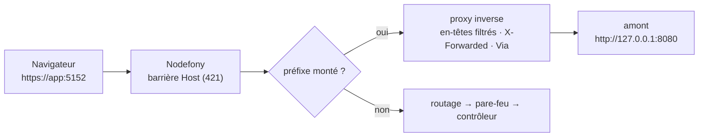
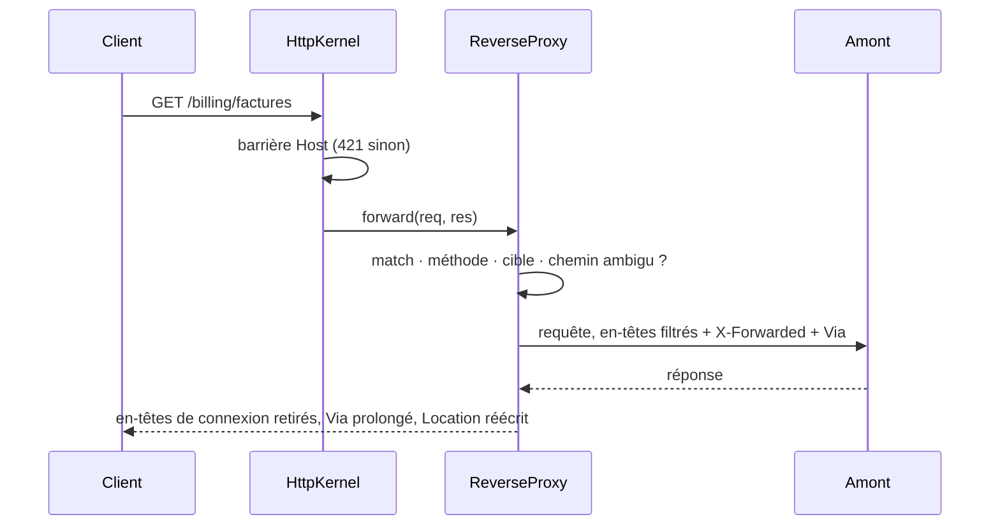

# Proxy inverse — relayer un préfixe d'URL vers un autre serveur, sur la même origine

> Un **standard téléphonique** : l'appelant compose un seul numéro, et le standard transfère vers le
> bon poste selon ce qu'il demande. Nodefony fait de même avec un **préfixe d'URL** : tout ce qui
> commence par `/billing/` part vers le service de facturation, le reste suit le routage de
> l'application. Le navigateur ne voit qu'un serveur, une origine, un certificat ; l'autre serveur
> peut rester sur la boucle locale. Requêtes HTTP et, sur demande, connexions WebSocket. Chaque fait
> ci-dessous est ancré sur le code.

📍 [Documentation](../../../../../docs/index.md) › [@nodefony/http](index.md) › **Proxy inverse**

## 🧠 Le modèle mental — un aiguillage AVANT le routage



Trois idées suffisent pour raisonner :

1. **Un montage = un préfixe → une origine.** `"/billing/"` → `http://127.0.0.1:8080`. Le préfixe le
   plus long gagne (`ReverseProxy.match()`, `reverse-proxy.ts:229`).
2. **L'aiguillage passe AVANT le routage.** Une route attrape-tout de l'application ne peut pas
   avaler un préfixe monté (`HttpKernel.routeHttpRequest()`, `http-kernel.ts:1668`).
3. **Sans montage, il ne coûte rien.** Le pipeline lit un champ (`mounts === null`) et passe son
   chemin (`ReverseProxy.mounts`, `reverse-proxy.ts:174`).

## 📖 Lexique

| Terme                     | Sens                                                                                                                                 |
| ------------------------- | ------------------------------------------------------------------------------------------------------------------------------------ |
| **Proxy inverse**         | Serveur placé DEVANT d'autres serveurs, qui reçoit les requêtes à leur place et les leur transmet (_reverse proxy_).                 |
| **Amont**                 | Le serveur qui reçoit la requête relayée (_upstream_) — ici une origine `http(s)://hôte:port`.                                       |
| **Montage**               | Association d'un préfixe d'URL à un amont, avec ses réglages.                                                                        |
| **Origine**               | Triplet schéma + hôte + port (`https://app:5152`). Le navigateur cloisonne cookies, CSP et contextes sécurisés par origine.          |
| **En-têtes de connexion** | En-têtes qui ne valent que pour UN saut (`Connection`, `Keep-Alive`, `Upgrade`…) — _hop-by-hop_, RFC 9110 §7.6.1. Jamais transmis.   |
| **`Via`**                 | En-tête qui liste les relais traversés (RFC 9110 §7.6.3). Sert aussi à détecter une boucle.                                          |
| **`X-Forwarded-*`**       | En-têtes qui disent à l'amont qui est le vrai client : son IP (`-For`), son schéma (`-Proto`), l'hôte demandé (`-Host`).             |
| **`trustProxy`**          | Liste des pairs dont Nodefony croit les en-têtes `X-Forwarded-*` — voir [Serveurs](servers.md).                                      |
| **`trustedHosts`**        | Liste des noms d'hôte que l'application accepte ; un autre `Host` reçoit 421.                                                        |
| **Upgrade**               | Bascule d'une connexion HTTP/1.1 vers un autre protocole — ici WebSocket (RFC 6455 §4).                                              |
| **CSWSH**                 | _Cross-Site WebSocket Hijacking_ : une page tierce ouvre un WebSocket avec les cookies de la victime. Paré par le contrôle d'Origin. |
| **HMR**                   | _Hot Module Replacement_ : rechargement à chaud de Vite, qui passe par un WebSocket.                                                 |
| **Pool keep-alive**       | Connexions vers l'amont gardées ouvertes et réutilisées, pour ne pas payer une poignée de main TCP par requête.                      |
| **400 / 421 / 403**       | Requête ambiguë ou malformée · hôte non servi ici (_Misdirected Request_) · Origin refusée.                                          |
| **502 / 504 / 508**       | Amont injoignable (_Bad Gateway_) · amont muet (_Gateway Timeout_) · boucle de relais détectée (_Loop Detected_, RFC 5842 §7.2).     |

## Qu'est-ce qu'un proxy inverse, et quel problème résout-il ?

Une application réelle a rarement un seul serveur. Un service de facturation existant, un serveur de
sources (Vite en développement), un outil interne : chacun écoute sur son port. Les exposer tels
quels coûte cher :

- **Plusieurs origines** : le navigateur les cloisonne. Il faut du CORS, les cookies ne suivent pas,
  et chaque port réclame son propre certificat.
- **Plusieurs ports ouverts** : autant de surfaces à durcir, et un serveur de développement n'est
  jamais fait pour être exposé.
- **Le contexte sécurisé se perd** : caméra, WebAuthn, presse-papiers exigent HTTPS. Un serveur
  secondaire en HTTP sur une IP de réseau local casse ces API.

Le proxy inverse ramène tout sur **une** origine : le client parle à Nodefony, Nodefony parle aux
autres. Mal écrit, un proxy ouvre ses propres failles, et c'est contre elles que Nodefony est durci :

- **Contournement de préfixe** — `/billing/..%2fadmin` : le proxy voit `/billing/`, l'amont décode
  `/admin`. Un chemin ambigu est refusé en 400, jamais normalisé en silence (`isAmbiguousPath()`,
  `rules.ts:229`).
- **Désynchronisation de requête** (_request smuggling_) — proxy et amont ne s'accordent pas sur la
  fin du corps. Le cadrage est recalculé à chaque relais (`bodyFramingOf()`, `forward.ts:166`).
- **Usurpation d'origine** — un client pose lui-même `X-Forwarded-For: 10.0.0.1`. Ces en-têtes ne
  sont crus que d'un pair `trustProxy` (`requestHeadersFor()`, `forward.ts:201`).

## La vision Nodefony

Le proxy est un **service générique** de `@nodefony/http`, `reverse-proxy` (`ReverseProxy`,
`reverse-proxy.ts:82`). Il accepte deux sources de montages, soumises aux **mêmes règles**
(`proxyMountProblems()`, `rules.ts:98`) :

- **la configuration** de l'application — `proxy.mounts`, validée au démarrage ;
- **un module**, par `mount()` — c'est ainsi que `@nodefony/frontend` sert Vite sous `/_vite/`.

Ce qu'il fait différemment d'un nginx placé devant :

- **Même processus, même pipeline** : la barrière d'hôte (`trustedHosts`, 421) et la confiance de
  proxy (`trustProxy`) sont celles de l'application, pas une seconde configuration qui dérive.
- **HTTP/1.1, HTTP/2 et WebSocket** sur le même montage : le client peut arriver en h2, l'amont est
  joint en HTTP/1.1.
- **Refus nommés au démarrage** : un préfixe `/`, réservé, ou une cible qui n'est pas une origine nue
  interrompt le boot avec le motif.

Le compromis assumé :

> [!WARNING]
> **Un préfixe monté est servi AVANT le pare-feu, la protection CSRF et les en-têtes de sécurité
> APPLICATIFS de l'application (CSP, `Referrer-Policy`, COOP).** C'est une surface publique pour qui
> atteint Nodefony : l'amont porte sa propre politique d'accès (`ReverseProxy.forward()`,
> `reverse-proxy.ts:319`). Ne montez jamais un service qui suppose être protégé par le pare-feu
> Nodefony.

Ce qui s'applique malgré tout, parce que posé à l'entrée, avant l'aiguillage :

- les **en-têtes de transport** — `X-Content-Type-Options`, `X-Frame-Options`, HSTS — sur toute
  réponse relayée, sauf si l'amont fixe lui-même le même en-tête ;
- les **quotas** : le rate-limit par IP compte les requêtes relayées, et un upgrade WebSocket relayé
  obéit aux mêmes bornes qu'un upgrade servi (voir [WebSocket relayé](#-websocket-relayé)).

La CSP à nonce de l'application, elle, n'est jamais imposée : elle casserait les pages d'un autre
serveur, dont les scripts ne portent pas ce nonce.

## 🚀 Démarrage rapide

Dans une application générée par `nodefony create app`, un service existant écoute sur
`127.0.0.1:8080`. On le publie sous `/billing/`, sur l'origine de l'application.

### 1. Un amont de démonstration

Pour voir ce que reçoit l'amont, un serveur minimal qui renvoie les en-têtes reçus suffit :

```ts
// billing.ts — amont de démonstration : renvoie ce qu'il reçoit
import http from "node:http";

http
  .createServer((req, res) => {
    res.setHeader("content-type", "application/json");
    res.end(JSON.stringify({ path: req.url, headers: req.headers }, null, 2));
  })
  .listen(8080, "127.0.0.1");
```

### 2. Déclarer le montage

```ts
// nodefony.config.ts — /billing/ relayé vers le service de facturation
export default defineConfig(() => ({
  modules: [
    use("@nodefony/http", {
      proxy: {
        mounts: {
          "/billing/": {
            target: "http://127.0.0.1:8080", // origine nue, sans chemin
            stripPrefix: true, // l'amont reçoit /factures, pas /billing/factures
          },
        },
      },
    }),
    "@nodefony/framework",
  ],
}));
```

### 3. Observer

```bash
curl -sk -D - https://127.0.0.1:5152/billing/factures?mois=09
```

```text
HTTP/1.1 200 OK
content-type: application/json
via: 1.1 nodefony-3f9a1c2e

{
  "path": "/factures?mois=09",
  "headers": {
    "host": "127.0.0.1:8080",
    "x-forwarded-for": "127.0.0.1",
    "x-forwarded-proto": "https",
    "x-forwarded-host": "127.0.0.1:5152",
    "x-forwarded-prefix": "/billing",
    "via": "1.1 nodefony-3f9a1c2e"
  }
}
```

- Le préfixe a été retiré du chemin, et l'amont l'apprend par `X-Forwarded-Prefix`.
- `Host` est celui de l'amont ; le nom demandé par le client part dans `X-Forwarded-Host`.
- `Via` porte le pseudonyme de CE processus, tiré au hasard au démarrage — il ne dit rien de la
  machine (`ReverseProxy.pseudonym`, `reverse-proxy.ts:290`).

## ⚙️ Configuration

Section `proxy` de `use("@nodefony/http", { … })`, schéma Zod strict : une clé inconnue interrompt le
démarrage en la nommant (`proxySchema`, `config.ts:1068`).

| Option             | Type     | Défaut  | Effet                                                                                                                                                         |
| ------------------ | -------- | ------- | ------------------------------------------------------------------------------------------------------------------------------------------------------------- |
| `timeoutMs`        | entier   | `30000` | Délai d'inactivité par défaut avec l'amont ; dépassé avant la réponse → 504.                                                                                  |
| `connectTimeoutMs` | entier   | `5000`  | Délai d'**établissement** de la connexion ; un amont qui n'accepte pas → 504 sans attendre 30 s.                                                              |
| `maxSockets`       | entier   | `256`   | Connexions simultanées vers UN amont (pool dédié par montage) ; au-delà, les requêtes attendent. Borne aussi les tunnels WebSocket, hors pool : au-delà, 503. |
| `mounts`           | `record` | `{}`    | Préfixe → montage. Préfixe le plus long d'abord.                                                                                                              |

Chaque montage (`proxyMountSchema`, `config.ts:998`) :

| Option         | Type       | Défaut            | Effet                                                                                                                        |
| -------------- | ---------- | ----------------- | ---------------------------------------------------------------------------------------------------------------------------- |
| `target`       | `string`   | — (requis)        | Origine de l'amont, `http(s)://hôte[:port]`, **sans chemin**.                                                                |
| `methods`      | `string[]` | toutes            | Méthodes relayées ; une autre méthode suit le routage de l'application.                                                      |
| `websocket`    | `boolean`  | `false`           | Relaie aussi l'upgrade WebSocket du préfixe.                                                                                 |
| `stripPrefix`  | `boolean`  | `false`           | Retire le préfixe du chemin transmis ; `Location` est alors ramené sous le préfixe.                                          |
| `preserveHost` | `boolean`  | `false`           | Transmet le `Host` du client au lieu de celui de la cible.                                                                   |
| `stripHeaders` | `string[]` | `[]`              | En-têtes de requête à ne pas transmettre (`cookie`, `authorization`…).                                                       |
| `timeoutMs`    | entier     | `proxy.timeoutMs` | Délai d'inactivité propre au montage, handshake WebSocket compris (jusqu'au `101`). Ne s'applique pas à un WebSocket établi. |
| `secure`       | `boolean`  | `true`            | Vérifie le certificat d'une cible `https`. `false` n'est accepté que vers la boucle locale.                                  |

**Refusés au démarrage**, avec le motif (`proxyMountProblems()`, `rules.ts:98`) :

- le préfixe `/` — il relaierait toute l'application, routes et pare-feu compris ;
- un préfixe sous `/nodefony/` (console d'administration) ou, depuis la configuration, sous
  `/_vite/` (monté par `@nodefony/frontend`) — `RESERVED_PROXY_PREFIXES` (`rules.ts:18`) ;
- un préfixe qui contient `?`, `#`, `%`, `\`, un espace ou un segment `.`/`..` ;
- une cible qui n'est pas une origine `http(s)` nue (`parseProxyOrigin()`, `rules.ts:56`) ;
- deux clés qui désignent le même préfixe (`/svc` et `/svc/`).

### Choisir les réglages — en situation

**L'amont connaît son préfixe** (Vite et son `base`, une appli servie sous `/docs/`) : ne rien
retirer.

```ts ignore
"/docs/": { target: "http://127.0.0.1:4000" } // l'amont reçoit /docs/guide
```

**L'amont croit être à la racine** (un service existant qu'on ne modifie pas) : retirer le préfixe.
Ses redirections `Location: /login` sont ramenées en `/billing/login`
(`rewriteLocation()`, `forward.ts:288`).

```ts ignore
"/billing/": { target: "http://127.0.0.1:8080", stripPrefix: true }
```

> [!IMPORTANT]
> `stripPrefix` ne réécrit ni le HTML ni le `Path` des cookies. Un amont qui écrit des liens absolus
> (`href="/factures"`) les fera sortir du montage : servez-le sous son préfixe, ou faites-lui lire
> `X-Forwarded-Prefix`.

**L'amont n'a pas à voir la session de l'application** : retirer les authentifiants.

```ts ignore
"/sources/": {
  target: "http://127.0.0.1:5173",
  methods: ["GET", "HEAD"], // un serveur de sources ne sert que des lectures
  stripHeaders: ["cookie", "authorization"],
}
```

| Le client envoie…                          | Résultat                                                   |
| ------------------------------------------ | ---------------------------------------------------------- |
| `GET /sources/app.js` avec son cookie      | relayé, **sans** `Cookie` ni `Authorization`               |
| `POST /sources/app.js`                     | **non relayé** : suit le routage (404 si rien ne le prend) |
| `GET /sources/..%2fsecret`                 | **400**, l'amont n'est pas contacté                        |
| `GET /sources/x` avec `Host: evil.example` | **421** (barrière d'hôte, si `domainCheck`)                |

### Le cas Vite — rien à déclarer

En développement, le front servi par Vite passe par ce proxy **sans une ligne de configuration** :
`@nodefony/frontend` monte lui-même `/_vite/<famille>/` vers le Vite de chaque famille. La page, ses
modules, ses images et le WebSocket du rechargement à chaud partagent alors l'origine de
l'application — une IP de réseau local, un téléphone ou un conteneur fonctionnent en HTTPS sans
réglage.

| Ce qui est fixé par `@nodefony/frontend`        | Pourquoi                                                   |
| ----------------------------------------------- | ---------------------------------------------------------- |
| `methods: ["GET", "HEAD"]`                      | un serveur de sources ne sert que des lectures             |
| `websocket: true`                               | le rechargement à chaud passe par un WebSocket             |
| `stripHeaders: ["cookie", "authorization"]`     | Vite n'a pas à voir la session de l'application            |
| cible = le Vite de CETTE application, s'il sert | un port repris par une autre application n'est jamais visé |

Ce qui se règle reste côté frontend, dans `use("@nodefony/frontend", { … })` : `devHost` (défaut
`127.0.0.1`, à garder — le navigateur ne joint jamais Vite directement) et `devPort` (défaut `5173`,
chaque famille prend le port suivant). Le préfixe `/_vite/` est refusé dans `proxy.mounts` : il
appartient au module (`MODULE_PROXY_PREFIXES`, `rules.ts:25`). En production, Vite ne tourne pas et
aucun montage n'est posé.

## 🔌 WebSocket relayé

Avec `websocket: true`, l'upgrade du préfixe est relayé au lieu d'aller au serveur WebSocket de
Nodefony. Un seul écouteur `upgrade` par serveur fait l'aiguillage : le proxy d'abord, puis `ws`,
créé en `noServer` pour garder ses propres contrôles (`path`, `verifyClient`, `maxPayload`)
(`attachUpgradeDispatch()`, `upgradeDispatch.ts:41`).

Avant de relayer, chaque contrôle rend la réponse qu'aurait rendue le serveur WebSocket de Nodefony
(`ReverseProxy.handleUpgrade()`, `reverse-proxy.ts:384`) :

| Le handshake…                                                             | Réponse |
| ------------------------------------------------------------------------- | ------- |
| porte un `Host` hors `trustedHosts` (si `domainCheck`)                    | **421** |
| a un chemin ambigu, ou n'est pas un handshake RFC 6455 conforme           | **400** |
| porte une `Origin` refusée par la règle du serveur WebSocket              | **403** |
| trouve déjà `maxSockets` tunnels ouverts vers cet amont                   | **503** |
| dépasse un quota par IP : débit de handshakes, ou `wsMaxConnectionsPerIp` | **429** |
| passe tous les contrôles                                                  | relayé  |

Les quotas sont ceux d'un upgrade servi par Nodefony, appliqués par la **même** règle du noyau
(`HttpKernel.websocketQuotaRefusal()`, `http-kernel.ts:2199`) ; un tunnel ouvert garde sa place
jusqu'à sa fermeture. Seule la forme du refus diffère : le proxy répond avant le `101`, il peut donc
rendre un statut HTTP, là où le serveur WebSocket ne peut plus que fermer avec le code 1013.

Une fois l'upgrade transmis, un amont qui accepte la connexion puis se tait est coupé au bout de
`timeoutMs` (**504**) ; ce délai cesse au `101`, et un tunnel établi peut rester muet aussi longtemps
qu'il veut.

Seul `Upgrade: websocket` est relayé : un tunnel `h2c` ou tout autre protocole raccordé octet pour
octet échapperait à toute inspection (`websocketHandshakeProblem()`, `rules.ts:252`). Une fois la
connexion établie, les deux sockets sont raccordées et détruites ensemble ; le TCP keep-alive détecte
un pair mort (`forwardUpgrade()`, `forward.ts:590`).

## 🧩 Étendre — monter depuis un module

Un module se résout le service par **nom**, sans importer `@nodefony/http`. La cible peut être une
**fonction**, rappelée à chaque requête : utile quand le port de l'amont n'est connu qu'à
l'exécution. Elle rend `undefined` quand rien n'est relayable, et la requête suit alors le routage.

```ts ignore
// Dans un service de module — un serveur enfant qui choisit son port au démarrage
const proxy = this.container?.get("reverse-proxy") as ReverseProxy | undefined;
proxy?.mount("/outil/", {
  target: () => (child.ready ? `http://127.0.0.1:${child.port}` : undefined),
  websocket: true,
});
// À l'arrêt de l'enfant :
proxy?.unmount("/outil/");
```

- `mount()` est **idempotent** pour un préfixe : il remplace le montage précédent. S'il remplace un
  montage de la configuration, il le dit en `WARNING` (`ReverseProxy.mount()`, `reverse-proxy.ts:129`).
- `unmount()` ferme le pool de l'amont ; le dernier retiré remet `mounts` à `null`, et le pipeline
  cesse de le consulter (`ReverseProxy.unmount()`, `reverse-proxy.ts:199`).

**Exemple réel** : `@nodefony/frontend` monte ainsi chaque famille Vite (voir « Le cas Vite »), avec
une cible fonction qui ne vise un port que si le Vite de CETTE application y répond
(`FrontendService.mountDevProxy()`, `FrontendService.ts:486`).

## 🏗️ Architecture interne — le parcours d'une requête relayée



Ce que le relais fait aux en-têtes, dans les deux sens :

| Vers l'amont (`requestHeadersFor()`, `forward.ts:201`)                | Vers le client (`responseHeadersFor()`, `forward.ts:311`)        |
| --------------------------------------------------------------------- | ---------------------------------------------------------------- |
| retire les en-têtes de connexion, et ceux que nomme `Connection`      | retire les en-têtes de connexion, et ceux que nomme `Connection` |
| retire `Expect` (Nodefony a déjà répondu `100`) et les `stripHeaders` | garde les `Set-Cookie` multiples                                 |
| réécrit `Host` sur la cible (sauf `preserveHost`)                     | ramène `Location` sous le préfixe (`stripPrefix`)                |
| `X-Forwarded-*` : prolongés d'un pair `trustProxy`, recommencés sinon | prolonge `Via`                                                   |
| `X-Forwarded-Prefix` : à la suite de celui d'un pair `trustProxy`     |                                                                  |
| `Forwarded` d'un pair `trustProxy` : prolongé de ce saut, jamais créé |                                                                  |
| prolonge `Via` ; recalcule le cadrage du corps                        |                                                                  |

Les échecs, dans l'ordre où ils peuvent survenir (`forwardRequest()`, `forward.ts:408`) :

- **508** — la requête porte déjà le pseudonyme de ce processus dans `Via`, ou au moins
  `MAX_VIA_HOPS` (10) sauts : une boucle, l'amont n'est pas contacté (`viaLoops()`,
  `forward.ts:129`). Le plafond compte parce que le pseudonyme ne repère une boucle qu'au retour
  dans ce processus — derrière un répartiteur qui tourne sur N instances, après N+1 sauts ;
- **501** — un `Transfer-Encoding` autre que `chunked` seul (`gzip, chunked`) : le transmettre
  réétiqueté livrerait à l'amont un corps compressé qu'il croirait en clair (`bodyFramingOf()`,
  `forward.ts:166`) ;
- **504** — connexion non établie sous `connectTimeoutMs`, ou amont muet au-delà de `timeoutMs` ;
- **502** — amont injoignable, ou réponse que la sortie refuse (en-tête interdit en HTTP/2) ;
- **coupure** — si l'amont tombe APRÈS avoir commencé à répondre, la réponse au client est
  interrompue : un statut ne se rattrape pas une fois envoyé.

Chaque montage a son **pool keep-alive dédié**, jamais l'agent global de Node : sous
`NODE_USE_ENV_PROXY` (poste d'entreprise), l'agent global enverrait un amont local au proxy de
l'entreprise (`ReverseProxy.agentFor()`, `reverse-proxy.ts:270`). Les pools sont fermés à l'arrêt du
noyau (`ReverseProxy.closeAll()`, `reverse-proxy.ts:215`) ; un relais encore en vol part ensuite sur
une connexion à usage unique, sans recréer de pool que personne ne fermerait.

## 🔐 Sécurité

- **Surface publique** : le montage passe avant le pare-feu (voir l'avertissement plus haut). Le
  préfixe `/nodefony/` est refusé pour que la console d'administration ne puisse jamais être
  court-circuitée.
- **Quotas maintenus** : rate-limit par IP sur les requêtes relayées ; mêmes bornes par IP pour un
  upgrade relayé que pour un upgrade servi, plus `maxSockets` tunnels par amont.
- **Barrière d'hôte maintenue** : un `Host` hors `trustedHosts` n'est jamais relayé ; il suit le
  pipeline jusqu'au 421, comme toute requête (`HttpKernel.routeHttpRequest()`, `http-kernel.ts:1668`).
- **Chemins ambigus refusés**, pas normalisés : `.`, `..`, `\`, octet nul et leurs formes encodées
  `%2e`, `%2f`, `%5c`, `%00`, `%25` (`isAmbiguousPath()`, `rules.ts:229`).
- **Chaîne de confiance** : `Forwarded`, `X-Forwarded-*` et `X-Real-IP` d'un client direct sont
  écartés ; seul un pair `trustProxy` les prolonge.
- **Certificat vérifié** vers une cible `https` ; `secure: false` n'est accepté que vers
  `127.0.0.0/8`, `localhost` ou `::1`. Ailleurs, fournir l'autorité de l'amont
  (`NODE_EXTRA_CA_CERTS`).
- **Corps d'erreur muets** : `Bad Gateway`, `Gateway Timeout`, `Loop Detected` — aucun détail
  interne (adresse, pile) ne part vers le client.

## 📜 Normes appliquées

| Norme                   | Exigence                                                 | Comment le code s'y conforme                                                                      |
| ----------------------- | -------------------------------------------------------- | ------------------------------------------------------------------------------------------------- |
| RFC 9110 §7.6.1         | Un intermédiaire retire les en-têtes de connexion        | Liste fixe + jetons de `Connection`, dans les deux sens (`requestHeadersFor()`, `forward.ts:201`) |
| RFC 9110 §7.6.3         | Un intermédiaire ajoute son entrée à `Via`               | Pseudonyme par processus, prolongé à l'aller et au retour (`forward.ts:244`)                      |
| RFC 9112 §6.3           | Un seul cadrage de corps ; `Transfer-Encoding` l'emporte | `Content-Length` retiré quand le corps est découpé (`bodyFramingOf()`, `forward.ts:166`)          |
| RFC 9112 §6.1           | Codage de transfert non compris → 501                    | Tout autre que `chunked` seul est refusé, jamais réétiqueté (`forward.ts:147`)                    |
| RFC 9113 §8.2.2         | Pas d'en-tête de connexion en HTTP/2                     | Réponse refusée par la sortie h2 → 502, jamais une exception non rattrapée                        |
| RFC 7239 §8.1           | Ne croire `Forwarded` que d'un relais de confiance       | `trustProxy` décide (`ReverseProxy.forward()`, `reverse-proxy.ts:319`)                            |
| RFC 7239 §4 · §6        | Chaque relais ajoute son élément ; IPv6 entre crochets   | Élément `for=…;proto=…;host=…` ajouté, valeurs non-jeton entre guillemets                         |
| RFC 6585 §4             | `429 Too Many Requests`                                  | Quota par IP dépassé sur un upgrade relayé, avant le `101`                                        |
| RFC 6455 §4.2.1 · §10.2 | Handshake conforme ; contrôle d'Origin contre le CSWSH   | `websocketHandshakeProblem()` (`rules.ts:252`) + règle d'Origin du serveur WS                     |
| RFC 5842 §7.2           | `508 Loop Detected`                                      | Emprunté à WebDAV pour une boucle de relais (`viaLoops()`, `forward.ts:129`)                      |

## ⚡ Performance & mémoire

- **Sans montage** : une lecture de champ par requête et par upgrade. Mesuré en débit mono-process
  `production` (route de banc, paires alternées dans les deux ordres) : aucun écart distinguable du
  bruit de la machine, inférieur à ~1 %.
- **Rétention** : le gate mémoire relaie des requêtes GET et des upgrades WebSocket vers un vrai
  Vite, et mesure la pente du tas — sous le seuil commun d'1 Ko par itération, sans scope ni
  contexte résiduel. Le seuil vit dans `tests/helpers/retention.ts`, jamais recopié ici.
- **Pool borné** : `maxSockets` connexions par amont, au plus 32 gardées au repos ; le socket le plus
  récent est réutilisé d'abord (`lifo`), le moins susceptible d'avoir été fermé par l'amont.

## 📡 Observabilité

Les montages se déclarent dans la configuration résolue (console d'administration, carte du module
`@nodefony/http`) ; un montage posé ou retiré par un module est journalisé en `DEBUG`, et le
remplacement d'un montage de configuration en `WARNING`. Une réponse relayée se reconnaît à son
en-tête `Via`.

## ⚠️ Pièges (symptôme → cause → correction)

| Symptôme                                                         | Cause                                                         | Correction                                                                                              |
| ---------------------------------------------------------------- | ------------------------------------------------------------- | ------------------------------------------------------------------------------------------------------- |
| Le boot s'arrête sur `proxy.mounts`                              | Préfixe `/`, réservé, ou cible avec un chemin                 | Lire le motif : il nomme la clé et le geste (`rules.ts:98`)                                             |
| Une route de l'application sous le préfixe n'est jamais atteinte | Le proxy passe AVANT le routage                               | Attendu : choisir un préfixe qui n'appartient qu'à l'amont                                              |
| L'amont redirige hors du montage                                 | `stripPrefix` + liens absolus dans le HTML de l'amont         | Servir l'amont sous son préfixe, ou lui faire lire `X-Forwarded-Prefix`                                 |
| L'amont voit `127.0.0.1` comme client                            | Lecture de l'IP de la socket au lieu de `X-Forwarded-For`     | Faire confiance à Nodefony côté amont (son équivalent de `trustProxy`)                                  |
| `X-Forwarded-For` posé par le client disparaît                   | Client direct, hors `trustProxy`                              | Attendu : un client ne choisit pas son IP. Régler `trustProxy` pour un relais légitime                  |
| 400 sur une URL qui contient `%2F`                               | Chemin ambigu refusé                                          | Attendu : encoder différemment côté client, ou servir cette ressource hors du montage                   |
| 504 après 5 s                                                    | L'amont n'accepte pas la connexion                            | Vérifier qu'il écoute ; ajuster `connectTimeoutMs` seulement si l'amont est lent à accepter             |
| 508 Loop Detected                                                | La cible renvoie vers Nodefony lui-même                       | Corriger `target` : elle doit désigner l'amont, pas l'application                                       |
| 508 derrière une longue chaîne de relais                         | `Via` porte déjà 10 sauts ou plus                             | Raccourcir la chaîne : au-delà, le proxy présume une boucle                                             |
| 501 sur un envoi de corps                                        | `Transfer-Encoding: gzip, chunked` (ou autre codage)          | Envoyer le corps en `chunked` seul, ou compressé avec `Content-Encoding`                                |
| Upgrade relayé refusé en 429                                     | Quota par IP : débit de handshakes ou `wsMaxConnectionsPerIp` | Attendu sous flood ; sinon ajuster `rateLimit` ou `wsMaxConnectionsPerIp` ([Rate-limit](rate-limit.md)) |
| Upgrade relayé refusé en 503                                     | `maxSockets` tunnels déjà ouverts vers cet amont              | Relever `proxy.maxSockets`, ou vérifier que les tunnels se ferment côté client                          |
| `POST` sous le préfixe rend 404                                  | `methods` restreint                                           | Ajouter la méthode, ou laisser `methods` absent                                                         |
| Le WebSocket du préfixe arrive au serveur WS de Nodefony         | `websocket` absent (défaut `false`)                           | `websocket: true` sur le montage                                                                        |

## 🧪 Tests & couverture

Les chiffres exacts vivent dans la carte de tests de cette page, régénérée depuis vitest, jamais
figés dans le Markdown.

| Type               | Où                                                                                                                                                                                                                             |
| ------------------ | ------------------------------------------------------------------------------------------------------------------------------------------------------------------------------------------------------------------------------ |
| Unitaires — relais | `unit/reverseProxy.test.ts` — réseau réel : HTTP/1.1, front HTTP/2 vers amont HTTP/1.1, upgrade WebSocket (quotas d'un VRAI noyau, tunnels bornés, délai du handshake), refus au montage, durcissement, contrôles avant relais |
| Unitaires — config | `unit/proxyConfig.test.ts` — schéma Zod strict, refus nommés, préfixes en double                                                                                                                                               |
| Intégration        | `http/vite-relay.test.ts` — serveur de développement réel : image et client Vite relayés, en-têtes de transport présents et CSP absente, socket HMR sur l'origine de la page, écriture non relayée, 400, 421                   |
| Mémoire            | `http/memory.test.ts` — GET relayé et upgrade WebSocket relayé : pente du tas, scopes et contextes résiduels                                                                                                                   |

Ces suites ont été vues échouer en débranchant le câblage (montage retiré, filtre d'en-têtes, garde
du délai de connexion, quotas, plafond de tunnels, délai du handshake, plafond de `Via`, refus 501) :
elles prouvent le branchement, pas seulement les fonctions.

Ce qui **manque** :

- Aucun banc de débit **à travers** un montage actif (coût par requête relayée).
- Aucun test de débit WebSocket relayé : la rétention est prouvée, pas le débit.
- Le relais vers une cible `https` n'est éprouvé qu'unitairement.

Suites : `npm test` (unitaires), `npm run test:integration` et `npm run test:memory` (serveur
requis). Skills associés : `nodefony-load-test`, `nodefony-check-memory-health`,
`nodefony-security-review`.

## 🔗 Pour aller plus loin

- ⬆️ **Retour au hub** : [@nodefony/http — vue du module](index.md) · [Toute la documentation](../../../../../docs/index.md)
- 🧭 **Pages sœurs** : [Serveurs](servers.md) — `trustProxy`, `trustedHosts`, TLS ; [Rate-limit](rate-limit.md).
- Où le proxy se branche dans le trajet d'une requête → [pipeline-requete](../../../../../docs/architecture/pipeline-requete.md).
- Déployer derrière un ingress (nginx, HAProxy) qui termine le TLS → [docker-cloud-native](../../../../../docs/guides/docker-cloud-native.md).
- Configuration d'application (`defineConfig`, `use`, env) → [configuration](../../../../../docs/guides/configuration.md).
