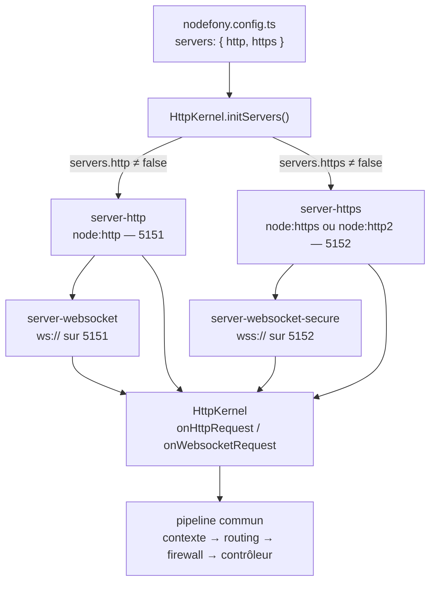
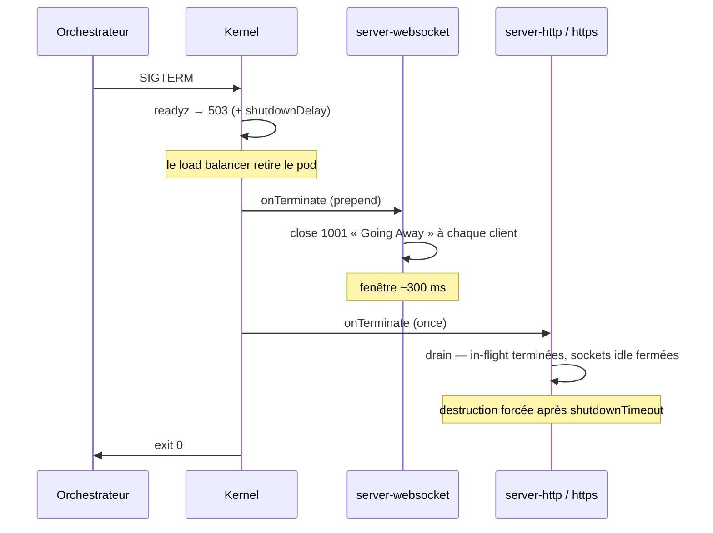

# Serveurs — HTTP, HTTPS, HTTP/2, WebSocket

> Ce sont les portes d'entrée du processus : ce qui ouvre les sockets, accepte les connexions et
> transmet chaque requête — web ou temps réel — au **même** pipeline. Une application Nodefony ouvre
> jusqu'à **deux ports** (5151 en clair, 5152 en TLS) et y adosse **quatre serveurs** (HTTP, HTTPS/HTTP-2,
> WS, WSS). Cette page décrit ce qu'ils écoutent, comment on les règle, comment ils démarrent, comment
> ils s'arrêtent, et pourquoi ils ne doivent jamais tomber. Chaque fait est ancré sur le code.

📍 [Documentation](../../../../../docs/index.md) › [@nodefony/http](index.md) › **Serveurs**

## 🧠 Le modèle mental — deux ports, quatre serveurs, un pipeline

Un serveur Nodefony n'est pas un « framework qui écoute ». C'est un **assemblage de services** : chaque
serveur est un service injectable qui possède son socket, et tous délèguent au même orchestrateur,
`HttpKernel`. Le WebSocket **n'a pas de port à lui** : il se greffe sur le serveur HTTP correspondant.



Trois idées à retenir, et tout le reste en découle :

1. **Un serveur = un service DI.** Ils sont déclarés dans `@services([…])` du module
   (`src/packages/@nodefony/http/index.ts:52`) et instanciés par le conteneur, comme n'importe quel
   service — donc introspectables, testables, remplaçables.
2. **Le WS hérite de son porteur.** `server-websocket` reçoit le `http.Server` déjà en écoute
   (`Websocket.createServer()`, `server-websocket.ts:62`) ; `server-websocket-secure` reçoit le
   `https.Server`. Couper HTTPS coupe donc le WSS, sans autre réglage.
3. **Les quatre convergent vers `HttpKernel`.** Les serveurs ne connaissent ni les routes, ni les
   sessions, ni le firewall : ils branchent `onHttpRequest` / `onWebsocketRequest` et se taisent.

## 📖 Lexique

| Terme                | Sens                                                                                                              |
| -------------------- | ----------------------------------------------------------------------------------------------------------------- |
| Bind / `listen`      | Réserver un port auprès du noyau. Opération **atomique** : elle réussit, ou le noyau répond `EADDRINUSE`.         |
| `EADDRINUSE`         | Code d'erreur système « adresse déjà utilisée » — un autre processus occupe le port.                              |
| ALPN                 | _Application-Layer Protocol Negotiation_ : le client et le serveur choisissent `h2` ou `http/1.1` pendant le TLS. |
| h2 / HTTP-2          | Version multiplexée de HTTP : plusieurs flux (streams) dans une seule connexion TCP.                              |
| `allowHTTP1`         | Option Node qui autorise un serveur HTTP/2 à servir aussi les clients HTTP/1.1 restés en arrière.                 |
| Upgrade              | Requête HTTP `GET` + en-tête `Upgrade: websocket` qui bascule la connexion en WebSocket (réponse `101`).          |
| Frame                | Unité de message WebSocket (RFC 6455).                                                                            |
| Zombie (half-open)   | Socket dont le pair a disparu sans fermer proprement : TCP paraît ouvert, personne n'est en face.                 |
| Ping / Pong          | Frames de contrôle WebSocket servant de battement de cœur (keep-alive).                                           |
| Drain                | Vidange : laisser finir les requêtes en cours avant de fermer, plutôt que couper les sockets.                     |
| Liveness / Readiness | Sondes cloud : « le processus est-il vivant ? » / « peut-il recevoir du trafic ? ».                               |
| SIGTERM              | Signal d'arrêt poli envoyé par l'orchestrateur (k8s, `docker stop`) avant le `SIGKILL`.                           |
| SAN                  | _Subject Alternative Name_ : la liste des noms/IP qu'un certificat couvre réellement (RFC 6125).                  |
| mkcert               | Outil de développement qui installe une autorité de certification locale **de confiance** sur la machine.         |
| Reverse-proxy / edge | Le nginx / HAProxy / ingress placé devant l'application, souvent porteur du TLS.                                  |
| `X-Forwarded-*`      | En-têtes ajoutés par un proxy pour dire l'IP, l'hôte et le protocole d'origine du client.                         |
| CSWSH                | _Cross-Site WebSocket Hijacking_ : une page tierce ouvre un WebSocket authentifié par le cookie de la victime.    |
| `SO_REUSEPORT`       | Option système permettant à N processus d'écouter le **même** port, le noyau répartissant les connexions.         |

## Qu'est-ce qu'un serveur, ici ?

Imagine un immeuble avec **deux entrées** : une porte de service (HTTP en clair, 5151) et une porte
principale sécurisée (TLS, 5152). Derrière chaque porte, un **hall unique** : peu importe par où l'on
entre, on aboutit au même accueil, qui oriente vers le bon bureau. Le WebSocket, lui, n'est pas une
troisième porte : c'est un **interphone installé sur les portes existantes** — il emprunte la même
serrure, la même adresse, la même politique de sécurité.

Concrètement, un serveur Nodefony a quatre responsabilités, et rien d'autre :

1. **Ouvrir** — réserver un port, ou en négocier un autre si celui-ci est pris.
2. **Régler le transport** — délais, taille des en-têtes, TLS, compression WebSocket, limites HTTP/2.
3. **Transmettre** — passer chaque requête / connexion au `HttpKernel`, sans jamais l'interpréter.
4. **Fermer proprement** — vider les requêtes en cours, prévenir les clients WebSocket, libérer le port.

Tout ce qui suit (routing, session, firewall, contrôleur) appartient au pipeline, décrit dans
[pipeline-requete](../../../../../docs/architecture/pipeline-requete.md).

## La vision Nodefony

Le différenciateur du framework — **HTTP et WebSocket dans le même contexte de contrôleur** — se joue
ici, au niveau du transport. Trois choix structurent l'implémentation.

**Node natif, rien d'autre.** `node:http`, `node:https`, `node:http2` et la bibliothèque `ws`. Pas
d'abstraction de serveur maison, pas de runtime alternatif. Ce que Node sait faire, Nodefony le laisse
faire — il n'ajoute que ce que Node ne fournit pas : la politique de port, le drain, le keep-alive WS,
les probes.

**Un port TLS qui parle deux protocoles.** Quand `servers.https.protocol` vaut `"2.0"` (le défaut),
Nodefony crée un serveur HTTP/2 sécurisé avec `allowHTTP1: true` (`ServerHttps.createServerH2()`,
`server-https.ts:174`) : les clients modernes négocient `h2` par ALPN, les autres restent en HTTP/1.1
**sur le même port**. Le protocole effectif est relu socket par socket pour taguer le contexte
(`server-https.ts:222`).

**Le WebSocket n'est jamais un citoyen de seconde zone.** Il est adossé au serveur HTTP porteur
(`server-websocket.ts:80`), passe par le **même** rate-limit d'IP que les requêtes HTTP — un upgrade
_est_ une requête HTTP (`HttpKernel.onWebsocketRequest()`, `http-kernel.ts:1497`) —, hérite de la même
session et du même firewall, et se ferme avec le même soin qu'une réponse HTTP.

> [!NOTE]
> Le serveur HTTP/3 (QUIC) est **réservé, pas implémenté** : la clé `http3` existe dans le schéma,
> marquée `reserved` (`config.ts:1029`). Elle ne fait rien aujourd'hui.

## 🚀 Démarrage rapide

Dans une application générée par `nodefony create app`, **les serveurs sont déjà là** : le manifeste
charge `@nodefony/http`, et le kernel ouvre 5151 et 5152 au boot. On n'écrit que ses **écarts**.

### 1. La topologie — quels serveurs, sur quels ports

La topologie appartient à l'**application** (bloc `servers`), pas au module : c'est une propriété du
déploiement.

```typescript
// nodefony.config.ts — la topologie réseau de l'app
export default defineConfig((ctx) => ({
  // Un conteneur doit écouter TOUTES les interfaces : un bind 127.0.0.1 n'est
  // jamais atteint par le port mapping Docker/k8s.
  domain: ctx.isProd ? "0.0.0.0" : "127.0.0.1",
  servers: {
    http: { port: 5151 },
    // protocol "2.0" = HTTP/2 (h2) avec repli HTTP/1.1 sur le MÊME port.
    https: { port: 5152, protocol: "2.0" },
    // Port occupé : en dev on glisse au suivant (annoncé) ; en prod on échoue.
    portPolicy: ctx.isProd ? "strict" : "auto",
  },
  modules: ["@nodefony/http", "@nodefony/framework"],
}));
```

### 2. Le réglage — le comportement de chaque serveur

Le réglage appartient au **module**, colocalisé dans le manifeste via `use()`. Toutes les clés
ci-dessous sont facultatives : ce sont les défauts du schéma Zod, écrits ici pour les montrer.

```typescript
// nodefony.config.ts — réglage transport (extrait du manifeste `modules`)
export default defineConfig(() => ({
  modules: [
    use("@nodefony/http", {
      // Ne pas exposer l'identité du serveur (anti-empreinte, recommandé en prod).
      headerServer: null,
      // Barrière Host : le domaine canonique est toujours accepté, + ceux-ci.
      trustedHosts: ["app.example.com"],
      // Un seul reverse-proxy en amont ? alors et alors seulement, lui faire confiance.
      trustProxy: false,
      http: {
        requestTimeout: 30_000, // anti slow-loris (réception complète)
        keepAliveTimeout: 5_000, // réutilisation de la socket TCP
        shutdownTimeout: 5_000, // drain avant destruction forcée
      },
      http2: {
        maxConcurrentStreams: 100, // défense CVE-2023-44487 (Rapid Reset)
        maxSessionMemory: 10, // Mo par session h2
      },
      websocket: {
        maxPayload: 1024 * 1024, // 1 MiB → au-delà, close 1009
        keepaliveInterval: 20_000, // ping toutes les 20 s
        keepaliveGracePeriod: 10_000, // pong attendu sous 10 s, sinon zombie
      },
      // Probes cloud-native — actives par défaut.
      health: {
        enabled: true,
        livenessPath: "/livez",
        readinessPath: "/readyz",
      },
      certificates: { strategy: "auto" }, // mkcert en dev, sinon auto-signé
    }),
    "@nodefony/framework",
  ],
}));
```

### 3. Le contrôleur qui répond sur les deux transports

Rien de spécifique aux serveurs : c'est justement le propos. Le même contrôleur sert le web et le
temps réel, et lit le transport dans son contexte.

```typescript
// nodefony/controller/PingController.ts — complet, compile tel quel
import { Controller, controller, Get, route } from "@nodefony/framework";
import type { Context } from "@nodefony/http";

@controller("/ping")
class PingController extends Controller {
  constructor(context: Context) {
    super("PingController", context);
  }

  // HTTP : répond sur http://…:5151/ping ET https://…:5152/ping (h2 inclus).
  @Get("/")
  async ping() {
    return this.renderJson({
      scheme: this.context?.scheme, // "http" | "https"
      type: this.context?.type, // "http" | "http2" | "websocket"
    });
  }

  // WebSocket : ws://…:5151/ping/live et wss://…:5152/ping/live.
  // `message == null` = handshake (la connexion vient de s'ouvrir).
  @route("ping-live", {
    path: "/live",
    requirements: { methods: ["WEBSOCKET"], protocol: "" },
  })
  async live(message: string | Buffer | null) {
    if (message == null) {
      return this.renderJson({ handshake: true });
    }
    return this.render(message.toString());
  }
}

export default PingController;
```

### 4. Ce qu'on observe au boot

Le kernel démarre les serveurs à la phase `onReady` (`Kernel.ts:1030`), puis affiche les URL réellement
en écoute — le récap de développement liste HTTP, HTTP/2, WS et WSS dans cet ordre
(`BootReporter.ts:389`) :

```text
  ✓  Prêt en 1.4s

     Serveurs
     ➜  HTTP     http://127.0.0.1:5151
     ➜  HTTP/2   https://127.0.0.1:5152
     ➜  WS       ws://127.0.0.1:5151
     ➜  WSS      wss://127.0.0.1:5152
```

Hors écran animé (production, CI, `--debug`), ce sont les bannières par serveur qui sortent
(`ServerHttp.showBanner()`, `server-http.ts:226`, appelées par le kernel — `Kernel.ts:457`) :

```text
Server Listen on http://127.0.0.1:5151 Family: IPv4 Protocol : 1.1
```

### 5. Vérifier depuis le terminal

```bash
# HTTP/1.1 en clair
curl -s http://127.0.0.1:5151/ping
# {"scheme":"http","type":"http"}

# HTTP/2 sur le port TLS (-k : le certificat de dev n'est pas dans le trust store)
curl -sk --http2 https://127.0.0.1:5152/ping
# {"scheme":"https","type":"http2"}

# Le même port TLS sert encore HTTP/1.1 (allowHTTP1) — repli négocié par ALPN
curl -sk --http1.1 https://127.0.0.1:5152/ping
# {"scheme":"https","type":"https"}

# Probes cloud-native, servies par les DEUX serveurs
curl -si http://127.0.0.1:5151/livez  | head -1   # HTTP/1.1 200 OK
curl -sik https://127.0.0.1:5152/readyz | head -1  # HTTP/2 200
```

### Cas cloud-native — un seul port, TLS terminé à l'ingress

C'est le déploiement **nominal** en Kubernetes : l'ingress porte le certificat, le pod sert en clair.
`https: false` désactive HTTPS **et** le WSS qui en hérite, et supprime au passage toute génération de
certificat au boot.

```typescript
// nodefony.config.ts — pod k8s derrière un ingress qui termine le TLS
export default defineConfig((ctx) => ({
  domain: ctx.isProd ? "0.0.0.0" : "127.0.0.1",
  servers: {
    https: false, // un seul port exposé : 5151
  },
  modules: [
    use("@nodefony/http", {
      // L'ingress est l'unique point d'entrée → ses X-Forwarded-* sont fiables.
      trustProxy: ctx.isProd ? "uniquelocal" : false,
      // L'ingress filtre déjà le Host ; sinon lister les vhosts servis.
      trustedHosts: ["app.example.com"],
    }),
    "@nodefony/framework",
  ],
}));
```

## 🔌 Les quatre serveurs (et le cinquième service)

Choisir en cinq secondes :

| Service                   | Écoute              | Créé si…                  | Rôle                                               |
| ------------------------- | ------------------- | ------------------------- | -------------------------------------------------- |
| `server-http`             | `http://` — 5151    | `servers.http !== false`  | HTTP/1.1 en clair.                                 |
| `server-https`            | `https://` — 5152   | `servers.https !== false` | TLS : HTTP/2 (défaut) ou HTTP/1.1.                 |
| `server-websocket`        | `ws://` — 5151      | `server-http` actif       | WebSocket adossé au serveur HTTP.                  |
| `server-websocket-secure` | `wss://` — 5152     | `server-https` actif      | WebSocket adossé au serveur TLS.                   |
| `server-static`           | (aucun port propre) | toujours enregistré       | Fichiers statiques, en **repli** après le routing. |

L'assemblage est fait par `HttpKernel.initServers()` (`http-kernel.ts:1033`) : chaque serveur est
consulté sur son drapeau `active`, un serveur désactivé est **sauté**, pas créé (`http-kernel.ts:235`).
Les serveurs WebSocket ne sont montés que si leur porteur l'a été.

### `server-http` — HTTP/1.1 en clair

Le plus simple, et celui qui porte le trafic en cloud-native. `ServerHttp.createServer()`
(`server-http.ts:68`) crée le `http.Server`, applique les réglages de transport, branche
`onHttpRequest`, puis écoute selon la politique de port.

- **Actif** si `servers.http` n'est pas `false` — la décision est prise dès le constructeur
  (`server-http.ts:56`), et le port est lu de la config d'app (`ServerHttp.setPort()`,
  `server-http.ts:61`).
- **Réglages appliqués** : `requestTimeout` (anti slow-loris), `maxHeadersCount`, `timeout` de socket
  (qui émet un événement `onTimeout`), `keepAliveTimeout`.
- **Erreurs de protocole** : l'événement `clientError` est traité explicitement
  (`server-http.ts:167`) — voir la section Résilience, c'est un piège Node à part entière.

### `server-https` — TLS, et HTTP/2 par défaut

Deux branches dans un seul service, choisies sur `servers.https.protocol` (`server-https.ts:88`) :

- **`"2.0"` (défaut)** → `http2.createSecureServer` avec `allowHTTP1: true`
  (`ServerHttps.createServerH2()`, `server-https.ts:174`). Les bornes anti-DoS HTTP/2 ne sont posées
  **que si elles sont configurées**, pour ne pas écraser les défauts de Node
  (`maxSessionMemory`, `server-https.ts:197`).
  Les erreurs de session et de flux sont journalisées sans tuer le serveur
  (`sessionError`, `server-https.ts:274`).
- **`"1.1"`** → `https.createServer` classique.

Le certificat vient du service `certificates`, lu au moment de la création via
`serviceCerticats` (`server-https.ts:94`) — voir la section dédiée.

> [!IMPORTANT]
> Sur la branche HTTP/2, le protocole **effectif** est relu par requête via l'ALPN de la socket TLS
> (`server-https.ts:222`) : un client `h2` produit un contexte de type `http2`, un client HTTP/1.1 sur
> le même port produit un contexte `https`. C'est ce qui rend le port TLS universel.

### `server-websocket` — WebSocket en clair

Il ne crée **aucun** socket : il reçoit le `http.Server` déjà en écoute et s'y greffe
(`server-websocket.ts:62`), puis relit `address()` pour connaître son port — il suit donc
automatiquement un éventuel décalage de port.

- **Options transmises à `ws`** telles quelles (compression, validation UTF-8, `maxPayload`…), avec deux
  réglages **forcés** par Nodefony : `server` et `clientTracking: true`, requis par `broadcast()` et par
  le battement de cœur (`server-websocket.ts:80`).
- **Keep-alive** armé à la création (`startHeartbeat()`, `server-websocket.ts:87`) et par connexion
  (`trackPong()`, `server-websocket.ts:107`).
- **Arrêt** : il s'inscrit en tête des écouteurs de terminaison
  (`prependOnceListener`, `server-websocket.ts:91`) — l'ordre
  compte, voir la section Arrêt gracieux.

### `server-websocket-secure` — WebSocket sur TLS

Même code, une différence qui a son importance : il lit sa **propre** section de configuration,
`websocketSecure`, et non `websocket` (`server-websocket-secure.ts:50`). Régler `websocket.maxPayload`
ne change donc rien au WSS ; les deux sections ont la même forme et les mêmes défauts.

### `server-static` — les fichiers, en repli

Pas de port : c'est un service greffé sur le pipeline. Depuis la bascule « router d'abord », il n'est
consulté qu'**après** un échec de routage — une requête qui matche une route ne touche plus le disque.
Il se désactive par `statics.enabled: false` (cas cloud-native : nginx ou un CDN sert les fichiers) sans
pour autant supprimer les montages programmatiques.

## ⚙️ Configuration — deux niveaux, jamais mélangés

C'est la distinction la plus utile de cette page, et celle qu'on rate le plus souvent.

| Question                                  | Où ça se règle                 | Source                                                    |
| ----------------------------------------- | ------------------------------ | --------------------------------------------------------- |
| **Quels** serveurs, sur **quels ports** ? | `servers` (config d'app)       | `serversSchema` (`src/nodefony/src/config/schema.ts:132`) |
| **Comment** ces serveurs se comportent ?  | `use("@nodefony/http", { … })` | `httpConfigSchema` (`config.ts:947`)                      |

Autrement dit : la **topologie** est une propriété du déploiement (elle change entre le poste du dev,
la CI et le cluster) ; le **réglage** est une propriété de l'application.

### Niveau 1 — la topologie (`servers`)

<!-- prettier-ignore -->
| Option | Type | Défaut | Effet |
| --- | --- | --- | --- |
| `servers.http` | `{ port }` \| `false` | `{ port: 5151 }` | Serveur en clair. `false` = TLS-only (le WS tombe avec). |
| `servers.https` | `{ port, protocol }` \| `false` | `{ port: 5152, protocol: "2.0" }` | Serveur TLS. `false` = nominal cloud-native (le WSS tombe). |
| `servers.https.protocol` | `"1.1"` \| `"2.0"` | `"2.0"` | HTTP/2 (h2) avec repli HTTP/1.1 par ALPN, ou HTTP/1.1 seul. |
| `servers.statics` | bool | `true` | Monte le service de fichiers statiques. |
| `servers.portPolicy` | `"auto"` \| `"strict"` | `auto` en dev, `strict` en prod **et** test | Que faire si le port est occupé (section suivante). |
| `servers.portRetryAttempts` | int ≥ 0 | `20` | En `auto`, nombre de ports essayés après le port désiré. |

Défauts matérialisés dans `defaultAppConfig` (`src/nodefony/src/config/defaults.ts:34`).

### Niveau 2 — le transport HTTP / HTTPS

Table dérivée de `httpServerSchema` (`config.ts:257`) ; la section `https` reprend les mêmes clés et en
ajoute une (`httpsServerSchema`, `config.ts:315`).

| Option                       | Type  | Défaut   | Effet                                                                            |
| ---------------------------- | ----- | -------- | -------------------------------------------------------------------------------- |
| `maxHeadersCount`            | int   | `2000`   | Nombre maximum d'en-têtes par requête — anti _header flooding_.                  |
| `keepAliveTimeout`           | ms    | `5000`   | Délai de réutilisation de la socket TCP entre deux requêtes.                     |
| `timeout`                    | ms    | `120000` | Timeout global de socket. `0` = désactivé.                                       |
| `requestTimeout`             | ms    | `30000`  | Délai de réception de la requête complète — **anti slow-loris**.                 |
| `responseTimeout`            | ms    | `30000`  | Délai d'envoi de la réponse complète (couche pipeline).                          |
| `shutdownTimeout`            | ms    | `5000`   | Drain au shutdown avant destruction forcée. Garder < grâce orchestrateur.        |
| `headers`                    | objet | `null`   | En-têtes ajoutés à toutes les réponses.                                          |
| `rejectUnauthorized` (https) | bool  | `false`  | Rejette les certificats invalides. `false` en dev (auto-signés), `true` en prod. |

Ces deux sections sont **permissives** (`z.looseObject`) : toute option supplémentaire de
`http.Server` / `net.Server` / TLS (`insecureHTTPParser`, `ciphers`, `minVersion`…) est transmise telle
quelle à Node. C'est délibéré — un schéma strict effacerait silencieusement une option légitime.

### Niveau 2 — HTTP/2

Depuis `http2Schema` (`config.ts:332`), appliqué seulement si défini
(`maxSessionMemory`, `server-https.ts:197`).

| Option                 | Type | Défaut | Effet                                                                         |
| ---------------------- | ---- | ------ | ----------------------------------------------------------------------------- |
| `maxConcurrentStreams` | int  | `100`  | Flux concurrents par session h2 — **défense CVE-2023-44487** (_Rapid Reset_). |
| `maxSessionMemory`     | Mo   | `10`   | Mémoire maximale par session h2 — borne l'amplification mémoire.              |

### Niveau 2 — WebSocket (`websocket` et `websocketSecure`)

Depuis `websocketSchema` (`config.ts:490`). Les deux sections partagent la forme et les défauts ; le WSS
lit `websocketSecure` (`config.ts:1037`).

| Option                   | Type                | Défaut  | Effet                                                                              |
| ------------------------ | ------------------- | ------- | ---------------------------------------------------------------------------------- |
| `keepaliveInterval`      | ms                  | `20000` | Intervalle des pings — détecte les connexions zombies.                             |
| `keepaliveGracePeriod`   | ms                  | `10000` | Délai de grâce après un ping sans réponse avant fermeture.                         |
| `closeTimeout`           | ms                  | `5000`  | Délai de fermeture propre avant destruction de la socket.                          |
| `maxPayload`             | octets              | `1 MiB` | Taille max d'un message entrant → au-delà, **close 1009** (`config.ts:516`).       |
| `allowedOrigins`         | bool \| str \| list | `false` | Allowlist d'`Origin` au handshake — **anti-CSWSH** (`config.ts:525`).              |
| `perMessageDeflate`      | bool \| objet       | `false` | Compression RFC 7692. Désactivée par défaut : coût CPU/RAM + risque de _zip bomb_. |
| `skipUTF8Validation`     | bool                | `false` | Désactive la validation UTF-8 des frames texte (RFC 6455 §8.1). À laisser `false`. |
| `autoPong`               | bool                | `true`  | Répond automatiquement aux pings entrants (RFC 6455 §5.5.2-3). À laisser `true`.   |
| `allowSynchronousEvents` | bool                | `true`  | Émet plusieurs frames d'un même chunk réseau de façon synchrone (débit vs équité). |
| `maxBackpressure`        | octets              | `4 MiB` | Seuil du tampon d'envoi par connexion (client lent à recevoir) — anti-OOM.         |
| `backpressurePolicy`     | `drop` \| `close`   | `drop`  | Au-delà du seuil : sauter la frame, ou fermer le client (close 1013).              |

> [!WARNING]
> `keepalive*`, `closeTimeout`, `maxBackpressure` et `backpressurePolicy` sont des **réglages
> Nodefony**, pas des options de `ws` : la bibliothèque les ignore, c'est le framework qui les
> implémente. À l'inverse, `server`, `noServer`, `clientTracking`, `host`, `port` et `backlog` sont
> **gérés par Nodefony** et non exposés — les forcer n'aurait pas d'effet.

## ⚙️ Ports occupés — la politique de repli

### La situation

Tu développes sur le framework et, dans un autre terminal, tu lances l'app d'un client. Les deux
veulent 5151. Historiquement, la seconde mourait sur `EADDRINUSE`. En développement, ce n'est pas une
panne, c'est une nuisance.

### La règle

`resolvePortPolicy()` (`portBinder.ts:74`) tranche selon l'environnement, et la valeur explicite gagne
toujours :

| Environnement | Défaut   | Pourquoi                                                                                                     |
| ------------- | -------- | ------------------------------------------------------------------------------------------------------------ |
| `development` | `auto`   | Un port pris est une gêne. L'app démarre sur le port suivant, et **le dit**.                                 |
| `production`  | `strict` | Le port est un **contrat** (service k8s, ingress, sonde). Glisser en silence = pod « sain » injoignable.     |
| `test`        | `strict` | Un port occupé signale un serveur resté debout ; le banc doit s'arrêter, pas taper sur le serveur du voisin. |

### Le comportement observable

```text
WARNING  Port 5151 déjà occupé → HTTP écoute sur 5153.
         Figer le port : servers.http.port ; échouer au lieu de glisser :
         servers.portPolicy = "strict".
```

Le décalage est **toujours annoncé** (`server-http.ts:130`) : jamais de dégradation silencieuse. Trois
détails d'implémentation valent d'être connus, parce qu'ils expliquent des comportements surprenants.

1. **On retente au `listen()`, jamais après une sonde.** Demander « le port est-il libre ? » puis
   binder est une course : entre la réponse et le bind, un autre processus peut prendre le port. Le
   `listen()` est atomique — on retente donc sur l'échec réel (`bindWithFallback()`,
   `portBinder.ts:142`).
2. **Le port de l'autre serveur est réservé.** Si HTTP est chassé de 5151, incrémenter naïvement le
   ferait voler 5152 à HTTPS, qui se décalerait à son tour. Les ports convoités par les autres serveurs
   sont sautés d'emblée (`buildBindPlan()`, `portBinder.ts:104`, réservation `portBinder.ts:111`).
3. **Le gestionnaire d'erreur durable est posé APRÈS le bind.** Attaché avant, il verrait passer les
   `EADDRINUSE` de repli et terminerait le kernel en croyant à une panne
   (`ServerHttp.attachErrorHandler()`, `server-http.ts:186`).

Quand le bind échoue pour de bon — `strict`, ou tous les replis épuisés, ou une erreur qui n'est pas un
conflit de port — c'est **fatal** : message explicite puis terminaison du processus
(`ServerHttp.reportBindError()`, `server-http.ts:199`). Un serveur qui n'écoute pas ne doit jamais
laisser un processus se croire démarré.

### Le corollaire : les ports effectifs sont publiés

Si le port peut glisser, alors « le serveur écoute sur 5151 » n'est plus une vérité mais une
convention — et `nodefony status`, `nodefony stop` ou l'attente de disponibilité sonderaient un port
que personne n'écoute. `HttpKernel.publishRuntimePorts()` (`http-kernel.ts:1096`) écrit donc la
topologie réelle (pid, ports obtenus, ports désirés) dans un fichier d'état, **dans tous les
environnements** : une application qui déclare son port via `PORT` (PaaS) sort aussi de la convention,
même en `strict`. L'écriture est au mieux-effort — une image en lecture seule ne fait jamais tomber un
serveur qui, lui, écoute très bien.

## 🔐 Certificats TLS

### La doctrine

**Générer un certificat est un confort de développement, pas une fonction de production.** Nodefony
n'est pas une autorité de certification : en production, on fournit un vrai certificat (Let's Encrypt,
ingress k8s, reverse-proxy). Le service crie un avertissement si ce n'est pas le cas
(`Certificate.resolveStrategy()`, `certificates.ts:409`).

### Les quatre stratégies

Réglées par `certificates.strategy` (`certificatesSchema`, `config.ts:448`), résolues par
`Certificate.resolveStrategy()` (`certificates.ts:370`).

| Stratégie       | Quand l'utiliser                            | Ce qui se passe                                                             |
| --------------- | ------------------------------------------- | --------------------------------------------------------------------------- |
| `auto` (défaut) | On ne veut pas décider                      | `key`+`cert` fournis → `explicit` ; sinon mkcert en dev ; sinon auto-signé. |
| `explicit`      | **Production**                              | Charge `key`/`cert`/`ca` depuis la config. Erreur au boot si absents.       |
| `mkcert`        | Développement avec HTTPS sans avertissement | CA locale de confiance → HMR cross-origin et WSS sans erreur navigateur.    |
| `selfsigned`    | Secours, CI, machine sans mkcert            | Auto-signé node-forge, non trusté.                                          |

```typescript
// nodefony.config.ts — production : certificat fourni, jamais généré
export default defineConfig(() => ({
  modules: [
    use("@nodefony/http", {
      certificates: {
        strategy: "explicit",
        key: "/etc/tls/privkey.pem",
        cert: "/etc/tls/fullchain.pem",
        ca: "/etc/tls/chain.pem",
      },
      https: { rejectUnauthorized: true },
    }),
    "@nodefony/framework",
  ],
}));
```

> [!TIP]
> Pour un HTTPS de développement **sans avertissement navigateur** (indispensable au HMR cross-origin
> et au WSS) : `brew install mkcert nss && mkcert -install`. Nodefony le détecte tout seul, sinon il
> l'annonce et retombe sur l'auto-signé (`certificates.ts:392`).

### Ce que le chemin `explicit` évite

`node-forge` est une grosse dépendance. Elle est chargée **paresseusement**, uniquement sur le chemin
de génération (`Certificate.loadForge()`, `certificates.ts:218`) : en production avec un certificat
fourni, elle n'entre jamais dans le processus (`certificates.ts:325`).

### Conformité de l'auto-signé

Un certificat de développement bâclé fait perdre des heures (« not yet valid », « common name
invalid »). Celui de Nodefony respecte les règles qui comptent :

| Exigence                                | Norme                | Mise en œuvre                                             |
| --------------------------------------- | -------------------- | --------------------------------------------------------- |
| Signature SHA-256, **jamais** SHA-1     | RFC 5280, CA/B Forum | `openssl.hash` par défaut `sha256` (`config.ts:379`)      |
| Numéro de série aléatoire 128 bits      | RFC 5280 §4.1.2.2    | `Certificate.generateSerialHex()` (`certificates.ts:255`) |
| Le SAN fait foi, pas le CN              | RFC 6125             | SAN dérivé du kernel si non fourni (`config.ts:415`)      |
| `notBefore` reculé (décalage d'horloge) | pratique             | `openssl.backdateMinutes`, défaut 5 (`config.ts:394`)     |
| Clé privée non lisible par tous         | hygiène              | `privateKeyMode` `0600` (`config.ts:472`)                 |

### Régénération automatique

Un certificat présent sur disque n'est pas forcément **adéquat**. `Certificate.isCertAdequate()`
(`certificates.ts:533`) le régénère s'il est expiré, s'il est signé en SHA-1, ou si son SAN ne couvre
plus les noms requis — le dernier cas est celui qui sauve : changer le domaine d'écoute sans ce
contrôle laisserait un certificat obsolète en place indéfiniment.

## 🛡️ Derrière un reverse-proxy

Dès qu'un proxy est devant l'application, trois questions se posent — et trois réglages y répondent.

### « Quelle est la vraie IP du client ? » → `trustProxy`

Sans barrière, n'importe quel client peut envoyer `X-Forwarded-For: 1.2.3.4` et usurper son IP :
contournement de rate-limit, journaux d'audit falsifiés. Le défaut est donc **`false` — ces en-têtes
sont ignorés** (`config.ts:959`), et l'IP retenue est celle de la socket réelle, non falsifiable.

| Valeur                                       | Sens                                                               |
| -------------------------------------------- | ------------------------------------------------------------------ |
| `false` (défaut)                             | Ne jamais faire confiance aux `X-Forwarded-*`.                     |
| `true`                                       | Confiance totale — **uniquement** si le proxy est l'unique entrée. |
| IP, CIDR, liste                              | Confiance conditionnée à l'adresse de la socket.                   |
| `"loopback"`, `"linklocal"`, `"uniquelocal"` | Préréglages de plages privées.                                     |

La politique est compilée **une seule fois** au premier usage (`HttpKernel.getTrustProxyChecker()`,
`http-kernel.ts:538`, via `buildTrustProxy()`, `trustProxy.ts:100`) : aucune structure allouée par
requête. La résolution de l'IP cliente remonte la chaîne **de droite à gauche** depuis la socket réelle
(`resolveForwarded()`, `forwarded.ts:253`) — conforme RFC 7239 et à la recommandation OWASP.

### « Ce `Host` est-il le mien ? » → `trustedHosts`

Barrière testée **avant le routage**, contre l'injection d'en-tête `Host`. Le domaine canonique du
kernel est toujours accepté, plus le loopback en développement (`HttpKernel.compileAlias()`,
`http-kernel.ts:936`). `false` (défaut) = ce socle seul ; une liste ajoute des vhosts (exact ou joker
d'un seul niveau, `*.cdn.example.com`) ; `true` désactive la barrière — à réserver au cas où le proxy
filtre déjà le `Host` (`config.ts:968`).

### « Cette page a-t-elle le droit d'ouvrir un WebSocket ? » → `allowedOrigins`

Les navigateurs **n'appliquent pas CORS aux WebSockets**. Sans contrôle, une page tierce peut ouvrir un
WS authentifié par le cookie de session de la victime (CSWSH, OWASP WSTG-CLNT-10). Nodefony exige donc
par défaut que l'`Origin` du handshake corresponde au `Host` servi
(`HttpKernel.checkWebsocketOrigin()`, `http-kernel.ts:599`), avec tolérance loopback en développement
et allowlist explicite pour les SPA cross-origine. Un refus se solde par une fermeture **1008 (Policy
Violation)**, jamais par un code HTTP.

> [!NOTE]
> Une requête **sans** `Origin` (client non navigateur : script, agent, test) est acceptée
> (`http-kernel.ts:518`). Ce n'est pas un trou : un attaquant non navigateur n'a aucun besoin de CSWSH,
> il se connecte directement. Le contrôle protège les **utilisateurs**, pas le port.

## Probes de santé — `/livez` et `/readyz`

Deux questions différentes, deux réponses différentes — les confondre casse les déploiements.

| Probe     | Question                     | Réponse                                                                         |
| --------- | ---------------------------- | ------------------------------------------------------------------------------- |
| `/livez`  | Le processus est-il vivant ? | `200` tant qu'il sert, **y compris pendant le drain**.                          |
| `/readyz` | Peut-il recevoir du trafic ? | `200` si le boot est complet **et** que l'arrêt n'a pas commencé ; `503` sinon. |

Le détail qui compte : `livez` reste à `200` pendant l'arrêt gracieux. Répondre `503` là ferait
redémarrer le pod **en plein drain** par le kubelet, et casserait précisément ce qu'on essaie de
protéger.

Implémentation : court-circuit **total** du pipeline dans `HttpKernel.onHttpRequest()`
(`http-kernel.ts:944`) — pas de contexte, pas de portée DI, pas de session, pas de journal par sonde,
réponses pré-allouées (`HttpKernel.#respondHealth()`, `http-kernel.ts:473`). Et surtout : **avant le
rate-limit**. Un kubelet qui reçoit un `429` croit le pod mort → cascade de redémarrages.

| Option          | Type   | Défaut    | Effet                                                                  |
| --------------- | ------ | --------- | ---------------------------------------------------------------------- |
| `enabled`       | bool   | `true`    | Expose les probes (`healthSchema`, `config.ts:919`).                   |
| `livenessPath`  | string | `/livez`  | Chemin de la sonde de vie (`livenessProbe.httpGet.path` k8s).          |
| `readinessPath` | string | `/readyz` | Chemin de la sonde de disponibilité.                                   |
| `shutdownDelay` | ms     | `0`       | Délai entre la bascule `503` et le début du drain (propagation du LB). |

Le match est **strict** sur l'URL brute : `/livez?x=1` repart dans le pipeline normal. Les deux
serveurs (HTTP et HTTPS) servent ces chemins — un kubelet configuré en `scheme: HTTPS` fonctionne.

## Arrêt gracieux — la séquence du SIGTERM

Un arrêt brutal coupe les requêtes en vol : à chaque mise à jour progressive, des utilisateurs voient
une erreur. L'arrêt de Nodefony est une **séquence ordonnée**, et l'ordre est le cœur du sujet.



**Étape 1 — la disponibilité bascule en premier.** L'écouteur est posé à `onPostReady` pour être
inséré **en tête** et donc s'exécuter **en premier** (`http-kernel.ts:515`). `readyz` répond `503`, le
load balancer cesse d'envoyer du trafic, et `shutdownDelay` laisse à cette information le temps de se
propager.

**Étape 2 — les clients WebSocket sont prévenus.** `Websocket.terminate()` (`server-websocket.ts:117`)
envoie un message applicatif puis une **frame Close 1001 « Going Away »** (`server-websocket.ts:134`).
Sans elle, la coupure TCP ferait voir un **1006** au client — code réservé, jamais émis sur le fil,
indiscernable d'une panne réseau. Avec 1001, le client sait qu'il doit simplement se reconnecter.

**Étape 3 — les requêtes HTTP se terminent.** Le drain est délégué à `http-terminator`
(`createDrainTerminator()`, `serverShutdown.ts:25`) : en-tête `connection: close` injecté sur les
réponses en cours, sockets inactives fermées, destruction forcée au-delà de `shutdownTimeout` (défaut
`5000` ms, `serverShutdown.ts:38`).

> [!IMPORTANT]
> L'ordre WS-avant-HTTP n'est pas cosmétique. Les serveurs WebSocket s'inscrivent en
> `prependOnceListener` (`server-websocket.ts:91`), les serveurs HTTP en `once`
> (`server-http.ts:151`). Inversé, le terminator détruirait les sockets déjà upgradées **sans** frame
> Close : retour du 1006 pour tous les clients temps réel.

Deux garde-fous encadrent la séquence : `shutdownTimeout` **par serveur** (le drain nominal) et
`shutdownDeadline` **global** au kernel (défaut 15 s, `src/nodefony/src/config/defaults.ts:46`), filet
anti-écouteur bloqué. Les deux doivent rester sous la période de grâce de l'orchestrateur — 30 s en
Kubernetes, 10 s avec Docker.

## Résilience — ce qui ne doit jamais tuer le processus

Un serveur runtime se juge à ce qu'il fait des cas anormaux. Quatre défenses vivent au niveau du
transport.

### En-têtes malformés — le piège `clientError` de Node

Dès qu'un écouteur `clientError` est attaché, **Node cesse de fermer la socket automatiquement**. Un
écouteur naïf (« je journalise et je passe ») transforme donc une requête malformée en **fuite de
socket et de descripteur de fichier** — c'est-à-dire un vecteur de déni de service. Nodefony répond et
ferme explicitement (`handleClientError()`, `clientError.ts:15`) : `431` si les en-têtes débordent
(RFC 6585 §5), `400` sinon (`clientError.ts:25`), et rien du tout si la socket est déjà morte.

### Connexions WebSocket zombies

Une socket dont le pair a disparu sans frame Close reste « ouverte » côté TCP : slot mémoire et
descripteur retenus pour personne. Le battement de cœur les réclame
(`startHeartbeat()`, `wsHeartbeat.ts:69`) : un ping toutes les `keepaliveInterval` ms ; sans pong dans
les `keepaliveGracePeriod` ms, la socket est détruite (`terminate`, `wsHeartbeat.ts:98`).

L'implémentation est délibérément frugale — c'est du chemin chaud : **un seul `setInterval` par
serveur**, jamais un timer par connexion ; deux horodatages posés directement sur la socket
(`trackPong()`, `wsHeartbeat.ts:41`), donc zéro allocation par tick et aucun nettoyage à prévoir (les
horodatages meurent avec la socket) ; une granularité de réveil plancher à 250 ms pour borner une
configuration pathologique (`tick`, `wsHeartbeat.ts:81`) ; et un timer `unref` qui ne retient jamais le
processus à l'arrêt.

### Floods de connexions

L'upgrade WebSocket **est** une requête HTTP : il passe donc par le **même** compteur de rate-limit par
IP que les requêtes ordinaires, vérifié avant toute allocation de contexte
(`HttpKernel.onWebsocketRequest()`, `http-kernel.ts:1497`). Le `101` étant déjà émis par `ws`, un `429`
est impossible → la connexion est fermée en **1013 « Try Again Later »**
(`rateLimiter`, `http-kernel.ts:287`), sans
journalisation (un journal par handshake rejeté serait lui-même un amplificateur sous flood).

Un second plafond, **désactivé par défaut**, borne le nombre de connexions **simultanées** par IP :
`wsMaxConnectionsPerIp` (`config.ts:1046`). En cloud-native, laisser `null` et déléguer à l'edge —
nginx `limit_conn`, HAProxy `sc_conn_cur` — qui voit tout le trafic, rejette avant le coût du
descripteur et du TLS, et couvre tous les pods. Ne l'activer que sur une machine sans ingress.

### Bornes de payload

`maxPayload` (1 MiB par défaut) fait fermer en **1009 « Message Too Big »** ; `maxBackpressure`
(4 MiB) protège contre le client **lent à recevoir**, dont le tampon d'envoi gonflerait jusqu'à
l'OOM — un seul lent peut plomber une diffusion générale. La politique par défaut, `drop`, saute la
frame et garde le client connecté.

## ⚡ Performance & mémoire

Le transport est du **chemin chaud absolu** : ce qui coûte ici est multiplié par le nombre de requêtes
par seconde. Les choix visibles dans le code :

- **Aucun timer par connexion** — un `setInterval` par serveur WebSocket, `unref`, et deux `number` par
  socket (`wsHeartbeat.ts:69`).
- **Rien de compilé par requête** — la politique de trust-proxy, celle des `Origin` WS et les motifs de
  `trustedHosts` sont compilés une fois et mémoïsés (`http-kernel.ts:937`, `http-kernel.ts:489`).
- **Rejets avant allocation** — rate-limit HTTP et bornes WS sont vérifiés avant le contexte, la portée
  DI et l'ALS : un flood coûte une recherche dans une table de hachage.
- **Probes hors pipeline** — réponses pré-allouées, aucun objet créé, aucun journal
  (`http-kernel.ts:383`). Un kubelet qui sonde toutes les 2 secondes ne pèse rien.
- **Fichiers statiques en repli** — depuis la bascule « router d'abord », une requête qui matche une
  route ne paie plus l'appel disque de `serve-static` (**+28 % de requêtes par seconde** mesurés en
  production mono-processus).
- **`node-forge` jamais chargé en production** avec un certificat fourni (`certificates.ts:218`).

Ordre de grandeur mesuré : un processus Node saturé sur un cœur tient environ 400 requêtes/s en
boucle locale avec dégradation gracieuse (1600 connexions concurrentes, aucun crash) ; côté WebSocket,
plus de 750 connexions simultanées et 33 000 à 38 000 messages/s soutenus. Rejouer ces mesures : skill
`nodefony-load-test`. Gate mémoire avant tout commit touchant le pipeline : `npm run test:memory`
(skill `nodefony-check-memory-health`).

**Mise à l'échelle.** Un processus = un pod. Le passage à l'échelle est horizontal, confié à
l'orchestrateur ; sur une seule machine, `nodefony cluster -w N` fork des workers. Attention à la
conséquence : `broadcast()` ne touche que les clients du **même** worker — un fan-out inter-processus
demande le backplane realtime.

## 📜 Normes appliquées

| Domaine                               | Norme              | Ancrage                                                                    |
| ------------------------------------- | ------------------ | -------------------------------------------------------------------------- |
| HTTP/1.1 (sémantique, message)        | RFC 9110, 9112     | `node:http` + pipeline `HttpKernel.onHttpRequest()` (`http-kernel.ts:819`) |
| HTTP/2                                | RFC 9113           | `ServerHttps.createServerH2()` (`server-https.ts:174`)                     |
| HTTP/2 Rapid Reset                    | CVE-2023-44487     | `maxConcurrentStreams` (`config.ts:334`)                                   |
| En-têtes trop volumineux → 431        | RFC 6585 §5        | `handleClientError()` (`clientError.ts:25`)                                |
| WebSocket — protocole                 | RFC 6455           | `ws@8` + options (`config.ts:490`)                                         |
| WebSocket — Close 1001 « Going Away » | RFC 6455 §7.4.1    | `Websocket.terminate()` (`server-websocket.ts:134`)                        |
| WebSocket — 1009 « Message Too Big »  | RFC 6455 §7.4.1    | `maxPayload` (`config.ts:516`)                                             |
| WebSocket — validation UTF-8          | RFC 6455 §8.1      | `skipUTF8Validation` (`config.ts:596`)                                     |
| WebSocket — compression               | RFC 7692           | `perMessageDeflate` (`config.ts:540`)                                      |
| CSWSH (Origin au handshake)           | OWASP WSTG-CLNT-10 | `HttpKernel.checkWebsocketOrigin()` (`http-kernel.ts:599`)                 |
| En-têtes forwarded                    | RFC 7239           | `resolveForwarded()` (`forwarded.ts:253`)                                  |
| Certificat — série, SAN, extensions   | RFC 5280           | `Certificate.generateSerialHex()` (`certificates.ts:255`)                  |
| Certificat — identité par le SAN      | RFC 6125           | `sanSchema` (`config.ts:415`)                                              |

## ⚠️ Pièges (symptôme → cause → correction)

| Symptôme                                                        | Cause                                                                      | Correction                                                                         |
| --------------------------------------------------------------- | -------------------------------------------------------------------------- | ---------------------------------------------------------------------------------- |
| L'app écoute sur 5153 au lieu de 5151                           | `portPolicy: "auto"` (défaut dev) : le port était pris — c'est **annoncé** | Libérer le port, ou `servers.portPolicy: "strict"` pour échouer franchement        |
| En production, le pod est « sain » mais injoignable             | Un port glissé en silence                                                  | Rien à faire : `strict` est le défaut hors dev — vérifier qu'on ne l'a pas forcé   |
| `nodefony status` ne voit pas le serveur                        | Ports sondés par convention alors qu'ils ont glissé                        | Déjà géré : les ports effectifs sont publiés (`http-kernel.ts:215`)                |
| Le WSS ignore `websocket.maxPayload`                            | Le serveur secure lit `websocketSecure`, section distincte                 | Régler **les deux** sections (`server-websocket-secure.ts:50`)                     |
| Plus de WebSocket après avoir mis `servers.https: false`        | Le WSS est adossé au serveur HTTPS et tombe avec lui                       | Attendu — utiliser `ws://` sur le port clair, ou réactiver HTTPS                   |
| Le client WebSocket voit `1006` à chaque redéploiement          | Frame Close jamais reçue (socket coupée avant)                             | Déjà géré : close `1001` avant le drain (`server-websocket.ts:134`)                |
| Requêtes coupées à chaque mise à jour progressive               | Destruction des connexions au lieu d'un drain                              | Déjà géré (`createDrainTerminator()`) — vérifier `shutdownTimeout` < grâce k8s     |
| Le pod redémarre en boucle pendant l'arrêt                      | `livez` répondrait `503` pendant le drain                                  | Déjà géré : `livez` reste `200`, seul `readyz` bascule                             |
| Cascade de redémarrages sous charge                             | Sonde de santé soumise au rate-limit                                       | Déjà géré : les probes court-circuitent avant le rate-limit (`http-kernel.ts:848`) |
| `curl --http2` renvoie du HTTP/1.1                              | `servers.https.protocol: "1.1"`, ou client sans ALPN                       | Passer `protocol: "2.0"` (défaut) et vérifier le client                            |
| Avertissement navigateur en HTTPS de développement              | Certificat auto-signé (mkcert absent)                                      | `brew install mkcert nss && mkcert -install`, puis redémarrer                      |
| Le certificat n'est pas régénéré après un changement de domaine | On croit qu'un fichier présent suffit                                      | Déjà géré : le SAN est vérifié (`certificates.ts:546`)                             |
| `strategy: "explicit"` fait échouer le boot                     | `key`/`cert` absents de la configuration                                   | Fournir les deux chemins — l'échec est volontaire, jamais un repli silencieux      |
| Une IP falsifiée passe dans les journaux d'audit                | `trustProxy` accordé trop largement                                        | Restreindre à l'IP/CIDR du proxy, ou revenir à `false`                             |
| Handshake WebSocket refusé en `1008`                            | `Origin` non autorisée (anti-CSWSH)                                        | Ajouter l'origine dans `websocket.allowedOrigins`                                  |
| Fermetures WebSocket en `1013` inexpliquées                     | Rate-limit d'IP, ou plafond de connexions concurrentes                     | Vérifier `rateLimit` et `wsMaxConnectionsPerIp`                                    |

## 📡 Observabilité — Studio et CLI

**Studio.** L'onglet **Configuration** rend la config du module en réglages documentés (type, défaut,
état, valeur effective) à partir du JSON Schema dérivé du schéma Zod
(`src/packages/@nodefony/http/index.ts:79`). Le profiler expose les phases par requête, y compris
l'origine du transport.

**CLI.** Trois commandes touchent directement aux serveurs :

| Commande                                             | Rôle                                                                     |
| ---------------------------------------------------- | ------------------------------------------------------------------------ |
| `nodefony http:network [interface] [--json]`         | Interfaces réseau vues par le kernel (`networkCommand.ts:18`).           |
| `nodefony http:certificates [--force] [--json]`      | (Re)génère et décrit le certificat de dev (`certificatesCommand.ts:24`). |
| `nodefony proxy:generate <nginx\|haproxy> [-o file]` | Dérive une configuration reverse-proxy de l'introspection réelle.        |

`proxy:generate` mérite un mot : la configuration nginx/HAProxy est **dérivée** des domaines de
confiance, des ports effectifs et des dossiers statiques montés — donc elle ne diverge pas du code. Le
résumé de certificat vient de `Certificate.describe()` (`certificates.ts:803`), source unique partagée
par la commande, le boot et un futur écran d'administration.

**Runtime.** `nodefony status` et `nodefony stop` lisent les ports effectifs publiés au boot ; ils
fonctionnent donc même après un décalage de port.

## 🧪 Tests & couverture

Les chiffres exacts vivent dans la carte de tests de cette page (régénérée depuis vitest, jamais figés
dans le Markdown).

| Type                 | Où                                                                                                                                                     |
| -------------------- | ------------------------------------------------------------------------------------------------------------------------------------------------------ |
| Unitaires            | `unit/certificates.test.ts` (stratégies, conformité), `unit/trustProxy.test.ts` (CIDR, préréglages, `BlockList`), `unit/generateProxyConfig.test.ts`   |
| Unitaires — ports    | `unit/portBinder.test.ts` — repli sur de **vraies** sockets (un `listen` simulé ne prouverait rien du noyau)                                           |
| Intégration HTTP     | `http/http.test.ts`, `http/http1.test.ts`, `http/httpKernel.test.ts` (pipeline, en-têtes, `X-Request-Id`)                                              |
| Intégration TLS      | `http/https.test.ts` — handshake, version TLS, chiffrement, SAN `localhost`, HSTS                                                                      |
| Intégration santé    | `http/health.test.ts` — `/livez` et `/readyz` sur HTTP **et** HTTPS, absence de `Set-Cookie`                                                           |
| Intégration Host     | `http/host-misdirected.test.ts` — barrière `trustedHosts`                                                                                              |
| **Résilience**       | `http/resilience.test.ts` — déconnexions abruptes, corps surdimensionnés, en-têtes malformés (`clientError`), rafales, aborts en pleine réponse HTTP/2 |
| Timeouts / aborts    | `http/timeout-abort.test.ts`, `http/abort-cleanup.test.ts`, `http/client-abort-499.test.ts`                                                            |
| WebSocket            | `websockets/websocket.test.ts`, `websocket-protocol.test.ts`, `websocket-limits.test.ts`, `websocket-binary-broadcast.test.ts`                         |
| **Charge / mémoire** | `tests/load/ws-connections-load.test.ts` (plafond de sockets), `ws-messages-load.test.ts` (débit + diffusion), `http/memory.test.ts` (gate mémoire)    |
| **E2E d'arrêt**      | `nodefony-load-test` → `run.sh graceful` — `readyz` à 503, requête en vol servie, WS fermé en 1001, port libéré                                        |
| **E2E de bornes**    | `run.sh ws-handshake-rl` (rate-limit du handshake), `run.sh ws-conn-cap` (plafond de connexions par IP)                                                |

Ce qui **manque** aujourd'hui : aucun test d'intégration ne couvre le décalage de port de bout en bout
(le repli est prouvé unitairement sur de vraies sockets, pas via un boot complet), et il n'existe pas de
banc dédié au keep-alive WebSocket (la détection de zombie est exercée indirectement par les tests de
charge).

Suites : `npm test` (unitaires), `npm run test:integration` (serveur requis), `npm run test:load` et
`npm run test:memory` (serveur lancé avec `--expose-gc`). Couverture : `npm run coverage` dans
`@nodefony/http` — le pourcentage vit dans le rapport vitest, jamais figé ici. Skills associés :
`nodefony-load-test`, `nodefony-check-memory-health`, `nodefony-security-review`.

## 🔗 Pour aller plus loin

- ⬆️ **Retour au hub** : [@nodefony/http — vue du module](index.md) · [Toute la documentation](../../../../../docs/index.md)
- 🧭 **Pages sœurs** : [Sessions](session.md)
- Le pipeline qui reçoit ce que les serveurs transmettent → [pipeline-requete](../../../../../docs/architecture/pipeline-requete.md)
- Déployer en conteneur (probes, arrêt gracieux, TLS à l'ingress) → [docker-cloud-native](../../../../../docs/guides/docker-cloud-native.md)
- Configuration d'application (`defineConfig`, `use`, env) → [configuration](../../../../../docs/guides/configuration.md)
- Zones, authentification et autorisation par-dessus le transport → [Firewall](../../security/docs/firewall.md)
- En-têtes de sécurité applicatifs (CSP, Referrer-Policy…) → [En-têtes](../../security/docs/headers.md)
- WebSocket applicatif : canaux, diffusion, backplane → [@nodefony/realtime](../../realtime/docs/index.md)
- Vue d'ensemble de l'architecture → [vue-ensemble](../../../../../docs/architecture/vue-ensemble.md)
