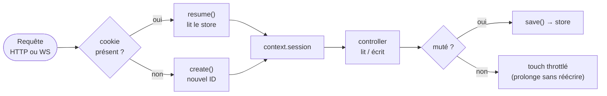
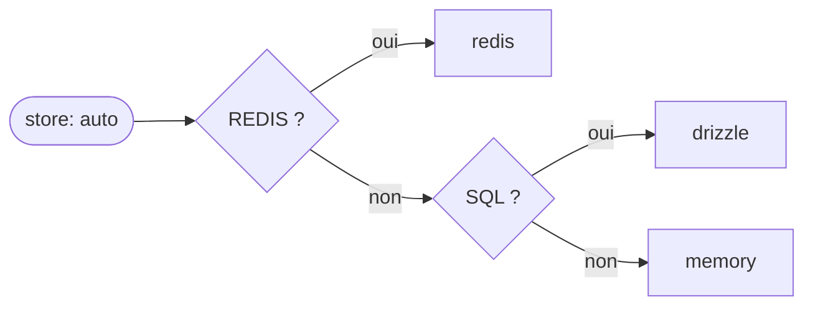

# Sessions

> HTTP est sans mémoire : chaque requête arrive « anonyme ». Une session recolle ces requêtes à un
> même utilisateur, via un identifiant opaque porté par un cookie, l'état vivant côté serveur. Nodefony
> partage la même session entre HTTP et WebSocket, avec des garde-fous de sécurité par défaut. Chaque
> fait ci-dessous est ancré sur le code.

## Schéma général



## Lexique

| Terme             | Sens                                                                                                                  |
| ----------------- | --------------------------------------------------------------------------------------------------------------------- |
| Session           | État serveur associé à un utilisateur, retrouvé de requête en requête via un identifiant.                             |
| ID de session     | Chaîne opaque aléatoire (32 octets CSPRNG → base64url) qui indexe la session ; portée par le cookie.                  |
| Store (storage)   | Le backing qui persiste les sessions : `memory`, `redis`, `drizzle` (SQL), `mongoose` (MongoDB).                      |
| Cookie `HttpOnly` | Inaccessible à `document.cookie` (JS) → limite le vol par XSS.                                                        |
| Cookie `Secure`   | Envoyé uniquement sur HTTPS/WSS.                                                                                      |
| Préfixe `__Host-` | Préfixe de nom de cookie imposant `Secure` + `Path=/` + pas de `Domain` (anti-fixation cross-subdomain, RFC 6265bis). |
| Session fixation  | Attaque : forcer la victime à utiliser un ID de session connu de l'attaquant.                                         |
| Session hijacking | Vol de l'ID/cookie pour usurper la session.                                                                           |
| Idle timeout      | Expiration après une période d'**inactivité**.                                                                        |
| Absolute timeout  | Âge **maximum** d'une session, jamais prolongé (borne un ID volé).                                                    |
| Touch / rolling   | Prolongation de la fenêtre d'inactivité à chaque requête active.                                                      |
| `ref`             | Empreinte HMAC-SHA256 tronquée de l'ID, **non réversible** — l'admin manipule la `ref`, jamais l'ID.                  |
| CSPRNG            | Générateur d'aléa cryptographiquement sûr.                                                                            |
| GC                | Garbage collection : purge des sessions expirées, hors chemin chaud.                                                  |

## Qu'est-ce qu'une session — et quelles failles elle encadre

Sans session, un utilisateur devrait re-prouver son identité à **chaque** requête. La session résout
ça : après connexion, le serveur garde l'état et le client ne présente qu'un **identifiant opaque**.
Cet identifiant est une cible : trois attaques classiques, trois garde-fous par défaut dans Nodefony.

- **Vol de cookie (hijacking)** → `HttpOnly` (hors de portée du JS/XSS), `Secure` (jamais en clair),
  préfixe `__Host-` sur TLS.
- **Fixation** (l'attaquant impose un ID connu) → `strictMode` (défaut `true`) : un ID **inconnu du
  store** est rejeté et une nouvelle session est créée (`src/session/session.ts:189-194`).
- **Exploitation d'un ID volé mais session inactive** → **absolute timeout** (âge max, jamais
  prolongé — `session.ts:377-390`) en plus de l'idle timeout.

## La vision Nodefony

Le cookie ne transporte **que l'ID opaque** ; toutes les données vivent dans un store côté serveur
(`session.ts:20-25,162-163`). L'ID est généré par CSPRNG (32 octets → base64url, `session.ts:54-55`).
Côté administration, l'ID brut **ne sort jamais** : on manipule une `ref` = HMAC-SHA256 tronqué, non
réversible (`service/sessions/sessions-service.ts:100-103`, `interfaces/ISession.ts:48-65`).

Surtout, la session est **activée à un seul point du pipeline**, commun à HTTP et WebSocket
(`ISession.ts:9-16`) : `context.session` existe à l'identique pour les deux transports
(`sessions-service.ts:379-384`), et l'activité **HTTP ou WS** prolonge la même session
(`session.ts:410-414`). C'est le différenciateur du framework appliqué à la session : un seul modèle
d'état pour le web et le temps réel.

## Démarrage rapide

Lire et écrire la session depuis un contrôleur (HTTP comme WS) :

```typescript
import {
  Controller,
  controller,
  Get,
  Post,
  Session,
  Body,
} from "@nodefony/framework";
import type { Session as HttpSession } from "@nodefony/http";

@controller("/account")
class AccountController extends Controller {
  @Get("/me")
  async me(@Session() session: HttpSession) {
    return this.renderJson({ userId: session.get("userId") ?? null });
  }

  @Post("/preferences")
  async save(@Session() session: HttpSession, @Body() body: { theme: string }) {
    session.set("theme", body.theme); // marque la session « mutée »
    return this.renderJson({ ok: true }); // save() écrit le store en fin de requête
  }
}
```

Ce qu'il se passe : au premier `set`, la session devient _mutée_ → un `Set-Cookie` est émis et le blob
est écrit dans le store en fin de requête (`session.ts:219-223,254-278`). Une requête qui ne fait que
**lire** n'écrit rien (dirty-tracking) — au plus un _touch_ throttlé prolonge l'inactivité sans
réécrire les données (`session.ts:421-450`).

## Architecture interne — cycle de vie

`start()` est le point d'activation : cookie présent → `resume()` (lecture store), sinon `create()`
(`session.ts:144-171`). En fin de requête, `save()` n'écrit **que si muté** et jamais en `readOnly`
(`session.ts:254-278`). `destroy()` remet `mutated=false` pour éviter que le save de fin de requête ne
**ressuscite** une session détruite (`session.ts:300-313`), et un `RevocationGuardStorage` enveloppe
tout store pour bloquer une session révoquée (`sessions-service.ts:278-279`). Le GC des sessions
expirées tourne **hors hot-path** via un `GcScheduler` (démarré à `onReady`, stoppé à `onTerminate` —
`sessions-service.ts:284-313,470-479`).

## Configuration (schéma Zod = source des défauts)

Bloc `session` / `cookie` : `src/packages/@nodefony/http/nodefony/config/config.ts:706-816`.

| Option              | Type    | Défaut       | Effet                                                                           |
| ------------------- | ------- | ------------ | ------------------------------------------------------------------------------- |
| `strictMode`        | bool    | `true`       | Rejette un ID de session inconnu (crée une nouvelle session) — anti-fixation.   |
| `name`              | string  | `"nodefony"` | Nom du cookie (préfixé `__Host-` sur TLS selon `cookie.hostPrefix`).            |
| `store`             | string  | `"auto"`     | Backing (voir résolution ci-dessous).                                           |
| `idleTimeoutS`      | int     | `1800`       | Expiration après inactivité (30 min) — NIST SP 800-63B / OWASP.                 |
| `absoluteTimeoutS`  | int     | `43200`      | Âge max (12 h), jamais prolongé — borne un identifiant volé.                    |
| `gcIntervalS`       | int ≥ 0 | `600`        | Purge des sessions expirées (hors hot-path). `0` = timer désarmé.               |
| `gcJitter`          | bool    | `true`       | Étale le départ du GC par process (anti _thundering-herd_).                     |
| `refererCheck`      | bool    | `false`      | Lie la session à l'hôte (défense en profondeur).                                |
| `cookie.maxAge`     | int     | `0`          | `0` = cookie de session (fermé avec le navigateur).                             |
| `cookie.httpOnly`   | bool    | `true`       | Inaccessible via JS (`document.cookie`) — anti-XSS.                             |
| `cookie.secure`     | bool    | `true`       | Envoyé sur TLS uniquement.                                                      |
| `cookie.signed`     | bool    | `false`      | Signe le cookie avec le secret HMAC du kernel.                                  |
| `cookie.hostPrefix` | enum    | `"auto"`     | `__Host-` : `auto` (appliqué sur https/wss) \| `true` \| `false` — RFC 6265bis. |

### Comment `store: "auto"` se résout au boot



`auto` suit l'infra déjà déclarée : cache Redis > base de données (drizzle) > `memory`
(`sessions-service.ts:238-251`). Un `store` explicite inconnu **avorte le boot en prod**, et se replie
sur `memory` en dev (annoncé) — `sessions-service.ts:252-273`.

## Entité de persistance

**Drizzle** — table `session` (`@nodefony/drizzle/nodefony/entity/sessionEntity.ts:25-36`), types
traduits par dialecte (`:16-24`) :

| Colonne      | Type logique | SQLite           | PostgreSQL | MySQL     | Rôle                         |
| ------------ | ------------ | ---------------- | ---------- | --------- | ---------------------------- |
| `session_id` | text (PK)    | `text`           | `text`     | `varchar` | Identifiant opaque.          |
| `Attributes` | json         | `text mode:json` | `jsonb`    | `json`    | Données applicatives.        |
| `flashBag`   | json         | `text mode:json` | `jsonb`    | `json`    | Messages « one-shot ».       |
| `metaBag`    | json         | `text mode:json` | `jsonb`    | `json`    | Métadonnées internes.        |
| `user`       | text (null)  | `text`           | `text`     | `text`    | Propriétaire (nullable).     |
| `createdAt`  | epochMs      | `integer` 64-bit | `bigint`   | `bigint`  | Création (absolute timeout). |
| `updatedAt`  | epochMs      | `integer` 64-bit | `bigint`   | `bigint`  | Dernière activité (idle).    |

**Mongoose** — schéma équivalent (`@nodefony/mongoose/nodefony/entity/sessionEntity.ts:16-24`) :
`session_id` (String, index unique), `Attributes`/`flashBag`/`metaBag` (Object, défaut `{}`), `user`
(String, défaut `null`), `createdAt`/`updatedAt` (Number, ms).

## Dialectes / bases pris en charge

Contrairement à l'idempotence, la session est portée par **tous** les backends — **4 backends** :

| Backing         | Base / dialecte                   | Atomicité / expiration                                                                                                   |
| --------------- | --------------------------------- | ------------------------------------------------------------------------------------------------------------------------ |
| `memory`        | RAM du pod                        | Per-pod ; GC applicatif.                                                                                                 |
| `redis`         | Redis                             | `SET … EX` = idle glissant natif ; `touch`=`EXPIRE` (`@nodefony/redis/nodefony/src/SessionStorage.ts:109-175`).          |
| `drizzle` (SQL) | SQLite, **PostgreSQL**, **MySQL** | UPSERT `ON CONFLICT` atomique ; GC 2 `DELETE` idle+absolute (`@nodefony/drizzle/nodefony/src/SessionStorage.ts:97-204`). |
| `mongoose`      | MongoDB                           | `findOneAndUpdate upsert` ; GC `$lt` (`@nodefony/mongoose/nodefony/src/SessionStorage.ts:99-166`).                       |

L'absolute timeout est honoré **à la lecture** même quand le store n'a qu'un TTL glissant (cas Redis).

## Sécurité

Résumé des garde-fous, tous par défaut : `HttpOnly`+`Secure`+`__Host-` (anti-vol/fixation),
`strictMode` (rejet d'ID inconnu), **idle** (30 min) **et absolute** (12 h) timeouts (NIST SP
800-63B / OWASP), `destroy()` anti-résurrection, `RevocationGuardStorage` (révocation immédiate),
`ref` HMAC non réversible côté admin. La régénération d'ID post-authentification (`regenerateId()`,
renouvelle le secret en conservant l'état) **existe comme point d'extension mais n'est pas encore
câblée dans le flux d'auth** (`session.ts:230-245`).

> [!IMPORTANT]
> Le cookie **ne chiffre pas** les données : il ne porte qu'un identifiant opaque, l'état reste côté
> serveur. La sécurité repose donc sur la protection du cookie (flags ci-dessus) et sur le store, pas
> sur un secret embarqué dans le cookie.

## Performance & mémoire

Objet session léger : trois sacs `{}` alloués à plat, dirty-tracking → **0 écriture** si la session
n'est pas mutée (`session.ts:266-268`). Le _touch_ est throttlé (au plus une écriture par demi-vie
d'inactivité, `session.ts:443-447`). Le GC est sorti du hot-path (fin du modèle probabiliste façon
PHP, `sessions-service.ts:361-363`). Les listes admin sont bornées (`SCAN_PAGE=200`, jamais plus d'une
page en RAM, `sessions-service.ts:67-92`).

> [!NOTE]
> Les sacs sont des objets **littéraux** et non `Object.create(null)` : c'est volontaire — `drizzle-orm`
> déréférence le prototype via `is()` (`session.ts:95-98`).

## Observabilité — Studio

La page **Sessions** de Studio (`@nodefony/studio/frontend/src/routes/sessions/`) liste les sessions
vivantes (par `ref`, jamais l'ID brut) et permet la **révocation** — unitaire ou en masse (boucle sur
l'endpoint idempotent). Le data plane pagine via le contrat `listPage` du store.

## Normes appliquées

- **RFC 6265bis** : cookies `SameSite`/préfixes `__Host-`/`__Secure-` — appliqué via `cookie.hostPrefix`
  (`config.ts:730-738`).
- **NIST SP 800-63B / OWASP** : idle + absolute timeouts (`config.ts:783-806`, `session.ts:377-404`).
- **OWASP Session Management** : `HttpOnly`, `Secure`, anti-fixation, révocation.

## Pièges (symptôme → cause → correction)

| Symptôme                                        | Cause                                               | Correction                                                           |
| ----------------------------------------------- | --------------------------------------------------- | -------------------------------------------------------------------- |
| Une session détruite « revient » après logout   | Le save de fin de requête ré-écrit un blob supprimé | `destroy()` remet `mutated=false` (déjà géré) — ne pas remuter après |
| Session qui n'expire jamais malgré l'inactivité | `touch` mal compris comme un save systématique      | Le touch est throttlé + l'absolute borne l'âge                       |
| Store explicite ignoré                          | Nom de store inconnu                                | Prod : boot avorté ; dev : repli `memory` annoncé                    |
| Dédup/liste incomplète en Redis                 | `SCAN COUNT` n'est pas un plafond                   | Curseur composite `<skip>:<curseur>` (déjà géré)                     |
| 500 au shutdown de l'ORM en vol                 | Repo indisponible pendant l'arrêt                   | Dégradation gracieuse (`repo()` → `null`)                            |

## Tests

Types de tests présents pour la brique :

| Type                  | Où                                                                                                                                                         |
| --------------------- | ---------------------------------------------------------------------------------------------------------------------------------------------------------- |
| Unitaires             | `http/tests/unit/Session.test.ts`, `MemorySessionStorage.test.ts`, `session-pagination.test.ts`, `SessionsAdmin.test.ts`                                   |
| **Test d'attaque**    | `http/tests/unit/session-timeout.attack.test.ts` (exploitation d'un ID au-delà des timeouts)                                                               |
| Intégration           | `http/tests/integration/session-revocation.test.ts` ; stores `redis`/`mongoose`/`drizzle`                                                                  |
| **E2E** (base réelle) | `@nodefony/drizzle` : `session-store-postgres.e2e.test.ts`, `session-store-mysql.e2e.test.ts`                                                              |
| **Charge / mémoire**  | `http/tests/load/session-load.test.ts` — drainage des scopes + heap après 200 sessions / 100 WS open-close (anti-fuite, BUG-004 ; **serveur live requis**) |
| WebSocket             | `http/tests/websockets/websocket-session.test.ts`                                                                                                          |
| **Bancs de contrat**  | `tests/support/sessionStoreContract.ts` + `sessionPaginationContract.ts` (invariants tenus par **tous** les stores)                                        |

Skills de test/exploitation : `nodefony-load-test` (rejouer/étendre la charge), `nodefony-check-memory-health`
(mémoire), `nodefony-security-review` (fixation/timeouts).

**Couverture** : `npm run coverage` dans `@nodefony/http` (vitest, reporter `json-summary` →
`.coverage/`). Régénérable — le % courant vit dans le rapport vitest (et la carte de couverture de
l'aperçu HTML), **jamais figé** dans ce Markdown.

## Pour aller plus loin

- Le contexte partagé HTTP/WS → `src/packages/@nodefony/http/docs/`
- Stores distribués → `src/packages/@nodefony/redis/docs/` · `src/packages/@nodefony/drizzle/docs/`
- Guide pratique → [session-storage](../../docs/guides/session-storage.md)
- Vue d'ensemble → [vue-ensemble](../../docs/architecture/vue-ensemble.md)
