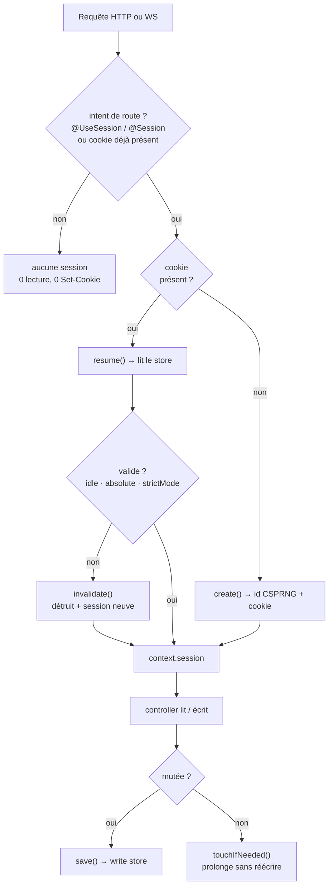
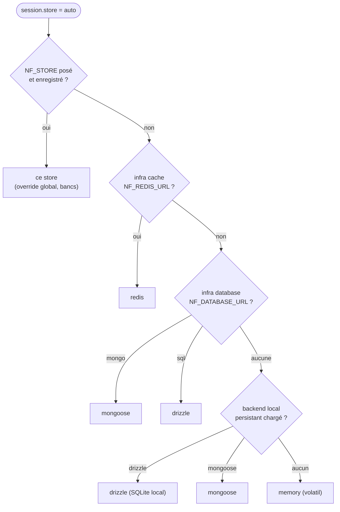
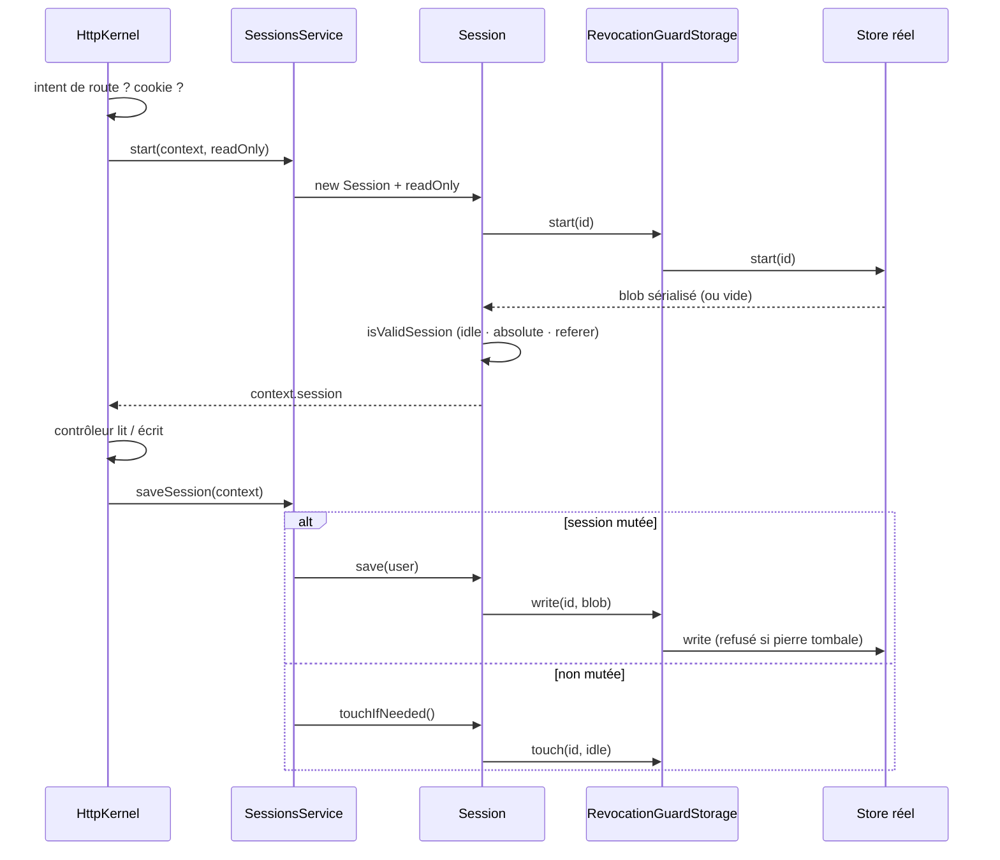

# Sessions — l'état serveur qui recolle les requêtes

> HTTP n'a pas de mémoire : chaque requête arrive anonyme. Une session recolle ces requêtes à un même
> utilisateur au moyen d'un **identifiant opaque** porté par un cookie, tout l'état restant côté
> serveur. Nodefony fait vivre **la même session en HTTP et en WebSocket**, ne l'ouvre que si une route
> la demande, et applique par défaut les deux bornes de temps NIST/OWASP. Chaque fait de cette page est
> ancré sur le code.

📍 [Documentation](../../../../../docs/index.md) › [@nodefony/http](index.md) › **Sessions**

## 🧠 Le modèle mental — un ticket de vestiaire, pas un coffre

Le cookie de session est un **ticket de vestiaire** : un numéro, rien d'autre. Il ne contient pas ton
manteau, il permet juste de le retrouver. Le vestiaire — le _store_ — est côté serveur.

Trois conséquences que tout le reste de la page décline :

1. **Voler le ticket suffit** pour repartir avec le manteau → le ticket se protège (`HttpOnly`,
   `Secure`, `__Host-`) et se **périme** (idle + absolute).
2. **Le vestiaire peut déchirer un ticket** à tout moment → la révocation est immédiate et centrale,
   pas une négociation avec le client.
3. **Le contenu ne voyage jamais** → un cookie Nodefony ne porte ni données, ni jeton signé, ni JWT.



Le point d'activation est **unique et commun aux deux transports** : `HttpKernel.startSession()`
(`http-kernel.ts:1131`). Il commence par la garde paresseuse `if (!intent && !context.hasSession())`
(`http-kernel.ts:1061`) — sans intent de route ni cookie entrant, **aucune session n'est ouverte**.

## 📖 Lexique

| Terme             | Sens                                                                                                   |
| ----------------- | ------------------------------------------------------------------------------------------------------ |
| Session           | État serveur associé à un visiteur, retrouvé de requête en requête via un identifiant.                 |
| ID de session     | Chaîne opaque aléatoire (32 octets CSPRNG → base64url, 43 caractères) qui indexe la session.           |
| Store             | Le backend qui persiste les sessions : `memory`, `drizzle` (SQL), `redis`, `mongoose` (MongoDB).       |
| Intent            | Déclaration d'une route qui veut une session (`@UseSession` ou un paramètre `@Session`).               |
| CSPRNG            | Générateur d'aléa **cryptographiquement sûr** (`node:crypto` `randomBytes`) — non devinable.           |
| HMAC              | Code d'authentification de message à clé — ici pour dériver une référence publique non réversible.     |
| `ref`             | Pseudonyme public d'une session, `HMAC-SHA256(secret, id)` tronqué, préfixé `sess_`. Jamais l'ID brut. |
| Cookie `HttpOnly` | Inaccessible à `document.cookie` → hors de portée d'un script injecté (XSS).                           |
| Cookie `Secure`   | Envoyé uniquement sur HTTPS/WSS.                                                                       |
| Préfixe `__Host-` | Préfixe de nom imposant `Secure` + `Path=/` + interdisant `Domain` (RFC 6265bis §4.1.3).               |
| `SameSite`        | Attribut limitant l'envoi du cookie depuis un site tiers (défaut Nodefony : `Lax`).                    |
| Session fixation  | Attaque : forcer la victime à utiliser un identifiant de session connu de l'attaquant.                 |
| Session hijacking | Vol de l'identifiant/cookie pour usurper la session.                                                   |
| Idle timeout      | Expiration après une période d'**inactivité** (glissante).                                             |
| Absolute timeout  | Âge **maximum** depuis la création, jamais prolongé — borne un identifiant volé.                       |
| Touch             | Prolongation de la fenêtre d'inactivité **sans réécrire** les données.                                 |
| Dirty-tracking    | Suivi « la session a-t-elle été mutée ? » — décide s'il faut écrire dans le store.                     |
| GC                | _Garbage collection_ : purge périodique des sessions expirées, hors chemin de requête.                 |
| TTL               | _Time To Live_ : durée de vie native d'une clé (Redis `SET … EX`).                                     |
| UPSERT            | `INSERT … ON CONFLICT DO UPDATE` — écriture atomique « crée ou met à jour ».                           |
| BFF               | _Backend-For-Frontend_ : le serveur gère session et jetons pour le front web.                          |
| ALS               | `AsyncLocalStorage` — propage l'identité/le contexte à travers les appels asynchrones.                 |
| IDOR              | _Insecure Direct Object Reference_ : accéder à l'objet d'autrui en changeant un identifiant.           |
| XSS               | _Cross-Site Scripting_ : exécution de script injecté dans la page de la victime.                       |
| NIST SP 800-63B   | Référentiel d'identité numérique du NIST — impose des bornes de session.                               |
| OWASP             | Fondation de sécurité applicative ; ici le _Session Management Cheat Sheet_.                           |

## Qu'est-ce qu'une session — et quelles failles elle encadre

Sans session, un utilisateur devrait re-prouver son identité à **chaque** requête (retaper son mot de
passe pour chaque clic). La session résout ça : après connexion, le serveur garde l'état et le client
ne présente plus qu'un **identifiant opaque**.

Cet identifiant devient donc une cible. Trois attaques classiques, trois garde-fous **actifs par
défaut** dans Nodefony :

- **Vol du cookie (hijacking).** Un script injecté (XSS) ou un réseau en clair capte le cookie et
  rejoue la session. → `HttpOnly` et `Secure` sont à `true` par défaut (`sessionCookieSchema`,
  `config.ts:718-725`), et le nom du cookie prend le préfixe `__Host-` dès que le transport est TLS
  (`Context.getSessionCookieName()`, `Context.ts:714`).
- **Fixation.** L'attaquant pose lui-même un identifiant dans le navigateur de la victime, attend
  qu'elle se connecte, puis réutilise **le même** identifiant. → double défense : `strictMode` rejette
  tout identifiant inconnu du store (`Session.resume()`, `session.ts:189`), et le login **régénère**
  l'identifiant (`AuthFlow` — voir plus bas).
- **Exploitation prolongée d'un identifiant volé.** Une session maintenue artificiellement vivante
  resterait exploitable indéfiniment. → l'**absolute timeout** borne l'âge depuis la création et n'est
  **jamais** prolongé (`Session.isValidSession()`, `session.ts:381`), en plus de l'idle timeout.

> [!IMPORTANT]
> Le cookie **ne chiffre rien** et n'a pas à le faire : il ne porte qu'un numéro. La sécurité repose
> sur la protection du cookie (les attributs ci-dessus), sur l'imprévisibilité de l'identifiant
> (32 octets CSPRNG) et sur le store — jamais sur un secret embarqué côté client.

## La vision Nodefony

Quatre partis pris, chacun vérifiable dans le code.

**1. Le cookie ne transporte que l'identifiant.** `Session.getSession()` lit la **valeur brute** du
cookie, sans déchiffrement (`session.ts:160`) ; l'identifiant vient de `Session.generateId()`
(`session.ts:226`). Modèle BFF : le web reste sur un cookie opaque, le JWT est réservé aux API et aux
agents (voir [Firewall](../../security/docs/firewall.md)).

**2. La session est paresseuse.** Elle n'existe que si une route la demande — `@UseSession`, ou la
seule présence d'un paramètre `@Session` — ou si un cookie arrive déjà : c'est la garde de
`HttpKernel.startSession()` (`http-kernel.ts:1131`). Une route publique ne paie **ni lecture de store,
ni `Set-Cookie`**.

**3. Un seul modèle d'état pour le web et le temps réel.** Le même `startSession()` sert
`HttpKernel.onRequestEnd()` (`http-kernel.ts:1391`) et `HttpKernel.onConnect()` (`http-kernel.ts:1659`) ;
l'activité HTTP **ou** WS prolonge la même session (`Session.touchIfNeeded()`, `session.ts:421`).

**4. L'administration ne voit jamais un identifiant.** Un opérateur manipule une `ref`, HMAC tronqué
non réversible produit par `computeSessionRef()` (`sessions-service.ts:100`) — comme la liste
« appareils connectés » de GitHub ou Google montre une référence, jamais le jeton.

Compromis assumé : l'état serveur suppose un store **partagé** dès qu'on passe à plusieurs pods
(`redis`/`drizzle`/`mongoose`) ; `memory` reste per-pod.

## 🚀 Démarrage rapide

Dans une app générée par `nodefony create app`, la session est déjà configurée avec des défauts sûrs.
Voici le chemin complet : configurer, écrire un contrôleur, observer.

### 1. Déclarer le store (facultatif — `auto` fait déjà le bon choix)

```typescript
// nodefony.config.ts — extrait
export default defineConfig(() => ({
  modules: [
    use("@nodefony/http", {
      session: {
        // "auto" (défaut) suit l'infra déclarée. On peut nommer le store :
        store: "drizzle",
        name: "monapp", // nom du cookie (préfixé __Host- sur TLS)
        idleTimeoutS: 1800, //  30 min d'inactivité  (NIST/OWASP)
        absoluteTimeoutS: 43200, //  12 h d'âge max, jamais prolongé
        cookie: { httpOnly: true, secure: true, hostPrefix: "auto" },
      },
    }),
    "@nodefony/framework",
    "@nodefony/drizzle", // fournit le store `drizzle` (il s'auto-enregistre)
  ],
}));
```

### 2. Écrire le contrôleur qui lit et écrit la session

```typescript
// nodefony/controllers/CartController.ts — complet, compile tel quel
import {
  Controller,
  controller,
  Get,
  Post,
  Delete,
  Session,
  Body,
  UseSession,
} from "@nodefony/framework";
import type { Session as HttpSession } from "@nodefony/http";

@controller("/panier")
class CartController extends Controller {
  // Lecture seule : la session est reprise mais JAMAIS réécrite (0 write store).
  @UseSession({ readOnly: true })
  @Get("/")
  async show(@Session() session: HttpSession) {
    return this.renderJson({ items: session.get("items") ?? [] });
  }

  // Le paramètre @Session suffit à déclarer l'intent : pas besoin de @UseSession.
  @Post("/ajouter")
  async add(@Session() session: HttpSession, @Body() body: { sku: string }) {
    const items = (session.get("items") as string[] | null) ?? [];
    items.push(body.sku);
    session.set("items", items); // marque la session « mutée » (dirty)
    session.setFlashBag("notice", `${body.sku} ajouté`); // lu UNE fois, puis effacé
    return this.renderJson({ count: items.length }); // save() écrit en fin de requête
  }

  @Delete("/")
  async clear(@Session() session: HttpSession) {
    await session.destroy(true); // détruit l'entrée store + efface le cookie
    return this.renderJson({ ok: true });
  }
}

export default CartController;
```

### 3. La même session en WebSocket

Aucune API différente : le même décorateur, sur une route WebSocket.

```typescript
// nodefony/controllers/LiveController.ts — complet, compile tel quel
import { Controller, controller, route, UseSession } from "@nodefony/framework";
import type { WebsocketContext } from "@nodefony/http";

@controller("/live")
class LiveController extends Controller {
  @route("live-panier", {
    path: "/panier",
    requirements: { methods: ["WEBSOCKET"] },
  })
  @UseSession() // session ouverte AU HANDSHAKE, réutilisée par toutes les frames
  async panier(message: string | Buffer | null) {
    const ws = this.context as WebsocketContext | undefined;
    const items = (this.session?.get("items") as string[] | null) ?? [];
    ws?.send(JSON.stringify({ items, echo: message?.toString() ?? null }));
  }
}

export default LiveController;
```

### 4. Ce qu'on observe

```bash
# 1) Route SANS intent de session → aucun Set-Cookie (activation paresseuse)
curl -si https://localhost:5152/ -k | grep -ci 'set-cookie'
# 0

# 2) Première écriture → création de la session + cookie durci
curl -sik -c /tmp/jar -H 'Content-Type: application/json' \
  -d '{"sku":"NF-1"}' https://localhost:5152/panier/ajouter | grep -i set-cookie
# Set-Cookie: __Host-monapp=Yk9t…43-caracteres-base64url…; Path=/; HttpOnly; Secure; SameSite=Lax

# 3) Rejouer avec le cookie → l'état est retrouvé
curl -sk -b /tmp/jar https://localhost:5152/panier
# {"items":["NF-1"]}

# 4) Une simple lecture n'écrit RIEN dans le store (dirty-tracking + touch throttlé)
```

Le cookie obtenu porte `__Host-`, `HttpOnly`, `Secure`, `SameSite=Lax`, `Path=/` et **aucun** `Domain` :
c'est exactement ce qu'assert le banc d'intégration `session-runtime` (« Set-Cookie de session sur TLS »).
Sur un transport en clair (port 5151), le préfixe `__Host-` est omis — le navigateur le rejetterait
faute de `Secure` (`Context.getSessionCookieName()`, `Context.ts:714`).

## ⚙️ Configuration

Source unique des défauts : le schéma Zod `sessionSchema` (`config.ts:761`) et son sous-schéma
`sessionCookieSchema` (`config.ts:727`).

| Option              | Type    | Défaut       | Effet                                                                             |
| ------------------- | ------- | ------------ | --------------------------------------------------------------------------------- |
| `store`             | string  | `"auto"`     | Backend de persistance — voir la résolution ci-dessous (`config.ts:755`).         |
| `name`              | string  | `"nodefony"` | Nom du cookie, préfixé `__Host-` selon `cookie.hostPrefix` (`config.ts:750`).     |
| `strictMode`        | bool    | `true`       | Un identifiant inconnu du store est rejeté → session neuve (anti-fixation).       |
| `idleTimeoutS`      | int ≥ 0 | `1800`       | Inactivité max (30 min). `0` = pas d'expiration par inactivité (`config.ts:796`). |
| `absoluteTimeoutS`  | int ≥ 0 | `43200`      | Âge max depuis la création (12 h), **jamais** prolongé. `0` = désactivé.          |
| `gcIntervalS`       | int ≥ 0 | `600`        | Période de purge des sessions expirées, hors requête. `0` = timer désarmé.        |
| `gcJitter`          | bool    | `true`       | Décale le départ du GC par process (anti _thundering herd_ sur un store partagé). |
| `refererCheck`      | bool    | `false`      | Lie la session à l'hôte de création (défense en profondeur, `session.ts:366`).    |
| `cookie.maxAge`     | int ≥ 0 | `0`          | `0` = cookie de session (effacé à la fermeture du navigateur).                    |
| `cookie.httpOnly`   | bool    | `true`       | Inaccessible depuis JavaScript — anti-XSS.                                        |
| `cookie.secure`     | bool    | `true`       | Envoyé sur TLS uniquement.                                                        |
| `cookie.signed`     | bool    | `false`      | Signe le cookie avec le secret HMAC du kernel.                                    |
| `cookie.hostPrefix` | enum    | `"auto"`     | `__Host-` : `auto` (sur TLS) \| `true` (toujours) \| `false` (jamais).            |

`SameSite` n'est pas dans ce bloc : il vient des options de cookie génériques, dont le défaut est
`Lax` (`defaultCookieOptions`, `cookie.ts:48`).

> [!WARNING]
> `idleTimeoutS: 0` **et** `absoluteTimeoutS: 0` désactivent les deux bornes : une session ne meurt
> alors plus jamais côté serveur. Le banc d'attaque `session-timeout.attack.test.ts` verrouille les
> défauts NIST (« défauts NIST actifs — idle 1800, absolute 43200 ») justement pour qu'un changement
> silencieux se voie.

### Comment `store: "auto"` se résout au boot

`auto` n'est pas un store : c'est une sentinelle résolue une fois, au boot, par `resolveAutoStore()`
(`config/infra.ts:241`), puis journalisée. Elle suit **l'infra que tu as déclarée**, bornée aux stores
réellement enregistrés (`SessionsService.initializeStorage()`, `sessions-service.ts:231`).



Deux comportements à connaître :

- **Sans aucune infra déclarée, on ne tombe pas en `memory`** : si `@nodefony/drizzle` est chargé, la
  session persiste en SQLite local — tes données survivent au redémarrage sans une ligne de config
  (`infra.ts:288`).
- **Un `store` explicite inconnu ne dégrade pas en silence** : en production le boot est **avorté**, en
  développement il y a repli `memory` **annoncé** en WARNING (`sessions-service.ts:252-273`).

## 🗂️ Choisir son store

Le contrat est unique — `ISessionStorage` (`ISession.ts:127`) — et **tous** les backends le portent.
Ce qui change, c'est la topologie et la façon d'expirer.

| Store      | Où vit l'état         | Multi-pod | Expiration idle            | `total` admin | Quand le choisir                             |
| ---------- | --------------------- | :-------: | -------------------------- | :-----------: | -------------------------------------------- |
| `memory`   | RAM du process        |    non    | GC applicatif              |     exact     | tests, CI, bancs de charge                   |
| `drizzle`  | SQL (SQLite/PG/MySQL) |   oui¹    | GC applicatif (2 DELETE)   |     exact     | défaut persistant, mono ou multi-nœud        |
| `redis`    | Redis                 |    oui    | **TTL natif** (`SET … EX`) | inconnu (-1)  | forte charge, cluster, sessions volumineuses |
| `mongoose` | MongoDB               |    oui    | GC applicatif (`$lt`)      |     exact     | pile déjà MongoDB                            |

¹ multi-pod dès que la base est partagée (PostgreSQL/MySQL) ; en SQLite local, mono-nœud.

### `memory` — l'implémentation de référence

Store built-in de `@nodefony/http`, enregistré d'office (`sessions-service.ts:860`). Les sessions vivent
dans une `Map` du process : elles **disparaissent au redémarrage** et ne sont **pas partagées** entre
pods — c'est un choix (mesurer le framework sans le goulot disque/SQL), pas une limite.

Il porte quand même **toute** la sémantique du contrat : `createdAt` figé à la création, `updatedAt`
rafraîchi par `MemorySessionStorage.touch()` (`MemorySessionStorage.ts:87`), purge sur les deux bornes
par `gc(idleSeconds, absoluteSeconds)` (`MemorySessionStorage.ts:99`), pagination offset à `total` exact
et tri déterministe (`MemorySessionStorage.listPage()`, `MemorySessionStorage.ts:161`).

### `drizzle` — SQL, le défaut persistant

Une table `session`, une ligne par session, écrite en **UPSERT atomique** (`INSERT … ON CONFLICT DO
UPDATE … RETURNING`) : une seule requête, aucune course entre insertion et mise à jour
(`@nodefony/drizzle/nodefony/src/SessionStorage.ts:124`). Le `touch` est un simple
`UPDATE updatedAt` sur la clé primaire, sans réécrire le blob
(`@nodefony/drizzle/nodefony/src/SessionStorage.ts:196`).

Le GC supprime en **deux `DELETE` distincts** — idle puis absolute — plutôt qu'un `$or`, pour rester
portable sur tous les adaptateurs `orm-core`
(`@nodefony/drizzle/nodefony/src/SessionStorage.ts:166-188`). La pagination est native
(`LIMIT`/`OFFSET` + `COUNT`), ordonnée `updatedAt DESC` puis `session_id ASC` pour rester déterministe
à horodatage égal (`@nodefony/drizzle/nodefony/src/SessionStorage.ts:252`).

Détail à connaître : une session anonyme est stockée `user = NULL`, pas chaîne vide — le filtre le
traduit (`$null`) au lieu de chercher `""` (`@nodefony/drizzle/nodefony/src/SessionStorage.ts:258-261`).

### `redis` — TTL natif, zéro balayage

Ici l'expiration **idle** est portée par Redis lui-même : `SET … EX` pose le TTL à chaque écriture
(`@nodefony/redis/nodefony/src/SessionStorage.ts:137`) et `touch` le repositionne par un `EXPIRE` O(1)
(`@nodefony/redis/nodefony/src/SessionStorage.ts:166`). Conséquence : `gc()` est un **no-op assumé**
(`@nodefony/redis/nodefony/src/SessionStorage.ts:168`) — aucun balayage périodique.

L'absolute timeout, lui, n'est pas exprimable par un TTL glissant : il reste honoré **à la lecture**
par `Session.isValidSession()` (`session.ts:381`). Une entrée trop vieille peut donc survivre côté
Redis jusqu'à son TTL idle, mais elle est **refusée à la reprise**.

Capacités réduites, annoncées et non simulées : la pagination est **par curseur** (pas de `total`, pas
d'ordre global) et `countSessions()` renvoie **`-1`** = « je ne sais pas »
(`@nodefony/redis/nodefony/src/SessionStorage.ts:318`). L'appelant affiche l'inconnu, il ne l'invente pas.

### `mongoose` — MongoDB, parité de comportement

Même sémantique que le store SQL : `findOneAndUpdate({ upsert: true })` en une passe
(`@nodefony/mongoose/nodefony/src/SessionStorage.ts:102`), `touch` en `updateOne`
(`@nodefony/mongoose/nodefony/src/SessionStorage.ts:174`), GC en deux suppressions `$lt`
(`@nodefony/mongoose/nodefony/src/SessionStorage.ts:144-166`). Les horodatages sont des **nombres**
(epoch ms) et non des `Date` Mongo, précisément pour que le store reste interchangeable avec Drizzle.

> [!TIP]
> Ces quatre backends ne sont pas « à peu près » compatibles : leurs invariants communs sont exécutés
> par un **banc de contrat partagé** (`sessionStoreContract.ts` et `sessionPaginationContract.ts`),
> importé par chaque adaptateur. Un écart de comportement devient un test rouge, pas une surprise en
> production.

## 🏗️ Architecture interne — le cycle de vie



**Reprise ou création.** `Session.start()` (`session.ts:144`) délègue à `getSession()` : cookie présent
→ `resume()` (`session.ts:177`), sinon `create()` (`session.ts:204`) qui tire un identifiant CSPRNG,
pose le cookie et marque la session à persister.

**Validation à la reprise.** `Session.isValidSession()` (`session.ts:365`) applique dans l'ordre le
`refererCheck` (si activé), l'**absolute** (âge depuis `created`, `session.ts:381`), puis l'**idle**
(depuis `updated`, `session.ts:394`). Échec → `invalidate()` (`session.ts:284`) détruit l'entrée et
recrée une session vierge.

**Écriture minimale.** `SessionsService.saveSession()` (`sessions-service.ts:414`) n'écrit **que** si la
session est `dirty` et non `readOnly` ; sinon il appelle `Session.touchIfNeeded()` (`session.ts:421`),
qui prolonge l'idle **sans réécrire le blob**, et seulement au-delà d'une demi-vie d'idle
(`session.ts:445`). Une requête de lecture coûte donc au pire un `UPDATE` d'horodatage toutes les
15 minutes (défaut).

**Anti-résurrection**, sur deux niveaux. `Session.destroy()` remet `mutated = false` (`session.ts:307`)
pour que la sauvegarde de fin de requête ne réécrive pas ce qu'on vient de supprimer. Surtout, **tout**
store est décoré par `RevocationGuardStorage` (`sessions-service.ts:279`) : `destroy()` pose une
**pierre tombale** de 5 minutes (`RevocationGuardStorage.ts:144`) qui refuse ensuite tout `write`
(`RevocationGuardStorage.ts:128`) **et tout `touch`** (`RevocationGuardStorage.ts:93-99`) du même
identifiant — ce qui couvre la requête « en vol » d'un autre client.

**Purge hors requête.** Un `GcScheduler` est armé au `onReady`, désarmé au `onTerminate`
(`sessions-service.ts:284-313`). La passe métier nue, `SessionsService.runGc()`
(`sessions-service.ts:470`), est publique exprès : un CronJob Kubernetes peut l'appeler à la place du
timer (`gcIntervalS: 0`).

## Entités de persistance

**Drizzle (SQL).** La table est décrite une seule fois en spec logique (`SESSION_TABLE_SPEC`,
`sessionEntity.ts:25`) et déclinée par dialecte par `buildFrameworkTable()` (`colKit.ts:421`) — mêmes **noms** de
colonnes partout, donc un store dialect-agnostique.

| Colonne      | Type logique | SQLite              | PostgreSQL | MySQL / MariaDB | Rôle                             |
| ------------ | ------------ | ------------------- | ---------- | --------------- | -------------------------------- |
| `session_id` | text (PK)    | `text`              | `text`     | `varchar(512)`  | Identifiant opaque.              |
| `Attributes` | json         | `text mode:json`    | `jsonb`    | `json` (compat) | Données applicatives.            |
| `flashBag`   | json         | `text mode:json`    | `jsonb`    | `json` (compat) | Messages « une seule lecture ».  |
| `metaBag`    | json         | `text mode:json`    | `jsonb`    | `json` (compat) | Métadonnées (ip, ua, host…).     |
| `user`       | text (null)  | `text`              | `text`     | `text`          | Propriétaire, `NULL` si anonyme. |
| `createdAt`  | epoch ms     | `integer` (64 bits) | `bigint`   | `bigint`        | Création — borne absolute.       |
| `updatedAt`  | epoch ms     | `integer` (64 bits) | `bigint`   | `bigint`        | Dernière activité — borne idle.  |

En MySQL/MariaDB, une colonne texte indexée devient `varchar` (un `TEXT` InnoDB n'est pas indexable
sans préfixe) et le type JSON passe par un type compatible qui tolère MariaDB, laquelle stocke le JSON
en `LONGTEXT` (`colKit.ts:312-320`).

**Mongoose (MongoDB).** Schéma équivalent (`@nodefony/mongoose/nodefony/entity/sessionEntity.ts:16`) :
`session_id` (String, index **unique**), `Attributes`/`flashBag`/`metaBag` (Object, défaut `{}`), `user`
(String, défaut `null`), `createdAt`/`updatedAt` (Number, ms).

Le connecteur diffère volontairement entre les deux adaptateurs — `"default"` pour Drizzle
(`sessionEntity.ts:11`), `"nodefony"` pour Mongoose
(`@nodefony/mongoose/nodefony/entity/sessionEntity.ts:5`) — parce que le registre d'entités est
partagé par processus : deux noms distincts évitent la collision quand les deux ORM cohabitent.

## 🔌 HTTP et WebSocket — la même session

C'est le différenciateur du framework appliqué à l'état de session : un seul modèle, deux transports.

<!-- prettier-ignore -->
| Aspect | HTTP | WebSocket |
| --- | --- | --- |
| Ouverture | à chaque requête — `startSession()` dans `onRequestEnd()` (`http-kernel.ts:1391`) | **une fois** au handshake — `startSession()` dans `onConnect()` (`http-kernel.ts:1659`) |
| Lecture du cookie | constructeur du contexte | constructeur, même nom effectif (`WebsocketContext.ts:172`) |
| Sauvegarde | fin de requête | après **chaque frame** traitée (`WebsocketContext.ts:302`) |
| Filet de fermeture | — | `once("onFinish")` sauve si non déjà fait (`http-kernel.ts:1379`) |
| Portée ALS | une requête | **handshake + toutes les frames** (`http-kernel.ts:1495`) |

La conséquence pratique la plus utile : côté WebSocket, la bulle `AsyncLocalStorage` ouverte au
handshake par `RequestContext.run()` **enveloppe aussi les messages** (`http-kernel.ts:431`). L'identité résolue une fois est donc
disponible à chaque frame sans relire la base — c'est ce dont profite
`FirewallRealtimeAuthenticator.supports()` (`FirewallRealtimeAuthenticator.ts:80`), câblé automatiquement
par le firewall sur les zones temps réel protégées (`firewall.ts:289`).

> [!WARNING]
> Rien à écrire dans `initialize()` : il n'existe **pas** de `Controller.startSession()`. La session WS
> se déclare comme en HTTP, par `@UseSession()` **sur la route concernée**. La poser globalement ferait
> persister une session pour chaque connexion, y compris les routes qui n'en ont aucun besoin — sous
> charge (broadcast), c'est une tempête d'écritures.

## 🔐 Sécurité

### Régénération d'identifiant à la connexion (anti-fixation)

C'est la défense la plus importante et elle est **active**. `AuthFlow.#openSession()`
(`authFlow.ts:378`) : reprise ou ouverture de la session, mémorisation de l'ancien identifiant, puis
appel **inconditionnel** de `Session.regenerateId()` (`authFlow.ts:388`), et enfin destruction de
l'ancienne entrée du store (`authFlow.ts:390`). Un cookie pré-posé par un attaquant **ne survit donc pas
au login**. Le nouvel identifiant est un CSPRNG frais, l'état applicatif est conservé
(`Session.regenerateId()`, `session.ts:236`).

Au passage, la provenance est capturée dans le `metaBag` : `ip` (`authFlow.ts:405`) et `ua`
(`authFlow.ts:407`), en mode « au mieux » — ce sont ces deux champs que la console d'administration
affiche.

### Révocation — immédiate et par construction

| Surface                  | Méthode                                         | Portée                                      |
| ------------------------ | ----------------------------------------------- | ------------------------------------------- |
| Déconnexion locale       | `Session.destroy()` (`session.ts:300`)          | la session courante + pierre tombale        |
| Révocation par un admin  | `destroyByRef()` (`sessions-service.ts:681`)    | une session désignée par sa `ref` publique  |
| « Déconnecter partout »  | `destroyByUser()` (`sessions-service.ts:711`)   | toutes les sessions d'un utilisateur        |
| « Mes appareils » (self) | `destroyOwnByRef()` (`sessions-service.ts:808`) | une session, **restreinte au propriétaire** |

Deux finesses valent d'être connues.

`destroyByUser()` ne fait pas un seul passage : il **repasse jusqu'à ce qu'un passage complet ne
détruise plus rien** (`sessions-service.ts:711`), car supprimer en parcourant décale les rangs sous un
curseur offset. Une révocation « partout » qui en laisserait une n'est pas une imprécision, c'est une
faille — on rend donc la main avec la preuve, pas l'espoir.

`destroyOwnByRef()` ferme l'IDOR **par construction** : parcours restreint aux sessions du demandeur,
et appartenance **re-vérifiée** avant même de comparer la `ref` (`sessions-service.ts:765-769`). Une
`ref` d'autrui est structurellement introuvable.

### Redaction — l'identifiant ne sort jamais du process

Trois barrières superposées :

1. Le contrat impose que `listPage()` rende `Attributes` et `flashBag` **vides**
   (`ISession.ts:203`) — les stores SQL/NoSQL ne les sélectionnent même pas.
2. La projection vers l'extérieur passe par `toSessionSummary()` (`sessions-service.ts:112`), bâtie en
   **liste blanche** : `ref`, `user`, `authenticated`, `ip`, `ua`, dates. Jamais un `delete` après coup.
3. La `ref` elle-même est un HMAC tronqué non réversible (`computeSessionRef()`,
   `sessions-service.ts:100`) ; la clé est dérivée du certificat au boot et n'est jamais sérialisée
   (`SessionsService.sessionRef()`, `sessions-service.ts:511`).

### Récapitulatif des défenses actives par défaut

| Menace                            | Défense                                           | Ancrage                                            |
| --------------------------------- | ------------------------------------------------- | -------------------------------------------------- |
| Vol par script injecté (XSS)      | `HttpOnly`                                        | `sessionCookieSchema` (`config.ts:718`)            |
| Interception réseau               | `Secure` + `__Host-` sur TLS                      | `getSessionCookieName()` (`Context.ts:714`)        |
| Requête inter-sites               | `SameSite=Lax` par défaut                         | `defaultCookieOptions` (`cookie.ts:48`)            |
| Fixation (cookie pré-posé)        | `strictMode` + régénération au login              | `Session.resume()` (`session.ts:189`)              |
| Identifiant deviné                | 32 octets CSPRNG (43 caractères base64url)        | `Session.generateId()` (`session.ts:226`)          |
| Session volée exploitée longtemps | absolute timeout, jamais prolongé                 | `absoluteTimeoutS` à la reprise (`session.ts:381`) |
| Session oubliée ouverte           | idle timeout glissant                             | `idleTimeoutS` à la reprise (`session.ts:394`)     |
| Résurrection après révocation     | pierre tombale 5 min sur `write` **et** `touch`   | `RevocationGuardStorage.ts:121`                    |
| Fuite d'identifiant en admin      | `ref` HMAC + projection en liste blanche          | `toSessionSummary()` (`sessions-service.ts:112`)   |
| IDOR sur « mes sessions »         | périmètre depuis l'identité ALS, jamais du client | `destroyOwnByRef()` (`sessions-service.ts:808`)    |

## 🧰 API publique

Les signatures vivent dans `.ai/symbols.json` (jamais recopiées ici). Voici les usages réels.

**Depuis un contrôleur** — `this.session` est un getter sur le contexte (`Controller.ts:229`) ; un
paramètre `@Session()` suffit à déclarer l'intent.

| Besoin                           | Appel                                | Effet                                                   |
| -------------------------------- | ------------------------------------ | ------------------------------------------------------- |
| Lire une valeur                  | `session.get("panier")`              | `null` si absente — jamais `undefined`.                 |
| Écrire une valeur                | `session.set("panier", items)`       | Marque la session `dirty` → écriture en fin de requête. |
| Message « une seule lecture »    | `session.setFlashBag("notice", "…")` | Consommé (et effacé) au premier `getFlashBag`.          |
| Lire ce message                  | `session.getFlashBag("notice")`      | Rend la valeur puis la supprime (`session.ts:518`).     |
| Métadonnée technique             | `session.getMetaBag("ip")`           | ip / ua / host / remoteAddress posés à la création.     |
| Se déconnecter                   | `await session.destroy(true)`        | Détruit l'entrée store **et** efface le cookie.         |
| Renouveler l'identifiant         | `session.regenerateId()`             | Nouvel identifiant, état conservé (`session.ts:236`).   |
| Savoir si une écriture aura lieu | `session.dirty`                      | Le drapeau de dirty-tracking (`session.ts:128`).        |

**Intent de route** — `UseSession(options)` (`routerDecorators.ts:761`) s'applique à une classe **ou** à
une méthode ; la méthode l'emporte, par fusion et non par remplacement
(`resolveSessionIntent()`, `routerDecorators.ts:819`). **Une seule** option (`SessionIntent`,
`ISession.ts:17`) :

- `readOnly: true` — la session est reprise et lue mais **jamais** persistée ; une mutation tentée est
  journalisée en WARNING sans écriture (`Session.save()`, `session.ts:255-264`). C'est le seul champ
  propagé par le kernel (`http-kernel.ts:1070`).

En décorateur de **classe**, `@UseSession` se place **sous** `@controller` (`routerDecorators.ts:761`).

## 🧩 Extension — brancher son propre store

Le registre est une inversion de contrôle complète : `@nodefony/http` ne connaît **aucun** backend.
Chaque module fournisseur se déclare lui-même au chargement, par
`SessionsService.registerStorage(nom, ctor)` (`sessions-service.ts:174`) — exactement ce que fait la
dernière ligne de chaque adaptateur (`@nodefony/redis/nodefony/src/SessionStorage.ts:323`).

Pour ajouter un backend :

1. Implémenter `ISessionStorage` (`ISession.ts:127`). Le **noyau obligatoire** est court :
   `read`/`start`/`write`/`open`/`close`/`destroy`/`gc`.
2. Ajouter les capacités **optionnelles** utiles : `touch` (idle glissant sans réécriture, `ISession.ts:158`),
   `listPage` + `countSessions` (administration paginée, `ISession.ts:203`), `listAll` (dump).
3. Appeler `SessionsService.registerStorage("mon-store", MonStore)` au chargement du module.
4. Exécuter les bancs de contrat partagés (`sessionStoreContract.ts`, `sessionPaginationContract.ts`)
   contre l'implémentation — c'est ce qui garantit la parité.

Trois règles de conception se dégagent du contrat, et méritent d'être respectées :

- **Une capacité absente s'annonce.** Ne pas implémenter `listPage` fait répondre **501** à l'endpoint
  d'administration (refus honnête) plutôt qu'une liste vide trompeuse (`ISession.ts:196-199`).
- **On n'invente pas ce qu'on ignore.** `countSessions()` renvoie `-1` quand compter coûterait trop
  cher — Redis le fait (`ISession.ts:214`).
- **Une page ne matérialise jamais plus qu'une page.** C'est ce qui rend le coût d'une requête
  d'administration indépendant du nombre de sessions.

## 📜 Normes appliquées

| Domaine                       | Norme                     | Comment le code s'y conforme                                                  |
| ----------------------------- | ------------------------- | ----------------------------------------------------------------------------- |
| Attributs et préfixes cookie  | RFC 6265bis §4.1.3        | `__Host-` impose `Secure` + `Path=/`, interdit `Domain` (`cookie.ts:386-403`) |
| Nom du cookie selon transport | RFC 6265bis / OWASP       | `getSessionCookieName()` (`Context.ts:714`)                                   |
| Idle timeout                  | NIST SP 800-63B-4 / OWASP | défaut 1800 s, glissant par `touch` (`config.ts:796`)                         |
| Absolute timeout              | NIST SP 800-63B-4 / OWASP | défaut 43200 s, jamais prolongé (`config.ts:808`)                             |
| Identifiant de session        | OWASP Session Management  | 32 octets CSPRNG, opaque (`session.ts:226`)                                   |
| Identifiant hors URL          | OWASP Session Management  | cookie uniquement — jamais de réécriture d'URL (`session.ts:20-26`)           |
| Renouvellement après auth     | OWASP (anti-fixation)     | `regenerateId()` inconditionnel au login (`authFlow.ts:388`)                  |
| Révocation côté serveur       | OWASP                     | pierre tombale générique (`RevocationGuardStorage.ts:121`)                    |

## ⚡ Performance & mémoire

Le coût d'une session est **payé seulement quand elle sert** :

- **Zéro par défaut** — sans intent ni cookie, `startSession()` sort immédiatement
  (`http-kernel.ts:1131`) : ni objet `Session`, ni lecture de store.
- **Objet léger** — trois sacs `{}` à plat, pas de container DI par session (`session.ts:100-104`).
- **Zéro écriture en lecture** — le dirty-tracking court-circuite `save()` (`session.ts:266`) ; le
  `touch` est throttlé à une écriture par demi-vie d'idle (`session.ts:445`).
- **GC hors requête** — timer déterministe avec jitter par process, à la place du tirage
  probabiliste hérité de PHP (`sessions-service.ts:306-312`).
- **Révocation quasi gratuite** — la `Map` de pierres tombales est **paresseuse** : sans révocation,
  `write` ne paie qu'une comparaison `=== null`, sans même un `Date.now()`
  (`RevocationGuardStorage.ts:146-151`).
- **Administration bornée** — jamais plus de `SCAN_PAGE = 200` enregistrements en mémoire
  (`sessions-service.ts:75`), garde-fou à 5 000 pages (`sessions-service.ts:83`), parcours interrompu
  **journalisé**.

Le banc `session-load.test.ts` verrouille ces propriétés sur serveur réel (200 sessions HTTP, 100
ouvertures/fermetures WebSocket) en mesurant le **drainage des scopes DI** — immunisé au bruit du GC —
plus un plafond de croissance du tas.

> [!NOTE]
> Les trois sacs sont des objets **littéraux** et non `Object.create(null)`. C'est délibéré :
> `drizzle-orm` déréférence le prototype via `is()`, et un objet sans prototype ferait échouer
> l'écriture (`session.ts:95-98`).

## 📡 Observabilité — Studio

**Data plane** — `createHttpAdminApi()` (`HttpAdminApi.ts:141`) expose la surface d'administration sous
`/nodefony/http/api/` :

| Route                               | Verbe | Accès                   | Rôle                                               |
| ----------------------------------- | ----- | ----------------------- | -------------------------------------------------- |
| `sessions`                          | GET   | —                       | état du sous-système (`HttpAdminApi.ts:280`)       |
| `sessions/list`                     | GET   | `ROLE_NODEFONY_ADMIN`   | page de sessions redactées (`HttpAdminApi.ts:324`) |
| `sessions/{ref}/revoke`             | POST  | `ROLE_NODEFONY_ADMIN`   | révoquer une session (`HttpAdminApi.ts:380`)       |
| `sessions/revoke-user/{identifier}` | POST  | `ROLE_NODEFONY_ADMIN`   | déconnecter partout (`HttpAdminApi.ts:415`)        |
| `sessions/mine`                     | GET   | utilisateur authentifié | « mes appareils » (`HttpAdminApi.ts:458`)          |
| `sessions/mine/{ref}/revoke`        | POST  | utilisateur authentifié | fermer une de mes sessions (`HttpAdminApi.ts:514`) |

Les deux routes `mine` ne demandent pas de rôle, mais **ne sont pas anonymes** : la zone firewall des
API d'administration n'accepte que l'authenticator `session` (pas d'`anonymous`), et le périmètre est
pris sur l'identité ALS, jamais sur un paramètre client (`HttpAdminApi.ts:451-457`).

Codes de réponse à connaître : **501** si le store courant ne sait pas s'énumérer
(`supportsEnumeration()` faux — `HttpAdminApi.ts:352`), **503** si le service de session est absent, **404** pour une `ref` inconnue ou
une révocation sans effet, **401** sur `mine` sans identité.

**Écrans** — la page **Sessions** de Studio liste les sessions vivantes par `ref` et permet la
révocation unitaire ou en masse (`@nodefony/studio/frontend/src/routes/sessions/`). L'écran **Stores**
affiche le backend réellement résolu, sa provenance et son emplacement physique : ces informations sont
publiées au boot par `registerStoreResolution()` (`sessions-service.ts:290`), avec le chemin du fichier
SQLite quand c'est pertinent (`SessionStorage.location`,
`@nodefony/drizzle/nodefony/src/SessionStorage.ts:43`).

## ⚠️ Pièges (symptôme → cause → correction)

| Symptôme                                               | Cause                                                                     | Correction                                                                                                |
| ------------------------------------------------------ | ------------------------------------------------------------------------- | --------------------------------------------------------------------------------------------------------- |
| Aucun `Set-Cookie`, `session` toujours vide            | La route n'a **aucun intent** : ni `@UseSession`, ni paramètre `@Session` | Ajouter l'un des deux — l'activation est paresseuse (`http-kernel.ts:1142`)                               |
| `context.session` est `null` dans un contrôleur WS     | Intent posé sur la classe au lieu de la route, ou absent                  | `@UseSession()` **sur la route** WebSocket ; `Controller.startSession()` n'existe plus                    |
| Mutation ignorée, WARNING « READONLY SESSION mutated » | La route est en `@UseSession({ readOnly: true })`                         | Retirer `readOnly` sur les routes qui écrivent (`session.ts:255-264`)                                     |
| Session détruite qui « revient » après logout          | Une requête en vol réécrit le blob supprimé                               | Déjà couvert : pierre tombale 5 min (`RevocationGuardStorage.ts:121`)                                     |
| Sessions perdues à chaque redémarrage ou entre pods    | Store `memory` (volatil, per-pod)                                         | Déclarer une infra (`NF_DATABASE_URL`/`NF_REDIS_URL`) ou nommer le store                                  |
| Le boot s'arrête sur « session store … inconnu »       | Nom de store explicite non enregistré, en production                      | Charger le module fournisseur, ou corriger le nom (`sessions-service.ts:258-262`)                         |
| Total des sessions affiché « inconnu » en admin        | Store Redis : compter coûterait un `SCAN` complet                         | Comportement voulu — `countSessions()` rend `-1`, on n'invente pas                                        |
| Liste admin en 501                                     | Le store n'implémente pas `listPage`                                      | Refus honnête ; utiliser un store énumérable pour l'administration                                        |
| Cookie sans `__Host-` en développement                 | Transport en clair : le navigateur rejetterait le préfixe                 | Normal en `http://` ; forcer avec `cookie.hostPrefix: true` derrière un proxy TLS                         |
| Session qui n'expire jamais malgré l'inactivité        | `idleTimeoutS: 0` (et/ou `absoluteTimeoutS: 0`)                           | Garder les défauts NIST ; l'absolute borne l'âge même sous activité                                       |
| 500 pendant l'arrêt du serveur, requête en vol         | L'ORM se déconnecte avant le drain des serveurs                           | Dégradé gracieusement : le repository rend `null` (`@nodefony/drizzle/nodefony/src/SessionStorage.ts:65`) |

## 🧪 Tests & couverture

Les six familles sont présentes — les **chiffres exacts vivent dans la carte de l'aperçu**, régénérée
depuis vitest, jamais figés ici.

<!-- prettier-ignore -->
| Type | Où | Ce qui est prouvé |
| --- | --- | --- |
| Unitaires | `unit/Session.test.ts`, `unit/MemorySessionStorage.test.ts`, `unit/SessionsAdmin.test.ts` | cycle de vie, sacs, sérialisation, surface admin |
| Unitaires (intent) | `@nodefony/framework` `unit/UseSession.test.ts` | précédence classe/méthode, intent implicite par `@Session` |
| **Tests d'attaque** | `unit/session-timeout.attack.test.ts` | absolute non contournable par `touch`, touch d'une session révoquée refusé, défauts NIST verrouillés |
| Intégration (serveur) | `http/session.test.ts`, `http/session-runtime.test.ts`, `http/session-bff.test.ts` | activation paresseuse, cookie RFC sur TLS, flashBag, `regenerateId` |
| Intégration (révocation) | `integration/session-revocation.test.ts`, `integration/stores-location.test.ts` | anti-résurrection, store réellement résolu |
| WebSocket | `websockets/websocket-session.test.ts` | session au handshake |
| Stores | `@nodefony/drizzle`, `@nodefony/mongoose`, `@nodefony/redis` (dont pagination et résilience) | comportement de chaque backend |
| **E2E (base réelle)** | `@nodefony/drizzle` `session-store-postgres.e2e.test.ts`, `session-store-mysql.e2e.test.ts` | dialectes réels — gatés par `NF_PG_URL` / `NF_MYSQL_URL` |
| **Charge / mémoire** | `load/session-load.test.ts` | scopes DI drainés + tas borné (serveur live requis) |
| **Bancs de contrat** | `tests/support/sessionStoreContract.ts`, `sessionPaginationContract.ts` | invariants tenus par **tous** les stores |

> [!CAUTION]
> Les suites E2E se **skippent** sans leurs variables d'infra, et un skip compte comme vert. Avant de
> conclure « tout passe » sur les dialectes PostgreSQL/MySQL, vérifier que `NF_PG_URL`/`NF_MYSQL_URL`
> étaient bien posées (source unique : `vitest.gates.ts` à la racine).

Skills utiles : `nodefony-load-test` (rejouer ou étendre la charge), `nodefony-check-memory-health`
(gate mémoire), `nodefony-security-review` (fixation, timeouts, révocation).

**Couverture** : `npm run coverage` dans `@nodefony/http` (vitest, reporter `json-summary`). Le
pourcentage vit dans le rapport, **jamais figé** dans ce Markdown.

## 🔗 Pour aller plus loin

- ⬆️ **Retour au hub** : [@nodefony/http — vue du module](index.md) · [Toute la documentation](../../../../../docs/index.md)
- 🧭 **Pages sœurs** : qui authentifie la session → [Firewall](../../security/docs/firewall.md) ·
  [Authenticators](../../security/docs/authenticators.md) · rejeu de mutation →
  [Idempotence](../../framework/docs/idempotence.md)
- 🗄️ **Les stores en détail** : [@nodefony/drizzle](../../drizzle/docs/index.md) ·
  [@nodefony/redis](../../redis/docs/index.md) · [@nodefony/mongoose](../../mongoose/docs/index.md)
- 🧰 **Guide pratique** : [choisir et configurer son stockage de session](../../../../../docs/guides/session-storage.md)
- 🏗️ **Où la session s'insère** : [pipeline de requête](../../../../../docs/architecture/pipeline-requete.md)
