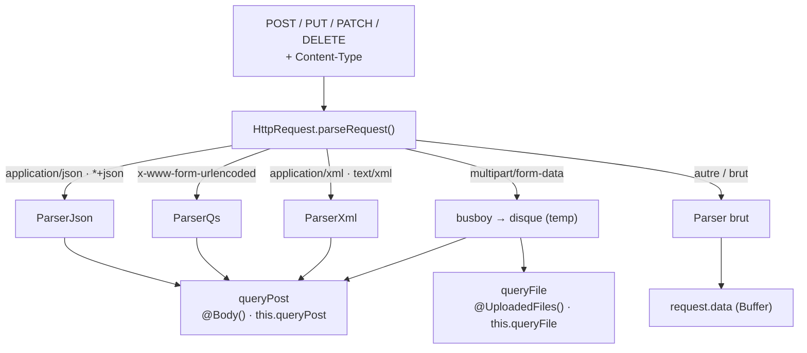
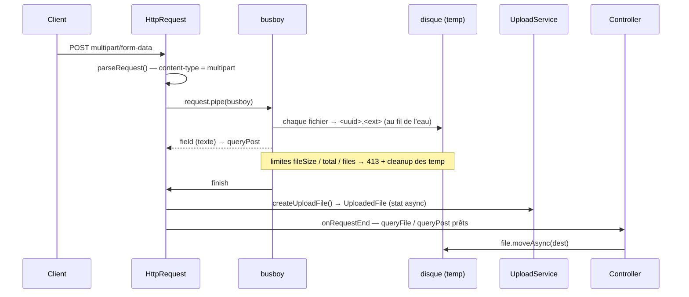

# Upload & corps de requête — multipart, JSON, bornes de payload

> Ce qui arrive après le `?` de l'URL : le **corps** d'une requête `POST`/`PUT`/`PATCH`/`DELETE`. Selon
> son `Content-Type`, Nodefony le parse de quatre façons — JSON, formulaire urlencodé, XML, ou
> **multipart** (les fichiers uploadés) — et le pose là où ton contrôleur le lit. Cette page décrit ce
> parsing, comment on accède aux **champs** et aux **fichiers**, l'API d'un fichier uploadé
> (`nom`, `taille`, `mimetype`, `move`), et les **deux budgets de taille** qui protègent le processus
> d'un corps trop gros. Chaque fait est ancré sur le code.

📍 [Documentation](../../../../../docs/index.md) › [@nodefony/http](index.md) › **Upload & corps de requête**

## 🧠 Le modèle mental — un corps, quatre parsers, deux budgets

Le corps d'une requête n'est **jamais** interprété par le serveur ni par le routeur : c'est
`HttpRequest` qui, selon le `Content-Type`, choisit **un** parser et remplit deux emplacements que ton
contrôleur consomme — `queryPost` (les champs) et `queryFile` (les fichiers).



Trois idées portent tout le reste :

1. **Le `Content-Type` décide, pas la méthode.** `parseRequest()` (`context/http/Request.ts:429`)
   aiguille vers `ParserJson` / `ParserQs` / `ParserXml` / **busboy** / parser brut selon l'en-tête.
2. **Seul le multipart écrit sur disque.** Les fichiers sont **streamés** au fil de l'eau vers un
   fichier temporaire (`parseMultipart()`, `context/http/Request.ts:499`) — jamais bufferisés en RAM.
   JSON / urlencoded / XML restent en mémoire (petits corps).
3. **Deux budgets distincts, jamais confondus.** Le corps **non-multipart** est borné par `maxBodySize`
   (défaut **1 MiB**) ; le multipart a **ses propres** limites busboy (`maxFileSize`, `maxTotalFileSize`,
   défaut **500 MB**). Régler l'un ne change rien à l'autre — c'est le piège n° 1.

## 📖 Lexique

| Terme                       | Sens                                                                                                               |
| --------------------------- | ------------------------------------------------------------------------------------------------------------------ |
| Corps (body)                | Les octets envoyés **après** les en-têtes d'une requête (le contenu d'un `POST`).                                  |
| `Content-Type`              | En-tête déclarant le format du corps (`application/json`, `multipart/form-data`…). Il décide du parser.            |
| `multipart/form-data`       | Format d'un formulaire qui contient des **fichiers** : le corps est découpé en _parts_ séparées (RFC 7578).        |
| Boundary                    | Chaîne-séparateur (`--…`) qui délimite chaque _part_ d'un corps multipart.                                         |
| Part                        | Un bloc d'un corps multipart : soit un **champ texte** (`field`), soit un **fichier** (`file`).                    |
| Field / File                | Champ texte (→ `queryPost`) vs fichier uploadé (→ `queryFile`), les deux issus du même corps multipart.            |
| busboy                      | La bibliothèque de parsing multipart **en flux** (`@fastify/busboy`) : elle lit le corps sans le charger en RAM.   |
| Streaming (au fil de l'eau) | Écrire le fichier sur disque **pendant** sa réception, octet par octet — au lieu d'attendre le corps entier.       |
| Fichier temporaire (temp)   | Le fichier écrit par busboy dans `uploadDir`, nommé par un UUID. Le contrôleur le déplace ou le laisse expirer.    |
| `urlencoded`                | `application/x-www-form-urlencoded` : un formulaire simple `a=1&b=2` (pas de fichier).                             |
| Payload                     | Synonyme de corps de requête, surtout quand on parle de sa **taille**.                                             |
| 413 « Content Too Large »   | Le statut HTTP renvoyé quand le corps dépasse une borne (RFC 9110 §15.5.14).                                       |
| `Content-Length`            | En-tête annonçant la taille du corps. Sert au pré-contrôle 413 **avant** de lire.                                  |
| Chunked                     | Corps envoyé sans `Content-Length` (`Transfer-Encoding: chunked`) : la taille n'est connue qu'en cours de lecture. |
| Path traversal              | Attaque où un nom de fichier (`../../etc/passwd`) fait écrire **hors** du dossier prévu.                           |
| Hash d'intégrité            | Empreinte (`sha256`…) calculée pendant le stream, pour vérifier qu'un fichier n'a pas été altéré.                  |
| `Readable`                  | Un flux Node lisible. `@Body({ stream: true })` en injecte un — le corps brut, non parsé.                          |

## Qu'est-ce qu'un upload, ici ?

Imagine un **guichet de dépôt**. Le client arrive avec une enveloppe (`Content-Type`) : dedans, soit un
formulaire à plat (JSON, urlencodé, XML) que le guichetier **recopie sur une fiche** en mémoire, soit un
**colis** (multipart) qu'il pose **directement dans une consigne** (le disque) sans jamais le tenir à
bout de bras. Dans les deux cas, ton contrôleur ne voit pas l'enveloppe : il reçoit la fiche
(`queryPost`) et le bordereau de consigne (`queryFile`).

Concrètement, la couche a quatre responsabilités, et rien d'autre :

1. **Choisir le parser** d'après le `Content-Type`.
2. **Décoder les champs** (JSON, urlencoded, XML) → `queryPost`, lus par `@Body()`.
3. **Streamer les fichiers** multipart vers le disque, sans pic RAM → `queryFile`, lus par
   `@UploadedFiles()`.
4. **Borner la taille** — rejeter en `413` un corps qui menace la mémoire ou le disque.

Le routage, le firewall, le contrôleur viennent après : ils reçoivent un corps déjà parsé et déjà borné.

## La vision Nodefony

Trois choix structurent l'implémentation, et chacun a une raison de sécurité ou de performance.

**Le multipart ne touche jamais la RAM.** Là où l'ancien chemin bufferisait le corps entier, busboy lit
le flux et écrit chaque fichier au fil de l'eau dans le dossier temporaire (`streamMultipart()`,
`context/http/Request.ts:537`). Un upload de 1 Go ne coûte donc pas 1 Go de heap — seuls les petits
champs texte restent en mémoire. C'est ce qui rend un endpoint d'upload public tenable.

**Le nom du fichier temporaire n'est jamais celui du client.** Chaque fichier reçu est écrit sous un nom
`randomUUID()` + extension d'origine (`context/http/Request.ts:458`) : un nom malveillant
(`../../etc/passwd`) ne peut pas influencer le **chemin** d'écriture. Le nom d'origine est conservé en
**métadonnée** (`filename`), pas dans le chemin.

**Deux budgets, secure-by-default.** Le corps non-multipart est plafonné à **1 MiB** par défaut
(`maxBodySize`, `config/config.ts:984`) — un `POST` JSON géant est rejeté avant d'être bufferisé. Le
multipart, lui, a ses propres bornes busboy (par fichier, cumul, nombre) qui coupent le flux et
nettoient les temporaires déjà posés au moindre dépassement (`context/http/Request.ts:481`).

> [!IMPORTANT]
> `@nodefony/http` ne peut pas importer `@nodefony/framework` (cycle). Les **décorateurs**
> (`@Body`, `@UploadedFiles`…) vivent donc dans `@nodefony/framework`, mais ils lisent les emplacements
> (`queryPost`, `queryFile`) remplis par `@nodefony/http`. Une page, deux modules — c'est le prix du
> découplage.

## 🚀 Démarrage rapide

Dans une application générée par `nodefony create app`, le parsing du corps est **déjà branché** : tu
n'écris que tes bornes (si les défauts ne conviennent pas) et le contrôleur qui reçoit l'upload.

### 1. Les bornes de payload

Réglées sur le module `@nodefony/http`, colocalisées dans le manifeste via `use()`. Toutes ces clés
sont facultatives : ce sont les défauts du schéma, écrits ici pour les rendre visibles et les resserrer.

```typescript
// nodefony.config.ts — bornes de payload de l'application
export default defineConfig(() => ({
  modules: [
    use("@nodefony/http", {
      // Corps NON-multipart (JSON, urlencoded, XML, brut) : 1 MiB par défaut.
      // Au-delà → 413 « Content Too Large ». 0 = illimité.
      maxBodySize: 1_048_576,
      upload: {
        // Chaque fichier (busboy limits.fileSize) — dépassement → 413.
        maxFileSize: 10 * 1024 * 1024, // 10 MiB
        // Cumul de TOUS les fichiers d'une même requête (compteur Nodefony).
        maxTotalFileSize: 30 * 1024 * 1024, // 30 MiB
        maxFiles: 10, // nombre de fichiers — anti-DoS
        // Intégrité optionnelle : hash calculé PENDANT le stream (0 relecture).
        hashAlgorithm: "sha256",
      },
    }),
    "@nodefony/framework",
  ],
}));
```

### 2. Le contrôleur qui reçoit l'upload

Le pipeline a déjà streamé les fichiers sur disque et parsé les champs texte. Le contrôleur les lit par
paramètres décorés — `@UploadedFiles()` pour les fichiers, `@Body("champ")` pour un champ — puis déplace
chaque fichier vers son emplacement définitif.

```typescript
// nodefony/controller/UploadController.ts — reçoit un upload multipart
import {
  Controller,
  controller,
  Post,
  Body,
  UploadedFiles,
} from "@nodefony/framework";
import type { ContextType, IUploadedFile } from "@nodefony/http";
import path from "node:path";

@controller("/avatars")
class UploadController extends Controller {
  constructor(context: ContextType) {
    super("UploadController", context);
  }

  // multipart/form-data : les fichiers arrivent DÉJÀ écrits en temp (streaming
  // busboy), les champs texte via @Body(). @UploadedFile() donnerait le premier.
  @Post("/")
  async upload(
    @UploadedFiles() files: IUploadedFile[] | undefined,
    @Body("label") label: string | undefined,
  ) {
    const saved: Array<{ name: string; size: number }> = [];
    for (const file of files ?? []) {
      // SÉCURITÉ : le temp est nommé par un UUID (jamais le nom client). Pour la
      // DESTINATION, on impose NOTRE nom — jamais file.filename brut (traversal).
      const safeName = `${Date.now()}-${path.basename(file.filename)}`;
      const dest = path.resolve("/var/app/uploads", safeName);
      await file.moveAsync(dest); // variante non bloquante (recommandée)
      saved.push({ name: file.filename, size: file.size });
    }
    return this.renderJson({ label: label ?? null, files: saved });
  }
}

export default UploadController;
```

### 3. Vérifier depuis le terminal

```bash
# multipart : un champ texte + un fichier, sur le port TLS
curl -k -F "label=profil" -F "file=@./photo.png" https://127.0.0.1:5152/avatars/
# {"label":"profil","files":[{"name":"photo.png","size":12345}]}

# corps JSON non-multipart > maxBodySize (1 MiB) → rejet avant lecture
curl -k -X POST -H "content-type: application/json" \
     --data-binary @big.json https://127.0.0.1:5152/avatars/
# HTTP/2 413  (Request body too large)
```

## 🏗️ Architecture interne — le trajet d'un corps multipart

Une requête multipart traverse `HttpRequest` → busboy → disque → `UploadService`, puis atterrit dans le
contrôleur avec `queryFile`/`queryPost` déjà remplis.



Les points d'implémentation qui expliquent des comportements surprenants :

1. **L'aiguillage lit le `Content-Type`, pas la méthode** — `parseRequest()`
   (`context/http/Request.ts:292`). `PATCH` porte un corps comme `POST`/`PUT` : il figure dans la table
   des méthodes parsées (`context/http/Request.ts:63`) — l'oubli laissait tout `PATCH` avec un corps vide.
2. **Le multipart draine sur un `finish`, après flush de tous les writes** — `streamMultipart()`
   (`context/http/Request.ts:537`) accumule les `Promise` d'écriture disque et ne résout `{ fields, files }`
   qu'une fois tous les fichiers fermés (`context/http/Request.ts:538`).
3. **Une limite dépassée nettoie les temporaires déjà posés** — `abort()`
   (`context/http/Request.ts:557`) délie le flux, détruit les write-streams ouverts et `unlink` les temp
   déjà écrits (`context/http/Request.ts:431`) avant de rejeter en `413` : pas d'orphelins sur le disque.
4. **Les autres formats drainent AVANT de concaténer** — la base `Parser.parse()` attend `end`
   (`context/http/parser.ts:111`) avant `Buffer.concat` : sans ce drain, `ParserQs`/`ParserXml`
   lisaient un corps partiel → `queryPost` vide (bug de régression, cf tests).
5. **Un multipart sans boundary exploitable ne crashe pas** — `new Busboy()` lève **synchroniquement** ;
   c'est rattrapé et on bascule sur le `Parser` brut (`context/http/Request.ts:375`).

## ⚙️ Configuration — deux budgets, jamais confondus

C'est la distinction la plus utile de cette page. **Le multipart n'écoute pas `maxBodySize`** ; le
non-multipart n'écoute pas `upload.*`.

### Corps non-multipart — `maxBodySize`

| Option        | Type   | Défaut              | Effet                                                                          |
| ------------- | ------ | ------------------- | ------------------------------------------------------------------------------ |
| `maxBodySize` | octets | `1_048_576` (1 MiB) | Plafond d'un corps **JSON / urlencoded / XML / brut** → `413`. `0` = illimité. |

Deux rideaux, tous deux `runtimeMutable` (éditable à chaud) : un **pré-check** sur `Content-Length`
qui rejette **avant** de lire (`enforceBodyLimit()`, `context/http/Request.ts:296`), puis un **compteur
en streaming** qui coupe le socket si le corps déborde sans `Content-Length` honnête — chunked ou
menteur (`Parser.write()`, `context/http/parser.ts:33`, dépassement `context/http/parser.ts:44`).
Champ `maxBodySize` du schéma : `config/config.ts:984`.

### Fichiers multipart — `upload.*`

Table dérivée de `uploadSchema` (`config/config.ts:144`). Toutes les bornes sont `runtimeMutable`.

| Option             | Type                             | Défaut                 | Effet                                                                                               |
| ------------------ | -------------------------------- | ---------------------- | --------------------------------------------------------------------------------------------------- |
| `uploadDir`        | chemin                           | `""` → `kernel.tmpDir` | Dossier de dépôt des temporaires. Vide = temp du kernel (`config/config.ts:146`).                   |
| `maxFileSize`      | octets                           | `524_288_000` (500 MB) | Taille max d'**UN** fichier (busboy `limits.fileSize`) → `413` (`config/config.ts:155`).            |
| `maxTotalFileSize` | octets                           | `524_288_000` (500 MB) | Taille **CUMULÉE** des fichiers d'une requête (compteur Nodefony) → `413` (`config/config.ts:167`). |
| `maxFiles`         | entier                           | `1000`                 | Nombre max de fichiers (busboy `limits.files`) → `413` (`config/config.ts:179`).                    |
| `maxFields`        | entier                           | `1000`                 | Nombre max de champs texte (busboy `limits.fields`) → `413` (`config/config.ts:190`).               |
| `maxFieldsSize`    | octets                           | `2_097_152` (2 MB)     | Taille max d'un champ texte (busboy `limits.fieldSize`) (`config/config.ts:201`).                   |
| `hashAlgorithm`    | `false` \| `sha256`/`sha1`/`md5` | `false`                | Hash calculé pendant le stream (intégrité) (`config/config.ts:212`).                                |
| `encoding`         | chaîne                           | `"utf-8"`              | Encodage par défaut des champs texte (busboy `defCharset`) (`config/config.ts:219`).                |

> [!WARNING]
> `uploadDir` vide est **résolu au boot** sur le répertoire temporaire du kernel par le builder de config
> (`defineModuleConfig.ts:43`) : un défaut vide n'est jamais un chemin vide en runtime. Ne dérérérence
> **jamais** le kernel au top-level d'un `config.ts` — c'est la raison du champ marqué `kernelDerived`.

## 🧰 API — accéder aux champs et aux fichiers

Depuis un contrôleur, deux surfaces équivalentes : les **décorateurs de paramètre** (déclaratif,
recommandé) et les **getters** de `Controller` (impératif). Les signatures exactes vivent dans
`.ai/symbols.json` — jamais recopiées ici.

| Accès                                              | Source lue                           | Ancrage                                                             |
| -------------------------------------------------- | ------------------------------------ | ------------------------------------------------------------------- |
| `@UploadedFiles() f: IUploadedFile[]`              | tous les fichiers (`queryFile`)      | `resolveParamArg` `"files"` (`routerDecorators.ts:1209`)            |
| `@UploadedFile() f: IUploadedFile`                 | le **premier** fichier               | `resolveParamArg` `"file"` (`routerDecorators.ts:1208`)             |
| `@Body() body`                                     | tous les champs parsés (`queryPost`) | `resolveParamArg` `"body"` (`routerDecorators.ts:1178`)             |
| `@Body("label") v`                                 | un seul champ du body                | même source, clé (`routerDecorators.ts:1178`)                       |
| `@Body({ stream: true }) s: NodeJS.ReadableStream` | le **flux brut**, parse **sauté**    | `resolveParamArg` stream (`routerDecorators.ts:1227`)               |
| `this.queryFile`                                   | équivalent getter des fichiers       | `Controller.queryFile` (`framework/nodefony/src/Controller.ts:205`) |
| `this.queryPost`                                   | équivalent getter des champs         | `Controller.queryPost` (`framework/nodefony/src/Controller.ts:214`) |

Les décorateurs `@UploadedFile` / `@UploadedFiles` sont des fabriques de paramètre
(`routerDecorators.ts:1209`), exportées par `@nodefony/framework` ; leurs interfaces `IUploadedFile` /
`IParsedUploadFile` viennent de `@nodefony/http` (`interfaces/IUpload.ts:49`, `interfaces/IUpload.ts:7`).

### Un fichier uploadé — `UploadedFile`

Chaque entrée de `queryFile` est un `UploadedFile` (`service/upload/upload-service.ts:96`), déjà écrit
sur disque. Ses membres utiles :

| Membre                   | Ce qu'il donne                                                          | Ancrage                                                    |
| ------------------------ | ----------------------------------------------------------------------- | ---------------------------------------------------------- |
| `filename`               | Nom **d'origine** déclaré par le client (métadonnée, jamais le chemin). | `realName()` (`service/upload/upload-service.ts:147`)      |
| `size`                   | Taille réellement écrite (octets).                                      | `getSize()` (`service/upload/upload-service.ts:139`)       |
| `prettySize`             | Taille lisible (`« 1.2 MB »`).                                          | `getPrettySize()` (`service/upload/upload-service.ts:143`) |
| `mimeType`               | Type MIME déclaré (`image/png`…), sinon deviné de l'extension.          | `getMimeType()` (`service/upload/upload-service.ts:153`)   |
| `hash` / `hashAlgorithm` | Empreinte d'intégrité si `upload.hashAlgorithm` est réglé.              | `interfaces/IUpload.ts:49`                                 |
| `moveAsync(target)`      | Déplace le temp — **non bloquant, recommandé** dans le pipeline.        | `moveAsync()` (`service/upload/upload-service.ts:193`)     |
| `move(target)`           | Variante **synchrone** (compat) — bloque l'event-loop.                  | `move()` (`service/upload/upload-service.ts:160`)          |

`move`/`moveAsync` acceptent un **fichier cible** ou un **dossier existant** : sur un dossier, la
destination est bâtie avec `filename` — d'où l'avertissement de sécurité ci-dessous.

### Gros upload sans pic mémoire — `@Body({ stream: true })`

Pour piper directement un très gros corps (vidéo, backup) vers le disque ou S3 sans passer par busboy ni
par la RAM, `@Body({ stream: true })` court-circuite le parse et injecte l'`IncomingMessage` brut (un
`Readable`). Le pipeline sait le sauter en amont via `routeExpectsBodyStream()`
(`routerDecorators.ts:1334`), mémoïsé sur la route.

```ts
// fragment — le contrôleur pipe le flux lui-même (0 parse, 0 pic RAM)
@Post("/backup")
async backup(@Body({ stream: true }) body: NodeJS.ReadableStream) {
  await pipeline(body, createWriteStream("/var/app/backup.tar")); // node:stream/promises
  return this.renderJson({ ok: true });
}
```

## 🔐 Sécurité

L'upload est une surface d'attaque classique : nom de fichier hostile, saturation disque/RAM, contenu
piégé. Les défenses en place, et **ce qui reste à ta charge**.

<!-- prettier-ignore -->
| Menace | Défense côté framework | À ta charge |
| --- | --- | --- |
| **Path traversal** (chemin d'écriture) | Le temp est nommé `randomUUID()` + extension — jamais le nom client (`context/http/Request.ts:458`). | La **destination** de `move()` (voir avertissement). |
| **Saturation RAM** | Multipart streamé (jamais bufferisé) ; corps non-multipart borné (`maxBodySize`). | Resserrer `maxBodySize` selon l'endpoint. |
| **Saturation disque** | `maxFileSize` + `maxTotalFileSize` + `maxFiles` ; `abort()` nettoie les temp à l'abandon (`context/http/Request.ts:557`). | Purger les temp non déplacés (TTL / cron). |
| **DoS par quantité** | `maxFields` / `maxFiles` / `parts` → `413` (`context/http/Request.ts:610`). | — |
| **Type de fichier hostile** | `mimeType` **déclaré** est exposé tel quel. | Valider le type/contenu réel (le MIME client est déclaratif). |

> [!WARNING]
> **Path traversal sur la destination.** `move(dir)` / `moveAsync(dir)` vers un **dossier** construit le
> chemin final avec `file.filename` — le nom **client** (`service/upload/upload-service.ts:197`). Un nom
> `../../etc/cron.d/x` s'échapperait du dossier. Le framework protège le chemin du **temporaire**, pas
> celui que **tu** choisis. Règle : passe une **cible complète** que tu contrôles, ou assainis toujours
> avec `path.basename(file.filename)` — exactement le `safeName` du Démarrage rapide.

## ⚡ Performance & mémoire

Le parsing du corps est sur le chemin de chaque requête écrivante — les choix visibles dans le code :

- **Multipart en flux pur** — plus de double-bufferisation : busboy écrit sur disque au fil de l'eau,
  seuls les champs texte restent en mémoire (`context/http/Request.ts:400`).
- **Rejet AVANT lecture** — le pré-check `Content-Length` renvoie `413` sans lire un octet
  (`context/http/Request.ts:270`) ; le compteur streaming **libère immédiatement** la RAM déjà
  bufferisée au dépassement (`context/http/parser.ts:43`).
- **`stat` non bloquant** — `UploadedFile.create()` résout les stats du fichier en async
  (`service/upload/upload-service.ts:130`), plus de `lstatSync` par fichier uploadé.
- **Listeners jumeaux nettoyés** — le drain de fin de corps retire ses écouteurs `end`/`error`/overflow
  à la main (`once` n'auto-détache que celui qui fire) (`context/http/parser.ts:88`).
- **Hash opt-in** — `hashAlgorithm: false` par défaut : zéro coût CPU tant que l'intégrité n'est pas
  demandée.

Rejouer une charge d'upload : skill `nodefony-load-test`. Gate mémoire avant tout commit touchant le
pipeline : `npm run test:memory` (skill `nodefony-check-memory-health`).

## 📜 Normes appliquées

| Domaine                            | Norme                            | Ancrage                                                       |
| ---------------------------------- | -------------------------------- | ------------------------------------------------------------- |
| Formulaire avec fichiers           | RFC 7578 (`multipart/form-data`) | `parseMultipart()` via busboy (`context/http/Request.ts:499`) |
| Corps trop gros → 413              | RFC 9110 §15.5.14                | `enforceBodyLimit()` (`context/http/Request.ts:407`)          |
| 413 en streaming (chunked/menteur) | RFC 9110 §15.5.14                | `Parser.write()` (`context/http/parser.ts:33`)                |
| Bornes multipart → 413             | RFC 9110 §15.5.14                | `stream.on("limit")` (`context/http/Request.ts:481`)          |
| Défense path traversal (nom temp)  | OWASP — File Upload              | `randomUUID()` (`context/http/Request.ts:458`)                |
| Charset du corps honoré            | RFC 9110 (Content-Type)          | `getCharset()` (`context/http/Request.ts:799`)                |

## ⚠️ Pièges

| Symptôme                                                | Cause                                                               | Correction                                                                                         |
| ------------------------------------------------------- | ------------------------------------------------------------------- | -------------------------------------------------------------------------------------------------- |
| `@Body()` est vide sur un upload de fichier             | Les fichiers vont dans `queryFile`, **pas** dans `queryPost`        | Lire les fichiers avec `@UploadedFiles()` / `this.queryFile` ; `@Body()` = champs texte            |
| Un `POST` JSON de 1,5 Mo est refusé en `413`            | `maxBodySize` vaut **1 MiB** par défaut                             | Augmenter `maxBodySize` (pas `upload.maxFileSize`)                                                 |
| Un gros fichier passe alors que `maxBodySize` est petit | Le multipart **n'écoute pas** `maxBodySize`                         | Régler `upload.maxFileSize` / `maxTotalFileSize`                                                   |
| `413` sur upload sans message clair                     | Une borne busboy atteinte en streaming (fichier, cumul, nombre)     | Vérifier les bornes `upload.*` — 413 émis sur `stream.on("limit")` (`context/http/Request.ts:481`) |
| Un fichier écrit `../../etc/…` après un `move`          | `move(dossier)` utilise le nom **client** (`upload-service.ts:197`) | Passer une cible complète, ou `path.basename(file.filename)`                                       |
| Des fichiers temporaires s'accumulent dans `uploadDir`  | Le contrôleur ne déplace jamais le temp                             | Appeler `moveAsync()` (ou purger l'ancien temp par TTL)                                            |
| `queryPost` vide sur `PATCH`                            | Déjà géré : `PATCH` est dans la table des méthodes parsées          | Aucune — corps `PATCH` parsé comme `POST` (`context/http/Request.ts:63`)                           |
| Corps `latin1` mal décodé                               | Déjà géré : le `charset=` du `Content-Type` est honoré              | Aucune — `getCharset()` normalise (`context/http/Request.ts:799`)                                  |
| `multipart` sans boundary fait planter                  | `new Busboy()` throw synchrone                                      | Déjà géré : bascule sur le parser brut (`context/http/Request.ts:375`)                             |

## 🧪 Tests & couverture

Les chiffres exacts vivent dans la carte de tests de cette page (régénérée depuis vitest, jamais figés
dans le Markdown).

| Type                        | Où                                                                                                                  |
| --------------------------- | ------------------------------------------------------------------------------------------------------------------- |
| Unitaires — `UploadedFile`  | `unit/UploadedFile.test.ts` — `create()` async, `move`/`moveAsync`, `mimeType`, `realName`                          |
| Unitaires — `@Body` stream  | `framework` `unit/BodyStream.test.ts` — `@Body({ stream })`, `resolveParamArg`, `routeExpectsBodyStream`            |
| Intégration — multipart     | `http/upload.test.ts` — upload simple, multi-fichiers, mime non-octet, champ + fichier, `413` par fichier et cumulé |
| Intégration — content-types | `http/body-content-types.test.ts` — JSON, urlencoded, `@Body("champ")`, XML → `queryPost`                           |
| Intégration — bornes        | `http/body-limit.test.ts` — sous la limite `200`, `Content-Length` > 1 MiB → `413`, chunked > 1 MiB refusé          |
| Intégration — flux brut     | `integration/bodyStream.test.ts` — `@Body({ stream })` bout-en-bout (TLS + clair), non-régression `@Body()`         |

Ce qui **manque** aujourd'hui : pas de banc de **charge** dédié à l'upload (le streaming multipart n'est
exercé que fonctionnellement), pas de test **d'attaque** (`*.attack.test.ts`) sur le path traversal de
`move()` dans un dossier, et les bornes `maxFiles` / `maxFields` / `maxFieldsSize` ne sont pas couvertes
individuellement (seules `maxFileSize` et `maxTotalFileSize` le sont).

Suites : `npm test` (unitaires), `npm run test:integration` (serveur requis). Couverture :
`npm run coverage` dans `@nodefony/http` — le pourcentage vit dans le rapport vitest, jamais figé ici.
Skills associés : `nodefony-load-test`, `nodefony-check-memory-health`, `nodefony-security-review`.

## 🔗 Pour aller plus loin

- ⬆️ **Retour au hub** : [@nodefony/http — vue du module](index.md) · [Toute la documentation](../../../../../docs/index.md)
- 🧭 **Pages sœurs** : [Serveurs](servers.md) · [Sessions](session.md)
- Bornes de payload globales et transport → [Serveurs § Bornes de payload](servers.md#bornes-de-payload)
- Le pipeline qui reçoit ce corps parsé → [pipeline-requete](../../../../../docs/architecture/pipeline-requete.md)
- Routage, contrôleurs et décorateurs `@Body`/`@UploadedFiles` → [@nodefony/framework](../../framework/docs/index.md)
- Configuration d'application (`defineConfig`, `use`) → [configuration](../../../../../docs/guides/configuration.md)
