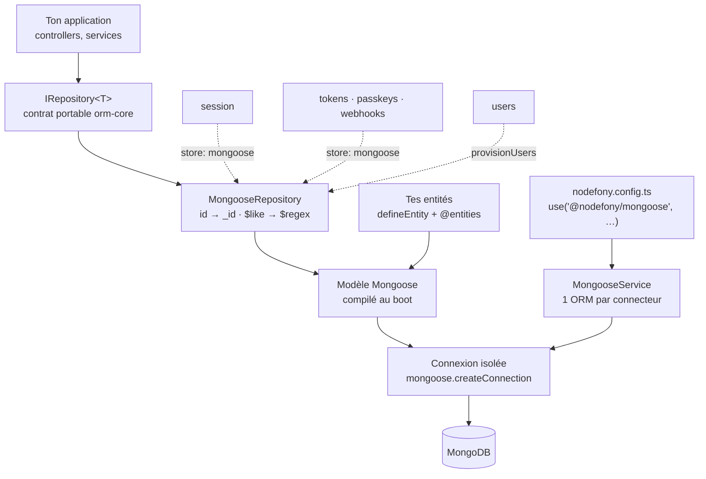
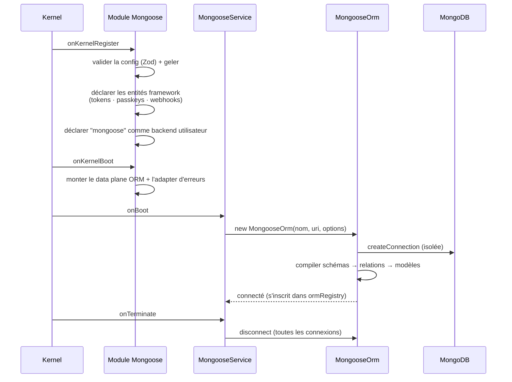

# @nodefony/mongoose — le driver MongoDB

> Le module qui fait parler ton application à **MongoDB**. Il ouvre les connexions au démarrage,
> compile tes schémas en modèles, et te rend des **repositories portables** : le même code métier
> tourne sur Mongo ou sur SQL. Il fournit aussi cinq **briques du framework** prêtes à l'emploi sur
> Mongo — sessions, utilisateurs, jetons, passkeys, webhooks. Ce qu'il ne porte pas, il le dit :
> la couverture est **adaptée à la vocation de MongoDB**, jamais une course à la parité avec SQL.

📍 [Documentation](../../../../../docs/index.md) › **MongoDB (Mongoose)**

## 🧭 Par où commencer

Quatre parcours, selon ce que tu viens faire. L'ordre compte : chaque étape suppose la précédente.

**Je démarre une application documentaire** — ma donnée métier est faite de documents.

1. [🚀 Démarrage rapide](#-démarrage-rapide) — la config, une entité, un repository, une requête.
   Copie-colle, ça tourne.
2. [Configuration](./configuration.md) — l'URI, les connecteurs nommés, la surcharge par
   l'environnement. C'est là que vit le secret de connexion.
3. [🧰 Le repository portable](#-le-repository-portable--lapi-que-tu-utilises-vraiment) — critères,
   opérateurs, tri, pagination.
4. [`@nodefony/orm-core`](../../orm-core/docs/index.md) — le contrat commun à tous les drivers, si
   tu veux comprendre ce qui est portable et ce qui ne l'est pas.

**Je branche les briques du framework sur Mongo** — sessions, comptes, jetons, passkeys, webhooks.

1. [🧭 Couverture adaptée](#-la-vision-nodefony--une-couverture-adaptée-pas-une-course-à-la-parité) —
   **lis ça d'abord** : ce que Mongo porte, ce qu'il ne porte pas, et pourquoi ce n'est pas un manque.
2. [🔐 Les stores fournis](#-les-stores-fournis) — un par brique, avec sa clé de sélection.
3. [Sessions HTTP](../../http/docs/session.md) et [jetons](../../security/docs/tokens.md) —
   le contrat côté consommateur ; cette page en donne l'implémentation Mongo.
4. [⚠️ Pièges](#-pièges-symptôme--cause--correction) — l'ordre de chargement des modules se paie cher
   quand on le découvre en production.

**J'exploite MongoDB à fond** — au-delà du CRUD portable.

1. [🏗️ Architecture interne](#-architecture-interne--du-boot-à-la-requête) — ce qui se passe au boot,
   et le trajet exact d'une requête.
2. [Relations et transactions](#relations--sans-clé-étrangère) — populate, virtuels, replica set.
3. [La trappe native](#la-trappe-native--quand-le-contrat-ne-suffit-plus) — agrégations, `$or`,
   index : tout ce que le contrat portable ne couvre pas volontairement.

**Je passe en production / je supervise.**

1. [Configuration](./configuration.md) — `MONGODB_URI` / `NF_DATABASE_URL`, pool, TLS.
2. [📡 Observabilité Studio](#-observabilité--studio) — écrans ORM, Stores, Bases, et le data plane.
3. [⚡ Performance et mémoire](#-performance-et-mémoire) — ce que coûte (ou pas) l'instrumentation.
4. [🧪 Tests](#-tests-et-couverture) — et surtout **ce qu'un test vert ne prouve pas** ici.

## 🗂️ Le module en un coup d'œil

Le tableau pour choisir en cinq secondes ; les cards en dessous pour le détail.

| Brique                                | Ce qu'elle fait                                         | Tu t'en sers quand…                        |
| ------------------------------------- | ------------------------------------------------------- | ------------------------------------------ |
| [`configuration`](./configuration.md) | URI, connecteurs nommés, options, surcharge par env     | tu branches une vraie base                 |
| `MongooseService`                     | ouvre les connexions au boot, les ferme à l'arrêt       | jamais directement — il travaille pour toi |
| `MongooseOrm`                         | compile tes entités en modèles, expose les sondes       | tu veux la connexion native ou un ping     |
| `MongooseRepository`                  | le CRUD portable (critères, tri, pagination, relations) | **tout le temps** — c'est ton API données  |
| `SessionStorage`                      | les sessions HTTP/WS persistées dans Mongo              | tu veux des sessions qui survivent au pod  |
| `MongooseUserRepository`              | l'annuaire des comptes (identité, rôles, OAuth)         | tes utilisateurs vivent dans Mongo         |
| `MongooseTokenStore`                  | jetons, clés d'API, denylist, révocation en masse       | tu émets des JWT ou des PAT                |
| `MongooseWebAuthnCredentialStore`     | les passkeys enregistrées                               | tu actives WebAuthn                        |
| `MongooseWebhookStore`                | le registre durable des endpoints webhook               | tu notifies des systèmes tiers             |

```nodefony-cards
[
  { "icon": "⚙️", "title": "configuration", "href": "configuration.md",
    "desc": "Le seul fichier que tu écris vraiment : une URI complète (Atlas, replica set) ou les composants `host`/`port`/`dbname`, plus les options de pool et d'authentification. Le secret ne vit jamais dans le dépôt — il arrive par l'environnement.",
    "meta": "commence par sa section « Forme », puis la table des champs" },
  { "icon": "🔌", "title": "MongooseService", "href": "#-architecture-interne--du-boot-à-la-requête",
    "desc": "Le service bootable : il instancie un ORM par connecteur déclaré, le connecte au démarrage et referme tout à l'arrêt. Le module est déclaré non critique — une base injoignable ne tue pas le processus.",
    "meta": "jamais directement — il travaille pour toi" },
  { "icon": "🧩", "title": "MongooseOrm", "href": "#-architecture-interne--du-boot-à-la-requête",
    "desc": "L'adapter du contrat commun : une connexion isolée (jamais le singleton global de Mongoose), les entités compilées en modèles, les relations traduites en références `ObjectId` + `populate`, et les sondes qu'affiche Studio.",
    "meta": "pour la connexion native ou une transaction" },
  { "icon": "🧰", "title": "MongooseRepository", "href": "#-le-repository-portable--lapi-que-tu-utilises-vraiment",
    "desc": "L'objet que tu manipules au quotidien : `find`, `create`, `upsert`, `updateOne`, `increment`, `count`, `exists`, plus la liaison transactionnelle. Il traduit `id` en `_id`, les opérateurs portables en opérateurs Mongo, et refuse un champ inconnu au lieu de rendre zéro résultat en silence.",
    "meta": "tout le temps — c'est ton API données" },
  { "icon": "🗝️", "title": "SessionStorage", "href": "#sessions",
    "desc": "Les sessions HTTP et WebSocket persistées dans Mongo, auto-enregistrées sous le nom `mongoose` auprès du service de sessions de `@nodefony/http`.",
    "meta": "sélection : session.store = mongoose" },
  { "icon": "👤", "title": "MongooseUserRepository", "href": "#utilisateurs",
    "desc": "L'annuaire des comptes : identifiants, comptes sociaux liés, listing paginé. Il rend des objets `BaseUser` avec leur comportement, pas des documents nus.",
    "meta": "câblé par ton application, dans son provisionUsers" },
  { "icon": "🎫", "title": "MongooseTokenStore", "href": "#jetons",
    "desc": "Jetons, clés d'API, denylist de `jti` et seuils de révocation par porteur — trois collections, dont les invariants de sécurité sont tenus par la requête elle-même.",
    "meta": "sélection : tokenStore.store = mongoose" },
  { "icon": "🔑", "title": "MongooseWebAuthnCredentialStore", "href": "#passkeys",
    "desc": "Les passkeys enrôlées : une collection, la clé du credential en clé primaire, un enregistrement atomique et un listing d'administration qui ne sort jamais la clé publique.",
    "meta": "sélection : passkeys.store = mongoose" },
  { "icon": "🪝", "title": "MongooseWebhookStore", "href": "#webhooks",
    "desc": "Le registre durable des destinations à notifier : il survit au redémarrage, contrairement au store mémoire, et pagine sans second comptage.",
    "meta": "sélection : webhooks.store = mongoose" }
]
```

## 🧠 Le schéma général



Place dans le graphe de dépendances : `@nodefony/mongoose` s'appuie sur
[`@nodefony/orm-core`](../../orm-core/docs/index.md) (les contrats), et **fournit** des
implémentations à [`@nodefony/http`](../../http/docs/index.md) (sessions),
[`@nodefony/security`](../../security/docs/index.md) (jetons, passkeys, webhooks) et
[`@nodefony/user`](../../user/docs/index.md) (comptes) — sans jamais dépendre d'eux au **runtime** :
ces modules ne sont connus qu'en `import type`, et c'est le driver qui se **déclare** à eux.

## 📖 Lexique

| Terme              | Sens                                                                                                  |
| ------------------ | ----------------------------------------------------------------------------------------------------- |
| MongoDB            | Base **documentaire** : elle range des documents (JSON) dans des collections, sans schéma imposé.     |
| Mongoose           | La bibliothèque Node.js qui pose un **schéma** et une validation par-dessus MongoDB.                  |
| Document           | Un enregistrement (l'équivalent d'une ligne SQL), mais imbriqué et de forme libre.                    |
| Collection         | Un ensemble de documents (l'équivalent d'une table).                                                  |
| `_id` / `ObjectId` | La clé primaire implicite de tout document Mongo ; `ObjectId` est son type par défaut.                |
| Virtuel            | Un champ calculé, absent de la base, exposé à la sérialisation (ici : `id`, la forme texte de `_id`). |
| `populate`         | Le remplacement d'une référence par le document visé — le pendant Mongo d'une jointure.               |
| Replica set        | Un groupe de serveurs Mongo répliqués. **Obligatoire** pour les transactions.                         |
| Connecteur         | Une connexion **nommée** déclarée en config (`nodefony` par défaut) ; sa clé sert de nom d'ORM.       |
| Repository         | L'objet qui lit et écrit une entité, avec une API identique sur tous les drivers.                     |
| Store (brique)     | L'implémentation d'une brique du framework (session, jetons…) sur un backend donné.                   |
| Upsert             | « écris, et crée si ça n'existe pas » — en une seule opération atomique.                              |
| PAT                | Personal Access Token : une clé d'API opaque, révocable côté serveur.                                 |
| `jti`              | L'identifiant unique d'un JWT — ce qu'on met en denylist pour le révoquer.                            |
| GC                 | Garbage collector : ici, la purge périodique des enregistrements expirés.                             |

## ❓ Qu'est-ce que c'est ?

**MongoDB range des documents, pas des lignes.** Une commande, avec ses articles, son adresse de
livraison et son historique de statuts, tient dans **un seul document** — là où le SQL éclaterait la
même chose en quatre tables reliées par des clés étrangères. Pas de schéma imposé par la base : la
forme des données vit dans le code, et elle peut varier d'un document à l'autre.

C'est le bon outil quand la donnée est **hétérogène** (chaque objet a ses propres champs), quand elle
est **imbriquée** (on lit et écrit le tout d'un bloc), ou quand la forme **change souvent** — un
champ ajouté ne demande aucune migration. C'est le mauvais outil quand tu as besoin de jointures
arbitraires entre entités indépendantes, ou de contraintes relationnelles fortes.

**Mongoose** est la bibliothèque Node.js standard pour parler à MongoDB. Elle ajoute ce que la base
n'impose pas : un **schéma** déclaré, la validation, les champs calculés, les références entre
documents. `@nodefony/mongoose` est l'adaptation de Mongoose au framework : il gère le cycle de vie
des connexions, la compilation des schémas, et présente le tout derrière le contrat portable de
[`@nodefony/orm-core`](../../orm-core/docs/index.md).

## 🧭 La vision Nodefony — une couverture adaptée, pas une course à la parité

Nodefony ne demande pas à chaque backend de tout savoir faire. **Chaque adapter déclare ce qu'il
implémente**, dans son `package.json` (clé `nodefony.stores`), et le framework lit cette déclaration
à chaud (`readAdapterManifest()` (`KernelAdminApi.ts:84`)). Rien n'est curaté dans le cœur : la
source de vérité, c'est l'adapter lui-même — ce qui vaut aussi pour un adapter tiers.

Ce que `@nodefony/mongoose` déclare : `session`, `user`, `tokens`, `passkeys`, `webhooks`, avec la
nature `durable`. Comparé aux deux autres adapters officiels :

<!-- prettier-ignore -->
| Brique | `@nodefony/drizzle` (SQL) | `@nodefony/mongoose` (Mongo) | `@nodefony/redis` (cache) |
| --- | :---: | :---: | :---: |
| `session` | ✅ | ✅ | ✅ |
| `user` | ✅ | ✅ | — |
| `tokens` | ✅ | ✅ | ✅ |
| `passkeys` | ✅ | ✅ | ✅ |
| `webhooks` | ✅ | ✅ | — |
| `totp` | ✅ | — | — |
| `audit` | ✅ | — | — |
| `idempotency` | ✅ | — | ✅ |
| Nature | durable | durable | cache |

> [!IMPORTANT]
> **Ces trois cases vides sont un manque, et il sera comblé.** L'objectif est qu'une application
> puisse tourner **entièrement sur MongoDB, sans charger `@nodefony/drizzle`** — donc mongoose à 8/8
> (`MIGRATION_STATUS.md`, P7.11). Le raisonnement « ces briques-là appellent d'autres propriétés »
> décrit une préférence technique, pas ce que vit l'utilisateur : **tu choisis une base de données, tu
> ne choisis pas de perdre le 2FA, la traçabilité ou la déduplication.**
>
> En attendant, ces trois briques se résolvent ailleurs **et te le disent** (repli annoncé au boot,
> avertissement en production) — mais mesure ce que le repli coûte : secrets TOTP perdus au
> redémarrage (utilisateurs verrouillés hors de leur second facteur), journal d'audit volatil,
> idempotence sans effet entre pods. La parade immédiate tient en une ligne : charger
> `@nodefony/drizzle` à côté de Mongo, **même en SQLite local** — les deux modules cohabitent, chaque
> brique choisit son store.
>
> La colonne `redis` obéit à une autre logique : elle gagnera `totp` (au régime opt-in de ses jetons
> et passkeys, jamais choisi par `auto`), mais pas `user`, `audit` ni `webhooks` — non parce que
> Redis serait « un cache », mais parce que ces données croissent sans borne, se conservent longtemps
> et se consultent. Ça, c'est un choix.

### Ce qui se passe quand tu ne choisis rien

Chaque brique a une clé `store` dont le défaut est `"auto"`. La résolution
(`resolveAutoStore()` (`infra.ts:241`)) suit l'infrastructure **déclarée**, bornée aux backends
réellement chargés :

| Ta situation                                            | Ce que `auto` choisit                                    |
| ------------------------------------------------------- | -------------------------------------------------------- |
| `NF_DATABASE_URL=mongodb://…` + module mongoose chargé  | `mongoose` — « infra database (mongodb) »                |
| Idem, mais pour une brique que mongoose ne porte pas    | repli annoncé (`memory`), avec la **raison** dans le log |
| Aucune infra déclarée, mongoose chargé (et pas drizzle) | `mongoose` — backend local persistant                    |
| `NF_REDIS_URL` déclaré, brique non durable (session…)   | `redis` d'abord (le cache passe avant la base)           |

Rien n'est jamais dégradé en silence : la raison du choix est journalisée. Et si tu nommes
**explicitement** un store qui n'existe pas (`audit: { store: "mongoose" }`), l'échec est franc —
boot avorté en production, brique désactivée avec un log `CRITIC` en développement. Un store durable
ne retombe **jamais** en mémoire sans le dire.

## 🚀 Démarrage rapide

Vu d'une application créée par `nodefony create app` : déclarer la base, décrire une entité, la lire.
Trois étapes, dans l'ordre.

### 1. Déclarer la base

```typescript
// nodefony.config.ts — le manifeste des modules de l'app
export default defineConfig(() => ({
  modules: [
    // Le driver AVANT les modules qui consomment ses stores (security, http) :
    // les fabriques de store exigent un ORM déjà connecté.
    use("@nodefony/mongoose", {
      connectors: {
        // `nodefony` = le connecteur par défaut du module (≠ `default` de Drizzle).
        nodefony: { host: "127.0.0.1", port: 27017, dbname: "blog" },
      },
    }),
    "@nodefony/http",
    "@nodefony/framework",
  ],
}));
```

En production, tu ne touches pas à ce fichier : `MONGODB_URI` (ou `NF_DATABASE_URL`) surcharge l'URI
du connecteur primaire — c'est là que vit le secret. Détail : [Configuration](./configuration.md).

### 2. Décrire l'entité, l'inscrire, l'utiliser

Un module minimal tient dans un fichier : le schéma, le type de ligne, le controller, et le module qui
inscrit les deux. Dans une vraie application, ces trois blocs vivent dans `entity/`, `controllers/` et
`index.ts` — mais l'ordre logique, lui, ne change pas.

```typescript
// nodefony/index.ts d'un module « blog » — complet, compile tel quel
import { Module, Kernel } from "nodefony";
import { defineEntity, entities, ormRegistry } from "@nodefony/orm-core";
import type { IRepository } from "@nodefony/orm-core";
import type { SchemaDefinition } from "mongoose";
import {
  controller,
  controllers,
  Controller,
  Get,
  Post,
  Body,
} from "@nodefony/framework";

// ── 1. Le schéma Mongoose : ce que contient un article ──────────────────────
const articleSchema: SchemaDefinition = {
  title: { type: String, required: true },
  slug: { type: String, index: true, unique: true },
  tags: { type: [String], default: [] },
  views: { type: Number, default: 0 },
};

/** La forme plate rendue par le repository — `id` est le virtuel de `_id`. */
interface ArticleRow {
  id: string;
  title: string;
  slug: string;
  tags: string[];
  views: number;
  createdAt: Date;
  updatedAt: Date;
}

// `defineEntity` ne fait qu'attacher un type : aucun effet de bord, aucune
// inscription. C'est le décorateur `@entities` du module qui inscrit.
const ArticleEntity = defineEntity({
  name: "Article",
  module: "blog",
  schema: articleSchema,
  timestamps: true, // Mongoose gère createdAt / updatedAt
});

// ── 2. Le controller : le repository se demande au registre ─────────────────
@controller("/api/articles")
class ArticleController extends Controller {
  #articles(): IRepository<ArticleRow> {
    return ormRegistry.get("nodefony").getRepository<ArticleRow>("Article");
  }

  @Get("/")
  async list() {
    // Critères portables : opérateurs `$`, tri, pagination — traduits en Mongo.
    const items = await this.#articles().find(
      { views: { $gte: 10 } },
      { limit: 20, order: [["views", "DESC"]] },
    );
    return this.renderJson({ items });
  }

  @Post("/")
  async create(@Body() body: { title: string; slug: string }) {
    const created = await this.#articles().create(body);
    return this.renderJson(created, 201);
  }
}

// ── 3. Le module : `@entities` inscrit à la phase `onRegister`, AVANT que
// l'ORM ne se connecte — c'est ce qui garantit que le modèle est compilé.
@entities([ArticleEntity], { connector: "nodefony" })
@controllers([ArticleController])
class Blog extends Module {
  constructor(kernel: Kernel) {
    super("blog", kernel, import.meta.url, {});
  }
}

export default Blog;
```

### 3. Ce qu'on observe

```bash
# Création
curl -s -X POST http://localhost:5151/api/articles \
  -H 'Content-Type: application/json' \
  -d '{"title":"Premier","slug":"premier"}'
# {"id":"66a1…c3","title":"Premier","slug":"premier","tags":[],"views":0, …}
#  ▲ `id` est le virtuel de `_id` : le contrat `id: string` est tenu, sans ObjectId qui fuit.

# Lecture filtrée
curl -s 'http://localhost:5151/api/articles'
# {"items":[ … ]}
```

Au démarrage, le journal du serveur annonce la connexion — **sans jamais les identifiants** :

```
INFO  mongoose  Mongoose ORM "nodefony" connected (127.0.0.1:27017/blog)
```

### Brancher les briques du framework

Une fois le driver chargé, les stores Mongo deviennent **sélectionnables par leur nom**, sans aucun
câblage : le module les enregistre lui-même à son démarrage
(`registerMongooseFrameworkStores()` (`registerStores.ts:94`)).

```typescript
// nodefony.config.ts — sessions, jetons, passkeys et webhooks dans Mongo
export default defineConfig(() => ({
  modules: [
    use("@nodefony/mongoose", {
      connectors: { nodefony: { uri: "mongodb://127.0.0.1:27017/app" } },
    }),
    use("@nodefony/http", { session: { store: "mongoose" } }),
    use("@nodefony/security", {
      tokenStore: { store: "mongoose" },
      passkeys: { store: "mongoose" },
      webhooks: { store: "mongoose" },
    }),
    "@nodefony/framework",
  ],
}));
```

> [!TIP]
> Si `NF_DATABASE_URL` pointe déjà sur `mongodb://…`, tu peux **tout laisser en `auto`** (le défaut) :
> chaque brique portée par Mongo s'y résout d'elle-même, et les autres se replient en l'annonçant.

### Brancher l'annuaire utilisateurs

Le dépôt d'utilisateurs n'est pas choisi par une clé de config : c'est **ton application** qui le
pose, dans le `provisionUsers` généré par `nodefony create app`. Une seule ligne change.

```typescript
// nodefony/security/provisionUsers.ts (extrait — variante Mongo)
import type { Module } from "nodefony";
import { ormRegistry } from "@nodefony/orm-core";
import { UserService } from "@nodefony/user";
import type { IPasswordEncoder } from "@nodefony/user";
import { MongooseUserRepository } from "@nodefony/mongoose";
import type { MongooseOrm } from "@nodefony/mongoose";

export async function provisionUsers(module: Module): Promise<void> {
  const container = module.container;
  if (!container || container.has("users")) return;

  // Posé par @nodefony/security ; son absence = échec franc, pas de repli muet.
  const encoder = container.get<IPasswordEncoder>("passwordEncoder");
  if (!encoder) {
    throw new Error("provisionUsers : @nodefony/security n'est pas chargé");
  }

  const orm = ormRegistry.get("nodefony") as MongooseOrm;
  container.set(
    "users",
    new UserService(MongooseUserRepository.from(orm), encoder),
  );
}
```

## 🏗️ Architecture interne — du boot à la requête

### Ce qui se passe au démarrage



L'ordre n'est pas cosmétique. Les entités sont déclarées à `onKernelRegister`, **strictement avant**
le `connect` de `onBoot` : les modèles sont compilés à la connexion
(`MongooseOrm.onConnect()` (`MongooseOrm.ts:74`)), donc une entité déclarée trop tard n'existe tout
simplement pas. C'est aussi pour ça que `@entities` s'exécute à la phase `onRegister` et non `onBoot`.

Chaque connecteur ouvre une **connexion isolée** (`mongoose.createConnection`), pas le singleton
global de Mongoose : c'est ce qui permet à plusieurs bases — voire plusieurs ORM — de cohabiter dans
le même processus.

Le service orchestre ce cycle de bout en bout : il ouvre une connexion par connecteur déclaré au
démarrage (`MongooseService.connectAll()` (`MongooseService.ts:63`)) et referme tout à l'arrêt
(`MongooseService.disconnectAll()` (`MongooseService.ts:134`)). Le module se déclare **non critique**
(`Mongoose.critical` (`mongoose/index.ts:48`)) : une base injoignable ne tue pas le processus —
l'application monte quand même, l'échec est journalisé, et c'est l'orchestrateur qui relèvera Mongo.

> [!NOTE]
> **Pourquoi le connecteur par défaut s'appelle `nodefony` et pas `default`.** Les entités sont
> indexées par `(connecteur, nom)` dans un registre **global au processus**. Si Drizzle (dont le
> connecteur par défaut est `default`) et Mongoose tournaient ensemble avec le même nom, leurs deux
> entités `session` entreraient en collision. Un nom distinct par driver règle le problème par
> construction (`FRAMEWORK_CONNECTOR` (`registerStores.ts:49`)).

### Le trajet d'une requête

`repo.find({ views: { $gte: 10 } }, { limit: 20 })` traverse quatre étapes :

1. **Traduction du critère** (`MongooseRepository.#filter()` (`MongooseRepository.ts:184`)) : chaque
   champ est résolu (`id` devient `_id`), chaque opérateur portable est converti.
2. **Validation du champ** (`MongooseRepository.#resolveField()` (`MongooseRepository.ts:162`)) : un
   champ absent du schéma lève `UnknownCriteriaField` — plutôt que de renvoyer zéro résultat sans
   rien dire, ce qui est la pire façon d'échouer.
3. **Exécution** : la requête Mongoose est construite (session transactionnelle, `populate`, `skip`,
   `limit`, `sort`), puis exécutée.
4. **Sérialisation** : chaque document sort en objet plat, **virtuels compris** — c'est là que `id`
   apparaît.

Une sonde facultative encadre l'opération (`MongooseRepository.#prof()` (`MongooseRepository.ts:79`)) :
voir [Performance et mémoire](#-performance-et-mémoire).

## 🧰 Le repository portable — l'API que tu utilises vraiment

Toutes les opérations sont typées par ta ligne d'entité et disponibles à l'identique sur les autres
drivers. Les signatures exactes vivent dans le graphe généré
(`jq '.symbols.MongooseRepository' .ai/symbols.json`) — jamais recopiées ici, elles divergeraient.

<!-- prettier-ignore -->
| Opération | Ce que ça fait | Traduction Mongo |
| --- | --- | --- |
| `find` / `findOne` | lire, avec tri, pagination, relations | `find` / `findOne` (+ `populate`, `skip`, `sort`) |
| `create` / `createMany` | insérer | `create` / `insertMany` |
| `updateOne` | modifier et **rendre le document à jour** | `findOneAndUpdate` atomique, 1 aller-retour |
| `upsert` | écrire, créer si absent | `findOneAndUpdate` avec `upsert` + `$setOnInsert` |
| `increment` | ajouter un delta à un compteur | `$inc` côté serveur — pas de lecture-écriture |
| `updateMany` | modifier en masse | `updateMany` |
| `delete` / `deleteOne` | supprimer | `deleteMany` / `deleteOne` |
| `findOneAndDelete` | supprimer **et** récupérer le document | `findOneAndDelete` |
| `count` / `exists` | compter / tester l'existence | `countDocuments` / `exists` |
| `withTransaction` | rejouer les mêmes opérations dans une transaction | ajoute la `session` à chaque opération |

Les écritures qui « lisent puis écrivent » sont **atomiques par construction**
(`MongooseRepository.upsert()` (`MongooseRepository.ts:343`),
`MongooseRepository.increment()` (`MongooseRepository.ts:429`)) : un seul aller-retour, la
comparaison est faite par le serveur. Ce n'est pas une optimisation cosmétique — c'est ce qui évite
que deux requêtes simultanées lisent le même état et s'écrasent mutuellement.

### Les critères et leurs opérateurs

Les opérateurs portables sont ceux d'[`orm-core`](../../orm-core/docs/index.md), et la plupart sont
natifs en Mongo. Deux méritent une explication (`MongooseRepository.#mongoOps()` (`MongooseRepository.ts:127`)) :

| Opérateur portable          | Côté Mongo                | Remarque                                                            |
| --------------------------- | ------------------------- | ------------------------------------------------------------------- |
| `$eq $ne $gt $gte $lt $lte` | identiques                | natifs                                                              |
| `$in` / `$nin`              | identiques                | natifs                                                              |
| `$like: "ab%"`              | `$regex` **ancrée**       | motif SQL traduit (`sqlLikeToRegex()` (`MongooseRepository.ts:25`)) |
| `$null: true` / `false`     | `$eq: null` / `$ne: null` | en Mongo, `null` couvre aussi le champ **absent**                   |
| `$max` / `$min` (écriture)  | `$max` / `$min` natifs    | l'équivalent du `GREATEST(col, ?)` SQL                              |

```typescript
await articles.find({ tags: "nodefony" }); // tableau : appartenance native
await articles.find({ views: { $gte: 10, $lt: 100 } }); // plusieurs opérateurs = ET
await articles.find({ slug: { $like: "guide-%" } }); // motif SQL → regex ancrée
await articles.find({ publishedAt: { $null: true } }); // jamais publié
```

> [!WARNING]
> Un critère ne combine **qu'une condition par champ** (c'est un ET de champs). Pour un `$or`, une
> agrégation, une recherche plein texte ou un index composé : passe par
> [la trappe native](#la-trappe-native--quand-le-contrat-ne-suffit-plus). C'est prévu, pas subi.

### Relations — sans clé étrangère

MongoDB n'a pas de clé étrangère. L'adapter traduit les relations déclarées en **références
`ObjectId`** plus, quand il faut, un champ virtuel :

| Relation                     | Ce que fait l'adapter                                               |
| ---------------------------- | ------------------------------------------------------------------- |
| `one-to-many`                | référence posée sur l'**enfant** + virtuel `populate` sur le parent |
| `many-to-one` / `one-to-one` | champ de référence posé sur la **source**                           |
| `many-to-many`               | **refusé explicitement** — à déclarer via la connexion native       |

Le chargement se demande à la lecture : `find(criteria, { relations: ["comments"] })` devient un
`populate`. Le refus du `many-to-many` est volontaire : il n'a pas de traduction unique en Mongo
(tableau de références ? collection de liaison ?), et un choix imposé serait un mauvais choix.

### Transactions

```typescript
await orm.transaction(async (tx) => {
  const orders = repo.withTransaction(tx);
  const stock = stockRepo.withTransaction(tx);
  await orders.create({ ref: "A-1" });
  await stock.increment({ sku: "X" }, { quantity: -1 });
}); // commit si la fonction résout, annulation si elle échoue
```

`MongooseOrm.transaction()` (`MongooseOrm.ts:483`) s'appuie sur les sessions Mongo « managées »
(commit, annulation et **reprises** gérées par le driver).

> [!IMPORTANT]
> **Les transactions exigent un replica set.** Un serveur MongoDB isolé (`mongod` seul, l'installation
> par défaut) ne les supporte pas. En développement, démarre un replica set à un nœud ; en production,
> Atlas et la plupart des services managés en fournissent un d'office. Les points de sauvegarde
> intermédiaires (`savepoint`) n'existent pas en Mongo : ce sont des opérations neutres.

### La trappe native — quand le contrat ne suffit plus

`MongooseOrm.getNativeConnection()` (`MongooseOrm.ts:501`) rend la connexion Mongoose telle quelle :
agrégations, `$or`, index, `$text`, `bulkWrite`, changements de flux. Le module lui-même s'en sert
là où le contrat portable ne suffit pas — par exemple pour la recherche texte du listing des
webhooks, qui a besoin d'un `$or` sur deux champs
(`MongooseWebhookStore.#listFilter()` (`MongooseWebhookStore.ts:167`)).

C'est un **anti-blocage assumé** : le contrat portable couvre le quotidien, la trappe couvre le reste.
Le code qui l'emprunte cesse d'être portable, et ça se voit — ce qui est exactement le but.

## 🔐 Les stores fournis

Chaque store implémente le contrat d'un autre module, mais **sans dépendre de lui au runtime** : le
contrat est importé en `import type` (effacé à la compilation), et c'est le driver qui s'annonce
auprès du module consommateur. Le module met en place tout ce câblage à son enregistrement, avant que
la connexion ne s'ouvre.

| Store        | Contrat                    | Comment le choisir                  | Collections                                        |
| ------------ | -------------------------- | ----------------------------------- | -------------------------------------------------- |
| Sessions     | `ISessionStorage` (http)   | `session: { store: "mongoose" }`    | `session`                                          |
| Utilisateurs | `IUserRepository` (user)   | via `provisionUsers` de ton app     | `User`                                             |
| Jetons       | `ITokenStore` (security)   | `tokenStore: { store: "mongoose" }` | `access_token`, `denied_jti`, `subject_revocation` |
| Passkeys     | `IWebAuthnCredentialStore` | `passkeys: { store: "mongoose" }`   | `webauthn_credential`                              |
| Webhooks     | `IWebhookStore`            | `webhooks: { store: "mongoose" }`   | `webhook_endpoint`                                 |

L'auto-enregistrement peut être coupé (`frameworkEntities: false` (`config.ts:102`)) : le module
devient alors un pur driver de données, sans schéma framework.

### Sessions

`SessionStorage` s'enregistre sous le nom `mongoose` auprès du service de sessions de
[`@nodefony/http`](../../http/docs/session.md) — l'inverse de ce qu'on attendrait, et c'est le point :
`http` ne connaît aucun ORM, ce sont les ORM qui se déclarent.

Trois comportements valent d'être connus :

- **Purge à deux bornes** — `idleTimeoutS` et `absoluteTimeoutS` (`SessionStorage.gc()` (`SessionStorage.ts:156`)) :
  l'inactivité (depuis la dernière activité) et l'âge absolu (depuis la création, **jamais prolongé** —
  la ré-authentification finit par être imposée, conformément aux recommandations NIST/OWASP).
- **Prolongation sans réécriture** (`SessionStorage.touch()` (`SessionStorage.ts:174`)) : rafraîchir
  l'activité ne réécrit pas le contenu de la session, juste son horodatage.
- **Écran d'administration redacté par construction** (`SessionStorage.listPage()` (`SessionStorage.ts:277`)) :
  le contenu applicatif et les messages flash **ne sortent pas de la base**. Studio affiche qui est
  connecté, jamais ce qu'il y a dans sa session.

Quand l'ORM n'est plus connecté — typiquement pendant l'arrêt du serveur, alors que des requêtes sont
encore en vol — le store dégrade **gracieusement** au lieu de lever une exception
(`SessionStorage.#repo()` (`SessionStorage.ts:45`)). Une session non persistée le temps de l'arrêt
vaut mieux qu'une erreur 500 et un rejet non capturé.

### Utilisateurs

`MongooseUserRepository` rend des objets `BaseUser` (avec leur comportement : rôles, actif, verrouillé),
pas des documents nus. Deux recherches lui sont propres :

- **par compte social lié** (`MongooseUserRepository.findBySocialProvider()` (`MongooseUserRepository.ts:224`)) :
  un `$elemMatch` sur un tableau libre de fournisseurs — le pendant Mongo du parcours JSON en SQL.
  C'est ce qui porte le motif « Shadow User » d'OAuth (un compte créé à la volée au premier login social),
  **sans colonne par fournisseur** : ajouter GitHub demain n'est pas une migration.
- **listing paginé** (`MongooseUserRepository.listPage()` (`MongooseUserRepository.ts:260`)) : requête
  native bornée (`skip`/`limit + 1`), tri sur liste blanche, `_id` en départage. Une page est une page,
  jamais la collection entière rapatriée en mémoire.

Le comptage des administrateurs actifs (`MongooseUserRepository.countActiveAdmins()` (`MongooseUserRepository.ts:328`))
compte côté serveur — c'est le garde-fou qui empêche de supprimer le dernier administrateur.

### Jetons

Trois collections : les jetons eux-mêmes, la denylist de `jti`, les seuils de révocation par porteur.
Deux invariants de sécurité sont tenus **par la requête**, pas par du code JavaScript entre deux appels :

- **Révocation idempotente** (`MongooseTokenStore.revoke()` (`MongooseTokenStore.ts:215`)) : la
  condition « pas encore révoqué » est dans le filtre. Deux révocations simultanées ne se recouvrent
  pas ; la première date et la première raison sont conservées.
- **Seuil monotone** (`MongooseTokenStore.revokeAllForSubject()` (`MongooseTokenStore.ts:297`)) : le
  « déconnecte-moi de partout » utilise `$max`. Avec une lecture suivie d'une écriture, deux
  déconnexions simultanées pourraient reposer un seuil **plus ancien** — et des jetons révoqués
  redeviendraient valides. Ici, c'est structurellement impossible.

La purge, bornée par `retentionRevokedMs` (`MongooseTokenStore.gc()` (`MongooseTokenStore.ts:313`)), s'appuie sur une particularité utile
de Mongo : une comparaison numérique **ignore** les documents dont le champ est `null`. Les jetons sans
expiration ne sont donc jamais balayés par erreur ; ils partent par une règle de rétention distincte.

### Passkeys

Une collection, l'identifiant du credential en clé primaire. L'enregistrement passe par un `upsert`
atomique (`MongooseWebAuthnCredentialStore.save()` (`MongooseWebAuthnCredentialStore.ts:94`)) : deux
enregistrements concurrents de la même passkey ne peuvent pas produire de collision de clé.

Le listing d'administration (`MongooseWebAuthnCredentialStore.listPage()` (`MongooseWebAuthnCredentialStore.ts:158`))
projette **sans la clé publique** — elle ne franchit jamais la frontière du store. La recherche libre
est un **préfixe ancré**, pas une expression régulière fournie par l'appelant : une recherche
utilisateur n'est jamais interprétée comme du code.

### Webhooks

Registre **durable** des destinations à notifier, par opposition au store mémoire qui disparaît au
redémarrage. Le listing paginé (`MongooseWebhookStore.listPage()` (`MongooseWebhookStore.ts:188`))
lit `limit + 1` documents pour savoir s'il existe une page suivante — sans second comptage — et
échappe les métacaractères de la recherche texte.

Détail révélateur de la doctrine du framework : si le store est construit sans modèle natif, le
listing paginé **refuse** de répondre (`MongooseWebhookStore.#nativeModel()` (`MongooseWebhookStore.ts:151`))
au lieu de retomber sur un chargement complet de la collection. Une garantie silencieusement trahie
serait pire qu'une erreur.

## 🗃 Ce qui est stocké

Les cinq schémas portés par le module. Les collections sont créées à la volée par MongoDB — il n'y a
ni migration ni DDL à jouer, ce qui est l'un des vrais conforts du modèle documentaire.

> ⚠️ **Le revers de ce confort : ce qui n'est pas déclaré est JETÉ, sans un mot.** Mongoose valide en
> mode strict par défaut, et un champ absent du schéma n'est pas refusé à l'écriture — il est
> silencieusement écarté, puis relu comme `undefined`. Là où une base SQL t'arrête sur « colonne
> inconnue », Mongo te rend un document amputé qui a l'air normal. Donc : **un champ que tu ajoutes à
> une entité doit être ajouté à son SCHÉMA**, et pas seulement au type TypeScript qui te dit qu'il
> existe. C'est le pendant documentaire de la migration : tu n'as rien à jouer sur la base, mais tu
> as toujours une déclaration à tenir à jour.
>
> Cela vaut pour l'entité `User`, que ton application possède : ses colonnes viennent du contrat
> partagé (`USER_COLUMNS`), et le module en dérive un schéma Mongoose. Un champ métier que tu ajoutes
> à ton utilisateur suit le même chemin — déclaré, donc écrit ; oublié, donc perdu en silence.

| Collection            | Clé primaire (`_id`)         | Contenu                                                            | Horodatages        |
| --------------------- | ---------------------------- | ------------------------------------------------------------------ | ------------------ |
| `session`             | `ObjectId` (auto)            | identifiant de session, contenu, messages flash, méta, utilisateur | nombres (ms)       |
| `User`                | `ObjectId` (auto)            | identifiant, mot de passe haché, rôles, comptes sociaux, méta      | gérés par Mongoose |
| `access_token`        | le `jti` (texte)             | type, porteur, périmètres, empreinte du secret, révocation         | nombres (ms)       |
| `denied_jti`          | le `jti` (texte)             | expiration                                                         | nombres (ms)       |
| `subject_revocation`  | le porteur (texte)           | seuil `invalidBefore`                                              | nombres (ms)       |
| `webauthn_credential` | l'identifiant du credential  | clé publique, compteur, transports, état de sauvegarde             | nombres (ms)       |
| `webhook_endpoint`    | l'identifiant `wh_…` (texte) | URL, secret chiffré, événements, état des livraisons               | nombres (ms)       |

Deux choix structurants s'y lisent :

**La clé naturelle prend la place de `_id`.** Pour les jetons, les passkeys et les webhooks,
l'identifiant vient de l'appelant (un `jti`, un identifiant d'authentificateur, un `wh_…`) : il est
posé **en clé primaire** (`accessTokenSchema` (`tokenEntity.ts:22`)) plutôt que dupliqué dans un champ
indexé à côté d'un `ObjectId` inutile. Gratuit : l'unicité, et l'éligibilité à un index d'expiration
natif.

**Les horodatages sont des nombres, pas des dates.** Les contrats du framework portent des `number`
(millisecondes depuis l'époque) : les stocker tels quels garde la logique de purge **strictement
identique** à celle de l'adapter SQL. Seule l'entité `User` utilise la gestion automatique de Mongoose
(`createUserEntity()` (`userEntity.ts:90`)), parce que son contrat porte des dates.

Le contrat expose partout `id: string`, jamais un `ObjectId` : le champ virtuel `id` est activé à la
sérialisation, sur toutes les entités compilées par l'adapter.

## ⚙️ Configuration

Un point d'entrée : `use("@nodefony/mongoose", { … })`, validé par Zod au démarrage — une config
invalide fait échouer le boot avec un message précis, plutôt qu'un `undefined` qui explose trois
heures plus tard.

| Clé                 | Rôle                                                           | Défaut                                  |
| ------------------- | -------------------------------------------------------------- | --------------------------------------- |
| `connectors`        | les connexions nommées (la clé est le nom de l'ORM)            | `nodefony` → `localhost:27017/nodefony` |
| `debug`             | trace toutes les opérations Mongoose (développement)           | `false`                                 |
| `frameworkEntities` | déclare le schéma framework et rend ses stores sélectionnables | `true`                                  |

Les valeurs font foi dans le schéma (`mongooseConfigSchema` (`config.ts:83`)) ; la surcharge par
l'environnement est appliquée **après** la validation
(`applyEnvOverrides()` (`defineModuleConfig.ts:22`)), ce qui garde le schéma pur et publiable en
JSON Schema pour Studio.

➡️ **Tout le détail — champs, variables d'environnement, sécurité des identifiants — est dans
[Configuration](./configuration.md).** Voir aussi le
[guide de configuration transverse](../../../../../docs/guides/configuration.md).

## 📡 Observabilité — Studio

Le module alimente le plan d'administration ORM, monté par
`wireOrmAdminPlane()` (`ormWiring.ts:31`) — appelé par **chaque** driver, ce qui garantit qu'une
application uniquement Mongo a un Studio ORM aussi vivant qu'une application SQL.

| Écran Studio           | Ce que tu y vois                                                    |
| ---------------------- | ------------------------------------------------------------------- |
| `/nodefony/orm`        | connecteurs, état, nombre d'entités, flux des requêtes              |
| `/nodefony/orm-entity` | une entité : ses champs, ses types, sa clé primaire                 |
| `/nodefony/databases`  | les connexions et leur santé                                        |
| `/nodefony/stores`     | chaque brique × son backend résolu, **et pourquoi** il a été retenu |

Côté données, le plan d'administration expose `/nodefony/orm/api/*` : `orms`, `entities`,
`entity/{name}`, `graph`, `counts`, `connection/health`, `flow`, `export/{format}` (DBML ou JSON
Schema). Le module fournit les sondes correspondantes :

| Sonde                  | Ce qu'elle renvoie                                                          |
| ---------------------- | --------------------------------------------------------------------------- |
| `ping()`               | un aller-retour réel vers la base (`MongooseOrm.ts:515`)                    |
| `probe()`              | les connexions du serveur et sa version (`MongooseOrm.ts:529`)              |
| `describeEntity()`     | les champs d'une entité, depuis le schéma compilé (`MongooseOrm.ts:558`)    |
| `describeConnection()` | le pilote, la cible et la version de la bibliothèque (`MongooseOrm.ts:583`) |

> [!IMPORTANT]
> **Aucun identifiant ne sort jamais.** La cible affichée est nettoyée de tout `utilisateur:mot de
passe@` avant d'atteindre le plan d'administration ou les journaux
> (`MongooseOrm.safeTarget()` (`MongooseOrm.ts:432`)), y compris pour les URI multi-hôtes que
> l'analyseur d'URL standard ne sait pas découper.

## ⚡ Performance et mémoire

Le module suit la règle de fond du framework : **ce qui n'est pas observé ne coûte rien**.

- **Instrumentation à coût nul hors observation.** Chaque opération peut alimenter deux sondes (le
  profil par requête de la barre de debug, et le flux agrégé). Les deux drapeaux sont lus **avant**
  toute allocation, et la description de la requête n'est construite que si l'on regarde
  (`MongooseRepository.#prof()` (`MongooseRepository.ts:79`)). En production, le chemin est celui d'un
  appel direct.
- **Repositories alloués à la demande.** Le cache est créé au premier accès, pas à la connexion
  (`MongooseOrm.getRepository()` (`MongooseOrm.ts:465`)).
- **Un aller-retour par écriture.** Les opérations « lire puis écrire » sont exprimées en une seule
  requête atomique — moins de latence _et_ pas de course.
- **Le comptage reste côté serveur.** Les listings paginés lisent `limit + 1` documents pour savoir
  s'il y a une suite ; les compteurs passent par `countDocuments`, jamais par la longueur d'un tableau
  rapatrié.
- **La version de la bibliothèque est résolue une fois** puis mémorisée — le plan d'administration
  peut être interrogé en boucle sans toucher au système de fichiers.

## ⚠️ Pièges (symptôme → cause → correction)

| Symptôme                                                     | Cause                                                                         | Correction                                                                        |
| ------------------------------------------------------------ | ----------------------------------------------------------------------------- | --------------------------------------------------------------------------------- |
| `Transaction numbers are only allowed on a replica set…`     | Serveur Mongo isolé : pas de transactions                                     | Démarrer un replica set (même à un nœud) ou utiliser un service managé            |
| `ORM "nodefony" introuvable` au montage d'un store           | `@nodefony/security` chargé **avant** `@nodefony/mongoose`                    | Mettre le driver **avant** dans `modules` (`registerStores.ts:64`)                |
| `no entity model registered under "X"`                       | Entité déclarée après la connexion (les modèles sont compilés au `connect`)   | Déclarer via `@entities` (phase `onRegister`), jamais à `onBoot`                  |
| `UnknownCriteriaField` sur un champ pourtant présent en base | Le champ n'est pas dans le **schéma** déclaré                                 | L'ajouter au schéma, ou passer par la connexion native                            |
| Un critère renvoie tout au lieu de filtrer                   | Deux conditions posées sur le **même champ** (le critère est un ET de champs) | Passer par une requête native (`$or`, agrégation)                                 |
| `many-to-many non portable`                                  | Refus explicite : pas de traduction unique en Mongo                           | Déclarer la relation via la connexion native                                      |
| Les sessions disparaissent au redémarrage                    | `session.store` resté sur `memory`                                            | `session: { store: "mongoose" }`, ou déclarer `NF_DATABASE_URL` et laisser `auto` |
| `audit store "mongoose" inconnu` — boot avorté en production | Brique **non portée** par Mongo, sélectionnée explicitement                   | Laisser `auto` (repli annoncé) ou choisir un backend qui la porte                 |
| Les comptes ne survivent pas au redémarrage                  | `provisionUsers` toujours branché sur l'annuaire mémoire                      | Câbler `MongooseUserRepository.from(orm)` (`MongooseUserRepository.ts:74`)        |
| Un champ écrit se relit `undefined`, sans aucune erreur      | Il n'est pas dans le **schéma** : Mongoose est strict et l'écarte en silence  | L'ajouter au schéma de l'entité — le type TypeScript seul ne suffit pas           |
| Le premier `npm test` du module met une éternité             | Le serveur Mongo de test télécharge son binaire (une seule fois)              | Définir `NF_MONGO_TEST_URI` sur un conteneur Mongo                                |

## 🧪 Tests et couverture

Le module est couvert par deux familles, dont les compteurs exacts sont **recomptés à chaque
génération** (jamais figés dans ce texte) :

- **unitaires** — la validation de configuration (schéma Zod, surcharge par environnement) et
  l'assemblage d'URI. Ce sont les seuls tests qui tournent **sans base** ;
- **intégration, sur un vrai `mongod`** — le contrat `orm-core` (CRUD, relations, transactions), les
  opérations avancées, le store de sessions, les stores de jetons, de passkeys et de webhooks,
  l'adapter utilisateur, et le service de connexion ;
- **bancs de contrat partagés** — la pagination des utilisateurs, des jetons et des passkeys rejoue
  ici les **mêmes assertions** que le store mémoire et les trois dialectes SQL. C'est la seule preuve
  sérieuse de portabilité : un seul jeu d'assertions, plusieurs backends.

Ce qui manque, dit franchement : **pas de test de charge ni de mesure mémoire dédiés** à ce module
(contrairement à l'adapter SQL), et **pas de test d'attaque** propre au driver — les vecteurs sont
couverts en amont, dans les modules qui possèdent les contrats.

> [!WARNING]
> **Un « tout vert » ne prouve pas ce qu'on croit ici.** L'immense majorité des cas exige un serveur
> MongoDB. Sans lui, l'infrastructure de test fournit une URI nulle, chaque suite se met en
> `describe.skipIf`… **et un test sauté compte comme vert.** La suite passe alors en n'ayant
> réellement exercé que la configuration. Avant de conclure « ça marche », vérifie que la base était
> bien là : soit `NF_MONGO_TEST_URI` pointe sur un conteneur (`docker run -p 27017:27017 mongo:7`), soit
> le serveur en mémoire a démarré. Les bancs de transaction exigent en plus un **replica set**.
>
> Le catalogue des variables d'infrastructure du dépôt est `vitest.gates.ts`, à la racine. Ce module
> n'y déclare pas encore sa porte : ses sauts sont donc **silencieux**, alors que les suites SQL et
> Redis affichent en fin de course ce qu'elles n'ont pas joué.

Couverture : `npm run coverage` dans `@nodefony/mongoose` (rapport lisible aussi dans Studio).

## 🔗 Pour aller plus loin

- ⬆️ **Retour** : [Toute la documentation](../../../../../docs/index.md) ·
  [Par où démarrer](../../../../../docs/demarrer.md)
- 📄 **Page sœur** : [Configuration du module](./configuration.md)
- 🧭 **Le socle** : [`@nodefony/orm-core`](../../orm-core/docs/index.md) — les contrats portables ·
  [tutoriel : créer une entité](../../orm-core/docs/tutorial-entity.md)
- 🔄 **L'autre driver** : [`@nodefony/drizzle`](../../drizzle/docs/index.md) — l'adapter SQL de
  référence · [`@nodefony/redis`](../../redis/docs/index.md) — le backend de cache
- 🔌 **Les modules servis** : [sessions HTTP](../../http/docs/session.md) ·
  [jetons](../../security/docs/tokens.md) · [passkeys](../../security/docs/webauthn.md) ·
  [webhooks](../../security/docs/webhooks.md) · [utilisateurs](../../user/docs/index.md)
- 🏛️ **Transverse** : [guide de la persistance](../../../../../docs/guides/persistence.md) ·
  [stockage de session](../../../../../docs/guides/session-storage.md) ·
  [ADR-0003 — l'abstraction multi-ORM](../../../../../docs/adr/0003-orm-core-abstraction-repository-multi-orm.md)
- 📖 [Lexique général](../../../../../docs/lexique.md) du framework
