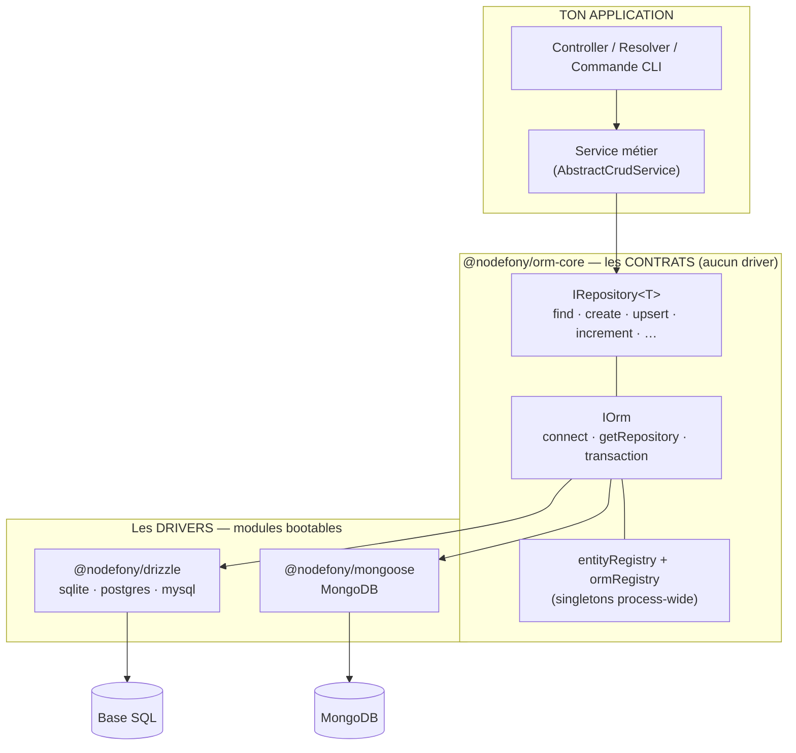
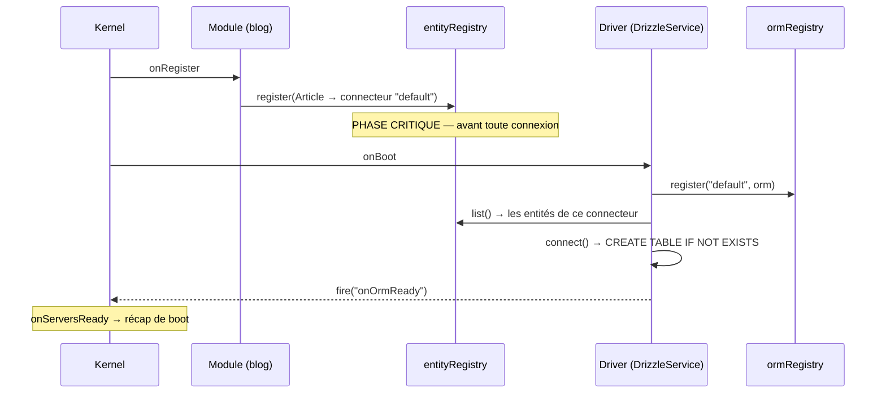

# @nodefony/orm-core — le contrat de persistance

> La **prise de courant** de la couche données : ton code métier branche `IRepository`, et
> derrière la prise il y a Drizzle (SQL) ou Mongoose (MongoDB) — sans que le métier le sache.
> `orm-core` ne contient **aucun** driver : il définit les contrats (`IOrm`, `IRepository`,
> `IEntity`, `ITransaction`), les registres qui les relient, les critères de recherche portables,
> la pagination et le socle CRUD. Promesse tenue : **changer d'ORM sans réécrire le métier**.

📍 [Documentation](../../../../../docs/index.md) › **ORM — le socle**

## 🧠 Schéma général



Une lecture en une phrase : **le métier ne parle qu'aux contrats du milieu** ; les drivers du bas
sont interchangeables, et les registres savent quel driver sert quelle entité.

## 🧭 Par où commencer

Trois parcours selon ce que tu viens faire. L'ordre compte — chaque étape suppose la précédente.

**Je persiste ma première table** — je n'ai encore rien en base.

1. [Créer une entité, de zéro à `find()`](tutorial-entity.md) — le pas-à-pas complet, sans rien
   supposer connu. **Commence là si tu débutes.**
2. La section [🚀 Démarrage rapide](#-démarrage-rapide) de cette page — la même chose en condensé,
   copiable telle quelle.
3. [`@nodefony/drizzle`](../../drizzle/docs/index.md) — le driver SQL par défaut : où se déclare le
   connecteur, quels dialectes, comment se crée la table.

**J'écris des requêtes qui tiennent** — je sais persister, je veux interroger correctement.

1. [🔎 Les critères de recherche](#-les-critères-de-recherche) — l'égalité, les opérateurs `$`, et
   le piège du `null` en SQL.
2. [📄 Pagination portable](#-pagination-portable) — pourquoi `paginate()` évite le `COUNT(*)`.
3. [⚙️ Le socle CRUD](#-le-socle-crud--abstractcrudservice) — mettre la logique dans un service,
   pas dans un controller.
4. [🧰 Les contrats](#-les-contrats--la-surface-publique) — la liste complète des verbes, et lequel
   choisir (`updateOne` vs `updateMany` vs `upsert`).

**Je choisis mon backend / j'en branche un nouveau** — décision d'architecture.

1. [🗄️ Backends pris en charge](#-backends-pris-en-charge) — ce que couvre chaque driver, et ce
   qu'il ne couvre **pas** (choix assumé, pas un manque).
2. [🧩 Extension](#-extension--brancher-son-propre-driver) — le contrat minimal d'un adapter.
3. [ADR-0003](../../../../../docs/adr/0003-orm-core-abstraction-repository-multi-orm.md) — les
   risques de l'abstraction, écrits **avant** qu'elle ne soit validée.
4. [Guide persistance](../../../../../docs/guides/persistence.md) — déclarer l'infra d'une app
   complète (base, stores de session, migrations).

## 🗂️ Le catalogue

Choisir en cinq secondes avec le tableau, puis lire la card correspondante.

<!-- prettier-ignore -->
| Page | À quoi ça sert | Tu en as besoin quand… |
| --- | --- | --- |
| [Créer une entité](tutorial-entity.md) | déclarer une table et lire/écrire dedans | tu pars de zéro |
| [`@nodefony/drizzle`](../../drizzle/docs/index.md) | le driver SQL (sqlite, postgres, mysql) | ton application stocke en SQL — le cas par défaut |
| [`@nodefony/mongoose`](../../mongoose/docs/index.md) | le driver MongoDB | ton modèle est documentaire |
| [Configuration Mongoose](../../mongoose/docs/configuration.md) | connecteurs, options du driver Mongo | tu branches un cluster Mongo réel |
| [Guide persistance](../../../../../docs/guides/persistence.md) | déclarer l'infra d'une app (base, stores, secrets) | tu prépares un déploiement |
| [Stockage de session](../../../../../docs/guides/session-storage.md) | où vivent les sessions HTTP | tu passes de la mémoire à une base partagée |
| [ADR-0003](../../../../../docs/adr/0003-orm-core-abstraction-repository-multi-orm.md) | pourquoi Repository, et à quel prix | tu remets l'abstraction en question (légitime) |

```nodefony-cards
[
  { "icon": "🚀", "title": "tutorial-entity", "href": "tutorial-entity.md", "featured": true,
    "desc": "Ta première table, pas à pas : les trois mots à connaître (connecteur, entité, repository), le schéma Drizzle, l'enregistrement, puis le CRUD complet. Il ne suppose rien de connu.",
    "meta": "dix minutes — prends-le avant cette page si « repository » ne t'évoque rien" },
  { "icon": "🐘", "title": "@nodefony/drizzle", "href": "../../drizzle/docs/index.md",
    "desc": "Le driver SQL par défaut : l'implémentation de référence des contrats décrits ici, en SQL type-safe — sqlite (zéro installation, le défaut de développement), postgres et mysql. C'est lui qui crée les tables au boot, alimente la sonde de flux et fournit les colonnes de l'ERD Studio.",
    "meta": "le driver que tu auras par défaut en générant une application" },
  { "icon": "🍃", "title": "@nodefony/mongoose", "href": "../../mongoose/docs/index.md",
    "desc": "Le driver MongoDB : la même surface IRepository, sur un modèle documentaire — schémas Mongoose, populate pour les relations déclarées, $max/$min natifs pour l'upsert.",
    "meta": "il porte les stores dont un déploiement Mongo a besoin — liste exacte en « Backends pris en charge »" },
  { "icon": "🗄️", "title": "persistence", "href": "../../../../../docs/guides/persistence.md",
    "desc": "L'infra vue de l'application : comment une application déclare sa base (variables d'environnement, secrets), quels modules se câblent automatiquement dessus, et ce qui change entre développement et production.",
    "meta": "transverse — à lire quand tu quittes le SQLite de développement" }
]
```

## 📖 Lexique

| Terme            | Sens                                                                                                                |
| ---------------- | ------------------------------------------------------------------------------------------------------------------- |
| ORM              | _Object-Relational Mapping_ : la bibliothèque qui traduit tes objets en lignes de base (Drizzle, Mongoose).         |
| Repository       | Objet qui lit/écrit une collection d'entités. Ici : `IRepository<T>`, la seule surface que voit le métier.          |
| Entité           | La description d'une table/collection : un nom logique, un schéma natif, un connecteur cible.                       |
| Connecteur       | Le **nom** d'une connexion déclarée en config (`"default"`, `"analytics"`) — jamais le nom d'un moteur.             |
| Driver / adapter | Le module qui implémente les contrats pour un moteur donné (`@nodefony/drizzle`, `@nodefony/mongoose`).             |
| Dialecte         | La variante SQL d'un même driver : `sqlite`, `postgres`, `mysql`.                                                   |
| Critère          | Le filtre d'une requête : `{ email: "a@b.c" }` (égalité) ou `{ age: { $gte: 18 } }` (opérateurs).                   |
| Upsert           | « insère **ou** met à jour » en une seule instruction atomique, sur conflit de clé unique.                          |
| Eager-load       | Charger les entités liées **dans la même requête** que l'entité principale (`{ relations: [...] }`).                |
| Transaction      | Groupe d'écritures tout-ou-rien : `commit` valide l'ensemble, `rollback` annule l'ensemble.                         |
| Savepoint        | Point de reprise **à l'intérieur** d'une transaction : on annule jusque-là sans tout perdre.                        |
| DDL              | _Data Definition Language_ : le SQL qui crée/modifie les tables (`CREATE TABLE`, `ALTER`).                          |
| DBML             | _Database Markup Language_ : format texte de schéma, lisible par les outils d'ERD.                                  |
| ERD              | _Entity-Relationship Diagram_ : le schéma visuel des tables et de leurs liens (écran Studio).                       |
| EWMA             | _Exponentially Weighted Moving Average_ : moyenne qui privilégie le récent — utilisée pour la latence des requêtes. |
| 2PC              | _Two-Phase Commit_ : protocole de transaction répartie sur plusieurs bases. **Non garanti** ici.                    |
| Ports & adapters | Architecture dite hexagonale : le cœur définit des prises (ports), l'extérieur fournit les fiches (adapters).       |

## Qu'est-ce que c'est ?

Une **prise normalisée** entre ton code métier et la base de données.

Sans elle, ton service appelle directement Drizzle : `db.select().from(users).where(eq(users.id, x))`.
Ça marche — jusqu'au jour où l'application doit passer sur MongoDB, ou simplement changer de version
majeure d'ORM. Alors chaque service, chaque controller, chaque commande CLI est à réécrire, parce que
la syntaxe du moteur a fui partout dans le métier.

`orm-core` interpose un contrat : le métier écrit `articles.find({ views: { $gte: 100 } })`, et
c'est le **driver** qui traduit — en `gte()` Drizzle, en `$gte` Mongo. Le vocabulaire du moteur ne
franchit jamais la frontière.

C'est le patron **Repository** (une collection d'entités qu'on interroge), monté en **ports &
adapters** : `orm-core` publie les ports, les drivers fournissent les adapters. Conséquence
structurante — `orm-core` **n'importe aucun driver**, et ne peut pas en importer : c'est ce qui
garantit que la dépendance va bien du concret vers l'abstrait, et jamais l'inverse.

> [!NOTE]
> `orm-core` n'est **pas un module bootable** : pas de classe `Module`, rien à mettre dans
> `modules: [...]`. C'est une bibliothèque pure. Les modules, ce sont les **drivers** — ce sont eux
> qui s'enregistrent dans `ormRegistry` (`OrmRegistry.ts:88`) à leur démarrage.

## La vision Nodefony

Trois partis pris expliquent la forme exacte de l'API, et ils méritent d'être connus avant de
l'utiliser.

**1. La portabilité visée est celle du TEMPS, pas de l'espace.** L'objectif officiel est de pouvoir
changer d'ORM au fil des années sans réécrire le métier — pas de faire tourner quatre ORM
simultanément. Le multi-connecteur reste possible (`analytics` à côté de `default`), mais ce n'est
pas ce qui justifie l'API. C'est écrit noir sur blanc dans
[l'ADR-0003](../../../../../docs/adr/0003-orm-core-abstraction-repository-multi-orm.md), risque n°2 —
sur-dimensionner pour ce cas serait une erreur.

**2. L'abstraction assume de ne pas tout couvrir — et fournit la trappe.** Une jointure arbitraire,
une CTE, une fonction fenêtre : ça ne se porte pas d'un moteur SQL à MongoDB. Plutôt que d'inventer
un langage de requête maison, `IOrm.getNativeConnection()` (`IOrm.ts:51`) rend la connexion brute du
driver. Le contrat est honnête : **plus tu recours à la trappe, moins ton code est portable** — et
tu le sais en l'écrivant, parce que l'appel est visible.

**3. Une erreur doit se produire à l'identique sur tous les drivers.** C'est le point le plus subtil.
Un critère qui référence un champ inexistant (`{ emial: "…" }`) serait **ignoré** par Drizzle — la
condition disparaît, la requête rend **toute** la table — et **conservé** par Mongoose, qui rend
**zéro** résultat. Le même code, deux comportements opposés, aucune erreur : la promesse de
portabilité s'effondre en silence. D'où `UnknownCriteriaField` (`errors.ts:23`), levée **par les deux
drivers** : on échoue tôt, et pareil.

**4. Le contrat va plus loin que le CRUD scolaire.** `IRepository` (`IRepository.ts:197`) porte
quinze verbes, pas cinq : les opérations **atomiques** (`upsert`, `increment`, `updateOne`,
`findOneAndDelete`) sont dans le contrat parce qu'un `SELECT` suivi d'un `UPDATE` est une **course**,
et qu'une course en base ne se rattrape pas côté application.

## 🚀 Démarrage rapide

Vu d'une application générée par `nodefony create app`. Trois fichiers, et une base qui répond.

### 1. Déclarer la connexion

Le driver et la cible physique vivent dans la config, **jamais** dans l'entité — c'est ce qui rend le
changement de moteur indolore.

```ts
// nodefony.config.ts — un seul connecteur, en SQLite : zéro installation.
export default defineConfig(() => ({
  modules: [
    "@nodefony/framework",
    use("@nodefony/drizzle", {
      connectors: {
        // "default" est le NOM de la connexion, pas celui du moteur.
        default: { dialect: "sqlite", filename: "nodefony/databases/app.db" },
      },
    }),
  ],
}));
```

### 2. Décrire l'entité, et la déclarer au module

`defineEntity()` (`defineEntity.ts:48`) n'a **aucun effet de bord** : importer ce fichier n'inscrit
rien. C'est le décorateur `entities()` (`entitiesDecorator.ts:56`) posé sur le module qui inscrit la
liste, à la phase `onRegister` — avant que le connecteur n'ouvre et ne crée les tables.

```ts
// src/modules/blog/index.ts
import { randomUUID } from "node:crypto";
import { integer, sqliteTable, text } from "drizzle-orm/sqlite-core";
import { Module } from "nodefony";
import { defineEntity, entities } from "@nodefony/orm-core";

// Le schéma est du Drizzle NATIF : tous les types du moteur restent disponibles.
export const articleTable = sqliteTable("Article", {
  id: text("id")
    .primaryKey()
    .$defaultFn(() => randomUUID()),
  title: text("title").notNull(),
  // Défaut posé côté JS : le DDL dérivé n'émet pas les DEFAULT SQL.
  views: integer("views")
    .notNull()
    .$defaultFn(() => 0),
  publishedAt: integer("publishedAt"), // null = brouillon
});

/** Une ligne d'`Article`, telle que la rend le repository. */
export interface ArticleRow {
  id: string;
  title: string;
  views: number;
  publishedAt: number | null;
}

// Pas de `connector` ici : il est résolu au boot (défaut `"default"`).
export const ArticleEntity = defineEntity({
  name: "Article",
  module: "blog",
  schema: articleTable,
});

@entities([ArticleEntity])
class Blog extends Module {}

export default Blog;
```

### 3. Lire et écrire

Le repository s'obtient par le registre (ou par injection dans un controller). À partir de là, plus
une ligne de code ne nomme Drizzle.

```ts
// nodefony/service/ArticleService.ts
import { AbstractCrudService, ormRegistry, paginate } from "@nodefony/orm-core";
import type { IRepository } from "@nodefony/orm-core";

/** Le type de ligne exporté à côté de l'entité (rappelé ici pour l'extrait). */
interface ArticleRow {
  id: string;
  title: string;
  views: number;
  publishedAt: number | null;
}

/** Le métier vit dans le service — REST, WebSocket et CLI l'appellent tous. */
export class ArticleService extends AbstractCrudService<ArticleRow> {
  constructor(repository: IRepository<ArticleRow>) {
    super("articleService", repository);
  }
}

export async function demo(): Promise<void> {
  const articles = ormRegistry
    .get("default")
    .getRepository<ArticleRow>("Article");

  await articles.create({ title: "Bonjour" });

  // `$null: true` → IS NULL. Une égalité `= NULL` serait toujours fausse en SQL.
  const brouillons = await articles.find({ publishedAt: { $null: true } });

  // Compteur atomique : jamais de lecture-modification-écriture, donc jamais de course.
  await articles.increment({ title: "Bonjour" }, { views: 1 });

  // Une page, sans jamais matérialiser toute la table.
  const page = await paginate(articles, {
    limit: 20,
    order: [["views", "DESC"]],
  });

  console.log(brouillons.length, page.total, page.hasNext);
}
```

### Ce qu'on observe

Au démarrage, le driver crée la table et le récap de boot annonce la connexion
(`reportOrmBootLines()`, `ormWiring.ts:60`). Le data plane confirme depuis l'extérieur :

```bash
# Les connecteurs enregistrés et leur état
curl -s http://localhost:5151/nodefony/orm/api/orms
# [{"name":"default","default":true,"connected":true,"entityCount":1}]

# Le modèle canonique : colonnes + relations, tel que l'ERD Studio le consomme
curl -s http://localhost:5151/nodefony/orm/api/entity/Article

# Le nombre de lignes par entité (un COUNT(*) par table, à la demande)
curl -s http://localhost:5151/nodefony/orm/api/counts
# {"Article":1}
```

## 🏗️ Architecture interne

Deux registres, un cycle de vie. Tout le reste en découle.



**`entityRegistry`** (`EntityRegistry.ts:147`) indexe les entités à **deux** niveaux — nom puis
connecteur — parce qu'une même entité logique (`User`) peut vivre sur plusieurs connexions. Demander
`get("User")` sans préciser le connecteur alors que deux le portent **lève** plutôt que de deviner
(`EntityRegistry.get()`, `EntityRegistry.ts:54`). Le stockage est un `Object.create(null)` alloué
**au premier enregistrement** : une application sans base ne paie rien.

**`ormRegistry`** (`OrmRegistry.ts:88`) associe un nom de connexion à son instance `IOrm`. Un doublon
de nom **lève** (`OrmRegistry.register()`, `OrmRegistry.ts:26`) : deux connexions homonymes seraient
un bug silencieux, jamais une intention.

**La phase d'inscription est le piège n°1.** Les connecteurs se branchent à `onBoot` et créent les
tables à ce moment. Inscrire une entité à `onBoot` la met donc en **course** avec `connect()` : selon
l'ordre des écouteurs, la table existe ou non. `entities()` s'accroche à `onRegister`
(`entitiesDecorator.ts:66`), strictement antérieur — sûr par construction. C'est la différence de
comportement avec `@controllers`, qui lui reste à `onBoot`.

**`Orm.connect()`** (`Orm.ts:54`) est une **template method** : elle mesure la latence, alimente le
moniteur de connexion, puis émet `onOrmReady`. Un adapter surcharge `onConnect()` (`Orm.ts:74`), et
**jamais** `connect()` — sinon l'événement et l'instrumentation disparaissent.

## 🧰 Les contrats — la surface publique

Quatre interfaces. Les signatures exactes vivent dans le graphe généré
(`jq '.symbols.IRepository' .ai/symbols.json`) — elles ne sont pas recopiées ici, elles
divergeraient.

### [`IOrm`](../../drizzle/docs/index.md) — une connexion logique

`IOrm` (`IOrm.ts:12`) représente **une** connexion nommée. Il ouvre et ferme
(`connect`/`disconnect`), rend les repositories (`IOrm.getRepository()`, `IOrm.ts:33`), ouvre une
transaction (`IOrm.transaction()`, `IOrm.ts:41`) et expose la trappe native
(`IOrm.getNativeConnection()`, `IOrm.ts:51`).

Quatre méthodes sont **optionnelles** — un adapter qui ne les implémente pas dégrade proprement au
lieu d'échouer : `describeEntity()` (`IOrm.ts:61`, colonnes pour l'ERD), `describeConnection()`
(`IOrm.ts:71`, driver et cible **sans credential**), `ping()` (`IOrm.ts:82`, aller-retour réel) et
`probe()` (`IOrm.ts:92`, métriques driver, qui ne doit **jamais** lever).

### [`IRepository`](tutorial-entity.md) — les quinze verbes

`IRepository<T>` (`IRepository.ts:197`) est la seule surface que ton métier devrait connaître. Les
verbes se choisissent sur **la garantie** qu'ils apportent, pas sur leur nom.

| Verbe                 | Ce qu'il garantit                                                    | Ancre                        |
| --------------------- | -------------------------------------------------------------------- | ---------------------------- |
| `find` / `findOne`    | lecture filtrée + eager-load + tri + bornes                          | `IRepository.ts:213`         |
| `count` / `exists`    | compter, ou juste savoir s'il y en a un (sans charger de colonne)    | `IRepository.ts:378`, `:335` |
| `create`              | insertion d'une ligne, rend la version persistée (id, défauts)       | `IRepository.ts:223`         |
| `createMany`          | N lignes en **une** requête — seed, import, ingestion par lots       | `IRepository.ts:235`         |
| `updateOne`           | met à jour **au plus une** ligne, **atomiquement**, et la rend       | `IRepository.ts:231`         |
| `updateMany`          | met à jour toutes les lignes du critère, rend le **nombre**          | `IRepository.ts:295`         |
| `upsert`              | insère **ou** met à jour sur conflit de clé, en **une** instruction  | `IRepository.ts:258`         |
| `increment`           | `SET f = f + ?` atomique — compteurs, quotas, rate-limit             | `IRepository.ts:287`         |
| `delete`              | supprime tout ce qui matche, rend le nombre                          | `IRepository.ts:298`         |
| `deleteOne`           | supprime **au plus une** ligne, rend un booléen                      | `IRepository.ts:328`         |
| `findOneAndDelete`    | supprime **et rend** la ligne — file de jobs, outbox, `pop` atomique | `IRepository.ts:317`         |
| `withTransaction(tx)` | une **vue** du repository liée à une transaction                     | `IRepository.ts:389`         |

> [!IMPORTANT]
> `updateOne` est atomique **par construction** : une seule requête (`UPDATE … RETURNING` en SQL,
> `findOneAndUpdate` en Mongo), jamais un `UPDATE` suivi d'une relecture. La différence n'est pas
> cosmétique : la relecture rendrait `null` **à tort** dès que le critère porte sur un champ qu'on
> vient de modifier — `updateOne({ status: "pending" }, { status: "done" })` ne retrouve plus rien
> après coup (`IRepository.ts:221`).

Quelques usages, un par garantie :

```ts ignore
// Insertion par lots : une seule requête, l'ordre est conservé.
await articles.createMany([{ title: "A" }, { title: "B" }]);

// Existence sans charger la ligne (ni compter la table).
if (await articles.exists({ title: "A" })) {
  /* … */
}

// Claim-and-remove : on prend le job ET on le retire, sans que deux workers l'obtiennent.
const job = await jobs.findOneAndDelete({ status: "queued" });

// Upsert : le seuil ne recule jamais, même sur deux appels simultanés.
await quotas.upsert(
  { userId },
  { seuil: { $max: Date.now() } },
  { createdAt: Date.now() },
);
```

L'`upsert` mérite une note. Son `DO UPDATE` est **inconditionnel** — MySQL n'accepte pas de `WHERE`
sur `ON DUPLICATE KEY UPDATE`. Une valeur qui ne doit jamais régresser porte donc sa condition
**dans la valeur écrite**, via `UpdateOperators` (`IRepository.ts:94`) : `$max`/`$min` se traduisent
en `MAX()` (sqlite), `GREATEST()` (postgres, mysql) ou `$max` natif (Mongo) — **une** instruction
atomique sur les quatre backends.

### [`IEntity`](tutorial-entity.md) — la description d'une table

`IEntity` (`IEntity.ts:37`) porte un nom logique, un `connector` (le nom d'une **connexion**, jamais
d'un moteur), un `schema` natif du driver, et des `relations` déclaratives (`IEntityRelation`,
`IEntity.ts:4`). Deux champs facultatifs servent la lisibilité d'un gros modèle : `module` (qui
apporte l'entité) et `domain` (`IEntity.ts:58`, la classification métier — l'axe qui rend navigable
une base de plusieurs centaines de tables).

Dans une application, on ne construit pas un `IEntity` à la main : on écrit un `IEntityDefinition`
(`defineEntity.ts:15`) — le même objet **sans** `connector`, justement parce que le connecteur est
une donnée de configuration, résolue au boot.

### [`ITransaction`](../../drizzle/docs/index.md) — tout ou rien

`ITransaction` (`ITransaction.ts:8`) expose `commit`, `rollback`, `savepoint` (`ITransaction.ts:20`),
`rollbackTo` et la trappe `getNative`. En pratique on ne l'appelle presque jamais directement : on
passe par `IOrm.transaction()`, qui valide si le travail se résout et annule s'il lève.

```ts ignore
await orm.transaction(async (tx) => {
  const auteur = await users.withTransaction(tx).create({ email: "x@y.z" });
  await articles
    .withTransaction(tx)
    .create({ title: "Hello", userId: auteur.id });
  // une exception ici ⇒ rollback des DEUX écritures ; sinon commit automatique
});
```

`withTransaction(tx)` rend une **vue** du repository, pas un état global : rien n'est stocké dans un
contexte implicite, donc deux transactions concurrentes ne peuvent pas se mélanger.

> [!WARNING]
> Une transaction porte sur **un seul** connecteur. Les transactions réparties (2PC) ne sont pas
> garanties : écrire dans `default` et `analytics` dans un même `transaction()` ne donne aucune
> atomicité entre les deux (`ITransaction.ts:5`).

## 🔎 Les critères de recherche

Un critère est un objet. Chaque clé est un champ ; chaque valeur est soit une **égalité**, soit un
objet d'**opérateurs**.

```ts ignore
await articles.find({ title: "Hello" }); // égalité
await articles.find({ views: { $gte: 100, $lt: 1000 } }); // deux opérateurs = ET
await articles.find({ id: { $in: ids } }); // appartenance
await articles.find({ title: { $like: "Hel%" } }); // motif SQL
await articles.find({ publishedAt: { $null: false } }); // IS NOT NULL
```

Les dix opérateurs reconnus sont figés dans `OPERATOR_KEYS` (`criteria.ts:13`) — source unique
partagée par tous les adapters : `$eq $ne $gt $gte $lt $lte $in $nin $like $null`. Plusieurs
opérateurs sur un même champ se combinent en **ET**.

**Le `null` est le piège que le contrat désamorce.** En SQL, `colonne = NULL` est **toujours faux** :
un filtre « la colonne est vide » écrit naïvement ne matcherait jamais rien, sans erreur. Deux formes
équivalentes le résolvent — la valeur nue `{ publishedAt: null }` et l'opérateur
`{ publishedAt: { $null: true } }` (`IRepository.ts:65`), qui produisent tous deux un `IS NULL`. La
valeur nue n'est d'ailleurs **ouverte par le typage que si le champ est nullable** (`FieldCriteria`,
`IRepository.ts:128`) : chercher `IS NULL` sur une colonne non-nullable est une erreur de
raisonnement, et le compilateur la refuse.

**Comment un objet est reconnu comme filtre plutôt que comme valeur** : `isFieldOperators()`
(`criteria.ts:42`) ne l'interprète que si **toutes** ses clés sont des opérateurs connus. Une colonne
JSON ou un sous-document (`{ meta: { auteur: "…" } }`) reste donc une égalité — c'est ce qui évite
qu'une donnée métier soit prise pour une requête.

**Ce que le critère ne couvre pas** : les `OR` logiques, les sous-requêtes, les agrégats, les
jointures arbitraires. Ce n'est pas un oubli — c'est la limite du portable, et la sortie est
`getNativeConnection()`. L'erreur `UnknownCriteriaField` (`errors.ts:23`) le dit d'ailleurs
explicitement dans son message, avec la liste des champs connus de l'entité (diagnostic d'une faute
de frappe).

## 📄 Pagination portable

`paginate()` (`paginate.ts:47`) construit une page **au-dessus** des primitives que tout adapter
implémente déjà (`find` avec `limit`/`offset`/`order`, et `count`). Aucun driver n'a eu à changer.

Deux décisions le rendent utilisable sur une grosse table :

1. **`hasNext` sans `COUNT`** — on demande `limit + 1` lignes ; si la ligne supplémentaire arrive,
   il y a une suite, et on la retire du résultat.
2. **`total` optionnel** — le `COUNT(*)` est coûteux, il n'est payé que si `withTotal` n'est pas
   `false`. C'est la distinction « Page » (avec total) et « Slice » (sans), reprise de Spring Data.

Les bornes sont normalisées plutôt que propagées : un `limit` de `0` ou un `offset` négatif est
ramené dans le domaine valide (`paginate.ts:28`) — un `find({ limit: 0 })` a un comportement qui
dépend du dialecte, donc on ne le laisse pas sortir.

Le contrat de page lui-même (`IPage`, `IPageQuery`) vit dans le **cœur**
(`src/nodefony/src/types/IPage.ts:22`), pas ici : il est partagé par tous les stores paginés du
framework (sessions HTTP, jetons, audit…). `orm-core` ne fait que l'enrichir du `criteria` typé, sous
le nom `PageQuery` (`IPage.ts:18`).

## ⚙️ Le socle CRUD — `AbstractCrudService`

Une classe à étendre pour que chaque entité expose son CRUD **de la même manière**, et qu'il n'y ait
qu'un seul endroit à modifier quand la règle métier change.

```ts ignore
export class ArticleService extends AbstractCrudService<ArticleRow> {
  constructor(repository: IRepository<ArticleRow>) {
    super("articleService", repository);
  }

  /** Valide avant insertion : un rejet devient un 422, quel que soit le transport. */
  protected override beforeCreate(
    data: Partial<ArticleRow>,
  ): Partial<ArticleRow> {
    return createArticleSchema.parse(data) as Partial<ArticleRow>;
  }
}
```

`AbstractCrudService` (`AbstractCrudService.ts:37`) sépare volontairement deux régimes :

- **Lectures** (`find`, `findOne`, `findById`, `count`, `findPage`) — **délégation pure**. Aucun
  hook, aucun événement : c'est le chemin chaud, il ne doit rien payer.
- **Mutations** (`create`, `updateOne`, `delete`) — encadrées par des hooks _template method_
  (`beforeCreate`, `AbstractCrudService.ts:185`, et ses six frères) puis un événement de cycle de vie
  `onCreated` / `onUpdated` / `onDeleted`, **émis seulement si la mutation a eu lieu**
  (`AbstractCrudService.ts:167`). L'audit, l'invalidation de cache ou une notification Studio s'y
  abonnent sans toucher au service.

`findPage()` (`AbstractCrudService.ts:110`) est la primitive à utiliser pour **toute** liste
d'administration : elle ne charge qu'une page, quelle que soit la taille de la table.

> [!WARNING]
> Ce service est un **singleton** partagé (il étend `Service`, donc l'injection l'instancie une
> fois). C'est légitime **parce qu'il est sans état** : ne jamais écrire `this.currentUser = …`
> pendant une requête. L'utilisateur courant, le tenant, la transaction voyagent dans le contexte —
> jamais sur l'instance.

## 🗄️ Backends pris en charge

Deux drivers implémentent les contrats. Le contrat `IRepository` est tenu **en entier** par les
deux : les quinze verbes existent des deux côtés — par exemple l'upsert, avec
`DrizzleRepository.upsert()` (`DrizzleRepository.ts:868`) et `MongooseRepository.upsert()`
(`MongooseRepository.ts:314`).

| Capacité                               | `@nodefony/drizzle`                 | `@nodefony/mongoose`               |
| -------------------------------------- | ----------------------------------- | ---------------------------------- |
| Moteurs                                | SQLite, PostgreSQL, MySQL / MariaDB | MongoDB                            |
| Contrat `IRepository` (15 verbes)      | complet                             | complet                            |
| Eager-load `{ relations }`             | oui                                 | oui (`populate`)                   |
| Transactions + savepoints              | oui                                 | oui (replica set requis par Mongo) |
| Colonnes pour l'ERD (`describeEntity`) | oui (`DrizzleOrm.ts:1171`)          | oui (`MongooseOrm.ts:395`)         |
| Sonde de flux (requêtes/s, lentes)     | oui — alimente `queryFlowMonitor`   | non câblée                         |
| Sonde profonde (`probe`)               | oui (`DrizzleOrm.ts:1073`)          | oui (`MongooseOrm.ts:366`)         |

**Les « stores » du framework, eux, ne sont pas alignés — et c'est un choix.** Un adapter déclare ce
qu'il porte dans son `package.json`, clé `nodefony.stores` :

| Store         | drizzle | mongoose |
| ------------- | ------- | -------- |
| `session`     | ✅      | ✅       |
| `user`        | ✅      | ✅       |
| `tokens`      | ✅      | ✅       |
| `passkeys`    | ✅      | ✅       |
| `webhooks`    | ✅      | ✅       |
| `totp`        | ✅      | —        |
| `audit`       | ✅      | —        |
| `idempotency` | ✅      | —        |

> [!NOTE]
> La couverture est **adaptée à la nature de chaque backend**, ce n'est pas une parité SQL × NoSQL à
> atteindre. Un store d'idempotence veut une contrainte d'unicité et un `ON CONFLICT` — le terrain du
> SQL. Lire ce tableau comme « mongoose est incomplet » serait un contresens : il porte exactement ce
> qu'un déploiement Mongo attend de lui. La liste fait autorité côté code
> (`@nodefony/drizzle/package.json`, clé `nodefony.stores`) — elle n'est pas un commentaire.

## 🧩 Extension — brancher son propre driver

Le contrat minimal tient en peu de choses, parce que `orm-core` fournit déjà la plomberie.

1. **Étendre `Orm`** (`Orm.ts:29`) : implémenter `onConnect()`, `disconnect()`, `isConnected()`,
   `getRepository()`, `transaction()`, `getNativeConnection()`. L'enregistrement dans `ormRegistry`
   est fait par le constructeur de base — il n'y a rien à écrire. **Ne jamais surcharger
   `connect()`** : c'est la template method qui émet `onOrmReady` et instrumente la latence.
2. **Implémenter `IRepository<T>`** en traduisant les critères. `isFieldOperators()` (`criteria.ts:42`)
   et `isUpdateOperators()` (`criteria.ts:87`) sont fournis pour que la détection soit **identique**
   partout — les réécrire, c'est fabriquer une divergence.
3. **Lever `UnknownCriteriaField`** (`errors.ts:23`) sur un champ inconnu. C'est le prix de la
   promesse de portabilité.
4. **Câbler le data plane** en une ligne à `onKernelBoot` : `wireOrmAdminPlane(this.kernel)`
   (`ormWiring.ts:31`) monte les routes admin, la santé et le diagnostic riche. Et
   `resolveOrmFlowEnabled(kernel)` (`ormWiring.ts:96`) décide si la sonde de flux s'allume — hors
   production par défaut, `NF_ORM_FLOW=1` force.
5. **Déclarer les capacités** dans `package.json` (`nodefony.storeKind`, `nodefony.stores`) : c'est
   ainsi que le framework sait ce que ton adapter sait faire.

Les méthodes optionnelles d'`IOrm` (`describeEntity`, `describeConnection`, `ping`, `probe`)
s'ajoutent ensuite : sans elles l'adapter fonctionne, il est simplement moins observable.

## 📡 Observabilité — Studio

Deux sondes **indépendantes**, et un data plane qui les expose. La séparation est délibérée : mesurer
la santé ne doit pas coûter le débit, et observer le débit ne doit pas réveiller la base.

**`connectionMonitor`** (`ConnectionMonitor.ts:197`) suit le **cycle de vie** d'une connexion :
première connexion, reconnexions, erreurs récentes, et une fenêtre de latence de ping
(`ConnectionMonitor.recordPing()`, `ConnectionMonitor.ts:106`). Il est alimenté par `Orm.connect()`
sans que l'adapter ait à y penser.

**`queryFlowMonitor`** (`QueryFlowMonitor.ts:146`) suit le **débit** : total de requêtes, latence
moyenne et EWMA, pire latence, et un anneau borné à vingt requêtes lentes. Trois propriétés le
rendent sûr en production :

- **éteint par défaut** — `enabled = false` : coût nul tant qu'on ne l'allume pas ;
- **lazy** — la table de statistiques n'est allouée qu'au premier enregistrement ;
- **le SQL n'est capté que sur le chemin lent** (`QueryFlowMonitor.record()`, `QueryFlowMonitor.ts:101`) :
  jamais de sérialisation de requête au cas nominal ;
- **aucune persistance** — tout est en mémoire vive. Une sonde n'écrit jamais dans la base qu'elle
  observe, et le débit par seconde est **dérivé côté lecteur** (delta entre deux relevés), donc rien
  n'est muté à la lecture.

Le data plane `/nodefony/orm/api/*` (`createOrmAdminApi()`, `OrmAdminApi.ts:421`) expose huit points
d'entrée, tous filtrables par `?connector=` :

| Point d'entrée      | Ce qu'il rend                                                     |
| ------------------- | ----------------------------------------------------------------- |
| `orms`              | les connecteurs, leur état, leur nombre d'entités                 |
| `entities`          | le modèle complet : colonnes + relations                          |
| `entity/{name}`     | une entité (404 si inconnue)                                      |
| `graph`             | le graphe canonique (`buildOrmGraph()`, `OrmAdminApi.ts:114`)     |
| `counts`            | le nombre de lignes par entité — un `COUNT(*)` par table          |
| `connection/health` | état, latence, erreurs, reconnexions, sondes                      |
| `flow`              | débit et requêtes lentes (`buildOrmFlow()`, `OrmAdminApi.ts:240`) |
| `export/{format}`   | `dbml` (`toDbml()`, `OrmAdminApi.ts:275`) ou `jsonschema`         |

Ce graphe canonique est **la pièce maîtresse**, pas le diagramme : c'est une donnée sérialisable qui
sert à la fois l'ERD de Studio, un export vers un outil tiers, et le contexte d'un agent IA
(text-to-SQL, RAG). Le dessin n'en est qu'une projection.

Côté Studio, trois écrans le consomment : `/nodefony/orm` (vue d'ensemble), `/nodefony/orm/:pid`
(le détail d'un worker, en cluster) et `/nodefony/orm-entity` (le détail d'une entité).

## ⚡ Performance & mémoire

Le socle est conçu pour **ne rien coûter quand il ne sert pas**.

| Ce qui pourrait coûter     | Ce que fait `orm-core`                                                              |
| -------------------------- | ----------------------------------------------------------------------------------- |
| Registres au démarrage     | alloués au **premier** enregistrement (`EntityRegistry.ts:25`, `OrmRegistry.ts:27`) |
| Contrats                   | interfaces TypeScript — effacées à la compilation, zéro coût runtime                |
| Lectures d'un service CRUD | délégation directe : ni hook, ni événement sur le chemin chaud                      |
| Sonde de flux              | éteinte par défaut ; table allouée au premier relevé ; anneau des lentes borné à 20 |
| Sérialisation du SQL       | seulement sur le chemin **lent**, jamais au cas nominal                             |
| Comptage d'une page        | `COUNT(*)` évitable (`withTotal: false`), `hasNext` obtenu par `limit + 1`          |

Deux conséquences pratiques pour ton code : préférer `exists()` à `findOne() !== null` (aucune
colonne n'est chargée), et `increment()` à une lecture suivie d'une écriture (une requête au lieu de
deux, et pas de course).

## ⚠️ Pièges

| Symptôme                                                      | Cause                                                                                              | Correction                                                                                  |
| ------------------------------------------------------------- | -------------------------------------------------------------------------------------------------- | ------------------------------------------------------------------------------------------- |
| « no entity registered under "X" » au premier appel           | l'entité n'a jamais été inscrite (fichier importé mais `defineEntity` est sans effet de bord)      | l'ajouter à `@entities([...])` sur le module (`entitiesDecorator.ts:56`)                    |
| La table n'existe pas alors que l'entité est déclarée         | inscription faite à `onBoot` → course avec `connect()`                                             | inscrire à `onRegister` — c'est ce que fait `entities()` (`entitiesDecorator.ts:66`)        |
| « entity "User" exists on multiple connectors … specify one » | la même entité vit sur plusieurs connecteurs                                                       | préciser le connecteur : `entityRegistry.get("User", "analytics")` (`EntityRegistry.ts:69`) |
| Un filtre « champ vide » ne remonte jamais rien               | `colonne = NULL` est toujours faux en SQL                                                          | `{ champ: { $null: true } }` ou la valeur nue `{ champ: null }` (`IRepository.ts:65`)       |
| `UnknownCriteriaField` sur un champ qui existe « pourtant »   | faute de frappe, ou champ calculé absent du schéma                                                 | lire les champs connus dans le message ; pour du natif, passer par `getNativeConnection()`  |
| `updateOne` rend `null` alors que la ligne a bien changé      | ancien réflexe `UPDATE` + relecture (le critère porte sur le champ modifié)                        | utiliser `updateOne`, atomique par construction (`IRepository.ts:252`)                      |
| Un `upsert` écrase une valeur qui devait progresser           | le `DO UPDATE` est inconditionnel (contrainte MySQL)                                               | poser la condition **dans** la valeur : `{ seuil: { $max: v } }` (`IRepository.ts:94`)      |
| Un objet de critère est pris pour une égalité (colonne JSON)  | comportement **voulu** : une valeur n'est un filtre que si **toutes** ses clés sont des opérateurs | c'est la protection ; pour filtrer dedans, passer au natif (`criteria.ts:42`)               |
| `onOrmReady` ne part plus après un ajout dans l'adapter       | `connect()` a été surchargé                                                                        | surcharger `onConnect()` (`Orm.ts:74`), jamais `connect()`                                  |
| Une entité déclarée dans un module reste invisible            | le module embarque sa **propre copie** du registre (singleton dédoublé)                            | externaliser `@nodefony/orm-core` dans le `rolldown.config.ts` du module                    |
| Rien dans `flow` alors que la base travaille                  | la sonde est éteinte hors développement, ou le driver n'a pas de tap                               | `NF_ORM_FLOW=1` (`ormWiring.ts:96`) ; le tap n'est câblé que côté Drizzle                   |

## 🧪 Tests & couverture

Les compteurs de cette page sont **recomptés à chaque génération** — jamais figés dans le texte. Ils
portent sur les tests **unitaires** du socle : `tests/unit/**` couvre les deux registres, les
critères, la pagination, le service CRUD, les décorateurs, les deux moniteurs, le câblage et le data
plane.

**Ce que ces tests prouvent** : la logique pure du socle, sans base de données. C'est cohérent —
`orm-core` ne contient aucun driver, donc rien à connecter.

**Ce qu'ils ne prouvent pas, et où c'est prouvé.** Le contrat `IRepository` n'a de sens qu'exécuté
sur une vraie base. Cette preuve vit chez les drivers, sous forme de **bancs de contrat** — une même
suite rejouée par dialecte :

- `@nodefony/drizzle` — `tests/integration/repository-contract.ts` est le banc commun, rejoué par
  `repository-contract-sqlite.test.ts` (toujours exécuté, base en mémoire),
  `repository-contract-postgres.e2e.test.ts` et `repository-contract-mysql.e2e.test.ts` ;
- `@nodefony/mongoose` — `tests/integration/orm-core-mongoose.test.ts` exerce le même contrat côté
  documentaire.

> [!WARNING]
> **Un compteur vert ne prouve pas qu'une base a été touchée.** Les bancs sur serveur réel se
> **skippent** quand leur variable d'infra est absente — et un test skippé compte comme vert.
> PostgreSQL exige `NF_PG_URL`, MySQL/MariaDB `NF_MYSQL_URL`, MongoDB `NF_MONGO_TEST_URI`. La source
> unique de ces variables et des commandes Docker correspondantes est `vitest.gates.ts` à la racine
> du dépôt ; les suites concernées affichent un récapitulatif de couverture en fin d'exécution
> (`gateReporter`). **Lire ce bloc avant de conclure « vert ».**

Ce qui **manque** aujourd'hui, dit franchement : pas de banc de **charge** ni de test **mémoire**
dédié au socle (le coût réel se mesure chez les drivers, sur une vraie base) — voir le skill
`nodefony-load-test` pour monter un banc, et `nodefony-check-memory-health` pour la gate mémoire du
pipeline. Couverture de lignes : `npm run coverage` dans le module (le pourcentage vit dans le
rapport vitest, jamais dans cette page — il vieillirait).

## 🔗 Pour aller plus loin

- ⬆️ **Retour** : [Toute la documentation](../../../../../docs/index.md) ·
  [Par où démarrer](../../../../../docs/demarrer.md)
- 🧭 **Les drivers** : [`@nodefony/drizzle`](../../drizzle/docs/index.md) (SQL, par défaut) ·
  [`@nodefony/mongoose`](../../mongoose/docs/index.md) (MongoDB) et sa
  [configuration](../../mongoose/docs/configuration.md)
- 🚀 **Débuter** : [Créer une entité, de zéro à `find()`](tutorial-entity.md)
- 🏛️ **Transverse** : [guide persistance](../../../../../docs/guides/persistence.md) ·
  [stockage de session](../../../../../docs/guides/session-storage.md) ·
  [configuration d'une application](../../../../../docs/guides/configuration.md)
- 📐 **Décisions** :
  [ADR-0003 — abstraction Repository multi-ORM](../../../../../docs/adr/0003-orm-core-abstraction-repository-multi-orm.md)
- 📖 [Lexique général](../../../../../docs/lexique.md) du framework.
