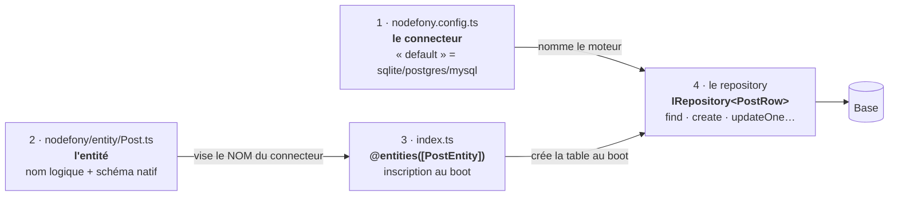

# Créer une entité — du premier fichier à la première requête

> Le pas-à-pas d'une première table : déclarer la connexion, décrire le schéma, inscrire
> l'entité, obtenir le repository, lire et écrire. Rien n'est supposé connu, et le code de
> chaque étape est complet. À la fin, une table existe en base et ton code la lit sans jamais
> nommer Drizzle.

📍 [Documentation](../../../../../docs/index.md) › [ORM — le socle](index.md) › **Créer une entité**

## 🧠 Schéma général

Trois objets s'emboîtent, toujours dans le même ordre. Le tutoriel les parcourt de gauche à
droite.



Le point à retenir dès maintenant : **l'entité ne connaît que le nom de la connexion**, jamais le
moteur. Passer de SQLite à PostgreSQL ne touche que le fichier de configuration.

## 📖 Lexique

| Terme        | Sens                                                                                                                               |
| ------------ | ---------------------------------------------------------------------------------------------------------------------------------- |
| ORM          | _Object-Relational Mapping_ : la bibliothèque qui traduit tes objets en lignes de base (Drizzle pour le SQL, Mongoose pour Mongo). |
| Connecteur   | Le **nom** d'une connexion déclarée en configuration (`"default"`, `"analytics"`) — jamais le nom d'un moteur.                     |
| Dialecte     | La variante SQL servie par un même driver : `sqlite`, `postgres`, `mysql`.                                                         |
| Entité       | La description d'une table : un nom logique, un schéma natif, un connecteur cible.                                                 |
| Schéma natif | La table écrite dans la syntaxe du driver (`sqliteTable(...)` en Drizzle). Aucune couche à contourner.                             |
| Repository   | L'objet avec lequel on lit et écrit : `IRepository<T>`, la seule surface que voit ton métier.                                      |
| Registre     | Le singleton qui relie les noms aux objets : `entityRegistry` pour les entités, `ormRegistry` pour les connexions.                 |
| Critère      | Le filtre d'une requête : `{ title: "Bonjour" }` (égalité) ou `{ views: { $gte: 100 } }` (opérateurs).                             |
| DDL          | _Data Definition Language_ : le SQL qui crée ou modifie les tables (`CREATE TABLE`, `ALTER`).                                      |
| Atomique     | Qui tient en **une** requête, donc que rien ne peut interrompre à mi-chemin (pas de course entre deux appels).                     |
| Upsert       | « insère **ou** met à jour » en une seule instruction, sur conflit de clé unique.                                                  |
| Page / Slice | Une tranche de résultats : avec le total compté (Page) ou sans (Slice, meilleur marché).                                           |

## Qu'est-ce que c'est ?

Une **entité**, c'est la fiche d'identité d'une table : un nom que ton code utilisera
(`"Post"`), un schéma qui décrit les colonnes, et le nom de la connexion où elle vit.

Compare avec une prise électrique. Le **schéma** dit la forme de la fiche (les colonnes). Le
**connecteur** dit dans quelle prise on la branche — mais pas si le courant vient d'un barrage ou
d'un panneau solaire. Ça, c'est le rôle de la configuration, et c'est pour cette raison que
changer de moteur ne touche pas ton code.

Une fois l'entité inscrite, tu ne la manipules plus jamais directement : tu demandes son
**repository**, et c'est lui qui porte les verbes (`find`, `create`, `updateOne`…). Un repository
est le contrat `IRepository<T>` (`IRepository.ts:176`), identique quel que soit le moteur.

> [!NOTE]
> `@nodefony/orm-core` n'est **pas un module à démarrer** : rien à ajouter dans `modules: [...]`.
> C'est une bibliothèque de contrats. Le module, c'est le **driver** — `@nodefony/drizzle` pour
> le SQL, `@nodefony/mongoose` pour MongoDB.

## La vision Nodefony

Deux partis pris expliquent la forme exacte des étapes qui suivent. Les connaître évite de se
battre contre le cadre.

**1. Le connecteur est une donnée de configuration, jamais de code.** C'est pourquoi le
descripteur qu'on écrit (`IEntityDefinition`, `defineEntity.ts:15`) est un `IEntity`
(`IEntity.ts:37`) **privé de son `connector`** : celui-ci est résolu au démarrage, avec `"default"`
pour valeur de repli (`DEFAULT_CONNECTOR`, `entitiesDecorator.ts:12`). Figer la connexion dans le
fichier d'entité interdirait de servir la même table depuis une base différente selon
l'environnement.

**2. L'inscription est déclarative, et elle a lieu tôt.** `defineEntity()`
(`defineEntity.ts:48`) n'a **aucun effet de bord** : importer un fichier d'entité n'inscrit rien.
C'est le décorateur `entities()` (`entitiesDecorator.ts:56`), posé sur la classe du module, qui
inscrit la liste — à la phase `onRegister` (`entitiesDecorator.ts:66`), strictement **avant** que
le connecteur ne s'ouvre et ne crée les tables.

Le bénéfice est concret : une entité oubliée se voit **dans une liste**, pas dans un import à
effet de bord qu'on a omis. Et l'ordre des phases écarte par construction la course « la table
n'existait pas encore », qui ne se reproduit jamais en test.

## 🚀 Démarrage rapide

Vu d'une application générée par `nodefony create app`. Trois fichiers, puis une table qui
répond.

### 1. Déclarer la connexion

Le moteur et sa cible physique vivent ici, et nulle part ailleurs. SQLite ne demande aucune
installation : c'est le bon choix pour ce premier tour.

```ts
// nodefony.config.ts — le connecteur "default" est le NOM de la connexion,
// pas celui du moteur : c'est `dialect` qui nomme le moteur.
export default defineConfig(() => ({
  modules: [
    "@nodefony/framework",
    use("@nodefony/drizzle", {
      connectors: {
        default: { dialect: "sqlite", filename: "nodefony/databases/app.db" },
      },
    }),
  ],
}));
```

### 2. Décrire la table et l'inscrire

Le schéma est du **Drizzle natif** : tous les types et options du moteur restent disponibles.
Le décorateur `@entities([...])` est ce qui rend l'entité réelle.

```ts
// index.ts — pour une première table, tout tient dans le fichier d'entrée de l'app.
import { randomUUID } from "node:crypto";
import { integer, sqliteTable, text } from "drizzle-orm/sqlite-core";
import { Kernel, Module } from "nodefony";
import type { DefaultOptionsService } from "nodefony";
import { defineEntity, entities } from "@nodefony/orm-core";

export const postTable = sqliteTable("Post", {
  id: text("id")
    .primaryKey()
    .$defaultFn(() => randomUUID()),
  title: text("title").notNull(),
  // Défaut posé côté JS : le DDL dérivé au boot n'émet pas les DEFAULT SQL.
  views: integer("views")
    .notNull()
    .$defaultFn(() => 0),
  publishedAt: integer("publishedAt"), // null = brouillon
});

/** Une ligne de `Post`, telle que la rend le repository. */
export interface PostRow {
  id: string;
  title: string;
  views: number;
  publishedAt: number | null;
}

// Pas de `connector` ici : il est résolu au démarrage (défaut `"default"`).
export const PostEntity = defineEntity({
  name: "Post",
  module: "app",
  schema: postTable,
});

// `config` est déjà importé par ton index.ts (`./nodefony.config.js`) — inchangé.
declare const config: DefaultOptionsService;

@entities([PostEntity])
class App extends Module {
  constructor(kernel: Kernel) {
    super("app", kernel, import.meta.url, config);
  }
}

export default App;
```

### 3. Lire et écrire

Le repository s'obtient par le registre des connexions. À partir de cette ligne, plus rien dans
ton code ne nomme Drizzle.

```ts
// nodefony/service/postDemo.ts
import { ormRegistry, paginate } from "@nodefony/orm-core";

/** Le type de ligne exporté à côté de l'entité (rappelé ici pour l'extrait). */
interface PostRow {
  id: string;
  title: string;
  views: number;
  publishedAt: number | null;
}

export async function demo(): Promise<void> {
  const posts = ormRegistry.get("default").getRepository<PostRow>("Post");

  // CRÉER — rend la ligne persistée (id généré, défauts appliqués).
  const post = await posts.create({ title: "Bonjour" });

  // LIRE — sans critère : toute la table.
  const tous = await posts.find();

  // LIRE filtré — `$null: true` produit un IS NULL ; `= NULL` serait toujours faux en SQL.
  const brouillons = await posts.find({ publishedAt: { $null: true } });

  // MODIFIER — au plus une ligne, atomiquement, et la rend.
  const renomme = await posts.updateOne({ id: post.id }, { title: "Salut" });

  // COMPTER, puis SUPPRIMER (rend le nombre de lignes supprimées).
  const total = await posts.count();
  const supprimees = await posts.delete({ id: post.id });

  // PAGINER — une page, sans jamais matérialiser toute la table.
  const page = await paginate(posts, { limit: 20, order: [["views", "DESC"]] });

  console.log(
    tous.length,
    brouillons.length,
    renomme,
    total,
    supprimees,
    page.hasNext,
  );
}
```

### Ce qu'on observe

Au démarrage, le driver crée la table et le récap de boot affiche la connexion sous
« Services & ORM » (`reportOrmBootLines()`, `ormWiring.ts:60`). En journal `DEBUG`, chaque entité
inscrite laisse une ligne `ADD ENTITY` (`entitiesDecorator.ts:84`) — c'est la preuve la plus
directe que le décorateur a bien travaillé.

Le data plane confirme depuis l'extérieur, sans ouvrir la base :

```bash
# Les connecteurs enregistrés, leur état, leur nombre d'entités
curl -s http://localhost:5151/nodefony/orm/api/orms
# [{"name":"default","default":true,"connected":true,"entityCount":1}]

# Le modèle canonique de l'entité : colonnes + relations
curl -s http://localhost:5151/nodefony/orm/api/entity/Post

# Le nombre de lignes par entité
curl -s http://localhost:5151/nodefony/orm/api/counts
# {"Post":1}
```

## 🧩 Le pas-à-pas commenté

Les quatre gestes du démarrage rapide, cette fois expliqués — c'est ici qu'on comprend
**pourquoi** chacun est nécessaire.

### Étape 1 — nommer la connexion

`connectors` associe un **nom** à un moteur et à sa cible. Le nom `"default"` n'a rien de magique :
c'est simplement celui que les entités visent quand elles n'en nomment pas d'autre.

Une deuxième base se déclare exactement pareil, sous un autre nom :

```ts ignore
use("@nodefony/drizzle", {
  connectors: {
    default: { dialect: "sqlite", filename: "nodefony/databases/app.db" },
    analytics: { dialect: "postgres", url: process.env.PG_URL },
  },
});
```

Les dialectes disponibles, leurs options et le choix de la cible sont détaillés dans la page du
driver : [`@nodefony/drizzle`](../../drizzle/docs/index.md).

### Étape 2 — écrire le schéma

Le schéma est du Drizzle ordinaire. Un besoin non couvert par les exemples — colonne
`numeric(12,4)`, index composite, contrainte de clé étrangère — s'écrit directement dans ce
fichier, sans rien contourner.

Deux conséquences du DDL dérivé au boot, à connaître dès maintenant :

- la table est créée par un `CREATE TABLE IF NOT EXISTS` — **modifier le schéma n'altère pas une
  table déjà créée** (aucun `ALTER` n'est émis) ;
- les **index** déclarés et les `DEFAULT` **SQL** ne sont pas émis. D'où les défauts posés côté
  JavaScript (`$defaultFn`), qui s'appliquent quoi qu'il arrive.

> [!TIP]
> En développement, la façon la plus rapide de prendre en compte une colonne ajoutée est de
> supprimer le fichier SQLite et de redémarrer. En production, cela relève d'une migration.

### Étape 3 — déclarer l'entité

`defineEntity()` (`defineEntity.ts:48`) est une fonction d'**identité typée** : elle attache le
type et rend son argument, rien de plus. Aucun registre n'est touché.

Cette absence d'effet de bord est délibérée : elle permet d'importer une entité depuis un test,
un script ou un autre module **sans** déclencher son inscription dans un singleton global.

Les champs facultatifs qui servent tôt : `module` (qui apporte l'entité) et `domain`
(`IEntity.ts:58`), l'axe de classification qui rend navigable une base de plusieurs centaines de
tables dans l'ERD Studio.

### Étape 4 — brancher l'entité au module

C'est `entities()` (`entitiesDecorator.ts:56`) qui inscrit, et lui seul. Trois propriétés valent
d'être connues :

1. **Phase `onRegister`** (`entitiesDecorator.ts:66`) — strictement avant l'ouverture des
   connexions. C'est ce qui rend l'ordre sûr par construction, contrairement à `@controllers`, qui
   travaille à `onBoot`.
2. **Idempotent** — une entité déjà inscrite sur le même connecteur est ignorée (un module peut
   être instancié deux fois : tests, rechargement). Une vraie collision, elle, lève
   (`EntityRegistry.register()`, `EntityRegistry.ts:24`).
3. **Connecteur commun** — `entities([...], { connector: "analytics" })` pose toute la liste sur
   une autre base ; une entité qui porte son propre `connector` (`IEntity.ts:42`) garde le sien.

### Le raccourci — `nodefony create entity`

Tout ce qui précède est scaffoldé par une commande, dans l'application ou dans un module. Les
champs se déclarent en positionnels, façon Rails :

```bash
nodefony create entity Post title:string content:text views:int
# --id uuid7|uuid4|serial   --soft-delete   --no-timestamps
# --module <nom>            --no-controller --connector <nom>
```

Elle écrit le fichier d'entité (`nodefony/entity/Post.ts`), les schémas de validation, un service
CRUD, un controller REST + WebSocket et les tests — puis **câble elle-même** `@entities([...])` et
`@controllers([...])`. Le schéma vit alors dans son propre fichier, et le point d'entrée ne garde
que l'import plus la ligne du décorateur.

> [!WARNING]
> La commande refuse de générer si aucun module ORM n'est déclaré dans l'application. C'est
> volontaire : une entité sans driver produit du code mort qui ne compile même pas. Ajoute
> `use("@nodefony/drizzle", …)` au manifeste `modules`, puis relance.

## 🧰 Lire et écrire — le contrat complet

Le repository porte **quinze verbes**, pas cinq. Ils se choisissent sur la **garantie** qu'ils
apportent, jamais sur leur nom.

| Verbe                 | Ce qu'il garantit                                                  | Ancre                        |
| --------------------- | ------------------------------------------------------------------ | ---------------------------- |
| `find` / `findOne`    | lecture filtrée, avec tri, bornes et eager-load                    | `IRepository.ts:213`, `:192` |
| `create`              | insère une ligne et rend sa version persistée (id, défauts)        | `IRepository.ts:240`         |
| `createMany`          | N lignes en **une** requête — seed, import, ingestion par lots     | `IRepository.ts:252`         |
| `updateOne`           | modifie **au plus une** ligne, **atomiquement**, et la rend        | `IRepository.ts:269`         |
| `updateMany`          | modifie toutes les lignes du critère, rend le **nombre**           | `IRepository.ts:312`         |
| `upsert`              | insère **ou** met à jour sur conflit de clé, en une instruction    | `IRepository.ts:296`         |
| `increment`           | `SET f = f + ?` atomique — compteurs, quotas, limitation de débit  | `IRepository.ts:287`         |
| `delete`              | supprime tout ce qui matche, rend le nombre                        | `IRepository.ts:298`         |
| `deleteOne`           | supprime **au plus une** ligne, rend un booléen                    | `IRepository.ts:328`         |
| `findOneAndDelete`    | supprime **et rend** la ligne — file de jobs, `pop` atomique       | `IRepository.ts:355`         |
| `count` / `exists`    | compter, ou juste savoir s'il y en a une (sans charger de colonne) | `IRepository.ts:378`, `:335` |
| `withTransaction(tx)` | une **vue** du repository liée à une transaction                   | `IRepository.ts:406`         |

> [!IMPORTANT]
> **Il n'existe pas de méthode `update()`.** Le choix est explicite et il est intentionnel :
> `IRepository.updateOne()` (`IRepository.ts:269`) pour une ligne — atomique, et elle **rend** la
> ligne modifiée —, `IRepository.updateMany()` (`IRepository.ts:274`) pour un lot — qui rend le
> **nombre** de lignes touchées. Un verbe unique masquerait cette différence de garantie, qui est
> précisément ce qu'on veut choisir en connaissance de cause.

Quelques usages, un par garantie :

```ts ignore
// Insertion par lots : une seule requête, l'ordre est conservé.
await posts.createMany([{ title: "A" }, { title: "B" }]);

// Existence sans charger la ligne (ni compter la table).
if (await posts.exists({ title: "A" })) {
  /* … */
}

// Compteur atomique : jamais de lecture-modification-écriture, donc jamais de course.
await posts.increment({ id }, { views: 1 });

// Claim-and-remove : on prend le job ET on le retire, sans que deux workers l'obtiennent.
const job = await jobs.findOneAndDelete({ status: "queued" });

// Tout ou rien : une exception dans le bloc annule les DEUX écritures.
await orm.transaction(async (tx) => {
  const auteur = await users.withTransaction(tx).create({ email: "x@y.z" });
  await posts.withTransaction(tx).create({ title: "Hello", userId: auteur.id });
});
```

Deux réflexes de performance, dès le premier jour : préférer `IRepository.exists()`
(`IRepository.ts:335`) à `findOne(...) !== null` — aucune colonne n'est chargée —, et
`IRepository.increment()` (`IRepository.ts:325`) à une lecture suivie d'une écriture : une requête
au lieu de deux, et pas de course.

## 🔎 Filtrer — les opérateurs de critère

Un critère est un objet. Chaque clé est un champ ; chaque valeur est soit une **égalité**, soit
un objet d'**opérateurs**.

```ts ignore
await posts.find({ title: "Bonjour" }); // égalité
await posts.find({ views: { $gte: 100, $lt: 1000 } }); // deux opérateurs = ET
await posts.find({ id: { $in: ids } }); // appartenance
await posts.find({ title: { $like: "Bon%" } }); // motif SQL
await posts.find({ publishedAt: { $null: false } }); // IS NOT NULL
```

**Dix** opérateurs sont reconnus, figés dans `OPERATOR_KEYS` (`criteria.ts:13`) — source unique
partagée par tous les drivers :

| Opérateur | Effet                            | Opérateur | Effet                              |
| --------- | -------------------------------- | --------- | ---------------------------------- |
| `$eq`     | égal (identique à la valeur nue) | `$lte`    | inférieur ou égal                  |
| `$ne`     | différent                        | `$in`     | appartient à la liste              |
| `$gt`     | strictement supérieur            | `$nin`    | n'appartient pas à la liste        |
| `$gte`    | supérieur ou égal                | `$like`   | motif SQL (`%`, `_`), champs texte |
| `$lt`     | strictement inférieur            | `$null`   | `IS NULL` (`true`) / `IS NOT NULL` |

Plusieurs opérateurs sur un même champ se combinent en **ET**.

> [!WARNING]
> **`$null` est celui qu'on oublie, et il coûte cher.** En SQL, `colonne = NULL` est **toujours
> faux** : un filtre « la colonne est vide » écrit naïvement ne remonte jamais rien — sans la
> moindre erreur. Deux formes équivalentes le résolvent : la valeur nue `{ publishedAt: null }`
> et l'opérateur `{ publishedAt: { $null: true } }` (`FieldOperators.$null`, `IRepository.ts:65`).
> La valeur nue n'est ouverte par le typage que si le champ est **nullable** (`FieldCriteria`,
> `IRepository.ts:128`) : chercher `IS NULL` sur une colonne non-nullable est une erreur de
> raisonnement, et le compilateur la refuse.

**Comment un objet est reconnu comme filtre plutôt que comme valeur** : `isFieldOperators()`
(`criteria.ts:42`) ne l'interprète que si **toutes** ses clés sont des opérateurs connus. Une
colonne JSON ou un sous-document (`{ meta: { auteur: "…" } }`) reste donc une égalité — c'est ce
qui évite qu'une donnée métier soit prise pour une requête.

### Les opérateurs d'écriture — `$max` et `$min`

Une seconde famille, distincte, s'applique **en écriture** dans un `upsert` :
`UpdateOperators` (`IRepository.ts:94`), dont les clés reconnues sont listées par
`UPDATE_OPERATOR_KEYS` (`criteria.ts:67`).

Ils existent parce qu'un upsert **ne peut pas porter de condition** : son `DO UPDATE` s'applique
dès qu'il y a conflit de clé (MySQL n'accepte pas de `WHERE` sur `ON DUPLICATE KEY UPDATE`). Pour
une valeur qui ne doit **jamais reculer**, la condition vit donc dans la valeur écrite.

```ts ignore
// Le seuil ne recule jamais, même sur deux appels simultanés — une seule instruction.
await quotas.upsert(
  { userId },
  { seuil: { $max: Date.now() } },
  { createdAt: Date.now() },
);
```

Le driver traduit en `MAX()` (sqlite), `GREATEST()` (postgres, mysql) ou `$max` natif (Mongo).
Sur une ligne dont on sait qu'elle **existe**, ils sont inutiles :
`updateMany({ id, seuil: { $lt: v } }, { seuil: v })` l'exprime déjà, tout aussi atomiquement.

### Ce que le critère ne couvre pas

Les `OR` logiques, les sous-requêtes, les agrégats et les jointures arbitraires n'en font pas
partie. Ce n'est pas un oubli : c'est la limite de ce qui se porte d'un moteur SQL à MongoDB. La
sortie est `IOrm.getNativeConnection()` (`IOrm.ts:51`), qui rend la connexion brute du driver.

Un champ absent de l'entité lève `UnknownCriteriaField` (`errors.ts:23`), et le message liste les
champs connus — le diagnostic d'une faute de frappe est immédiat.

## 📄 Pager les résultats

`find()` avec `limit`/`offset`/`order` (`RepositoryReadOptions`, `IRepository.ts:153`) suffit pour
une tranche. Pour une vraie page — celle qui sait s'il y a une suite — utilise `paginate()`
(`paginate.ts:47`) :

```ts ignore
const page = await paginate(posts, {
  limit: 20,
  offset: 0,
  criteria: { publishedAt: { $null: false } },
  order: [["publishedAt", "DESC"]],
  withTotal: false, // le COUNT(*) est coûteux : on ne le paie que si on l'affiche
});
// page.items · page.hasNext · page.total (undefined si withTotal: false)
```

`hasNext` est obtenu **sans `COUNT`** : la fonction demande `limit + 1` lignes et retire la ligne
excédentaire. C'est la distinction « Page » (avec total) / « Slice » (sans), et elle change tout
sur une grosse table.

## ⚙️ Ranger le métier dans un service

Dès que la logique dépasse l'appel direct, elle quitte le controller. `AbstractCrudService`
(`AbstractCrudService.ts:37`) donne le socle : les lectures sont une **délégation pure** (aucun
surcoût sur le chemin chaud), les mutations sont encadrées par des points d'extension puis un
événement de cycle de vie.

```ts ignore
export class PostService extends AbstractCrudService<PostRow> {
  constructor(repository: IRepository<PostRow>) {
    super("postService", repository);
  }

  /** Valide avant insertion : un rejet devient un 422, quel que soit le transport. */
  protected override beforeCreate(data: Partial<PostRow>): Partial<PostRow> {
    return createPostSchema.parse(data) as Partial<PostRow>;
  }
}
```

L'intérêt est de n'avoir **qu'un seul endroit** à modifier quand la règle change : la même méthode
sert la route REST, l'appel WebSocket, un résolveur GraphQL et une commande CLI. Pour toute liste
d'administration, la primitive est `AbstractCrudService.findPage()` (`AbstractCrudService.ts:110`)
— elle ne charge qu'une page, quelle que soit la taille de la table.

> [!WARNING]
> Ce service est un **singleton** partagé. C'est légitime **parce qu'il est sans état** : ne jamais
> écrire `this.utilisateurCourant = …` pendant une requête. L'utilisateur, le tenant et la
> transaction voyagent dans le contexte, jamais sur l'instance.

## ⚠️ Pièges

| Symptôme                                                      | Cause                                                                                            | Correction                                                                                               |
| ------------------------------------------------------------- | ------------------------------------------------------------------------------------------------ | -------------------------------------------------------------------------------------------------------- |
| `posts.update is not a function`                              | la méthode `update()` n'existe pas dans le contrat                                               | `updateOne` pour une ligne (`IRepository.ts:269`), `updateMany` pour un lot (`IRepository.ts:274`)       |
| « no entity registered under "Post" » au premier appel        | le fichier d'entité est importé, mais `defineEntity()` est **sans effet de bord**                | ajouter l'entité à `@entities([...])` sur le module (`entitiesDecorator.ts:56`)                          |
| La table n'existe pas alors que l'entité est déclarée         | inscription faite à `onBoot` → course avec l'ouverture du connecteur                             | inscrire à `onRegister` — c'est ce que fait `entities()` (`entitiesDecorator.ts:66`)                     |
| Une colonne ajoutée au schéma reste absente de la table       | le DDL du boot est un `CREATE TABLE IF NOT EXISTS` : aucun `ALTER` n'est émis                    | supprimer la base de développement et redémarrer, ou passer par une migration                            |
| Un `DEFAULT` SQL ou un index déclaré n'apparaît pas           | le DDL dérivé ne les émet pas                                                                    | poser le défaut côté JavaScript (`$defaultFn`) ; créer l'index par migration                             |
| Un filtre « champ vide » ne remonte jamais rien               | `colonne = NULL` est toujours faux en SQL                                                        | `{ champ: { $null: true } }` ou la valeur nue `{ champ: null }` (`IRepository.ts:65`)                    |
| `UnknownCriteriaField` sur un champ qui « existe pourtant »   | faute de frappe, ou champ calculé absent du schéma                                               | lire les champs connus dans le message ; pour du natif, passer par `getNativeConnection()`               |
| `connector: "sqlite"` ne trouve aucune connexion              | `connector` nomme une **connexion**, pas un moteur                                               | mettre la clé de `connectors` (`"default"`) ; le moteur est le `dialect` de la config                    |
| « entity "Post" exists on multiple connectors … specify one » | la même entité est inscrite sur deux connexions                                                  | préciser laquelle : `entityRegistry.get("Post", "analytics")` (`EntityRegistry.ts:54`)                   |
| « no ORM registered under "default" » au premier appel        | le repository est demandé avant l'ouverture du connecteur, ou le driver n'est pas dans `modules` | construire le service **au premier usage**, pas au chargement (`ormRegistry.get()`, `OrmRegistry.ts:45`) |
| Une entité déclarée dans un module reste invisible            | le module embarque sa **propre copie** du registre (singleton dédoublé)                          | externaliser `@nodefony/orm-core` dans le `rolldown.config.ts` du module                                 |
| Une transaction ne couvre pas les deux bases                  | une transaction porte sur **un seul** connecteur (2PC non garanti)                               | rassembler les écritures atomiques sur une seule connexion                                               |

## 🧪 Tests & couverture

Les compteurs de cette page sont recomptés à chaque génération — jamais figés dans le texte. Ils
portent sur les tests **unitaires** de `@nodefony/orm-core` : les deux registres, le décorateur
`entities`, les critères, la pagination, le service CRUD, les moniteurs et le data plane.

Les mécanismes enseignés ici sont couverts directement :
`tests/unit/entitiesDecorator.test.ts` (inscription, idempotence, phase, connecteur commun),
`tests/unit/EntityRegistry.test.ts` (résolution, ambiguïté), `tests/unit/criteria.test.ts`
(reconnaissance des opérateurs) et `tests/unit/paginate.test.ts` (bornes, `hasNext`, total).

**Ce que ces tests ne prouvent pas.** Le contrat `IRepository` n'a de sens qu'exécuté sur une
vraie base : cette preuve vit chez les **drivers**, sous forme de bancs de contrat rejoués par
dialecte — `@nodefony/drizzle` (sqlite en mémoire, PostgreSQL et MySQL en end-to-end) et
`@nodefony/mongoose` pour le documentaire.

> [!WARNING]
> Un compteur vert ne prouve pas qu'une base a été touchée : les bancs sur serveur réel se
> **skippent** faute de leur variable d'infra, et un test skippé compte comme vert. La source
> unique de ces variables et des commandes Docker correspondantes est `vitest.gates.ts` à la
> racine du dépôt ; les suites concernées affichent leur récapitulatif en fin d'exécution.

## 🔗 Pour aller plus loin

- ⬆️ **Retour au hub** : [ORM — le contrat de persistance](index.md) ·
  [Toute la documentation](../../../../../docs/index.md)
- 🧰 **La suite logique** : la section [Les contrats](index.md#-les-contrats--la-surface-publique)
  du hub (les quinze verbes en détail, transactions, eager-load) et
  [Les critères de recherche](index.md#-les-critères-de-recherche)
- 🗄️ **Les drivers** : [`@nodefony/drizzle`](../../drizzle/docs/index.md) (dialectes, création des
  tables, ERD) · [`@nodefony/mongoose`](../../mongoose/docs/index.md) et sa
  [configuration](../../mongoose/docs/configuration.md)
- 🏛️ **Passer en production** : [guide persistance](../../../../../docs/guides/persistence.md) ·
  [configuration d'une application](../../../../../docs/guides/configuration.md) ·
  [stockage de session](../../../../../docs/guides/session-storage.md)
- 📐 **Pourquoi cette architecture** :
  [ADR-0003 — abstraction Repository multi-ORM](../../../../../docs/adr/0003-orm-core-abstraction-repository-multi-orm.md)
- 📖 [Lexique général](../../../../../docs/lexique.md) du framework
