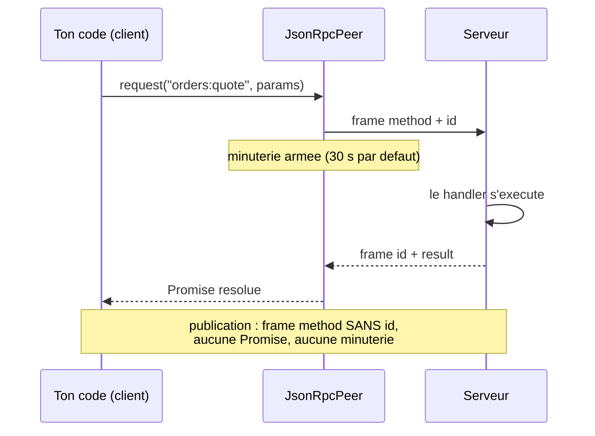

# Actions RPC — appeler le serveur et attendre sa réponse

> Une **action RPC** est la direction « contrôle » de la socket : le client demande, le serveur
> exécute, le serveur répond — une `Promise` résolue avec le résultat. C'est l'exact opposé d'une
> publication, qui part sans accusé. Cette page dit **quand** choisir l'une plutôt que l'autre,
> comment déclarer une action, et ce qui arrive quand le client abandonne, quand le réseau coupe ou
> quand l'appel est rejoué.

📍 [Documentation](../../../../../docs/index.md) › [Realtime](index.md) › **Actions RPC**

## 🧠 Le modèle mental — deux directions sur un même fil

Une seule connexion porte deux régimes de trafic. Ils ne se distinguent pas par leur contenu mais
par **la présence d'un `id`** dans la frame : un `id` réclame une réponse, son absence non.



### Publication ou action RPC ? Le critère de tri

| Aspect        | Publication (sans `id`)           | Action RPC (avec `id`)                          |
| ------------- | --------------------------------- | ----------------------------------------------- |
| Direction     | flux, 1 → N abonnés               | requête → réponse, 1 → 1                        |
| Sémantique    | « ceci s'est passé »              | « fais ceci, et dis-moi »                       |
| Latence       | la livraison, sans attente        | l'exécution complète du handler                 |
| Ordre         | par canal                         | par appel, chacun corrélé par son `id`          |
| Rejeu         | inutile — une perte est rattrapée | possible, **si l'action est idempotente**       |
| Coût au repos | un sink dans la table du hub      | une entrée en attente + une minuterie par appel |
| Exemples      | `realtime:health`, `chat:room-42` | `kernel:ping`, `scaffold:run`                   |

> [!TIP]
> **Le critère qui tranche en une seconde : le client a-t-il besoin de savoir si ça a marché ?**
> Si oui, c'est une action RPC. Si non, c'est une publication. Une « action » dont personne ne lit
> le retour est une publication déguisée ; un « événement » dont l'émetteur attend confirmation est
> une action qui s'ignore.

## 📖 Lexique

| Terme              | Sens                                                                                          |
| ------------------ | --------------------------------------------------------------------------------------------- |
| Action RPC         | Une méthode nommée, exposée par le serveur, appelable par le client et qui rend une valeur.   |
| RPC                | _Remote Procedure Call_ : appeler une fonction qui vit ailleurs comme si elle était locale.   |
| Frame              | L'unité qui passe sur le fil, au format JSON-RPC 2.0.                                         |
| `id`               | Le numéro qui corrèle une requête et sa réponse. Sa présence **définit** une requête.         |
| Corrélation        | Retrouver, à l'arrivée d'une réponse, l'appel en attente qu'elle résout.                      |
| Accueil (welcome)  | La première frame du serveur ; son champ `methods` liste les actions découvrables.            |
| Découverte         | Lire ce que l'endpoint expose au lieu de l'écrire en dur dans l'interface.                    |
| Délai d'expiration | Le temps au bout duquel le client cesse d'attendre et rejette sa `Promise`.                   |
| Idempotence        | Propriété d'une action dont deux exécutions font le même effet qu'une seule.                  |
| Clé d'idempotence  | L'identifiant fourni par l'appelant qui permet au serveur de reconnaître un rejeu.            |
| Verrou de frame    | La décision synchrone « cette frame passe-t-elle ? », posée par la couche sécurité.           |
| Namespace réservé  | Un préfixe de nom (`kernel:`, `syslog:`…) dont la politique est un plancher non contournable. |
| Pont API           | La méthode `api.request` qui rejoue une route HTTP sur la socket.                             |
| Job                | Un travail long identifié, lancé par une action et suivi sur un canal dédié.                  |

Les mots communs à tout le module (socket, canal, hub, pair, backplane) sont définis une seule
fois, dans le [vocabulaire](./vocabulaire.md).

## Qu'est-ce qu'une action RPC ?

Imagine un guichet et un panneau d'affichage dans le même hall.

Le **panneau d'affichage**, c'est la publication : il change, tout le monde le voit, personne ne
signe. Si tu regardais ailleurs, tu as raté l'information — et ce n'est pas grave, la suivante
arrive.

Le **guichet**, c'est l'action RPC : tu tends un formulaire portant un numéro, tu attends, on te
rend une réponse portant **le même numéro**. Tu sais si ça a marché. Tu peux échouer. Tu peux
attendre trop longtemps et repartir.

Techniquement, ce numéro est le champ `id` de la frame JSON-RPC 2.0. Le pair l'attribue, garde
l'appel en attente dans une table, arme une minuterie, et résout la `Promise` quand la réponse
portant cet `id` revient (`JsonRpcPeer.handleResponse()`, `JsonRpcPeer.ts:534`). Une frame sans
`id` ne crée aucune de ces trois choses — c'est pourquoi une publication ne coûte rien au repos.

## La vision Nodefony — un nom, un handler, une découverte

Trois partis pris distinguent les actions Nodefony d'une couche RPC classique.

**Il n'y a pas de couche RPC séparée.** Une action est une **méthode de contrôleur**, dans la même
classe que tes canaux et — si tu le veux — que tes routes HTTP. Pas de service dédié, pas de
schéma à compiler : `@RealtimeAction("orders:quote")` (`realtimeDecorators.ts:101`) suffit, et le
retour de la méthode devient le `result` de la réponse.

**Le contrat du handler est minuscule, volontairement.** Une action reçoit **un seul argument**,
les paramètres bruts du client, et rend une valeur — `RpcActionHandler`
(`JsonRpcPeer.ts:118`). Pas de contexte injecté dans la signature : le `this` est lié à
l'instance du contrôleur au handshake, ce qui donne accès au noyau, aux services et à la
connexion sans élargir le contrat.

**L'endpoint s'annonce lui-même.** La liste des actions exposées voyage dans la frame d'accueil —
`IRealtimeWelcome` (`RealtimeController.ts:566`) — et se lit côté client par
`RealtimeClient.serverMethods` (`RealtimeClient.ts:476`). Une interface n'écrit donc jamais un nom d'action en dur : elle
n'active un bouton que si le serveur a déclaré savoir le servir.

**Le compromis, dit franchement** : une action est **un aller-retour**, point. Elle ne diffuse pas,
elle ne progresse pas, elle ne s'annule pas côté serveur. Tout ce qui dure ou se raconte en
plusieurs temps se fait sur un canal — voir plus bas.

## 🚀 Démarrage rapide

Une action qui calcule un devis, vue d'une application créée par `nodefony create app`.

### 1. Le contrôleur — la seule chose à écrire côté serveur

```ts
// nodefony/controllers/OrdersRealtimeController.ts
import { controller, route } from "@nodefony/framework";
import { RealtimeController, RealtimeAction } from "@nodefony/realtime";
import type { ContextType } from "@nodefony/http";
import { RpcError } from "nodefony";

interface IQuote {
  orderId: string;
  total: number;
  currency: string;
}

@controller("/orders")
class OrdersRealtimeController extends RealtimeController {
  constructor(context: ContextType) {
    super("orders", context);
  }

  // UNE route WebSocket : la classe de base porte tout le protocole.
  @route("orders-realtime", {
    path: "/realtime",
    requirements: { methods: ["WEBSOCKET"] },
  })
  async realtime(message: string | Buffer | null): Promise<void> {
    this.handleRealtime(message);
  }

  // L'ACTION : un seul argument (les params du client, JAMAIS fiables),
  // et la valeur rendue devient le `result` de la réponse.
  @RealtimeAction("orders:quote")
  quote(params: unknown): IQuote {
    const orderId = (params as { orderId?: unknown } | undefined)?.orderId;
    // Une RpcError est la SEULE erreur dont le message atteint le client.
    // Tout autre throw devient un `-32603 internal error` opaque.
    if (typeof orderId !== "string") {
      throw new RpcError("params.orderId manquant", -32602);
    }
    return { orderId, total: 4200, currency: "EUR" };
  }
}

export default OrdersRealtimeController;
```

### 2. L'appel — côté navigateur

```ts
// frontend/src/orders.ts
import { RealtimeClient } from "nodefony/client";

interface IQuote {
  orderId: string;
  total: number;
  currency: string;
}

const socket = RealtimeClient.shared({
  url: "wss://127.0.0.1:5152/orders/realtime",
});

export async function askQuote(orderId: string): Promise<IQuote | null> {
  await socket.connect();
  // DÉCOUVERTE : le serveur a-t-il annoncé cette action ? Sinon, on n'appelle
  // pas — c'est ainsi qu'un bouton s'active au lieu d'être écrit en dur.
  if (!socket.serverMethods?.includes("orders:quote")) return null;
  // Signature POSITIONNELLE : (méthode, params, délai en ms). Défaut 30 000.
  return socket.request<IQuote>("orders:quote", { orderId }, 5000);
}
```

### Ce qu'on observe

À la connexion, la frame d'accueil annonce l'action — c'est elle qui pilote l'interface :

```jsonc
{
  "jsonrpc": "2.0",
  "method": "realtime:welcome",
  "params": {
    "ts": 1770000000000,
    "protocol": "jsonrpc-2.0",
    "channels": [],
    "methods": ["orders:quote"],
    "identity": {
      "type": "anonymous",
      "authenticated": false,
      "userIdentifier": "anonymous",
      "roles": ["ROLE_ANONYMOUS"],
      "scopes": [],
    },
  },
}
```

Puis l'aller-retour, deux frames, corrélées par leur `id` :

```jsonc
// → client vers serveur
{ "jsonrpc": "2.0", "id": 1, "method": "orders:quote", "params": { "orderId": "A-42" } }
// ← serveur vers client
{ "jsonrpc": "2.0", "id": 1, "result": { "orderId": "A-42", "total": 4200, "currency": "EUR" } }
```

Un `orderId` absent donne l'autre forme de réponse, l'échec explicite :

```jsonc
{
  "jsonrpc": "2.0",
  "id": 2,
  "error": { "code": -32602, "message": "params.orderId manquant" },
}
```

Le trajet complet d'une requête, des étapes qu'elle traverse aux branches par lesquelles elle
peut sortir :

```nodefony-livegraph
{
  "graph": "actions",
  "height": 520,
  "title": "Le trajet d'une action",
  "hint": "Résolution de la méthode, verrou d'autorisation, handler. Les sorties d'erreur sont des branches à part : c'est là, et seulement là, que l'audit se déclenche."
}
```

## 🧰 Déclarer une action côté serveur

### Deux voies, un même registre

| Voie                                                   | Quand la choisir                                            |
| ------------------------------------------------------ | ----------------------------------------------------------- |
| `@RealtimeAction("nom")` (`realtimeDecorators.ts:101`) | le cas courant — un nom fixe, une méthode, déclaratif       |
| `realtimeActions()` (`RealtimeController.ts:179`)      | la table est **calculée** (noms dynamiques, boucle, config) |

Les deux sont fusionnées au handshake, et **l'override gagne** en cas de conflit de nom : une
classe peut ainsi remplacer une action héritée sans toucher au parent
(`RealtimeController.ts:453`). Un endpoint sans aucune action ne paie rien — la table du pair est
allouée au premier enregistrement seulement.

### Ce que ton `return` et ton `throw` deviennent sur le fil

Le retour du handler est envoyé tel quel en `result`. Les erreurs, elles, suivent une règle Zero
Trust stricte, appliquée dans `JsonRpcPeer.handleRequest()` (`JsonRpcPeer.ts:477`) :

| Côté serveur                    | Ce que reçoit le client                  | Pourquoi                                        |
| ------------------------------- | ---------------------------------------- | ----------------------------------------------- |
| `return valeur`                 | `result: valeur`                         | le contrat nominal                              |
| `throw new RpcError(msg, code)` | `error` avec **ton** code et ton message | tu as choisi d'exposer ce refus                 |
| `throw` de toute autre erreur   | `-32603 "internal error"`, **opaque**    | un message d'exception fuite chemins et schémas |
| action non enregistrée          | `-32601 "method not found: <nom>"`       | découverte honnête d'un nom inconnu             |
| frame refusée par le verrou     | `-32001 "unauthorized"`                  | motif générique : pas d'oracle d'autorisation   |

> [!WARNING]
> **`RealtimeError` n'est pas l'erreur du protocole.** Son `code` est une chaîne de diagnostic
> (`RealtimeError.ts:12`), pas un code JSON-RPC : la lever depuis une action donne un
> `-32603` opaque comme n'importe quelle exception. Pour choisir ce que voit le client, c'est
> `RpcError` (`JsonRpcPeer.ts:70`), importée depuis `nodefony`.

## 🔐 Autorisation — qui peut appeler quoi

> [!IMPORTANT]
> **La découverte n'est pas une protection.** Le champ `methods` de l'accueil sert à construire une
> interface honnête, pas à garder une porte. Un client peut forger une frame pour n'importe quel
> nom, annoncé ou non : la seule défense est côté serveur.

Cette défense est le **verrou de frame**, posé par `@nodefony/security`. Il examine chaque frame
entrante et, pour une action, résout une politique **par son nom** — exactement le mécanisme des
canaux (`buildFrameAuthorizer()`, `frameAuthorizer.ts:352` ; branche des méthodes,
`frameAuthorizer.ts:386`). Trois situations, à connaître dans cet ordre :

### Situation 1 — une action applicative est PUBLIQUE par défaut

`@RealtimeAction("orders:quote")` n'accepte **aucun** argument de politique : le décorateur ne
pose qu'un nom. Sans politique résolue, le verrou laisse passer. Une action applicative est donc
appelable par un visiteur anonyme tant que rien ne l'a couverte.

### Situation 2 — les namespaces réservés portent un plancher

Un nom qui tombe dans un namespace de plateforme hérite d'un plancher non contournable :
authentifié **et** `ROLE_ADMIN` (`SYSTEM_CHANNEL_POLICY`, `frameAuthorizer.ts:70`). La liste
couvre `syslog:`, `orm:`, `node:`, `dashboard:`, `debugbar:`, `realtime:`, `cluster:` et
`kernel:` (`DEFAULT_SYSTEM_PREFIXES`, `frameAuthorizer.ts:84`). C'est ce qui protège
`kernel:gc` : le nom **est** la garde, et la comparaison est insensible à la casse pour qu'un
`KERNEL:gc` ne passe pas à côté.

### Situation 3 — couvrir SES actions par la configuration

Pour exiger un rôle sur tes propres actions, on déclare une règle de préfixe dans la
configuration de sécurité — la même liste que pour les canaux
(`realtimeChannels`, `security/nodefony/config/config.ts:906`) :

```ts ignore
use("@nodefony/security", {
  realtimeChannels: [
    // Couvre AUSSI bien le canal `orders:feed` que l'action `orders:quote` :
    // le verrou résout une politique par NOM, sans savoir ce qu'il garde.
    {
      prefix: "orders:",
      policy: { authenticated: true, roles: ["ROLE_USER"] },
    },
  ],
});
```

### La règle DEV-only

Une action réservée au développement se contrôle **dans le handler, côté serveur** — jamais par un
drapeau d'interface. Cacher un bouton n'empêche personne de forger la frame. Le modèle est
`scaffold:run` dans Studio, qui refuse net hors développement avant même de lire ses paramètres
(`StudioRealtimeController.ts:133`).

> [!CAUTION]
> Une action mutable non gardée est la surface la plus facile à oublier : elle n'apparaît dans
> aucune table de routes HTTP, aucun test d'API REST ne la couvre, et son nom seul décide de sa
> politique. Avant de livrer, relis la liste des `methods` annoncées et demande-toi, pour chacune :
> « qu'arrive-t-il si un anonyme l'appelle en boucle ? »

## ⏱️ Délai, abandon et rejeu

### Le délai d'expiration est la seule libération automatique

`request()` prend le délai en **troisième argument positionnel**, en millisecondes — il n'y a pas
d'objet d'options (`RealtimeClient.request()`, `RealtimeClient.ts:602`) :

```ts ignore
await socket.request("orders:quote", { orderId }); // 30 000 ms par défaut
await socket.request("orders:export", { scope }, 120_000); // action longue
```

| Défaut          | Valeur    | Ancrage              |
| --------------- | --------- | -------------------- |
| `request`       | 30 000 ms | `JsonRpcPeer.ts:313` |
| `requestStream` | 60 000 ms | `JsonRpcPeer.ts:348` |

À l'expiration, l'entrée en attente est **retirée** et la `Promise` rejetée avec
`RPC timeout: <méthode>` (`JsonRpcPeer.ts:455`). Conséquence à connaître : une réponse qui
arriverait après coup ne trouve plus personne et est ignorée en silence
(`JsonRpcPeer.ts:539`) — pas de résolution tardive, pas de fuite.

### Abandonner : ce qui existe vraiment

> [!CAUTION]
> **Il n'y a pas d'annulation d'un appel en cours.** La socket n'expose ni `AbortController` ni
> `signal` : cherche-les, tu ne les trouveras pas. Et même s'ils existaient, ils ne changeraient
> rien au fait capital — **abandonner l'attente n'arrête pas l'exécution serveur**. Si le handler
> a commencé à modifier l'état, il finira son travail, seul.

Trois leviers existent, et ils ne font pas la même chose :

1. **Le délai d'expiration** — libère le client, laisse le serveur travailler.
2. **La fermeture de la connexion** — `dispose()` rejette **tous** les appels en attente d'un
   coup (`JsonRpcPeer.ts:434`), appelé au nettoyage de la socket
   (`RealtimeController.ts:553`). Là encore : côté client seulement.
3. **Une action compagnon** — la seule vraie annulation. On expose une seconde action qui prend
   l'identifiant du travail et l'interrompt côté serveur. Le modèle du dépôt est
   `scaffold:cancel` (`StudioRealtimeController.ts:159`), pendant de `scaffold:run`.

### Rejouer : idempotence par action

Un rejeu n'est pas un cas rare : une socket se reconnecte, une frame peut repartir, un utilisateur
reclique. La question à se poser pour chaque action est donc **« deux fois font-elles comme une
fois ? »**.

| Action                         | Idempotente ?                  | Rejeu sûr ?                          |
| ------------------------------ | ------------------------------ | ------------------------------------ |
| `kernel:ping`                  | oui — lecture pure             | oui                                  |
| `kernel:gc`                    | oui — l'effet est un cycle GC  | oui, mais coûteux (pause du process) |
| `api.request` en lecture       | oui — c'est un `GET`           | oui                                  |
| `scaffold:cancel`              | oui — annuler deux fois annule | oui                                  |
| `scaffold:run`                 | **non** — crée un travail      | **non** : deux appels, deux jobs     |
| une mutation (`socket.mutate`) | **non** par nature             | oui, **avec une clé d'idempotence**  |

Pour les mutations passant par le pont API, la clé n'est pas une convention : elle est **exigée
par la signature** de `mutate()` (`RealtimeClient.ts:639`), et c'est la garde `@Idempotent`
(`routerDecorators.ts:924`) qui, côté serveur, reconnaît le rejeu et rend la réponse déjà calculée
au lieu de refaire l'effet.

```ts ignore
await socket.mutate("/nodefony/security/api/apikeys/42/revoke", {
  method: "POST",
  idempotencyKey: crypto.randomUUID(), // rejouer cette frame ne révoque qu'une fois
});
```

> [!IMPORTANT]
> Pour une action **maison** non idempotente, la même discipline s'applique mais **rien ne
> l'impose** : c'est à ton handler d'accepter un identifiant fourni par l'appelant et de mémoriser
> le résultat déjà rendu. Sans cela, une reconnexion malheureuse double l'effet — deuxième
> commande, deuxième courriel, deuxième débit.

## 🧩 Un flux ne tient pas dans une réponse

C'est l'erreur de conception la plus fréquente : vouloir faire progresser un travail long à
l'intérieur d'un appel. **Une action, c'est un aller-retour** — une seule réponse, envoyée à la
fin. Une génération de code, un import de fichier, une réponse de modèle de langage produisent au
contraire des résultats **au fil de l'eau**, pendant des minutes.

Le remède tient en trois gestes, et il est déjà en production dans Studio :

1. **L'action lance et rend un identifiant**, sans attendre — `scaffold:run`
   (`StudioRealtimeController.ts:133`) démarre le travail et rend son état, dont son `id`.
2. **Le flux se diffuse sur un canal dédié**, nommé d'après ce travail — `scaffold:job@<id>`,
   servi par le contrôleur (`StudioRealtimeController.ts:190`).
3. **Le client s'abonne à ce canal** et regarde le travail se faire, ligne après ligne
   (`Create.tsx:323`).

### La course, et comment le dépôt la neutralise

Le danger classique de ce découpage est une **course** : entre le retour de l'action et
l'abonnement du client, les premières lignes sont émises et personne ne les écoute. La règle
prudente est donc de **s'abonner avant** de lancer l'appel.

Nodefony a choisi la garantie côté serveur plutôt que la discipline côté client : le producteur du
canal **rejoue son historique** au nouvel abonné, de sorte qu'un arrivant tardif voit tout depuis
le début (`ScaffoldService.subscribe()`, `ScaffoldService.ts:364`). C'est ce qui autorise le front
à faire l'appel d'abord et à s'abonner ensuite, sans rien perdre.

> [!TIP]
> Retiens la règle sous cette forme : **s'abonner avant de lancer**, sauf si le producteur du canal
> rejoue explicitement son historique. Un canal sans historique ne rattrape rien — c'est une
> propriété du module : un abonnement ne donne accès qu'à l'avenir.

### Et le streaming du protocole ?

Le pair sait recevoir une réponse en morceaux — `requestStream()` (`JsonRpcPeer.ts:344`), exposé
côté client (`RealtimeClient.ts:768`), accumule des fragments jusqu'au dernier. C'est la forme
prévue pour les réponses mot à mot d'un modèle de langage. Mais **une action de contrôleur ne peut
pas les émettre** : son contrat rend **une** valeur (`RpcActionHandler`, `JsonRpcPeer.ts:118`), que
le pair emballe en une réponse unique. Le motif « travail + canal » reste donc la voie pour tout
ce qui progresse.

## 🔌 Le pont API — la même action, servie sur la socket

Un cas particulier mérite d'être connu avant d'écrire une action : **elle existe peut-être déjà en
HTTP**. Le pont API expose la méthode `api.request`, qui rejoue une route de contrôleur sur la
socket, avec la même garde et le même résultat qu'en REST — `invokeApiRequest()`
(`RealtimeController.ts:679`). Il est **désactivé par défaut** et s'active en surchargeant
`realtimeApiRequest()` (`RealtimeController.ts:219`).

```ts ignore
const modules = await socket.request("/nodefony/kernel/api/modules");
```

La forme se discrimine toute seule : un chemin commence par `/`, jamais un nom d'action —
`RealtimeClient.request()` (`RealtimeClient.ts:610`). Écris une action RPC pour ce qui n'a de sens **que** sur la socket ;
passe par le pont pour tout ce qui est déjà une route. Le détail du pont vit dans le
[vocabulaire](./vocabulaire.md) et l'[architecture](./architecture.md).

## ⚠️ Pièges

| Symptôme                                                     | Cause                                                                              | Correction                                                                         |
| ------------------------------------------------------------ | ---------------------------------------------------------------------------------- | ---------------------------------------------------------------------------------- |
| `RPC timeout: <méthode>` alors que le serveur a bien répondu | le handler dure plus que 30 s, le défaut                                           | passer le délai en **3ᵉ argument** : `request(m, p, 120_000)`                      |
| Le client attend indéfiniment, aucune erreur                 | le handler ne rend jamais (il publie au lieu de retourner) — pas de frame `result` | toujours `return` une valeur ; publier **en plus**, jamais **à la place**          |
| `-32601 method not found`                                    | nom mal orthographié, ou action déclarée sur un **autre** endpoint                 | vérifier `socket.serverMethods` — c'est la liste réelle de CETTE connexion         |
| `-32603 internal error` sans détail                          | un `throw` ordinaire est rendu opaque au client (Zero Trust)                       | lever une `RpcError` avec un code et un message publiables                         |
| Une `RealtimeError` levée arrive en `-32603`                 | son `code` est une chaîne de diagnostic, pas un code JSON-RPC                      | utiliser `RpcError` (`JsonRpcPeer.ts:70`) pour parler au client                    |
| `-32001 unauthorized` sur une action légitime                | le nom tombe dans un namespace réservé (`kernel:`, `orm:`, `realtime:`…)           | renommer hors des préfixes plateforme, ou obtenir `ROLE_ADMIN`                     |
| Une action sensible est appelable par un anonyme             | une action applicative est **libre** tant qu'aucune politique ne la couvre         | ajouter une règle de préfixe (`security/nodefony/config/config.ts:906`)            |
| Un travail relancé crée deux jobs                            | action non idempotente rejouée après une reconnexion                               | action compagnon d'annulation, ou identifiant fourni par l'appelant + mémorisation |
| `abort()` introuvable sur la socket                          | il n'existe pas — et n'arrêterait pas le serveur de toute façon                    | exposer une action d'annulation qui prend l'identifiant du travail                 |
| Les premières lignes d'un job manquent                       | abonnement au canal après le début de la production, sans historique rejoué        | s'abonner **avant** de lancer, ou faire rejouer l'historique par le producteur     |
| Toutes les `Promise` rejettent d'un coup                     | la connexion s'est fermée : `dispose()` vide la table des appels en attente        | attendu ; relancer après reconnexion, l'appel n'a pas survécu                      |

## 🧪 Tests & couverture

Les actions sont couvertes à trois étages — protocole, contrôleur, sécurité. Les chiffres exacts
vivent dans la carte de l'aperçu, régénérée depuis les résultats réels, jamais figés ici.

- **Unitaires, protocole** (`JsonRpcPeer.test.ts`) : corrélation requête/réponse, méthode inconnue
  `-32601`, `throw` opaque `-32603`, propagation fidèle d'une `RpcError`, expiration du délai,
  accumulation des fragments de `requestStream`, audit des frames.
- **Unitaires, déclaration** (`realtimeDecorators.test.ts`) : `@RealtimeAction` enregistre bien le
  nom et lie le `this` ; (`RealtimeController.test.ts`) : fusion décorateurs + override et
  annonce dans l'accueil.
- **Unitaires, client** (`RealtimeClientCoverage.test.ts`) : formes de `request`, contrat de
  streaming, rejet des appels en attente au `dispose`.
- **Attaque, autorisation** (`realtimeFrameLock.test.ts`) : `kernel:ping` et `kernel:gc` refusés à
  l'anonyme **et** à l'utilisateur authentifié, acceptés à l'administrateur — la preuve que le
  plancher de namespace garde bien les actions, pas seulement les canaux.
- **Bout en bout** (`realtimeControllerPaths.e2e.test.ts`, `realtimeChannelAuth.e2e.test.ts`) :
  serveur réel, résolution d'endpoint et pont API.
- **Ce qui manque** : aucun banc de **charge** dédié aux actions (le débit mesuré est celui du
  fan-out, pas celui des appels corrélés). Pour en monter un, voir le skill
  `nodefony-load-test` ; pour la mémoire, `nodefony-check-memory-health`.

Couverture : `npm run coverage` dans `@nodefony/realtime`.

## 🔗 Pour aller plus loin

- ⬆️ **Retour au hub** : [Realtime — vue d'ensemble](index.md) · [Toute la documentation](../../../../../docs/index.md)
- 🧭 **Pages sœurs** : [Vocabulaire](vocabulaire.md) · [Architecture](architecture.md) · [Sécurité](securite.md) · [Configuration](configuration.md) · [Cookbook — un chat complet](cookbook-chat.md)

- Les mots employés ici, avec leurs analogies → [vocabulaire](./vocabulaire.md)
- Le trajet d'une frame, du transport au hub → [architecture](./architecture.md)
- Le verrou de frame, le handshake, les politiques de canal → [sécurité](./securite.md)
- La garde qui décide, côté HTTP comme WebSocket → [firewall](../../security/docs/firewall.md)
- Les signatures exactes ne sont pas recopiées ici : elles vivent dans le graphe symbolique
  `.ai/symbols.json`, régénéré depuis les TSDoc du code.
