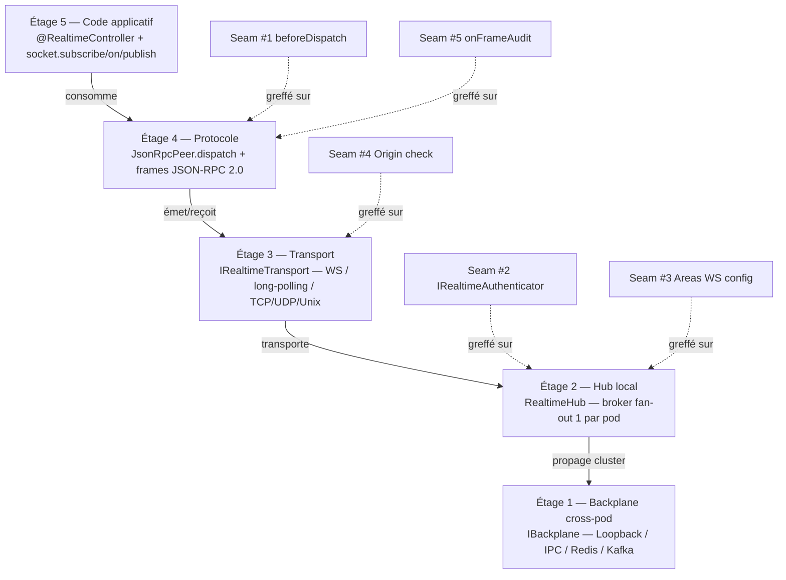
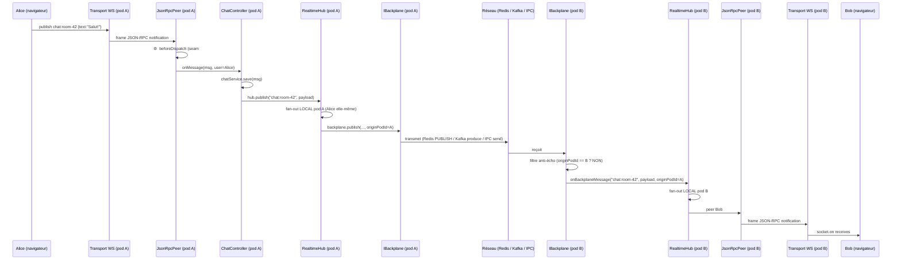
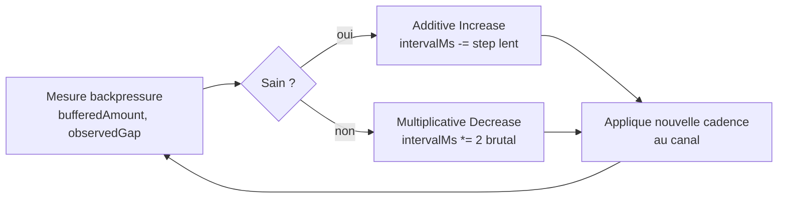

# Architecture — la pile en 5 étages + le flot d'une frame

> Cette page descend **étage par étage** dans la pile realtime Nodefony, du code applicatif
> (Étage 5) jusqu'au câble cluster (Étage 1). Puis elle te montre comment une frame chat
> voyage d'Alice (pod A) à Bob (pod B) **étape par étape**. Tu repartiras avec la carte
> mentale complète.

> [!TIP]
> **🎬 Pour voir cette archi en train de tourner LIVE** : la vitrine
> [`02-architecture.md`](../../../../../docs/realtime/socket/02-architecture.md) (rendue dans
> Studio `/nodefony/documentation` → « Realtime / La Socket Nodefony ») affiche un graphe
> interactif qui respire au rythme de ton serveur. Cette page-ci est la **référence dev** ;
> celle-là est la **carte vivante**. Pages spécialisées avec live graphs :
> [📊 protocole](../../../../../docs/realtime/socket/03-protocole.md) ·
> [📊 fan-out](../../../../../docs/realtime/socket/04-fan-out.md) ·
> [📊 sondes](../../../../../docs/realtime/socket/05-sondes.md) ·
> [📊 backplane](../../../../../docs/realtime/socket/06-backplane.md) ·
> [📊 actions RPC](../../../../../docs/realtime/socket/07-actions.md).

## La pile complète



> [!IMPORTANT]
> **Règle d'or de l'archi** : chaque étage **ne connaît que celui juste en dessous**. L'Étage 5
> (ton code) ne voit QUE l'Étage 5. Cette séparation est ce qui rend possible la promesse
> « 1 ligne de config change tout » : changer le backplane (Étage 1) ne propage AUCUN
> changement vers les étages 2-3-4-5.

## Étage 5 — Code applicatif (ce que tu écris)

**Qui** : toi, dans ton app.
**Tu utilises** : 2 décorateurs côté serveur (`@RealtimeController`, `@RealtimeEvent`) + 4 verbes
côté client (`subscribe`, `on`, `publish`, `request`).
**Tu ignores** : tout le reste.

```typescript
// Server
@RealtimeController("/chat")
export class ChatController {
  @RealtimeEvent("message")
  async onMessage(@Body() msg, @CurrentUser() user) {
    this.hub.publish(`chat:room-${msg.roomId}`, {
      user: user.name,
      text: msg.text,
    });
  }
}

// Client
const socket = RealtimeClient.shared({ url: "wss://app.com/realtime" });
await socket.subscribe("chat:room-42");
socket.on("chat:room-42", (msg) => render(msg));
```

> [!NOTE]
> **`this.hub` vs `socket`** : côté serveur, depuis un controller realtime, tu as accès au
> hub LOCAL au pod via `this.hub`. C'est la façade serveur (`IRealtimeSocket` côté serveur).
> Côté client, c'est `RealtimeClient.shared(...)`. **Même interface logique** dans les 2 cas,
> mais une instance par pod côté serveur, une instance par URL côté client.

## Étage 4 — Protocole (le langage parlé sur le câble)

> 📊 **Vitrine vivante** : [`03-protocole.md`](../../../../../docs/realtime/socket/03-protocole.md) (`ProtocoleLiveGraph` — les 4 types de frames qui circulent en live entre Client et Server) · [`07-actions.md`](../../../../../docs/realtime/socket/07-actions.md) (`ActionsLiveGraph` — pipeline RPC 7 étapes).

**Qui** : `JsonRpcPeer` — classe isomorphe (même code dans le navigateur et dans Node).
**Quoi** : sérialiser tes appels en frames **JSON-RPC 2.0** standard.
**Frames** : 3 types selon la nature de l'échange.

### Les 3 types de frame

| Type             | A un `id` ?         | Attend une réponse ?        | Exemple                                                        |
| ---------------- | ------------------- | --------------------------- | -------------------------------------------------------------- |
| **request**      | oui                 | oui (Promise côté appelant) | `{"jsonrpc":"2.0","id":42,"method":"kernel:ping","params":{}}` |
| **response**     | oui (correspondant) | non                         | `{"jsonrpc":"2.0","id":42,"result":"pong"}`                    |
| **notification** | non                 | non (fire-and-forget)       | `{"jsonrpc":"2.0","method":"chat:room-42","params":{...}}`     |

### Pourquoi JSON-RPC 2.0 et pas un protocole maison ?

- **Standard RFC** — outils tiers (debuggers, proxies) peuvent l'inspecter.
- **Léger** — pas de framing binaire complexe (mais on peut ajouter MessagePack en optim
  futur).
- **Bidirectionnel** — la même classe `JsonRpcPeer` peut envoyer ET recevoir des requests
  → vrai **full-duplex** (pas du request/ack déguisé).
- **Corrélation Promise** — l'`id` numérique relie request ↔ response, donc côté client tu
  fais `await socket.request("kernel:ping")` et la Promise se résout quand la response
  arrive.

### Les seams sécurité greffés ici

```typescript
// Dans JsonRpcPeer (cible — P13.0 + seams P13.7a / P13.8a)
async dispatch(frame: JsonRpcFrame) {
  // ⚙️ SEAM #1 — beforeDispatch (P13.8a, branché par P6)
  if (this.beforeDispatch) {
    const decision = await this.beforeDispatch(frame, this);
    if (decision === "deny") {
      // ⚙️ SEAM #5 — onFrameAudit (P13.7a, branché par P6.14 audit)
      this.onFrameAudit?.("denied", frame);
      return this.sendError(403, "Forbidden");
    }
  }
  // … dispatch normal vers le controller …
}
```

P13 livre les `if (this.beforeDispatch) …` (les **prises**). P6 plus tard fournira les
fonctions (le **grille-pain**) qui lisent `@IsGranted` + voters + audit.

## Étage 3 — Transport (le câble physique)

**Qui** : `IRealtimeTransport` — contrat interchangeable.
**Quoi** : la techno réseau qui transporte les bytes des frames.

### Les transports

| Transport                                              | État              | Cas d'usage                                      |
| ------------------------------------------------------ | ----------------- | ------------------------------------------------ |
| `WsConnectionTransport` (serveur, sur `ws` natif Node) | ✅ livré          | Production web standard                          |
| `BrowserWsTransport` (client, sur `WebSocket` DOM)     | ✅ livré          | Navigateur                                       |
| `HttpLongPollingTransport`                             | ⬜ P13.7 reste    | Proxies hostiles (corp / firewall qui blocke WS) |
| `TcpTransport` / `UdpTransport` / `UnixTransport`      | ⬜ P13.1 (Bloc D) | IoT / IPC / protocoles métier                    |

### Le seam sécurité ici

```typescript
// SEAM #4 — Origin check sur upgrade WS (P13.4c)
// Côté serveur : avant d'accepter l'upgrade HTTP→WS, vérifier l'header Origin.
// Pourquoi : SameSite ne protège PAS les WS (le navigateur ne pose pas le cookie
// SameSite=Strict sur l'upgrade). L'Origin check est la défense CSRF native pour WS.
```

## Étage 2 — Hub local (l'autocom du standardiste)

> 📊 **Vitrine vivante** : [`04-fan-out.md`](../../../../../docs/realtime/socket/04-fan-out.md) (`FanOutLiveGraph` — Service publisher → Hub local → 3 peers + branche cluster vers Hub B) · [`05-sondes.md`](../../../../../docs/realtime/socket/05-sondes.md) (`SondesLiveGraph` — patron sondes en 5 pièces).

**Qui** : `RealtimeHub` — 1 instance par process serveur (pod).
**Quoi** : maintenir la table « canal → liste des peers locaux abonnés » + faire le **fan-out**
local + déclencher la propagation cluster via le backplane.

### Ce que fait le hub

1. **`subscribe(channel, peer)`** — ajoute le peer à la table. Si c'est le 1er abonné du
   canal → notifie le backplane qu'on s'abonne (pour recevoir les messages cross-pod).
2. **`unsubscribe(channel, peer)`** — retire. Si plus aucun abonné local → notifie le
   backplane qu'on se désabonne.
3. **`publish(channel, payload)`** — fan-out **synchrone** vers tous les peers locaux du
   canal, PUIS `backplane.publish(channel, payload, originPodId)` pour propager
   cross-pod.
4. **`onBackplaneMessage(channel, payload, originPodId)`** — callback du backplane quand
   un AUTRE pod publie. Filtre anti-écho (`originPodId == this.podId ? skip : fan-out
local`).
5. **`probe()`** — snapshot santé : KPIs (abonnés/canal, fan-out/s, `slowConsumers`,
   `bufferedAmount`).

### Canaux PARTAGÉS (1 provider par canal par pod)

Pattern important : pour les canaux **sondes** (`orm:health`, `realtime:health`, etc.), il
n'y a **1 seul provider** par pod (= 1 seul ticker qui calcule l'état), pas 1 par abonné.
Ref-counté : tant qu'il reste ≥1 abonné, le ticker tourne ; quand 0 abonné → ticker stop.

> [!TIP]
> C'est cette optimisation qui permet d'avoir 1000 onglets navigateur abonnés au même
> `realtime:health` sans 1000 fois le coût de calcul.

### Les seams sécurité greffés ici

```typescript
// SEAM #2 — IRealtimeAuthenticator (P13.4a, façade RealtimeService)
// Sur l'upgrade HTTP→WS, déléguer à un authenticator (JWT cookie / Anonymous / etc.)
// pour savoir QUI est ce peer. Stocké dans peer.user (consommé par les voters P6).

// SEAM #3 — Areas WS dans defineSecurityConfig (P13.4b)
// defineSecurityConfig({
//   areasWs: [
//     { pattern: "kernel:*", authenticator: "jwt", roles: ["ROLE_ADMIN"] },
//     { pattern: "chat:*",   authenticator: "jwt", roles: ["ROLE_USER"] },
//     { pattern: "public:*", authenticator: "anonymous" },
//   ]
// })
```

## Étage 1 — Backplane cross-pod (le fond de panier)

> 📊 **Vitrine vivante** : [`06-backplane.md`](../../../../../docs/realtime/socket/06-backplane.md) (`BackplaneLiveGraph` — 3 workers ↔ contrat `IBackplane` ↔ 4 drivers Loopback/Cluster IPC/Redis/Kafka avec indicateur "actif" en live).

**Qui** : `IBackplane` — contrat pluggable, 4 drivers natifs + drivers user customs.
**Quoi** : transporter les messages **ENTRE pods** quand on est en cluster. Sa **seule**
responsabilité.

### Les 4 drivers natifs

| Driver                  | Quand                    | Mécanisme                  | Latence                | Dépendance        |
| ----------------------- | ------------------------ | -------------------------- | ---------------------- | ----------------- |
| **`LoopbackBackplane`** | dev mono-process         | rien (synchrone in-memory) | ~0 ns                  | aucune ✅         |
| **`ClusterBackplane`**  | dev/staging multi-worker | Node `cluster` IPC         | ~50 µs                 | aucune ✅         |
| **`RedisBackplane`**    | prod web multi-host      | Redis pub/sub              | ~1-3 ms                | `redis` peerDep   |
| **`KafkaBackplane`**    | prod massive / bus IA    | Kafka produce/consume      | ~5-20 ms (persistence) | `kafkajs` peerDep |

### Le contrat `IBackplane` (cible)

```typescript
export interface IBackplane {
  /** Connexion au transport (Redis URL, Kafka brokers, etc.) */
  connect(): Promise<void>;

  /** Fermeture propre */
  disconnect(): Promise<void>;

  /** Le hub appelle ceci quand 1er abonné LOCAL sur un canal */
  subscribe(
    channel: string,
    onMessage: (channel: string, payload: unknown, originPodId: string) => void,
  ): Promise<void>;

  /** Le hub appelle ceci quand 0 abonné LOCAL sur un canal */
  unsubscribe(channel: string): Promise<void>;

  /** Le hub appelle ceci à chaque publish, avec son podId pour anti-écho */
  publish(
    channel: string,
    payload: unknown,
    originPodId: string,
  ): Promise<void>;
}
```

### Driver custom — un utilisateur peut écrire le sien

```typescript
// son-app/src/MyNatsBackplane.ts
import type { IBackplane } from "@nodefony/realtime";
import { connect as natsConnect, NatsConnection } from "nats";

export class MyNatsBackplane implements IBackplane {
  private nc!: NatsConnection;

  async connect() {
    this.nc = await natsConnect({ servers: ["nats://..."] });
  }
  async disconnect() {
    await this.nc.close();
  }
  async subscribe(channel, onMessage) {
    const sub = this.nc.subscribe(channel);
    (async () => {
      for await (const m of sub)
        onMessage(
          channel,
          JSON.parse(m.string()),
          m.headers?.get("podId") ?? "",
        );
    })();
  }
  async unsubscribe(channel) {
    /* NATS gère via close */
  }
  async publish(channel, payload, originPodId) {
    this.nc.publish(channel, JSON.stringify(payload), {
      headers: { podId: originPodId },
    });
  }
}

// realtime.config.ts
export default defineRealtimeConfig({
  backplane: new MyNatsBackplane(),
});
```

> [!TIP]
> C'est exactement le pattern « adapter » de NestJS — mais Nodefony l'expose dès le départ
> comme un contrat de 1ʳᵉ classe avec 4 drivers natifs au lieu d'1 seul (Redis).

## Flot d'une frame en cluster — cas chat Alice (pod A) → Bob (pod B)

Scénario : Alice est connectée au **pod A**, Bob au **pod B**, tous les deux abonnés à
`chat:room-42`. Alice envoie un message.



### Ce qu'il faut retenir

1. **Alice et Bob ne SAVENT PAS qu'ils sont sur des pods différents.** Leur code ne change
   pas selon l'archi cluster.
2. **Le `ChatController` ne SAIT PAS qu'il y a un cluster.** Il appelle `hub.publish()` et
   c'est tout.
3. **Seul l'`IBackplane` SAIT qu'il y a un cluster.** C'est sa SEULE responsabilité.
4. **Si tu changes `IBackplane` de Loopback à Redis** : **personne au-dessus ne s'en rend
   compte**. C'est ça l'effet « 1 ligne de config qui change tout ».
5. **Le filtre anti-écho** est crucial : sans lui, un message reviendrait en boucle infinie
   (pod A → backplane → tous les pods, dont A → fan-out → backplane → … 💥).

## La cadence adaptative AIMD (Étage 3-4 transverse)

**Problème** : un client lent (mobile sur 3G, navigateur en arrière-plan) peut accumuler
les frames non-envoyées dans son `WebSocket.bufferedAmount` → mémoire serveur qui gonfle →
crash.

**Solution Nodefony** : algo AIMD style TCP, par canal.



### En pratique (côté client)

```typescript
// Spec cadence via suffixe :ms dans le canal
await socket.subscribe("dashboard:supervision:1000"); // 1 tick/s max

// Ou via API explicite (Adaptive Channel)
const ch = socket.adaptiveChannel("dashboard:supervision", {
  intervalMs: 1000,
});
ch.on((data) => render(data)); // cadence auto-ajustée selon le réseau
```

> [!IMPORTANT]
> **Tu n'as RIEN à coder pour profiter de l'AIMD côté serveur.** C'est dans le hook
> `useNodefonyAdaptiveChannel` (React) ou `socket.adaptiveChannel()` (vanilla). Le serveur
> régule automatiquement.

## La sonde de santé (Étage 2 → expose à Studio)

> 📊 **Vitrine vivante** : [`05-sondes.md`](../../../../../docs/realtime/socket/05-sondes.md) — `SondesLiveGraph` montre le patron en 5 pièces (probe → buildHealth → endpoint+ticker → canal → Studio) avec les tics live.

Le `RealtimeHub` expose un `probe()` qui rend un snapshot JSON :

```typescript
{
  channels: [{ name: "chat:room-42", subscribers: 12, pushes: 245 }, ...],
  totals: { channels: 47, peers: 1342, fanout: 12480, subscriptions: 5821 },
  backpressure: { bufferedAmount: 124_456, slowConsumers: 3 },
  cluster: { podId: "worker-3", podCount: 4 },
}
```

Ce snapshot est :

1. **Pushé** sur le canal `realtime:health` tous les `sampleEveryMs` ms (5s par défaut).
2. **Exposé** via `GET /nodefony/realtime/api/health` pour le pull.

→ Consommé par **Studio** (page Hub, déjà UI complète) + future page Observabilité Cluster.

## Liens

- [`index.md`](./index.md) — Vue d'ensemble + promesse DX
- [`vocabulaire.md`](./vocabulaire.md) — 12 mots avec analogies
- [`configuration.md`](./configuration.md) — Comment configurer Redis / Kafka
- [`cookbook-chat.md`](./cookbook-chat.md) — Exemple complet end-to-end
- [`etat-actuel.md`](./etat-actuel.md) — Quoi marche aujourd'hui
- [`../CLAUDE.md`](../CLAUDE.md) — Décisions techniques figées (et les 5 seams sécurité)
