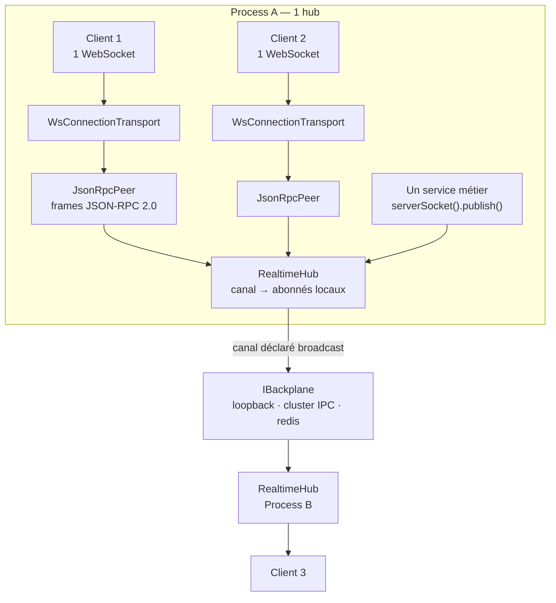
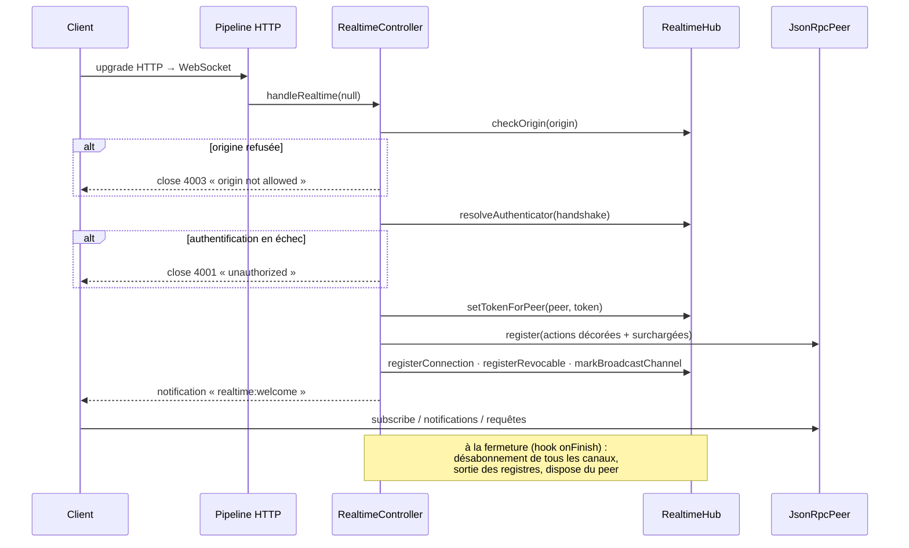

# Architecture — la socket, le hub, le backplane

> Une application temps réel Nodefony ouvre **une seule** connexion WebSocket par client
> et fait voyager **N canaux** dedans. Cette page explique la machinerie qui rend ça
> possible : le protocole qui étiquette les messages, le **hub** qui aiguille les abonnés
> d'un process, et le **backplane** qui franchit la frontière du process quand tu passes à
> plusieurs workers ou plusieurs pods. Tout est ancré sur
> `src/packages/@nodefony/realtime/nodefony/src/`.

📍 [Documentation](../../../../../docs/index.md) › [Realtime](index.md) › **Architecture**

```nodefony-livegraph
{
  "graph": "architecture",
  "height": 520,
  "title": "L'architecture, en direct",
  "hint": "Les quatre étages, avec leurs compteurs réels. OFF = aucun abonnement côté serveur ; ON = la page s'abonne au canal de santé."
}
```

## 🧠 Le modèle mental — une prise, un standard, un fond de panier

Trois objets suffisent à comprendre l'ensemble, et ils se racontent avec du matériel bien
réel :

- La **socket**, c'est la **prise murale** que tient ton code. Elle est unique, tu y
  branches ce que tu veux, tu ignores ce qu'il y a derrière le mur.
- Le **hub**, c'est le **standard téléphonique** d'un immeuble : il tient la liste
  « qui écoute quelle conférence » et recopie chaque message aux bons abonnés.
- Le **backplane**, c'est le **fond de panier** d'un rack : la carte passive au dos qui
  relie les serveurs entre eux. Il ne fait qu'une chose — porter un message d'un standard
  à l'autre.



Trois règles tiennent tout l'édifice :

1. **Chaque étage ignore les étages du dessous.** Ton contrôleur appelle `publish()` ; il
   ne sait pas s'il tourne seul ou dans un cluster de douze pods.
2. **Le fan-out local est fait AVANT la propagation.** Le hub sert d'abord ses abonnés,
   puis passe le relais au backplane.
3. **Ce qui arrive du backplane n'y retourne jamais.** C'est la barrière anti-boucle, sans
   laquelle un message tournerait à l'infini entre les pods.

## 📖 Lexique

| Terme         | Sens                                                                                                   |
| ------------- | ------------------------------------------------------------------------------------------------------ |
| Socket        | La prise que tient le métier : un handle, N canaux multiplexés. Contrat `IRealtimeSocket` (isomorphe). |
| Hub           | Le broker d'un process : table « canal → abonnés locaux » + fan-out. Classe `RealtimeHub`.             |
| Peer          | Le moteur de protocole d'**une** connexion. Classe `JsonRpcPeer`, identique serveur et navigateur.     |
| Transport     | Le câble : ce qui déplace des octets. Côté serveur `WsConnectionTransport`.                            |
| Frame         | Un message JSON-RPC 2.0 sur le fil (requête, réponse ou notification).                                 |
| Canal         | Un nom logique auquel on s'abonne (`chat:room-42`). Plusieurs canaux partagent une connexion.          |
| Fan-out       | Recopier une charge à tous les abonnés d'un canal.                                                     |
| Backplane     | Le fond de panier : porte les publications d'un process à l'autre. Contrat `IBackplane`.               |
| Provider      | Le producteur d'un canal (ticker, écouteur). **Un seul par canal et par process**, partagé.            |
| Sink          | Le point de livraison d'**une** connexion sur un canal. 1 sink = 1 client abonné.                      |
| `originId`    | L'étiquette du process émetteur, comparée pour jeter les messages qui reviennent à leur source.        |
| Anti-écho     | Le filtre qui jette ces retours. Sans lui, un message se dédoublerait à chaque aller-retour.           |
| Backpressure  | La file d'envoi non drainée d'un client lent (`bufferedAmount`). Le risque mémoire numéro un.          |
| RPC           | _Remote Procedure Call_ : une frame avec `id`, qui attend une réponse corrélée.                        |
| Sonde (probe) | Lecture pure de l'état du hub (canaux, fan-out, connexions, backpressure).                             |
| IPC           | _Inter-Process Communication_ : le canal de messages entre le master d'un cluster Node et ses workers. |

## Qu'est-ce qu'une socket multiplexée ?

Le réflexe naïf, quand une page a besoin de trois flux temps réel (un chat, un compteur de
présence, une barre de progression), c'est d'ouvrir trois WebSockets : trois handshakes,
trois authentifications, trois reconnexions à orchestrer.

**Multiplexer**, c'est ouvrir **une** connexion et étiqueter chaque message avec le nom du
flux auquel il appartient — une multiprise : un seul câble au mur, N appareils derrière. Le
prix à payer est un protocole d'étiquetage ; le gain, une authentification et un seul état
de connexion à afficher.

Nodefony étiquette avec **JSON-RPC 2.0**, une norme publique plutôt qu'un format maison :

| Forme de frame   | A un `id` ?  | Attend une réponse ?            | À quoi ça sert                                 |
| ---------------- | ------------ | ------------------------------- | ---------------------------------------------- |
| **requête**      | oui          | oui (une Promise côté émetteur) | appeler une action et récupérer son résultat   |
| **réponse**      | oui (miroir) | non                             | le résultat, corrélé par son `id`              |
| **notification** | non          | non                             | pousser un événement, s'abonner, se désabonner |

Le point remarquable : le **même** moteur de protocole tourne des deux côtés du fil. La
classe `JsonRpcPeer` (`JsonRpcPeer.ts:271`) est du code isomorphe du cœur — le navigateur
l'exécute dans `RealtimeClient`, le serveur l'instancie une fois par connexion dans
`RealtimeController.onHandshake()` (`RealtimeController.ts:312`). Le serveur peut donc
appeler le client, pas seulement l'inverse : c'est du vrai duplex, pas un aller-retour
déguisé.

## La vision Nodefony — un handle, N canaux, zéro couplage au cluster

Trois partis pris distinguent cette pile d'un simple « serveur WebSocket ».

**Un seul contrat de socket, des deux côtés.** Un service back qui pousse des événements
écrit le même code qu'une page front : `publish` / `subscribe` / `on`. Côté serveur c'est
`ServerRealtimeSocket` (`ServerRealtimeSocket.ts:43`), obtenu par `serverSocket()`
(`ServerRealtimeSocket.ts:223`) ; côté navigateur, `RealtimeClient`. Une exception, assumée
et explicite : `ServerRealtimeSocket.request()` (`ServerRealtimeSocket.ts:131`) **rejette
toujours** — un handle posé sur le hub n'a pas d'interlocuteur unique, puisque le hub est
multi-clients. Pour un appel serveur→client ciblé, on passe par la connexion :
`RealtimeController.requestClient()` (`RealtimeController.ts:263`).

**Un provider par canal, pas un par client.** Si mille onglets s'abonnent au même canal de
santé, le calcul ne doit tourner qu'une fois. Le hub crée le producteur au **premier**
abonné et le détruit au **dernier** (`RealtimeHub.subscribe()`, `RealtimeHub.ts:388`) : le
coût suit le nombre de canaux, pas le nombre de clients.

**Le cluster est un détail de configuration.** Ni ton contrôleur ni ton client ne savent
combien de process tournent ; le seul objet au courant est le backplane, choisi par une
chaîne de caractères. Passer de mono-process à multi-pods ne touche aucune ligne applicative.

**Le compromis, dit franchement** : un canal **ne franchit PAS** la frontière du process
tant que tu ne l'as pas déclaré. Le défaut est l'isolement (`RealtimeHub.publish()`,
`RealtimeHub.ts:530`) — un choix de sûreté détaillé plus bas.

## 🚀 Démarrage rapide

Un salon de discussion complet, vu d'une application créée par `nodefony create app` :
trois fichiers, et il fonctionne en mono-process comme en cluster.

### 1. Charger le module et choisir le fond de panier

```ts
// nodefony.config.ts
import { defineConfig, use } from "nodefony";

export default defineConfig(() => ({
  modules: [
    "@nodefony/framework",
    use("@nodefony/realtime", {
      // "loopback" = un seul process : le hub suffit, aucun transport réseau.
      // "cluster" (workers IPC) ou "redis" (multi-pods) sans changer une ligne de code.
      backplane: { driver: "loopback" },
      // Défense CSRF de l'upgrade WebSocket : SameSite ne protège pas un handshake.
      csrf: {
        checkOrigin: {
          enabled: true,
          allowList: ["http://localhost:5151"],
        },
      },
    }),
  ],
}));
```

### 2. Le contrôleur temps réel — ton seul code serveur

```ts
/// <reference lib="es2025" />
// ↑ utile uniquement si ton tsconfig fixe `lib` sous ES2025 : les paquets Nodefony
//   exposent leurs types en SOURCE. Le tsconfig généré par `nodefony create app`
//   porte déjà `"lib": ["ESNext", …]` — tu n'as alors rien à ajouter.
// nodefony/controllers/ChatController.ts
import { controller, route } from "@nodefony/framework";
import {
  RealtimeController,
  RealtimeChannel,
  RealtimeInbound,
  serverSocket,
} from "@nodefony/realtime";
import type { RealtimePublish } from "@nodefony/realtime";
import type { ContextType } from "@nodefony/http";

interface ChatMessage {
  from: string;
  text: string;
  ts: number;
}

@controller("/chat")
class ChatController extends RealtimeController {
  constructor(context: ContextType) {
    super("chat", context);
  }

  // UNE route WebSocket : la base porte tout le protocole, tu délègues.
  @route("chat-realtime", {
    path: "/realtime",
    requirements: { methods: ["WEBSOCKET"] },
  })
  async realtime(message: string | Buffer | null): Promise<void> {
    this.handleRealtime(message);
  }

  // Canaux annoncés au client dans le message de bienvenue (découverte).
  protected override realtimeChannels(): string[] {
    return ["chat:room-42"];
  }

  // OPT-IN cross-process : sans cette ligne, un message publié sur le pod A
  // ne sortirait jamais du pod A. Le préfixe couvre `chat:*`.
  // (le préfixe diffusable est déclaré par `@RealtimeBroadcast` sur la classe)

  // Le provider du canal : créé au 1ᵉʳ abonné, son `dispose` appelé au dernier.
  // Ici rien à produire — le contenu vient des clients, pas d'un ticker.
  @RealtimeChannel("chat:room-42")
  room(_channel: string, _publish: RealtimePublish): () => void {
    return () => {};
  }

  // Canal FULL-DUPLEX : le client a le droit de pousser ici (défaut : interdit).
  @RealtimeInbound("chat:send")
  onSend(params: unknown, reply: (payload: unknown) => void): void {
    // `params` vient du réseau : jamais de confiance, on valide d'abord.
    const text = (params as { text?: unknown } | undefined)?.text;
    if (typeof text !== "string" || text.length === 0) return;
    const msg: ChatMessage = { from: "anonyme", text, ts: Date.now() };
    serverSocket().publish("chat:room-42", msg); // fan-out à tous les abonnés
    reply({ ok: true }); // accusé, à CETTE connexion seulement
  }
}

export default ChatController;
```

### 3. Le client — navigateur, mobile ou autre serveur

```ts
// frontend/src/chat.ts
import { RealtimeClient } from "nodefony/client";

interface ChatMessage {
  from: string;
  text: string;
  ts: number;
}

const scheme = location.protocol === "https:" ? "wss" : "ws";
// `shared` = une seule socket par URL pour toute la page, même si dix
// composants la demandent (les options ne comptent qu'à la création).
const socket = RealtimeClient.shared({
  url: `${scheme}://${location.host}/chat/realtime`,
});

// `on` REÇOIT, `subscribe` DEMANDE au serveur de pousser. Les deux sont nécessaires.
socket.on("chat:room-42", (msg: unknown) => {
  const m = msg as ChatMessage;
  console.log(`[${m.ts}] ${m.from}: ${m.text}`);
});

export async function start(): Promise<void> {
  await socket.connect();
  socket.subscribe("chat:room-42");
  socket.publish("chat:send", { text: "Salut !" });
}
```

### Ce qu'on observe

Au démarrage du serveur, le module annonce son fond de panier — une ligne, toujours la
même forme, quel que soit le driver (`src/packages/@nodefony/realtime/index.ts:303`) :

```
realtime backplane  driver=loopback kind=local cross-pod=no (hub local)
```

Puis, en ouvrant deux onglets, la sonde montre le canal vivant et ses deux abonnés :

```bash
curl -s http://localhost:5151/nodefony/realtime/api/health | head -20
# {
#   "instanceId": "51234",
#   "channels": [{ "channel": "chat:room-42", "subscribers": 2, "messages": 7 }],
#   "channelCount": 1,
#   "publishTotal": 7, "fanoutTotal": 14, "inboundTotal": 7,
#   "connectionCount": 2,
#   "backpressure": { "maxBufferedAmount": 0, "slowConsumers": 0, "drops": 0 },
#   "backplane": { "driver": "loopback", "kind": "local", "crossPod": false }
# }
```

`publishTotal` compte les publications, `fanoutTotal` les livraisons réelles : l'écart
entre les deux **est** le facteur d'amplification du canal.

## 🏗️ Architecture interne — les quatre étages

La pile se lit de haut en bas ; chaque étage ne connaît que son voisin du dessous.

| Étage      | Qui                                                     | Sa seule responsabilité                 | Ce qu'il ignore               |
| ---------- | ------------------------------------------------------- | --------------------------------------- | ----------------------------- |
| Applicatif | ton contrôleur, tes services                            | le métier : quoi publier, quoi accepter | tout le reste                 |
| Protocole  | `JsonRpcPeer` (`JsonRpcPeer.ts:271`)                    | étiqueter, corréler, refuser une frame  | par où passent les octets     |
| Transport  | `WsConnectionTransport` (`WsConnectionTransport.ts:46`) | déplacer des octets, mesurer la file    | ce que veut dire un message   |
| Hub        | `RealtimeHub` (`RealtimeHub.ts:213`)                    | table des abonnés locaux + fan-out      | qu'il existe d'autres process |
| Backplane  | `IBackplane` (`IBackplane.ts:75`)                       | porter un message aux autres process    | ce qu'est un abonné           |

> [!NOTE]
> Une part de la documentation historique décrit cette pile en « 5 étages » en comptant
> ton code applicatif comme un étage à part. C'est le même découpage : **quatre briques du
> framework**, plus ce que tu écris.

### L'étage protocole — le même moteur des deux côtés

`JsonRpcPeer` porte tout le plan de contrôle d'une connexion : corrélation des `id`,
dispatch des notifications, gestion des erreurs, `dispose()` propre. Deux points
d'interception y sont posés :

- `beforeDispatch` (`JsonRpcPeer.ts:172`) — un verrou **synchrone** appelé avant tout
  traitement de frame. Il rend `true`/`false`. Un refus sur une requête produit
  `-32001 unauthorized` ; sur une notification, la frame est jetée
  (`JsonRpcPeer.ts:413`).
- `onFrameAudit` (`JsonRpcPeer.ts:210`) — la trace des événements protocolaires notables
  (frame invalide, refusée, méthode inconnue, erreur interne).

La contrainte de synchronisme n'est pas un oubli : un `await` par frame coûterait une
microtâche et sérialiserait le pipeline du peer. L'identité, elle, est résolue **une fois**
au handshake, puis lue en O(1). C'est le compromis assumé, documenté dans
[la page sécurité](./securite.md).

### L'étage transport — le serveur ne lit pas la socket

Particularité contre-intuitive : côté serveur, le transport **n'écoute pas** d'événement
socket. C'est le pipeline HTTP de `@nodefony/http` qui appelle la route WebSocket du
contrôleur à chaque message reçu, laquelle pousse la charge dans
`WsConnectionTransport.feed()` (`WsConnectionTransport.ts:146`). La fermeture arrive de la
même façon, par le hook `onFinish` du contexte, qui déclenche `fireClose()`
(`WsConnectionTransport.ts:151`).

Ce transport porte aussi la **back-pressure**. Elle n'est pas câblée en dur : les trois
leviers sont des clés de configuration du serveur WebSocket, lues par le transport
(`WsConnectionTransport.ts:63-75`) et documentées dans `@nodefony/http`
(`http/nodefony/config/config.ts:625`).

| File non drainée (`bufferedAmount`)     | Décision                                            | Réglage (défaut)                                                                      |
| --------------------------------------- | --------------------------------------------------- | ------------------------------------------------------------------------------------- |
| sous le seuil                           | envoi normal                                        | —                                                                                     |
| au-dessus du seuil                      | politique appliquée : frame **jetée**, ou fermeture | `websocket.maxBackpressure` (**4 MiB**) · `websocket.backpressurePolicy` (**`drop`**) |
| drops **consécutifs** au-delà du compte | fermeture `1013` (_Try Again Later_)                | `websocket.backpressureCloseAfterDrops` (**1000**)                                    |

Deux points que la formulation « deux seuils d'octets » faisait manquer : la fermeture ne
se déclenche pas sur un volume mais sur une **suite de frames jetées** — une seule frame
qui repart remet le compteur à zéro — et `drop` est un choix, `close` fermant dès le
premier dépassement. Jeter est acceptable parce que les canaux d'état sont « le dernier
gagne » : le prochain instantané remplace celui qu'on a sauté.

À ne pas confondre avec `SLOW_CONSUMER_BYTES` (`RealtimeHub.ts:63`, 1 MiB) : ce seuil-là
ne jette rien, il **compte** — c'est celui à partir duquel la sonde marque une connexion
`slowConsumer`.

Sans ces seuils, un client lent — onglet en arrière-plan, mobile sur réseau dégradé —
accumule sans borne côté serveur, et le multiplexage aggrave le phénomène : une connexion
lente retient **tous** ses canaux.

Le schéma ci-dessous rend ces étages vivants : active le temps réel et il respire au rythme

## 🔌 Le cycle de vie d'une connexion

Tout se joue dans `RealtimeController.onHandshake()` (`RealtimeController.ts:312`), appelé
une seule fois par connexion, en chemin froid.



Les étapes, dans l'ordre exact du code :

1. **Contrôle de l'origine** — `RealtimeHub.checkOrigin()` (`RealtimeHub.ts:896`). Refus →
   fermeture `4003`. La politique vient de la configuration ; sans politique, tout passe.
2. **Résolution de l'identité** — `RealtimeHub.resolveAuthenticator()`
   (`RealtimeHub.ts:871`) parcourt les authentificateurs enregistrés : **le premier motif
   qui correspond capture**. Aucun ne correspond ? Le jeton anonyme gelé est posé
   (`ANONYMOUS_REALTIME_TOKEN`) — la lecture d'identité ne rend donc jamais `null`. Un
   échec d'authentification ferme en `4001`.
3. **Création du peer et du transport**, puis association `peer → jeton`
   (`RealtimeHub.setTokenForPeer()`, `RealtimeHub.ts:928`), stockée dans une `WeakMap` : le
   jeton disparaît avec le peer, sans fuite.
4. **Enregistrement des actions** — celles des décorateurs `@RealtimeAction`, puis celles
   de la surcharge `realtimeActions()`, qui gagne en cas de conflit. Le pont API
   `api.request` n'est ajouté que si `realtimeApiRequest()` (`RealtimeController.ts:219`)
   rend `true`.
5. **Inscription aux registres** : sonde de connexion, révocation périodique si le jeton
   est révocable, préfixes de canaux broadcast, canaux entrants.
6. **Message de bienvenue** `realtime:welcome` : canaux et méthodes découvrables, plus
   l'identité résolue (type, authentifié ou non, rôles, portées). Le client sait **qui il
   est** sans appeler la moindre route.

À la fermeture, un unique `onFinish` (`RealtimeController.ts:542`) fait le ménage complet :
désabonnement de chaque canal tenu, retrait des deux registres, `fireClose()` du transport,
`dispose()` du peer. C'est ce qui garantit qu'aucun minuteur ni écouteur ne survit à une
déconnexion.

> [!IMPORTANT]
> Les frames reçues **pendant** l'authentification sont jetées silencieusement : le
> transport n'est pas encore branché. C'est au client d'attendre `realtime:welcome` avant
> de pousser — ce que `RealtimeClient` fait nativement.

### Deux gardes qui ferment la connexion

| Garde                 | Déclencheur                                                            | Effet                                               | Ancrage                     |
| --------------------- | ---------------------------------------------------------------------- | --------------------------------------------------- | --------------------------- |
| Plafond de canaux     | une connexion dépasse son quota d'abonnements (256 par défaut)         | abonnement refusé + `realtime:denied` motif `limit` | `RealtimeController.ts:618` |
| Révocation d'identité | tick périodique ; `token.isValid()` rend `false` ou lève une exception | fermeture `4001` « session revoked »                | `RealtimeHub.ts:48`         |

La seconde mérite une explication. Le verrou de frame est synchrone et lit une identité
figée au handshake : il ne peut donc pas voir une session qui meurt en cours de route (une
déconnexion HTTP, par exemple). Un minuteur — démarré au premier inscrit, arrêté dès que le
registre se vide (`RealtimeHub.registerRevocable()`, `RealtimeHub.ts:704`) — relit
périodiquement ces identités et coupe les sockets orphelines. Seules les identités
**révocables** y entrent : un visiteur anonyme ne coûte rien.

## Le hub — canaux partagés et fan-out

Le hub est un singleton par process (`getRealtimeHub()`, `RealtimeHub.ts:1233`). Il ne
dépend de rien : ce sont les fabriques fournies par les contrôleurs qui portent les
dépendances.

### Le provider partagé — un ticker, pas mille

`RealtimeHub.subscribe()` (`RealtimeHub.ts:388`) applique une mécanique en trois temps :

1. Le canal existe déjà ? On ajoute simplement le sink de cette connexion. Fin.
2. Sinon, on inscrit le sink **avant** d'appeler la fabrique — de sorte que le tout premier
   paquet du producteur atteigne bien ce premier abonné.
3. La fabrique du contrôleur rend `null` (canal inconnu de lui) ? Dernier recours : le
   registre des **canaux système** (`RealtimeHub.registerSystemChannel()`,
   `RealtimeHub.ts:1117`), qu'un module bas niveau alimente au démarrage. Toujours `null` →
   l'abonnement est refusé et rien n'est alloué.

Au dernier désabonnement, `RealtimeHub.unsubscribe()` (`RealtimeHub.ts:502`) appelle le
`dispose` du producteur et retire le canal. Un producteur fautif qui lève une exception ne
bloque pas le nettoyage.

> [!WARNING]
> Un producteur est **partagé** et survit à la connexion qui l'a créé. Il doit capturer des
> valeurs à longue durée de vie (le noyau, un service, un journal) — **jamais** le contexte
> de la connexion créatrice, qui peut fermer alors que le producteur tourne toujours.

### `publish` et `publishLocal` — la barrière anti-boucle

Deux méthodes qui se ressemblent et ne font pas du tout la même chose :

| Méthode                                 | Fan-out local |   Propagation aux autres process   | Qui l'appelle                       |
| --------------------------------------- | :-----------: | :--------------------------------: | ----------------------------------- |
| `publish()` (`RealtimeHub.ts:530`)      |      oui      | oui, **si** le canal est broadcast | producteurs, contrôleurs, services  |
| `publishLocal()` (`RealtimeHub.ts:549`) |      oui      |             **jamais**             | l'arrivée d'un message du backplane |

C'est **la** règle qui empêche la tempête : un message reçu d'un pair est réinjecté
localement et **ne repart pas**. Le câblage se fait une fois pour toutes dans
`RealtimeHub.setBackplane()` (`RealtimeHub.ts:640`), qui branche l'arrivée du backplane
directement sur `publishLocal`.

Le fan-out lui-même (`RealtimeHub.ts:340`) est **isolé** : chaque livraison est protégée,
une connexion fautive n'interrompt pas la diffusion aux autres.

### Le forward est OPT-IN — le défaut est l'isolement

Par défaut, **aucun canal ne traverse le backplane**. Il faut déclarer un préfixe, via
`@RealtimeBroadcast` sur ton contrôleur (`realtimeDecorators.ts:342`) ou
directement `RealtimeHub.markBroadcastChannel()` (`RealtimeHub.ts:594`).

Trois raisons à ce choix, qui prend à contre-pied la plupart des bibliothèques temps réel :

1. **Sûreté.** Aucune donnée propre à une instance — journaux, sondes, état interne — ne
   fuit vers un autre process sans intention explicite.
2. **Justesse par défaut.** Tous les canaux d'observabilité sont per-instance : ils restent
   corrects en cluster sans la moindre déclaration.
3. **Le franchissement devient une capacité qu'un canal demande**, donc une décision qu'on
   lit dans le code du contrôleur.

Le drapeau est résolu **une fois**, au premier abonné, et mis en cache dans l'état du canal
— le chemin chaud ne lit qu'un booléen. Et en mono-process, la politique n'est **jamais**
évaluée : `publish` sort sur un simple test de nullité du backplane.

> [!WARNING]
> Le symptôme classique : « mon chat marche en local, mais en cluster les onglets ne se
> voient plus ». Cause : le préfixe `chat:` n'est pas déclaré broadcast. Le préfixe couvre
> la granularité, donc `chat:` attrape aussi `chat:room-42` et `chat:room-42:1000`.

Une publication part vers N destinations : le schéma suivant montre ce trajet, et ce que
coûte chaque abonné supplémentaire.

```nodefony-livegraph
{
  "graph": "fan-out",
  "height": 500,
  "title": "Le fan-out, en direct",
  "hint": "Le nombre d'abonnés et le volume diffusé viennent de la sonde ; la branche cross-worker ne s'allume que si un canal est déclaré diffusable."
}
```

## Le backplane — franchir la frontière du process

### Le contrat, en cinq méthodes

`IBackplane` (`IBackplane.ts:75`) est délibérément minuscule : le backplane ne connaît ni
les abonnés ni les canaux logiques. Tout l'état vit dans le hub.

| Membre                                           | Rôle                                                            |
| ------------------------------------------------ | --------------------------------------------------------------- |
| `originId` (`IBackplane.ts:77`)                  | l'étiquette de CE process, lue par l'anti-écho                  |
| `start()` (`IBackplane.ts:115`)                  | ouvrir le transport. Idempotent, synchrone ou asynchrone        |
| `publish(channel, payload)` (`IBackplane.ts:89`) | propager aux **autres** pairs. Ne refait pas le fan-out local   |
| `onMessage(handler)` (`IBackplane.ts:127`)       | recevoir des pairs. Un seul gestionnaire à la fois              |
| `stop()` (`IBackplane.ts:130`)                   | libérer connexions et écouteurs. Idempotent                     |
| `describe()` (`IBackplane.ts:136`)               | la carte d'identité : driver, nature, origine, cross-pod, canal |

Deux absences volontaires. Il n'y a **pas** de `subscribe`/`unsubscribe` par canal : le
transport porte **un seul** canal physique, et les canaux logiques voyagent **dans**
l'enveloppe (`IBackplaneMessage`, `IBackplane.ts:51`). Un seul abonnement au démarrage,
zéro (dés)abonnement dynamique — et le hub reste seul maître de la table des canaux.

`describe()`, lui, alimente **trois sorties cohérentes** depuis une source unique : la ligne
de journal au démarrage, le champ `backplane` de la sonde, et la vue Studio. Personne ne
redit « c'est quoi ce backplane ».

**Garantie de livraison : au plus une fois, au mieux.** Un pub/sub ne persiste ni ne rejoue.
Un process déconnecté rate les messages émis pendant sa coupure ; c'est le client qui se
resynchronise. Ne construis pas au-dessus une fiabilité que le support n'offre pas.

### Les drivers natifs

| Driver     | Classe                                          | Nature         | Pairs                              | Traverse les pods |
| ---------- | ----------------------------------------------- | -------------- | ---------------------------------- | :---------------: |
| `loopback` | `LoopbackBackplane` (`LoopbackBackplane.ts:24`) | `local`        | aucun (no-op complet)              |        non        |
| `cluster`  | `ClusterBackplane` (`ClusterBackplane.ts:89`)   | `ipc`          | les workers du même process maître |        non        |
| `redis`    | `RedisBackplane` (`RedisBackplane.ts:161`)      | `redis-pubsub` | tous les pods abonnés au canal     |      **oui**      |

**`loopback`** est le défaut. En réalité, le hub garde son backplane à `null` en
mono-process : le coût est un test de nullité, pas un appel. La classe existe pour
matérialiser le contrat et prouver, en test, que brancher un backplane sans pair ne change
rien.

**`cluster`** relie les workers d'un même hôte. Un worker Node ne peut parler qu'au maître :
il émet vers lui (`ClusterBackplane.publish()`, `ClusterBackplane.ts:117`), le maître
rediffuse aux autres. Le driver ne s'active qu'en rôle worker avec la variable
`NF_CLUSTER=1` (`src/packages/@nodefony/realtime/index.ts:99`) ; ailleurs il rend
`null`. Aucune infrastructure requise — c'est le banc d'essai qui stabilise l'architecture
multi-process avant d'ajouter du réseau.

**`redis`** franchit la frontière de l'hôte, sans dépendre de la bibliothèque `redis` : il
consomme deux connexions du module `@nodefony/redis` via un adaptateur purement structurel,
`createRedisServiceTransport()` (`RedisBackplane.ts:100`). Deux connexions et non une, parce
qu'un client Redis abonné ne peut plus émettre de commandes ordinaires. Module absent ou
connexions indisponibles → avertissement, `null`, hub local, démarrage poursuivi
(`src/packages/@nodefony/realtime/index.ts:108`).

### Le registre de drivers — zéro nom en dur

Choisir le driver par une cascade de `if (driver === "redis")` trahirait la promesse de
brancherie. La sélection passe donc par un registre — `registerBackplaneDriver()`
(`backplaneRegistry.ts:55`) et `getBackplaneDriver()` (`backplaneRegistry.ts:63`) : chaque
driver porte son nom en membre statique, les natifs s'inscrivent au chargement du module, et
le câblage résout une chaîne vers une fabrique sans connaître aucun littéral
(`src/packages/@nodefony/realtime/index.ts:253`).

Une fabrique reçoit module, `originId`, rôle dans la topologie et configuration validée
(`IBackplaneFactoryContext`, `backplaneRegistry.ts:27`), puis rend une instance ou `null`
(« inactif ici »). Elle ne démarre rien : c'est le câblage qui appelle `start()`.

### L'anti-écho et l'`originId`

Redis renvoie à l'émetteur ce qu'il publie (le publieur et l'abonné sont deux connexions du
même process). Sans filtre, le fan-out local serait fait deux fois. D'où **deux barrières**,
et non une :

1. **Côté hub** : l'arrivée passe par `publishLocal`, jamais par `publish`. Rien ne repart.
2. **Côté backplane** : à la réception, on compare l'`originId` de l'enveloppe au sien et
   on jette si c'est le même (`RedisBackplane.ts:220`, `ClusterBackplane.ts:134`).

L'étiquette elle-même est calculée par `resolveBackplaneOriginId()` (`originId.ts:24`), et
sa recette mérite qu'on s'y arrête :

| Étape              | Valeur              | Pourquoi                                                                                              |
| ------------------ | ------------------- | ----------------------------------------------------------------------------------------------------- |
| 1. explicite       | variable `POD_NAME` | l'opérateur sait mieux que nous (API descendante Kubernetes)                                          |
| 2. filet           | `os.hostname()`     | nom de pod en Kubernetes, identifiant de conteneur en Docker, nom de machine ailleurs                 |
| 3. toujours ajouté | suffixe `:pid`      | distingue les workers d'un même hôte (cluster + driver `redis`)                                       |
| 4. dernier recours | `randomUUID()`      | hôte indisponible ; l'unicité à l'instant t suffit, la stabilité entre redémarrages n'est pas requise |

> [!CAUTION]
> Prendre le PID seul serait un piège sournois : en conteneur, l'espace de noms des PID est
> **par conteneur**, donc deux pods peuvent tous deux être PID 1. L'anti-écho les
> confondrait et jetterait **silencieusement** du fan-out légitime — la pire des pannes,
> celle qui ne lève aucune erreur. L'`originId` est résolu à la construction : coût nul par
> message.

### Le cloisonnement du canal Redis

Le canal pub/sub de base est `nodefony:realtime` (`RedisBackplane.ts:20`). Problème : le
numéro de base Redis **ne cloisonne pas** le pub/sub, qui est global au serveur. Deux
applications sur un Redis mutualisé se parleraient.

D'où le suffixe de cloison, calculé par `resolveRedisChannel()` (`RedisBackplane.ts:31`) :
le canal effectif devient `nodefony:realtime:<namespace>`. Le namespace vient de la
configuration ; à défaut, il est dérivé du nom de l'application
(`src/packages/@nodefony/realtime/index.ts:132`).

> [!TIP]
> Deux déploiements de la **même** application sur un Redis partagé (préproduction et
> production, par exemple) obtiennent le même nom dérivé — donc le même canal. Pose un
> namespace **explicite et distinct** dans ces cas-là.

L'entrée est par ailleurs blindée : un JSON malformé publié par un tiers sur le même canal
est ignoré, pas propagé (`RedisBackplane.ts:212`).

### Le démarrage, et ce qui se passe quand ça rate

Le module valide sa configuration par Zod à l'enregistrement
(`src/packages/@nodefony/realtime/index.ts:181`), puis câble tout au démarrage du noyau
(`src/packages/@nodefony/realtime/index.ts:213`) — après l'initialisation des services (le
service Redis a donc ouvert ses connexions) et avant le trafic.

Le `start()` du backplane est **attendu explicitement avant** d'être branché : un driver
asynchrone brancherait sinon un abonnement incomplet et perdrait ses premiers messages. Et
il est **borné par un délai** de cinq secondes
(`src/packages/@nodefony/realtime/index.ts:83`), pour une raison très concrète : un
transport réseau qui reste pendu gèlerait la phase de démarrage, et donc la montée des
serveurs HTTP eux-mêmes.

Trois issues, toutes annoncées, jamais silencieuses :

| Situation                                    | Comportement                         | Journal   |
| -------------------------------------------- | ------------------------------------ | --------- |
| driver actif, démarrage réussi               | branché ; carte d'identité complète  | `INFO`    |
| driver inactif ici (loopback, mauvais rôle)  | hub local                            | `INFO`    |
| driver inconnu, ou démarrage en échec/expiré | hub local, **le démarrage continue** | `WARNING` |

Le module se déclare non critique (`src/packages/@nodefony/realtime/index.ts:144`) : son
échec ne tue jamais le process. C'est de la résilience **sans dégradation silencieuse** —
tout repli est annoncé. Enfin, `enabled: false` rend le module totalement inerte : ni API
d'administration, ni backplane, ni sonde.

## 🧩 Extension — brancher son propre fond de panier

Trois voies, de la plus déclarative à la plus directe.

**1. Enregistrer un driver** — la voie recommandée : ton driver devient sélectionnable par
son nom, comme les natifs.

```typescript
import { registerBackplaneDriver, type IBackplane } from "@nodefony/realtime";

class NatsBackplane implements IBackplane {
  static readonly driver = "nats";
  readonly originId: string;
  /* start / publish / onMessage / stop / describe */
}

registerBackplaneDriver(
  NatsBackplane.driver,
  (ctx) => new NatsBackplane(/* … */ ctx.originId),
);
// puis, en configuration : backplane: { driver: "nats" }
```

**2. Déclarer un service** nommé `realtimeBackplane` dans le conteneur d'injection —
**la voie « instance » pour une application**. `RealtimeService.init()`
(`RealtimeService.ts:79`) le résout et le branche **avant** le registre : une instance
déjà fournie court-circuite la sélection par nom.

**3. Passer une instance** en second argument de `defineRealtimeConfig()` — réservé au
code qui **appelle le builder lui-même** (un `Module` sur mesure, une intégration
programmatique). Une application qui configure via `use("@nodefony/realtime", …)` **ne
l'atteint pas** : elle ne construit pas la config (le module appelle
`defineRealtimeConfig(this.options)` sans second argument, `index.ts:216`), et une
instance posée dans l'objet de config est retirée par la validation Zod (elle n'est pas
au schéma). Pour une app, la voie « instance » est l'option 2 ci-dessus.

Le registre s'introspecte : `listBackplaneDrivers()` (`backplaneRegistry.ts:68`) rend les
noms disponibles — c'est ce que le message d'erreur affiche quand un driver déclaré est
introuvable.

## 🔐 Où la sécurité se greffe

L'architecture prévoit des points de greffe pour que `@nodefony/security` s'y branche sans
refonte. Ici, seulement **où** ils sont ; le **quoi** et le **comment** sont dans
[la page sécurité](./securite.md).

| Point de greffe              | Étage     | Moment         | Ancrage                     |
| ---------------------------- | --------- | -------------- | --------------------------- |
| Contrôle d'origine           | hub       | à l'upgrade    | `RealtimeHub.ts:614`        |
| Authentificateur réseau      | hub       | au handshake   | `RealtimeHub.ts:579`        |
| Verrou de frame              | protocole | à chaque frame | `RealtimeHub.ts:675`        |
| Politique déclarée par canal | hub       | au handshake   | `RealtimeHub.ts:713`        |
| Audit de frame               | protocole | sur refus      | `RealtimeController.ts:404` |

Deux propriétés architecturales méritent d'être notées ici, parce qu'elles expliquent des
choix de conception visibles partout dans le module :

**Coût nul quand la sécurité est absente.** Le verrou de frame n'est branché sur le peer que
si une politique existe (`RealtimeHub.hasFrameAuthorizer()`, `RealtimeHub.ts:961`, testé une
fois au handshake). Sans module de sécurité, `beforeDispatch` reste indéfini et le chemin
chaud ne paie **rien** du tout.

**Échec bruyant plutôt que faux sentiment de sécurité.** Si des canaux déclarent une
politique sans qu'aucun décideur ne soit câblé, `hasUnenforcedChannelPolicies()`
(`RealtimeHub.ts:1020`) le détecte et un avertissement est émis une fois par process
(`RealtimeController.ts:487`). Un canal qui **se croit** gardé alors qu'il est ouvert est
bien plus dangereux qu'un canal ouvertement public.

## 📡 Observabilité — la sonde et Studio

`RealtimeHub.probe()` (`RealtimeHub.ts:775`) rend un instantané en **lecture pure** : aucune
allocation sur le chemin chaud, jamais d'exception. Les compteurs sont des primitives
incrémentées en O(1) ; ils sont **monotones**, ce qui laisse au lecteur le soin de dériver
un débit.

| Famille        | Champs                                                               | Ce que ça dit                    |
| -------------- | -------------------------------------------------------------------- | -------------------------------- |
| Canaux         | `channels[]` (`channel`, `subscribers`, `messages`), `channelCount`  | qui vit, qui écoute              |
| Fan-out        | `publishTotal`, `fanoutTotal`, `inboundTotal`                        | l'amplification réelle du broker |
| Connexions     | `connectionCount`, `bytesSentTotal`, `messagesSentTotal`             | le volume                        |
| Back-pressure  | `maxBufferedAmount`, `totalBufferedAmount`, `slowConsumers`, `drops` | le risque mémoire numéro un      |
| Fond de panier | `backplane` (la carte d'identité de `describe()`)                    | ce qui est réellement branché    |

Le contrat complet est `IRealtimeProbe` (`IRealtimeProbe.ts:61`). La version enrichie
`buildOwnHealth()` (`RealtimeAdminApi.ts:52`) y ajoute l'identifiant d'instance et la sonde
process, plus — si elles sont disponibles — les sondes ORM et les compteurs d'erreurs. Deux
chemins de lecture, un seul producteur :

- **HTTP** : `GET /nodefony/realtime/api/health`, exposé par `createRealtimeAdminApi()`
  (`RealtimeAdminApi.ts:91`) ;
- **Canal temps réel** : `nodefony:socket`, poussé par un ticker.

### En cluster : la vue « pod » plutôt que « worker »

Interroger la santé en cluster pose un problème sournois : la requête atterrit sur **un**
worker au hasard, dont l'instantané ne dit rien des autres. D'où `ClusterProbeClient`
(`ClusterProbeClient.ts:138`), qui applique un modèle **push** — chaque worker remonte
périodiquement sa santé au maître (`ClusterProbeClient.ts:179`), le maître agrège et
rediffuse, chaque worker met en cache. **N'importe lequel** sert alors la vue pod en O(1),
sans latence de requête.

L'agrégation, `mergeClusterHealth()` (`ClusterProbeClient.ts:46`), est une fonction pure :
elle somme les scalaires, mais prend le **maximum** de `maxBufferedAmount` — la santé d'une
flotte se juge sur son pire membre, pas sur sa moyenne. `buildRealtimeHealth()`
(`RealtimeAdminApi.ts:74`) choisit ensuite la vue agrégée si elle existe, la per-instance
sinon.

Sonde désactivée ? Elle n'est pas muette : **elle n'existe pas**. Aucun client, donc aucun
minuteur, aucun écouteur, aucun message IPC
(`src/packages/@nodefony/realtime/index.ts:351`) — coupable par la configuration ou par une
variable d'environnement. Enfin, le maître peut demander à un worker précis d'enrichir sa
remontée (`requestEnrich()`, `ClusterProbeClient.ts:239`) : la sonde riche n'est allouée que
pendant l'inspection, puis libérée — on paie ce qu'on regarde.

## ⚡ Performance & mémoire

Le module suit une discipline stricte, lisible dans presque chaque champ privé du hub.

**Allocation paresseuse partout.** Table des canaux, registre des connexions, registre des
révocables, authentificateurs, politiques de canal, association peer→jeton : tout démarre à
`null`. Un process sans abonné n'alloue **rien** (`RealtimeHub.ts:141` et suivants).

**Aucun minuteur au repos.** Le tick de révocation démarre au premier inscrit et s'arrête
dès que le registre se vide — `RealtimeHub.unregisterRevocable()` (`RealtimeHub.ts:719`).
Les minuteurs sont détachés de la boucle d'événements : ils ne retiennent jamais l'arrêt du
process.

**Les chemins chauds sont maigres.** En mono-process, `publish` ne paie qu'un test de
nullité. Le drapeau de forward est calculé une fois puis lu en O(1). La lecture d'identité
par frame est un accès `WeakMap`. Le contrôle d'origine, la résolution
d'authentificateur, la lecture des métadonnées de décorateurs : tout est en chemin froid,
une fois par connexion.

**Le nettoyage est symétrique par construction.** Chaque inscription à un registre a son
retrait dans le même `onFinish` ; chaque producteur créé a son `dispose` appelé au dernier
désabonné.

**Le vrai point de vigilance est la back-pressure**, pas le processeur : une file d'envoi
non bornée multipliée par le nombre de clients, c'est la panne mémoire — et le multiplexage
concentre le risque. D'où les deux seuils du transport, le comptage des consommateurs lents
dans la sonde, et le plafond de canaux par connexion.

## ⚠️ Pièges

| Symptôme                                                       | Cause                                                                      | Correction                                                                 |
| -------------------------------------------------------------- | -------------------------------------------------------------------------- | -------------------------------------------------------------------------- |
| Le chat marche en local, plus rien en cluster                  | le canal n'est pas déclaré broadcast (défaut : instance-local)             | déclarer le préfixe avec `@RealtimeBroadcast`                              |
| Le client ne reçoit rien alors qu'il a un handler `on(...)`    | `on` reçoit, `subscribe` demande — il faut les **deux**                    | appeler `socket.subscribe(canal)`                                          |
| Chaque message arrive **en double** en cluster                 | `publishLocal` court-circuité, ou `originId` non unique entre pods         | ne jamais republier une arrivée backplane ; vérifier `POD_NAME`/hostname   |
| Deux applications se parlent sur un Redis mutualisé            | même canal dérivé (le numéro de base Redis ne cloisonne pas le pub/sub)    | poser un `backplane.namespace` explicite et distinct                       |
| Producteur planté après le départ du premier abonné            | la fabrique a capturé le contexte de la connexion créatrice                | ne capturer que des valeurs à longue durée de vie                          |
| Abonnement refusé avec `realtime:denied` motif `limit`         | plafond de canaux par connexion atteint (256 par défaut)                   | regrouper les canaux, ou relever le plafond en connaissance de cause       |
| Fermeture `1013` sur un client lent                            | file d'envoi ≥ 8 MiB, jugée irrécupérable                                  | attendu ; le client se reconnecte et se resynchronise                      |
| Fermeture `4001` en cours de session                           | identité révoquée, détectée par le tick de re-validation                   | se réauthentifier ; le comportement est voulu                              |
| Frames envoyées juste après `connect()` perdues                | le transport n'est pas branché tant que le handshake n'est pas fini        | attendre `realtime:welcome` (`RealtimeClient` le fait déjà)                |
| Avertissement « channel policies … NOT enforced » au démarrage | des canaux déclarent une politique sans décideur câblé                     | charger `@nodefony/security` avec une zone realtime                        |
| `ServerRealtimeSocket.request()` rejette systématiquement      | un handle posé sur le hub n'a pas d'interlocuteur unique                   | utiliser `RealtimeController.requestClient()` pour un appel ciblé          |
| `TS2550: RegExp.escape does not exist` à la compilation        | `lib` du tsconfig sous ES2025 (les paquets exposent leurs types en source) | `"lib": ["ESNext", …]`, comme le tsconfig généré par `nodefony create app` |

## 🧪 Tests & couverture

Cinq familles couvrent cette architecture. Les chiffres exacts vivent dans la carte de
l'aperçu, régénérée depuis les résultats réels — jamais figés ici.

- **Unitaires** — le cœur du fan-out (`RealtimeHub`), le cycle de connexion
  (`RealtimeController`), la façade d'injection (`RealtimeService`), les trois backplanes,
  le registre de drivers, la résolution d'`originId`, les décorateurs, le transport et son
  contrôle de back-pressure, la validation Zod de la configuration.
- **Contrat de types** — `realtimeSharedContract.types.test.ts` vérifie que le contrat
  partagé serveur/client tient à la compilation.
- **Intégration** — le backplane Redis face à un vrai serveur.
- **Bout en bout** — un serveur réel : cluster IPC par `fork`, boucle loopback complète,
  chemins de résolution du contrôleur, câblage du pare-feu, autorisation par canal, et
  cluster Redis multi-workers.
- **Attaque** — c'est là qu'on lit ce que le module défend vraiment :
  `realtimeUnenforcedPolicy` (une politique déclarée sans décideur est-elle détectée ?),
  `realtimeRevocation` (une session révoquée ferme-t-elle la socket, y compris quand la
  re-validation lève une exception ?), `realtimeChannelCap` (le plafond tient-il, et le
  refus est-il observable ?).

> [!CAUTION]
> Plusieurs de ces suites exigent une infrastructure (Redis, cluster). **Un test qui se
> saute compte comme vert.** Avant de conclure « tout passe », vérifie que les variables
> d'environnement d'infrastructure sont bien posées — la source unique est `vitest.gates.ts`
> à la racine, dont le rapport s'affiche en fin d'exécution.

Couverture : `npm run coverage` dans `@nodefony/realtime`. Pour la charge et la mémoire, les
outils dédiés sont les skills `nodefony-load-test` et `nodefony-check-memory-health`.

## 🔗 Pour aller plus loin

- ⬆️ **Retour au hub** : [Realtime — vue d'ensemble](index.md) · [Toute la documentation](../../../../../docs/index.md)
- 🧭 **Pages sœurs** : [Vocabulaire](vocabulaire.md) · [Configuration](configuration.md) · [Sécurité](securite.md) · [Cookbook — un chat complet](cookbook-chat.md)

- Les termes employés ici, avec leurs analogies → [vocabulaire](./vocabulaire.md)
- Toutes les clés de configuration, driver par driver → [configuration](./configuration.md)
- Qui parle, qui a le droit, comment le pare-feu se branche → [sécurité](./securite.md)
- Le même chat, déroulé de bout en bout jusqu'au déploiement → [cookbook](./cookbook-chat.md)
- Où la couche temps réel s'insère dans le traitement d'une requête →
  [pipeline de requête](../../../../../docs/architecture/pipeline-requete.md)
- Les signatures exactes ne sont jamais recopiées ici : elles vivent dans le graphe
  symbolique `.ai/symbols.json`, régénéré depuis les TSDoc du code.
