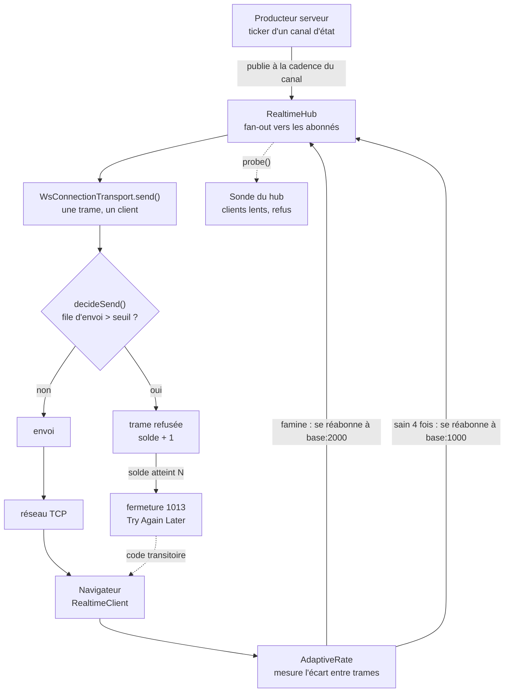
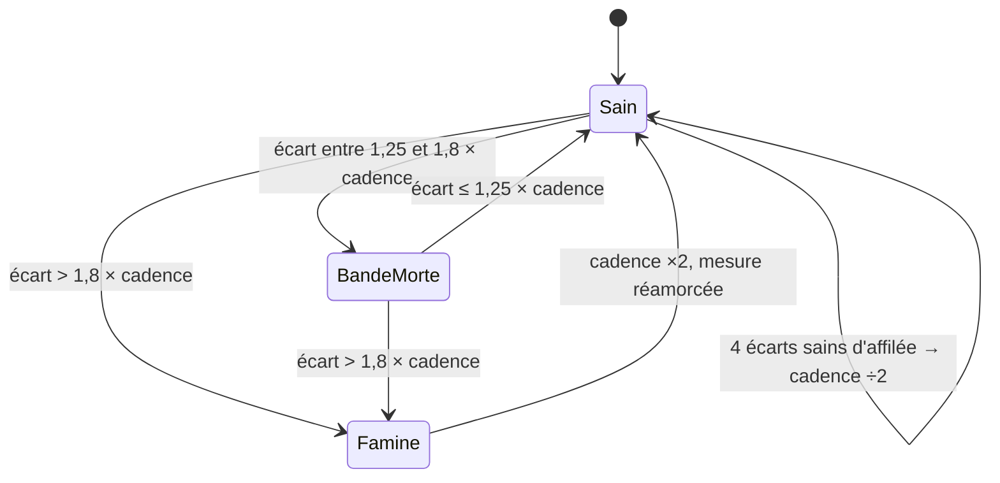
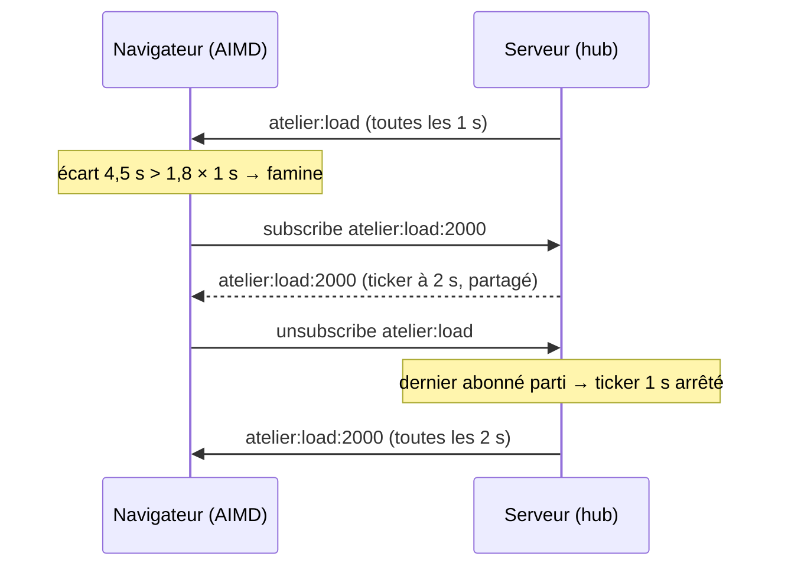
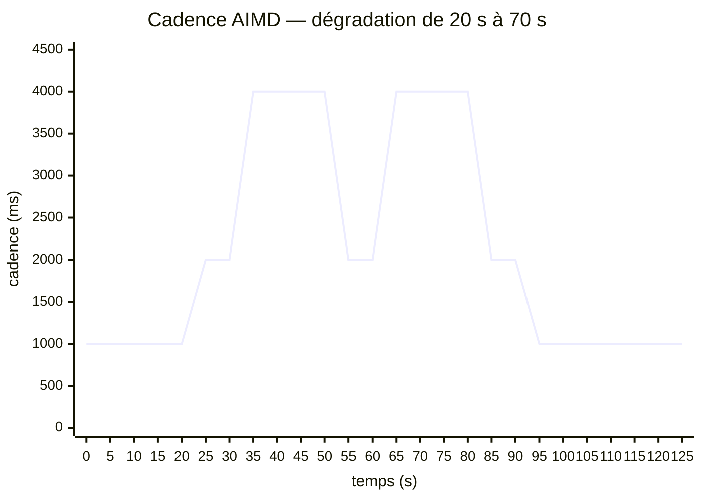
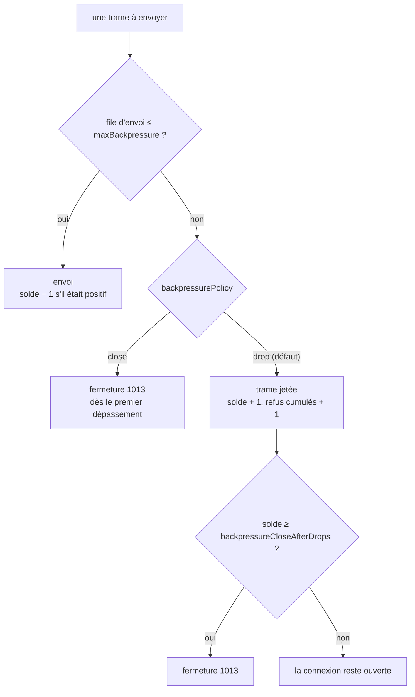
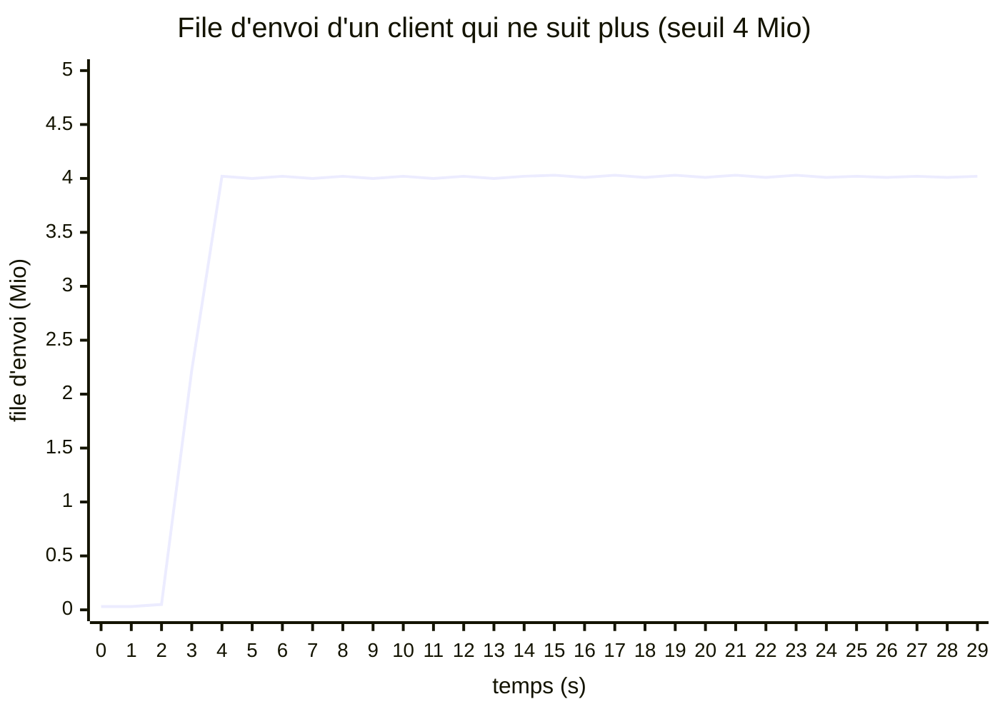
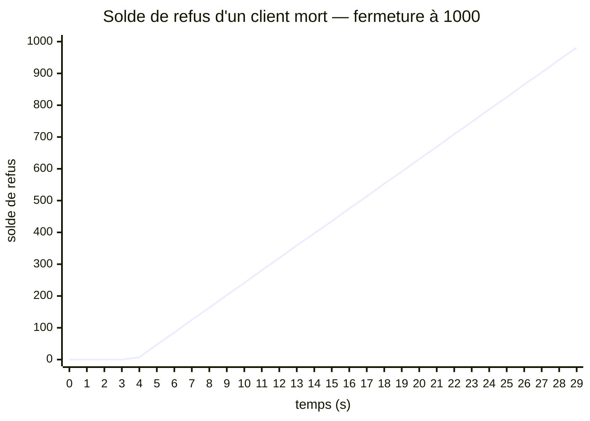
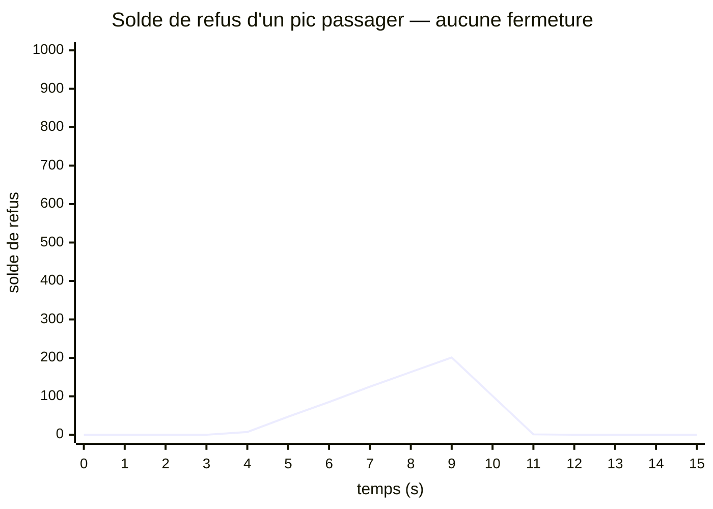
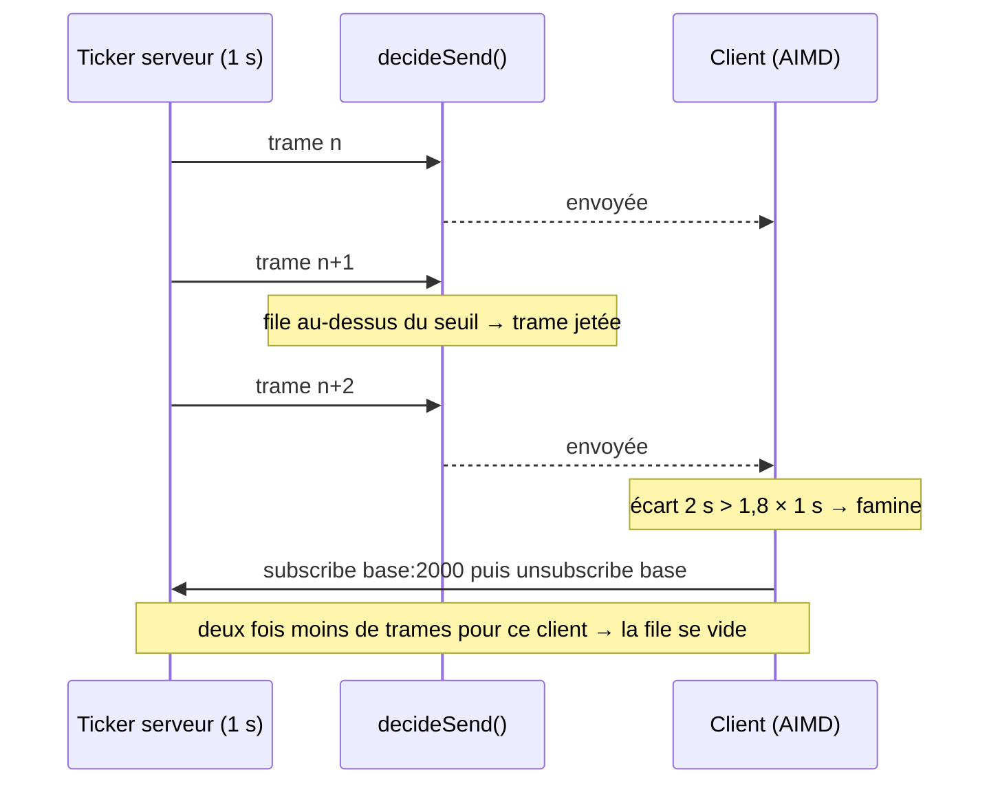

# Cadence adaptative et contre-pression — quand un client ne suit plus

> Un serveur temps réel produit souvent plus vite qu'un client ne consomme. Nodefony y répond par
> **deux étages indépendants** : le client **ralentit lui-même la cadence** des canaux d'état qu'il
> écoute (AIMD), et le transport **refuse d'empiler** au-delà d'un seuil, puis coupe un client qui
> n'absorbe plus rien (contre-pression, fermeture `1013`). Aucun code ne relie les deux : c'est la
> **mesure** qui les fait se rencontrer. Cette page explique chaque étage, montre leurs courbes
> calculées par le vrai code, et dit où les observer en production.

📍 [Documentation](../../../../../docs/index.md) › [@nodefony/realtime](index.md) › **Cadence et contre-pression**

## 🧠 Schéma général

Deux étages, deux endroits du code, deux signaux — et les sondes qui les rendent visibles.



- **Étage 1 — la cadence adaptative**, côté **client** : il mesure l'écart entre deux trames et se
  réabonne à une cadence plus lente ou plus rapide. Le serveur ne fait qu'honorer le nom du canal.
- **Étage 2 — la contre-pression**, côté **serveur**, trame par trame : au-delà de la file permise,
  la trame est jetée ; un client qui refuse plus qu'il n'accepte finit fermé.
- **Les sondes** comptent les clients lents et les refus, sans rien décider.

## 📖 Lexique

| Terme                                 | Développé / traduction                        | Ce que c'est, en une ligne                                                                                     |
| ------------------------------------- | --------------------------------------------- | -------------------------------------------------------------------------------------------------------------- |
| **AIMD**                              | _Additive Increase / Multiplicative Decrease_ | Règle de régulation de TCP : on accélère prudemment par petits pas, on ralentit franchement dès que ça coince. |
| **Cadence**                           | intervalle de publication d'un canal          | Le temps entre deux valeurs publiées (1000 ms = une valeur par seconde).                                       |
| **Canal cadencé**                     | `base:<ms>`                                   | Un canal dont le **nom** porte la cadence : `nodefony:orm:health:2000`.                                        |
| **Famine**                            | _starvation_                                  | Le client attend une trame bien plus longtemps que la cadence promise.                                         |
| **Bande morte**                       | _dead band_ / hystérésis                      | Zone entre « sain » et « famine » où l'on ne change rien, pour éviter d'osciller.                              |
| **Contre-pression**                   | _backpressure_                                | Refuser d'accumuler pour un destinataire qui ne suit pas, au lieu de stocker sans limite.                      |
| **File d'envoi**                      | `bufferedAmount`                              | Les octets acceptés par la socket mais pas encore partis sur le réseau.                                        |
| **Solde de refus**                    | `_nfDropStreak`                               | Compteur par connexion : +1 par trame refusée, −1 par trame envoyée.                                           |
| **1013**                              | _Try Again Later_                             | Code de fermeture WebSocket : « reviens plus tard ». Le client le traite comme transitoire et se reconnecte.   |
| **Canal d'état / canal d'événements** | _latest-wins_ / _every-message-counts_        | État : seule la dernière valeur compte. Événements : chaque message compte.                                    |
| **Sonde**                             | _probe_                                       | Lecture instantanée des compteurs du hub, exposée par HTTP et par un canal de santé.                           |
| **Abonner avant de couper**           | _make-before-break_                           | Changer de canal en s'abonnant au nouveau avant de quitter l'ancien : aucun trou dans le flux.                 |

## Qu'est-ce que le problème, concrètement ?

**L'image** : un robinet qui remplit un verre. Si le robinet coule plus vite que l'on boit, le verre
déborde. On peut **fermer un peu le robinet** (c'est le rôle de la cadence adaptative), et il faut
de toute façon **un trop-plein** qui empêche l'inondation (c'est la contre-pression).

En temps réel, le « verre » est la **file d'envoi** de la socket côté serveur. Un client lent —
réseau mobile, onglet en arrière-plan, machine saturée — la laisse grossir. Sans garde :

- la **mémoire** du serveur gonfle, un client à la fois ;
- la **latence** explose : le client lit des valeurs vieilles de plusieurs secondes ;
- un `broadcast()` **amplifie** le problème : un seul client lent retient une diffusion entière ;
- au bout, le processus tombe à court de mémoire, et tous les clients le paient.

> [!IMPORTANT]
> Ce n'est pas une question de débit réseau mesuré. Nodefony **ne mesure jamais** la bande passante
> d'un client : le client observe les **intervalles d'arrivée** des trames, le serveur observe sa
> **file d'envoi**. Ce sont deux mesures locales, simples et sans coût, qui suffisent.

## La vision Nodefony — deux étages qui ne se parlent pas

Nodefony empile deux mécanismes qui **ne partagent aucun code et aucun message**. Chacun agit sur
ce qu'il voit lui-même :

|                       | Étage 1 — cadence adaptative                                   | Étage 2 — contre-pression                            |
| --------------------- | -------------------------------------------------------------- | ---------------------------------------------------- |
| **Où il vit**         | dans le **navigateur** (`AdaptiveRate`, `bindAdaptiveChannel`) | dans le **serveur**, au transport (`decideSend`)     |
| **Ce qu'il mesure**   | l'écart entre deux trames reçues                               | la file d'envoi `bufferedAmount` de la socket        |
| **Ce qu'il fait**     | se réabonne à un canal plus lent ou plus rapide                | envoie, jette la trame, ou ferme en `1013`           |
| **Sa portée**         | **un canal d'état** chez un client                             | **toutes les trames** d'une connexion                |
| **Quand il agit**     | avant la saturation : il prévient                              | à la saturation : il protège                         |
| **Activé par défaut** | non : chaque écran l'active (hook ou option)                   | oui : 4 Mio, refus, fermeture après un solde de 1000 |
| **Ce qu'il garantit** | une cadence soutenable pour **ce** client                      | une mémoire bornée pour **le serveur**               |

**Le point qui fait comprendre tout le reste** : la contre-pression **jette** des trames, donc elle
**allonge** les écarts que le client mesure ; le client y voit une famine et **ralentit** ; le
serveur produit moins pour lui ; la file se vide. Personne n'a programmé ce dialogue : il découle de
la mesure. Voir [Comment les deux étages se rencontrent](#-comment-les-deux-étages-se-rencontrent).

> [!NOTE]
> Ni l'un ni l'autre n'appartient à JSON-RPC. Le protocole transporte des requêtes, des réponses et
> des notifications ; la notion de **canal**, de **cadence** et de **file** est propre à Nodefony.
> Le standard JSON-RPC 2.0 n'en dit rien, et Nodefony n'y ajoute aucun champ.

## 🚀 Démarrage rapide

**Le besoin vécu** : ton tableau de bord affiche la charge d'un atelier, publiée chaque seconde. Sur
le réseau d'un client en déplacement, l'écran prend du retard et la console du serveur grossit.
Tu veux que **chaque écran** tienne la cadence qu'il peut, et que **le serveur** ne retienne jamais
un client mort.

### Le contrôleur — fichier créé

Le serveur publie **à la cadence que le nom du canal demande**, bornée pour se protéger.

```ts
// modules/atelier/nodefony/controllers/AtelierController.ts
import { controller, route } from "@nodefony/framework";
import { RealtimeController } from "@nodefony/realtime";
import type { RealtimePublish } from "@nodefony/realtime";
import type { ContextType } from "@nodefony/http";
import { isRateChannel, parseRate } from "nodefony";

/** Le canal de base, partagé avec le client. */
export const ATELIER_LOAD = "atelier:load";

/** Bornes : jamais plus vite que 250 ms (anti-déni de service), jamais plus lent que 60 s. */
const BOUNDS = { default: 1000, min: 250, max: 60000 };

@controller("/atelier")
class AtelierController extends RealtimeController {
  constructor(context: ContextType) {
    super("atelier", context);
  }

  @route("atelier-realtime", {
    path: "/realtime",
    requirements: { methods: ["WEBSOCKET"] },
  })
  async realtime(message: string | Buffer | null): Promise<void> {
    this.handleRealtime(message);
  }

  /** `atelier:load` ET ses variantes `atelier:load:<ms>` — un ticker par cadence. */
  override createRealtimeChannel(
    channel: string,
    publish: RealtimePublish,
  ): (() => void) | null {
    if (!isRateChannel(channel, ATELIER_LOAD)) return null;
    const ms = parseRate(channel, ATELIER_LOAD, BOUNDS);
    const timer = setInterval(
      () => publish(channel, { ts: Date.now(), load: Math.random() }),
      ms,
    );
    timer.unref();
    return () => clearInterval(timer);
  }
}

export default AtelierController;
```

### Le client — fichier créé

Le hook s'abonne à 1 s et **laisse l'AIMD** reculer ou remonter. Il rend la cadence effective, à
afficher en badge.

```ts
// frontend/src/useAtelierLoad.ts
import { useNodefonyAdaptiveChannelData } from "nodefony/react";

export interface AtelierLoad {
  ts: number;
  load: number;
}

/** La charge de l'atelier, à la cadence que CE client peut tenir. */
export function useAtelierLoad(): { load: number | null; everyMs: number } {
  const { data, intervalMs } = useNodefonyAdaptiveChannelData<AtelierLoad>(
    "atelier:load",
    1000,
  );
  return { load: data?.load ?? null, everyMs: intervalMs };
}
```

### La configuration — fichier modifié

La contre-pression est **déjà active** avec ses défauts. On ne la règle que pour la serrer, et sur
**les deux** serveurs WebSocket.

```ts
// nodefony.config.ts — extrait
import { defineConfig, use } from "nodefony";

export default defineConfig(() => ({
  modules: [
    use("@nodefony/http", {
      websocket: { maxBackpressure: 1048576, backpressureCloseAfterDrops: 200 },
      websocketSecure: {
        maxBackpressure: 1048576,
        backpressureCloseAfterDrops: 200,
      },
    }),
    "@nodefony/framework",
    use("@nodefony/realtime", { backplane: { driver: "loopback" } }),
    "@mon-app/atelier",
  ],
}));
```

### Ce qu'on observe

| Situation                                | Ce qui se passe                                                                                       |
| ---------------------------------------- | ----------------------------------------------------------------------------------------------------- |
| Réseau sain                              | `everyMs` reste à `1000` ; le client est abonné à `atelier:load` (le défaut ne porte pas de suffixe). |
| Réseau dégradé (trames toutes les 4–5 s) | `everyMs` passe à `2000` puis `4000` ; le client est abonné à `atelier:load:4000`.                    |
| Retour à la normale                      | `everyMs` redescend d'un cran tous les 4 échantillons sains : `2000`, puis `1000`.                    |
| Client qui ne lit plus du tout           | file à 1 Mio, trames refusées, puis fermeture `1013` après un solde de 200 ; reconnexion automatique. |
| Deux écrans à la même cadence            | **un seul** ticker serveur : le canal `atelier:load:2000` est partagé et compté par référence.        |

```bash
# La sonde du hub, sans WebSocket : clients lents et refus cumulés.
curl -sk https://127.0.0.1:5152/nodefony/realtime/api/health | jq '.backpressure'
```

## 🏗️ Étage 1 — la cadence adaptative (AIMD)

### La cadence vit dans le nom du canal

Un canal d'état cadencé s'appelle `base` (cadence par défaut) ou `base:<ms>` (cadence explicite).
Le client fabrique le nom avec `rateChannel()` (`channelRate.ts:44`), le serveur le relit et le
**borne** avec `parseRate()` (`channelRate.ts:63`). Une même fonction pour les deux bords : la
convention ne peut pas diverger.

Conséquences voulues :

- **1 canal = 1 cadence = 1 ticker.** Deux clients à 2 s partagent `base:2000` ; un troisième à 4 s
  ouvre `base:4000`. Le hub compte les abonnés et arrête le ticker au dernier.
- **Le serveur garde la main.** Un client qui demande `base:10` obtient la borne basse : Studio
  borne ses statistiques à 250 ms minimum (`RATE_BOUNDS`, `StudioRealtimeController.ts:61`).
- **Aucun message de contrôle** : changer de cadence, c'est changer d'abonnement. Le protocole
  reste celui des canaux, rien de plus.

### Ce que le client mesure

À chaque trame reçue, `AdaptiveRate.noteFrame()` (`AdaptiveRate.ts:137`) compare l'écart depuis
la trame précédente à la cadence courante. Trois zones, et une seule décision par trame :



| Zone            | Condition (défauts)      | Décision                                                             |
| --------------- | ------------------------ | -------------------------------------------------------------------- |
| **Famine**      | écart > `1,8` × cadence  | **un cran plus lent, tout de suite** (_Multiplicative Decrease_)     |
| **Sain**        | écart ≤ `1,25` × cadence | compte un bon échantillon ; au **4ᵉ d'affilée**, un cran plus rapide |
| **Bande morte** | entre les deux           | ne change rien, et **remet à zéro** le compte des bons échantillons  |

Les seuils et la fenêtre sont des options (`starvationFactor`, `healthyFactor`, `recoveryWindow`),
avec ces défauts (`AdaptiveRate.ts:100`).

> [!TIP]
> La **bande morte** est ce qui empêche l'oscillation : un réseau « moyen » ne fait ni monter ni
> descendre la cadence. Sans elle, un écart de 1,5 fois la cadence ferait basculer l'écran toutes les
> quelques secondes.

### Ralentir vite, accélérer prudemment

- **L'échelle** est géométrique : de la cadence désirée, doublée jusqu'à 60 s par défaut — `1 s,
2 s, 4 s, 8 s, …, 60 s` (`deriveLadder()`, `AdaptiveRate.ts:67`). Une échelle sur mesure se passe
  par l'option `ladder`.
- **Ralentir** = monter d'un cran (×2) **dès la première famine**. Plusieurs famines successives
  doublent plusieurs fois : c'est ce qui rend la décroissance multiplicative.
- **Accélérer** = descendre d'**un seul** cran après **quatre** écarts sains consécutifs. La reprise
  est lente par construction.
- **Après chaque changement**, la mesure repart de zéro : la première trame du nouveau canal ne sert
  que de référence.
- **Famine totale** : si plus aucune trame n'arrive, `noteFrame()` ne serait jamais appelé. Un chien
  de garde, réarmé à chaque cadence, appelle `checkStarvation()` (`AdaptiveRate.ts:174`) et ralentit
  quand même.

### Changer de cadence sans trou

`bindAdaptiveChannel()` (`AdaptiveRate.ts:242`) applique une décision en **s'abonnant au nouveau
canal avant de quitter l'ancien** (`applyDecision()`, `AdaptiveRate.ts:295`) :



Le gestionnaire de l'écran reçoit les trames des deux canaux sans interruption : la page ne voit
qu'un flux dont la cadence change.

### La courbe — le vrai code, sur un scénario

Le scénario : cadence désirée 1 s ; **de 20 s à 70 s**, le client met 4,5 s à absorber chaque trame
(réseau saturé), puis redevient rapide. La courbe est **calculée** en faisant tourner
`AdaptiveRate` lui-même ; un test la rejoue et échoue si le code ne la produit plus (voir
[Tests](#-tests)).



Ce que la courbe raconte, décision par décision :

| Instant | Décision      | Pourquoi                                                                                          |
| ------- | ------------- | ------------------------------------------------------------------------------------------------- |
| 24 s    | 1 s → **2 s** | premier écart mesuré de 4,5 s, au-delà de 1,8 s : famine                                          |
| 33 s    | 2 s → **4 s** | 4,5 s dépasse encore 3,6 s (1,8 × 2 s) : famine                                                   |
| 55 s    | 4 s → **2 s** | à 4 s, l'écart (4,5 s) est sain (≤ 5 s) : après 4 bons échantillons, l'AIMD **tente** de remonter |
| 64 s    | 2 s → **4 s** | la tentative échoue : famine, retour au cran sûr                                                  |
| 84 s    | 4 s → **2 s** | la dégradation est finie depuis 70 s : 4 écarts sains                                             |
| 94 s    | 2 s → **1 s** | 4 écarts sains de plus : retour à la cadence désirée                                              |

La tentative de 55 s n'est pas un défaut : c'est **ainsi** qu'AIMD découvre que le réseau s'est
rétabli. Il sonde prudemment, recule s'il s'est trompé, et ne le paie que de quelques secondes.

### Réservé aux canaux d'état

> [!WARNING]
> **N'active jamais la cadence adaptative sur un canal d'événements.** Ralentir un canal d'état
> perd des valeurs **intermédiaires** sans conséquence : la température de 10 h 00 min 03 s est
> remplacée par celle de 10 h 00 min 04 s. Sur un flux d'événements (`ORDER_CREATED`,
> `PAYMENT_RECEIVED`, lignes de journal), chaque message compte : ces canaux se **regroupent**
> (le pont syslog de Studio coalesce), ils ne se **déciment** pas.

## 🏗️ Étage 2 — la contre-pression du transport

### La file d'envoi et le seuil

Quand le serveur envoie une trame, la socket l'accepte et la place dans sa **file d'envoi** :
`bufferedAmount` compte les octets qui attendent le réseau. Un client qui ne lit plus fait grossir
cette file sans fin. Nodefony la plafonne à **`maxBackpressure`**, 4 Mio par défaut
(`@nodefony/http/nodefony/config/config.ts:651`).

La décision est prise **trame par trame**, par une seule fonction : `decideSend()`
(`wsBackpressure.ts:89`). Elle sert à la fois le `send()`/`broadcast()` d'un contexte WebSocket de
`@nodefony/http` et chaque connexion temps réel (`WsConnectionTransport.send()`,
`WsConnectionTransport.ts:82`). Une seule règle, deux usages.



Sous le seuil, le chemin est **nominal** : une lecture de `bufferedAmount`, aucune allocation. Le
coût n'apparaît que pour un client déjà en difficulté.

### Le solde de refus — pourquoi pas un second seuil, pourquoi pas une série

Deux idées naturelles échouent, et le code dit pourquoi :

- **Un second seuil d'octets** (« fermer à 8 Mio ») serait **inatteignable** : une fois qu'on jette,
  plus rien n'alimente la file, qui plafonne au premier seuil. Mesuré : 4000 trames poussées à un
  client qui ne lit pas, 3 servies, aucune fermeture.
- **Une série de refus consécutifs**, remise à zéro au premier envoi, ne fermerait **jamais** un
  client bloqué : sa file **oscille** autour du seuil (refus, un peu de vidage, un envoi, refus…),
  et chaque envoi effacerait la série.

D'où le **solde** : **+1 par refus, −1 par envoi**. Un pic passager redescend tout seul ; un client
qui refuse plus qu'il n'accepte monte jusqu'au seuil de fermeture. C'est `_nfDropStreak`, tenu sur
la socket elle-même.

### Les courbes — le vrai code, sur deux clients

Le scénario : le serveur pousse **100 trames de 32 Kio par seconde** ; le client vide sa file à
8 Mo/s, puis **tombe à 1 Mo/s** à partir de 2 s. Défauts de production : seuil 4 Mio, refus,
fermeture à un solde de 1000. Les valeurs sont calculées par `decideSend()` lui-même.

**La file d'envoi plafonne au seuil** — la contre-pression tient la mémoire, quelle que soit la
durée :



**Le solde monte, régulièrement** — environ 39 par seconde, l'écart entre les refus et les envois.
Il atteint 1000 à **29,5 s** : fermeture `1013`, après 1781 trames refusées et 1166 envoyées.



**Un pic passager ne ferme rien** — même scénario, mais le client se rétablit à 9 s. Le solde
redescend d'une unité par envoi, donc très vite : à 12 s il est revenu à 0.



### `drop` ou `close` — choisir en situation

| Le besoin vécu                                                                          | La politique                                    | Le comportement                                                                |
| --------------------------------------------------------------------------------------- | ----------------------------------------------- | ------------------------------------------------------------------------------ |
| Tableaux de bord, télémétrie, positions : un client lent doit **rester connecté**       | `drop` (défaut) + `backpressureCloseAfterDrops` | il perd des trames pendant le pic, il est coupé seulement s'il ne récupère pas |
| Flux où **une trame perdue rend la suite fausse** (rejeu, synchronisation incrémentale) | `close`                                         | coupé **au premier dépassement** ; il se reconnecte et resynchronise de zéro   |
| Ne **jamais** couper (environnement maîtrisé, débogage)                                 | `drop` + `backpressureCloseAfterDrops: 0`       | la file reste bornée, la connexion ne ferme jamais                             |

> [!WARNING]
> **`drop` ne trie pas les trames.** Au-delà du seuil, `decideSend()` jette **la trame qui se
> présente**, quelle qu'elle soit : valeur d'un canal d'état, événement métier, ou **réponse à une
> requête RPC**. Une requête dont la réponse a été jetée **expire côté client**. La contre-pression
> protège le serveur ; elle ne garantit la livraison de rien. Un flux où chaque message compte a
> besoin d'un accusé de réception et d'une reprise applicatifs, ou de la politique `close`.

### Ce que voit le client

Le client **n'apprend jamais** les seuils : il ne reçoit que leur effet.

- Une trame jetée **n'existe pas** pour lui : il voit seulement un écart plus long entre deux
  trames.
- Une fermeture arrive avec le code `1013`. Il le classe **transitoire** : ce n'est pas un des codes
  définitifs (`FATAL_CLOSE_CODES`, `notice.ts:155`), donc `isReconnectableCloseCode()`
  (`notice.ts:171`) répond oui, et il se reconnecte avec une attente croissante.

## 🔌 Comment les deux étages se rencontrent

Aucune ligne de code ne relie la contre-pression du serveur à la cadence du client. Ils se
rencontrent par la **mesure** :



Une seule trame jetée sur un canal cadencé suffit à doubler l'écart mesuré, donc à faire ralentir le
client. **La contre-pression envoie un signal au client sans lui envoyer un seul octet.**

## 📡 Les sondes — voir le mécanisme en production

Les sondes **observent**, elles ne décident rien. Elles répondent à « mes clients suivent-ils ? »
sans activer de trace.

### Ce que la sonde du hub expose

`RealtimeHub.probe()` (`RealtimeHub.ts:865`) parcourt les connexions et rend un bloc
`backpressure` :

| Champ                 | Ce qu'il dit                                                                | Lecture                                                 |
| --------------------- | --------------------------------------------------------------------------- | ------------------------------------------------------- |
| `maxBufferedAmount`   | la **pire** file d'envoi, en octets                                         | proche de `maxBackpressure` : un client est au plafond  |
| `totalBufferedAmount` | la somme des files du processus                                             | la mémoire d'envoi réellement retenue                   |
| `slowConsumers`       | les connexions dont la file atteint `slowConsumer.bytes` (1 Mio par défaut) | non nul = au moins un client prend du retard            |
| `drops`               | les trames refusées, cumulées                                               | qui **augmente** = la contre-pression agit en ce moment |

> [!IMPORTANT]
> **`slowConsumer.bytes` compte, il ne freine pas.** C'est le réglage de la **sonde**
> (`@nodefony/realtime`), pas de la contre-pression (`@nodefony/http`). Le baisser fait apparaître
> plus de clients lents dans les écrans, sans en couper aucun.

### Où la lire

- **Par HTTP**, sans WebSocket : `GET /nodefony/realtime/api/health`, rôle d'administration requis.
- **En flux**, sur le canal de santé `nodefony:socket` ; il est lui-même cadencé
  (`nodefony:socket:<ms>`).
- **Dans Studio** : l'écran **Cluster** affiche les clients lents et la pire file, par instance.
- **Côté client** : la cadence effective est rendue par le hook (`intervalMs`), et Studio permet de
  basculer la cadence adaptative de ses tableaux de bord depuis le panneau temps réel (désactivée par
  défaut).

Le détail champ par champ et le flux de santé : [Observabilité de la socket](observabilite.md#back-pressure--le-risque-numéro-un).

## ⚙️ Configuration

| Réglage                                               | Paquet               | Défaut         | Effet                                                                |
| ----------------------------------------------------- | -------------------- | -------------- | -------------------------------------------------------------------- |
| `maxBackpressure`                                     | `@nodefony/http`     | 4 Mio          | file d'envoi au-delà de laquelle la politique s'applique ; 0 = coupé |
| `backpressurePolicy`                                  | `@nodefony/http`     | `drop`         | `drop` jette la trame ; `close` ferme au premier dépassement         |
| `backpressureCloseAfterDrops`                         | `@nodefony/http`     | 1000           | solde de refus qui déclenche la fermeture `1013` ; 0 = jamais        |
| `slowConsumer.bytes`                                  | `@nodefony/realtime` | 1 Mio          | seuil de **comptage** de la sonde ; n'agit sur rien                  |
| `intervalMs` (hook / client)                          | `nodefony`           | —              | cadence **désirée** ; l'AIMD ne descend jamais en dessous            |
| `ladder`, `maxMs`                                     | `nodefony`           | ×2, 60 s       | l'échelle des cadences possibles                                     |
| `starvationFactor`, `healthyFactor`, `recoveryWindow` | `nodefony`           | 1,8 · 1,25 · 4 | les seuils de famine, de santé et la fenêtre de reprise              |
| `enabled`                                             | `nodefony`           | `true`         | `false` = abonnement fixe, sans mesure ni chien de garde             |

> [!IMPORTANT]
> **Deux serveurs, deux sections** : `websocket` (`ws://`) et `websocketSecure` (`wss://`). Régler
> l'un ne règle pas l'autre. Une application servie en `wss` qui ne règle que `websocket` garde les
> défauts, sans que rien ne le signale.

La table complète des réglages du module et leurs schémas : [Configuration](configuration.md).

## 📜 Normes appliquées

| Norme                                          | Ce qu'elle dit                                                                        | Ce que fait Nodefony                                                                  |
| ---------------------------------------------- | ------------------------------------------------------------------------------------- | ------------------------------------------------------------------------------------- |
| RFC 6455 §7.4 — codes de fermeture             | une fermeture porte un code ; la plage 1000-2999 est réservée et enregistrée à l'IANA | ferme en `1013` (`backpressure`)                                                      |
| Registre IANA des codes de fermeture WebSocket | `1013` = _Try Again Later_ : condition temporaire du serveur                          | le client le traite comme transitoire et se reconnecte                                |
| RFC 5681 — contrôle de congestion TCP          | augmentation additive, diminution multiplicative                                      | **inspiration** de l'AIMD de cadence, appliquée à des abonnements et non à des octets |
| JSON-RPC 2.0                                   | requêtes, réponses, notifications                                                     | aucune notion de cadence ni de file : tout ce mécanisme est propre à Nodefony         |

## ⚠️ Pièges

| Symptôme                                              | Cause                                                                                 | Correction                                                                          |
| ----------------------------------------------------- | ------------------------------------------------------------------------------------- | ----------------------------------------------------------------------------------- |
| Des événements métier manquent chez un client lent    | la politique `drop` jette toute trame au-delà du seuil, événements compris            | accusé de réception et reprise applicatifs, ou politique `close` pour ce flux       |
| Une requête RPC expire sans erreur serveur            | sa réponse a été jetée par la contre-pression                                         | surveiller `drops` dans la sonde ; serrer la cadence des canaux d'état de ce client |
| La cadence adaptative ne bouge jamais                 | le serveur ne sert que le nom exact (`@RealtimeChannel`), pas `base:<ms>`             | surcharger `createRealtimeChannel()` avec `isRateChannel()` et `parseRate()`        |
| Un client demande 100 ms et reçoit autre chose        | `parseRate()` borne la cadence demandée                                               | c'est voulu (anti-déni de service) : ajuster les bornes du contrôleur               |
| Le réglage de contre-pression semble ignoré           | seule la section `websocket` est réglée, l'application est servie en `wss`            | régler aussi `websocketSecure`                                                      |
| `slowConsumers` est non nul mais personne n'est coupé | `slowConsumer.bytes` (1 Mio) est un seuil de comptage, sous `maxBackpressure` (4 Mio) | normal : la sonde prévient avant que la contre-pression agisse                      |
| Un client est coupé au premier ralentissement         | `backpressurePolicy: "close"` ferme dès le premier dépassement                        | revenir à `drop` avec un solde de fermeture                                         |
| L'écran oscille entre deux cadences                   | réseau à la limite : l'AIMD sonde, recule, sonde                                      | normal et borné ; élargir `recoveryWindow` pour sonder moins souvent                |
| La cadence adaptative est activée sur un journal      | un canal d'événements a été déclaré adaptatif                                         | revenir à un abonnement fixe ; regrouper les messages côté serveur                  |

## 🧪 Tests

| Suite                                                   | Ce qui est prouvé                                                                                                                         |
| ------------------------------------------------------- | ----------------------------------------------------------------------------------------------------------------------------------------- |
| `AdaptiveRate.test.ts` (`nodefony`)                     | la machine pure : échelle ×2, première trame sans décision, famine immédiate, reprise après N bons échantillons, chien de garde           |
| `channelRate.test.ts` (`nodefony`)                      | le nom cadencé : canal nu pour le défaut, suffixe sinon, bornage côté serveur                                                             |
| `RealtimeNotice.test.ts` (`nodefony`)                   | `1013` fait partie des fermetures transitoires qui déclenchent la reconnexion                                                             |
| `wsBackpressure.test.ts` (`@nodefony/http`)             | `decideSend()` : désactivé à 0, nominal sous le seuil, `drop` sans fermer, `close` en `1013`                                              |
| `backpressureConfig.test.ts` (`@nodefony/realtime`)     | le transport temps réel applique la règle de `@nodefony/http` : refus compté, fermeture après N, **le solde décroît** sur un pic passager |
| `WsConnectionTransport.test.ts` (`@nodefony/realtime`)  | le transport : envoi seulement sur socket ouverte, fermeture déléguée                                                                     |
| `cadencePressureFigures.test.ts` (`@nodefony/realtime`) | **les courbes de cette page** : rejoue les trois scénarios avec le vrai code et compare chaque valeur                                     |

Deux bancs complètent, hors des suites (skill `nodefony-load-test`) :

- `ws-backpressure-e2e.mjs` — la contre-pression sur une **vraie socket**, file remplie par le
  noyau, mesure côté serveur ;
- `aimd-demo.mjs` — la cadence adaptative, lisible pas à pas, sur une horloge contrôlée.

**Ce qui manque** : aucun test ne fait jouer **ensemble** un vrai serveur qui jette et un vrai client
qui ralentit. La rencontre des deux étages décrite plus haut découle de leur conception, elle n'est
pas éprouvée de bout en bout.

```bash
cd src/nodefony && npx vitest run src/tests/AdaptiveRate.test.ts src/tests/channelRate.test.ts
cd src/packages/@nodefony/realtime && npm test
cd src/packages/@nodefony/http && npx vitest run nodefony/tests/unit/wsBackpressure.test.ts
```

## Ce qu'il faut retenir

1. **La cadence adaptative est décidée par le client**, canal d'état par canal d'état, en mesurant
   l'écart entre trames ; elle se traduit par un **réabonnement** à `base:<ms>`.
2. **La contre-pression est décidée par le serveur**, trame par trame, sur la file d'envoi ; elle
   jette au-delà de 4 Mio et ferme en `1013` quand le **solde** de refus atteint 1000.
3. **Les deux se rencontrent par la mesure** : une trame jetée allonge un écart, et le client
   ralentit.
4. **Les sondes comptent** (clients lents, refus) **sans rien décider**.
5. **Rien de tout cela ne garantit la livraison** : un flux où chaque message compte a besoin de sa
   propre reprise.

## 🔗 Pour aller plus loin

- ⬆️ **Retour au hub** : [@nodefony/realtime — la socket Nodefony](index.md) · [Toute la documentation](../../../../../docs/index.md)
- [Observabilité de la socket](observabilite.md) — la sonde champ par champ, les canaux de santé, les écrans
- [Configuration](configuration.md) — la table complète des réglages, dont la contre-pression
- [Protocole](protocole.md) — le format des trames et les codes d'erreur
- [Vocabulaire](vocabulaire.md) — la socket, le hub, le canal, le fan-out
