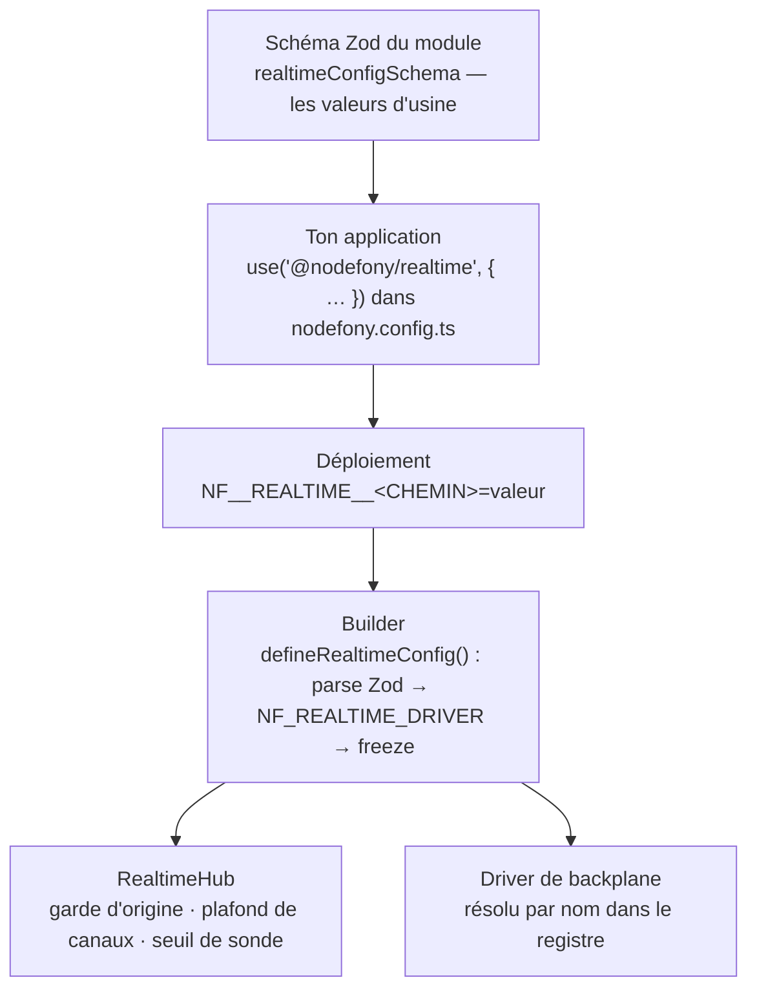

# Configuration — le fond de panier, les bornes, la porte d'entrée

> Le module temps réel expose **six réglages**, pas un de plus. Un seul décide vraiment de quelque
> chose : le **driver de backplane**, c'est-à-dire la façon dont deux processus de ton application se
> transmettent une publication. Les autres bornent la connexion et gardent la porte. Cette page les
> donne tous, avec leur valeur d'usine lue dans le schéma, l'effet observable de chacun, et les trois
> situations de déploiement qui décident du choix.

📍 [Documentation](../../../../../docs/index.md) › [@nodefony/realtime](index.md) › **Configuration**

```nodefony-livegraph
{
  "graph": "backplane",
  "height": 500,
  "title": "Le fond de panier, en direct",
  "hint": "Le driver actif est lu dans la sonde, pas figé dans le schéma — de quoi vérifier qu'un déploiement tourne sur celui qu'on croit."
}
```

## 🧠 Le modèle mental — un schéma, trois couches de surcharge

La configuration du module n'est pas un objet que tu construis : c'est un **schéma Zod** qui porte
déjà toutes ses valeurs d'usine. Ton application n'écrit que ses **écarts**, et le déploiement peut
encore corriger par variables d'environnement. Chaque couche recouvre la précédente, et le résultat
est validé puis **gelé** avant que le moindre canal existe.



Trois conséquences pratiques, et ce sont elles qui font la différence à l'usage :

1. **Une configuration vide est une configuration valide.** Ne rien écrire donne un module qui
   fonctionne en mono-processus, avec des bornes anti-abus déjà actives.
2. **Une clé fautive arrête le démarrage**, avec le chemin exact et le message Zod — pas un
   `undefined` qui explose trois minutes plus tard sur la première frame.
3. **La configuration appliquée est immuable.** Rien ne se règle à chaud : elle est gelée à la
   validation, et le hub reçoit ses valeurs une seule fois, au démarrage.

## 📖 Lexique

| Terme              | Développé / traduction           | En une ligne                                                                                     |
| ------------------ | -------------------------------- | ------------------------------------------------------------------------------------------------ |
| **Backplane**      | fond de panier                   | le transport qui relaie une publication d'un processus vers les autres. Jamais un stockage       |
| **Driver**         | pilote                           | l'implémentation concrète du backplane, désignée par un **nom** (`loopback`, `cluster`, `redis`) |
| **Hub**            | broker du processus              | tient un producteur par canal et diffuse aux abonnés locaux                                      |
| **Canal**          | channel                          | un sous-flux nommé qui circule dans la connexion WebSocket                                       |
| **Fan-out**        | diffusion                        | une publication, N livraisons aux abonnés                                                        |
| **Namespace**      | espace de nommage, cloison       | suffixe du canal de transport, qui empêche deux applications de se parler sur un bus mutualisé   |
| **`originId`**     | identifiant d'origine            | l'étiquette du processus émetteur, comparée pour ne pas se rejouer son propre message            |
| **Sonde**          | probe                            | l'instantané de santé du hub, servi en JSON                                                      |
| **CSRF**           | _Cross-Site Request Forgery_     | un site tiers déclenche une requête authentifiée à l'insu de la victime, avec ses cookies        |
| **CSWSH**          | _Cross-Site WebSocket Hijacking_ | la même attaque, sur une WebSocket : les navigateurs n'appliquent pas CORS à l'ouverture         |
| **Back-pressure**  | contre-pression                  | ce qui attend dans la file d'envoi quand le client ne lit pas assez vite                         |
| **IPC**            | _Inter-Process Communication_    | le canal de messages entre le maître et ses workers, fourni par Node                             |
| **Pod / réplique** | instance déployée                | un processus de l'application ; plusieurs pods servent le même trafic                            |

## Qu'est-ce qu'on configure ici ?

Trois choses seulement, et elles répondent à trois questions distinctes.

**Comment mes processus se parlent-ils ?** En développement, un seul processus : une publication
atteint tous les abonnés parce qu'ils sont tous là. En production à trois répliques, un message
publié sur la réplique A n'atteindra jamais un abonné branché sur la réplique B — sauf si un
transport les relie. C'est le rôle du **backplane**, et c'est le seul réglage qui change entre un
poste de développement et un cluster.

**Jusqu'où une connexion peut-elle consommer ?** Une socket ouverte est une ressource. Un client
peut demander mille canaux, ou cesser de lire ce qu'on lui envoie. Deux clés bornent ces deux dérives.

**Qui a le droit d'ouvrir la socket ?** Un navigateur envoie les cookies de ta victime même quand la
page qui ouvre la connexion appartient à un tiers. Le contrôle d'`Origin` ferme cette porte.

> [!NOTE]
> Ce que tu ne configures **pas** ici : le port et le chemin de la WebSocket (ils viennent de
> `@nodefony/http` et de ta route), les rôles et les zones protégées (ils viennent de
> `@nodefony/security`, cf [Sécurité](./securite.md)), et la taille maximale d'un message entrant
> (`websocket.maxPayload`, porté par `@nodefony/http`).

## La vision Nodefony — le schéma EST la configuration

Le module suit la convention figée du framework, dont `@nodefony/drizzle` est la référence : **deux
fichiers, jamais trois**.

| Fichier                                 | Rôle           | Ce qu'il contient                                                                                 |
| --------------------------------------- | -------------- | ------------------------------------------------------------------------------------------------- |
| `nodefony/config/config.ts`             | **le quoi**    | le schéma Zod commenté, source **unique** des valeurs d'usine, et les défauts matérialisés        |
| `nodefony/config/defineModuleConfig.ts` | **le comment** | le builder pur : analyse, surcharge d'environnement, gel — il ne retape jamais une valeur d'usine |

Le schéma `realtimeConfigSchema` (`config.ts:205`) porte chaque valeur en `.default()` et chaque
explication en `.describe()`. Les défauts effectifs sont **dérivés** du schéma lui-même
(`realtimeConfigSchema.parse({})`, `config.ts:231`) : il n'existe pas de second endroit où une valeur
d'usine serait écrite, donc pas de dérive silencieuse possible entre la doc du champ et son
comportement.

Le builder `defineRealtimeConfig()` (`defineModuleConfig.ts:35`) reste **pur** : il analyse l'entrée,
applique les variables d'environnement dédiées (`NF_REALTIME_DRIVER`,
`NF_REALTIME_BACKPLANE_NAMESPACE`, `NF_REALTIME_BACKPLANE_SECRET` — toutes prioritaires sur le
fichier), et gèle le résultat. Il ne décide rien.

Le module **augmente le registre de types** (`index.ts:167`) : `use("@nodefony/realtime", { … })`
propose ses clés en autocomplétion et **refuse** une clé inconnue à la compilation.

> [!IMPORTANT]
> C'est ce filet qui compte, bien plus que le confort d'écriture. Sans lui, une faute de frappe ne se
> verrait ni à l'écriture ni au démarrage : le schéma **retire** les clés inconnues sans se plaindre.
> `slowConsummer: { bytes: 4096 }` donnerait le défaut, en silence. Avec l'augmentation, la même
> faute ne compile pas.

## 🚀 Démarrage rapide

Vu depuis une application créée par `nodefony create app`. Deux fichiers, et une seule ligne qui
diffère entre les deux situations.

### 1. Un processus — le minimum utile

C'est la configuration d'un poste de développement, et celle d'un déploiement à une seule réplique.
On garde le fond de panier local, on ferme la porte d'entrée, on abaisse le plafond de canaux à ce
dont l'application a réellement besoin.

```ts
// nodefony.config.ts — le manifeste de l'application
export default defineConfig(() => ({
  modules: [
    "@nodefony/http",
    "@nodefony/framework",
    use("@nodefony/realtime", {
      // Un seul processus : le hub diffuse localement, aucun transport n'est ouvert.
      backplane: { driver: "loopback" },

      // Défense CSWSH (RFC 6455 §10.2). Sans elle, une page tierce ouvre une socket
      // avec les cookies de ton utilisateur : le navigateur n'applique pas CORS ici.
      csrf: {
        checkOrigin: {
          enabled: true,
          allowList: ["https://127.0.0.1:5152"],
          // Un client non-navigateur n'envoie pas d'en-tête Origin. Le laisser à
          // false n'a de sens que si tout ton trafic vient d'un navigateur.
          allowMissingOrigin: false,
        },
      },

      // Garde anti-saturation : le défaut de 256 est généreux. Un écran qui suit
      // dix canaux n'a aucune raison d'en ouvrir plus de quelques dizaines.
      limits: { maxChannelsPerConnection: 32 },
    }),
  ],
}));
```

### 2. Plusieurs répliques — la seule ligne qui change

Passer à N pods sur N machines ne change **ni le contrôleur, ni le client, ni un seul canal** : on
remplace le nom du driver, et on déclare le module qui fournit les connexions pub/sub.

```ts
// nodefony.config.ts — la même application, déployée en plusieurs répliques
export default defineConfig((ctx) => ({
  modules: [
    "@nodefony/http",
    "@nodefony/framework",

    // Le driver `redis` consomme les connexions `publish` et `subscribe` de ce
    // module. Sans lui déclaré, le hub reste local — et le dit dans les journaux.
    "@nodefony/redis",

    use("@nodefony/realtime", {
      backplane: {
        // En production seulement : en développement, le fond de panier local évite
        // d'exiger une infrastructure pour lancer l'application.
        driver: ctx.isProd ? "redis" : "loopback",

        // La cloison. Le numéro de base Redis ne cloisonne PAS le pub/sub : sans ce
        // nom, préproduction et production sur un même Redis échangeraient leurs
        // diffusions. À poser explicitement, et différemment par déploiement.
        namespace: ctx.isProd ? "boutique.prod" : "boutique.dev",
      },
      csrf: {
        checkOrigin: {
          enabled: true,
          allowList: ["https://boutique.example.com"],
        },
      },
      limits: { maxChannelsPerConnection: 32 },
    }),
  ],
}));
```

Il reste à **déclarer diffusables** les canaux qui doivent franchir la frontière du processus — c'est
une propriété du contrôleur, pas de la configuration, et le défaut est l'isolement :

```ts
// nodefony/controllers/chat.ts — extrait
import { RealtimeController } from "@nodefony/realtime";

export class ChatController extends RealtimeController {
  // Sans cette déclaration, "chat:*" resterait confiné au processus qui l'a publié.
  // (le préfixe diffusable est déclaré par `@RealtimeBroadcast` sur la classe)
}
```

### Ce qu'on lit dans les journaux

Le module annonce sa topologie effective au démarrage, en une ligne. C'est le premier endroit à
regarder quand un message ne traverse pas.

| Ligne observée                                                               | Ce qu'elle dit                                                           |
| ---------------------------------------------------------------------------- | ------------------------------------------------------------------------ |
| `realtime backplane driver=loopback kind=local cross-pod=no (hub local)`     | mono-processus assumé : rien ne franchit la frontière                    |
| `realtime backplane driver=redis kind=redis-pubsub … cross-pod=yes channel=` | le fan-out traverse ; le canal effectif est affiché, cloison comprise    |
| `driver "redis" : module @nodefony/redis absent … RealtimeHub reste local`   | le module pub/sub n'est pas déclaré — repli annoncé, démarrage poursuivi |
| `backplane driver "…" inconnu du registre (disponibles : …)`                 | nom de driver fautif ; la liste réelle est affichée dans le même message |

> [!TIP]
> Ces quatre lignes viennent du même endroit du code (`Realtime.#wireBackplane()`,
> `src/packages/@nodefony/realtime/index.ts:253`) et de la carte d'identité que chaque driver publie.
> Aucun repli n'est silencieux : si le fan-out est dégradé, c'est écrit.

## ⚙️ Le schéma, clé par clé

Six blocs, douze clés au total. Le tableau donne la vérité complète ; les sections qui suivent
expliquent quand et pourquoi en changer.

<!-- prettier-ignore -->
| Clé | Type | Défaut | Effet |
| --- | --- | --- | --- |
| `enabled` | `boolean` | `true` | `false` = module chargé mais inerte : ni API d'administration, ni backplane, ni sonde, ni garde |
| `backplane.driver` | `string` | `"loopback"` | nom résolu dans le registre de drivers ; inconnu → avertissement, le hub reste local |
| `backplane.namespace` | `string?` | _absent_ → nom d'app | cloison du transport partagé ; suffixe le canal pub/sub. Motif `^[\w.-]+$` |
| `backplane.secret` | `string?` (≥ 32) | _absent_ | scelle les messages du transport partagé (HMAC) ; identique sur tous les pods. Absent = bus ouvert + avertissement au boot |
| `backplane.maxQueueBytes` | `number` entier ≥ 0 | `8388608` (8 MiB) | plafond des octets publiés en attente d'accusé de réception du bus ; au-delà, les publications sont abandonnées et comptées (`backplane.queue`). `0` = aucune limite |
| `cluster.probe.enabled` | `boolean` | `true` | branche la sonde agrégée du pod en worker de cluster. `false` = aucun minuteur, aucun IPC |
| `slowConsumer.bytes` | `number` entier > 0 | `1048576` (1 MiB) | seuil de **comptage** des consommateurs lents dans la sonde. Observe, n'agit pas |
| `limits.maxChannelsPerConnection` | `number > 0` \| `null` | `256` | plafond de canaux par connexion ; au-delà le `subscribe` est refusé. `null` = illimité |
| `csrf.checkOrigin.enabled` | `boolean` | `false` | active le contrôle d'`Origin` à l'ouverture de la socket |
| `csrf.checkOrigin.allowList` | `string[]` | `[]` | origines acceptées, **comparaison exacte**. Vide + activé = tout est refusé |
| `csrf.checkOrigin.allowMissingOrigin` | `boolean` | `false` | accepter une ouverture sans en-tête `Origin` (clients non-navigateur) |

C'est **tout**. Il n'existe ni réglage de ping, ni de cadence, ni de fréquence d'échantillonnage de
la sonde, ni de seuil de contre-pression configurable : ces comportements existent, mais leurs
valeurs sont des constantes du code, pas des clés.

### `enabled` — le module au repos

Poser `false` charge le module sans rien activer. Concrètement : pas d'API d'administration
enregistrée, pas de backplane câblé, pas de sonde de pod
(`Realtime.onKernelBoot()`, `src/packages/@nodefony/realtime/index.ts:213`), et le service devient
inerte (`RealtimeService.init()`, `RealtimeService.ts:77`).

> [!WARNING]
> **`enabled: false` désarme aussi tes gardes.** Le hub garde son plafond interne de 256 canaux,
> mais l'allowlist d'origines que tu as configurée **n'est jamais posée** : c'est le service qui la
> transmet au hub, et il ne fait plus rien. Éteindre le module pour « désactiver le temps réel » sur
> une application dont la route WebSocket existe encore laisse la porte plus ouverte qu'avant.

Le bon usage : un environnement où le temps réel n'a pas de sens (une commande CLI, un banc). Pour
désactiver vraiment, retire le module du manifeste.

### `backplane.driver` — qui relaie les publications

C'est **le** réglage du module. Le champ est une chaîne libre et non une énumération, volontairement :
la liste réelle est celle du **registre** de drivers (`listBackplaneDrivers()`,
`backplaneRegistry.ts:68`), ouverte aux drivers que tu écris toi-même. Une énumération figée dans le
schéma fermerait cette porte.

Trois noms sont enregistrés par le module au chargement :

| Nom          | Classe              | Ce qu'il relie                           | Traverse les machines |
| ------------ | ------------------- | ---------------------------------------- | :-------------------: |
| `"loopback"` | `LoopbackBackplane` | rien — le hub diffuse localement         |          non          |
| `"cluster"`  | `ClusterBackplane`  | les workers d'un même processus maître   |          non          |
| `"redis"`    | `RedisBackplane`    | tous les processus abonnés au même canal |        **oui**        |

Un nom inconnu ne fait pas échouer le démarrage : il produit un avertissement qui **affiche la liste
des drivers réellement disponibles**, et le hub reste local. C'est un choix de résilience — une faute
de frappe dans une variable de déploiement ne doit pas empêcher l'application de servir du HTTP.

> [!NOTE]
> Il n'existe **pas** de driver Kafka. Le registre n'en connaît que trois. Un bus de messages
> persistant se branche par la voie normale d'extension : tu écris ton driver et tu l'inscris.

### `backplane.namespace` — la cloison sur un bus partagé

Ne concerne que les drivers qui traversent les machines. Le canal de transport devient
`nodefony:realtime:<namespace>` (`resolveRedisChannel()`, `RedisBackplane.ts:31`).

Le défaut est **dérivé du nom de l'application**
(`src/packages/@nodefony/realtime/index.ts:132`) — ce qui suffit à séparer deux applications
distinctes sur un Redis mutualisé, et **ne suffit pas** à séparer deux déploiements de la **même**
application. Préproduction et production portent le même nom d'application, donc le même canal
dérivé, donc le même flux.

> [!CAUTION]
> C'est une clé de **sécurité**, pas de confort. Le numéro de base Redis (`database`) ne cloisonne
> pas le pub/sub, qui est global au serveur. Deux déploiements sans namespace explicite se
> transmettent mutuellement leurs diffusions : un message de préproduction arrive chez tes
> utilisateurs. Pose-la dès que deux environnements partagent un Redis.

Caractères acceptés : lettres, chiffres, `_`, `.`, `-` — le motif est validé par le schéma
(`backplaneSchema`, `config.ts:45`), donc un nom fautif arrête le démarrage plutôt que de produire un
canal exotique.

### `backplane.secret` — sceller ce qui circule sur le bus

Ne concerne, là aussi, que les transports **partagés**. Un bus pub/sub ne dit pas _qui_ a publié :
sans secret, tout ce qui atterrit sur le canal — venu d'un pod ou d'un tiers qui sait écrire dans ce
Redis — est traité comme un message légitime. Poser un secret fait porter à chaque message un sceau
HMAC-SHA256, vérifié à l'arrivée (`openBackplaneEnvelope()`, `envelope.ts:96`) : un message non
scellé, altéré ou repointé vers un autre canal est **ignoré**, sans exception possible.

Le secret doit être **identique sur tous les pods** — c'est lui qui les reconnaît entre eux. En
déploiement, passe-le par `NF_REALTIME_BACKPLANE_SECRET` (secret k8s, variable Docker) : la variable
a la précédence sur la configuration, et un secret n'a rien à faire dans un fichier versionné.

Sans secret, rien ne casse : le transport reste ouvert et le démarrage l'annonce en avertissement.
La bonne façon de vérifier que le scellement fonctionne est le compteur `ingressRejectedTotal` de la
sonde de santé — il reste à zéro en régime normal.

> [!NOTE]
> Le driver `cluster` (IPC entre les workers d'un même pod) n'a pas besoin de secret : ce canal ne
> relie qu'un maître à **ses** propres processus enfants, aucun tiers ne peut y écrire.

### `cluster.probe.enabled` — la sonde agrégée du pod

Sans effet hors d'un worker lancé par `nodefony cluster`. Dans ce contexte, la sonde remonte
périodiquement la santé de **son** processus au maître, qui la consolide, et redistribue
l'instantané : n'importe quel worker peut alors servir la vue « pod entier » sans interroger les
autres (`ClusterProbeClient`, `ClusterProbeClient.ts:138`).

Le coût est faible mais réel : un minuteur (déréférencé, il n'empêche pas le processus de sortir) et
un écouteur IPC par worker. Poser `false` produit un **contournement complet** — le client n'est
jamais instancié, donc zéro minuteur, zéro message IPC — et l'endpoint de santé retombe sur la vue
de l'instance courante.

Deux leviers coupent la sonde, et **l'un ou l'autre suffit** : cette clé, ou la variable
`NF_CLUSTER_PROBE=0` (`src/packages/@nodefony/realtime/index.ts:391`). C'est ce qui permet
d'éteindre une sonde sur un pod en incident sans redéployer une configuration.

### `slowConsumer.bytes` — un compteur, pas un frein

Seuil de `bufferedAmount` — les octets en attente d'envoi sur une socket — au-delà duquel la sonde
compte la connexion comme « lente » (`RealtimeHub.probe()`, `RealtimeHub.ts:775`).

> [!IMPORTANT]
> **Cette clé observe, elle n'agit pas.** Elle ne change que le compteur `slowConsumers` de la
> sonde. Ce qui **agit** — jeter une frame, puis fermer la connexion — se règle à côté, sous
> le serveur WebSocket, côté `@nodefony/http` (section suivante). Baisser `slowConsumer.bytes` à 64 KiB pour fermer plus tôt les
> clients lents ne changerait que le nombre affiché.

### Ce qui AGIT se règle sur le serveur WebSocket, pas ici

La contre-pression — jeter une frame, puis fermer la connexion — appartient au **transport**, donc à
`@nodefony/http`. Une seule implémentation la porte, partagée par `send`/`broadcast` HTTP et par
chaque connexion realtime ; deux copies avaient déjà divergé en silence (4 Mio d'un côté, 1 Mio de
l'autre).

| Réglage (`@nodefony/http`)    | Défaut | Effet                                                            |
| ----------------------------- | ------ | ---------------------------------------------------------------- |
| `maxBackpressure`             | 4 Mio  | file d'envoi au-delà de laquelle la frame est **jetée**          |
| `backpressurePolicy`          | `drop` | `close` = fermer dès le premier dépassement                      |
| `backpressureCloseAfterDrops` | 1000   | **solde** de refus au-delà duquel on ferme (`1013`) ; 0 = jamais |

> [!IMPORTANT]
> **Deux serveurs, deux sections** : `websocket` (ws://) et `websocketSecure` (wss://). Régler l'un
> ne règle pas l'autre — une application servie en `wss` qui ne configure que `websocket` garde les
> défauts, sans que rien ne le signale.

```ts
use("@nodefony/http", {
  websocketSecure: { maxBackpressure: 262144, backpressureCloseAfterDrops: 50 },
});
```

Pourquoi un **solde** de refus plutôt qu'un second seuil d'octets : une fois qu'on jette, plus rien
n'alimente la file — elle plafonne au seuil de drop et n'atteindrait **jamais** un seuil supérieur.
Le solde monte de 1 par refus et descend de 1 par envoi réussi : un pic passager redescend, un
client qui n'absorbe plus finit par être coupé. Mesuré sur socket réelle (banc
`ws-backpressure-e2e.mjs`) : 400 charges poussées à un client qui ne lit pas → 3 servies, 20
refusées, fermeture `1013`.

> [!NOTE]
> Ces seuils sont **par pod** et ne sont jamais annoncés au client : il reçoit le seul signal utile
> — la fermeture `1013`, qu'il classe comme transitoire et fait suivre d'une reconnexion temporisée.
> Sa cadence, elle, s'ajuste sur le comportement observé (AIMD), ce qui reste juste même si ces
> valeurs changent à chaud.

L'usage correct est celui d'un **seuil d'alerte** : le baisser pour être averti plus tôt qu'une
population de clients décroche (mobile, réseau contraint), le monter pour cesser de compter comme
anormale une application qui pousse des charges volumineuses. Le défaut de 1 MiB est aligné sur la
taille maximale d'un message entrant : une file qui dépasse une frame pleine est déjà suspecte pour
des canaux d'état, où seul le dernier instantané compte.

### `limits.maxChannelsPerConnection` — le plafond par connexion

Chaque canal ouvert coûte un producteur côté hub, un minuteur le plus souvent, et une entrée de table
côté connexion. Sans borne, **un seul** client peut s'abonner jusqu'à épuiser la mémoire du
processus. Le plafond est vérifié à chaque abonnement (`RealtimeController.startChannel()`,
`RealtimeController.ts:706`).

Quatre propriétés qui décident du bon réglage :

- Le refus est **observable** : le client reçoit une notification `realtime:denied` avec le motif
  `limit`. Il ne se croit jamais abonné à tort.
- Le canal **n'est pas ouvert** : au-delà du plafond, le hub n'est même pas appelé, donc aucun
  producteur ne démarre.
- Un réabonnement à un canal **déjà tenu** ne consomme pas de place — l'idempotence est vérifiée
  avant le plafond. Un client qui redemande son canal n'est pas puni.
- La garde existe **même sans configuration** : le hub porte le même défaut de 256
  (`RealtimeHub.ts:217`), il n'y a pas de fenêtre où elle serait absente.

`null` retire la borne. C'est un retrait explicite, à réserver aux déploiements dont tu maîtrises
les clients — un tableau de bord interne qui compose des dizaines de flux, par exemple.

> [!NOTE]
> Le plafond est **par connexion**, pas global. Cent connexions à 256 canaux restent possibles :
> c'est une garde contre un client abusif, pas contre une charge légitime mal dimensionnée.

### `csrf.checkOrigin` — qui a le droit d'ouvrir la socket

Trois clés qui forment une seule politique, appliquée à l'ouverture de la connexion
(`RealtimeHub.checkOrigin()`, `RealtimeHub.ts:896`). Une origine refusée ferme la socket avec le code
`4003`.

Le défaut est **désactivé**. C'est le seul défaut du module qui n'est pas le réglage recommandé :
active-le dès que ta socket est joignable depuis un navigateur.

Le comportement se lit en trois lignes (`buildOriginGuard()`, `RealtimeService.ts:291`) :

| Situation                                        | Résultat                                                                 |
| ------------------------------------------------ | ------------------------------------------------------------------------ |
| `enabled: false`                                 | toutes les origines passent, aucune garde n'est posée                    |
| `enabled: true`, en-tête `Origin` présent        | accepté **uniquement** si la chaîne figure telle quelle dans `allowList` |
| `enabled: true`, en-tête `Origin` absent ou vide | accepté si `allowMissingOrigin: true`, refusé sinon                      |

La comparaison est **exacte** : schéma, hôte et port, sans joker. `https://app.example.com` ne couvre
ni `http://app.example.com`, ni `https://app.example.com:8443`, ni un sous-domaine. C'est un
durcissement volontaire par rapport au `*` que tolère CORS côté HTTP.

Le raisonnement complet sur ce que cette défense bloque — et sur ce qu'elle ne bloque pas, un client
non-navigateur pouvant toujours forger l'en-tête — appartient à [Sécurité](./securite.md).

> [!CAUTION]
> `enabled: true` avec une `allowList` vide **refuse tout le monde**. C'est un échec fermé
> volontaire : mieux vaut une socket qui ne s'ouvre pas qu'une garde qu'on croit active. Si tes
> connexions tombent en `4003` juste après avoir activé le contrôle, c'est la première chose à
> vérifier. Et `allowMissingOrigin: true` sans authentificateur fort rouvre exactement la brèche que
> le contrôle ferme.

## 🔌 Choisir le driver de backplane — trois situations

Le choix ne se déduit pas d'un tableau de performances : il se déduit de **ta topologie de
déploiement**. Trois situations couvrent l'essentiel.

Le schéma ci-dessous met en évidence le driver **réellement actif** sur l'instance qui sert cette

### Un seul processus — `loopback`

**Le besoin.** Tu développes, tu lances des tests, ou tu déploies une application à une seule
réplique. Tous les abonnés sont dans le même processus que le producteur.

```ts ignore
use("@nodefony/realtime", { backplane: { driver: "loopback" } });
```

**Ce que tu observes.** Le journal annonce `kind=local cross-pod=no`. Le hub garde en réalité son
backplane à `null` : le coût par publication est un test de nullité, pas un appel de fonction. La
classe `LoopbackBackplane` existe pour matérialiser le contrat et prouver en test que brancher un
backplane sans pair ne change rien.

**Le piège.** Rien ne casse tant que tu restes à une réplique. Le jour où l'orchestrateur en démarre
une seconde, la moitié de tes utilisateurs cesse de recevoir les messages de l'autre moitié — sans la
moindre erreur dans les journaux. Ce n'est pas une panne détectable par une sonde de vivacité.

### Plusieurs workers sur une machine — `cluster`

**Le besoin.** Tu veux exploiter les cœurs d'une machine avec `nodefony cluster -w 4`, ou valider ton
application en multi-processus **sans installer la moindre infrastructure**.

```ts ignore
use("@nodefony/realtime", { backplane: { driver: "cluster" } });
```

**Ce qui se passe.** Un worker Node ne peut parler qu'au maître. Il lui envoie ses publications, et le
maître les redistribue aux autres workers. Le driver ne s'active qu'en **rôle worker** et avec la
variable `NF_CLUSTER=1`, posée par la commande de cluster
(`src/packages/@nodefony/realtime/index.ts:99`) ; ailleurs, il rend `null` et le hub reste local.

**Pourquoi c'est précieux.** C'est le banc d'essai qui stabilise l'architecture multi-processus avant
d'ajouter du réseau. Ton contrôleur, tes canaux diffusables et ton client voient un vrai fan-out
entre processus. Il ne manque que le franchissement de machine.

> [!TIP]
> Configurer `driver: "cluster"` et lancer un processus unique n'est pas une erreur : la fabrique
> rend `null`, le hub reste local, la ligne de journal le dit. Tu peux donc laisser ce driver dans une
> configuration qui sert aux deux modes de lancement.

### Plusieurs machines — `redis`

**Le besoin.** Plusieurs répliques, potentiellement sur plusieurs nœuds : Kubernetes, Swarm, Nomad,
Cloud Run. C'est la situation de production standard d'une application web temps réel.

```ts ignore
// Déclarer "@nodefony/redis" dans le manifeste, puis :
use("@nodefony/realtime", {
  backplane: { driver: "redis", namespace: "boutique.prod" },
});
```

**Comment il se branche.** Le driver ne dépend pas de la bibliothèque `redis` : il consomme deux
connexions du module `@nodefony/redis` par un adaptateur purement structurel
(`createRedisServiceTransport()`, `RedisBackplane.ts:100`). Deux et non une, parce qu'un client Redis
abonné ne peut plus émettre de commandes ordinaires — le module fournit précisément des connexions
nommées `publish` et `subscribe` dans ses défauts.

**Ce qui est garanti, et ce qui ne l'est pas.** Le pub/sub est un transport, pas un journal : aucune
persistance, aucune reprise. Un pod indisponible trente secondes rate ce qui a été publié pendant sa
coupure. C'est acceptable pour un salon de discussion — le message est en base — et inacceptable pour
un bus d'événements critiques. Ne construis pas au-dessus une fiabilité que le support n'offre pas.

**Si Redis est injoignable.** Le démarrage du backplane est attendu **explicitement**, et **borné à
cinq secondes** (`src/packages/@nodefony/realtime/index.ts:83`). Au-delà, ou en cas d'échec, le
module renonce, ferme proprement ce qu'il avait ouvert, et laisse le hub local — le démarrage
continue. Une base de messages en panne ne doit pas empêcher tes serveurs HTTP de monter.

### En un coup d'œil

| Ta topologie                           | Driver       | Infrastructure requise | Ce que tu obtiens               |
| -------------------------------------- | ------------ | ---------------------- | ------------------------------- |
| un processus                           | `"loopback"` | aucune                 | diffusion locale, coût nul      |
| N workers, une machine                 | `"cluster"`  | aucune                 | fan-out entre processus par IPC |
| N répliques, plusieurs machines        | `"redis"`    | Redis + module dédié   | fan-out entre machines          |
| un bus maison (NATS, Pulsar, RabbitMQ) | le tien      | la tienne              | ce que ton driver implémente    |

## 🧩 Brancher son propre driver

Le contrat `IBackplane` est public et minuscule : six membres, aucune notion de canal logique ni
d'abonné — tout cet état vit dans le hub. Écrire un driver revient à transporter une enveloppe.

**La voie recommandée : inscrire un driver dans le registre.** Ton driver devient sélectionnable par
son nom, exactement comme les natifs, et ta configuration reste une simple chaîne — donc pilotable
par variable d'environnement.

```ts ignore
// src/backplane/NatsBackplane.ts — dans TON application
import {
  registerBackplaneDriver,
  type IBackplane,
  type IBackplaneInfo,
  type BackplaneHandler,
} from "@nodefony/realtime";

class NatsBackplane implements IBackplane {
  static readonly driver = "nats";
  #handler: BackplaneHandler | null = null;

  constructor(readonly originId: string) {}

  async start(): Promise<void> {
    /* ouvrir la connexion, s'abonner au sujet, appeler #handler à la réception */
  }
  publish(channel: string, payload: unknown): void {
    /* émettre vers les AUTRES pairs, en joignant this.originId */
  }
  onMessage(handler: BackplaneHandler): void {
    this.#handler = handler;
  }
  async stop(): Promise<void> {
    /* fermer, libérer les écouteurs — idempotent */
  }
  describe(): IBackplaneInfo {
    return {
      driver: NatsBackplane.driver,
      kind: "nats",
      originId: this.originId,
      crossPod: true,
    };
  }
}

// À l'import du module qui porte ce fichier — donc avant le démarrage du noyau.
registerBackplaneDriver(
  NatsBackplane.driver,
  (ctx) => new NatsBackplane(ctx.originId),
);
```

Puis, en configuration : `backplane: { driver: "nats" }`.

Quatre points que la fabrique doit respecter :

1. Elle **construit**, elle ne démarre pas. Le câblage appelle `start()` lui-même, sous garde de
   délai.
2. Elle peut rendre **`null`** pour dire « inactif dans ce contexte » — mauvais rôle, infrastructure
   absente. Le hub reste alors local, sans erreur.
3. Elle reçoit un contexte complet (`IBackplaneFactoryContext`, `backplaneRegistry.ts:27`) : le
   module, l'`originId` déjà résolu, le rôle dans la topologie et la configuration validée.
4. `describe()` alimente **trois** sorties depuis une source unique : la ligne de journal, la sonde
   de santé et l'écran Studio. Remplis-la honnêtement, en particulier `crossPod`.

**L'autre voie : fournir une instance déjà construite.** Déclare un service nommé
`realtimeBackplane` dans le conteneur d'injection de ton module. `RealtimeService.init()`
(`RealtimeService.ts:77`) le lit et le branche **avant** que le registre soit consulté : une instance
présente court-circuite la sélection par nom.

> [!WARNING]
> Le builder accepte aussi une instance en second argument (`defineRealtimeConfig(config, {
backplane })`), et la documentation d'architecture présente cette voie. En pratique elle n'est pas
> atteignable depuis `nodefony.config.ts` : le module appelle le builder avec la seule configuration
> fusionnée (`src/packages/@nodefony/realtime/index.ts:216`), et le schéma Zod **retire** toute clé
> qu'il ne connaît pas — dont une instance de classe. Pour brancher un objet déjà construit, utilise
> le service `realtimeBackplane`.

Le détail du contrat, de l'anti-écho et du cycle de vie d'un driver est dans
[Architecture](./architecture.md).

## ⚙️ Variables d'environnement et précédence

Six variables influent sur le module. Trois lui sont propres, les autres viennent du cœur ou du
mode cluster. Les trois premières décrivent un **déploiement** — le fond de panier auquel ce
processus se raccorde — et c'est pour cela qu'elles ne vivent pas dans un fichier versionné.

| Variable                          | Portée                 | Effet                                                                      |
| --------------------------------- | ---------------------- | -------------------------------------------------------------------------- |
| `NF_REALTIME_DRIVER`              | ce module              | remplace `backplane.driver`. **Précédence maximale**                       |
| `NF_REALTIME_BACKPLANE_NAMESPACE` | ce module              | remplace `backplane.namespace` — sépare deux déploiements de la même app   |
| `NF_REALTIME_BACKPLANE_SECRET`    | ce module              | remplace `backplane.secret` — scelle le transport partagé (≥ 32 car.)      |
| `NF__REALTIME__<CHEMIN>`          | mécanisme du cœur      | remplace n'importe quelle clé, par son chemin. Ex. `NF__REALTIME__ENABLED` |
| `NF_CLUSTER`                      | posée par le lancement | à `1`, le driver `cluster` s'active en worker. Ne la pose pas à la main    |
| `NF_CLUSTER_PROBE`                | ce module              | à `0`, coupe la sonde de pod même si `cluster.probe.enabled` est vrai      |
| `NF_POD_NAME`                     | déploiement            | étiquette d'origine du processus ; sinon dérivée du nom d'hôte et du PID   |

L'ordre de recouvrement, du plus faible au plus fort :

1. **Les valeurs d'usine du schéma** — ce que tu obtiens sans rien écrire.
2. **La configuration de l'application** — ton `use("@nodefony/realtime", { … })`.
3. **`NF__REALTIME__<CHEMIN>`** — appliqué après la fusion et **avant** la validation Zod, donc la
   valeur venue de l'environnement est validée comme les autres. Un chemin introuvable produit un
   avertissement avec une suggestion, jamais une clé fantôme.
4. **`NF_REALTIME_DRIVER`**, **`NF_REALTIME_BACKPLANE_NAMESPACE`** et
   **`NF_REALTIME_BACKPLANE_SECRET`** — appliqués **après** l'analyse, dans le builder
   (`defineModuleConfig.ts:41`). Ils gagnent sur tout le reste, y compris sur le mécanisme
   générique `NF__REALTIME__BACKPLANE__…`.

Le mécanisme générique mérite d'être connu : le double tiret bas sépare les niveaux, les segments
sont insensibles à la casse, et les valeurs sont converties (booléens, nombres, listes séparées par
des virgules, JSON).

```bash
# Le même déploiement, piloté sans reconstruire l'image.
NF_REALTIME_DRIVER=redis
NF__REALTIME__BACKPLANE__NAMESPACE=boutique.prod
NF__REALTIME__LIMITS__MAXCHANNELSPERCONNECTION=64
NF__REALTIME__CSRF__CHECKORIGIN__ALLOWLIST=https://a.example.com,https://b.example.com
NF_CLUSTER_PROBE=0        # couper la sonde de pod sur une réplique en incident
```

> [!TIP]
> `NF_REALTIME_DRIVER` existe **en plus** du mécanisme générique parce qu'il est la variable qu'on
> pose en premier sur un déploiement, et qu'elle doit rester fiable quel que soit le moment où la
> configuration de l'application fusionne. C'est le levier d'urgence : ramener un cluster à
> `loopback` pour isoler une panne de bus se fait par une variable, sans redéployer de code.

## 🧰 Le builder et le schéma exportable

Deux fonctions publiques, utiles surtout aux tests et aux outils.

`defineRealtimeConfig(config?, options?)` (`defineModuleConfig.ts:35`) analyse, applique la variable
de driver et **gèle**. Le module l'appelle lui-même à l'enregistrement
(`Realtime.onKernelRegister()`, `src/packages/@nodefony/realtime/index.ts:219`) : tu n'as pas à
l'invoquer dans une application. En revanche, c'est l'outil qui permet de vérifier une configuration
sans démarrer un serveur.

```ts ignore
import { defineRealtimeConfig } from "@nodefony/realtime";

const cfg = defineRealtimeConfig({ backplane: { driver: "redis" } });
// cfg.limits.maxChannelsPerConnection === 256 — les sections omises gardent leurs défauts.
// Une valeur invalide lève une ZodError, avec le chemin exact du champ fautif.
```

`realtimeConfigJsonSchema()` (`defineModuleConfig.ts:69`) produit le schéma JSON du module, chaque
champ portant sa description. C'est ce que consomme la page module de Studio pour afficher la
configuration attendue. L'instance de backplane éventuelle en est absente : une classe n'a rien à
faire dans un schéma sérialisable.

Un message d'erreur de validation est reformaté par le module avant d'être levé : chaque problème
apparaît sous la forme `chemin: message`, séparés par des points médians
(`src/packages/@nodefony/realtime/index.ts:219`). Tu lis quel champ est fautif, pas une trace Zod
brute.

## 📡 Observabilité — relire ce qui s'applique vraiment

Trois endroits, par ordre de fiabilité décroissante.

- **La page module de Studio**, `/nodefony/modules/realtime`, onglet Config : la configuration
  **effective** après fusion, surcharges d'environnement et validation. C'est la seule vue qui dit ce
  qui s'applique — pas ce que tu as écrit.
- **La sonde de santé**, `/nodefony/realtime/api/health` : la carte d'identité du backplane
  réellement branché (driver, nature, origine, franchissement de machine, canal effectif) et les
  compteurs de contre-pression, dont `slowConsumers` qui dépend de ton seuil.
- **Les journaux de démarrage** : la ligne de topologie, et les avertissements de repli.

> [!TIP]
> Le triplet à comparer quand le temps réel ne traverse pas : le `driver` que tu as configuré, le
> `driver` qu'annonce la sonde, et le `channel` effectif. Un écart entre les deux premiers signifie
> qu'une fabrique a rendu `null` ; un `channel` inattendu signifie un namespace dérivé là où tu
> croyais l'avoir posé.

## ⚠️ Pièges

| Symptôme                                                                            | Cause                                                                                                                | Correction                                                                                 |
| ----------------------------------------------------------------------------------- | -------------------------------------------------------------------------------------------------------------------- | ------------------------------------------------------------------------------------------ |
| Un message n'arrive qu'à la moitié des clients, sans aucune erreur                  | plusieurs répliques avec `driver: "loopback"`                                                                        | passer à `redis` et déclarer `@nodefony/redis` dans le manifeste                           |
| Driver `redis` configuré, journal `RealtimeHub reste local`                         | module `@nodefony/redis` absent du manifeste, ou connexions `publish`/`subscribe` indisponibles                      | déclarer le module ; vérifier que Redis répond                                             |
| Le fan-out traverse, mais des messages d'un autre environnement arrivent            | `backplane.namespace` non posé : deux déploiements de la même application dérivent le même canal                     | poser un namespace explicite et distinct par environnement                                 |
| Une clé écrite dans `use()` n'a aucun effet                                         | nom de clé fautif : le registre de types n'étant pas augmenté, l'éditeur ne corrige pas, et Zod **retire** l'inconnu | relire la configuration effective dans Studio, onglet Config                               |
| Baisser `slowConsumer.bytes` ne ferme pas les clients lents                         | cette clé ne pilote que le **comptage** de la sonde                                                                  | régler `websocketSecure.maxBackpressure` / `.backpressureCloseAfterDrops` (@nodefony/http) |
| Toutes les connexions tombent en `4003` après activation du contrôle d'origine      | `allowList` vide, ou origine non identique au caractère près (port, schéma, sous-domaine)                            | inscrire l'origine exacte ; un client non-navigateur relève de `allowMissingOrigin`        |
| `enabled: false` posé « pour désactiver », et la garde d'origine ne s'applique plus | le service devient inerte et ne pose plus les politiques sur le hub                                                  | retirer le module du manifeste plutôt que l'éteindre                                       |
| Le plafond de canaux semble ignoré en test                                          | il ne l'est pas : le hub porte le même défaut de 256 sans configuration (`RealtimeHub.ts:217`)                       | vérifier le motif de refus `realtime:denied` côté client                                   |

## 🧪 Tests & couverture

Les compteurs de cette page sont régénérés depuis vitest ; aucun chiffre n'est figé dans le texte. Ce
qui compte ici, c'est **ce que les suites prouvent sur la configuration**.

| Ce qui est prouvé                                                     | Où                                  |
| --------------------------------------------------------------------- | ----------------------------------- |
| Défauts exacts, fusion partielle, gel, rejet des valeurs hors domaine | `defineRealtimeConfig.test.ts`      |
| Le service pose bien les trois politiques sur le hub depuis la config | `RealtimeService.test.ts`           |
| Le registre résout un nom, refuse l'inconnu, accepte un driver ajouté | `backplaneRegistry.test.ts`         |
| Le plafond de canaux tient, y compris sans service                    | `realtimeChannelCap.attack.test.ts` |
| Les seuils de contre-pression appliqués par le transport              | `WsConnectionTransport.test.ts`     |
| Le fan-out entre processus, sans aucune infrastructure                | `clusterIpc.e2e.test.ts`            |
| Le fan-out entre machines par pub/sub                                 | `redisCluster.e2e.test.ts`          |

> [!WARNING]
> **Un run vert ne prouve pas le fan-out entre machines.** Le banc Redis est doublement conditionnel :
> il n'est lancé que sur demande, et il se **saute** de lui-même si aucun Redis ne répond. Un test
> sauté compte comme un succès — on peut donc lire « tout est vert » sur une suite qui n'a jamais
> ouvert une connexion. Le fan-out entre workers, lui, ne demande rien et tourne toujours.
>
> ```bash
> cd src/packages/@nodefony/realtime
> npm test                                              # unitaires + IPC entre workers
> NF_RUN_CLUSTER_E2E=1 NF_REDIS_PASSWORD=nodefony-dev npm test # + le fan-out entre machines
> npm run coverage                                      # couverture (vitest, v8)
> ```

## 🔗 Pour aller plus loin

- ⬆️ **Retour au hub** : [@nodefony/realtime — vue d'ensemble](index.md) ·
  [Toute la documentation](../../../../../docs/index.md)
- 📄 **Pages sœurs** : [Architecture](./architecture.md) (le contrat de backplane, l'anti-écho, le
  cycle de vie d'un driver) · [Sécurité](./securite.md) (ce que le contrôle d'origine bloque
  vraiment, l'identité, l'autorisation par canal) · [Vocabulaire](./vocabulaire.md) (les mots employés
  ici) · [Cookbook — un chat](./cookbook-chat.md) (l'exemple complet)
- 🧭 **Modules voisins** : [`@nodefony/redis`](../../redis/docs/index.md) (les connexions consommées
  par le driver `redis`) · [`@nodefony/http`](../../http/docs/index.md) (la taille maximale d'un
  message, les serveurs WebSocket) · [`@nodefony/security`](../../security/docs/index.md) (zones,
  identité, droits)
- 🏛️ **Transverse** : [la configuration d'une application](../../../../../docs/guides/configuration.md)
  (`defineConfig`, `use()`, catalogue d'environnement)
- 📖 [Lexique général](../../../../../docs/lexique.md) du framework.
