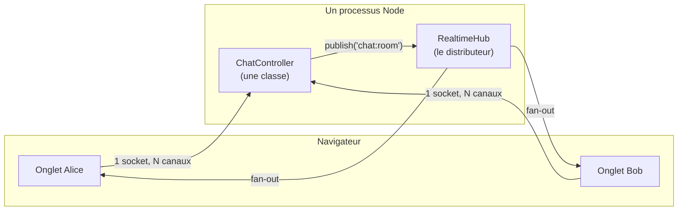
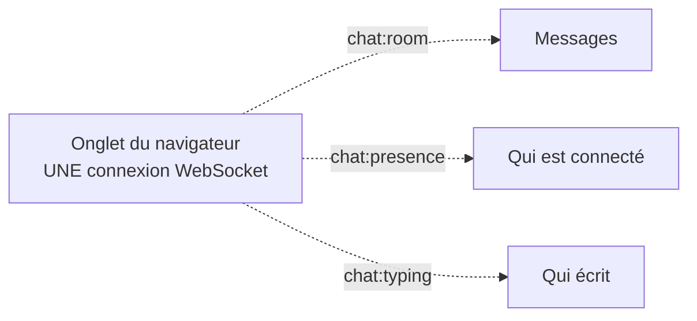
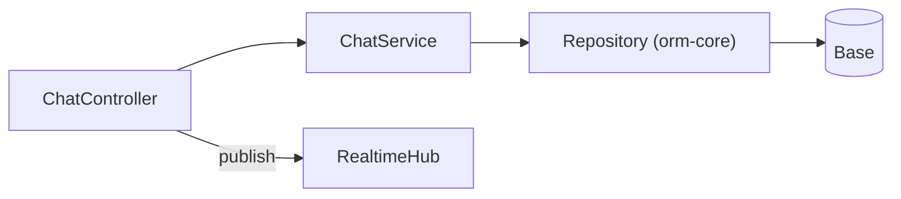
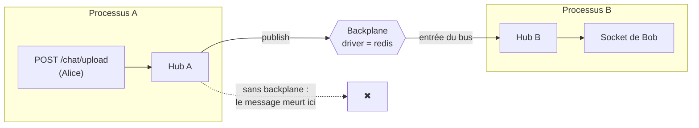

# Cookbook — un chat temps réel de bout en bout

> Sept étapes, du salon vide au salon qui tient plusieurs répliques. On part d'une application
> vierge, on écrit **un seul contrôleur**, et ce contrôleur répond à la fois en HTTP et en
> WebSocket — l'historique par `GET`, le direct par le canal, la pièce jointe par `POST` et sa
> diffusion par le canal. Chaque bloc de code est un fichier complet, avec son chemin. Rien n'est
> supposé connu du framework.

📍 [Documentation](../../../../../docs/index.md) › [@nodefony/realtime](index.md) › **Cookbook — un chat**

## 🎯 Ce qu'on construit

**En une phrase** : un salon de discussion où plusieurs personnes échangent des messages et des
fichiers en direct, avec présence, indicateur de frappe, historique persistant, contrôle d'accès, et
qui continue de fonctionner quand l'application passe de un à plusieurs processus.

**Ce que tu verras à l'écran** : deux onglets de navigateur côte à côte, ouverts sur la même page.
Tu tapes un message dans l'onglet de gauche, tu valides — il apparaît dans l'onglet de droite
immédiatement, sans rechargement, sans bouton « rafraîchir ». Sous la zone de saisie, une ligne
« Alice est en train d'écrire… » apparaît et disparaît. En haut, la liste des personnes connectées
se met à jour quand tu fermes un onglet.

**Ce que tu écriras** : un contrôleur d'environ 120 lignes, un composant React, et trois lignes de
configuration. Le protocole, la reconnexion, le multiplexage des canaux, le nettoyage des
abonnements et la diffusion entre répliques ne sont pas de ton ressort — c'est ce que le module
apporte.

### Le plan

| Étape                                                                                   | Ce qu'elle ajoute                                              | Ce qui devient possible                  |
| --------------------------------------------------------------------------------------- | -------------------------------------------------------------- | ---------------------------------------- |
| [1 — le chat minimal](#-démarrage-rapide--étape-1-le-chat-minimal-qui-marche)           | Un canal, un message qui traverse                              | Deux onglets qui se parlent              |
| [2 — HTTP et WebSocket](#-étape-2--le-même-contrôleur-sert-http-et-websocket)           | L'historique en `GET` dans la **même classe**                  | Une action, deux transports              |
| [3 — présence et frappe](#-étape-3--présence-et-frappe-en-cours)                        | Deux canaux de plus sur la **même** connexion                  | Multiplexage sans socket supplémentaire  |
| [4 — persister](#-étape-4--persister-lhistorique)                                       | Un repository derrière un service                              | L'historique survit au redémarrage       |
| [5 — protéger](#-étape-5--protéger-le-salon)                                            | Zone firewall + politique de canal                             | L'intrus est refusé, et sait qu'il l'est |
| [6 — la pièce jointe](#-étape-6--la-pièce-jointe-http-et-websocket-dans-la-même-classe) | `POST` multipart + annonce sur le canal                        | Le différenciateur devient **visible**   |
| [7 — plusieurs pods](#-étape-7--passer-à-plusieurs-pods)                                | Un changement de **driver**, zéro changement de logique métier | Le salon traverse les répliques          |

> [!TIP]
> Les étapes s'enchaînent : chacune reprend le fichier de la précédente et dit précisément ce
> qu'elle **ajoute**. Tu peux t'arrêter à l'étape 3 et avoir déjà quelque chose d'utilisable.

## 📖 Lexique

Tous les termes employés dans cette page. Le fond de chacun est dans
[vocabulaire.md](./vocabulaire.md) — ici, la définition strictement suffisante pour suivre.

| Terme              | Ce que c'est                                                                                                                                                  |
| ------------------ | ------------------------------------------------------------------------------------------------------------------------------------------------------------- |
| **Socket**         | La connexion WebSocket unique entre un navigateur et le serveur. Une seule par onglet, quel que soit le nombre de canaux.                                     |
| **Canal**          | Un flux nommé qui circule **dans** la socket (`chat:room`, `chat:presence`). Analogie : la socket est le câble, les canaux sont les fréquences qui y passent. |
| **Frame**          | Un message du protocole sur le fil. Toutes les frames sont du JSON-RPC 2.0.                                                                                   |
| **Hub**            | Le distributeur côté serveur : il tient la liste « qui écoute quel canal » et recopie chaque publication vers les abonnés du processus courant.               |
| **Backplane**      | Le « fond de panier » : ce qui relaie les publications d'un processus à l'autre. Sans lui, chaque réplique est une île.                                       |
| **Pod / réplique** | Un processus Node qui sert l'application. Un seul en développement, plusieurs en production.                                                                  |
| **Fan-out**        | La recopie d'une publication vers N abonnés. Une publication, N livraisons.                                                                                   |
| **Inbound**        | Un canal où le **client** pousse vers le serveur. Sens inverse du pub/sub habituel ; il faut le déclarer explicitement.                                       |
| **RPC**            | _Remote Procedure Call_ : le client appelle une méthode serveur et attend une réponse (une `Promise`). Par opposition à une notification, qui ne répond pas.  |
| **Provider**       | La fonction qui « alimente » un canal côté serveur. Créée au premier abonné, détruite au dernier.                                                             |
| **Sink**           | Le point de sortie d'une connexion sur un canal. Un abonné = un sink.                                                                                         |
| **BFF**            | _Backend For Frontend_ : le serveur porte la session dans un cookie, le navigateur ne manipule aucun jeton.                                                   |
| **Zone / area**    | Un motif d'URL que le firewall protège, avec la liste des façons de prouver son identité.                                                                     |
| **Politique**      | Les exigences attachées à un canal : authentifié, tel rôle, tel scope.                                                                                        |
| **Multipart**      | L'encodage d'un formulaire HTTP qui transporte des fichiers (`multipart/form-data`).                                                                          |

## 🧠 Le modèle mental en trois phrases

**Un.** Le navigateur ouvre **une seule** connexion WebSocket vers ton contrôleur. Tout ce qui suit
— messages, présence, frappe, annonces de fichiers — voyage dedans, en parallèle, sans jamais
ouvrir de seconde connexion.

**Deux.** Sur cette connexion circulent des **canaux nommés**. Le client dit « je m'abonne à
`chat:room` », le serveur publie sur `chat:room`, et tous les abonnés reçoivent. Le serveur ne
s'occupe jamais de « qui envoyer à qui » : il publie sur un nom, le hub distribue.

**Trois.** Un contrôleur temps réel est un **contrôleur Nodefony ordinaire**. Il a les mêmes
décorateurs de route, le même contexte, les mêmes services injectés, les mêmes gardes de sécurité
que ton contrôleur web. C'est pour ça que la même classe pourra servir un `GET` et un canal
WebSocket sans acrobatie — et c'est le cœur de cette page.



Le détail du trajet d'une frame, du câble jusqu'à ta méthode, est dans
[architecture.md](./architecture.md). Pour suivre ce cookbook, les trois phrases ci-dessus suffisent.

## 🧰 Ce dont tu pars

Une application Nodefony neuve, et rien d'autre. **Pas de Redis, pas de Docker, pas de base de
données** à cette étape — on n'en aura besoin qu'aux étapes 4 et 7, et la page le dira explicitement
le moment venu.

```bash
# 1. Créer l'application (profil complet : http, framework, realtime, sécurité, frontend)
npx nodefony create app mon-chat --complete
cd mon-chat

# 2. Créer le module qui portera le salon
npx nodefony create module chat

# 3. Créer le contrôleur temps réel dans ce module
npx nodefony create controller chat --module chat --kind realtime
```

> [!NOTE]
> **Un module, c'est quoi ?** Un dossier autonome qui regroupe les contrôleurs, services et
> configuration d'une fonctionnalité — l'équivalent d'un « bundle » Symfony ou d'un « module »
> NestJS. Il vit dans `modules/<nom>/` et c'est un vrai paquet npm : `nodefony create module chat`
> dans une app nommée `mon-chat` produit le paquet `@mon-chat/chat`. Tu n'as rien à publier ; ce
> nommage existe pour que le jour où tu veux partager le module, il n'y ait rien à refaire.

### L'arborescence, une fois pour toutes

Voici l'ensemble des fichiers que cette page touche. Les trois commandes ci-dessus les créent tous ;
tu n'écriras du contenu que dans ceux marqués **✍️**.

```
mon-chat/
├── nodefony.config.ts              ✍️  le manifeste : quels modules charger, et comment
├── env.ts                              catalogue des variables d'environnement
├── index.ts                            point d'entrée de l'app
├── package.json
├── modules/
│   └── chat/                           le module du salon (paquet @mon-chat/chat)
│       ├── index.ts                    la classe Module : déclare les contrôleurs
│       ├── package.json
│       └── nodefony/
│           ├── config/
│           │   ├── config.ts           schéma Zod de la config du module
│           │   └── defineModuleConfig.ts
│           ├── service/
│           │   └── ChatService.ts   ✍️  (étape 4) l'accès aux données
│           └── controllers/
│               └── ChatController.ts ✍️ LE fichier central de cette page
└── frontend/
    └── src/
        ├── main.tsx                ✍️  monte React et fournit la socket
        ├── realtime.ts             ✍️  crée la connexion, une seule fois
        └── ChatRoom.tsx            ✍️  l'écran du salon
```

### Le fichier que le scaffold a écrit pour toi

Tu n'as pas à le modifier avant l'étape 4, mais il faut savoir ce qu'il contient — c'est lui qui
relie ton contrôleur au reste de l'application :

```ts
// modules/chat/index.ts — généré par `nodefony create module chat`
import { Kernel, Module } from "nodefony";
import { controllers } from "@nodefony/framework";
import config from "./nodefony/config/config";
import ChatController from "./nodefony/controllers/ChatController";

/**
 * Le décorateur `@controllers([...])` déclare au Kernel les contrôleurs de ce
 * module. C'est la SEULE inscription nécessaire : les routes, elles, sont lues
 * sur les décorateurs des méthodes du contrôleur, pas listées ici.
 */
@controllers([ChatController])
class ChatModule extends Module {
  constructor(kernel: Kernel) {
    // 4ᵉ argument : les défauts de configuration du module, validés au boot.
    super("chat", kernel, import.meta.url, config);
  }
}

export default ChatModule;
```

> [!IMPORTANT]
> **Pourquoi un décorateur suffit à monter une route.** Au démarrage, le Kernel parcourt les
> contrôleurs déclarés, lit les métadonnées posées par `@controller` et `@route` sur la classe et ses
> méthodes, et construit la table de routage. Tu ne tiens aucun fichier de routes à la main : la
> route vit à côté du code qui l'implémente. Le même mécanisme vaut pour les routes WebSocket — une
> route WebSocket est une route comme une autre, qui déclare simplement un transport différent.

## 🚀 Démarrage rapide : étape 1, le chat minimal qui marche

L'objectif de cette étape est **la plus petite chose qui fonctionne** : deux onglets, un message qui
traverse. Trois fichiers à écrire, un à ajuster.

### Le contrôleur — fichier **créé** (le scaffold l'a rempli d'un exemple, on le remplace)

```ts
// modules/chat/nodefony/controllers/ChatController.ts
import { controller, route } from "@nodefony/framework";
import {
  RealtimeController,
  RealtimeChannel,
  RealtimeInbound,
  getRealtimeHub,
} from "@nodefony/realtime";
import type { RealtimePublish } from "@nodefony/realtime";
import type { ContextType } from "@nodefony/http";

/** Un message tel qu'il circule sur le canal du salon. */
export interface ChatMessage {
  author: string;
  text: string;
  sentAt: number;
}

/** Le nom du canal du salon. Une constante : il est cité côté serveur ET côté client. */
export const ROOM_CHANNEL = "chat:room";

@controller("/chat")
class ChatController extends RealtimeController {
  constructor(context: ContextType) {
    super("chat", context);
  }

  /**
   * LA PORTE. Cette route ne répond qu'au transport WEBSOCKET : c'est l'URL que
   * le navigateur ouvre (`/chat/realtime`). `handleRealtime` prend en charge tout
   * le protocole — poignée de main, abonnements, découpage des frames, nettoyage
   * à la fermeture. Tu n'écris jamais une ligne de protocole.
   */
  @route("chat-realtime", {
    path: "/realtime",
    requirements: { methods: ["WEBSOCKET"] },
  })
  async realtime(message: string | Buffer | null): Promise<void> {
    this.handleRealtime(message);
  }

  /**
   * LE CANAL DU SALON. Cette méthode est le « provider » : le hub l'appelle au
   * PREMIER abonné et attend en retour une fonction de nettoyage, qu'il appellera
   * au DERNIER désabonnement.
   *
   * Ici, il n'y a rien à démarrer : le salon n'émet pas tout seul, il relaie ce
   * que les gens envoient. On rend donc une fonction de nettoyage vide. Elle
   * n'est pas facultative : un canal dont le provider renvoie `null` est
   * considéré INCONNU, et l'abonnement est refusé en silence.
   */
  @RealtimeChannel(ROOM_CHANNEL)
  room(_channel: string, _publish: RealtimePublish): () => void {
    return () => {};
  }

  /**
   * L'ENVOI. `@RealtimeInbound` déclare un canal où le CLIENT pousse vers le
   * serveur — le sens inverse du pub/sub. Rien n'est ouvert par défaut : tant
   * qu'une méthode ne le déclare pas, un client ne peut rien pousser.
   *
   * `params` vient du réseau : il n'est PAS digne de confiance. On le valide
   * avant toute chose. `reply` répond à CETTE connexion seulement ; pour parler
   * à tout le salon, on publie sur le canal.
   */
  @RealtimeInbound("chat:send")
  onSend(params: unknown, reply: (payload: unknown) => void): void {
    const input = params as { author?: unknown; text?: unknown } | null;
    const text = typeof input?.text === "string" ? input.text.trim() : "";
    const author =
      typeof input?.author === "string" && input.author.length > 0
        ? input.author.slice(0, 40)
        : "anonyme";

    if (text.length === 0 || text.length > 2000) {
      reply({ ok: false, error: "message vide ou trop long" });
      return;
    }

    const message: ChatMessage = { author, text, sentAt: Date.now() };

    // Diffusion à TOUS les abonnés du canal. Une publication, N livraisons.
    getRealtimeHub().publish(ROOM_CHANNEL, message);

    // Accusé de réception, à l'expéditeur uniquement.
    reply({ ok: true, sentAt: message.sentAt });
  }
}

export default ChatController;
```

> [!WARNING]
> **`author` vient du client — il ment.** À cette étape, n'importe qui peut se déclarer « Alice ».
> C'est assumé : on construit d'abord ce qui marche. L'[étape 5](#-étape-5--protéger-le-salon)
> remplace ce champ par l'identité **vérifiée par le serveur**, et le client n'aura plus son mot à
> dire.

### La configuration — fichier **modifié**

Le manifeste `modules` dit au Kernel quoi charger, et dans quel ordre. `use(nom, config)` charge un
module **et** lui passe sa configuration au même endroit — c'est tout ce que fait cette fonction.

```ts
// nodefony.config.ts — le manifeste des modules (extrait)
export default defineConfig(() => ({
  modules: [
    // Serveurs HTTP/HTTPS/WebSocket natifs.
    use("@nodefony/http", {}),
    // Routeur, contrôleurs, décorateurs.
    "@nodefony/framework",
    // La socket Nodefony. `loopback` = un seul processus, aucune infrastructure
    // externe. C'est le défaut, et c'est tout ce qu'il faut jusqu'à l'étape 7.
    use("@nodefony/realtime", { backplane: { driver: "loopback" } }),
    // Sert le frontend (Vite en développement, fichiers compilés en production).
    "@nodefony/frontend",
    // Ton module.
    "@mon-chat/chat",
  ],
}));
```

### La connexion côté navigateur — fichier **créé**

Une seule instance pour toute l'application. C'est important : ouvrir une connexion par composant
gaspillerait une socket par écran.

```ts
// frontend/src/realtime.ts
import { RealtimeClient } from "nodefony/client";

// `wss` si la page est en HTTPS, `ws` sinon. Une application Nodefony sert en
// HTTPS par défaut, y compris en développement : ce sera donc `wss` chez toi.
const scheme = window.location.protocol === "https:" ? "wss" : "ws";

/**
 * L'unique connexion du navigateur. L'URL est celle de la route WEBSOCKET du
 * contrôleur : préfixe de classe `/chat` + chemin de route `/realtime`.
 *
 * La reconnexion automatique, le renvoi des abonnements après une coupure et le
 * heartbeat sont inclus — rien à écrire pour ça.
 */
export const chatSocket = new RealtimeClient({
  url: `${scheme}://${window.location.host}/chat/realtime`,
});
```

### L'écran — fichier **créé**

```tsx ignore
// frontend/src/ChatRoom.tsx
import { useState } from "react";
import {
  useNodefony,
  useNodefonyChannel,
  useNodefonyState,
} from "nodefony/react";

interface ChatMessage {
  author: string;
  text: string;
  sentAt: number;
}

export function ChatRoom({ pseudo }: { pseudo: string }) {
  const socket = useNodefony();
  const state = useNodefonyState();
  const [messages, setMessages] = useState<ChatMessage[]>([]);
  const [draft, setDraft] = useState("");

  // S'abonne au canal du salon et empile chaque message reçu.
  // Le hook gère l'abonnement, le désabonnement au démontage, et le
  // ré-abonnement après une reconnexion.
  useNodefonyChannel("chat:room", (payload) => {
    setMessages((previous) => [...previous, payload as ChatMessage]);
  });

  const send = () => {
    const text = draft.trim();
    if (text.length === 0) return;
    // `channel(...).send(...)` pousse sur un canal inbound : c'est le pendant
    // client de `@RealtimeInbound("chat:send")` côté serveur.
    socket.channel("chat:send").send({ author: pseudo, text });
    setDraft("");
  };

  return (
    <section>
      <p>Connexion : {state}</p>
      <ul>
        {messages.map((message) => (
          <li key={`${message.author}-${message.sentAt}`}>
            <strong>{message.author}</strong> : {message.text}
          </li>
        ))}
      </ul>
      <input
        value={draft}
        onChange={(event) => setDraft(event.target.value)}
        onKeyDown={(event) => {
          if (event.key === "Enter") send();
        }}
        placeholder="Ton message…"
      />
      <button type="button" onClick={send}>
        Envoyer
      </button>
    </section>
  );
}
```

```tsx ignore
// frontend/src/main.tsx
import { createRoot } from "react-dom/client";
import { NodefonyProvider } from "nodefony/react";
import { chatSocket } from "./realtime";
import { ChatRoom } from "./ChatRoom";

// La connexion s'ouvre UNE fois, au démarrage de l'application. Les hooks ne
// gèrent que les abonnements : le cycle de vie de la socket reste à toi.
void chatSocket.connect();

createRoot(document.getElementById("app")!).render(
  <NodefonyProvider client={chatSocket}>
    <ChatRoom pseudo={`invité-${Math.floor(Math.random() * 1000)}`} />
  </NodefonyProvider>,
);
```

### Ce qu'on observe

```bash
npx nodefony development
```

Au démarrage, la ligne d'identité du temps réel apparaît dans les logs. Elle a cette forme —
`driver` est celui que tu as déclaré, `kind=local` signifie « aucun relais entre processus », ce qui
est exactement ce qu'on veut ici :

```
realtime backplane  driver=loopback kind=local cross-pod=no (hub local)
```

Ouvre maintenant `https://127.0.0.1:5152/` dans **deux onglets**, côte à côte.

| Tu fais                               | Tu vois                                                                                                   |
| ------------------------------------- | --------------------------------------------------------------------------------------------------------- |
| Tu ouvres le premier onglet           | `Connexion : connected`. Côté serveur, une ligne `WS realtime client connected`.                          |
| Tu tapes « bonjour » et tu valides    | Le message apparaît dans l'onglet **gauche ET l'onglet droit**, sans rechargement.                        |
| Tu fermes un onglet                   | Côté serveur, `WS realtime client disconnected — cleanup done`. L'abonnement et le provider sont libérés. |
| Tu coupes le serveur puis le relances | `Connexion : reconnecting` puis `connected`. L'abonnement au canal est renvoyé tout seul.                 |

C'est un chat fonctionnel. Les six étapes suivantes le rendent utilisable pour de vrai.

## 🔌 Étape 2 : le même contrôleur sert HTTP et WebSocket

**C'est la section qui compte.** Tout ce qui précède, d'autres outils le font. Ce qui suit, non.

### Le problème que ça résout

Un salon a besoin de deux choses de nature opposée :

- **L'historique** — une lecture ponctuelle, qu'on veut pouvoir appeler en `curl`, mettre en cache,
  indexer, tester avec un client HTTP ordinaire.
- **Le direct** — un flux continu poussé par le serveur, qui n'a aucun sens en requête/réponse.

L'architecture habituelle sépare : un serveur HTTP d'un côté, un serveur WebSocket de l'autre, deux
processus, deux façons de s'authentifier, deux endroits où recopier la logique métier — et le jour
où la règle « seuls les membres du salon voient l'historique » change, il faut la changer deux fois,
en espérant ne pas en oublier une.

### Ce que fait Nodefony

**Une classe. Un contexte. Les mêmes services injectés. Les mêmes gardes.** Une méthode déclare
simplement à quels transports elle répond :

```ts ignore
requirements: {
  methods: ["GET", "WEBSOCKET"];
}
```

Cette méthode est alors joignable de **deux** façons, et c'est **le même code** qui s'exécute :

- `GET /chat/history` en HTTP ;
- `socket.request("/chat/history")` par la socket déjà ouverte.

Le passage par la socket emprunte un pont interne qui rejoue le routage sur le chemin demandé, puis
exécute l'action. Ce pont ne peut atteindre **que** les routes ayant explicitement déclaré le
transport `WEBSOCKET` — une action décide à quelles portes elle répond, il n'y a pas de contournement
possible. Il est de plus désactivé par défaut : il faut l'ouvrir, contrôleur par contrôleur.

### Le contrôleur — fichier **modifié**

Trois ajouts au fichier de l'étape 1 : un petit stock en mémoire, l'ouverture du pont, et la route à
double transport.

```ts ignore
// modules/chat/nodefony/controllers/ChatController.ts (ajouts de l'étape 2)
import { Query } from "@nodefony/framework";

@controller("/chat")
class ChatController extends RealtimeController {
  /** Stock temporaire — l'étape 4 le remplace par une vraie base. */
  static history: ChatMessage[] = [];

  /**
   * OUVRE LE PONT. Sans ce `true`, la connexion socket n'expose aucune surface
   * d'invocation d'API : c'est un choix par défaut, une porte ne s'ouvre jamais
   * toute seule.
   */
  protected override realtimeApiRequest(): boolean {
    return true;
  }

  /**
   * UNE méthode, DEUX transports. Le corps ne sait pas — et n'a pas à savoir —
   * par où l'appel est arrivé.
   */
  @route("chat-history", {
    path: "/history",
    requirements: { methods: ["GET", "WEBSOCKET"] },
  })
  historyAction(@Query("limit") limit?: string) {
    const max = Math.min(Number(limit) || 50, 200);
    return ChatController.history.slice(-max);
  }
}
```

Et dans `onSend`, une ligne pour alimenter le stock avant de publier :

```ts ignore
ChatController.history.push(message);
getRealtimeHub().publish(ROOM_CHANNEL, message);
```

### Côté client — l'historique au montage

```tsx ignore
// frontend/src/ChatRoom.tsx (ajout de l'étape 2)
import { useEffect } from "react";

// Au montage : on récupère l'historique par la socket DÉJÀ ouverte.
// Aucune requête HTTP supplémentaire, aucun en-tête à reconstruire,
// aucune poignée de main TLS de plus.
useEffect(() => {
  void socket
    .request<ChatMessage[]>("/chat/history?limit=50")
    .then((past) => setMessages(past));
}, [socket]);
```

Le chemin commence par `/` : le client le reconnaît comme un appel d'API et emprunte le pont. Une
méthode RPC ordinaire, elle, ne commence jamais par `/` — il n'y a pas de collision possible entre
les deux formes.

### Ce qu'on observe

La même donnée, obtenue de deux façons, par le même code serveur :

```bash
# Transport 1 — HTTP, un client universel
curl -k "https://127.0.0.1:5152/chat/history?limit=5"
```

```ts ignore
// Transport 2 — la socket déjà ouverte, depuis la console du navigateur
await chatSocket.request("/chat/history?limit=5");
```

Les deux renvoient le même tableau JSON. Si tu ajoutes une garde d'autorisation sur la méthode, elle
s'applique aux **deux** — c'est le même pipeline, pas deux implémentations à synchroniser.

> [!IMPORTANT]
> **Ce qu'il faut retenir.** Il n'y a pas « le serveur HTTP » et « le serveur WebSocket ». Il y a
> **ton contrôleur**, et deux façons de l'atteindre. La règle métier s'écrit une fois, la garde de
> sécurité s'écrit une fois, le test s'écrit une fois. L'[étape 6](#-étape-6--la-pièce-jointe-http-et-websocket-dans-la-même-classe)
> pousse le raisonnement jusqu'au bout, avec un `POST` de fichier dont le résultat ressort par le
> canal.

## 🧩 Étape 3 : présence et frappe en cours

On ajoute deux flux : qui est là, et qui est en train d'écrire. Le point de cette étape n'est pas
la fonctionnalité — c'est **ce qu'elle ne coûte pas**.

### Trois canaux, une seule connexion

Un salon complet a besoin d'au moins trois flux distincts. Dans beaucoup d'architectures, cela se
traduit par plusieurs connexions, ou par un canal fourre-tout où chacun filtre ce qui le concerne.
Ici, les trois canaux voyagent **dans la même socket**, chacun avec son nom, chacun avec son
abonnement propre :



S'abonner à un quatrième canal n'ouvre pas de quatrième connexion : cela envoie une frame
d'abonnement sur celle qui existe déjà. C'est ce que « multiplexer » veut dire ici, et c'est ce qui
rend viable le fait d'avoir un canal par préoccupation plutôt qu'un canal fourre-tout.

### Le contrôleur — fichier **modifié**

```ts ignore
// modules/chat/nodefony/controllers/ChatController.ts (ajouts de l'étape 3)

/** Les pseudos présents, par connexion. Statique : partagé par tout le processus. */
static present = new Set<string>();

/**
 * PRÉSENCE. Ce provider-là a quelque chose à démarrer : un rappel régulier de
 * l'état. La fonction de nettoyage rendue au hub arrête le minuteur — au dernier
 * désabonné, plus personne ne paie ce coût.
 */
@RealtimeChannel("chat:presence")
presence(channel: string, publish: RealtimePublish): () => void {
  const timer = setInterval(() => {
    publish(channel, { present: [...ChatController.present] });
  }, 5000);
  // `unref` : ce minuteur ne doit jamais retenir le processus à l'arrêt.
  timer.unref();
  return () => clearInterval(timer);
}

/** FRAPPE EN COURS. Volatile par nature : rien à persister, rien à rejouer. */
@RealtimeChannel("chat:typing")
typing(_channel: string, _publish: RealtimePublish): () => void {
  return () => {};
}

/** Le client signale qu'il écrit ; on le relaie tel quel au salon. */
@RealtimeInbound("chat:typing")
onTyping(params: unknown): void {
  const author = (params as { author?: unknown } | null)?.author;
  if (typeof author !== "string" || author.length === 0) return;
  getRealtimeHub().publish("chat:typing", { author: author.slice(0, 40) });
}
```

> [!NOTE]
> **Un canal peut porter les deux sens.** `chat:typing` est déclaré à la fois comme canal sortant
> (`@RealtimeChannel`) et comme canal entrant (`@RealtimeInbound`). C'est ce qu'on appelle un canal
> **duplex** : le client y pousse, et le reçoit en retour parce qu'il y est abonné.

### Côté client

```tsx ignore
// frontend/src/ChatRoom.tsx (ajouts de l'étape 3)
import { useNodefonyChannelData } from "nodefony/react";

// La DERNIÈRE valeur reçue suffit pour un état : on ne veut pas l'historique
// des présences, seulement l'état courant.
const presence = useNodefonyChannelData<{ present: string[] }>("chat:presence");

const [typingBy, setTypingBy] = useState<string | null>(null);
useNodefonyChannel("chat:typing", (payload) => {
  const author = (payload as { author: string }).author;
  if (author === pseudo) return; // ne pas s'afficher soi-même
  setTypingBy(author);
  // L'indicateur s'efface tout seul : le serveur n'envoie jamais de « stop ».
  window.setTimeout(() => setTypingBy(null), 2500);
});

// Dans le rendu :
// <p>{presence?.present.length ?? 0} connecté(s)</p>
// {typingBy && <p>{typingBy} est en train d'écrire…</p>}
```

### Ce qu'on observe

| Tu fais                                 | Tu vois                                                                                                    |
| --------------------------------------- | ---------------------------------------------------------------------------------------------------------- |
| Tu tapes dans l'onglet gauche           | « invité-412 est en train d'écrire… » apparaît dans l'onglet droit, puis disparaît seul.                   |
| Tu ouvres l'onglet réseau du navigateur | **Une seule** entrée WebSocket, même avec trois canaux actifs. C'est le point de cette étape.              |
| Tu quittes l'écran du salon             | Les trois abonnements sont relâchés. Au dernier abonné de `chat:presence`, le minuteur serveur est arrêté. |

## 💾 Étape 4 : persister l'historique

Le stock statique de l'étape 2 disparaît au redémarrage. On le remplace par un service qui parle à
la base. **Cette section reste volontairement courte** : ce n'est pas une page ORM, et le temps réel
n'a aucune opinion sur ta façon de stocker.

### Le principe

Le contrôleur ne doit pas parler à la base directement. On interpose un service, injecté par le
conteneur, et le contrôleur se contente de l'appeler :



Le service ne sait rien du temps réel, et c'est délibéré : il est testable sans socket, réutilisable
depuis une commande CLI ou une tâche planifiée. Le contrôleur est le seul à connaître les deux
mondes — il enregistre, **puis** il diffuse.

### Le contrôleur — fichier **modifié**

La méthode `onSend` de l'étape 1 est remplacée **en entier** par celle-ci. Seules les deux dernières
lignes changent, mais la voici complète pour qu'il n'y ait rien à reconstituer :

```ts ignore
// modules/chat/nodefony/controllers/ChatController.ts
// → remplace intégralement la méthode `onSend` de l'étape 1
@RealtimeInbound("chat:send")
async onSend(params: unknown, reply: (payload: unknown) => void): Promise<void> {
  const input = params as { author?: unknown; text?: unknown } | null;
  const text = typeof input?.text === "string" ? input.text.trim() : "";
  const author =
    typeof input?.author === "string" && input.author.length > 0
      ? input.author.slice(0, 40)
      : "anonyme";

  if (text.length === 0 || text.length > 2000) {
    reply({ ok: false, error: "message vide ou trop long" });
    return;
  }

  // 1. On persiste D'ABORD. Si l'écriture échoue, rien n'est diffusé : on ne
  //    veut pas d'un message visible par tous mais absent de l'historique.
  const saved = await this.chatService.save({ author, text, sentAt: Date.now() });

  // 2. Puis on diffuse le message tel qu'il a été enregistré (avec son id).
  getRealtimeHub().publish(ROOM_CHANNEL, saved);

  reply({ ok: true, id: saved.id });
}
```

L'ordre compte, et c'est la seule règle de cette étape : **persister, puis publier**. L'inverse
produit des messages que certains ont vus et que l'historique ignore.

Pour écrire `ChatService` — entité, repository, migrations, choix du dialecte — tout est dans la
documentation dédiée : **[`@nodefony/orm-core`](../../orm-core/docs/index.md)**.

## 🔐 Étape 5 : protéger le salon

Jusqu'ici, n'importe qui peut se connecter et se déclarer « Alice ». On corrige les deux problèmes
d'un coup : savoir **qui** parle, et refuser ceux qui n'ont rien à faire là.

### Un : déclarer la zone

Une zone firewall dit « ces URL sont protégées, voici comment on y prouve son identité ». Elle
couvre le HTTP **et** le WebSocket qu'elle recouvre — c'est le défaut, et c'est volontaire : une
zone protégée qui laisserait passer le WebSocket serait une porte dérobée.

```ts ignore
// nodefony.config.ts (ajout de l'étape 5)
use("@nodefony/security", {
  areas: {
    chat: {
      pattern: "^/chat",
      // Cookie de session (BFF) : le navigateur n'a aucun jeton à manipuler,
      // et le cookie voyage naturellement avec la poignée de main WebSocket.
      authenticators: ["session"],
    },
  },
  roleHierarchy: {
    ROLE_ADMIN: ["ROLE_USER"],
  },
});
```

> [!NOTE]
> **Tu n'écris aucun code de branchement.** Au démarrage, le firewall repère le module temps réel,
> installe l'authentificateur de chaque zone concernée sur la poignée de main, et pose le verrou qui
> filtrera les frames. La configuration ci-dessus suffit ; il n'y a pas de service à instancier ni
> de crochet à enregistrer.

### Deux : déclarer la politique du canal

Le décorateur de canal accepte un second argument : les exigences à satisfaire pour s'y abonner.

Les deux méthodes concernées, complètes, avec leur politique :

```ts ignore
// modules/chat/nodefony/controllers/ChatController.ts
// → remplace les déclarations de canal des étapes 1 et 3
@RealtimeChannel(ROOM_CHANNEL, { authenticated: true, roles: ["ROLE_USER"] })
room(_channel: string, _publish: RealtimePublish): () => void {
  return () => {};
}

@RealtimeChannel("chat:presence", { authenticated: true, roles: ["ROLE_USER"] })
presence(channel: string, publish: RealtimePublish): () => void {
  const timer = setInterval(() => {
    publish(channel, { present: [...ChatController.present] });
  }, 5000);
  timer.unref();
  return () => clearInterval(timer);
}
```

Le module temps réel ne décide de rien : il **transporte la déclaration** jusqu'au firewall, seul à
connaître la hiérarchie des rôles et l'identité réelle.

### Trois : l'auteur n'est plus déclaré par le client

C'est ici qu'il faut être précis, car **tous les chemins ne se valent pas**.

Un handler `@RealtimeInbound` reçoit `(params, reply)` — et **rien d'autre**. Il ne reçoit ni la
connexion, ni le jeton d'identité résolu à la poignée de main. Autrement dit : depuis un canal
inbound brut, le serveur **ne peut pas savoir qui parle**. Le canal peut être _gardé_ par une
politique (personne d'anonyme ne s'y abonne), mais le nom de l'auteur reste, lui, déclaré par le
client.

La voie qui donne l'identité est celle de l'[étape 2](#-étape-2--le-même-contrôleur-sert-http-et-websocket) :
une **action de contrôleur**, atteinte par la socket. Sur ce chemin, le framework établit le contexte
de requête avec le jeton de la connexion — exactement comme en HTTP — et les décorateurs habituels
fonctionnent :

```ts ignore
// modules/chat/nodefony/controllers/ChatController.ts
// → remplace `@RealtimeInbound("chat:send")` par une ACTION
import { Body, CurrentUser, IsGranted } from "@nodefony/framework";

/**
 * L'envoi devient une action, joignable en POST HTTP comme par la socket.
 * On y gagne ce qu'un canal inbound ne peut pas offrir : l'identité vérifiée
 * (`@CurrentUser`), la garde d'autorisation, et le pipeline complet.
 */
@route("chat-send", {
  path: "/send",
  requirements: { methods: ["POST", "WEBSOCKET"] },
})
@IsGranted(["ROLE_USER"])
async send(
  @Body() payload: { text?: string },
  @CurrentUser() user?: { identifier?: string },
) {
  const text = typeof payload?.text === "string" ? payload.text.trim() : "";
  if (text.length === 0 || text.length > 2000) {
    throw new HttpError("message vide ou trop long", 400);
  }

  // L'auteur vient du SERVEUR. Le client ne peut plus mentir dessus.
  const message: ChatMessage = {
    author: user?.identifier ?? "inconnu",
    text,
    sentAt: Date.now(),
  };

  getRealtimeHub().publish(ROOM_CHANNEL, message);
  return { ok: true, sentAt: message.sentAt };
}
```

Côté navigateur, l'envoi passe alors par `mutate`, qui porte la méthode HTTP logique et une clé
d'idempotence — une socket qui se reconnecte peut rejouer une frame, la clé évite le doublon :

```tsx ignore
// frontend/src/ChatRoom.tsx (étape 5)
await socket.mutate("/chat/send", {
  method: "POST",
  body: { text },
  idempotencyKey: crypto.randomUUID(),
});
```

> [!TIP]
> **La règle à retenir.** Canal inbound = flux volatil, à haute fréquence, dont l'expéditeur importe
> peu (« untel écrit »). Action de contrôleur = tout ce qui doit être **attribué, autorisé ou
> conservé**. Le chat de l'étape 1 utilisait un canal inbound par simplicité ; dès qu'il y a des
> comptes, l'envoi devient une action. La frappe en cours, elle, reste un canal inbound — son auteur
> n'a pas besoin d'être prouvé.

Côté navigateur, l'identité annoncée par le serveur se lit sans appeler la moindre route :

```tsx ignore
// frontend/src/ChatRoom.tsx (étape 5)
import { useNodefonyIdentity } from "nodefony/react";

const identity = useNodefonyIdentity();
// `null` tant que la connexion n'a pas abouti ; ensuite :
//   identity.authenticated === false  → afficher l'écran de connexion
//   identity.userIdentifier            → le pseudo, garanti par le serveur
//   identity.roles                     → pour masquer ce qui n'est pas permis
```

### Ce que voit précisément un intrus

Rien n'échoue en silence, et rien ne renseigne l'attaquant sur **pourquoi** il échoue.

| Situation                                                        | Ce que reçoit le client                                             | Détail                                                         |
| ---------------------------------------------------------------- | ------------------------------------------------------------------- | -------------------------------------------------------------- |
| Pas de session, la zone en exige une                             | Fermeture WebSocket, code **4001**, motif `unauthorized`            | La connexion n'est jamais établie.                             |
| Origine du navigateur non autorisée                              | Fermeture WebSocket, code **4003**, motif `origin not allowed`      | Défense contre les connexions déclenchées par un tiers.        |
| Session révoquée **pendant** la connexion (déconnexion ailleurs) | Fermeture WebSocket, code **4001**, motif `session revoked`         | Vérification périodique ; une session morte ferme la socket.   |
| Abonnement à un canal interdit                                   | Notification `realtime:denied` = `{ channel, reason: "forbidden" }` | Le canal n'est pas ouvert. Le motif reste générique.           |
| Trop de canaux ouverts sur une connexion                         | Notification `realtime:denied` = `{ channel, reason: "limit" }`     | Garde anti-saturation, pas une décision de sécurité.           |
| Appel d'API refusé par le pont                                   | Erreur JSON-RPC, message `unauthorized`                             | Une requête reçoit une erreur ; une notification, un `denied`. |

> [!IMPORTANT]
> **Pourquoi `realtime:denied` existe.** Un abonnement est une notification : le protocole ne prévoit
> aucune réponse. Sans cette annonce, un client refusé se croirait abonné et attendrait indéfiniment
> des messages qui n'arriveraient jamais. Le refus est donc **rendu observable** — mais le motif
> reste volontairement vague : dire « il te manque `ROLE_ADMIN` » renseignerait l'attaquant sur la
> structure des droits.

Côté client, ces refus se branchent en un endroit :

```tsx ignore
// frontend/src/main.tsx — un seul point d'écoute pour toute l'application
chatSocket.onDenied((denied) => {
  console.warn(`accès refusé au canal ${denied.channel} (${denied.reason})`);
});
```

### Le piège à connaître : une politique sans gardien

Si tu déclares une politique de canal **sans** charger le module de sécurité (ou avec toutes les
zones exclues du temps réel), la politique est enregistrée mais **inerte** — le canal est servi à
tout le monde. Le framework ne se tait pas : il émet un avertissement explicite au démarrage.

```
Realtime channel policies declared but NO frame authorizer is wired —
these policies are NOT enforced (a protected channel is currently open).
Load @nodefony/security with a realtime zone to enforce them.
```

Cet avertissement mérite d'être traité comme une erreur en production. Le fond du sujet —
authentificateurs disponibles, révocation, audit — est dans [securite.md](./securite.md).

## 📎 Étape 6 : la pièce jointe, HTTP et WebSocket dans la même classe

**C'est l'étape la plus importante de cette page**, et celle qui rendra l'étape suivante évidente au
lieu de théorique.

### Pourquoi un chat ne prouve rien tout seul

Un chat est trop indulgent. Deux secondes de latence ? On ne le voit pas. Un message qui arrive dans
le désordre ? On ne le remarque pas. Un message perdu de temps en temps ? On croit que l'autre n'a
pas répondu. Surtout : **tout y passe par la WebSocket**, donc rien n'exerce jamais ce qui distingue
ce framework — et en développement mono-processus, il marche parfaitement **sans backplane**, si
bien qu'on ne comprend jamais à quoi sert la brique la plus structurante du module.

La pièce jointe change tout, sans changer l'histoire :

- Le fichier part en **`POST` HTTP** (multipart) — le seul transport raisonnable pour des octets en
  volume.
- Le résultat — « Alice a partagé `rapport.pdf` » — arrive à tout le salon **par le canal
  WebSocket**.
- Les deux sont servis par **la même classe**, avec le même contexte et les mêmes services.

Le différenciateur cesse d'être une affirmation : il devient la seule façon simple d'écrire cette
fonctionnalité.

### Le contrôleur — fichier **modifié**

```ts ignore
// modules/chat/nodefony/controllers/ChatController.ts (ajouts de l'étape 6)
import { UploadedFile } from "@nodefony/framework";
import type { IUploadedFile } from "@nodefony/http";

/** Ce qu'on annonce au salon quand un fichier a fini d'arriver. */
export interface ChatAttachment {
  author: string;
  filename: string;
  size: number;
  mimeType: string | null | undefined;
  sentAt: number;
}

/**
 * LE FICHIER ARRIVE EN HTTP, LA NOUVELLE REPART EN WEBSOCKET.
 *
 * Cette route ne déclare QUE `POST` : un envoi de fichier n'a rien à faire sur
 * le pont socket. Le fichier est écrit au fil de l'eau par le sous-système
 * d'upload — il n'est jamais entièrement chargé en mémoire.
 */
@route("chat-upload", {
  path: "/upload",
  requirements: { methods: ["POST"] },
})
async upload(@UploadedFile() file?: IUploadedFile) {
  if (!file) {
    throw new HttpError("aucun fichier reçu", 400);
  }

  // Même service, même contexte, même identité que la route WebSocket :
  // c'est la même classe.
  const saved = await this.chatService.saveAttachment(file);

  const announcement: ChatAttachment = {
    author: saved.author,
    filename: file.filename,
    size: file.size,
    mimeType: file.mimeType,
    sentAt: Date.now(),
  };

  // ── LE POINT DE BASCULE ──
  // La requête HTTP répondra à SON auteur. Cette publication, elle, atteint
  // TOUTES les personnes abonnées au canal — y compris celles qui n'ont jamais
  // émis cette requête. Un transport entre, un autre sort.
  getRealtimeHub().publish(ROOM_CHANNEL, announcement);

  // La réponse HTTP, pour l'expéditeur uniquement.
  return { ok: true, filename: file.filename, size: file.size };
}
```

### Côté client

L'envoi est un `POST` ordinaire. La mise à jour de l'écran, elle, ne vient **pas** de la réponse :
elle vient du canal, auquel on est déjà abonné depuis l'étape 1.

```tsx ignore
// frontend/src/ChatRoom.tsx (ajout de l'étape 6)
const sendFile = async (file: File) => {
  const form = new FormData();
  form.append("file", file);

  // Un POST classique. Aucune API temps réel ici.
  await fetch("/chat/upload", { method: "POST", body: form });

  // Et… c'est tout. On ne touche PAS à `setMessages` : l'annonce arrivera par
  // `chat:room`, exactement comme pour les autres participants. L'expéditeur
  // est traité comme tout le monde — un seul chemin de mise à jour de l'écran,
  // donc un seul comportement à tester.
};
```

> [!NOTE]
> **Ce que le framework ne fournit pas : la progression d'envoi côté serveur.** Il n'existe pas de
> canal qui pousserait « 43 % transféré » pendant la montée du fichier. Ce qui existe, et qui est
> montré ici, c'est l'**annonce de la pièce jointe terminée**, diffusée à tout le salon. Une barre de
> progression reste possible côté navigateur, avec les API du navigateur, sans participation du
> serveur. Cette page ne montre que ce qui existe.

### Ce qu'on observe — et ce qui casse

En développement, un seul processus : tout fonctionne. Tu déposes un fichier dans l'onglet gauche,
la ligne « invité-412 a partagé rapport.pdf » apparaît dans l'onglet droit.

**Maintenant, passe à deux processus** — c'est là que ça devient intéressant :

```bash
# Deux workers, chacun un processus Node, sans changer une ligne de code
npx nodefony cluster -w 2
```

Ouvre deux onglets. Chaque connexion WebSocket atterrit sur **un worker au hasard**. Avec un peu de
chance — ou en insistant — Alice est sur le worker A et Bob sur le worker B.

| Tu fais                        | Ce que tu observes                                                                  |
| ------------------------------ | ----------------------------------------------------------------------------------- |
| Alice envoie un fichier        | Sa propre requête `POST` réussit : `{ ok: true }`. Elle voit son annonce.           |
| Bob, connecté à l'autre worker | **Rien.** Aucune annonce. Aucune erreur. Aucun log. Le salon est cassé, en silence. |
| Tu recharges la page de Bob    | Le fichier est bien là, dans l'historique — la base, elle, est partagée.            |

**C'est le symptôme le plus déroutant du temps réel distribué** : la donnée est correcte, la requête
a réussi, et pourtant l'écran de l'autre ne bouge pas. La cause est simple une fois nommée : le
`POST` a atterri sur le processus A, la socket de Bob est tenue par le processus B, et **aucun
chemin ne relie les deux**. Le hub du processus A a fait exactement son travail — distribuer à
**ses** abonnés. Bob n'en fait pas partie.

Le chat seul ne révélait pas ce problème : les deux onglets tombaient souvent sur le même worker, et
quand ils tombaient sur des workers différents, on mettait l'absence de message sur le compte d'un
bug d'affichage. La pièce jointe, elle, ne laisse aucun doute.

C'est ce que l'étape suivante répare.

## 🌐 Étape 7 : passer à plusieurs pods

### Deux choses, et deux seulement

**Un — déclarer quels canaux sont diffusables.** Par défaut, un canal reste **local au processus**.
Ce n'est pas un oubli mais une protection : la plupart des canaux d'une application (état du
processus, métriques d'instance, sondes) n'auraient aucun sens recopiés partout, et les diffuser
aveuglément inonderait le réseau. Tu déclares donc, une fois, ce qui doit traverser :

```ts ignore
// modules/chat/nodefony/controllers/ChatController.ts (l'unique ajout de l'étape 7)
/**
 * Les canaux (par préfixe) qui doivent franchir les frontières de processus.
 * Tout ce qui commence par `chat:` traverse : messages, présence, frappe,
 * annonces de pièces jointes. Le reste — s'il y en a — demeure local.
 */
@RealtimeBroadcast("chat:")   // sur la classe du contrôleur
```

**Deux — choisir le driver.** Il n'y a pas de troisième chose à faire.

```ts ignore
// nodefony.config.ts — le SEUL changement entre développement et production
use("@nodefony/realtime", {
  backplane: {
    // "loopback" : un processus, aucun relais.        → poste de développement
    // "cluster"  : plusieurs workers d'une machine.   → `nodefony cluster -w N`
    // "redis"    : plusieurs machines.                → Kubernetes, plusieurs pods
    driver: "redis",
    // Cloison logique : deux déploiements de la même application sur un Redis
    // mutualisé ne doivent pas se parler. À poser explicitement dès que le
    // Redis est partagé entre environnements.
    namespace: "mon-chat-prod",
  },
});
```

### Ce qui n'a pas bougé

C'est l'argument, et il se vérifie fichier par fichier :

| Fichier                           | Modifié pour passer à plusieurs pods ?                                             |
| --------------------------------- | ---------------------------------------------------------------------------------- |
| `ChatController.ts` — méthodes    | **Non.** `onSend`, `upload`, `historyAction`, les providers de canaux : inchangés. |
| `ChatController.ts` — déclaration | Une méthode ajoutée, qui **énumère des noms de canaux**. Aucune logique métier.    |
| `ChatService.ts`                  | **Non.**                                                                           |
| `ChatRoom.tsx`, `realtime.ts`     | **Non.** Le navigateur ne sait pas, et n'a pas à savoir, combien de pods existent. |
| `nodefony.config.ts`              | Une chaîne de caractères.                                                          |

Aucun appel de publication ne change, aucun abonnement ne change, aucune règle métier ne change. Ce
qui change, c'est **par où** la publication repart après le fan-out local — et cela se décide dans la
configuration, pas dans le code.



### Ce qu'on observe

Reprends exactement la manipulation de l'étape 6, driver changé :

```bash
npx nodefony cluster -w 2
```

Au démarrage de chaque worker, la ligne d'identité du temps réel change de forme. Là où on lisait
`kind=local cross-pod=no`, on lit maintenant un `kind` de transport et `cross-pod=yes` : c'est la
confirmation, au boot, que le relais est en place.

| Tu fais                     | Avant (étape 6)  | Maintenant                                             |
| --------------------------- | ---------------- | ------------------------------------------------------ |
| Alice envoie un fichier     | Bob ne voit rien | L'annonce apparaît chez Bob, sur l'autre processus     |
| Alice tape un message       | Aléatoire        | Reçu par tous, quel que soit le worker                 |
| Tu arrêtes le service Redis | —                | Le salon continue **dans chaque processus**, isolément |

Cette dernière ligne mérite une explication : si le backplane est injoignable au démarrage, le
framework **ne bloque pas le boot**. Il journalise un avertissement, garde un hub local et sert le
trafic. Tu perds la diffusion entre pods, tu ne perds pas l'application. Une dégradation, jamais
silencieuse.

Le détail des drivers, de leurs options et de leur dimensionnement est dans
[configuration.md](./configuration.md) ; le module qui fournit les connexions est
[`@nodefony/redis`](../../redis/docs/index.md).

## 📄 Le contrôleur complet

Les étapes ont montré les ajouts un par un. Voici le fichier **entier**, tel qu'il est à l'arrivée —
rien à reconstituer, rien à deviner. C'est ce que tu copies si tu veux le résultat sans dérouler.

La seule chose qui n'y figure pas est la persistance : `ChatController.history` est un stock en
mémoire, que l'[étape 4](#-étape-4--persister-lhistorique) remplace par un appel à ton service.
C'est délibéré — ce fichier doit compiler sans supposer ta base.

```ts ignore
// modules/chat/nodefony/controllers/ChatController.ts — version finale
import {
  controller,
  route,
  Body,
  Query,
  CurrentUser,
  IsGranted,
  UploadedFile,
} from "@nodefony/framework";
import {
  RealtimeController,
  RealtimeChannel,
  RealtimeInbound,
  getRealtimeHub,
} from "@nodefony/realtime";
import type { RealtimePublish } from "@nodefony/realtime";
import { HttpError } from "@nodefony/http";
import type { ContextType, IUploadedFile } from "@nodefony/http";

/** Un message tel qu'il circule sur le canal du salon. */
export interface ChatMessage {
  author: string;
  text: string;
  sentAt: number;
}

/** Ce qu'on annonce au salon quand un fichier a fini d'arriver. */
export interface ChatAttachment {
  author: string;
  filename: string;
  size: number;
  mimeType: string | null | undefined;
  sentAt: number;
}

/** Le nom du canal du salon. Cité côté serveur ET côté client → une constante. */
export const ROOM_CHANNEL = "chat:room";

@controller("/chat")
class ChatController extends RealtimeController {
  /** Stock en mémoire — remplacé par un repository à l'étape 4. */
  static history: ChatMessage[] = [];

  /** Les pseudos présents dans le salon, sur CE processus. */
  static present = new Set<string>();

  constructor(context: ContextType) {
    super("chat", context);
  }

  /** Ouvre le pont : les actions ci-dessous deviennent joignables par la socket. */
  protected override realtimeApiRequest(): boolean {
    return true;
  }

  /** Ce qui doit franchir les frontières de processus (étape 7). */
  // (préfixe diffusable déclaré par `@RealtimeBroadcast` sur la classe)

  // ── La porte WebSocket ────────────────────────────────────────────────────

  @route("chat-realtime", {
    path: "/realtime",
    requirements: { methods: ["WEBSOCKET"] },
  })
  async realtime(message: string | Buffer | null): Promise<void> {
    this.handleRealtime(message);
  }

  // ── Les actions : HTTP et WebSocket, même code ────────────────────────────

  /** Historique — `GET /chat/history` ou `socket.request("/chat/history")`. */
  @route("chat-history", {
    path: "/history",
    requirements: { methods: ["GET", "WEBSOCKET"] },
  })
  historyAction(@Query("limit") limit?: string): ChatMessage[] {
    const max = Math.min(Number(limit) || 50, 200);
    return ChatController.history.slice(-max);
  }

  /** Envoi — l'auteur vient du serveur, jamais du client. */
  @route("chat-send", {
    path: "/send",
    requirements: { methods: ["POST", "WEBSOCKET"] },
  })
  @IsGranted(["ROLE_USER"])
  async send(
    @Body() payload: { text?: string },
    @CurrentUser() user?: { identifier?: string },
  ): Promise<{ ok: true; sentAt: number }> {
    const text = typeof payload?.text === "string" ? payload.text.trim() : "";
    if (text.length === 0 || text.length > 2000) {
      throw new HttpError("message vide ou trop long", 400);
    }
    const message: ChatMessage = {
      author: user?.identifier ?? "inconnu",
      text,
      sentAt: Date.now(),
    };
    ChatController.history.push(message);
    getRealtimeHub().publish(ROOM_CHANNEL, message);
    return { ok: true, sentAt: message.sentAt };
  }

  /** Pièce jointe — entre en POST multipart, ressort par le canal. */
  @route("chat-upload", {
    path: "/upload",
    requirements: { methods: ["POST"] },
  })
  @IsGranted(["ROLE_USER"])
  async upload(
    @UploadedFile() file?: IUploadedFile,
    @CurrentUser() user?: { identifier?: string },
  ): Promise<{ ok: true; filename: string; size: number }> {
    if (!file) {
      throw new HttpError("aucun fichier reçu", 400);
    }
    const announcement: ChatAttachment = {
      author: user?.identifier ?? "inconnu",
      filename: file.filename,
      size: file.size,
      mimeType: file.mimeType,
      sentAt: Date.now(),
    };
    // La requête HTTP répondra à SON auteur ; cette publication atteint tout le
    // salon. Un transport entre, un autre sort — dans la même méthode.
    getRealtimeHub().publish(ROOM_CHANNEL, announcement);
    return { ok: true, filename: file.filename, size: file.size };
  }

  // ── Les canaux ────────────────────────────────────────────────────────────

  /** Le salon. Rien à démarrer : il relaie, il n'émet pas de lui-même. */
  @RealtimeChannel(ROOM_CHANNEL, { authenticated: true, roles: ["ROLE_USER"] })
  room(_channel: string, _publish: RealtimePublish): () => void {
    return () => {};
  }

  /** Présence — un rappel régulier, arrêté au dernier désabonné. */
  @RealtimeChannel("chat:presence", {
    authenticated: true,
    roles: ["ROLE_USER"],
  })
  presence(channel: string, publish: RealtimePublish): () => void {
    const timer = setInterval(() => {
      publish(channel, { present: [...ChatController.present] });
    }, 5000);
    timer.unref();
    return () => clearInterval(timer);
  }

  /** Frappe en cours — volatile : ni attribué, ni conservé. */
  @RealtimeChannel("chat:typing")
  typing(_channel: string, _publish: RealtimePublish): () => void {
    return () => {};
  }

  /** Le seul canal entrant restant : haute fréquence, sans enjeu d'identité. */
  @RealtimeInbound("chat:typing")
  onTyping(params: unknown): void {
    const author = (params as { author?: unknown } | null)?.author;
    if (typeof author !== "string" || author.length === 0) return;
    getRealtimeHub().publish("chat:typing", { author: author.slice(0, 40) });
  }
}

export default ChatController;
```

## 💥 Ce qui casse pour de vrai

Un cookbook qui ne montre que le chemin heureux ne sert à rien en production. Voici les cinq
situations que **tout** salon rencontre, avec pour chacune ce que le framework prend en charge et ce
qui reste à ta charge.

### La reconnexion

**Symptôme** — le portable passe en veille, le train entre dans un tunnel, le navigateur bascule sur
un autre réseau. La socket meurt.

**Ce que le framework fait déjà** : le client détecte la coupure, passe en `reconnecting`, réessaie
avec un délai croissant, et **renvoie tous les abonnements** une fois la connexion rétablie. Les
hooks React ne se démontent pas ; tes composants ne voient rien passer. Côté serveur, la fermeture
libère les abonnements et détruit les providers devenus inutiles.

**Ce qui reste à ta charge** : **le trou**. Les messages publiés pendant la coupure ne sont pas
rejoués — le hub distribue à qui est là, il ne conserve rien. À la reconnexion, redemande
l'historique depuis le dernier message connu :

```tsx ignore
// Au retour de `reconnecting` vers `connected`, on comble le trou.
useEffect(() => {
  if (state !== "connected") return;
  const lastSeen = messages.at(-1)?.sentAt ?? 0;
  void socket
    .request<ChatMessage[]>(`/chat/history?since=${lastSeen}`)
    .then((missed) => setMessages((previous) => [...previous, ...missed]));
}, [state]);
```

### Les messages en double

**Symptôme** — le même message apparaît deux fois.

**Les deux causes, à ne pas confondre** :

1. **Le rattrapage recouvre le direct.** Tu redemandes l'historique après une reconnexion, et
   certains messages sont arrivés par les deux chemins. C'est le cas courant.
2. **L'expéditeur s'affiche deux fois** : une fois localement à l'envoi (« affichage optimiste »),
   une fois quand son propre message revient par le canal.

**Ce que le framework fait déjà** : il ne duplique pas de son côté. Un message reçu du backplane est
réinjecté **localement** sans repartir vers les autres processus — la barrière anti-boucle est dans
le hub, tu n'as pas à t'en soucier.

**Ce qui reste à ta charge** : dédoublonner à l'affichage sur l'identifiant persistant du message
(celui que l'étape 4 fait remonter de la base). Et choisir : soit l'affichage optimiste **sans**
réafficher le retour, soit pas d'affichage optimiste — comme à l'étape 6, où l'expéditeur attend son
propre message par le canal, ce qui garantit un seul chemin de mise à jour.

### L'ordre

**Symptôme** — deux messages s'affichent dans le désordre.

**Ce que le framework garantit** : sur **une** connexion, l'ordre des frames est celui de la
WebSocket, donc préservé. Ce qui n'est **pas** garanti, c'est l'ordre entre des messages publiés
depuis des **processus différents** : deux pods n'ont pas d'horloge commune, et rien ne dit lequel
atteindra le backplane en premier.

**Ce qui reste à ta charge** : ne pas trier sur un horodatage produit par le client (il ment, et les
horloges dérivent). Trier sur l'identifiant croissant attribué par la base au moment de
l'enregistrement — c'est le seul point de l'application qui voit tous les messages.

### Le consommateur lent

**Symptôme** — un onglet arrière-plan, un réseau saturé, un client qui ne lit plus assez vite. Les
octets s'accumulent en file d'envoi côté serveur. Sans garde, cette file grandit jusqu'à faire tomber
le processus — pour **tous** les utilisateurs, à cause d'un seul.

**Ce que le framework fait déjà** : la file d'envoi de chaque connexion est surveillée. Au-delà d'un
premier seuil, les messages destinés à ce client sont abandonnés plutôt qu'empilés. Au-delà d'un
second, irrécupérable, la connexion est **fermée** avec le code `1013` (« réessaie plus tard ») — le
client se reconnecte alors proprement et resynchronise. Le nombre de consommateurs lents et les
abandons sont exposés par la sonde.

**Ce qui reste à ta charge** : ne pas confondre un canal d'**état** et un canal d'**événements**. Un
état (« qui est présent ») n'a besoin que de sa dernière valeur : s'il est en retard, on saute les
valeurs intermédiaires sans rien perdre. Un événement (« Alice a écrit ceci ») ne se saute pas.
Pour les canaux d'état, les hooks à cadence adaptative ralentissent automatiquement le flux vers un
client en difficulté, puis le réaccélèrent quand il va mieux.

### Le salon saturé

**Symptôme** — un client s'abonne à des centaines de canaux, ou un salon très actif inonde tout le
monde.

**Ce que le framework fait déjà** : le nombre de canaux qu'**une** connexion peut ouvrir est plafonné
(256 par défaut). Au-delà, l'abonnement est refusé et le client reçoit un `realtime:denied` avec le
motif `limit` — un refus visible, pas un silence. C'est une garde contre l'épuisement mémoire, pas
une bride : en dessous du seuil, le multiplexage reste libre.

**Ce qui reste à ta charge** : limiter le **débit d'écriture**. Rien n'empêche un client d'appeler
`chat:send` mille fois par seconde. Un compteur par connexion dans ton handler inbound, et un refus
au-delà d'un seuil, suffisent — c'est de la logique métier, le framework ne peut pas deviner ce qui
est raisonnable pour ton salon.

## 📡 Observer

### La sonde de santé

Le module expose un point de mesure d'administration, monté automatiquement dès que le module est
chargé :

```bash
curl -k https://127.0.0.1:5152/nodefony/realtime/api/health
```

**Aucune valeur n'est reproduite ici** : elles dépendent entièrement de ton trafic au moment de
l'appel. Voici en revanche ce que chaque champ signifie, ce qui est exactement l'information utile
pour lire ta propre sortie :

<!-- prettier-ignore -->
| Champ | Ce qu'il dit |
| --- | --- |
| `ts` | Horodatage de la mesure. |
| `channels[]` | Un objet par canal actif : son nom, son nombre d'abonnés, son nombre de messages. |
| `channelCount` | Combien de canaux ont au moins un abonné **sur ce processus**. |
| `publishTotal` | Nombre de publications depuis le démarrage (cumul, jamais remis à zéro). |
| `fanoutTotal` | Nombre de **livraisons**. Rapporté à `publishTotal`, il donne la taille moyenne d'un salon. |
| `inboundTotal` | Nombre de frames poussées par les clients (canaux inbound). |
| `connectionCount` | Connexions WebSocket vivantes sur ce processus. |
| `bytesSentTotal` | Octets émis, cumulés. |
| `messagesSentTotal` | Messages émis, cumulés. |
| `backpressure.maxBufferedAmount` | La **pire** file d'envoi observée à l'instant de la mesure. C'est l'indicateur d'alerte. |
| `backpressure.slowConsumers` | Combien de connexions dépassent le seuil de consommateur lent. |
| `backpressure.drops` | Messages abandonnés faute de pouvoir être livrés. |
| `backplane` | Présent uniquement si un relais est branché : son driver, son type, s'il traverse les processus. |

Deux lectures suffisent à diagnostiquer :

- **`fanoutTotal` qui stagne alors que `publishTotal` grimpe** → tu publies dans le vide : personne
  n'est abonné au canal visé. Presque toujours une faute de frappe entre le nom côté serveur et le
  nom côté client. C'est le piège n°1 de cette page.
- **`backpressure.slowConsumers` non nul** → au moins un client ne suit pas. S'il grimpe, tes canaux
  d'état publient trop vite.

En cluster, la réponse peut être une vue **agrégée du pod** plutôt que celle de l'instance
interrogée : la sonde de chaque worker remonte au maître, qui les fusionne. Un champ `cluster` et une
liste `instances` distinguent alors les deux formes.

### L'écran Studio

En développement, la console d'administration expose le module et sa documentation à
`https://127.0.0.1:5152/nodefony`. La page du module `realtime` réunit ses documents, ses routes, ses
symboles et sa configuration effective — utile pour vérifier d'un coup d'œil que ta route WebSocket
est bien montée, et quel driver de backplane a réellement été retenu au démarrage.

## ⚠️ Pièges

<!-- prettier-ignore -->
| Symptôme | Cause | Correction |
| --- | --- | --- |
| Le client s'abonne, **rien n'arrive jamais**, aucune erreur | Le canal est **inconnu du serveur** : aucun `@RealtimeChannel` ne le déclare, ou le provider renvoie `null`. L'abonnement est refusé sans bruit. | Vérifier que le nom du canal est identique des deux côtés (une constante partagée évite la faute de frappe) et que le provider renvoie une fonction de nettoyage. |
| Ça marche à deux onglets, ça casse en cluster | Le canal n'est pas déclaré diffusable : par défaut, il reste **local au processus**. | Déclarer le préfixe avec `@RealtimeBroadcast` **et** choisir un driver de backplane. |
| Le client pousse sur un canal, le serveur ignore tout | Un canal n'accepte une entrée que s'il est **explicitement** déclaré `@RealtimeInbound`. C'est un défaut sûr. | Déclarer la méthode inbound. Vérifier que le nom poussé correspond exactement. |
| Fermeture immédiate, code `4001` | La zone firewall exige une identité que la poignée de main n'a pas fournie (pas de cookie de session). | Se connecter avant d'ouvrir la socket, ou revoir les authentificateurs de la zone. |
| Fermeture immédiate, code `4003` | L'origine du navigateur n'est pas autorisée pour l'établissement de la connexion. | Déclarer l'origine dans la configuration du module (voir [configuration.md](./configuration.md)). |
| Une politique de canal ne bloque personne | Aucun décideur n'est branché : le module de sécurité est absent, ou la zone exclut le temps réel. | Charger `@nodefony/security` avec une zone qui couvre la route. L'avertissement au démarrage le signale explicitement. |
| Deux applications distinctes reçoivent les messages l'une de l'autre | Redis partagé **sans** cloison logique : le numéro de base ne sépare pas le pub/sub. | Poser `backplane.namespace` explicitement dans chaque déploiement. |
| Le minuteur d'un canal tourne encore après le départ du dernier abonné | Le provider ne renvoie pas de fonction de nettoyage, ou elle n'arrête pas ce qu'il a démarré. | Toujours renvoyer une fonction qui annule **tout** ce que le provider a créé. |
| Le fichier monte, l'annonce n'arrive qu'à l'expéditeur | La publication a bien eu lieu, mais sur un processus dont les autres ne dépendent pas. | C'est exactement l'[étape 7](#-étape-7--passer-à-plusieurs-pods). |

## 🧪 Tests

Le module est couvert par une suite exécutable localement, **sans infrastructure externe** pour la
majeure partie :

```bash
cd src/packages/@nodefony/realtime && npm test
```

Ce qui est couvert, par nature de test :

- **Unitaires** — le hub (abonnement, fan-out, cycle de vie des providers), les décorateurs et leurs
  métadonnées, le registre de drivers de backplane, le contrôleur, le service, le transport
  WebSocket, la validation de configuration, la dérivation de l'identifiant d'origine.
- **Tests d'attaque** (`*.attack.test.ts`) — trois scénarios verrouillés en non-régression : le
  plafond de canaux par connexion, la révocation d'une session en cours de connexion, et le cas
  d'une politique de canal déclarée **sans** gardien branché (la dégradation doit rester bruyante).
- **Intégration de bout en bout** (`*.e2e.test.ts`) — le cheminement complet sur boucle locale, les
  chemins de contrôleur, l'autorisation de canal, le branchement du firewall, et le cluster IPC avec
  de vrais processus enfants.
- **Cluster Redis** — exercé de bout en bout, mais **conditionné à la présence d'un Redis**. Sans
  lui, ces cas sont ignorés, et un test ignoré compte comme réussi : ne conclus pas d'un « tout est
  vert » que le chemin Redis a été vérifié chez toi.

Le décompte exact des cas et des fichiers est régénéré depuis le dépôt — il n'est pas recopié ici,
un chiffre figé dans une page devenant faux à la première suite ajoutée. Couverture :
`npm run coverage` dans le module.

## 🧭 Ce n'est pas qu'un chat

Le salon que tu viens de construire est un **patron**, pas une fonctionnalité. Sa forme — un canal
par préoccupation, une entrée validée, une publication après enregistrement, une politique par canal
— se transpose telle quelle :

| Ta prochaine fonctionnalité           | Ce qui change par rapport au chat                                                                  |
| ------------------------------------- | -------------------------------------------------------------------------------------------------- |
| **Notifications**                     | Un canal par utilisateur au lieu d'un canal par salon. Le reste est identique.                     |
| **Tableau de bord qui se met à jour** | Canal d'**état** (seule la dernière valeur compte) → cadence adaptative, et le lent ralentit seul. |
| **Présence / « qui regarde quoi »**   | Exactement l'étape 3, avec un autre nom de canal.                                                  |
| **Suivi de tâche longue**             | Exactement l'étape 6 : on déclenche en `POST`, l'avancement ressort par le canal.                  |
| **Édition collaborative**             | Canal duplex (étape 3) + ordre garanti par la base (section « ordre »).                            |

Dans les cinq cas, le passage à plusieurs répliques reste ce qu'il est ici : un préfixe déclaré
diffusable, un driver dans la configuration.

## 🔗 Pour aller plus loin

- ⬆️ **Retour au hub** : [@nodefony/realtime — vue d'ensemble](index.md) · [Toute la documentation](../../../../../docs/index.md)
- [vocabulaire.md](./vocabulaire.md) — socket, hub, canal, frame, backplane : les mots employés ici, définis pour de bon.
- [architecture.md](./architecture.md) — le trajet complet d'une frame, du câble jusqu'à ta méthode.
- [configuration.md](./configuration.md) — toutes les options du module : drivers, cloisonnement, bornes, origines autorisées.
- [securite.md](./securite.md) — authentification de la poignée de main, politiques de canal, révocation, audit.
- [`@nodefony/orm-core`](../../orm-core/docs/index.md) — persister l'historique (étape 4).
- [`@nodefony/security`](../../security/docs/index.md) et [le firewall](../../security/docs/firewall.md) — zones, authentificateurs, hiérarchie de rôles (étape 5).
- [`@nodefony/redis`](../../redis/docs/index.md) — les connexions pub/sub du backplane multi-machines (étape 7).
- [`@nodefony/http`](../../http/docs/index.md) — le sous-système d'upload utilisé à l'étape 6.
- [`@nodefony/framework`](../../framework/docs/index.md) — contrôleurs, routes et décorateurs de paramètres.

### Les points d'ancrage dans le code

Pour qui veut lire l'implémentation derrière chaque étape :

<!-- prettier-ignore -->
| Ce que tu as utilisé | Où c'est écrit |
| --- | --- |
| Les trois décorateurs | `RealtimeAction()` (`realtimeDecorators.ts:101`), `RealtimeChannel()` (`realtimeDecorators.ts:142`), `RealtimeInbound()` (`realtimeDecorators.ts:182`) |
| La porte WebSocket | `RealtimeController.handleRealtime()` (`RealtimeController.ts:233`) |
| Le pont HTTP ⇄ WebSocket | `RealtimeController.realtimeApiRequest()` (`RealtimeController.ts:219`) |
| L'abonnement et son cycle de vie | `RealtimeHub.subscribe()` (`RealtimeHub.ts:388`), `RealtimeController.startChannel()` (`RealtimeController.ts:618`) |
| La publication et le fan-out | `RealtimeHub.publish()` (`RealtimeHub.ts:530`), réinjection locale `RealtimeHub.publishLocal()` (`RealtimeHub.ts:549`) |
| Les canaux diffusables | `RealtimeBroadcast` (`realtimeDecorators.ts:342`), `RealtimeHub.markBroadcastChannel()` (`RealtimeHub.ts:594`) |
| Le branchement du backplane | `RealtimeHub.setBackplane()` (`RealtimeHub.ts:640`), registre `registerBackplaneDriver()` (`backplaneRegistry.ts:55`), cloison `resolveBackplaneOriginId()` (`originId.ts:24`) |
| Les politiques de canal | `IChannelPolicy` (`IChannelPolicy.ts:20`), `RealtimeHub.registerChannelPolicy()` (`RealtimeHub.ts:1037`), garde-fou `RealtimeHub.hasUnenforcedChannelPolicies()` (`RealtimeHub.ts:1037`) |
| Le branchement automatique du firewall | `Firewall.#wireRealtime()` (`firewall.ts:253`) |
| Les refus | `IRealtimeDenied` (`RealtimeEventMap.ts:228`), erreur `unauthorized` (`JsonRpcPeer.ts:400`), fermetures `origin not allowed` (`RealtimeController.ts:327`) et `unauthorized` (`RealtimeController.ts:349`) |
| La révocation en cours de session | `RealtimeHub.revalidateRevocable()` (`RealtimeHub.ts:736`) |
| Le consommateur lent | seuil `SLOW_CONSUMER_BYTES` (`RealtimeHub.ts:56`), fermeture `slow consumer` (`WsConnectionTransport.ts:88`) |
| Le plafond de canaux | `RealtimeHub.maxChannelsPerConnection` (`RealtimeHub.ts:910`) |
| L'accueil et l'identité | `IRealtimeWelcome` (`RealtimeEventMap.ts:204`) |
| La sonde | `RealtimeHub.probe()` (`RealtimeHub.ts:775`), `IRealtimeProbe` (`IRealtimeProbe.ts:61`), `IRealtimeChannelStat` (`IRealtimeProbe.ts:47`) |
| Le point de mesure d'administration | `createRealtimeAdminApi()` (`RealtimeAdminApi.ts:91`), `buildRealtimeHealth()` (`RealtimeAdminApi.ts:74`), `buildOwnHealth()` (`RealtimeAdminApi.ts:52`) |
| Le service injectable | `RealtimeService.publish()` (`RealtimeService.ts:141`), `RealtimeService.probe()` (`RealtimeService.ts:200`), `RealtimeService.markBroadcastChannel()` (`RealtimeService.ts:188`) |
| Les hooks React | `useNodefony()` (`client/react/index.ts:67`), `useNodefonyState()` (`client/react/index.ts:87`), `useNodefonyIdentity()` (`client/react/index.ts:104`), `useNodefonyChannel()` (`client/react/index.ts:120`), `useNodefonyChannelData()` (`client/react/index.ts:148`), `useNodefonyAdaptiveChannel()` (`client/react/index.ts:182`) |
| Le client navigateur | `RealtimeClient.connect()` (`RealtimeClient.ts:311`), `RealtimeClient.subscribe()` (`RealtimeClient.ts:430`), `RealtimeClient.request()` (`RealtimeClient.ts:594`), `RealtimeClient.onDenied()` (`RealtimeClient.ts:386`) |
| L'upload | `UploadedFile` (`routerDecorators.ts:1183`), `IUploadedFile` (`IUpload.ts:49`), `queryFile` (`Request.ts:109`) |
