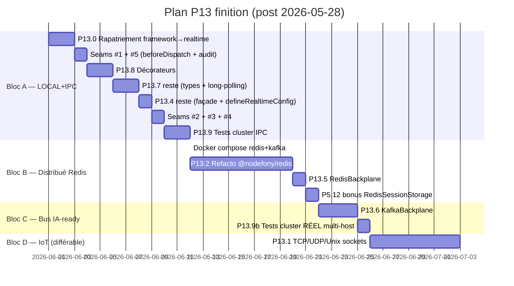

# État actuel & roadmap — où on en est, ce qui reste

> Cette page est la **carte d'avancement honnête** : couche par couche, ce qui MARCHE
> aujourd'hui, ce qui MANQUE, et **dans quel ordre** on va finir. Tu repartiras avec une
> vision claire de ce que tu peux faire dès maintenant dans une autre app, et de ce qu'il
> faudra attendre.

## Décision swap P13 ↔ P6 (2026-05-28)

**Nouvel ordre chemin critique** : `P5 → P13 → P6 → P7 …` (au lieu de `P5 → P6 → P13`).

**Pourquoi** :

- Finir 1 seul domaine d'affilée (= la Socket Nodefony) avant d'attaquer P6.
- Le pattern security en plug est canonique (Symfony firewall, NestJS guards) — la couche
  transport (WS, RPC) est neutre, on greffe security par hooks → on peut faire dans cet ordre.
- Effort comparable : P13 finition ≈ 23 ses ; P6 ≈ 14 ses → permutation sans perte.
- Décision infra : **Redis + Kafka tous les deux** seront installés (docker compose).

**Coût supplémentaire** : 5 seams sécurité (~1,2 ses) à coder DANS P13 pour que P6 se
branche en plug ensuite (sinon = refonte garantie). Détail des seams : [`../CLAUDE.md`](../CLAUDE.md).

## Carte d'avancement par couche

> Légende : ✅ livré, fonctionnel · 🔶 partiel · ⬜ à faire

### Étage 5 — Code applicatif (interface utilisateur)

| Composant                                                       | État     | Faisable dans une app tierce aujourd'hui ?             |
| --------------------------------------------------------------- | -------- | ------------------------------------------------------ |
| Client `RealtimeClient` (subscribe/on/publish/request)          | ✅ 100 % | OUI                                                    |
| Client `RealtimeClient.shared({url})` singleton par URL         | ✅ 100 % | OUI                                                    |
| Client `adaptiveChannel()` (AIMD opt-in)                        | ✅ 100 % | OUI                                                    |
| Hooks React `useNodefonyChannel` / `useNodefonyAdaptiveChannel` | ✅ 100 % | OUI                                                    |
| Server : étendre `RealtimeController` (sans décorateurs)        | 🔶 70 %  | OUI (mais syntaxe verbose, sans `@RealtimeController`) |
| Server : `@RealtimeController` / `@RealtimeEvent` décorateurs   | ⬜ P13.8 | NON (Bloc A étape 3)                                   |

### Étage 4 — Protocole (JsonRpcPeer)

| Composant                                                        | État           | Notes                                  |
| ---------------------------------------------------------------- | -------------- | -------------------------------------- |
| `JsonRpcPeer` + frames JSON-RPC 2.0                              | ✅ 80 %        | core, isomorphe                        |
| RPC bidirectionnel (`socket.request()` → Promise)                | ✅ 100 %       | `kernel:ping`, `kernel:gc` déjà câblés |
| Seam #1 `beforeDispatch(frame, peer)`                            | ⬜ P13.8a      | Bloc A étape 2 (avec décorateurs)      |
| Seam #5 `onFrameAudit(reason, frame)`                            | ⬜ P13.7a      | Bloc A étape 2                         |
| Types end-to-end `ServerToClientEvents` / `ClientToServerEvents` | ⬜ P13.7 reste | Bloc A étape 4                         |

### Étage 3 — Transport

| Composant                                                   | État           | Notes             |
| ----------------------------------------------------------- | -------------- | ----------------- |
| `WsConnectionTransport` (serveur, `ws` natif Node)          | ✅ 100 %       | livré             |
| `BrowserWsTransport` (client, `WebSocket` DOM)              | ✅ 100 %       | livré             |
| `HttpLongPollingTransport` (proxies hostiles)               | ⬜ P13.7 reste | Bloc A étape 4    |
| `TcpTransport` / `UdpTransport` / `UnixTransport` (IoT/IPC) | ⬜ P13.1       | Bloc D différable |
| Seam #4 `origin check` upgrade WS                           | ⬜ P13.4c      | Bloc A étape 6    |

### Étage 2 — Hub local serveur

| Composant                                              | État           | Notes                                                   |
| ------------------------------------------------------ | -------------- | ------------------------------------------------------- |
| `RealtimeHub` (broker fan-out)                         | ✅ 100 %       | actuellement dans `@nodefony/framework`, rapatrié P13.0 |
| Canaux PARTAGÉS (1 provider / canal / pod, ref-counté) | ✅ 100 %       | livré                                                   |
| Sonde `RealtimeHub.probe()` → canal `realtime:health`  | ✅ 100 %       | P13.11 livrée                                           |
| Endpoint admin `GET /nodefony/realtime/api/health`     | ✅ 100 %       | `RealtimeAdminApi`                                      |
| Façade `RealtimeService` consommateur serveur          | ⬜ P13.4 reste | Bloc A étape 5                                          |
| Builder `defineRealtimeConfig()` + Zod                 | ⬜ P13.4 reste | Bloc A étape 5                                          |
| Seam #2 `IRealtimeAuthenticator` sur handshake         | ⬜ P13.4a      | Bloc A étape 6                                          |
| Seam #3 Areas WS dans `defineSecurityConfig()`         | ⬜ P13.4b      | Bloc A étape 6                                          |

### Étage 1 — Backplane cross-pod

| Composant                                    | État        | Notes                                                                                                        |
| -------------------------------------------- | ----------- | ------------------------------------------------------------------------------------------------------------ |
| Contrat `IBackplane`                         | ✅ 100 %    | livré                                                                                                        |
| `LoopbackBackplane` (mono-process)           | ✅ 100 %    | livré                                                                                                        |
| `ClusterBackplane` (Node cluster IPC)        | ✅ 100 %    | livré, démo via `nodefony cluster -w N`                                                                      |
| `RedisBackplane` (multi-host pub/sub)        | ⬜ P13.5    | Bloc B (~1 ses grâce au contrat)                                                                             |
| `KafkaBackplane` (persistence at-least-once) | ⬜ P13.6    | Bloc C (3 ses)                                                                                               |
| Driver custom (NATS / Pulsar / RabbitMQ / …) | ✅ possible | l'utilisateur écrit son `implements IBackplane`, branche via `defineRealtimeConfig({ backplane: instance })` |

## Plan d'exécution — 4 blocs

### Bloc A — LOCAL+IPC complet (~9,2 ses ≈ 1,5 semaine, sans infra)

Livrable : « Socket LOCAL+IPC finie », rapatriée dans son module, security-ready (5 seams en
place), documentée, testable cluster sans infra externe.

| Étape | Tâche                                                                                          |  Effort |
| ----: | ---------------------------------------------------------------------------------------------- | ------: |
|     1 | **P13.0** Rapatriement framework→`@nodefony/realtime` (8 fichiers `src/` + 3 tests via git mv) | 1,5 ses |
|     2 | **Seams #1 + #5** (`beforeDispatch` + `onFrameAudit` dans `JsonRpcPeer`)                       | 0,5 ses |
|     3 | **P13.8** décorateurs `@RealtimeController` + `@RealtimeEvent`                                 |   2 ses |
|     4 | **P13.7 reste** : types `ServerToClientEvents`/`ClientToServerEvents` + long-polling           | 1,5 ses |
|     5 | **P13.4 reste** : façade `RealtimeService` + `defineRealtimeConfig()` builder + Zod            |   1 ses |
|     6 | **Seams #2 + #3 + #4** (`IRealtimeAuthenticator` + areas WS + origin check)                    | 0,7 ses |
|     7 | **P13.9** tests cluster IPC (2+ workers via `ClusterBackplane` existant)                       |   2 ses |

### Bloc B — Distribué Redis (~9,8 ses ≈ 1,5 semaine, infra requise)

Livrable : « Socket distribuée Redis » prête prod multi-host.

| Étape | Tâche                                                                    |              Effort |
| ----: | ------------------------------------------------------------------------ | ------------------: |
|     8 | **Docker compose** redis + kafka + zookeeper (setup unique)              |             0,3 ses |
|     9 | **P13.2** refacto `@nodefony/redis` (cluster + pub/sub + storage propre) |               8 ses |
|    10 | **P13.5** `RedisBackplane` driver (derrière `IBackplane` existant)       | **1 ses** ⚠️ réduit |
|    11 | 🎁 **P5.12 bonus** : `RedisSessionStorage` (débloqué par P13.2)          |             0,5 ses |

> [!TIP]
> **P13.5 réduit de 2 ses → 1 ses** parce que le contrat `IBackplane` est déjà livré et
> les patterns (`LoopbackBackplane`, `ClusterBackplane`) sont déjà testés. Il ne reste qu'à
> écrire le driver Redis derrière le contrat.

### Bloc C — Bus events IA-ready (~4 ses ≈ 0,5 semaine)

Livrable : bus events agents IA-ready (P12 prêt à consommer pour la mémoire long-terme et le
rejouage de décisions).

| Étape | Tâche                                                                | Effort |
| ----: | -------------------------------------------------------------------- | -----: |
|    12 | **P13.6** `KafkaBackplane` driver (persistence, at-least-once)       |  3 ses |
|    13 | **P13.9b** tests cluster RÉEL multi-host (2 nodes Redis + bus Kafka) |  1 ses |

### Bloc D — IoT / IPC (optionnel, ~7 ses, différable)

| Étape | Tâche                                                                           | Effort |
| ----: | ------------------------------------------------------------------------------- | -----: |
|    14 | **P13.1** `@nodefony/realtime` TCP/UDP/Unix sockets (`nodefony/src/protocols/`) |  7 ses |

> [!NOTE]
> Différable derrière P12 si on veut accélérer le livrable « Socket Nodefony » web/cluster.
> Cible niche (IoT, IPC, protocoles métier custom).

## Totaux

| Bloc                  |   Effort |   Cumul |
| --------------------- | -------: | ------: |
| A — LOCAL+IPC complet | ~9,2 ses | 9,2 ses |
| B — Distribué Redis   | ~9,8 ses |  19 ses |
| C — Bus IA-ready      |   ~4 ses |  23 ses |
| D — IoT (différable)  |   ~7 ses |  30 ses |

**Bloc A+B+C = ~23 ses ≈ 70 h ≈ ~11 jours productifs** = la Socket Nodefony vraiment finie.

## Ce qui change quand chaque bloc se livre

### Après Bloc A — tu peux

- Coder des controllers WS avec décorateurs propres (`@RealtimeController`/`@RealtimeEvent`).
- Configurer le hub via `defineRealtimeConfig({ backplane, hub, probe })`.
- Tester ton cluster IPC sur ta machine sans Redis (`nodefony cluster -w 4`).
- Préparer la sécu (les 5 seams sont en place pour que P6 se branche en plug).

### Après Bloc B — tu peux

- Déployer en prod multi-host k8s avec Redis comme backplane.
- Utiliser `RedisSessionStorage` (bonus P5.12).
- Faire du fan-out cross-host instantané (~1-3 ms).

### Après Bloc C — tu peux

- Construire un bus events agents IA avec persistence et rejouage.
- Audit log durable des frames realtime (couplé avec P6.14 audit).
- Cas d'usage massif (IoT M2M, banking).

### Après Bloc D — tu peux

- Exposer des protocoles TCP/UDP/Unix sockets (IoT, supervision SNMP, protocoles métier).
- Réutiliser TOUTE l'archi realtime (sondes, AIMD, sécurité, backplane) pour des transports
  non-WS.

## Liens

- [`index.md`](./index.md) — Vue d'ensemble + promesse DX
- [`vocabulaire.md`](./vocabulaire.md) — Les 12 mots
- [`architecture.md`](./architecture.md) — Pile 5 étages + flot d'une frame
- [`configuration.md`](./configuration.md) — Config Loopback / IPC / Redis / Kafka
- [`cookbook-chat.md`](./cookbook-chat.md) — Exemple end-to-end
- [`../CLAUDE.md`](../CLAUDE.md) — Décisions techniques figées + 5 seams sécurité
- Mémoire IA `project_p13_realtime_finish_plan` — plan complet
