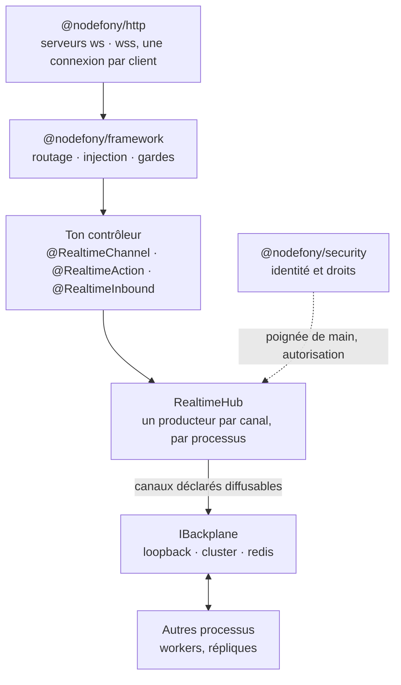

# @nodefony/realtime — la socket Nodefony

> Une seule connexion WebSocket, et **N canaux logiques** qui circulent dessus dans les deux sens.
> Ce module apporte le broker qui distribue ces canaux à l'intérieur d'un processus, et le
> **backplane** qui prolonge la distribution entre processus quand l'application passe à plusieurs
> répliques. Le contrôleur temps réel reste un contrôleur Nodefony ordinaire : même routage, même
> injection, mêmes gardes que côté web — c'est là que se joue le différenciateur du framework.

📍 [Documentation](../../../../../docs/index.md) › **@nodefony/realtime**

## 🧭 Par où commencer

Trois parcours selon ce que tu viens faire. L'ordre compte : chaque étape suppose la précédente.

**Je découvre le temps réel Nodefony** — comprendre le modèle avant d'écrire quoi que ce soit.

1. [Vocabulaire](./vocabulaire.md) — socket, hub, canal, frame, backplane. **Commence ici** : les
   pages suivantes emploient ces mots sans les redéfinir, et la moitié des malentendus vient de là.
2. [Ce que le module apporte](#-ce-que-le-module-apporte) — pourquoi une couche de plus au-dessus de
   la WebSocket, et ce qu'elle t'évite d'écrire.
3. [Architecture](./architecture.md) — le trajet complet d'une frame, du câble jusqu'à ta méthode.
4. [Cookbook — un chat](./cookbook-chat.md) — l'exemple intégrateur, de bout en bout.

**Je passe d'un processus à plusieurs** — le moment où le temps réel casse sans prévenir. En
mono-processus tout marchait ; à deux répliques, un message publié sur l'une n'atteint jamais un
abonné connecté à l'autre.

1. [Configuration](./configuration.md) — choisir le driver de backplane, et le déclarer. C'est la
   seule chose qui change entre développement et production.
2. [Architecture](./architecture.md) — ce que le backplane transporte réellement, et ce qu'il ne
   transporte pas : un canal ne franchit les processus que si tu l'as **déclaré diffusable**.
3. [Observabilité](./observabilite.md) — vérifier que le backplane est bien celui que tu crois :
   la sonde annonce le driver **effectif**, pas celui que tu as écrit dans la configuration.
4. [`@nodefony/redis`](../../redis/docs/index.md) — le module qui fournit les connexions pub/sub
   consommées par le driver `redis`.

**Je sécurise une socket ouverte sur Internet** — la passe qu'on regrette de ne pas avoir faite.

1. [Sécurité](./securite.md) — qui se connecte, ce qu'il a le droit d'écouter, ce qu'il peut pousser.
2. [Configuration](./configuration.md) — le contrôle d'`Origin` à la poignée de main et le plafond
   de canaux par connexion : deux réglages, deux classes d'abus fermées.
3. [`@nodefony/security`](../../security/docs/index.md) — le pare-feu applicatif, qui protège le
   temps réel avec **le même** modèle de zones que le web.

## 🗂️ Les pages du module

Le tableau pour choisir en cinq secondes ; les cards en dessous pour savoir ce qu'on y trouve.

| Page                                     | Ce qu'elle résout                                  | Tu en as besoin quand…                       |
| ---------------------------------------- | -------------------------------------------------- | -------------------------------------------- |
| [Vocabulaire](./vocabulaire.md)          | les mots du domaine, une bonne fois                | tu lis la doc, ou tu discutes archi          |
| [Architecture](./architecture.md)        | le trajet d'une frame, étage par étage             | tu veux comprendre plutôt que régler         |
| [Configuration](./configuration.md)      | drivers, cloisonnement, bornes, contrôle d'origine | tu déploies, ou tu changes de topologie      |
| [Sécurité](./securite.md)                | identité à la poignée de main, droits par canal    | ta socket est joignable depuis un navigateur |
| [Protocole](./protocole.md)              | la grammaire d'une frame, et les codes d'erreur    | tu débogues le fil, ou tu écris un client    |
| [Actions RPC](./actions.md)              | appeler le serveur et attendre une réponse         | tu veux savoir si l'appel a marché           |
| [Observabilité](./observabilite.md)      | la sonde, les canaux de santé, les écrans          | tu te demandes si ta socket va bien          |
| [Cookbook — un chat](./cookbook-chat.md) | l'exemple complet, client et serveur               | tu veux du code qui marche tout de suite     |

```nodefony-cards
[
  { "icon": "📖", "title": "vocabulaire", "href": "./vocabulaire.md",
    "desc": "Socket, hub, peer, canal, frame, fan-out, backplane, sonde : chaque terme part d'une analogie concrète, puis donne le symbole réel du code.",
    "meta": "à lire en premier — la plus courte, la plus rentable" },
  { "icon": "🏗️", "title": "architecture", "href": "./architecture.md",
    "desc": "La pile complète, du transport WebSocket jusqu'à la méthode de ton contrôleur — puis le chemin inverse quand le serveur publie.",
    "meta": "comprendre plutôt que régler" },
  { "icon": "⚙️", "title": "configuration", "href": "./configuration.md",
    "desc": "Le schéma du module, ses valeurs d'usine réelles, et surtout le choix du driver de backplane. Avec le cloisonnement par espace de nommage et les bornes anti-abus.",
    "meta": "avant la mise en production" },
  { "icon": "🛡️", "title": "securite", "href": "./securite.md",
    "desc": "Une WebSocket s'authentifie une fois, à l'ouverture, puis reste ouverte des heures : ce n'est pas le modèle du web, et ça change tout. Les points de greffe où @nodefony/security pose l'identité, autorise les canaux et journalise les refus.",
    "meta": "ta socket est joignable depuis un navigateur" },
  { "icon": "📜", "title": "protocole", "href": "./protocole.md",
    "desc": "La socket parle JSON-RPC 2.0, et une frame n'a que trois formes : une notification, une requête qui attend une réponse, une réponse. Grammaire champ par champ, méthodes nominales, et codes d'erreur réellement émis.",
    "meta": "déboguer le fil, ou écrire un client" },
  { "icon": "↔️", "title": "actions", "href": "./actions.md",
    "desc": "Publier ne dit jamais si le message est arrivé ; une action RPC, si. Le critère de choix entre les deux, l'abandon et le rejeu — et pourquoi un flux se diffuse sur un canal plutôt que de tenir dans une réponse.",
    "meta": "savoir si l'appel a marché" },
  { "icon": "📡", "title": "observabilite", "href": "./observabilite.md",
    "desc": "Ce que la sonde du hub expose, les canaux de santé et leur cadence, ce que Studio en montre — et comment écrire la sienne sans faire fuir la mémoire ni empêcher le processus de s'arrêter.",
    "meta": "tu te demandes si ta socket va bien" },
  { "icon": "🍳", "title": "cookbook-chat", "href": "./cookbook-chat.md",
    "desc": "Un salon de discussion complet : configuration, service métier, contrôleur, client navigateur, puis le passage en cluster.",
    "meta": "du code qui tourne, à déformer vers ton besoin" }
]
```

## 🧩 Ce que le module apporte

Quatre propriétés, toutes vérifiables dans le code — c'est ce qui justifie une couche au-dessus de la
WebSocket brute.

**Un contrôleur temps réel est un contrôleur.** `RealtimeController`
(`RealtimeController.ts:144`) étend le `Controller` du framework : il se déclare avec les mêmes
décorateurs de route, reçoit la même injection, passe par le même pare-feu. HTTP et WebSocket ne sont
pas deux applications à écrire deux fois, mais deux entrées du même pipeline.

**Une connexion, N canaux, dans les deux sens.** Le client s'abonne à autant de canaux qu'il veut sur
la même socket. Trois formes de trafic coexistent : le serveur diffuse (`@RealtimeChannel`,
`realtimeDecorators.ts:142`), le client appelle et attend une réponse (`@RealtimeAction`,
`realtimeDecorators.ts:30`), le client pousse sans attendre (`@RealtimeInbound`,
`realtimeDecorators.ts:30`). Rien n'est ouvert qui n'ait été déclaré.

**Le travail est fait une fois par processus, pas une fois par client.** Le `RealtimeHub`
(`RealtimeHub.ts:139`) tient **un seul producteur par canal** : le premier abonné le démarre, le
dernier départ l'arrête. Chaque connexion supplémentaire n'ajoute qu'une destination de diffusion.
Un salon suivi par mille personnes coûte un producteur, pas mille.

**Le backplane est un transport, jamais un magasin.** Il relaie les publications d'un processus vers
les autres, et rien de plus : aucun historique, aucune reprise. Les drivers vivent dans un registre
(`registerBackplaneDriver`, `backplaneRegistry.ts:55`) — `loopback` (un seul processus), `cluster`
(échanges entre workers d'un même pod), `redis` (entre machines) — et tu peux y inscrire le tien sans
toucher au cœur.

> [!IMPORTANT]
> **Rien ne franchit la frontière du processus sans intention explicite.** Par défaut, un canal reste
> local. Il faut le déclarer diffusable (`@RealtimeBroadcast`,
> `realtimeDecorators.ts:342`) pour qu'il emprunte le backplane. C'est volontaire : un canal
> d'observation qui décrit l'état d'**un** pod n'aurait aucun sens répliqué sur les autres.

Le module se déclare par ailleurs **non critique** (`Realtime.critical`, `index.ts:144`) et son
démarrage de backplane est borné dans le temps : un Redis injoignable n'empêche pas l'application de
monter, le hub reste local, et la dégradation est annoncée dans les journaux plutôt que subie.

## 🚀 Démarrage rapide

Vu depuis une application créée par `nodefony create app`. Un salon de discussion minimal, en trois
fichiers.

### 1. Déclarer le module

```ts
// nodefony.config.ts — l'orchestrateur de l'application
export default defineConfig(() => ({
  modules: [
    "@nodefony/http",
    "@nodefony/framework",
    use("@nodefony/realtime", {
      // Un seul processus en développement : le hub distribue localement,
      // aucun transport réseau n'est ouvert. Passer à "redis" en production.
      backplane: { driver: "loopback" },
      // Défense CSRF à la poignée de main (RFC 6455 §10.2) : sans elle, un site
      // tiers peut ouvrir une socket avec les cookies de ton utilisateur.
      csrf: {
        checkOrigin: {
          enabled: true,
          allowList: ["https://127.0.0.1:5152"],
        },
      },
    }),
  ],
}));
```

### 2. Écrire le contrôleur temps réel

Un contrôleur ordinaire : une route qui déclare le transport `WEBSOCKET`, puis des méthodes décorées.
La classe de base porte tout le protocole — poignée de main, abonnements, nettoyage à la fermeture.

```ts
// nodefony/controllers/chat.ts
import { route, controller } from "@nodefony/framework";
import {
  RealtimeController,
  RealtimeChannel,
  RealtimeBroadcast,
} from "@nodefony/realtime";
import type { RealtimePublish } from "@nodefony/realtime";
import type { RpcActionHandler } from "nodefony";
import type { ContextType } from "@nodefony/http";

// Déclare le préfixe diffusable dès le chargement de la classe : sans lui, le
// canal resterait confiné à ce processus, même en cluster.
@RealtimeBroadcast("chat:")
@controller("/chat")
class ChatController extends RealtimeController {
  constructor(context: ContextType) {
    super("chat", context);
  }

  // La socket du salon. Une seule route, un seul port : le WebSocket se greffe
  // sur le serveur HTTP existant.
  @route("chat-realtime", {
    path: "/realtime",
    requirements: { methods: ["WEBSOCKET"] },
  })
  async realtime(message: string | Buffer | null): Promise<void> {
    this.handleRealtime(message);
  }

  // Appel client → réponse serveur, comme un appel de fonction distante.
  protected override realtimeActions(): Record<string, RpcActionHandler> {
    return { "chat:ping": () => ({ pong: true, ts: Date.now() }) };
  }

  // Producteur du canal : démarré au premier abonné, arrêté au dernier départ.
  // Le retour EST la fonction d'arrêt — c'est ce qui garantit zéro fuite.
  @RealtimeChannel("chat:room-42")
  room42(channel: string, publish: RealtimePublish): () => void {
    const timer = setInterval(() => publish(channel, { ts: Date.now() }), 1000);
    timer.unref();
    return () => clearInterval(timer);
  }
}

export default ChatController;
```

### 3. S'y brancher depuis le navigateur

Le client est isomorphe : c'est le cœur `nodefony` lui-même, importable côté navigateur.

```ts
import { RealtimeClient } from "nodefony/client";

// `shared` réutilise la connexion existante pour une même URL : dix composants
// qui écoutent dix canaux ouvrent UNE socket, pas dix.
const socket = RealtimeClient.shared({
  url: "wss://127.0.0.1:5152/chat/realtime",
});

// S'abonner AVANT de connecter est sûr : les abonnements sont rejoués à
// l'ouverture, et après chaque reconnexion.
socket.on("chat:room-42", (message: unknown) => {
  console.log("reçu", message);
});

await socket.connect();
socket.subscribe("chat:room-42");

// Appel aller-retour sur la même connexion, sans requête HTTP.
const pong = await socket.request("chat:ping", {});
console.log(pong);
```

> [!TIP]
> En React, ne câble pas le client à la main : les hooks du subpath `nodefony/react`
> (`useNodefony`, `useNodefonyChannel`, `useNodefonyIdentity`) gèrent l'abonnement, le
> désabonnement au démontage et le comptage de références.

## 🏛️ Place dans le framework



Le module s'appuie sur `@nodefony/http` pour le transport et sur `@nodefony/framework` pour le
routage ; il n'impose aucune base de données. Le driver `redis` consomme les connexions publiées par
[`@nodefony/redis`](../../redis/docs/index.md), sans en dépendre : si le module est absent, le hub
reste local et le dit.

## 🧰 Surface publique

Côté serveur : `RealtimeController` (la classe à étendre), les décorateurs `RealtimeChannel`,
`RealtimeAction` et `RealtimeInbound`, le service `RealtimeService` (`RealtimeService.ts:48`) pour
publier depuis n'importe quel service injecté, le `RealtimeHub` et sa sonde, les trois backplanes
natifs, et le registre de drivers pour brancher le tien.

Côté client : `RealtimeClient` via le subpath `nodefony/client`, et les hooks React via
`nodefony/react`.

Les signatures exactes vivent dans le graphe généré — `jq '.symbols.RealtimeHub' .ai/symbols.json` —
jamais recopiées ici : elles divergeraient en silence.

## ⚙️ Configuration

Un seul point d'entrée : `use("@nodefony/realtime", { … })` dans `nodefony.config.ts`, validé au boot
contre le schéma du module (`realtimeConfigSchema`, `config.ts:168`). Cinq blocs :

- `backplane` — le driver de fan-out et son espace de nommage. Ce cloisonnement devient
  indispensable dès que **deux déploiements partagent le même Redis** : sans lui, leurs publications
  se mélangent.
- `csrf.checkOrigin` — le contrôle d'origine à l'ouverture de la socket.
- `limits` — le plafond de canaux par connexion, garde anti-saturation mémoire.
- `slowConsumer` — le seuil à partir duquel un client trop lent est signalé par la sonde.
- `cluster.probe` — la sonde agrégée du pod, en mode multi-workers.

Chaque bloc, ses valeurs d'usine et les situations qui justifient d'en changer sont détaillés dans
[Configuration](./configuration.md).

## 📡 Observabilité — Studio

Deux écrans dédiés : la **console temps réel** (`/nodefony/hub`) montre les canaux vivants, leurs
abonnés, le volume diffusé et les connexions en retard ; **Cluster** (`/nodefony/cluster`) agrège la
vue de tous les workers d'un pod.

Le data plane admin expose `/nodefony/realtime/api/health` — canaux et abonnés, compteurs de
diffusion, connexions, octets et frames, pression d'écriture. C'est la même donnée que celle rendue à
l'écran, servie par la sonde du hub (`RealtimeHub.probe()`, `RealtimeHub.ts:142`).

## 🧪 Tests & couverture

Les compteurs sont régénérés depuis vitest, jamais figés dans cette prose. Ce qui mérite d'être dit
ici, c'est **ce que les suites prouvent** — et ce qu'elles ne prouvent qu'à condition d'avoir
l'infrastructure sous la main.

| Type            | Où                              | Ce qui est prouvé                                                 |
| --------------- | ------------------------------- | ----------------------------------------------------------------- |
| Unitaire        | `nodefony/tests/unit/**`        | hub, registre de drivers, schéma de configuration, décorateurs    |
| Intégration     | `nodefony/tests/integration/**` | socket réelle : abonnements, chemins de contrôleur, autorisation  |
| Multi-processus | `clusterIpc.e2e.test.ts`        | fan-out entre workers, sans aucune infrastructure externe         |
| Cross-machine   | `redisCluster.e2e.test.ts`      | fan-out entre pods via pub/sub Redis                              |
| Tests d'attaque | `*.attack.test.ts`              | plafond de canaux, révocation d'identité, politique non appliquée |

> [!WARNING]
> **Une suite verte ne prouve rien sur le fan-out cross-machine.** Le banc Redis est doublement
> conditionnel : il ne s'exécute que si tu le demandes (`RUN_CLUSTER_E2E=1`), et il se **saute** de
> lui-même si aucun Redis n'est joignable. Or un test sauté compte comme un succès — on peut donc
> lire « tout est vert » sur une suite qui n'a jamais ouvert une seule connexion. Le fan-out entre
> workers d'un même pod, lui, ne demande aucune infrastructure et tourne toujours.
>
> ```bash
> # Le seul run qui prouve réellement le fan-out entre machines.
> RUN_CLUSTER_E2E=1 REDIS_PASSWORD=nodefony-dev npm test
> ```

## 🔗 Pour aller plus loin

- ⬆️ **Remonter** : [Toute la documentation](../../../../../docs/index.md)
- 📄 **Les pages du module** : [Vocabulaire](./vocabulaire.md) · [Architecture](./architecture.md) ·
  [Protocole](./protocole.md) · [Actions RPC](./actions.md) · [Configuration](./configuration.md) ·
  [Sécurité](./securite.md) · [Observabilité](./observabilite.md) ·
  [Cookbook — un chat](./cookbook-chat.md)
- 🧭 **Modules voisins** : [`@nodefony/http`](../../http/docs/index.md) (la connexion et son
  contexte) · [`@nodefony/framework`](../../framework/docs/index.md) (routage et décorateurs) ·
  [`@nodefony/security`](../../security/docs/index.md) (identité et droits) ·
  [`@nodefony/redis`](../../redis/docs/index.md) (le transport cross-machine)
- 🏛️ **Transverse** : [vue d'ensemble du framework](../../../../../docs/architecture/vue-ensemble.md) ·
  [le pipeline d'une requête](../../../../../docs/architecture/pipeline-requete.md)
- 📖 [Lexique général](../../../../../docs/lexique.md) du framework.
</content>

</invoke>
