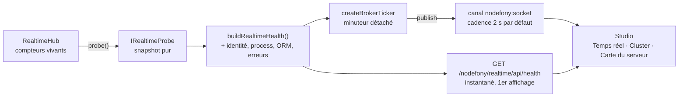

# Observabilité de la socket — la sonde, les canaux de santé, les écrans

> Comment savoir que ta socket va bien. La socket Nodefony s'observe **à travers elle-même** : le hub
> tient ses propres constantes vitales, les sert en HTTP pour le premier affichage, et les rediffuse
> sur un canal temps réel — sur la socket qu'elles décrivent. Cette page dit ce que la sonde expose
> exactement, à quelle cadence, ce que Studio en montre, et comment publier ta propre sonde métier
> sans faire fuir la mémoire ni empêcher l'arrêt du processus.

📍 [Documentation](../../../../../docs/index.md) › [@nodefony/realtime](index.md) › **Observabilité**

```nodefony-livegraph
{
  "graph": "sondes",
  "height": 480,
  "title": "La sonde, en direct",
  "hint": "Sonde, agrégat, endpoint, minuteur, canal, écran. Le compteur de sondes vivantes est réel."
}
```

## Schéma général

Le patron tient en cinq pièces. Un **producteur** de mesures, un **agrégateur**, puis deux chemins de
lecture — un instantané et un flux — qui aboutissent au même écran.



Le détail qui rend le schéma vrai : le canal `nodefony:socket` **circule sur la socket elle-même**.
La mesure emprunte le transport qu'elle mesure — c'est ce qui rend l'observation gratuite en
infrastructure, et c'est aussi ce dont il faut se méfier quand le transport souffre.

## 📖 Lexique

| Terme                 | Développé                     | En une ligne                                                                                        |
| --------------------- | ----------------------------- | --------------------------------------------------------------------------------------------------- |
| **Sonde** (_probe_)   | —                             | Un thermomètre branché sur un sous-système : il **lit** des compteurs, il n'en produit aucun.       |
| **Snapshot**          | instantané                    | Une photo des compteurs à un instant `ts`. Deux photos donnent un débit.                            |
| **Compteur monotone** | —                             | Un cumul qui ne redescend jamais depuis le démarrage. Le lecteur dérive le débit, le serveur non.   |
| **Fan-out**           | diffusion en éventail         | Une publication livrée à N abonnés. `fanoutTotal / publishTotal` = taille moyenne d'un salon.       |
| **Back-pressure**     | contre-pression               | La file d'envoi d'un client qui n'absorbe pas le flux. Le risque mémoire numéro un.                 |
| **`bufferedAmount`**  | —                             | Octets déjà remis à la socket mais **pas encore partis** sur le réseau. Le signal de la souffrance. |
| **Slow consumer**     | consommateur lent             | Une connexion dont le `bufferedAmount` dépasse le seuil d'alerte.                                   |
| **ELU**               | _Event Loop Utilization_      | Fraction du temps où la boucle d'événements est active. ~1,0 = processeur saturé.                   |
| **Cadence**           | granularité                   | L'intervalle de publication d'un canal d'état, inscrit dans son **nom** (`base:<ms>`).              |
| **Per-instance**      | par instance                  | Mesuré sur **ce** processus. En cluster, ce n'est pas la vérité du pod.                             |
| **Pod**               | —                             | L'unité déployée : un maître et ses workers, vus comme un seul serveur.                             |
| **Drill-down**        | forage                        | Demander à un worker précis d'enrichir sa remontée, le temps qu'on le regarde.                      |
| **IPC**               | _Inter-Process Communication_ | Le canal de messages entre le maître d'un cluster et ses workers.                                   |

## Qu'est-ce qu'observer une socket ?

Un serveur HTTP se surveille facilement : chaque requête a un début, une fin, un code. Une socket,
non — **elle n'a qu'un début**. Une connexion ouverte pendant six heures ne produit aucune ligne de
journal, et pourtant elle consomme, elle accumule, et parfois elle se dégrade.

L'analogie utile est celle d'un **standard téléphonique**. Ce qui compte n'est pas le nombre d'appels
passés, c'est : combien de lignes sont décrochées, combien de personnes écoutent chaque conférence, et
surtout **si l'une d'elles n'arrive plus à suivre**. Ce dernier point est le seul vrai danger.

**Le risque numéro un d'une socket n'est pas le processeur, c'est la mémoire.** Quand un client
n'absorbe pas ce qu'on lui envoie, les messages s'empilent dans une file d'envoi côté serveur. Cette
file n'a pas de borne naturelle : elle grossit jusqu'à ce que le client réagisse — ou jusqu'à ce que le
processus tombe. Et le multiplexage **concentre** ce risque : une seule connexion lente retient
l'ensemble des canaux qu'elle a demandés.

C'est pour cela que la sonde de la socket ne ressemble à aucune autre. Elle ne mesure pas d'abord un
temps de réponse — elle mesure **ce qui n'est pas encore parti**.

## La vision Nodefony — la socket s'observe à travers elle-même

Trois partis pris, tous lisibles dans le code.

**1. La sonde est une lecture pure, jamais un collecteur.** `RealtimeHub.probe()`
(`RealtimeHub.ts:142`) ne fait qu'additionner des primitives déjà tenues à jour par le chemin chaud.
Aucune entrée-sortie, aucune exception possible, aucun état de lecture conservé. Appeler la sonde
mille fois par seconde ne changerait rien à ce que le hub fait par ailleurs.

**2. Les cumuls sont monotones, le débit se dérive côté lecteur.** Le serveur ne calcule aucune
moyenne mobile, ne garde aucune fenêtre glissante. Il expose `publishTotal`, `bytesSentTotal`, `ts` —
et le lecteur soustrait deux photos. Conséquence : **zéro état de lecture côté serveur**, donc zéro
divergence entre deux consommateurs, et un rafraîchissement qui se choisit librement.

**3. La mesure voyage sur la socket qu'elle décrit.** Le même producteur alimente l'endpoint HTTP
(premier affichage, sans attendre un tick) et le canal temps réel (le suivi). Un seul code, deux
portes — `buildRealtimeHealth()` (`RealtimeAdminApi.ts:74`).

Le compromis assumé : cette sonde est **per-instance par nature**. Un pod à quatre workers rend quatre
vérités partielles. Nodefony ne les moyenne pas au hasard de la requête — il pousse une vue agrégée
explicite (voir plus bas), et le mode cluster reste **désactivable en bloc**.

## 🚀 Démarrage rapide

**Le besoin vécu** : ta boutique publie des commandes, et tu veux voir en direct — dans Studio, sans
écrire une ligne de frontend — combien de commandes passent et combien échouent. Tu ne veux ni agent
externe, ni base de séries temporelles, ni redémarrage.

Le principe : ton service tient déjà des compteurs ; la sonde ne fait que les **lire** et les
publier sur un canal.

### Le contrôleur — fichier créé

```ts
// modules/shop/nodefony/controllers/ShopProbeController.ts
import { controller, route } from "@nodefony/framework";
import { RealtimeController, RealtimeChannel } from "@nodefony/realtime";
import type { RealtimePublish } from "@nodefony/realtime";
import type { ContextType } from "@nodefony/http";

/** Les constantes vitales de la boutique : des primitives, rien d'autre. */
export interface ShopHealth {
  ts: number;
  ordersTotal: number;
  failuresTotal: number;
  pendingNow: number;
}

/**
 * Compteurs tenus par le MÉTIER (incrémentés là où les commandes se traitent).
 * La sonde les lit ; elle ne les produit pas, et surtout elle ne les mute pas.
 */
export const shopCounters = {
  ordersTotal: 0,
  failuresTotal: 0,
  pendingNow: 0,
};

/** Le nom du canal : une constante, citée côté serveur ET côté client. */
export const SHOP_HEALTH = "shop:health";

@controller("/shop")
class ShopProbeController extends RealtimeController {
  constructor(context: ContextType) {
    super("shop", context);
  }

  /** La porte WebSocket. Tout le protocole est porté par la classe de base. */
  @route("shop-realtime", {
    path: "/realtime",
    requirements: { methods: ["WEBSOCKET"] },
  })
  async realtime(message: string | Buffer | null): Promise<void> {
    this.handleRealtime(message);
  }

  /**
   * LE CANAL DE SANTÉ. Le hub appelle cette méthode au PREMIER abonné et attend
   * en retour la fonction de nettoyage, qu'il appellera au DERNIER désabonné.
   *
   * Trois règles tiennent dans ces dix lignes :
   *  - `unref()` : le minuteur ne retient pas l'arrêt du processus ;
   *  - le nettoyage annule TOUT ce que le provider a démarré ;
   *  - le tick ne fait que LIRE des primitives — aucune collecte, aucun parcours.
   */
  @RealtimeChannel(SHOP_HEALTH)
  shopHealth(channel: string, publish: RealtimePublish): () => void {
    const timer = setInterval(() => {
      const payload: ShopHealth = {
        ts: Date.now(),
        ordersTotal: shopCounters.ordersTotal,
        failuresTotal: shopCounters.failuresTotal,
        pendingNow: shopCounters.pendingNow,
      };
      publish(channel, payload);
    }, 2000);
    timer.unref();
    return () => clearInterval(timer);
  }
}

export default ShopProbeController;
```

### La configuration — fichier modifié

```ts
// nodefony.config.ts — le manifeste des modules (extrait)
import { defineConfig, use } from "nodefony";

export default defineConfig(() => ({
  modules: [
    use("@nodefony/http", {}),
    "@nodefony/framework",
    // La socket. `loopback` = un seul processus, aucune infrastructure externe.
    use("@nodefony/realtime", { backplane: { driver: "loopback" } }),
    "@mon-shop/shop",
  ],
}));
```

### Ce qu'on observe

```bash
# La santé de la socket elle-même — un instantané, sans WebSocket.
curl -k https://127.0.0.1:5152/nodefony/realtime/api/health
```

Tant que personne n'est abonné à `shop:health`, il **n'apparaît pas** dans `channels[]` et **aucun
minuteur ne tourne** : un canal sans abonné n'existe pas. Dès qu'un client s'abonne, une ligne
apparaît, `subscribers` passe à 1, `messages` grimpe de 1 toutes les deux secondes, et
`fanoutTotal` suit le nombre de livraisons réelles.

Côté navigateur, deux lignes suffisent à consommer le canal :

```ts
// frontend/src/shopHealth.ts
import { RealtimeClient } from "nodefony/client";

const scheme = window.location.protocol === "https:" ? "wss" : "ws";
const socket = new RealtimeClient({
  url: `${scheme}://${window.location.host}/shop/realtime`,
});

socket.on("shop:health", (payload: unknown) => {
  console.log("santé boutique", payload);
});
socket.subscribe("shop:health");
```

> [!TIP]
> Ferme l'onglet, et le minuteur s'arrête côté serveur. C'est la propriété la plus utile du patron :
> **on paie ce qu'on regarde**. Un tableau de bord fermé ne coûte rien.

## 🧰 Ce que la sonde expose, champ par champ

Le contrat est `IRealtimeProbe` (`IRealtimeProbe.ts:61`). Quatre familles, un discriminant.

### Canaux — qui vit, qui écoute

| Champ                    | Ce qu'il dit                                                                                             |
| ------------------------ | -------------------------------------------------------------------------------------------------------- |
| `channels[]`             | Une entrée par canal **actif** (au moins un abonné), cf `IRealtimeChannelStat` (`IRealtimeProbe.ts:47`). |
| `channels[].channel`     | Le nom exact souscrit, **suffixe de cadence compris** (`nodefony:orm:health:2000`).                      |
| `channels[].subscribers` | Abonnés locaux vivants. Instantané, pas un cumul.                                                        |
| `channels[].messages`    | Publications cumulées sur ce canal.                                                                      |
| `channelCount`           | Nombre de canaux actifs sur ce processus.                                                                |

### Fan-out — l'amplification réelle du broker

| Champ                  | Ce qu'il dit                                                                                                       |
| ---------------------- | ------------------------------------------------------------------------------------------------------------------ |
| `publishTotal`         | Appels à `publish`. **Ce que le serveur a voulu envoyer.**                                                         |
| `fanoutTotal`          | Livraisons effectives (`publish` × abonnés). **Ce que ça a réellement coûté.**                                     |
| `inboundTotal`         | Frames poussées par les clients sur les canaux entrants, via `RealtimeHub.recordInbound()` (`RealtimeHub.ts:529`). |
| `ingressRejectedTotal` | Messages venus du **backplane** et jetés parce que leur canal n'est pas déclaré diffusable.                        |

Le rapport `fanoutTotal / publishTotal` est la mesure la plus parlante de la page : c'est la **taille
moyenne d'un salon**. S'il vaut 1, chaque publication ne touche qu'une personne — un canal par client,
autrement dit le fan-out ne sert à rien. S'il vaut 400, une publication coûte 400 sérialisations.

> [!IMPORTANT]
> **Un processus qui ne fait que publier paraît inactif.** `publishTotal` et `fanoutTotal` ne
> s'incrémentent que si le canal a un abonné **local** : un pod qui publie vers ses pairs, sans
> personne d'abonné chez lui — un travail planifié, un webhook entrant — affiche des compteurs à zéro
> alors qu'il pousse en continu. Pour juger de son activité, lire l'autre bout de la chaîne : les
> compteurs du pod qui **reçoit**.

### Messages du bus refusés — le signal qui ne devrait jamais bouger

`ingressRejectedTotal` compte les messages arrivés **par le bus** et refusés à l'entrée : leur canal
n'est pas déclaré diffusable, donc il n'a rien à faire en circulation entre processus. Les canaux
internes — journaux, audit, santé — sont dans ce cas par construction.

En fonctionnement normal il vaut **zéro** : un pair légitime n'émet que des canaux diffusables. Deux
lectures possibles quand il grimpe :

- **bénigne** — une autre application partage la même cloison de transport, et ses canaux sont
  refusés ; chacun chez soi, mais le namespace mérite d'être séparé ;
- **sérieuse** — quelqu'un écrit sur votre bus. Une infrastructure de diffusion n'authentifie pas
  l'émetteur : c'est le rôle du sceau (cf [Sécurité](./securite.md)).

Le canal visé n'est délibérément pas exposé : un compteur d'observabilité ne doit pas devenir un
moyen de sonder ce que le système accepte.

⚠️ Ce compteur ne voit pas tout : un message **mal scellé** est écarté par le transport, avant
d'atteindre le hub, donc sans être compté ici. Un bus scellé peut ainsi rester à zéro alors qu'il est
attaqué — le signe est alors l'absence de trafic légitime, pas ce compteur.

### Connexions et volume

`connectionCount`, `bytesSentTotal`, `messagesSentTotal` — vivants pour la première, cumulés pour les
deux autres. Le débit en octets par seconde se dérive de deux photos.

### Back-pressure — le risque numéro un

| Champ                              | Ce qu'il dit                                                                        |
| ---------------------------------- | ----------------------------------------------------------------------------------- |
| `backpressure.maxBufferedAmount`   | La **pire** file d'envoi de l'instant. C'est l'indicateur d'alerte, pas la moyenne. |
| `backpressure.totalBufferedAmount` | Somme des octets en attente sur tout le processus.                                  |
| `backpressure.slowConsumers`       | Connexions au-dessus du seuil de comptage.                                          |
| `backpressure.drops`               | Cumul des frames **jetées** pour protéger la mémoire.                               |

La source par connexion est `IRealtimeConnProbe` (`IRealtimeProbe.ts:25`), implémentée par le
transport. Deux seuils, non configurables, distincts du seuil de comptage : à
`BACKPRESSURE_DROP_BYTES` (1 Mio, `WsConnectionTransport.ts:32`) la frame est **jetée** — les canaux
d'état sont « le dernier gagne », le prochain instantané la remplacera ; à `BACKPRESSURE_CLOSE_BYTES`
(8 Mio, `WsConnectionTransport.ts:33`) la connexion est **fermée** en `1013` (« réessaie plus tard »),
et le client se reconnecte puis resynchronise.

> [!IMPORTANT]
> `drops` qui croît n'est **pas** une panne : c'est la protection qui fonctionne. Ce qui serait une
> panne, c'est une file d'envoi non bornée multipliée par le nombre de clients.

### Fond de panier

`backplane` porte la carte d'identité du relais réellement branché — driver, nature, origine,
franchissement de machine. Jamais `undefined` en pratique : sans backplane, la sonde rend un
descripteur `local`. C'est le champ à lire quand le temps réel ne traverse pas les répliques.

Trois champs n'apparaissent que lorsqu'ils ont un sens :

- `channel` — le canal de transport **effectif**. Il répond à la seule question qu'on ne peut pas
  poser autrement : _suis-je branché sur le bus que je crois ?_ Le nom affiché est celui utilisé,
  pas celui écrit dans la configuration (la cloison peut venir de l'environnement).
- `sealed` — les messages sont-ils signés ? Renseigné par les transports **partagés**, où un tiers
  peut écrire. `false` y annonce un bus ouvert. Absent quand la question ne se pose pas : en
  mono-processus, ou entre un maître et ses propres workers, personne d'autre ne peut publier.
- `queue` — la **file d'envoi** vers le bus, présente sur les transports réseau (leurs publications
  sont acquittées plus tard). Publier n'attend pas : le message est confié au client réseau et le
  code continue. Si le bus ralentit, ces messages s'accumulent — sur une file **interne au client**,
  donc invisible. Quatre compteurs la rendent lisible : `bytes` (en attente d'accusé de réception),
  `maxBytes` (le plafond, `0` = aucun), `droppedTotal` (publications abandonnées faute de place) et
  `failedTotal` (publications refusées par le bus). `droppedTotal` est le seul de la sonde qui
  signale une perte **volontaire** : la mémoire du processus a été préservée au prix de messages non
  relayés aux autres répliques. Il doit rester à zéro ; s'il bouge, regarder l'état du bus avant de
  relever le plafond (`backplane.maxQueueBytes`) — un plafond plus haut ne rattrape pas un bus en
  retard, il repousse l'échéance.

### La couche d'identité, au-dessus

`buildOwnHealth()` (`RealtimeAdminApi.ts:52`) enrichit ce snapshot pur pour produire
`IRealtimeHealth` (`IRealtimeProbe.ts:106`) : `instanceId`, la santé **process** du worker
(CPU, mémoire, boucle d'événements), et — si elles ont été branchées — la santé ORM et les compteurs
d'erreurs du journal. Ces trois derniers champs sont **additifs et optionnels** : un consommateur qui
ne les connaît pas les ignore.

## 🔌 Deux chemins de lecture — l'instantané et le flux

Un seul producteur, deux portes. C'est volontaire : un tableau de bord qui n'aurait que le flux
resterait vide jusqu'au premier tick.

### L'instantané HTTP

`GET /nodefony/realtime/api/health`, monté par `createRealtimeAdminApi()` (`RealtimeAdminApi.ts:91`)
sous le namespace `realtime` du data plane admin. Sert le premier affichage, les sondes de liveness,
et tout script qui ne veut pas ouvrir une socket.

### Le canal temps réel

`nodefony:socket`. Le producteur est un minuteur qui rappelle **le même endpoint** à travers le
courtier admin (`StudioRealtimeController.createRealtimeChannel()`, `StudioRealtimeController.ts:182`,
via `createBrokerTicker()` (`providers.ts:465`)). Rien n'est dupliqué : le canal est un endpoint
rejoué.

### La cadence vit dans le nom du canal

Convention isomorphe, partagée par les deux bords : `base` nu = cadence par défaut du serveur ;
`base:<ms>` = cadence explicite. Le client fabrique le nom avec `rateChannel()` (`channelRate.ts:44`),
le serveur le résout et le **borne** avec `parseRate()` (`channelRate.ts:63`).

Conséquence voulue : **un canal = une cadence = un compteur de références**. `nodefony:socket:500` et
`nodefony:socket` sont deux minuteurs distincts, jamais réconciliés — et deux consommateurs qui
veulent tous deux le défaut partagent un seul minuteur, parce que la cadence par défaut ne produit
**aucun** suffixe.

### Les canaux de santé qui circulent sur la socket

Les bornes sont déclarées dans `RATE_BOUNDS` (`StudioRealtimeController.ts:59`), les noms dans
`CHANNELS` (`providers.ts:98`). Une cadence hors bornes est **ramenée dans l'intervalle**, jamais
refusée.

| Canal                  | Qui le produit                                                     | Cadence par défaut | Bornes        |
| ---------------------- | ------------------------------------------------------------------ | ------------------ | ------------- |
| `nodefony:socket`      | La sonde du hub, rejouée depuis l'endpoint admin `realtime`        | 2 s                | 500 ms – 60 s |
| `nodefony:supervision` | `createStatsTicker()` (`providers.ts:222`) — CPU, mémoire, GC, ELU | 1 s                | 250 ms – 60 s |
| `nodefony:debugbar`    | Le même producteur, canal séparé pour la barre de débogage         | 1 s                | 250 ms – 60 s |
| `nodefony:orm:health`  | Endpoint admin `orm/connection/health`, rejoué                     | 5 s                | 1 s – 60 s    |
| `nodefony:orm:flow`    | Endpoint admin `orm/flow` (débit de requêtes)                      | 2 s                | 500 ms – 60 s |
| `nodefony:syslog`      | `createSyslogBridge()` (`providers.ts:145`)                        | **événementiel**   | — (coalescé)  |

> [!WARNING]
> **`nodefony:dashboard` n'existe pas.** Le canal de supervision s'appelle `nodefony:supervision` ; ce
> nom n'apparaît plus que comme donnée de test. S'abonner à un canal inconnu ne lève **aucune
> erreur** — le provider rend `null` et rien n'arrive jamais. C'est le piège numéro un de la page.

`nodefony:syslog` est le seul de la liste à ne pas être cadencé : il **relaie** au lieu de sonder. Comme
un flot de journaux peut noyer un frontend, le pont accumule dans un tampon circulaire borné et n'émet
qu'une frame agrégée toutes les 200 ms, en comptant les entrées omises — le débit de la source est
découplé de celui de l'interface.

Deux autres formes existent, réservées au forage : `nodefony:supervision@<pid>` et `nodefony:orm:rich@<pid>`
ciblent **un worker précis**, et non le premier venu.

## 📡 Observabilité — Studio

Trois écrans consomment `nodefony:socket`, chacun avec une question différente.

- **Temps réel** (`/nodefony/hub`) — la console de la socket : canaux vivants et leurs abonnés,
  volume diffusé, connexions en retard. C'est l'écran du développeur qui se demande « mon canal
  est-il monté ? ».
- **Cluster** (`/nodefony/cluster`) — la vue pod : tous les workers, avec le détail par worker et le
  forage vers un `pid`. L'écran de l'exploitation.
- **Carte du serveur** (`/nodefony/twin`) — le jumeau vivant : la même sonde projetée sur le graphe
  d'architecture, chaque nœud coloré par son état.

Les trois sont des **abonnements comptés par référence** : monter la page active le minuteur côté
serveur, la démonter le coupe. Aucun d'eux ne tourne en tâche de fond.

La page module `/nodefony/modules/realtime` complète le tableau avec la **configuration effective**
après fusion et validation — la seule vue qui dit ce qui s'applique, plutôt que ce que tu as écrit.

## ⚙️ Configuration

| Clé                            | Défaut | Effet                                                                     |
| ------------------------------ | ------ | ------------------------------------------------------------------------- |
| `slowConsumer.bytes`           | 1 Mio  | Seuil de **comptage** de `slowConsumers` dans la sonde (`config.ts:121`). |
| `cluster.probe.enabled`        | `true` | Branche la sonde agrégée pod en worker de cluster (`config.ts:30`).       |
| `NODEFONY_CLUSTER_PROBE` (env) | —      | Mis à `0`, coupe la sonde pod quelle que soit la configuration.           |

> [!CAUTION]
> `slowConsumer.bytes` ne pilote **que la métrique**. Les seuils qui jettent une frame ou ferment une
> connexion sont des constantes du transport. Baisser cette clé rend le signalement plus précoce ; ça
> ne change rien au comportement de la socket.

Couper la sonde cluster est un **contournement total**, pas une mise en sourdine : sans elle, il n'y a
ni client, ni minuteur, ni écouteur, ni message IPC (`Realtime.wireClusterProbe()`, `index.ts:351`), et
l'endpoint retombe sur la vue per-instance. Aucun coût « au cas où ».

## 🏗️ En cluster — par pod ou par worker ?

**Le problème**, d'abord. En cluster, une requête de santé atterrit sur **un** worker au hasard. Son
instantané est exact — et ne dit rien des trois autres. Pire : deux appels consécutifs peuvent tomber
sur deux workers et sembler se contredire.

**La réponse de Nodefony est un modèle _push_.** Chaque worker remonte périodiquement sa santé au
maître via `ClusterProbeClient.start()` (`ClusterProbeClient.ts:170`) ; le maître fusionne et
rediffuse ; chaque worker met le résultat en cache. **N'importe lequel** sert alors la vue pod en temps
constant, sans latence de requête (`ClusterProbeClient.getClusterHealth()`, `ClusterProbeClient.ts:285`).

La fusion, `mergeClusterHealth()` (`ClusterProbeClient.ts:46`), est une fonction pure — et sa règle
mérite d'être connue :

| Grandeur                                                         | Agrégation  | Pourquoi                                                                   |
| ---------------------------------------------------------------- | ----------- | -------------------------------------------------------------------------- |
| `publishTotal`, `fanoutTotal`, `connectionCount`, octets, frames | **somme**   | Le pod fait la somme de ce que font ses workers.                           |
| `ingressRejectedTotal`                                           | somme       | Un refus reste un refus, quel que soit le worker qui l'a opposé.           |
| `backpressure.maxBufferedAmount`                                 | **maximum** | La santé d'une flotte se juge sur son **pire** membre, pas sur sa moyenne. |
| `slowConsumers`, `drops`                                         | somme       | Ce sont des dénombrements.                                                 |

Le discriminant est le champ `cluster: true` de `IRealtimeClusterHealth` (`IRealtimeProbe.ts:155`) :
un consommateur sait immédiatement s'il lit une vue pod ou une vue per-instance, et `instances[]`
garde le détail par worker pour le forage.

### On paie ce qu'on regarde

Les sondes coûteuses ne tournent pas en permanence. Le maître peut demander à un worker précis
d'**enrichir** sa remontée — `ClusterProbeClient.requestEnrich()` (`ClusterProbeClient.ts:239`) — quand
un humain ouvre le forage de ce `pid`. La sonde riche (espaces mémoire, cycles de ramasse-miettes,
descripteurs actifs) est alors allouée ; à la fermeture de l'écran, elle est libérée et son observateur
détaché.

Ce qui est **par pod** : la vue agrégée, `instances[]`, les totaux. Ce qui reste **par worker** :
absolument tout le reste — un `channelCount` per-instance ne dit rien du pod, et une connexion
appartient à un seul processus.

## ⚡ Performance & mémoire — écrire une sonde qui ne coûte rien

Deux règles. Les deux sont des blocages, pas des conseils.

### Règle 1 — `unref()` sur tout minuteur, sans exception

Un minuteur ordinaire **retient la boucle d'événements**. Un processus qui en garde un actif ne sort
jamais tout seul : les tests d'intégration restent suspendus, un conteneur ignore `SIGTERM`, et
l'orchestrateur finit par le tuer de force à l'expiration du délai de grâce.

La règle est tenue partout dans le code, y compris là où on ne l'attendrait pas — le tick de
revalidation d'identité du hub, qui ne démarre qu'au premier inscrit, est lui aussi détaché
(`RealtimeHub.ts:437`), tout comme le report de la sonde cluster (`ClusterProbeClient.ts:170`) et le
minuteur générique des canaux (`providers.ts:465`).

```ts ignore
const timer = setInterval(tick, 2000);
timer.unref(); // ⬅ non négociable : le processus doit pouvoir sortir
return () => clearInterval(timer); // ⬅ et le nettoyage doit annuler ce qu'on a créé
```

Le corollaire vaut autant : **un provider rend toujours une fonction de nettoyage qui annule tout ce
qu'il a démarré**. Minuteur, écouteur, observateur. Le hub l'appelle au dernier désabonné et à la
fermeture de la connexion ; s'il ne trouve rien à appeler, le minuteur survit à l'écran qui l'avait
demandé.

### Règle 2 — une sonde LIT, elle ne collecte pas

> [!CAUTION]
> **L'anti-patron : la sonde qui alloue à chaque tick.** Un instantané d'environ 1 Ko, publié à 1 Hz
> pendant 24 h, ce sont **~84 Mo alloués pour rien** en une journée — et autant de pression sur le
> ramasse-miettes, donc de la latence en fin de distribution. Multiplie par le nombre de canaux
> observés.

Concrètement, dans le corps d'un tick :

- **À faire** : lire des primitives déjà tenues à jour ailleurs, et composer un objet plat.
- **À éviter** : `.map()`, `.filter()`, `.push()` sur des tableaux vivants ; sérialiser ; interroger
  une base ; parcourir une structure pour produire la mesure.
- **Jamais** : muter l'état observé. Une sonde qui incrémente ce qu'elle mesure ne mesure plus rien.

C'est exactement ce que fait `RealtimeHub.probe()` : une boucle sur les canaux actifs, une boucle sur
les connexions, des additions d'entiers. Le seul objet alloué est le résultat lui-même, et il ne l'est
qu'à la demande.

**Coût toujours actif de l'observabilité de la socket** : deux incréments d'entiers par frame
envoyée dans le transport (octets et frames), plus la lecture de `bufferedAmount` déjà nécessaire au
seuil de contre-pression. Pas de chronométrage, pas de sérialisation supplémentaire. La
back-pressure étant le risque principal, elle est visible **sans drapeau à activer** — contrairement
aux sondes qui instrumentent chaque opération et se paient donc à l'usage.

## ⚠️ Pièges

| Symptôme                                                                     | Cause                                                                                                                 | Correction                                                                                            |
| ---------------------------------------------------------------------------- | --------------------------------------------------------------------------------------------------------------------- | ----------------------------------------------------------------------------------------------------- |
| Le processus ne s'arrête plus, `Ctrl+C` reste sans effet                     | Un minuteur de sonde sans `unref()` retient la boucle d'événements                                                    | `timer.unref()` sur **tout** minuteur de provider, et une fonction de nettoyage qui l'annule          |
| Le minuteur tourne encore après le départ du dernier abonné                  | Le provider ne rend pas de fonction de nettoyage, ou elle n'annule pas ce qu'il a démarré                             | Toujours rendre une fonction qui annule minuteurs **et** écouteurs                                    |
| Abonnement à un canal de santé, **rien n'arrive**, aucune erreur             | Canal inconnu du serveur : le provider rend `null`, l'abonnement est refusé en silence (`nodefony:dashboard` typique) | Vérifier le nom exact ; partager une constante entre les deux bords                                   |
| `publishTotal` grimpe, `fanoutTotal` stagne                                  | Tu publies dans le vide : personne n'est abonné au canal visé                                                         | Comparer le nom publié et le nom souscrit — presque toujours une faute de frappe                      |
| Deux appels consécutifs à `/api/health` donnent des chiffres contradictoires | En cluster, la requête tombe sur un worker au hasard et rend une vue per-instance                                     | Lire le champ `cluster` ; si absent, la sonde pod est coupée ou en démarrage à froid                  |
| La mémoire du processus grimpe sans fuite apparente                          | Une sonde alloue à chaque tick, ou un client lent fait grossir la file d'envoi                                        | Lire `backpressure.totalBufferedAmount` ; simplifier le corps du tick                                 |
| Baisser `slowConsumer.bytes` ne ferme pas les clients lents                  | Cette clé pilote le **comptage** de la sonde ; les seuils d'action sont des constantes du transport                   | Rien à régler : ce comportement n'est pas configurable                                                |
| La cadence demandée n'est pas respectée                                      | Elle a été **ramenée dans les bornes** du canal, silencieusement                                                      | Lire les bornes du canal ; vérifier le nom réellement souscrit dans `channels[]`                      |
| Deux abonnés au même canal, deux minuteurs                                   | Ils ont demandé des cadences différentes — un canal cadencé est distinct par cadence                                  | Laisser la cadence par défaut (aucun suffixe) quand elle convient : les abonnés partagent un minuteur |
| Rien n'est visible alors que le trafic est réel                              | La sonde n'observe **jamais** ce à quoi personne n'est abonné : un canal sans abonné n'existe pas                     | Ouvrir l'écran ou s'abonner ; c'est le comportement voulu, pas une panne                              |

## 🧪 Tests

L'auto-observabilité est couverte par des tests **unitaires déterministes** — elle n'a besoin d'aucune
infrastructure, puisque la sonde est une lecture pure.

| Suite                           | Ce qui est prouvé                                                                                                                                                                                                                                        |
| ------------------------------- | -------------------------------------------------------------------------------------------------------------------------------------------------------------------------------------------------------------------------------------------------------- |
| `RealtimeHub.test.ts`           | Hub vide → instantané à zéro ; abonnés et publications par canal ; `publishTotal` vs `fanoutTotal` ; comptage des consommateurs lents et `maxBufferedAmount` ; sortie du registre à la déconnexion ; frames entrantes ; descripteur `local` du backplane |
| `WsConnectionTransport.test.ts` | Les deux seuils de contre-pression : abandon « le dernier gagne », puis fermeture `1013`                                                                                                                                                                 |
| `ClusterProbeClient.test.ts`    | Fusion pod (sommes vs maximum), report périodique et cache du snapshot, forage `enrich`/`rich`, repli per-instance quand la sonde est absente                                                                                                            |

**Ce qui manque, et qu'il faut savoir** : il n'existe pas de banc de charge dédié à la sonde
elle-même. Le coût du chemin chaud (les incréments du transport) est couvert indirectement par les
suites de charge du module, jamais isolé. Pour mesurer l'effet d'une sonde métier sur ta propre
application, passe par les outils dédiés — skill `nodefony-load-test` pour la charge et le
dimensionnement, `nodefony-check-memory-health` pour la mémoire.

```bash
cd src/packages/@nodefony/realtime && npm test
npm run coverage   # rapport vitest — jamais de pourcentage figé dans cette page
```

## 🔗 Pour aller plus loin

- ⬆️ **Retour au hub** : [Hub](index.md) · [Toute la documentation](../../../../../docs/index.md)
- [Architecture](architecture.md) — d'où viennent les compteurs : hub, transport, peer, backplane.
- [Configuration](configuration.md) — le schéma complet, les surcharges d'environnement, la vue de la configuration effective.
- [Sécurité](securite.md) — qui a le droit de s'abonner à un canal de santé, et pourquoi ça compte.
- [Cookbook — un chat](cookbook-chat.md) — le patron appliqué de bout en bout sur une vraie fonctionnalité.
- [Vocabulaire](vocabulaire.md) — les douze mots de la socket.
</content>

</invoke>
