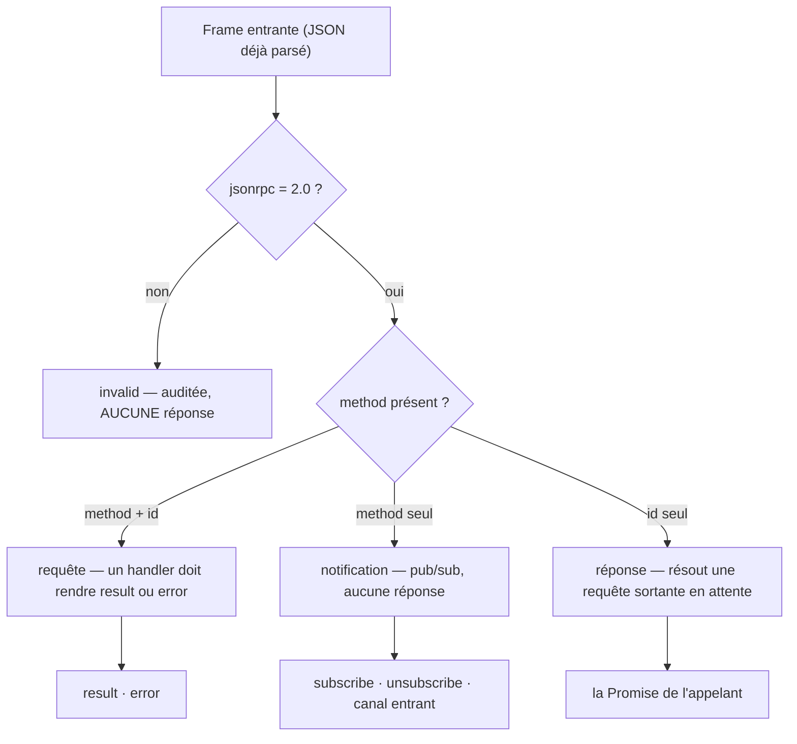
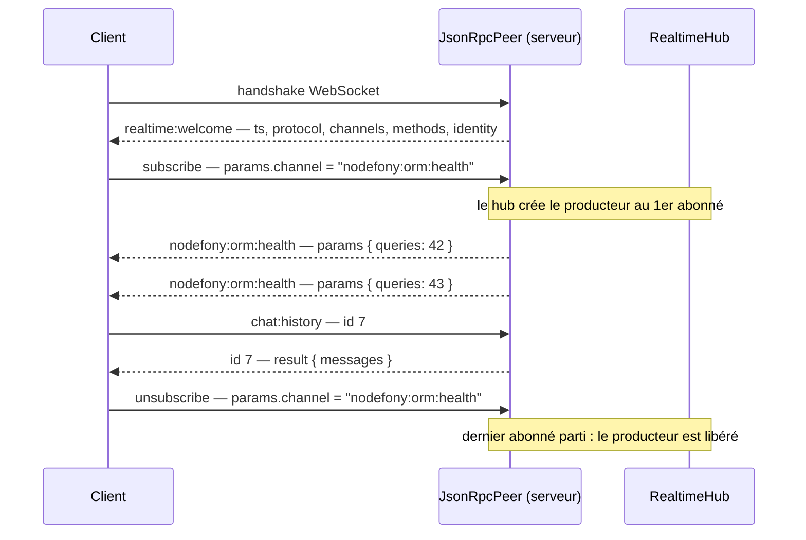

# Protocole — la grammaire des frames JSON-RPC 2.0

> Une connexion temps réel Nodefony ne transporte pas « des messages » : elle transporte des
> **frames** dont la forme est normée. Trois formes existent, et une seule règle les distingue —
> **la nature d'une frame se lit sur `method`, jamais sur `id`**. Cette page donne la grammaire
> champ par champ, les méthodes que le serveur comprend nativement, et ce qui revient exactement
> quand ça rate. Le moteur est `JsonRpcPeer` (`JsonRpcPeer.ts:271`), écrit une fois et branché des
> deux côtés du fil.

📍 [Documentation](../../../../../docs/index.md) › [Realtime](index.md) › **Protocole**

```nodefony-livegraph
{
  "graph": "protocole",
  "height": 480,
  "title": "Le protocole, en direct",
  "hint": "Les formes de frame qui circulent sur la socket de Studio — celle qui sert cette page."
}
```

## 🧠 Schéma général — trois formes, un seul moteur

Le pair classe chaque frame entrante avant toute chose. Ce classement — le **dispatch** — est le
cœur du protocole : il décide s'il faut répondre, à qui, et si une réponse est même possible.



Deux conséquences que le reste de la page décline :

1. **Une notification ne peut pas échouer visiblement** — sans `id`, il n'existe aucun canal de
   réponse. C'est pourquoi Nodefony ajoute une notification de refus (voir plus bas).
2. **Le protocole est symétrique** : le serveur appelle le client exactement comme le client appelle
   le serveur. Ce n'est pas un aller-retour déguisé, c'est du duplex.

## 📖 Lexique

| Terme            | Sens                                                                                  |
| ---------------- | ------------------------------------------------------------------------------------- |
| JSON-RPC 2.0     | Norme publique d'appel de procédure à distance en JSON, publiée en 2010, symétrique.  |
| Frame            | L'unité atomique qui passe sur le fil : un objet JSON conforme à la norme.            |
| Pair (peer)      | Le moteur de protocole d'une connexion — `JsonRpcPeer`, identique client et serveur.  |
| Requête          | Frame avec `method` **et** `id` — appelle exactement une réponse.                     |
| Notification     | Frame avec `method` seul — aucune réponse, jamais.                                    |
| Réponse          | Frame avec `id` seul, portant `result` **ou** `error`.                                |
| Dispatch         | Classer une frame entrante puis la router vers son handler.                           |
| Enveloppe        | Réponse qui joint des métadonnées serveur dans un champ **frère** du `result`.        |
| Accueil, welcome | La 1ʳᵉ notification poussée par le serveur : protocole, canaux, actions, identité.    |
| Canal entrant    | Canal où le client a le droit de pousser ; le nom du canal **est** le nom de méthode. |
| Zero Trust       | Ici : un échec non voulu ne révèle rien au pair (message générique, détail au log).   |
| RTT              | _Round-Trip Time_ — le temps d'un aller-retour complet sur la socket.                 |

## Qu'est-ce qu'un protocole de frames — et pourquoi JSON-RPC 2.0 ?

Multiplexer N flux dans **une** connexion oblige à étiqueter chaque message : sans étiquette, le
récepteur ne sait pas si l'octet qui arrive est un message de chat, une réponse attendue, ou un
battement de cœur. Cette étiquette, c'est le protocole.

Nodefony ne l'a pas inventée. Le calcul, mis à plat :

| Critère                     | JSON-RPC 2.0                             | Format maison                        |
| --------------------------- | ---------------------------------------- | ------------------------------------ |
| Spécifié, stable            | oui, depuis 2010                         | à inventer **et** à maintenir        |
| Bidirectionnel              | natif — la norme ne distingue pas client | à coder, puis à défendre en revue    |
| Batch (plusieurs ops/frame) | prévu par la norme (tableau de frames)   | à coder                              |
| Outillage                   | inspecteurs et bibliothèques existants   | zéro                                 |
| Coût mental                 | quasi nul, une frame se lit à l'œil      | toujours plus, et jamais documenté   |
| Erreurs                     | codes réservés, plage applicative dédiée | chacun réinvente sa table de statuts |

> [!NOTE]
> **Le batch est une propriété de la norme, pas du moteur Nodefony.** `JsonRpcPeer.receive()`
> (`JsonRpcPeer.ts:371`) attend un **objet** portant `jsonrpc: "2.0"` ; un tableau de frames n'en
> porte pas et tombe donc en `invalid`. Une frame = un objet. Le multiplexage rend le batch peu
> utile ici : les canaux voyagent déjà dans la même connexion.

**Le multiplexage, lui, n'est PAS dans la norme.** C'est Nodefony qui le construit par-dessus, en
se servant de `method` comme aiguillage : `subscribe`, `unsubscribe`, le nom d'un canal, le nom
d'une action. La norme fournit la grammaire ; le vocabulaire est nodefonien.

## La vision Nodefony — un moteur écrit une fois, branché des deux côtés

Trois partis pris distinguent cette implémentation d'un simple « serveur WebSocket qui parle JSON ».

**Le même fichier tourne dans le navigateur et dans Node.** `JsonRpcPeer` (`JsonRpcPeer.ts:271`)
n'a aucune dépendance Node — seulement `setTimeout`. Classer, router, corréler les `id` : ce travail
est identique des deux côtés, il est donc écrit **une seule fois**. Chaque côté l'entoure de son
transport et de ses handlers. Historiquement, cette discrimination vivait à deux endroits qui
divergeaient ; c'est précisément la classe de bug que l'isomorphisme supprime.

**Le rôle se lit sur `method`, pas sur `id`.** La lecture naïve (« `id` présent = requête ») casse
sur les réponses, qui portent un `id` sans être des appels. `JsonRpcPeer.receive()`
(`JsonRpcPeer.ts:371`) teste donc `method` d'abord, puis la présence d'un `id`. Une frame `id` seul
est une **réponse** et ne déclenche jamais `-32601` à tort.

**Un échec ne raconte rien par défaut.** Un handler qui lève une exception ordinaire produit un
`-32603 "internal error"` **générique** (`JsonRpcPeer.ts:528`) : ni message d'origine, ni pile
d'appels. Pour exposer volontairement un refus au pair — un 404, un droit manquant — il existe une
porte explicite, `RpcError` (`JsonRpcPeer.ts:70`), et elle seule.

## 🚀 Démarrage rapide

Un endpoint qui expose **une action RPC** et un client qui l'appelle, vus d'une application créée
par `nodefony create app`. C'est le plus court chemin pour voir les trois formes de frame.

### Le contrôleur — une action, deux façons d'échouer

```ts
// nodefony/controllers/ChatController.ts
import { controller, route } from "@nodefony/framework";
import {
  RealtimeController,
  RealtimeAction,
  RealtimeChannel,
} from "@nodefony/realtime";
import type { RealtimePublish } from "@nodefony/realtime";
import type { ContextType } from "@nodefony/http";
import { RpcError } from "nodefony";

interface ChatHistory {
  messages: string[];
}

@controller("/chat")
class ChatController extends RealtimeController {
  constructor(context: ContextType) {
    super("chat", context);
  }

  @route("chat-realtime", {
    path: "/realtime",
    requirements: { methods: ["WEBSOCKET"] },
  })
  async realtime(message: string | Buffer | null): Promise<void> {
    this.handleRealtime(message);
  }

  // Un CANAL : son nom sera annoncé dans l'accueil, et servira de `method`
  // aux notifications que le serveur poussera vers les abonnés.
  @RealtimeChannel("chat:room-42")
  room(_channel: string, _publish: RealtimePublish): () => void {
    return () => {};
  }

  // Une ACTION : appelée par une REQUÊTE (method + id), la valeur rendue
  // devient le `result` de la réponse corrélée.
  @RealtimeAction("chat:history")
  history(params: unknown): ChatHistory {
    const room = (params as { room?: unknown } | undefined)?.room;
    // Refus ASSUMÉ : `RpcError` choisit ce que le pair voit (code + data).
    if (typeof room !== "string") {
      throw new RpcError("params.room manquant", -32602);
    }
    if (room !== "room-42") {
      throw new RpcError("salon inconnu", -32000, { status: 404 });
    }
    // Un throw ORDINAIRE ici deviendrait `-32603 internal error`, opaque.
    return { messages: ["salut"] };
  }
}

export default ChatController;
```

### Le client — l'accueil, l'abonnement, l'appel corrélé

```ts
// frontend/src/chat.ts
import { RealtimeClient, RpcError } from "nodefony/client";

interface ChatHistory {
  messages: string[];
}

export async function joinChat(): Promise<void> {
  const socket = new RealtimeClient({
    url: "wss://127.0.0.1:5152/chat/realtime",
  });
  await socket.connect();

  // L'ACCUEIL est déjà ingéré : la carte du territoire, sans taper une route.
  console.log(socket.serverMethods); // actions exposées par l'endpoint
  console.log(socket.serverChannels); // canaux annoncés
  console.log(socket.identity); // qui je suis, tel que le serveur l'a résolu

  // `on` REÇOIT (handler local), `subscribe` DEMANDE le flux au serveur.
  socket.on("chat:room-42", (payload: unknown) => console.log(payload));
  socket.subscribe("chat:room-42"); // UN seul argument — pas de callback ici

  try {
    // REQUÊTE corrélée. Signature POSITIONNELLE : (méthode, params, délai en ms).
    // Un objet `{ timeoutMs }` en 3ᵉ position ne serait PAS lu comme un délai.
    const page = await socket.request<ChatHistory>(
      "chat:history",
      { room: "room-42" },
      5000,
    );
    console.log(page.messages);
  } catch (err) {
    // Le refus assumé du serveur arrive typé : code ET data traversent.
    if (err instanceof RpcError) console.warn(err.code, err.message, err.data);
  }
}
```

### Ce qu'on observe

Sur le fil, dans l'inspecteur réseau du navigateur, exactement cinq frames :

```jsonc
// 1. serveur → client : l'accueil, aussitôt après le handshake
{"jsonrpc":"2.0","method":"realtime:welcome","params":{
  "ts":1770000000000,"protocol":"jsonrpc-2.0",
  "channels":["chat:room-42"],"methods":["chat:history"],
  "identity":{"type":"anonymous","authenticated":false,
              "userIdentifier":"anonymous","roles":["ROLE_ANONYMOUS"],"scopes":[]}}}

// 2. client → serveur : notification, aucun `id`
{"jsonrpc":"2.0","method":"subscribe","params":{"channel":"chat:room-42"}}

// 3. client → serveur : requête, `id` attribué par le pair
{"jsonrpc":"2.0","id":1,"method":"chat:history","params":{"room":"room-42"}}

// 4. serveur → client : réponse corrélée par le même `id`
{"jsonrpc":"2.0","id":1,"result":{"messages":["salut"]}}

// 5. serveur → client : push sur le canal — le nom du canal EST la `method`
{"jsonrpc":"2.0","method":"chat:room-42","params":{"text":"salut"}}
```

L'accueil porte **cinq** champs : `ts`, `protocol`, `channels`, `methods`, `identity`
(`IRealtimeWelcome`, `RealtimeEventMap.ts:204`), émis par le contrôleur au handshake
(`RealtimeController.ts:8`). Il n'y a pas de champ `version`.

## 🔌 Anatomie d'une frame, champ par champ

### Le tronc commun

```jsonc
{
  "jsonrpc": "2.0", // signature de protocole — OBLIGATOIRE, sinon la frame est `invalid`
  "method": "subscribe", // ce qu'on demande — sa PRÉSENCE fait de la frame un appel
  "params": { "channel": "nodefony:orm:health" }, // la charge ; forme libre, jamais fiable côté serveur
  "id": 42, // PRÉSENT = requête (réponse due) · ABSENT = notification
}
```

| Champ     | Obligatoire               | Type accepté         | Rôle exact                                                                |
| --------- | ------------------------- | -------------------- | ------------------------------------------------------------------------- |
| `jsonrpc` | oui, toujours             | `"2.0"` littéral     | Sans lui, `JsonRpcPeer.receive()` classe `invalid` (`JsonRpcPeer.ts:371`) |
| `method`  | sur un appel              | chaîne               | Décide de la nature ET de l'aiguillage (canal, action, verbe pub/sub)     |
| `params`  | non                       | tout JSON            | Charge applicative. Vient du réseau : **jamais** digne de confiance       |
| `id`      | sur une requête / réponse | nombre **ou** chaîne | Corrèle l'aller et le retour                                              |

> [!IMPORTANT]
> Le pair accepte un `id` **chaîne** en entrée (conforme à la norme), mais il n'attribue jamais que
> des `id` **numériques** à ses propres appels sortants. Une réponse portant un `id` chaîne est donc
> ignorée sans erreur (`JsonRpcPeer.handleResponse()`, `JsonRpcPeer.ts:556`) : elle ne peut, par
> construction, correspondre à aucune requête émise par ce pair.

### La réponse — `result` ou `error`, jamais les deux

```jsonc
// succès — la valeur rendue par le handler, nue
{ "jsonrpc": "2.0", "id": 42, "result": { "messages": ["salut"] } }

// échec — un objet error normalisé ; `data` est optionnel et libre
{ "jsonrpc": "2.0", "id": 42, "error": { "code": -32601, "message": "method not found: chat:history" } }
```

Côté client, les deux formes sont converties en une seule chose : une `Promise` résolue avec le
`result`, ou rejetée avec une `RpcError` qui **préserve `code` et `data`**. C'est ce qui permet de
distinguer un 404 d'un refus d'autorisation sans analyser un message de texte.

### L'enveloppe — joindre une méta sans polluer le `result`

Un handler peut rendre une `RpcEnvelope` (`JsonRpcPeer.ts:104`) au lieu d'une valeur nue. Le pair la
déballe : le `result` reste **exactement** la valeur, et la méta voyage dans un champ frère
`meta` (`RpcMeta`, `JsonRpcPeer.ts:90`).

```jsonc
{
  "jsonrpc": "2.0",
  "id": 42,
  "result": { "…": "…" },
  "meta": { "requestId": "c7.12" },
}
```

Pourquoi ce détour plutôt qu'un champ de plus dans le `result` : le pont API garantit qu'une réponse
obtenue par la socket est **identique** à ce que rendrait la même route en REST. Glisser une méta
dans le `result` casserait cette égalité. Un pair qui ne connaît pas `meta` l'ignore — le champ est
rétro-compatible par construction.

## 🧰 Les méthodes nominales

Ce que le serveur comprend **sans qu'aucun contrôleur ne l'ait déclaré**, plus les deux formes
ouvertes à l'application. Colonne `id` : présent = requête (réponse due), absent = notification.

| Méthode            | Direction     | `id` ?  | Rôle                                                                  | Ancrage                     |
| ------------------ | ------------- | :-----: | --------------------------------------------------------------------- | --------------------------- |
| `subscribe`        | client→server |   non   | « pousse-moi ce canal » — `params.channel`                            | `RealtimeController.ts:592` |
| `unsubscribe`      | client→server |   non   | « arrête » — dernier abonné, le producteur est libéré                 | `RealtimeController.ts:599` |
| `ping`             | client→server |   non   | Battement de cœur — **no-op serveur**, aucun pong                     | `RealtimeClient.ts:740`     |
| `<canal>`          | server→client |   non   | Push d'un message : le **nom du canal est la `method`**               | `RealtimeController.ts:612` |
| `<canal entrant>`  | client→server |   non   | Le client pousse sur un canal déclaré entrant                         | `RealtimeController.ts:653` |
| `realtime:welcome` | server→client |   non   | L'accueil : 5 champs, dont l'identité résolue                         | `RealtimeController.ts:579` |
| `realtime:denied`  | server→client |   non   | Rend OBSERVABLE le refus d'une notification                           | `RealtimeController.ts:433` |
| `api.request`      | client→server | **oui** | Pont API — rejoue une route HTTP sur la socket (désactivé par défaut) | `RealtimeController.ts:463` |
| `<action>`         | client→server | **oui** | Toute action déclarée par `@RealtimeAction`                           | `realtimeDecorators.ts:101` |

> [!TIP]
> **L'accueil est ta carte du territoire.** `methods` et `channels` sont construits à partir de ce
> que l'endpoint expose réellement (`RealtimeController.ts:566`) : un client peut activer ou griser
> ses commandes sans rien coder en dur. Côté navigateur, ils se lisent en `socket.serverMethods` et
> `socket.serverChannels`.

Les quatre formes de frame circulent en permanence sous tes yeux — ce schéma les montre sur la

> [!WARNING]
> `nodefony:kernel:ping` et `nodefony:kernel:gc` (`StudioRealtimeController.ts:114`) sont des exemples d'actions,
> **pas des méthodes du cœur temps réel** : elles sont déclarées par le contrôleur
> d'administration de `@nodefony/studio`. Un endpoint applicatif ne les expose pas. Le helper
> `RealtimeClient.ping()` (`RealtimeClient.ts:740`) mesure le RTT en les appelant — il suppose donc
> un endpoint qui les déclare, contrairement à la notification `ping` du battement de cœur, qui
> n'attend jamais de réponse.

`subscribe` et `unsubscribe` ne sont **pas** des actions enregistrées : elles sont traitées dans
`onRealtimeNotification()` (`RealtimeController.ts:587`). Envoyées avec un `id`, elles seraient
classées « requête », ne trouveraient aucun handler et récolteraient un `-32601`.

## Une conversation type, de bout en bout



Les deux pushs intermédiaires n'ont ni `id` ni accusé de réception : ce sont des notifications, et
c'est ce qui rend le pub/sub bon marché. Seule la frame `id: 7` immobilise une entrée dans la table
des appels en attente du client, jusqu'à sa réponse ou son expiration.

## Quand ça rate — les codes d'erreur réellement émis

Voici **tout** ce que le moteur produit. Les codes de la plage `-32000`…`-32099` sont réservés par
la norme aux erreurs applicatives serveur ; Nodefony y place son refus d'autorisation et le défaut
de `RpcError`.

| Code     | Émis par                                                   | Déclencheur                                         | Ce que voit le pair                            |
| -------- | ---------------------------------------------------------- | --------------------------------------------------- | ---------------------------------------------- |
| `-32601` | `JsonRpcPeer.handleRequest()` (`JsonRpcPeer.ts:489`)       | requête vers une action non enregistrée             | `method not found: <nom>`                      |
| `-32603` | même méthode (`JsonRpcPeer.ts:528`)                        | le handler a levé une exception **ordinaire**       | `internal error` — générique, rien d'autre     |
| `-32001` | le refus du verrou de frame (`JsonRpcPeer.ts:400`)         | `beforeDispatch` a dit non **sur une requête**      | `unauthorized`, sans jamais dire pourquoi      |
| `-32000` | défaut du constructeur de `RpcError` (`JsonRpcPeer.ts:74`) | le handler expose volontairement son refus          | le message ET le `data` choisis par le handler |
| `-32602` | le pont API, via `RpcError` (`RealtimeController.ts:743`)  | `api.request` appelé avec un `params.path` invalide | message explicite (l'appel est malformé)       |

Et un échec qui n'est **pas** une frame : l'expiration. `startCall()` ne reçoit rien dans le délai
imparti, supprime l'entrée en attente et rejette localement avec `RPC timeout: <méthode>`
(`JsonRpcPeer.ts:428`). Défaut de 30 000 ms, réglable par appel. Aucun octet ne part sur le fil : c'est une décision du
client, le serveur peut très bien répondre après, sa réponse sera ignorée.

### Les deux codes de la norme que Nodefony n'émet jamais

`-32700 Parse error` et `-32600 Invalid Request` figurent dans la norme, mais **aucune frame ne les
porte** ici :

- un JSON illisible n'atteint même pas le pair — le contrôleur l'abandonne à la lecture
  (`RealtimeController.ts:446`) ;
- une frame lisible mais non conforme (pas d'objet, `jsonrpc` absent ou faux) est classée `invalid`,
  signalée à l'audit, et **rien n'est renvoyé** (`JsonRpcPeer.ts:429`).

Le choix est délibéré : une frame cassée n'a pas d'`id` digne de confiance, donc pas de corrélation
possible ; et répondre systématiquement à du bruit offre à un attaquant un amplificateur gratuit.
Le refus reste **traçable** — c'est le motif `invalid` de `FrameAuditReason` (`JsonRpcPeer.ts:143`),
qui alimente le journal d'audit avec le pair concerné.

### Le refus d'une notification n'est pas une erreur

C'est la subtilité la plus importante de la page. Le verrou de frame s'applique aux requêtes **et**
aux notifications (`beforeDispatch`, `JsonRpcPeer.ts:391`), mais leurs conséquences diffèrent
radicalement :

| La frame refusée est… | Ce qui part                                                     | Pourquoi                                             |
| --------------------- | --------------------------------------------------------------- | ---------------------------------------------------- |
| une **requête**       | `-32001 "unauthorized"` (`JsonRpcPeer.ts:400`)                  | Un `id` existe : il y a un canal de réponse          |
| une **notification**  | la notification `realtime:denied` (`RealtimeController.ts:433`) | Aucun `id` : sans elle, le client se croirait abonné |

`IRealtimeDenied` (`RealtimeEventMap.ts:228`) porte deux champs, `channel` et `reason` — et le motif
est **générique**. Jamais « il te manque `ROLE_ADMIN` » : ce serait un oracle d'autorisation, un
attaquant y lirait la carte des droits. Deux motifs circulent : `forbidden` (le verrou a dit non) et
`limit` (le plafond de canaux de la connexion est atteint, `RealtimeController.ts:674`). Côté client,
`onDenied()` (`RealtimeClient.ts:386`) branche un handler dessus.

> [!CAUTION]
> Un `-32403 Forbidden` circule dans d'anciennes notes. **Ce code n'existe pas** dans Nodefony, et il
> n'est réservé par aucune norme. Le refus d'autorisation est `-32001` sur une requête, et une
> notification `realtime:denied` sur une notification.

## 🔐 Ce que le protocole ne décide pas

Le protocole transporte et classe. Il ne décide ni de l'identité, ni des droits — trois règles qui
en découlent :

1. **Aucune authentification ne circule dans les frames.** L'identité est résolue **une fois** au
   handshake, puis figée pour la connexion et relue en O(1) par frame. Une frame ne porte jamais de
   credential : la rejouer ne rejoue aucune authentification.
2. **`subscribe` est une demande, jamais un droit.** Le serveur peut refuser un abonnement selon la
   politique du canal ; la demande a exactement la même forme qu'un abonnement autorisé, seule la
   réponse diffère.
3. **Le client ne pousse que là où c'est déclaré.** Un canal n'accepte d'entrée que si un handler
   entrant existe pour ce nom (`RealtimeController.ts:608`) ; sinon la notification est ignorée en
   silence. Le défaut est fermé.

Les mécanismes eux-mêmes — authenticator, verrou de frame, politique de canal, révocation — sont
décrits dans [la page sécurité](./securite.md).

## ⚠️ Pièges

| Symptôme                                                         | Cause                                                                                                           | Correction                                                                        |
| ---------------------------------------------------------------- | --------------------------------------------------------------------------------------------------------------- | --------------------------------------------------------------------------------- |
| `subscribe` répond `-32601 method not found`                     | Envoyé **avec un `id`** : classé requête, or c'est une notification (`RealtimeController.ts:592`)               | L'émettre sans `id` — `socket.subscribe(canal)`                                   |
| Le handler passé à `subscribe` n'est jamais appelé               | `RealtimeClient.subscribe()` prend **un seul** argument (`RealtimeClient.ts:430`)                               | `subscribe(canal)` **et** `on(canal, handler)`, deux gestes distincts             |
| `request()` expire immédiatement, ou ignore le délai             | Signature **positionnelle** `(méthode, params, ms)` (`RealtimeClient.ts:602`) — un objet d'options n'est pas lu | `request(m, p, 5000)` ; le défaut est 30 000 ms                                   |
| Un tableau de frames n'obtient aucune réponse                    | Le batch n'est pas implémenté : un tableau n'a pas de `jsonrpc` → `invalid` (`JsonRpcPeer.ts:371`)              | Une frame = un objet ; le multiplexage remplace le batch                          |
| Une frame malformée ne renvoie **aucune** erreur                 | Ni `-32700` ni `-32600` ne sont émis — silence + audit (`JsonRpcPeer.ts:396`)                                   | Lire le motif `invalid` côté serveur, pas la réponse                              |
| L'exception du serveur n'arrive jamais au client                 | Zero Trust : tout throw ordinaire devient `-32603` générique (`JsonRpcPeer.ts:528`)                             | Lever une `RpcError` pour exposer volontairement code et `data`                   |
| Une notification refusée disparaît sans trace côté client        | Sans `id`, aucune réponse possible (`beforeDispatch`, `JsonRpcPeer.ts:151`)                                     | Écouter `realtime:denied` via `onDenied()` (`RealtimeClient.ts:386`)              |
| `nodefony:kernel:ping` répond `-32601` sur mon endpoint          | L'action `nodefony:kernel:ping` est déclarée par `@nodefony/studio` (`StudioRealtimeController.ts:114`)         | Déclarer la sienne, ou lire `serverMethods` avant d'appeler                       |
| Le battement de cœur ne renvoie aucun pong                       | La notification `ping` est un no-op serveur (`RealtimeController.ts:661`)                                       | Pour mesurer un RTT, utiliser une action RPC — `ping()` (`RealtimeClient.ts:740`) |
| Une réponse reçue est ignorée sans message                       | Corrélation sur `id` **numériques** seulement (`JsonRpcPeer.ts:537`)                                            | Ne pas fabriquer soi-même de réponse à `id` chaîne                                |
| Les premières frames envoyées après `connect()` semblent perdues | Le transport n'est branché qu'une fois le handshake terminé                                                     | Attendre `realtime:welcome` — le client le fait déjà                              |

## 🧪 Tests & couverture

Le protocole est couvert à **deux endroits**, et c'est une conséquence directe de l'isomorphisme :
le moteur vit dans le cœur, son câblage serveur dans ce module. Les chiffres exacts vivent dans la
carte de l'aperçu, régénérée depuis les résultats réels — jamais figés ici.

- **Le moteur, dans le cœur** (`src/nodefony/src/tests/`) : `JsonRpcPeer.test.ts` (classement des
  frames, corrélation, timeout, erreurs), `JsonRpcPeer.types.test.ts` (le contrat générique tient à
  la compilation), et la famille `RealtimeClient*.test.ts` — dispatch, identité annoncée par
  l'accueil, transport, `ping`. Ces suites **ne sont pas comptées** dans la carte du module
  `@nodefony/realtime` : elles appartiennent au workspace `nodefony`.
- **Le câblage serveur, dans ce module** : `RealtimeController.test.ts` couvre les réponses
  d'erreur exactes (`-32601` sur méthode inconnue, `-32603` générique sur throw, `-32001` sur frame
  refusée) et le fait qu'une **réponse entrante** ne déclenche pas `-32601` à tort.
- **Bout en bout, sur un vrai serveur** : `realtimeLoopback.e2e.test.ts` exerce le duplex complet —
  requête client→serveur, requête **serveur→client**, `-32601` quand le client n'a pas enregistré
  l'action, `-32603` quand son handler lève, et le passage fidèle du `data` d'une `RpcError`.
- **Sous attaque** : les bancs `*.attack.test.ts` du module vérifient que le refus est observable
  (plafond de canaux) et qu'une politique déclarée sans décideur est détectée.

Couverture : `npm run coverage` dans `@nodefony/realtime` et dans le workspace `nodefony`.

> [!CAUTION]
> Plusieurs suites bout en bout exigent une infrastructure. **Un test sauté compte comme vert** :
> avant de conclure « tout passe », vérifier les variables d'environnement — la source unique est
> `vitest.gates.ts` à la racine, dont le rapport s'affiche en fin d'exécution.

## 🔗 Pour aller plus loin

- ⬆️ **Retour au hub** : [Realtime — vue d'ensemble](index.md) · [Toute la documentation](../../../../../docs/index.md)
- 🧭 **Pages sœurs** : [Vocabulaire](vocabulaire.md) · [Architecture](architecture.md) · [Sécurité](securite.md) · [Configuration](configuration.md) · [Cookbook — un chat complet](cookbook-chat.md)

- Les mots employés ici, avec leurs analogies → [vocabulaire](./vocabulaire.md)
- Où le pair se situe dans la pile, et le cycle de vie d'une connexion → [architecture](./architecture.md)
- Qui pose le verrou de frame, et ce qu'il lit → [sécurité](./securite.md)
- Le protocole mis en œuvre d'un bout à l'autre → [cookbook](./cookbook-chat.md)
- Les signatures exactes ne sont jamais recopiées ici : elles vivent dans le graphe symbolique
  `.ai/symbols.json`, régénéré depuis les TSDoc du code.
