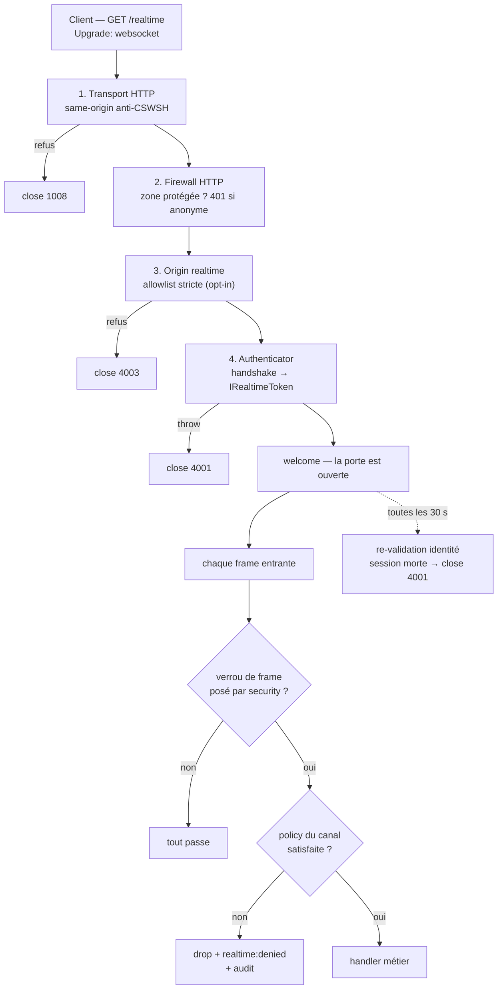
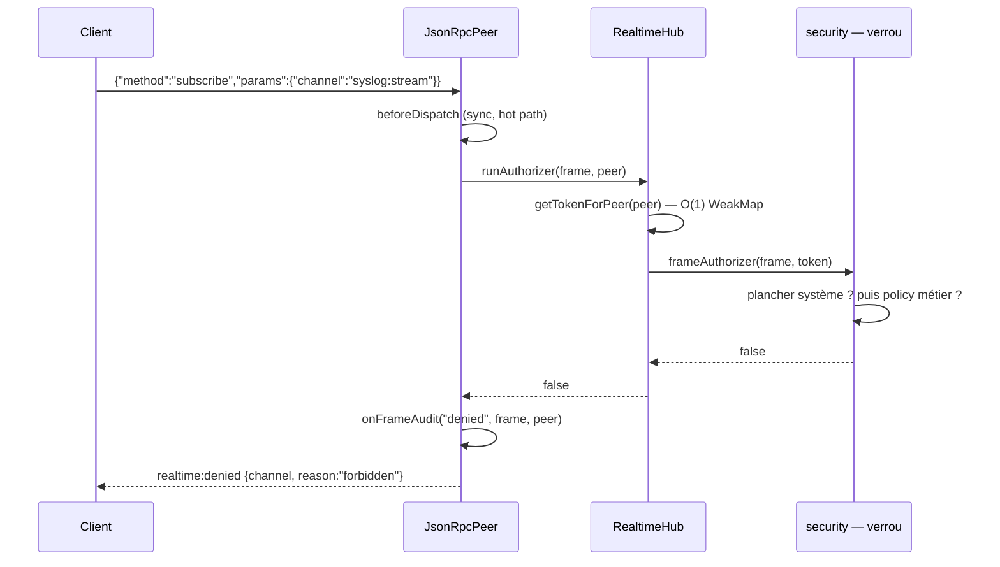

# Sécurité du temps réel — qui entre, qui écoute, jusqu'à quand

> Une WebSocket n'est pas une requête, c'est une **porte qui reste ouverte**. Nodefony la garde
> avec quatre verrous : l'origine à l'entrée, l'identité au handshake, l'autorisation par frame,
> la révocation dans la durée. Cette page dit ce que chaque verrou bloque **et où il s'arrête** —
> une protection partielle y est annoncée comme partielle.

📍 [Documentation](../../../../../docs/index.md) › [Realtime](index.md) › **Sécurité**

## 🧠 Le modèle mental — un transporteur, un décideur

La règle qui explique tout le reste : **`@nodefony/realtime` ne décide jamais d'une autorisation.**
Il transporte des déclarations (« ce canal exige `ROLE_ADMIN` ») jusqu'à un décideur, et
`@nodefony/security` est ce décideur. Le module realtime ignore la hiérarchie de rôles, ignore la
session, ignore l'utilisateur réel.

Conséquence directe, à garder en tête pendant toute la lecture : **sans `@nodefony/security` câblé,
aucune politique de canal n'est appliquée.** Le transport fonctionne, les déclarations sont
collectées, personne ne les fait respecter.



Les étapes 1 et 2 appartiennent à `@nodefony/http` et `@nodefony/security` : la requête d'upgrade
**est** une requête HTTP, elle traverse le pipeline normal avant d'atteindre le realtime. Les
étapes 3, 4 et le verrou de frame sont portés par ce module.

## 📖 Lexique

| Terme              | Sens                                                                                                                                                  |
| ------------------ | ----------------------------------------------------------------------------------------------------------------------------------------------------- |
| Handshake          | La requête HTTP `Upgrade: websocket` qui ouvre la connexion. **Tout le contrôle d'identité s'y joue.**                                                |
| Frame              | Un message JSON-RPC 2.0 circulant une fois la porte ouverte (`subscribe`, `api.request`, notification).                                               |
| Canal (_channel_)  | Un flux nommé auquel on s'abonne (`orders:feed`, `syslog:stream`) ; le hub le diffuse à tous ses abonnés.                                             |
| CSWSH              | _Cross-Site WebSocket Hijacking_ : un site tiers ouvre une WS vers ton app, **avec le cookie de la victime**.                                         |
| Origin             | En-tête RFC 6455 §10.2 disant d'où vient la page qui ouvre la socket. Seule preuve d'origine disponible.                                              |
| Token realtime     | `IRealtimeToken` — carte d'identité de la connexion, figée au handshake, lue en O(1) à chaque frame.                                                  |
| Verrou de frame    | `FrameAuthorizer` — fonction **sync** qui accepte ou refuse une frame. Posée par security au boot.                                                    |
| Policy de canal    | `IChannelPolicy` — exigences déclarées sur un canal (`authenticated`, `roles`, `scopes`).                                                             |
| Namespace réservé  | Préfixe de canal appartenant à la plateforme (`syslog:`, `security:`…), porteur d'un **plancher** d'autorisation que la config ne peut pas descendre. |
| Zero Trust         | Aucune identité n'est supposée : un visiteur porte toujours un token, anonyme par défaut.                                                             |
| Fail-closed / loud | En cas de doute on **refuse** ; toute dégradation de sécurité est **annoncée** (WARNING), jamais silencieuse.                                         |
| Backplane          | Le bus qui propage les publications entre pods (Redis, IPC cluster).                                                                                  |
| BFF                | _Backend-For-Frontend_ : la session serveur (cookie opaque) qui porte l'identité web.                                                                 |

## 🔐 Qu'est-ce que ça défend, concrètement ?

Une WebSocket authentifiée est une cible de choix : elle porte une identité, vit longtemps et
diffuse en continu.

| Attaque                                                                                                | Ce qui la bloque                                                   | Où                                                           |
| ------------------------------------------------------------------------------------------------------ | ------------------------------------------------------------------ | ------------------------------------------------------------ |
| **CSWSH** — `evil.com` fait `new WebSocket("wss://app.exemple.com/rt")`, le navigateur joint le cookie | Contrôle d'`Origin` same-origin par défaut, puis allowlist stricte | `@nodefony/http` transport, puis `csrf.checkOrigin` realtime |
| **Écoute des flux internes** — un visiteur s'abonne à `syslog:stream` et lit les logs du pod           | Plancher des namespaces réservés (authentifié + `ROLE_ADMIN`)      | Verrou de frame `@nodefony/security`                         |
| **Élévation par canal métier** — un `ROLE_USER` s'abonne au canal admin d'un autre module              | Policy déclarée sur le canal, évaluée avec la hiérarchie de rôles  | `@RealtimeChannel(name, { roles })` + verrou de frame        |
| **Pont API plus permissif que REST** — `api.request {path}` pour contourner un 401 HTTP                | Re-match de la MÊME zone firewall que `GET {path}`                 | Verrou de frame, surface `api.request`                       |
| **Socket zombie** — un admin se déconnecte, sa socket continue de diffuser                             | Re-validation périodique de l'identité, fermeture `4001`           | Tick de révocation du hub                                    |
| **DoS mémoire par abonnements** — une connexion ouvre des milliers de canaux                           | Plafond de canaux par connexion (256 par défaut)                   | `limits.maxChannelsPerConnection`                            |
| **DoS mémoire par lenteur** — un client ne lit pas, la file d'envoi enfle jusqu'à l'OOM                | Jet de frames à 1 MiB, fermeture `1013` à 8 MiB                    | Back-pressure du transport WS                                |
| **Oracle d'autorisation** — sonder les canaux pour cartographier les droits                            | Motif de refus **générique** (`forbidden`), jamais le détail       | `realtime:denied`                                            |

> [!IMPORTANT]
> Les lignes 2 à 5 supposent `@nodefony/security` chargé **avec au moins une zone protégée**. Sans
> cela, le verrou de frame n'est jamais posé et ces défenses sont inertes — c'est la condition
> détaillée au verrou 3, le point le plus important de la page.

## 🎯 La vision Nodefony — une seule politique, deux transports

HTTP et WebSocket vivent dans le même contexte : la sécurité en hérite, **on n'écrit pas deux
politiques.**

- Une zone du firewall couvre HTTP **et** WS par défaut (`realtime: true` —
  `security/nodefony/config/config.ts:109`). L'opt-out est explicite ; un opt-in aurait été
  _fail-open_ (une zone qui oublie le flag laisserait le WS anonyme).
- Le verrou de frame consulte la **même** fonction de match que le HTTP, `Firewall.matchPath()`
  (`firewall.ts:529`), et la **même** hiérarchie de rôles, `Firewall.hasRole()`
  (`firewall.ts:399`). Invariant par construction : `api.request {path}` n'accorde jamais plus que
  `GET {path}`.
- L'identité du handshake est celle du firewall HTTP : `SessionRealtimeAuthenticator`
  (`SessionRealtimeAuthenticator.ts:37`) ne relit ni cookie ni base, il **promeut** l'`IUser` déjà
  posé dans l'ALS. Zéro lecture redondante par connexion.

Le compromis assumé : l'identité est **figée au handshake**, les frames lisent un cache O(1). C'est
ce qui rend le temps réel tenable, et ce qui crée le besoin d'un tick de révocation (verrou 4).

## 🚀 Démarrage rapide

Objectif : dans une app générée par `nodefony create app`, exposer un canal `orders:feed` réservé
aux administrateurs, et voir ce que reçoit un client non autorisé.

### 1. Déclarer la zone et activer l'origine stricte

```typescript
// nodefony.config.ts — extrait
use("@nodefony/security", {
  areas: {
    // Zone protégée : le handshake WS de /rt passe par le MÊME contrôle que
    // le HTTP. `realtime` vaut true par défaut → ne pas l'écrire suffit.
    app: {
      pattern: "^/rt",
      authenticators: ["session"],
    },
  },
  roleHierarchy: {
    ROLE_ADMIN: ["ROLE_USER"],
  },
});

use("@nodefony/realtime", {
  csrf: {
    checkOrigin: {
      // Deuxième barrière d'origine : allowlist EXACTE (pas de wildcard).
      enabled: true,
      allowList: ["https://app.exemple.com", "https://127.0.0.1:5152"],
      // Un client sans en-tête Origin (mobile natif, script) est refusé.
      allowMissingOrigin: false,
    },
  },
  limits: {
    // Garde anti-OOM : au-delà, le subscribe est refusé (pas de close).
    maxChannelsPerConnection: 64,
  },
});
```

### 2. Le controller : un canal libre, un canal gardé

```typescript
// nodefony/controllers/OrdersRealtimeController.ts — compile tel quel
import { controller, route } from "@nodefony/framework";
import { Context } from "@nodefony/http";
import { RealtimeChannel, RealtimeController } from "@nodefony/realtime";
import type { RealtimePublish } from "@nodefony/realtime";

@controller("/rt")
class OrdersRealtimeController extends RealtimeController {
  constructor(context: Context) {
    super("OrdersRealtimeController", context);
  }

  @route("orders-ws", {
    path: "/orders",
    requirements: { methods: ["WEBSOCKET"] },
  })
  async realtime(message: string | Buffer | null): Promise<void> {
    this.handleRealtime(message);
  }

  // Canal PUBLIC : aucune policy déclarée → libre pour tout connecté.
  @RealtimeChannel("orders:public")
  publicFeed(channel: string, publish: RealtimePublish): () => void {
    const timer = setInterval(() => publish(channel, { ts: Date.now() }), 2000);
    return () => clearInterval(timer);
  }

  // Canal GARDÉ : la policy est une DÉCLARATION, transportée jusqu'à
  // @nodefony/security qui l'évalue (hiérarchie de rôles comprise).
  @RealtimeChannel("orders:feed", {
    authenticated: true,
    roles: ["ROLE_ADMIN"],
  })
  adminFeed(channel: string, publish: RealtimePublish): () => void {
    const timer = setInterval(() => publish(channel, { pending: 3 }), 1000);
    return () => clearInterval(timer);
  }
}

export default OrdersRealtimeController;
```

### 3. Ce qu'observe le client refusé

Un `ROLE_USER` connecté demande les deux canaux. Le premier marche, le second est refusé — et le
refus est **visible**, jamais un silence.

```typescript
// frontend — le client isomorphe du core
import { RealtimeClient } from "nodefony/client";

const socket = new RealtimeClient({ url: "wss://app.exemple.com/rt/orders" });

// Refus poussés par le serveur — première classe côté client.
socket.onDenied((denied) => {
  // { channel: "orders:feed", reason: "forbidden" }
  // Motif GÉNÉRIQUE : jamais « il te manque ROLE_ADMIN » (pas d'oracle).
  console.warn("canal refusé", denied.channel, denied.reason);
});

await socket.connect();
socket.subscribe("orders:public"); // ✅ ticks reçus
socket.subscribe("orders:feed"); // ❌ aucun tick, un realtime:denied à la place
```

**Ce qu'on observe côté serveur** : un log `WARNING` « WS realtime frame refused by authorizer »
et une entrée d'audit `category: "ws"`, `action: "frame.denied"`, `outcome: "denied"`, avec
l'acteur et le canal visé. Le canal n'est jamais ouvert : le provider ne démarre pas, le hub n'est
même pas appelé.

> [!WARNING]
> Ce démarrage rapide ne protège `orders:feed` que si `@nodefony/security` est chargé **et** que la
> zone `app` reste protégée. Retire le module, ou passe la zone en `realtime: false`, et le canal
> redevient ouvert à tout connecté — le serveur le signalera par un WARNING au boot, mais il ne
> refusera pas de démarrer.

## 🛡️ Verrou 1 — l'origine : bloquer le CSWSH

Le navigateur n'applique **pas** CORS aux WebSockets. N'importe quelle page peut ouvrir une socket
vers ton domaine, et le navigateur y joindra les cookies de la victime. L'en-tête `Origin`
(RFC 6455 §10.2) est la seule information exploitable côté serveur.

Nodefony pose **deux barrières successives**, à deux étages différents.

| Barrière             | Étage                | Défaut                              | Origin absent | Refus        |
| -------------------- | -------------------- | ----------------------------------- | ------------- | ------------ |
| Contrôle same-origin | `@nodefony/http`     | **actif** (`allowedOrigins: false`) | accepté       | `close 1008` |
| Allowlist stricte    | `@nodefony/realtime` | **inactif** (`enabled: false`)      | configurable  | `close 4003` |

**Barrière 1 — transport, active sans rien faire.** `HttpKernel.checkWebsocketOrigin()`
(`http-kernel.ts:509`) exige que l'`Origin` du handshake corresponde au `Host` servi, avec tolérance
loopback en développement et une allowlist optionnelle (`allowedOrigins`,
`http/nodefony/config/config.ts:525`) acceptant le hostname exact ou un wildcard à un label. Une
requête **sans** `Origin` est acceptée : un attaquant non-navigateur n'a pas besoin de CSWSH.

**Barrière 2 — module realtime, opt-in et plus stricte.** `RealtimeHub.checkOrigin()`
(`RealtimeHub.ts:652`) consulte une garde compilée une fois au boot par `buildOriginGuard()`
(`RealtimeService.ts:270`) depuis `checkOriginSchema` (`realtime/nodefony/config/config.ts:142`).
Trois différences comptent :

1. **Match exact scheme + host + port**, aucun wildcard. Durcissement volontaire par rapport au
   CORS `Access-Control-Allow-Origin: *`.
2. **Origin absent → refusé** par défaut (`allowMissingOrigin: false`). C'est le seul moyen de
   fermer la porte aux clients non-navigateur.
3. **Fail-closed** : `enabled: true` avec une `allowList` vide refuse **tout**. Une erreur de
   configuration ferme la porte, elle ne l'ouvre pas.

Le refus est journalisé (`WARNING`, avec l'origine reçue) puis la socket est fermée en `4003`
« origin not allowed » — plage 4000-4999 réservée aux applications (RFC 6455 §7.4.2). Aucune frame
n'est jamais traitée.

> [!CAUTION]
> **Ce que l'Origin ne prouve pas.** C'est une déclaration du navigateur, pas une preuve
> cryptographique : un client non-navigateur peut l'inventer. L'Origin protège les **victimes de
> navigateur** (CSWSH), pas contre un attaquant qui contrôle son propre client. La défense contre
> ce dernier, c'est l'authentification — verrou suivant.

## 🔐 Verrou 2 — l'identité : une seule fois, au handshake

### Le pipeline exact

`RealtimeController.onHandshake()` (`RealtimeController.ts:312`) exécute, une fois par connexion :

1. Construction d'un DTO neutre `IRealtimeHandshake` par `buildHandshakeFromContext()`
   (`RealtimeController.ts:914`) — headers, cookies aplatis, url, origin, sous-protocoles. Aucune
   dépendance à `@nodefony/security` dans le contrat.
2. Contrôle d'origine (verrou 1).
3. Résolution de l'authenticator par `RealtimeHub.resolveAuthenticator()` (`RealtimeHub.ts:635`) :
   les matchers sont testés dans l'ordre d'enregistrement, **le premier qui matche capture**.
4. `authenticator.authenticate(handshake)` — **async autorisé** (on est en cold path, une fois par
   connexion : lire un store est acceptable ici, jamais par frame).
5. Pose du token sur la WeakMap `peer → token` via `RealtimeHub.setTokenForPeer()`
   (`RealtimeHub.ts:692`), **avant** l'envoi du `welcome` : le lookup est garanti dès la première
   frame.

Un `throw` de `authenticate()` ferme la socket en `4001` « unauthorized », après un log `WARNING`
nommant l'authenticator fautif. Le hook `onFailure` est invoqué dans un `try/catch` : un hook
d'audit défectueux ne peut pas empêcher la fermeture.

### Les matchers — quelle porte, quel vigile

`RealtimeHub.useAuthenticator()` (`RealtimeHub.ts:617`) associe un sélecteur à une stratégie.
`compileMatcher()` (`RealtimeHub.ts:855`) le compile une fois :

- `pattern` chaîne → RegExp **préfixe ancrée**, méta-caractères échappés par `RegExp.escape`.
  `"/admin/"` matche `/admin/` et `/admin/foo`, littéralement.
- `pattern` RegExp → utilisée telle quelle.
- `host` optionnel → comparaison **stricte** (insensible à la casse) sur l'en-tête `Host`, sans
  wildcard.
- Le match porte sur le **path**, query comprise, jamais sur l'URL absolue : `handshakePath()`
  (`RealtimeController.ts:966`) extrait `pathname + search` du `WebsocketContext.url`, qui est
  absolu. Sans cette extraction, un matcher `^/nodefony/…` ne se déclencherait jamais.

`@nodefony/security` enregistre ces matchers automatiquement dans `Firewall.#wireRealtime()`
(`firewall.ts:253`) : **une instance d'authenticator par zone protégée**, car le hub dédoublonne par
identité d'instance et une instance partagée n'enregistrerait que le premier matcher.

### Zero Trust — il y a toujours un token

`RealtimeHub.getTokenForPeer()` (`RealtimeHub.ts:704`) ne renvoie **jamais** `null` : à défaut de
token posé, c'est `ANONYMOUS_REALTIME_TOKEN` (`AnonymousRealtimeToken.ts:18`), singleton gelé,
`isAuthenticated() === false`, `roles: ["ROLE_ANONYMOUS"]`. Le code consommateur (verrou, audit)
n'a jamais à écrire « et s'il n'y a pas de token ? ».

| Situation au handshake                           | Token posé                  | Connexion    |
| ------------------------------------------------ | --------------------------- | ------------ |
| Aucun authenticator enregistré                   | `ANONYMOUS_REALTIME_TOKEN`  | ouverte      |
| Aucun matcher ne capture l'URL                   | `ANONYMOUS_REALTIME_TOKEN`  | ouverte      |
| Matcher trouvé mais `supports()` renvoie `false` | `ANONYMOUS_REALTIME_TOKEN`  | **ouverte**  |
| `authenticate()` réussit                         | le token de l'authenticator | ouverte      |
| `authenticate()` throw                           | aucun                       | `close 4001` |

> [!WARNING]
> La troisième ligne est un comportement à comprendre : un authenticator qui **matche mais ne
> supporte pas** le handshake fait retomber la connexion en anonyme, sans fermeture. C'est le cas
> de `SessionRealtimeAuthenticator.supports()` (`SessionRealtimeAuthenticator.ts:41`) quand aucune
> identité authentifiée n'est en ALS. Ce n'est pas un trou **parce que** le firewall HTTP a déjà
> refusé l'anonyme en amont sur une zone protégée (Zero Trust appliqué à la requête d'upgrade). Sur
> une route WS **hors zone**, en revanche, la connexion anonyme aboutit : la protection y repose
> entièrement sur les policies de canal.

Le `welcome` transporte ensuite l'identité résolue (`type`, `authenticated`, `userIdentifier`,
`roles`, `scopes`) : le client sait qui il est sans appeler une route. Vue « sur soi » — aucun
secret, aucun claim d'un tiers.

## 🧑‍⚖️ Verrou 3 — l'autorisation par frame

C'est le verrou le plus important et celui dont les limites doivent être les mieux comprises.

### Et si le module de sécurité n'est pas chargé du tout ?

La question mérite d'être posée avant la mécanique, parce que la réponse a longtemps été mauvaise.
Sans `@nodefony/security`, personne ne pose de décideur : le hub laissait alors passer **tout**, y
compris les canaux qui décrivent l'intérieur du serveur — journaux, requêtes de base, métriques,
supervision. Un tableau de bord anonyme lisait les journaux du pod.

Le hub applique donc son **propre plancher**, qui ne dépend d'aucun module : tant qu'aucun verrou
n'est posé, une connexion cliente ne peut pas s'abonner à un canal de plateforme.

| Namespace                                                       | Ce qu'il expose             |
| --------------------------------------------------------------- | --------------------------- |
| `security:`                                                     | journal d'audit             |
| `syslog:`                                                       | journaux du serveur         |
| `orm:`                                                          | requêtes et santé des bases |
| `node:` · `cluster:` · `dashboard:` · `debugbar:` · `realtime:` | métriques et supervision    |
| `kernel:`                                                       | contrôle du pod             |

Le raisonnement tient en une phrase : **sans module de sécurité, aucune identité n'existe**, donc
personne ne peut prouver qu'il a le droit de lire ces canaux — le seul état sûr est le refus. Les
canaux applicatifs (`chat:`, le vôtre) ne sont pas concernés : une application sans authentification
continue de fonctionner.

Trois conséquences pratiques :

- Le client **reçoit** `realtime:denied` avec le motif `forbidden` — il n'attend pas dans le vide.
- Le serveur **journalise une fois** au premier refus, en expliquant comment ouvrir (charger
  `@nodefony/security` et déclarer une zone protégée). Un écran vide doit toujours avoir une cause
  lisible quelque part.
- La sonde compte les refus (`systemFloorDeniedTotal`), ce qui distingue « configuration
  incomplète » de « quelqu'un insiste ».

Dès qu'un module de sécurité pose son verrou, ce plancher s'efface : c'est le verrou qui décide,
avec les rôles — ce que le hub, seul, ne sait pas faire.

> [!NOTE]
> Un service **du serveur** qui s'abonne à ses propres journaux n'est pas concerné : il ne passe pas
> par la porte des connexions clientes. Le plancher vise le réseau, pas le code local.

### La chaîne complète



Le verrou est **strictement synchrone** — `FrameAuthorizer` (`RealtimeHub.ts:39`). Un `await` par
frame coûterait une microtask et sérialiserait le pipeline RPC de la connexion. Il ne lit que de la
mémoire : le token déjà résolu, et la cible de la frame.

### Les trois surfaces gardées

`buildFrameAuthorizer()` (`frameAuthorizer.ts:352`) ne garde que ce qui atteint des données :

| Frame                                 | Contrôle appliqué                                                                                               |
| ------------------------------------- | --------------------------------------------------------------------------------------------------------------- |
| `api.request {path}`                  | Re-match de zone HTTP : zone protégée + anonyme → refus                                                         |
| `subscribe {channel}`                 | Plancher système, puis policy métier déclarée sur le canal                                                      |
| notification `method` = canal inbound | Même politique que `subscribe` (on ne pousse pas sur un canal protégé)                                          |
| action `@RealtimeAction`              | Authentifié **par défaut** ; rôle/scope si déclarés ; ouverte seulement si `{ authenticated: false }` est écrit |
| `ping`, `unsubscribe`                 | **passent** — pas de surface de données                                                                         |

Deux détails évitent des faux refus : `authorizeApiRequest()` (`frameAuthorizer.ts:280`) laisse
passer une frame au `path` invalide (le handler renverra `-32602` — le verrou ne duplique pas la
validation), et `authorizeChannel()` (`frameAuthorizer.ts:309`) laisse passer un `channel`
non-chaîne (`startChannel` ignore de toute façon un canal absent).

### Le plancher système — les namespaces réservés

Certains namespaces exposent l'intérieur du pod. Ils portent une politique par défaut que la config
peut **resserrer**, jamais desserrer.

| Namespace                                                                                 | Politique par défaut                                           |
| ----------------------------------------------------------------------------------------- | -------------------------------------------------------------- |
| `security:`                                                                               | authentifié + `ROLE_NODEFONY_ADMIN` (`frameAuthorizer.ts:106`) |
| `syslog:`, `orm:`, `node:`, `dashboard:`, `debugbar:`, `realtime:`, `cluster:`, `kernel:` | authentifié + `ROLE_ADMIN` (`frameAuthorizer.ts:70`)           |
| tout canal contenant `:health` ou `:stats`                                                | authentifié + `ROLE_ADMIN`                                     |
| tout le reste                                                                             | libre, sauf policy déclarée                                    |

Trois durcissements méritent d'être connus :

- **Match insensible à la casse, sans allocation** — `startsWithCI()` (`frameAuthorizer.ts:149`).
  Un `SYSLOG:stream` ne contourne pas le plancher `syslog:` par un simple changement de casse.
- **Plancher irréductible** — `floorReserved()` (`frameAuthorizer.ts:219`) : une règle de config qui
  tenterait d'ouvrir un namespace réservé (`{ authenticated: false }`) se voit ré-imposer
  `authenticated: true`. Le test porte sur le **namespace du canal**, pas sur le préfixe de la règle
  qui a matché : un préfixe de config plus court ou altéré ne contourne rien.
- **La config passe avant les défauts** — les règles de `realtimeChannels`
  (`security/nodefony/config/config.ts:906`) sont placées en tête, premier match gagnant. On peut
  donc re-cibler `syslog:` sur `ROLE_SECURITY_AUDITOR` ; on ne peut pas l'ouvrir à l'anonyme.

Le canal du journal d'audit (`security:audit`) est enregistré comme **canal système** sur le hub
(`RealtimeHub.registerSystemChannel()`, `RealtimeHub.ts:741`) : il devient servable par n'importe
quel endpoint realtime, sans qu'aucun controller ne le connaisse — et il est gardé par le plancher
`security:`. Son enregistrement est **couplé** à la pose du verrou (même condition), donc il n'existe
jamais de canal d'audit non gardé.

### La policy métier — déclarer sur le canal

`@RealtimeChannel(name, policy)` (`realtimeDecorators.ts:142`) et `@RealtimeInbound(name, policy)`
(`realtimeDecorators.ts:182`) attachent un `IChannelPolicy` au **nom** du canal. Les trois axes sont
cumulatifs (ET) ; un axe absent n'impose rien :

| Axe             | Sens                                                                          | Évalué par                               |
| --------------- | ----------------------------------------------------------------------------- | ---------------------------------------- |
| `authenticated` | token non anonyme                                                             | `satisfies()` (`frameAuthorizer.ts:240`) |
| `roles`         | un des rôles suffit, **hiérarchie comprise**                                  | `Firewall.hasRole()` (`firewall.ts:399`) |
| `scopes`        | un des scopes suffit — axe API (JWT, clé API), une session BFF n'en porte pas | comparaison directe                      |

Une policy **vide** n'est pas enregistrée : `definePolicy()` (`realtimeDecorators.ts:40`) ignore un
objet sans contrainte — le canal reste libre, le registre reste vide. Les déclarations sont publiées
au hub **au handshake**, pas au boot (`RealtimeHub.registerChannelPolicy()`, `RealtimeHub.ts:751`,
idempotent) ; le décideur les relit par `RealtimeService.resolveChannelPolicy()`
(`RealtimeService.ts:243`).

### ⚠️ La condition d'activation — le point critique

Le verrou n'existe que si quelqu'un le pose. Deux conditions doivent être vraies **en même temps** :

1. `@nodefony/security` est chargé, et
2. au moins une zone a `security: true` **et** `realtime: true`.

C'est exactement le test de `Firewall.#wireRealtime()` (`firewall.ts:253`) : sans zone qualifiante,
`wired` reste faux, `setFrameAuthorizer` n'est jamais appelé, et **aucune** policy de canal n'est
évaluée — ni métier, ni système. `syslog:stream` redevient un canal ordinaire.

Deuxième subtilité : `beforeDispatch` n'est branché sur une connexion que si le verrou est **déjà**
posé au moment de son handshake (`RealtimeController.ts:402`, via
`RealtimeHub.hasFrameAuthorizer()` — `RealtimeHub.ts:722`). Choix de performance délibéré (un hub
non sécurisé garde un coût nul par frame), mais avec une conséquence : **une connexion ouverte avant
la pose du verrou n'est jamais gardée**, et ce jusqu'à sa fermeture. En fonctionnement normal le
firewall se construit au boot, avant tout trafic ; le cas ne se présente qu'en appelant
`setFrameAuthorizer()` à chaud.

**Le refus de dégrader en silence.** Quand des policies sont déclarées sans décideur câblé,
`RealtimeHub.hasUnenforcedChannelPolicies()` (`RealtimeHub.ts:734`) renvoie `true` et le controller
émet un WARNING explicite, une seule fois par process (`RealtimeController.ts:487`) :

```text
Realtime channel policies declared but NO frame authorizer is wired —
these policies are NOT enforced (a protected channel is currently open).
Load @nodefony/security with a realtime zone to enforce them.
```

C'est le comportement prouvé par `realtimeUnenforcedPolicy.attack.test.ts` : une policy déclarée
sans `frameAuthorizer` est détectée comme **inerte**, et l'ajout du `frameAuthorizer` éteint
l'alerte. Le test ne prouve pas que le canal est fermé — il prouve que le framework **le dit**.

> [!CAUTION]
> **Portée exacte de cette alerte.** Elle se déclenche uniquement s'il existe au moins une policy
> **déclarée** par un décorateur. Une application qui n'utilise aucun `@RealtimeChannel` avec
> policy, mais qui expose des canaux de namespace réservé (`syslog:`, `orm:`…), ne déclenche
> **rien** : le registre `#channelPolicies` reste vide, la condition est fausse, et les planchers
> système restent pourtant non appliqués. La détection couvre le risque métier, pas le risque
> plateforme.

### Ce que le refus laisse voir

Le refus doit être observable sans devenir un oracle. Nodefony tranche ainsi :

| Type de frame refusée               | Réponse au client                                                                |
| ----------------------------------- | -------------------------------------------------------------------------------- |
| Requête (avec `id`)                 | `-32001 "unauthorized"` — `JsonRpcPeer.receive()` (`JsonRpcPeer.ts:371`)         |
| Notification (`subscribe`, inbound) | `realtime:denied { channel, reason: "forbidden" }` (`RealtimeController.ts:432`) |
| Dépassement du plafond de canaux    | `realtime:denied { channel, reason: "limit" }`                                   |

Le message est **générique** dans les trois cas : jamais « il te manque `ROLE_ADMIN` », jamais le nom
de la zone. Sans `realtime:denied`, une notification refusée serait droppée en silence (elle n'a pas
de canal de réponse) et le client se croirait abonné. Le motif `limit` est volontairement distinct de
`forbidden` : une borne de ressource n'est pas un secret, et les confondre enverrait un développeur
chercher un problème de droits.

Côté serveur, chaque refus alimente le journal d'audit via le rapporteur `onDeny`
(`FrameDenyReporter`, `frameAuthorizer.ts:57`), tiré **uniquement** sur refus — le chemin autorisé
n'alloue rien. L'entrée porte `category: "ws"`, `action: "frame.denied"`, l'acteur, la ressource et
une raison machine stable (`zone_protected` ou `channel_policy`).

## ⏳ Verrou 4 — la révocation : une socket survit à sa session

Le problème est structurel : l'identité est figée au handshake, le verrou est sync, donc une frame
ne peut pas relire la session. Un administrateur qui se déconnecte garderait ses flux `syslog:` et
`security:audit` tant que sa socket vit.

Nodefony ferme l'écart par deux mécanismes de granularité différente.

| Surface                     | Re-validation        | Fenêtre d'exposition | Où                                                                    |
| --------------------------- | -------------------- | -------------------- | --------------------------------------------------------------------- |
| `api.request` (data plane)  | **à chaque frame**   | nulle                | `RealtimeController.invokeApiRequest()` (`RealtimeController.ts:679`) |
| `subscribe` / flux de canal | **périodique**, 30 s | ≤ 30 s               | `RealtimeHub.revalidateRevocable()` (`RealtimeHub.ts:464`)            |

**Sur `api.request`**, `token.isValid()` est appelé avant l'exécution de l'action ; identité périmée
ou changée → `-32000` avec `status: 401`, et le client bascule sur un `fetch` HTTP porteur du cookie
courant. Une erreur de re-validation vaut refus (fail-closed).

**Sur les canaux**, le hub n'inscrit au registre de révocation que les connexions dont le token porte
`isValid` (`RealtimeController.ts:511`) — anonymes et JWT n'y entrent jamais, coût nul.
`RealtimeHub.registerRevocable()` (`RealtimeHub.ts:470`) démarre un `setInterval` `unref` au premier
inscrit et l'arrête dès que le registre se vide : zéro timer au repos. Période :
`REVOCATION_REVALIDATE_MS` (`RealtimeHub.ts:68`), 30 s, alignée sur le heartbeat WS.

Ce que `realtimeRevocation.attack.test.ts` prouve exactement :

| Cas                                        | Comportement prouvé                                      |
| ------------------------------------------ | -------------------------------------------------------- |
| `isValid()` renvoie `false`                | `close(4001, "session revoked")`                         |
| `isValid()` renvoie `true`                 | socket **intacte** (contrôle positif, pas de faux refus) |
| `isValid()` **throw** (store indisponible) | socket fermée — fail-closed, parité avec `api.request`   |
| déjà révoqué                               | retiré du registre avant le close → aucun re-close       |
| déconnexion propre                         | `unregisterRevocable` → plus jamais re-validé            |
| registre vide                              | tick no-op, aucun crash                                  |

La source de vérité côté security est `buildSessionRevalidator()`
(`SessionRealtimeAuthenticator.ts:88`) : il relit la session BFF **par son id capturé au handshake**
et vérifie qu'elle est toujours vivante **et toujours celle du même utilisateur** — ce second point
attrape le changement de compte sur un navigateur partagé.

> [!CAUTION]
> **Trois limites à connaître.**
>
> 1. **Fenêtre de 30 s.** Entre le logout et le tick suivant, les flux continuent. Pour une coupure
>    immédiate, fermer la socket explicitement côté serveur.
> 2. **Best-effort si la session est illisible au handshake.** Si l'id ou le store ne sont pas
>    accessibles, `buildSessionRevalidator()` renvoie `null` ; `UserRealtimeToken.isValid()`
>    (`UserRealtimeToken.ts:40`) répond alors toujours `true`. La connexion **est** inscrite au
>    registre (le token expose bien `isValid`) mais ne sera **jamais** révoquée. Choix assumé pour
>    éviter les faux refus — à connaître, car cela ne se voit pas.
> 3. **Les identités sans `isValid` ne sont pas révocables du tout** : anonyme, JWT, clé API. Pour
>    un JWT, la révocation reste portée par son `exp` et par la reconnexion.

## 🚧 Plafonds anti-abus — borner une connexion

Une connexion ouverte est une ressource. Trois bornes existent ; il faut aussi savoir ce qui **n'est
pas** borné.

### Canaux par connexion

Chaque canal ouvert coûte un provider, un ticker et une entrée de Map. Sans borne, une connexion
peut abonner jusqu'à l'OOM — un déni de service mémoire déclenché par **un seul** client.

`RealtimeController.startChannel()` (`RealtimeController.ts:618`) refuse au-delà de
`limits.maxChannelsPerConnection` (`realtime/nodefony/config/config.ts:122`), défaut **256**,
`null` pour illimité. Points prouvés par `realtimeChannelCap.attack.test.ts` :

- le plafond est actif **même sans `RealtimeService`** — le hub porte le défaut 256
  (`RealtimeHub.ts:217`), il n'y a pas de fenêtre où la garde n'existerait pas ;
- au-delà, le hub **n'est jamais appelé** : le canal n'est pas ouvert, aucun provider ne démarre ;
- le refus est **observable** (`realtime:denied`, motif `limit`) ;
- un re-`subscribe` d'un canal déjà tenu **ne consomme pas de slot** (l'idempotence est vérifiée
  avant le plafond) — un client qui redemande son canal n'est pas puni ;
- `null` rétablit le multiplexage illimité, opt-out explicite.

C'est une **garde**, pas une bride : sous le seuil, le multiplexage N-canaux reste entier. Le log de
refus est en `DEBUG` et non `WARNING` — un log par subscribe refusé sous flood serait lui-même un
amplificateur.

### Back-pressure — le client qui ne lit pas

Un onglet en arrière-plan, un mobile en zone blanche, une fenêtre TCP pleine : la file d'envoi
grossit sans borne, et le multiplexage concentre le risque (une socket lente bloque tous ses
canaux). `WsConnectionTransport.send()` (`WsConnectionTransport.ts:76`) applique deux seuils :

| `bufferedAmount`                                                     | Action                                                                       |
| -------------------------------------------------------------------- | ---------------------------------------------------------------------------- |
| ≥ `BACKPRESSURE_DROP_BYTES` — 1 MiB (`WsConnectionTransport.ts:32`)  | la frame est **jetée** (canaux d'état : le prochain snapshot la remplace)    |
| ≥ `BACKPRESSURE_CLOSE_BYTES` — 8 MiB (`WsConnectionTransport.ts:33`) | `close(1013)` « Try Again Later » ; le client se reconnecte et resynchronise |

### Taille des messages entrants

Portée par `@nodefony/http` : `websocket.maxPayload` (`http/nodefony/config/config.ts:516`), défaut
**1 MiB**, au-delà fermeture RFC 6455 `1009` « Message Too Big ». C'est un durcissement par rapport
au défaut de la librairie `ws`.

### Ce qui n'est PAS borné

| Absent                                             | Conséquence                                                                                                                                                                     |
| -------------------------------------------------- | ------------------------------------------------------------------------------------------------------------------------------------------------------------------------------- |
| Limite de **fréquence** des frames entrantes       | Un client authentifié peut inonder le peer ; seul le coût CPU le freine                                                                                                         |
| Limite de **connexions par IP ou par utilisateur** | Rien n'empêche N sockets par client au niveau du module                                                                                                                         |
| Plafond **global** de canaux du process            | Le plafond est par connexion ; M connexions × 256 canaux reste possible                                                                                                         |
| Seuils de back-pressure **configurables**          | `slowConsumer.bytes` ne pilote que le **comptage** de la sonde, pas les seuils de drop/close (`WsConnectionTransport` est construit sans override, `RealtimeController.ts:356`) |

## ⚙️ Configuration de sécurité

Seules les clés à **effet de sécurité** figurent ici ; le catalogue complet est dans
[`configuration.md`](./configuration.md).
Source unique des défauts : `realtimeConfigSchema` (`realtime/nodefony/config/config.ts:185`).

| Clé                                   | Défaut   | Effet de sécurité                                                                         |
| ------------------------------------- | -------- | ----------------------------------------------------------------------------------------- |
| `csrf.checkOrigin.enabled`            | `false`  | Active l'allowlist d'origines à l'upgrade                                                 |
| `csrf.checkOrigin.allowList`          | `[]`     | Origines acceptées, **match exact**. Vide + activé = tout refusé                          |
| `csrf.checkOrigin.allowMissingOrigin` | `false`  | Accepter une upgrade sans `Origin` (clients non-navigateur)                               |
| `limits.maxChannelsPerConnection`     | `256`    | Plafond de canaux par connexion ; `null` = illimité                                       |
| `slowConsumer.bytes`                  | `1 MiB`  | Seuil de **comptage** des consommateurs lents dans la sonde                               |
| `backplane.namespace`                 | dérivé   | Cloison du pub/sub cross-pod                                                              |
| `backplane.secret`                    | _absent_ | Scelle les messages du transport partagé (HMAC) ; absent = bus ouvert + `WARNING` au boot |
| `enabled`                             | `true`   | `false` = module inerte : aucun câblage hub depuis la config                              |
| `areas.<nom>.realtime` _(security)_   | `true`   | La zone couvre aussi les frames WS. `false` = opt-out explicite                           |
| `realtimeChannels` _(security)_       | `[]`     | Règles de canal par préfixe, **placées avant** les défauts système                        |

> [!TIP]
> **`backplane.namespace` est une clé de sécurité, pas de confort.** Le numéro de base Redis ne
> cloisonne pas le pub/sub : deux déploiements de la même app sur un Redis mutualisé, sans
> namespace, échangent leurs fan-outs. Le poser dès que staging et production partagent un Redis.

## 🚫 Ce que ce module ne défend pas

Cette section existe pour éviter une confiance mal placée. Chaque point est vérifié au code.

**1. Il n'y a pas de frontière de canal entre modules.** Un nom de canal est une chaîne dans un
registre global (`#channelPolicies` du hub singleton, `RealtimeHub.ts:197`). Rien n'empêche le
controller du module A de servir un canal au nom d'un canal du module B, ni de déclarer une policy
plus faible sur ce même nom — la déclaration la plus récente écrase (`RealtimeHub.ts:751`, idempotent
par écrasement). En pratique, l'exploitation exige que le controller fautif accepte le nom (sa
factory doit renvoyer un provider), donc un override permissif de `createRealtimeChannel` ; et les
namespaces réservés restent couverts par le plancher système **si** le verrou est posé. Une garde
d'appartenance par module est un manque connu et assumé, pas une protection existante.

**2. Le backplane n'authentifie l'émetteur que si tu poses un secret.** Ce qui ENTRE par le bus est filtré par
canal — seul un canal déclaré broadcast est réinjecté (`RealtimeHub.#admitFromBackplane`), donc
`syslog:`, `security:audit` et les canaux d'observabilité restent hors d'atteinte depuis le
transport. Mais l'**identité de l'émetteur** n'est vérifiée que lorsque `backplane.secret` est posé :
les messages sont alors scellés (HMAC-SHA256, `envelope.ts`) et un message non scellé ou altéré est
ignoré. Sans secret, quiconque écrit dans le Redis publie sur les canaux **broadcast** de tous les
pods — le boot l'annonce en `WARNING`. Le rejeu d'un message scellé intact reste possible : la
sémantique du transport est _at-most-once_, sans anti-rejeu.

**3. L'autorisation d'un canal n'est vérifiée qu'au `subscribe`.** Une fois abonné, le fan-out ne
re-consulte pas la policy : un changement de rôle en cours de connexion ne coupe pas le flux. Seule
la révocation de session (verrou 4, fenêtre 30 s) ferme la socket.

**4. Le contenu publié n'est pas filtré par abonné.** Le hub diffuse la charge telle quelle à tous
les abonnés du canal ; masquer partiellement un flux impose au provider de publier sur des canaux
distincts.

**5. Pas de limitation de débit ni de quota de connexions**, et **pas de chiffrement propre** : la
confidentialité et l'intégrité sont déléguées à TLS — `wss://` n'est pas optionnel en production.

**6. `enabled: false` désarme aussi les gardes du module.** Le service devient inerte
(`RealtimeService.init()`, `RealtimeService.ts:77`) : ni garde d'origine, ni plafond de canaux posés
depuis la config. Le hub conserve son défaut de 256 canaux, mais l'allowlist d'origines configurée
n'est pas appliquée.

## 📜 Normes appliquées

| Norme                                 | Application                                                                                  |
| ------------------------------------- | -------------------------------------------------------------------------------------------- |
| **RFC 6455 §10.2** (Origin)           | Contrôle d'origine à l'upgrade, aux deux étages                                              |
| **RFC 6455 §7.4.2** (codes 4000-4999) | `4001` unauthorized / session revoked, `4003` origin not allowed                             |
| **RFC 6455 §7.4.1 / registre IANA**   | `1008` Policy Violation (origine transport), `1009` Message Too Big, `1013` Try Again Later  |
| **RFC 6455 §4.1**                     | `Sec-WebSocket-Protocol` normalisé en liste dans le DTO de handshake                         |
| **RFC 7230 §5.4**                     | Comparaison du `Host` par le matcher d'authenticator                                         |
| **JSON-RPC 2.0 §5.1**                 | `-32001` (plage `Server error`) pour une requête refusée, `-32602` pour des params invalides |
| **OWASP WSTG-CLNT-10**                | Anti-CSWSH : validation d'`Origin` obligatoire, les navigateurs n'appliquent pas CORS aux WS |
| **Zero Trust / OWASP A01**            | Zone protégée + anonyme = refus ; token toujours présent, jamais `null`                      |

## 📡 Observabilité — Studio

- **Santé de la socket** : `/nodefony/realtime/api/health`, alimenté par `RealtimeHub.probe()`
  (`RealtimeHub.ts:540`) — canaux, abonnés, fan-out, connexions, back-pressure et carte d'identité
  du backplane. Un `drops` qui grimpe signale des clients en souffrance ; un `slowConsumers` non nul
  précède souvent une fermeture `1013`. Même snapshot en flux sur le canal `realtime:health`
  (namespace réservé : `ROLE_ADMIN`).
- **Journal d'audit** : les refus de frame arrivent sur le canal `security:audit`
  (`ROLE_NODEFONY_ADMIN`) et dans le data plane d'audit de `@nodefony/security`.
- **Page module** : `/nodefony/modules/realtime` — la config effective (dont `csrf.checkOrigin` et
  `limits`) y est lisible telle qu'appliquée au boot.

## ⚠️ Pièges

| Symptôme                                                                 | Cause                                                                                                  | Correction                                                                                            |
| ------------------------------------------------------------------------ | ------------------------------------------------------------------------------------------------------ | ----------------------------------------------------------------------------------------------------- |
| Le canal `ROLE_ADMIN` est servi à tout le monde, sans erreur             | Aucune zone `security: true` + `realtime: true` → verrou de frame jamais posé                          | Déclarer une zone protégée couvrant la route WS ; chercher le WARNING « policies … NOT enforced »     |
| `syslog:stream` accessible en anonyme, **et aucun WARNING**              | L'alerte ne couvre que les policies **déclarées** ; un plancher système non appliqué reste muet        | Vérifier que le verrou est posé (log « Realtime data plane locked ») — ne pas se fier au silence      |
| L'allowlist d'origines est configurée mais tout passe                    | `csrf.checkOrigin.enabled` reste `false` (défaut)                                                      | Poser `enabled: true` ; vérifier `allowList` non vide, sinon **tout** est refusé                      |
| Le client mobile natif ne se connecte plus après activation de l'origine | `allowMissingOrigin: false` refuse les clients sans `Origin`                                           | Passer à `true` **uniquement** si un credential fort est vérifié (JWT signé, clé API)                 |
| Un matcher d'authenticator ne se déclenche jamais                        | Le matcher est comparé au **path**, pas à l'URL absolue ; un `pattern` chaîne est un préfixe **ancré** | Écrire `"/rt/"` et non `"rt"` ni `"wss://host/rt"`                                                    |
| Deux zones, un seul authenticator enregistré                             | Le hub dédoublonne par identité d'instance — une instance partagée n'enregistre que le premier matcher | Une **instance** d'authenticator par zone                                                             |
| Un admin déconnecté garde ses flux pendant une dizaine de secondes       | Le tick de révocation est périodique (30 s), pas immédiat                                              | Comportement attendu ; pour une coupure immédiate, fermer la socket côté serveur                      |
| Une session révoquée ne ferme **jamais** la socket                       | La session n'était pas lisible au handshake → revalidateur `null`, `isValid()` répond toujours `true`  | Vérifier que le handshake traverse bien la zone (session chargée avant le controller realtime)        |
| Le client se croit abonné, ne reçoit rien                                | Refus d'autorisation **ou** plafond atteint sur une notification (pas de réponse RPC)                  | Écouter `realtime:denied` ; distinguer `reason: "forbidden"` de `reason: "limit"`                     |
| `slowConsumer.bytes` augmenté, les frames sont toujours jetées à 1 MiB   | Cette clé pilote le **comptage** de la sonde, pas les seuils de drop/close du transport                | Les seuils de back-pressure ne sont pas configurables aujourd'hui                                     |
| Deux déploiements se parlent en cross-talk                               | Pas de `backplane.namespace` sur un Redis mutualisé (la base Redis ne cloisonne pas le pub/sub)        | Poser un `namespace` explicite par déploiement                                                        |
| Le fan-out cross-pod s'arrête après avoir posé un secret                 | `backplane.secret` différent d'un pod à l'autre : les messages sont scellés, aucun ne se vérifie       | Le **même** secret sur tous les pods (`NF_REALTIME_BACKPLANE_SECRET`) ; suivre `ingressRejectedTotal` |
| Un canal broadcast ne reçoit rien des autres pods                        | Le préfixe n'est pas déclaré côté receveur → l'entrée refuse le canal (compté)                         | Déclarer le préfixe (`broadcast` du controller) sur **tous** les pods, pas seulement l'émetteur       |

## 🧪 Tests & couverture

L'inventaire chiffré (cas comptés, fichiers, répartition unitaires / attaque / intégration / E2E)
est rendu par la carte de tests de la page, régénérée depuis le dépôt — aucun chiffre n'est figé
dans ce texte.

**Tests d'attaque** — ce sont eux qui font foi sur cette page :

| Fichier                                   | Ce qu'il prouve                                                                                                                         |
| ----------------------------------------- | --------------------------------------------------------------------------------------------------------------------------------------- |
| `realtimeUnenforcedPolicy.attack.test.ts` | Une policy déclarée sans `frameAuthorizer` est détectée comme inerte (fail-loud). Ne prouve **pas** que le canal est fermé.             |
| `realtimeRevocation.attack.test.ts`       | Fermeture `4001` d'une session révoquée, contrôle positif, fail-closed sur erreur, pas de re-close                                      |
| `realtimeChannelCap.attack.test.ts`       | Le plafond refuse sans appeler le hub, le refus est observable, l'idempotence ne consomme pas de slot                                   |
| `backplaneInjection.attack.test.ts`       | Un pair ne peut pas pousser sur un canal non broadcast (rejet compté) ; sur bus scellé, un message forgé, altéré ou repointé est ignoré |

**Unitaires** : `RealtimeHubSecurity.test.ts` couvre les quatre seams (garde d'origine, matchers et
ordre de capture, mapping `peer → token` avec repli anonyme, verrou de frame et son retrait), le
registre de policies et l'absence d'allocation quand aucun seam n'est utilisé.

**E2E** : `realtimeChannelAuth.e2e.test.ts` exerce la matrice identité × canal (anonyme / user /
admin / service × canal libre, authentifié, rôle, scope, système) avec le **vrai** client isomorphe,
le **vrai** controller et le **vrai** verrou de `@nodefony/security` reliés par un câble loopback —
on observe le tick reçu ou le `realtime:denied`, jamais un booléen interne.
`realtimeFirewallWiring.e2e.test.ts` couvre la jonction firewall → hub.

**Ce qui manque** : pas de banc de charge dédié à la sécurité (surcoût du verrou sous flood), et
aucun test ne couvre le **rejeu** d'un message scellé — cohérent avec le fait que ce vecteur n'est
pas défendu (sémantique _at-most-once_).

Outils : `nodefony-security-review`, `nodefony-load-test`, `nodefony-check-memory-health`.
Couverture chiffrée : `npm run coverage` dans le module.

## 🔗 Pour aller plus loin

- ⬆️ **Retour au hub** : [Realtime — vue d'ensemble](index.md) · [Toute la documentation](../../../../../docs/index.md)
- [`architecture.md`](./architecture.md) — la pile, le hub, le fan-out, le trajet d'une frame
- [`configuration.md`](./configuration.md) — toutes les clés de `defineRealtimeConfig`
- [`vocabulaire.md`](./vocabulaire.md) — socket, hub, peer, backplane, canal
- [`cookbook-chat.md`](./cookbook-chat.md) — un canal broadcast de bout en bout
- [Sécurité — vue d'ensemble](../../security/docs/index.md) — le firewall, les zones, les
  authenticators, l'autorisation et l'audit
- [Firewall — le pare-feu applicatif](../../security/docs/firewall.md) — zones, Zero Trust,
  hiérarchie de rôles : la source de toutes les décisions appliquées ici
