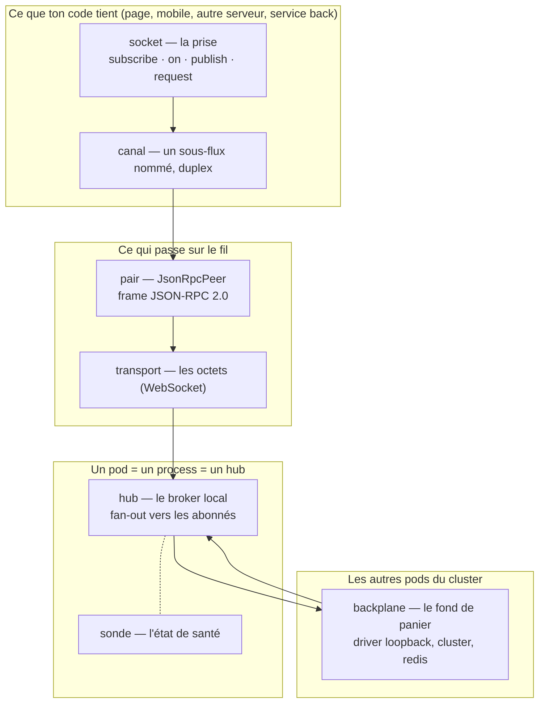

# Vocabulaire — le lexique de la socket Nodefony

> Cette page est le **dictionnaire** du temps réel Nodefony : chaque mot y a une définition, une
> raison d'être ce mot-là, et le symbole du code qui l'incarne. Les cinq autres pages du module
> l'emploient sans le redéfinir. Règle de lecture : quand une discussion realtime s'embrouille,
> demande-toi **de quoi on parle — de la prise, de l'autocom, ou du fond de panier ?** Neuf fois
> sur dix, la confusion tenait à un seul mot.

📍 [Documentation](../../../../../docs/index.md) › [Realtime](index.md) › **Vocabulaire**

## 🧠 Schéma général — où vit chaque mot

Le vocabulaire suit la matière : ce que ton code **tient**, ce qui passe **sur le fil**, ce qui
**aiguille** dans le process, ce qui **franchit** la frontière du process.



## 📖 Lexique — les douze mots à retenir

Les douze mots qui suffisent à lire toute la documentation du module. Les familles plus bas
détaillent le reste du vocabulaire.

| Mot           | Analogie              | En une ligne                                                    | Le symbole              | La carte                                         |
| ------------- | --------------------- | --------------------------------------------------------------- | ----------------------- | ------------------------------------------------ |
| **socket**    | la prise murale       | le handle unique que tient ton code, client **ou** serveur      | `IRealtimeSocket`       | [voir](#socket--la-prise-que-tient-ton-code)     |
| **canal**     | la conférence         | un sous-flux **nommé** et **duplex** multiplexé sur la socket   | nom de chaîne           | [voir](#canal-channel--un-sous-flux-nommé)       |
| **pair**      | le combiné            | le moteur de protocole, **identique** des deux côtés            | `JsonRpcPeer`           | [voir](#pair-peer--le-moteur-de-protocole)       |
| **frame**     | l'enveloppe           | l'unité atomique qui passe sur le fil                           | JSON-RPC 2.0            | [voir](#frame--lunité-qui-passe-sur-le-fil)      |
| **transport** | le câble              | la techno qui porte les octets, interchangeable                 | `IRealtimeTransport`    | [voir](#transport--la-couche-octets)             |
| **hub**       | l'autocom             | le broker **du process** : table des abonnés + fan-out          | `RealtimeHub`           | [voir](#hub--le-broker-du-process)               |
| **fan-out**   | le ventilateur        | une publication, N livraisons aux abonnés                       | `RealtimeHub.publish()` | [voir](#fan-out--une-publication-n-livraisons)   |
| **backplane** | le fond de panier     | le **driver** qui fait franchir la frontière du process         | `IBackplane`            | [voir](#backplane--le-fond-de-panier-du-cluster) |
| **driver**    | la carte enfichée     | l'implémentation choisie du backplane, par son **nom**          | registre de drivers     | [voir](#driver--limplémentation-du-transport)    |
| **sonde**     | l'oscilloscope        | l'état de santé instantané, en JSON                             | `RealtimeHub.probe()`   | [voir](#sonde-probe--létat-de-santé-en-json)     |
| **seam**      | la prise préparée     | le point de greffe qu'une couche haute utilise sans rien casser | hooks du peer et du hub | [voir](#seam--le-point-de-greffe)                |
| **cadence**   | le débit d'un robinet | la fréquence d'un canal d'état, portée par son **nom**          | `rateChannel()`         | [voir](#cadence--la-fréquence-portée-par-le-nom) |

## Qu'est-ce qu'un vocabulaire figé, et pourquoi une page entière ?

Le temps réel est le domaine où les mots glissent le plus : « socket » désigne tour à tour la prise
applicative, la connexion TCP, l'objet `WebSocket` du navigateur et le protocole. Chaque glissement
coûte un malentendu d'architecture.

Nodefony **fige** donc trois séparations, et tout le reste en découle :

1. **La prise n'est pas le câble.** La `socket` est ce que ton code tient ; le `transport` est la
   couche octets. Changer de transport ne change pas une ligne de ton code.
2. **Le broker local n'est pas le bus inter-process.** Le `hub` aiguille dans **un** process ; le
   `backplane` fait franchir la frontière du process. Deux mots, deux étages, deux pannes distinctes.
3. **On nomme le rôle, jamais l'outil.** On dit « le backplane Redis », jamais « le Redis » : Redis
   est un **choix de driver** interchangeable, pas un concept d'architecture.

> [!IMPORTANT]
> **`store` et `driver` ne sont pas synonymes.** Un **store** est l'endroit où vivent des **données**
> (une session, un jeton). Un **driver** est un **flux/transport**. Le backplane realtime est un
> **driver** — il ne conserve rien, il fait passer. Un canal n'a pas d'historique : qui n'était pas
> abonné n'a rien reçu.

## La vision Nodefony — les trois mots qui portent la différence

Trois mots du lexique ne sont pas des synonymes de ce que proposent les autres bibliothèques
temps réel. Ce sont les différenciateurs du framework.

**`socket` est isomorphe.** Le même contrat `IRealtimeSocket` (`IRealtimeSocket.ts:122`) décrit la
prise **côté navigateur** (`RealtimeClient`, `RealtimeClient.ts:161`) **et côté serveur**
(`ServerRealtimeSocket`, `ServerRealtimeSocket.ts:43`). Un service back publie exactement comme une
page front : `publish("chat:room-42", payload)`. Il n'y a pas une API cliente et une API serveur à
apprendre, il y en a **une**.

**`canal` est duplex et multiplexé.** Une connexion porte **N canaux** simultanés, chacun
bidirectionnel, chacun avec son cycle de vie et son compteur d'abonnés. Le backing d'un canal est
**pluggable côté serveur** — pub/sub, encapsulation d'un autre protocole, pont vers TCP/UDP, relais
vers un autre service — et le consommateur ne voit jamais la différence
(`IRealtimeChannel`, `IRealtimeSocket.ts:87`).

**`contrôleur` est le même mot qu'en HTTP.** Un endpoint temps réel est un contrôleur qui étend
`RealtimeController` (`RealtimeController.ts:144`) et porte une route WebSocket : HTTP et WebSocket
vivent dans le **même contexte de contrôleur**. C'est ce qui permet au pont `api.request`
(`RealtimeController.realtimeApiRequest()`, `RealtimeController.ts:219`) de rejouer sur la socket
**la même action** que celle servie en REST.

## 🚀 Démarrage rapide — les mots en situation

Un chat minimal. Chaque terme du lexique apparaît au moins une fois, commenté.

Côté serveur — un **contrôleur** qui déclare un **canal**, un **canal entrant** et une **action RPC** :

```ts
import {
  RealtimeController,
  RealtimeAction,
  RealtimeChannel,
  RealtimeInbound,
  serverSocket,
  type RealtimePublish,
} from "@nodefony/realtime";

export class ChatController extends RealtimeController {
  // Un CANAL : le provider est créé au 1ᵉʳ abonné, son dispose appelé au dernier.
  @RealtimeChannel("chat:room-42", { authenticated: true })
  room42(channel: string, publish: RealtimePublish): () => void {
    const timer = setInterval(() => publish(channel, { ts: Date.now() }), 1000);
    return () => clearInterval(timer);
  }

  // Un CANAL ENTRANT : le client pousse, le serveur répond sur le même canal.
  @RealtimeInbound("chat:send")
  send(params: unknown, reply: (payload: unknown) => void): void {
    const text = (params as { text?: unknown }).text;
    if (typeof text !== "string") return; // entrée client = jamais fiable
    // FAÇADE SERVEUR : un service back publie comme une page front.
    serverSocket().publish("chat:room-42", { text });
    reply({ ok: true });
  }

  // Une ACTION RPC : requête corrélée, le retour devient le `result`.
  @RealtimeAction("chat:ping")
  ping(): { pong: true; ts: number } {
    return { pong: true, ts: Date.now() };
  }

  // BROADCAST : ce préfixe traverse le backplane. Sans cette ligne, le canal
  // reste INSTANCE-LOCAL (défaut sûr) et Bob, sur un autre pod, ne voit rien.
  protected override realtimeBroadcastChannels(): string[] {
    return ["chat:"];
  }
}
```

Côté client — la même **socket**, les quatre verbes :

```ts
import { RealtimeClient } from "nodefony/client";

export async function joinChat(): Promise<void> {
  const socket = new RealtimeClient({ url: "wss://127.0.0.1:5152/chat" });
  await socket.connect();

  socket.subscribe("chat:room-42"); // DEMANDE le flux au pair
  socket.on("chat:room-42", (payload: unknown) => {
    console.log("reçu", payload); // REÇOIT — `on` n'est pas `subscribe`
  });

  socket.publish("chat:send", { text: "salut" }); // ÉMET, sans réponse
  console.log(await socket.request("chat:ping")); // RPC corrélé, avec réponse
}
```

## 🧰 Le lien — ce que ton code tient

| Terme             | En une ligne                                           |
| ----------------- | ------------------------------------------------------ |
| `socket`          | le handle unique, isomorphe client/serveur             |
| `canal`           | un sous-flux nommé, duplex, multiplexé                 |
| `abonnement`      | demander au pair de pousser un canal                   |
| `réception`       | brancher un handler local — n'ouvre aucun flux         |
| `publication`     | émettre sur un canal, sans attendre de réponse         |
| `action RPC`      | appel corrélé qui rend une valeur                      |
| `canal entrant`   | canal où le **client** a le droit de pousser           |
| `handle de canal` | la vue objet d'un canal (nom, nature, cycle de vie)    |
| `client`          | l'implémentation navigateur de la socket               |
| `façade serveur`  | l'implémentation serveur de la même socket             |
| `accueil`         | la première frame reçue : protocole, canaux, identité  |
| `identité`        | qui est la connexion, telle que le serveur l'a résolue |

### `socket` — la prise que tient ton code

Le **handle unique** manipulé par le code applicatif : quatre verbes (`subscribe`, `on`, `publish`,
`request`) et une vue par canal. Le mot vient de la prise murale : on branche, on ignore le câblage.

Contrat isomorphe `IRealtimeSocket` (`IRealtimeSocket.ts:122`), implémenté côté navigateur par
`RealtimeClient` (`RealtimeClient.ts:161`) et côté serveur par `ServerRealtimeSocket`
(`ServerRealtimeSocket.ts:43`). ⚠️ La socket **n'est pas** le [transport](#transport--la-couche-octets).

→ [Architecture](./architecture.md) pour la pile complète.

### `canal` (channel) — un sous-flux nommé

Un **tuyau bidirectionnel nommé**, multiplexé sur la connexion : `"chat:room-42"`,
`"orm:health"`, `"realtime:health"`. Convention de nommage par `:` (espace de noms, puis
précision). Ce n'est pas une classe — c'est une **chaîne de caractères indexée par le hub**.

`RealtimeHub.subscribe()` (`RealtimeHub.ts:246`) l'indexe ; `IRealtimeSocket.subscribe()`
(`IRealtimeSocket.ts:132`) le demande. Plusieurs canaux cohabitent sur **une** connexion : c'est le
multiplexage.

### `abonnement` (subscribe) — demander le flux

**Ref-compté** : la demande part vers le pair au **premier** consommateur seulement, et le flux se
coupe au **dernier** désabonnement. Réémise automatiquement à chaque reconnexion.

`IRealtimeSocket.subscribe()` (`IRealtimeSocket.ts:132`). Le plafond par connexion est réglable
(`limits.maxChannelsPerConnection`, `config.ts:105`) — au-delà, le canal n'est pas ouvert.

### `réception` (on) — brancher un handler

`on(channel, handler)` **branche un écouteur local** et rend un `dispose`. C'est le faux-ami n°1 du
module : `on` ne demande rien au serveur, `subscribe` si. S'abonner sans écouter reçoit des frames
que personne ne lit ; écouter sans s'abonner n'en reçoit aucune.

`IRealtimeSocket.on(channel, handler)` (`IRealtimeSocket.ts:141`).

### `publication` (publish) — émettre sans réponse

Émettre une charge sur un canal, sans corrélation ni accusé. **La cible dépend du côté** : depuis le
client, la charge part vers le serveur (un seul pair) ; depuis le serveur, elle part en
[fan-out](#fan-out--une-publication-n-livraisons) vers tous les abonnés.

`IRealtimeSocket.publish()` (`IRealtimeSocket.ts:160`), `RealtimeHub.publish()` (`RealtimeHub.ts:315`).

### `action RPC` (request) — l'appel corrélé

L'appel qui **attend une réponse** : une `Promise` résolue avec le `result`, rejetée sur `error` ou
sur expiration. Déclarée côté serveur par `@RealtimeAction` (`realtimeDecorators.ts:101`), appelée
côté client par `request()` (`IRealtimeSocket.ts:166`).

Un handler qui lève une erreur rend un `-32603` **générique** ; seule une `RpcError`
(`JsonRpcPeer.ts:70`) choisit ce qu'elle expose au pair.

### `canal entrant` (inbound) — le client pousse

Un canal où le **client a le droit d'émettre** vers le serveur. Défaut sûr : **aucun**. Un canal
n'accepte d'entrée que déclaré explicitement, par `@RealtimeInbound` (`realtimeDecorators.ts:182`) ou
par l'override `realtimeInbound()` (`RealtimeController.ts:205`).

Le handler reçoit `(params, reply)` — `params` vient du réseau, donc **jamais fiable** :
`RealtimeInboundHandler` (`IRealtimeController.ts:16`).

### `handle de canal` — la vue objet d'un canal

`socket.channel(name)` rend un objet qui porte le **nom** du canal, sa **nature** (`kind` :
`pubsub`, `protocol`, `bridge`, `proxy`) et son cycle de vie (`open`/`close`/`send`/`on`). C'est le
point d'accroche des canaux à état — un appel SIP, une connexion pontée.

`IRealtimeChannel` (`IRealtimeSocket.ts:87`), `channel()` (`IRealtimeSocket.ts:178`).

### `client` — la socket côté navigateur

`RealtimeClient` (`RealtimeClient.ts:161`) : reconnexion automatique, réémission des abonnements,
compteurs par canal, heartbeat. Publié dans le sous-chemin `nodefony/client` du cœur — donc
importable **sans** aucune dépendance serveur, ce qui est la condition de l'isomorphisme.

→ Les crochets React (`useNodefony`, `useNodefonyChannel`) vivent dans `nodefony/react`.

### `façade serveur` — la même socket, côté back

`ServerRealtimeSocket` (`ServerRealtimeSocket.ts:43`), obtenue par `serverSocket()`
(`ServerRealtimeSocket.ts:223`) : un service métier tient un handle et publie **comme une page
front**. Une différence assumée : `request()` n'y est pas supporté — au-dessus du hub il n'y a pas
**un** pair mais N clients. Pour un appel serveur → un client précis, c'est `requestClient()`
(`RealtimeController.ts:263`).

### `accueil` (welcome) — la première frame

La notification `realtime:welcome`, poussée par le serveur juste après le handshake. Elle annonce le
protocole, les canaux et actions **découvrables** de l'endpoint, et l'identité résolue. Un client
attend cette frame avant de pousser quoi que ce soit.

`IRealtimeWelcome` (`RealtimeEventMap.ts:204`).

### `identité` — qui est cette connexion

La vue « sur soi » d'une connexion : type de jeton, authentifié ou non, identifiant, rôles, scopes.
Aucun secret — seulement ce que le porteur sait déjà de lui-même. Elle est **résolue une fois** au
handshake, jamais renégociée par frame.

`RealtimeIdentity` (`RealtimeEventMap.ts:185`).

## 🏗️ Le serveur — ce qui aiguille derrière la prise

| Terme                   | En une ligne                                                         |
| ----------------------- | -------------------------------------------------------------------- |
| `hub`                   | le broker du process : table des abonnés + fan-out                   |
| `fan-out`               | une publication, N livraisons                                        |
| `sink`                  | le point de livraison d'**une** connexion sur un canal               |
| `provider`              | ce qui **produit** les messages d'un canal, partagé par les abonnés  |
| `canal partagé`         | un provider par canal et par pod, pas un par connexion               |
| `canal système`         | canal servi par la plateforme, sans qu'aucun contrôleur le connaisse |
| `canal broadcast`       | canal déclaré pour traverser le backplane                            |
| `canal instance-local`  | le défaut : le canal ne quitte jamais le process                     |
| `contrôleur temps réel` | l'endpoint WebSocket, écrit comme un contrôleur HTTP                 |
| `service realtime`      | la façade d'injection du hub                                         |
| `pont API`              | rejouer une route HTTP sur la socket, même action, même garde        |

### `hub` — le broker du process

Le **standard téléphonique** du pod : il tient la table « canal → abonnés locaux » et diffuse. Un
process = un hub, obtenu par `getRealtimeHub()` (`RealtimeHub.ts:849`). Il ne connaît **ni** les
contrôleurs, **ni** le métier : ce sont les providers qui portent les dépendances.

`RealtimeHub` (`RealtimeHub.ts:139`). ⚠️ « hub » désigne **toujours** le serveur ; ce que tient le
code applicatif s'appelle une [socket](#socket--la-prise-que-tient-ton-code).

### `fan-out` — une publication, N livraisons

L'action de diffuser : une charge publiée sur un canal part vers **tous** les sinks abonnés
localement. Une connexion fautive ne casse pas la diffusion aux autres — chaque livraison est isolée.

`RealtimeHub.publish()` (`RealtimeHub.ts:315`) pour le chemin complet, `publishLocal()`
(`RealtimeHub.ts:334`) pour la diffusion **strictement locale** (voie d'entrée du backplane).

### `sink` — le point de livraison d'une connexion

Un `sink` = **une** connexion sur **un** canal : la fonction qui pousse la charge vers son pair. Le
mot vient du couple source/puits : le provider est la source, le sink le puits.

`ChannelSink` (`RealtimeHub.ts:84`). Le nombre de sinks d'un canal est son nombre d'abonnés locaux.

### `provider` — ce qui produit un canal

La fabrique appelée **au premier abonné** d'un canal, qui démarre ce qui produit les messages (un
ticker, un écouteur) et rend son `dispose`, appelé **au dernier désabonné**. Zéro abonné = zéro
timer.

`ChannelFactory` (`RealtimeHub.ts:93`). ⚠️ Un provider est **partagé** : il survit à la connexion qui
l'a créé — n'y capturer que des dépendances à longue vie, jamais le contexte d'une connexion.

### `canal partagé` — un provider par canal et par pod

Le modèle de coût du module : là où une implémentation naïve crée un ticker **par connexion**,
Nodefony en crée **un par canal et par pod** et se contente d'ajouter un sink par abonné. Mille
spectateurs d'un tableau de bord coûtent un timer, pas mille.

`RealtimeHub.subscribe()` (`RealtimeHub.ts:246`).

### `canal système` — servi par la plateforme

Un canal dont la fabrique est déclarée par un module bas niveau (le journal d'audit, par exemple), et
qui devient servable par **n'importe quel** endpoint, présent ou futur, sans qu'aucun contrôleur ne
le connaisse. Consulté seulement quand la fabrique du contrôleur a dit « inconnu ».

`RealtimeHub.registerSystemChannel()` (`RealtimeHub.ts:741`).

### `canal broadcast` — celui qui traverse le backplane

Un canal **déclaré** comme franchissant la frontière du process : chat, présence, notifications. La
déclaration se fait par **préfixe**, ce qui couvre les variantes de cadence (`chat:` couvre
`chat:room-42:1000`).

`RealtimeHub.markBroadcastChannel()` (`RealtimeHub.ts:365`), déclaré côté contrôleur par
`realtimeBroadcastChannels()` (`RealtimeController.ts:195`).

### `canal instance-local` — le défaut

Tout canal **non déclaré** broadcast reste dans son process. C'est voulu : les canaux
d'observabilité (journaux, sondes, état interne) décrivent **ce pod**, et les agréger silencieusement
serait à la fois faux et une fuite. Traverser le process est une capacité qu'un canal **demande**.

Politique de forward du hub — `#broadcastPrefixes` (`RealtimeHub.ts:236`).

### `contrôleur temps réel` — l'endpoint WebSocket

La classe de base d'un endpoint : elle porte tout le protocole (handshake, accueil, discrimination
des frames, cycle de vie des canaux) et ne laisse au métier que ses canaux et ses actions.

`RealtimeController` (`RealtimeController.ts:144`), point d'entrée `handleRealtime()`
(`RealtimeController.ts:233`). C'est un **contrôleur** au sens habituel de Nodefony : la même classe
peut porter des routes HTTP.

### `service realtime` — la façade d'injection

Le service exposé au conteneur sous le nom `realtimeService` : `publish`, `subscribe`, `probe`, la
config gelée. C'est l'API stable pour le code utilisateur, quand `getRealtimeHub()` est l'accès
interne.

`RealtimeService` (`RealtimeService.ts:48`).

### `pont API` — la même action, sur la socket

L'option qui expose la méthode `api.request { path }` : la connexion rejoue **la même action de
contrôleur** que celle servie en REST, avec **la même garde**. Le pont n'atteint que les routes qui
déclarent explicitement le transport WebSocket — aucun contournement possible.

`realtimeApiRequest()` (`RealtimeController.ts:219`), mise en œuvre `invokeApiRequest()`
(`RealtimeController.ts:679`). Désactivé par défaut.

## 🔌 Le protocole et le transport — ce qui passe sur le fil

| Terme          | En une ligne                                               |
| -------------- | ---------------------------------------------------------- |
| `frame`        | l'unité atomique qui passe sur le fil                      |
| `pair`         | le moteur de protocole, identique client et serveur        |
| `requête`      | frame avec `method` **et** `id` — appelle une réponse      |
| `notification` | frame avec `method` seul — sans réponse                    |
| `réponse`      | frame avec `id` seul — résout une requête en attente       |
| `dispatch`     | classer une frame entrante puis la router vers son handler |
| `transport`    | la couche octets, interchangeable                          |
| `enveloppe`    | joindre des métadonnées serveur à côté du résultat         |
| `cadence`      | la fréquence d'un canal d'état, portée par son nom         |
| `AIMD`         | l'auto-ajustement de cadence face à un client lent         |

### `frame` — l'unité qui passe sur le fil

Une enveloppe JSON-RPC 2.0. Sa **nature se lit sur `method`**, pas sur `id` : `method` + `id` =
requête, `method` seul = notification, `id` seul = réponse. Tout le reste est invalide.

`JsonRpcFrameKind` (`JsonRpcPeer.ts:133`). Le classement est fait par `JsonRpcPeer.receive()`
(`JsonRpcPeer.ts:371`), qui **ne lève jamais**.

### `pair` (peer) — le moteur de protocole

Client et serveur sont des **pairs** : classer une frame, router, corréler les réponses est le même
travail des deux côtés. Nodefony l'écrit **une seule fois** ; chaque côté l'entoure de son transport
et de ses handlers. Aucune dépendance Node — le même fichier tourne dans le navigateur.

`JsonRpcPeer` (`JsonRpcPeer.ts:271`), contrat `IRealtimePeer` (`JsonRpcPeer.ts:213`).

### `dispatch` — classer puis router

Le geste du pair sur une frame entrante : décider de sa nature, trouver le handler, l'appeler,
renvoyer la réponse s'il en faut une. Ce n'est pas une méthode publique — c'est un **moment**, et
c'est précisément là que se greffe le [verrou de frame](#verrou-de-frame--la-décision-par-frame),
par le crochet `beforeDispatch` (`JsonRpcPeer.ts:172`).

### `transport` — la couche octets

La techno réseau qui porte les frames, **interchangeable** : `WsConnectionTransport`
(`WsConnectionTransport.ts:46`) côté serveur, `BrowserWsTransport` (`BrowserWsTransport.ts:12`) côté
navigateur. Le pair ignore laquelle est branchée.

Contrat `IRealtimeTransport` (`IRealtimeTransport.ts:34`). ⚠️ C'est **le seul** endroit du lexique où
« socket » pourrait désigner la connexion réseau : ici, ce mot est réservé à la
[prise applicative](#socket--la-prise-que-tient-ton-code).

### `enveloppe` — la méta à côté du résultat

Quand un handler veut joindre des métadonnées serveur à sa réponse, il rend une enveloppe : le
`result` reste **exactement** ce que rendrait la même route en REST, et la méta voyage dans un champ
frère. Un pair qui n'en connaît pas les clés les ignore.

`RpcEnvelope` (`JsonRpcPeer.ts:104`), `RpcMeta` (`JsonRpcPeer.ts:90`).

### `cadence` — la fréquence portée par le nom

La fréquence d'un canal d'état vit **dans son nom** : `orm:health` = cadence par défaut,
`orm:health:2000` = un rythme explicite. Conséquence voulue : **un canal, une cadence, un
comptage** — deux cadences sont deux canaux, jamais réconciliés.

`rateChannel()` (`channelRate.ts:44`) côté client, `parseRate()` (`channelRate.ts:63`) côté serveur —
même fichier, donc même règle des deux côtés.

### `AIMD` — s'ajuster au client lent

_Additive Increase, Multiplicative Decrease_ : accélérer par petits pas quand tout va bien, freiner
d'un coup à la moindre congestion. Le principe de régulation de TCP, appliqué **par canal** à partir
de ce qui reste en attente dans la connexion.

`AdaptiveRate` (`AdaptiveRate.ts:78`), liaison sur un canal par `bindAdaptiveChannel()`
(`AdaptiveRate.ts:239`).

## 🧩 Le cluster — franchir la frontière du process

| Terme       | En une ligne                                                  |
| ----------- | ------------------------------------------------------------- |
| `backplane` | le bus qui propage les publications entre process             |
| `driver`    | l'implémentation du backplane, choisie par son nom            |
| `loopback`  | le driver « rien à transporter » : un seul process            |
| `cluster`   | le driver entre workers d'une même machine                    |
| `redis`     | le driver multi-machine, en pub/sub                           |
| `origine`   | l'identité du process émetteur, qui rend l'anti-écho possible |
| `anti-écho` | ne jamais rejouer localement ce qu'on vient d'émettre         |
| `cloison`   | l'espace de noms qui empêche deux applications de se parler   |
| `cross-pod` | la propriété d'un driver : sait-il franchir la machine ?      |

### `backplane` — le fond de panier du cluster

Le **fond de panier** d'un rack : la carte qui relie toutes les autres. Ici, le bus qui propage les
publications d'un process aux autres. Un contrat volontairement minuscule — `publish`, `onMessage`,
`start`, `stop`, `describe` — parce que tout ce qui est riche appartient au hub.

`IBackplane` (`IBackplane.ts:75`), message `IBackplaneMessage` (`IBackplane.ts:34`), branchement
`RealtimeHub.setBackplane()` (`RealtimeHub.ts:395`).

> [!TIP]
> C'est la pièce qui tient la promesse « une ligne de configuration change tout » : le hub **ne sait
> pas** qu'il est en cluster. Il publie, le backplane se débrouille.

### `driver` — l'implémentation du transport

Le backplane est un **contrat** ; un driver en est une réalisation, désignée par son **nom** dans la
configuration (`backplane.driver`, `config.ts:47`). Un registre associe nom → fabrique : aucune
cascade de conditions, et n'importe qui peut enregistrer le sien.

`registerBackplaneDriver()` (`backplaneRegistry.ts:55`), `listBackplaneDrivers()`
(`backplaneRegistry.ts:68`). Un nom inconnu au démarrage n'arrête rien : le hub reste local, avec un
avertissement.

### `loopback` — un seul process

Le driver du cas mono-process : il n'y a **rien à transporter**, le hub fait tout localement. C'est
le défaut, et il ne coûte rien.

`LoopbackBackplane` (`LoopbackBackplane.ts:24`).

### `cluster` — entre workers d'une machine

Le driver qui relie les workers d'un même hôte par le canal de communication inter-process de Node.
Multi-process sans aucune infrastructure à installer.

`ClusterBackplane` (`ClusterBackplane.ts:89`).

### `redis` — entre machines

Le driver qui propage les publications en pub/sub, donc entre pods de machines différentes. Il
consomme les connexions du module Redis — jamais une dépendance directe. Absent ou injoignable, le
hub reste local et le démarrage continue.

`RedisBackplane` (`RedisBackplane.ts:161`), canal `resolveRedisChannel()` (`RedisBackplane.ts:31`).

### `origine` (originId) — qui a émis

L'identifiant **unique dans le cluster** du process émetteur, joint à chaque message. Il est dérivé
du nom du pod ou de l'hôte, jamais du seul identifiant de processus : deux conteneurs peuvent tous
deux être le processus n° 1.

`resolveBackplaneOriginId()` (`originId.ts:24`), champ `IBackplane.originId` (`IBackplane.ts:77`).

### `anti-écho` — ne pas rejouer sa propre voix

La règle qui empêche les tempêtes : un message **reçu** du backplane est réinjecté en diffusion
**locale seulement**, jamais renvoyé sur le bus ; et un message qui porte sa propre origine est
ignoré à l'arrivée. Sans l'origine, l'anti-écho ferait taire le voisin au lieu de soi-même.

`RealtimeHub.publishLocal()` (`RealtimeHub.ts:334`).

### `cloison` (namespace) — deux applications, un même bus

Le suffixe qui isole les canaux d'une application sur un transport mutualisé. Nécessaire parce que le
numéro de base d'un serveur Redis **ne cloisonne pas** le pub/sub : sans cloison, deux déploiements
partageant le même serveur se parleraient.

`backplane.namespace` (`config.ts:59`), constante de base `REDIS_RT_CHANNEL`
(`RedisBackplane.ts:20`).

### `cross-pod` — la propriété qui compte

L'information que chaque driver déclare sur lui-même : sait-il franchir la machine ? Elle apparaît
dans la carte d'identité du backplane, journalisée au démarrage et lisible dans la sonde — c'est ce
qui permet de vérifier en une ligne qu'un déploiement diffuse bien au-delà d'un pod.

`IBackplaneInfo` (`IBackplane.ts:57`).

## 🔐 La sécurité — qui parle, qui a le droit

| Terme                | En une ligne                                                     |
| -------------------- | ---------------------------------------------------------------- |
| `handshake`          | la poignée de main d'ouverture, où tout se décide                |
| `authenticator`      | la stratégie qui transforme un handshake en identité             |
| `matcher`            | le sélecteur qui dit quel authenticator capture quelle connexion |
| `jeton`              | l'identité résolue, figée pour la durée de la connexion          |
| `politique de canal` | ce qu'un canal exige de son abonné                               |
| `verrou de frame`    | la décision « cette frame passe-t-elle ? »                       |
| `contrôle d'origine` | refuser une ouverture venue d'un site tiers                      |
| `révocation`         | fermer une connexion dont l'identité n'est plus valable          |
| `refus`              | rendre un refus visible côté client                              |
| `audit de frame`     | tracer les événements notables du protocole                      |
| `seam`               | le point de greffe prévu pour une couche supérieure              |
| `plafond de canaux`  | la borne anti-saturation par connexion                           |

### `handshake` — la poignée de main

Le moment de l'ouverture : c'est **là**, et une seule fois, que l'origine est contrôlée, que
l'authenticator tourne et que l'identité est figée. Tout ce qui coûte cher se paie ici, jamais par
frame.

DTO neutre `IRealtimeHandshake` (`IRealtimeHandshake.ts:14`) — en-têtes, cookies, URL, origine,
sous-protocoles. Traitement dans `onHandshake()` (`RealtimeController.ts:312`).

### `authenticator` — du handshake à l'identité

La stratégie qui transforme une poignée de main en identité : `supports` (est-ce mon cas ?),
`authenticate` (voici le jeton), `onSuccess` / `onFailure`. Exactement le motif des authenticators
HTTP — un seul modèle mental pour les deux transports.

`IRealtimeAuthenticator` (`IRealtimeAuthenticator.ts:24`), enregistrement
`RealtimeHub.useAuthenticator()` (`RealtimeHub.ts:579`).

### `matcher` — qui capture quoi

Le sélecteur (motif d'URL, hôte optionnel) qui décide **quel** authenticator prend la connexion. Le
**premier** qui capture gagne : on enregistre donc du plus spécifique au plus général.

`IRealtimeAuthenticatorMatcher` (`IRealtimeAuthenticatorMatcher.ts:25`), résolution
`resolveAuthenticator()` (`RealtimeHub.ts:597`).

### `jeton` (token) — l'identité figée

Ce que l'authenticator produit : type, identifiant, rôles, scopes, et parfois une méthode de
re-validation. Il est mis en cache sur la connexion et **jamais** recalculé par frame.

`IRealtimeToken` (`IRealtimeToken.ts:18`). La lecture ne rend **jamais** `null` : sans authenticator,
c'est le jeton anonyme gelé `ANONYMOUS_REALTIME_TOKEN` (`AnonymousRealtimeToken.ts:18`) qui répond —
un refus a donc toujours un auteur identifiable.

### `politique de canal` — ce qu'un canal exige

Les exigences déclarées d'un canal : authentifié, rôles, scopes. Elles s'attachent au **nom** du
canal, pas à la méthode qui l'implémente — parce que c'est le nom que le pare-feu résout.

`IChannelPolicy` (`IChannelPolicy.ts:20`), déclaration par `@RealtimeChannel`
(`realtimeDecorators.ts:142`), résolution `resolveChannelPolicy()` (`RealtimeHub.ts:725`).

### `verrou de frame` — la décision par frame

La fonction qui répond « cette frame passe-t-elle ? » à partir du jeton **déjà** en cache.
**Synchrone par doctrine** : attendre une réponse distante à chaque frame sérialiserait le flux d'une
connexion. Un contrôle qui doit interroger le réseau se fait au handshake, pas ici.

`FrameAuthorizer` (`RealtimeHub.ts:39`), pose `setFrameAuthorizer()` (`RealtimeHub.ts:675`), appel
`runAuthorizer()` (`RealtimeHub.ts:758`).

### `contrôle d'origine` — la défense d'ouverture

Le contrôle de l'en-tête `Origin` à l'ouverture (RFC 6455 §10.2) : un site tiers ne doit pas pouvoir
ouvrir une connexion authentifiée dans le dos de l'utilisateur. Correspondance **exacte**, aucun
caractère générique.

`OriginGuard` (`RealtimeHub.ts:25`), configuration `csrf.checkOrigin` (`config.ts:125`).

### `révocation` — la connexion qui survit à sa session

Le problème que ce mot nomme : une connexion ouverte pourrait survivre à la session qui l'a
autorisée, puisque le verrou de frame ne relit rien. Un contrôle périodique referme l'écart en
re-validant les identités révocables et en fermant celles qui ne valent plus.

`registerRevocable()` (`RealtimeHub.ts:433`), `revalidateRevocable()` (`RealtimeHub.ts:464`), période
`REVOCATION_REVALIDATE_MS` (`RealtimeHub.ts:68`). Une re-validation en erreur **ferme** — jamais
l'inverse.

### `refus` (denied) — rendre le « non » visible

Une notification refusée serait abandonnée en silence, laissant le client aveugle. Le serveur pousse
donc `realtime:denied`. Le motif est **générique** : jamais le rôle ou le scope manquant, qui
transformerait le refus en oracle d'autorisation.

`IRealtimeDenied` (`RealtimeEventMap.ts:228`), conversion en message d'interface `deniedToNotice()`
(`notice.ts:45`).

### `audit de frame` — tracer le notable

Le signal émis sur les événements protocolaires qui méritent une trace : frame invalide, frame
refusée, méthode inconnue, erreur interne. Émis sans attente, avec le pair — ce qui permet de
retrouver **qui** a été refusé, pas seulement d'où venait le paquet.

`FrameAuditReason` (`JsonRpcPeer.ts:143`), crochet `onFrameAudit` (`JsonRpcPeer.ts:190`).

### `seam` — le point de greffe

Littéralement une **couture** : un point prévu dans une couche basse pour qu'une couche haute y
greffe du comportement **sans modifier la couche basse**. Le module en expose cinq, et c'est ce qui
permet à la couche sécurité de se brancher sans qu'aucune ligne de realtime ne la connaisse.

Les deux du protocole sont `beforeDispatch` (`JsonRpcPeer.ts:172`) et `onFrameAudit`
(`JsonRpcPeer.ts:190`) ; les trois du hub sont l'authenticator, le matcher et le contrôle d'origine.

→ [Sécurité](./securite.md) pour le détail de chacun.

### `plafond de canaux` — la borne anti-saturation

Le nombre maximal de canaux qu'**une** connexion peut ouvrir. Chaque canal ouvert coûte des
ressources ; sans borne, une seule connexion peut les épuiser. Au-delà, l'abonnement est refusé et le
client en est informé.

`limits.maxChannelsPerConnection` (`config.ts:105`), pose `setMaxChannelsPerConnection()`
(`RealtimeHub.ts:631`).

## 📡 L'observabilité — ce que la socket dit d'elle-même

| Terme                   | En une ligne                                            |
| ----------------------- | ------------------------------------------------------- |
| `sonde`                 | l'état de santé instantané, en JSON                     |
| `back-pressure`         | ce qui attend d'être envoyé sur une connexion           |
| `consommateur lent`     | la connexion qui n'absorbe plus assez vite              |
| `compteurs de canal`    | les compteurs par canal, mesurés à l'arrivée des frames |
| `santé agrégée`         | la vue de tous les workers d'un pod, fusionnée          |
| `plan de données admin` | l'endpoint qui sert la sonde à Studio                   |

### `sonde` (probe) — l'état de santé en JSON

L'oscilloscope du module : « voici mon état, maintenant ». Canaux et abonnés, publications et
livraisons, connexions, octets, back-pressure, carte d'identité du backplane. Lecture **pure**, sans
allocation sur le chemin chaud.

`RealtimeHub.probe()` (`RealtimeHub.ts:503`) rend un `IRealtimeProbe` (`IRealtimeProbe.ts:61`).

> [!WARNING]
> `IRealtimeProbe` est la **forme des données**, pas une interface à implémenter avec une méthode
> `probe()`. La méthode appartient au hub ; l'interface décrit ce qu'elle rend.

### `back-pressure` — ce qui attend sur le fil

La quantité d'octets déjà remise au transport mais pas encore partie. C'est le signal de saturation
n° 1 : il monte quand le client n'absorbe plus. Deux seuils distincts existent — un pour **compter**
(la sonde), un pour **agir** (abandonner des frames, puis fermer).

Seuil de comptage `SLOW_CONSUMER_BYTES` (`RealtimeHub.ts:56`), seuils d'action
`BACKPRESSURE_DROP_BYTES` et `BACKPRESSURE_CLOSE_BYTES` (`WsConnectionTransport.ts:32`).

### `consommateur lent` — la connexion qui décroche

Une connexion dont le back-pressure dépasse le seuil de comptage. C'est une **métrique**, pas une
sanction : le seuil de comptage se règle indépendamment des seuils d'action.

`slowConsumer.bytes` (`config.ts:84`), champ `backpressure.slowConsumers`
(`IRealtimeProbe.ts:81`).

### `compteurs de canal` — mesurés à l'arrivée

Nombre de messages, date du dernier, débit instantané, historique glissant — par canal, calculés au
point d'arrivée des frames, donc réutilisables par n'importe quelle application.

`IChannelStats` (`IRealtimeSocket.ts:64`), côté serveur `IRealtimeChannelStat`
(`IRealtimeProbe.ts:47`).

### `santé agrégée` — la vue du pod entier

En multi-worker, chaque process a **sa** sonde. La vue du pod est leur fusion : cumuls additionnés,
maxima repris au plus haut, instances listées une à une.

`mergeClusterHealth()` (`ClusterProbeClient.ts:46`), forme `IRealtimeClusterHealth`
(`IRealtimeProbe.ts:155`).

### `plan de données admin` — la sonde servie à Studio

Le producteur qui expose la sonde sous `/nodefony/realtime/api/health`, selon la convention de
routage des administrations de modules. C'est de l'**auto-observabilité** : la socket se regarde
elle-même par le même chemin que les autres modules.

`createRealtimeAdminApi()` (`RealtimeAdminApi.ts:91`), construction `buildOwnHealth()`
(`RealtimeAdminApi.ts:52`).

## ⚠️ Pièges — les faux-amis du vocabulaire

| Symptôme                                                           | Cause — le mot pris pour un autre                                                                                     | Correction                                                                             |
| ------------------------------------------------------------------ | --------------------------------------------------------------------------------------------------------------------- | -------------------------------------------------------------------------------------- |
| « Je suis abonné mais je ne reçois rien »                          | `subscribe` confondu avec `on` : le flux est demandé, aucun écouteur ne le lit                                        | Les deux : `subscribe(canal)` **et** `on(canal, handler)` (`IRealtimeSocket.ts:141`)   |
| « Ça marche en local, plus rien dès qu'on passe à plusieurs pods » | canal resté **instance-local** — le défaut. Traverser le process est une capacité qu'on **demande**                   | Déclarer le préfixe dans `realtimeBroadcastChannels()` (`RealtimeController.ts:195`)   |
| « Le client publie, le serveur ignore »                            | canal non déclaré **entrant**. Un client ne peut rien pousser tant qu'aucun handler n'existe                          | `@RealtimeInbound("mon:canal")` (`realtimeDecorators.ts:182`)                          |
| Deux déploiements se mélangent sur un même serveur Redis           | pas de **cloison** — le numéro de base ne cloisonne pas le pub/sub                                                    | Poser `backplane.namespace` (`config.ts:59`)                                           |
| Le fan-out disparaît entre conteneurs identiques                   | **origine** dérivée du seul identifiant de processus : deux conteneurs sont tous deux le n° 1, l'anti-écho avale tout | `resolveBackplaneOriginId()` (`originId.ts:24`) dérive du pod ou de l'hôte             |
| Deux tickers pour le même tableau de bord                          | **cadence** différente = **canal** différent, jamais réconcilié                                                       | Fabriquer le nom via `rateChannel()` (`channelRate.ts:44`) des deux côtés              |
| Un canal se croit protégé mais laisse tout passer                  | **politique** déclarée sans **verrou de frame** posé pour la faire respecter                                          | Le hub le détecte et avertit : `hasUnenforcedChannelPolicies()` (`RealtimeHub.ts:696`) |
| Une connexion garde ses flux après une déconnexion applicative     | le **verrou de frame** ne relit rien : par construction, il ne voit pas la session mourir                             | Inscrire l'identité au registre de **révocation** (`RealtimeHub.ts:433`)               |
| « Le provider a planté après la fermeture d'un onglet »            | **provider** confondu avec **sink** : le provider est partagé, il survit à la connexion créatrice                     | N'y capturer que des dépendances à longue vie (`ChannelFactory`, `RealtimeHub.ts:93`)  |
| « Notre store realtime est indisponible »                          | **store** employé pour **driver** : le backplane ne conserve rien, il fait passer                                     | Dire « le driver de backplane » — les données ont des stores, les flux ont des drivers |

> [!CAUTION]
> Deux mots à ne jamais intervertir en réunion : le **hub** tombe et **un** pod perd sa diffusion ;
> le **backplane** tombe et **tous** les pods se retrouvent isolés — chacun continuant à servir ses
> propres abonnés, sans le savoir. Même symptôme côté utilisateur, causes et remèdes opposés.

## 🧪 Tests & couverture

Le vocabulaire n'a pas de tests propres : chaque mot est vérifié par les tests du symbole qu'il
désigne. Les familles présentes dans le module — les chiffres exacts vivent dans la carte de
l'aperçu, régénérée depuis vitest et jamais figée ici :

- **unitaires** : le hub (`RealtimeHub.test.ts`), sa surface sécurité
  (`RealtimeHubSecurity.test.ts`), le contrôleur, le service, les drivers de backplane, le registre,
  l'origine, les décorateurs, le transport ;
- **intégration** : le driver Redis contre un serveur réel ;
- **bout en bout** : boucle locale, chemins de contrôleur, autorisation de canal, câblage du
  pare-feu, cluster par communication inter-process, cluster Redis ;
- **attaque** : plafond de canaux, révocation, politique non appliquée — les trois pièges de sécurité
  du lexique ont chacun leur banc hostile.

Couverture : `npm run coverage` dans `@nodefony/realtime`.

## 🔗 Pour aller plus loin

- ⬆️ **Retour au hub** : [Realtime — vue d'ensemble](index.md) · [Toute la documentation](../../../../../docs/index.md)
- [Architecture](./architecture.md) — la pile complète et le trajet d'une frame, mot après mot.
- [Sécurité](./securite.md) — les points de greffe, le handshake, le verrou de frame en détail.
- [Configuration](./configuration.md) — driver, cloison, bornes : les mots devenus options.
- [Cookbook chat](./cookbook-chat.md) — tout le vocabulaire mis en œuvre d'un bout à l'autre.
- [Lexique sécurité](../../security/docs/lexique.md) — les sigles d'authentification et
  d'autorisation employés par la famille sécurité de cette page.
