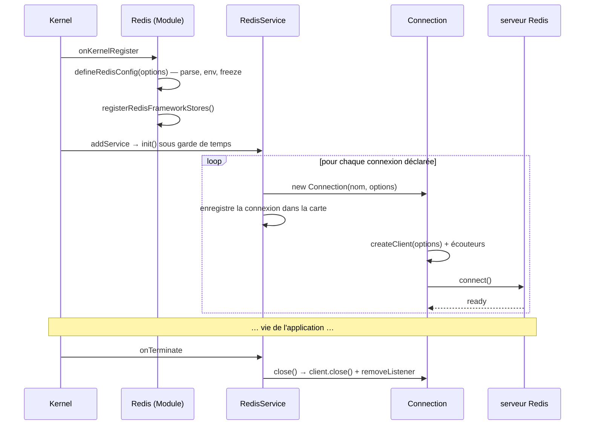
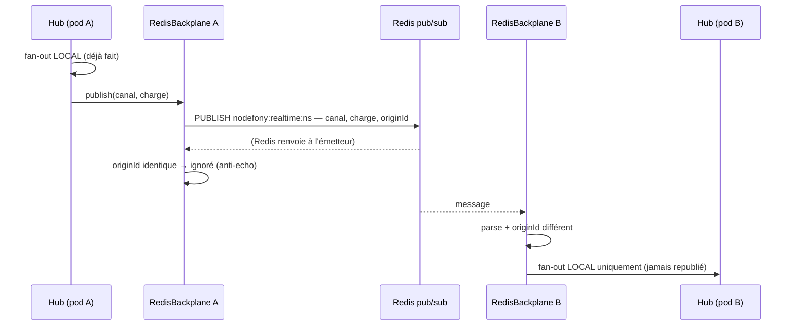

# Architecture interne de @nodefony/redis

> Ce module n'est pas un magasin : c'est un **fournisseur de connexions**. Il ouvre N sockets Redis
> nommées au démarrage, les surveille, les referme proprement — et les prête à quatre locataires qui
> ne se connaissent pas : les sessions, les jetons, les passkeys, l'idempotence. Un cinquième, le
> temps réel, ne stocke rien et se sert du pub/sub. Cette page décrit ce qui se passe **dedans** :
> le cycle de vie d'une connexion, les structures de données réellement écrites dans Redis, ce que
> le module fait le jour où Redis tombe, et ce que l'énumération d'administration sait — ou refuse
> de savoir.

📍 [Documentation](../../../../../docs/index.md) › [@nodefony/redis](index.md) › **Architecture interne**

## 🧠 Le modèle mental — un tuyau, quatre locataires

Le module se lit de haut en bas comme une canalisation. En haut, une **classe de module** qui valide
la configuration au démarrage. Au milieu, un **service** qui tient la carte des connexions ouvertes.
En bas, des **enveloppes de connexion** qui possèdent chacune un client de la bibliothèque `redis`.

Le point important de ce schéma : **les stores ne sont pas dans la canalisation**, ils sont branchés
dessus. Aucun d'eux n'ouvre de socket ; tous demandent au service la connexion `main` au moment où
ils en ont besoin, et acceptent qu'elle ne soit pas là.

```mermaid
flowchart TD
  MOD["Redis (Module)<br/>valide la config, gèle, enregistre les fabriques"]
  SVC["RedisService<br/>carte des connexions, cycle de vie"]
  CMAIN["Connection main<br/>commandes clé-valeur"]
  CPUB["Connection publish"]
  CSUB["Connection subscribe"]
  LIB["clients lib redis v6"]

  MOD -->|@services| SVC
  SVC --> CMAIN
  SVC --> CPUB
  SVC --> CSUB
  CMAIN --> LIB
  CPUB --> LIB
  CSUB --> LIB

  SESS["RedisSessionStorage<br/>nf:sess:*"] -.->|getClient main| SVC
  TOK["RedisTokenStore<br/>nf:tok:*"] -.->|getClient main| SVC
  WAC["RedisWebAuthnCredentialStore<br/>nf:wac:*"] -.->|getClient main| SVC
  IDEM["RedisIdempotencyStore<br/>nf:idem:*"] -.->|getClient main| SVC
  BP["RedisBackplane<br/>canal nodefony:realtime"] -.->|getClient publish + subscribe| SVC
```

Les flèches pleines sont des **possessions** (le service possède ses connexions, il les ferme).
Les flèches pointillées sont des **emprunts** : le store demande, le service prête, personne ne
retient rien. C'est ce qui permet à un store d'exister avant que la connexion soit ouverte — et de
survivre à sa fermeture.

## 📖 Lexique

| Terme                 | Sens                                                                                                                                           |
| --------------------- | ---------------------------------------------------------------------------------------------------------------------------------------------- |
| Keyspace              | L'ensemble des clés d'une base Redis. `SCAN` le parcourt ; sa taille conditionne le coût de toute énumération.                                 |
| TTL                   | _Time To Live_ : durée de vie posée sur une clé. Redis l'efface seul à l'échéance — aucun balayage applicatif à écrire.                        |
| `SET … EX`            | Écriture d'une valeur **avec** son TTL en une seule commande. Une écriture sans `EX` crée une clé immortelle.                                  |
| `EXPIRE`              | Repositionne le TTL d'une clé existante sans toucher à sa valeur. O(1) — c'est le « touch » le moins cher.                                     |
| `SCAN`                | Parcours incrémental du keyspace, lot par lot, avec un curseur. L'alternative sûre à `KEYS`, qui bloquerait le serveur.                        |
| `COUNT` (de `SCAN`)   | **Indice d'effort** par itération, pas un plafond : Redis peut rendre plus de clés que demandé.                                                |
| Listpack              | Encodage compact d'un petit keyspace. C'est lui qui fait rendre _toutes_ les clés d'un coup à un `SCAN`, quel que soit le `COUNT`.             |
| HASH                  | Structure Redis « un objet à champs ». Permet d'écrire un champ sans réécrire l'objet ni toucher son TTL.                                      |
| SET (structure)       | Ensemble non ordonné de membres. Sert ici d'**index secondaire** (les jetons d'un porteur, les passkeys d'un utilisateur).                     |
| Index orphelin        | Un membre d'index qui pointe vers un enregistrement déjà expiré. Nettoyé **paresseusement**, à la lecture.                                     |
| Offline queue         | File d'attente interne du client `redis` : pendant une reconnexion, les commandes y patientent au lieu d'échouer tout de suite.                |
| RESP3                 | Version 3 du protocole Redis, activée par défaut en `redis` v6. Les commandes utilisées ici sont identiques à RESP2.                           |
| Pub/sub               | Publication/abonnement : un message atteint tous les abonnés du canal, sans jamais être stocké ni rejoué.                                      |
| Backplane             | « Fond de panier » : le transport qui relie les process entre eux pour que le temps réel dépasse un seul pod.                                  |
| Anti-echo             | Filtre qui écarte les messages qu'un pod a lui-même publiés — Redis les lui renvoie, il ne doit pas les traiter deux fois.                     |
| Fail-soft / fail-loud | Deux régimes de panne : continuer en dégradé (disponibilité) / refuser bruyamment (intégrité). Nodefony exige que le dégradé soit **annoncé**. |

## Qu'est-ce que c'est ?

Imagine une baie de serveurs. Le module Redis n'est pas un serveur de la baie : c'est le **panneau de
brassage**. Il ne décide pas de ce qui circule, il garantit que les câbles sont branchés, qu'ils sont
rebranchés tout seuls si on les arrache, et qu'ils sont débranchés proprement quand on éteint.

Concrètement, il résout trois problèmes qu'aucun consommateur ne veut résoudre lui-même :

1. **Ouvrir au bon moment.** Un store de session n'a aucune idée de l'ordre de démarrage des modules.
   Il ne peut donc pas ouvrir sa propre connexion : il en emprunte une, quand il en a besoin.
2. **Séparer les rôles.** Le protocole Redis interdit à un client abonné (`SUBSCRIBE`) d'émettre des
   commandes normales. Sans séparation, activer le temps réel casserait les sessions.
3. **Fermer sans fuir.** Un client Redis attache des écouteurs d'événements. Les oublier à la
   fermeture, c'est une fuite de mémoire silencieuse à chaque redémarrage de connexion.

Ce que le module ne fait **pas** est tout aussi structurant : il n'impose aucun schéma, ne fabrique
aucune clé, ne connaît aucun de ses consommateurs. Les préfixes `nf:sess`, `nf:tok`, `nf:wac`,
`nf:idem` appartiennent aux stores, pas à lui.

## La vision Nodefony

Trois partis pris expliquent la forme du code.

**Le module ne connaît personne ; tout le monde le connaît par son nom.** Les stores résolvent le
service par la chaîne `"redis"` dans le conteneur, jamais par un `import`. `RedisTokenStore` et
`RedisWebAuthnCredentialStore` vont plus loin : ils ne connaissent `@nodefony/security` qu'en
`import type`, effacé à la compilation. Résultat, aucune dépendance runtime ne circule entre l'infra
et la sécurité, dans aucun sens — et le graphe de modules reste acyclique.

**Charger le module suffit.** `Redis.onKernelRegister()` (`index.ts:54`) valide la configuration puis
appelle `registerRedisFrameworkStores()` (`registerStores.ts:46`), qui inscrit les fabriques `redis`
dans les registres de jetons et de passkeys. Le store de session, lui, s'auto-déclare à l'import du
fichier (`SessionStorage.ts:323`). Aucune application n'a de câblage à écrire : il ne reste qu'à
nommer le store — ou à laisser `auto` choisir.

**Le module est déclaré non critique.** `Redis.critical` vaut `false` (`index.ts:36`) : un échec de
son démarrage ne tue jamais le process. C'est un choix assumé de disponibilité — dont cette page
détaille exactement le prix dans « Résilience ».

Le contrepoint de ces trois choix : la configuration, elle, est **stricte**. Une config invalide
arrête le démarrage avec un message qui nomme le champ fautif (`index.ts:62`). Tout est dans
[Configuration](./configuration.md) — cette page n'en reprend aucune clé.

## 🚀 Démarrage rapide

Le but ici n'est pas de configurer Redis (c'est la page voisine) mais de **voir la machinerie
tourner** : brancher les sessions sur Redis, puis regarder l'état réel des connexions et la clé
écrite dans le serveur.

### 1. Activer le module et y poser les sessions

```ts
// nodefony.config.ts — l'orchestrateur de l'application
export default defineConfig(() => ({
  modules: [
    // Redis en premier : il enregistre ses fabriques de stores au moment où le
    // kernel enregistre les modules, donc AVANT que les consommateurs résolvent.
    use("@nodefony/redis", {
      globalOptions: {
        socket: { host: "127.0.0.1", port: 6379, connectTimeout: 5000 },
      },
    }),
    // On nomme le store explicitement : le comportement est alors le même en
    // développement et en production, quelle que soit l'infra déclarée.
    use("@nodefony/http", {
      session: { store: "redis", name: "monapp", idleTimeoutS: 1800 },
    }),
    "@nodefony/framework",
  ],
}));
```

### 2. Regarder la machinerie depuis un contrôleur

```ts
// nodefony/controllers/RedisDiagnosticController.ts — complet, compile tel quel
import { Controller, controller, Get, Session } from "@nodefony/framework";
import type { Session as HttpSession } from "@nodefony/http";
import type { RedisService } from "@nodefony/redis";

@controller("/diagnostic/redis")
class RedisDiagnosticController extends Controller {
  @Get("/session")
  async inspect(@Session() session: HttpSession) {
    // Écrire marque la session « mutée » : elle sera persistée en fin de requête.
    session.set("vuLe", Date.now());

    // Le service se résout par son NOM dans le conteneur — jamais par import.
    const redis = this.get<RedisService>("redis");
    // Deux niveaux : l'enveloppe (état de vie) et le client brut (commandes).
    const main = redis?.getConnection("main");
    const client = redis?.getClient("main");

    const cle = `nf:sess:${session.id}`;
    // -2 = clé absente, -1 = clé sans TTL (anomalie ici), n > 0 = secondes restantes.
    const ttl = client && main?.connected ? await client.ttl(cle) : -2;

    return this.renderJson({
      connexions: Object.keys(redis?.connections ?? {}),
      mainConnectee: main?.connected ?? false,
      cle,
      ttlSecondes: ttl,
    });
  }
}

export default RedisDiagnosticController;
```

### 3. Ce qu'on observe

Au démarrage, le journal nomme le backend retenu et la politique d'expiration — on ne devine jamais
où les sessions ont atterri :

```
SESSION STORAGE active : redis
REDIS SESSIONS STORAGE ==> TTL natif idle (1800s)
REDIS CONNECTION main   CONNECT 127.0.0.1:6379
```

Puis, côté requête :

```bash
curl -s -c cookies.txt http://127.0.0.1:5151/diagnostic/redis/session
# {"connexions":["main","publish","subscribe"],"mainConnectee":true,
#  "cle":"nf:sess:9f2c…","ttlSecondes":1800}

# La même clé, vue du serveur — le TTL est bien porté par Redis lui-même.
redis-cli TTL nf:sess:9f2c…      # (integer) 1800
redis-cli TYPE nf:sess:9f2c…     # string
```

Rejoue la requête après quelques secondes : le TTL est **remonté à 1800**. C'est le timeout glissant,
reposé à chaque écriture — et repositionné sans réécrire la valeur quand la session n'a pas changé.

## 🏗️ Architecture interne

### Les quatre couches

| Couche    | Fichier                              | Responsabilité                                                                  |
| --------- | ------------------------------------ | ------------------------------------------------------------------------------- |
| Module    | `index.ts`                           | Valider la config au démarrage, la geler, enregistrer les fabriques de stores.  |
| Service   | `nodefony/service/redis.ts`          | Tenir la carte des connexions, les ouvrir, les prêter, les fermer.              |
| Connexion | `nodefony/src/Connection.ts`         | Posséder un client `redis`, écouter ses événements, nettoyer ses écouteurs.     |
| Options   | `nodefony/src/buildClientOptions.ts` | Traduire la config déclarative en options `createClient` (dont la reconnexion). |

Le service porte sa carte en **allocation paresseuse** : `#connections` vaut `null` tant qu'aucune
connexion n'est ouverte (`redis.ts:33`), et redevient `null` à la fermeture. Une application qui
charge le module sans jamais ouvrir de connexion ne paie donc pas un seul objet.

### Le démarrage, étape par étape



Trois détails de ce schéma décident de tout le comportement en panne :

1. `RedisService.init()` (`redis.ts:123`) enveloppe **chaque** connexion dans son propre `try/catch` :
   une connexion qui échoue est journalisée en `ERROR` et les suivantes sont quand même tentées.
2. `RedisService.createConnection()` (`redis.ts:146`) inscrit la connexion dans `#connections`
   **avant** d'attendre son ouverture (`redis.ts:75`).
3. `Connection.create()` (`Connection.ts:86`) affecte `this.client` **avant** d'appeler `connect()`.

Les points 2 et 3 sont la cause d'un comportement contre-intuitif détaillé plus bas : après un
démarrage raté, la connexion existe, le client existe — mais il est fermé.

### Le parcours d'une commande

Prenons une lecture de session. Elle traverse exactement quatre gestes :

1. Le store résout le service **paresseusement**, au premier accès seulement :
   `RedisSessionStorage.#client()` (`SessionStorage.ts:96`) mémorise le service puis demande
   `getClient("main")` à chaque appel. La résolution tardive est nécessaire — l'ordre de démarrage
   des modules n'est pas garanti, le store est construit avant que Redis soit prêt.
2. `RedisService.getClient()` (`redis.ts:191`) rend le client de la connexion nommée, ou `null`.
3. Le store teste `null` et décide de son repli.
4. La commande part sur le socket.

Aucune couche intermédiaire, aucun pool applicatif, aucune sérialisation imposée : le store écrit ce
qu'il veut avec le client brut. C'est ce qui permet à chaque store de choisir sa structure Redis.

### Pourquoi trois connexions

Le protocole Redis bascule un client en mode écoute dès qu'il s'abonne : il ne peut plus émettre de
`GET`/`SET`. Une seule connexion partagée rendrait donc le temps réel et le stockage mutuellement
exclusifs. Le module tranche par la topologie : `main` pour les commandes, `publish` pour l'émission,
`subscribe` pour l'écoute. Les trois sont assemblées par `buildClientOptions()`
(`buildClientOptions.ts:45`), qui fusionne les options globales avec la surcharge de la connexion.

> [!NOTE]
> `maintNotifications: "disabled"` est forcé dans les options (`buildClientOptions.ts:58`). En
> `redis` v6, le défaut RESP3 souscrit aux notifications de maintenance de Redis Enterprise et
> relâche les délais du socket. Nodefony cible Redis OSS : on coupe, pour un comportement
> déterministe et zéro trame superflue.

## Les données dans Redis — clés, structures, expiration

Le module n'écrit rien. Ce qui suit appartient aux quatre stores et au backplane. Le tableau donne la
vue d'ensemble ; les fiches détaillent les choix qui surprennent.

| Clé                         | Structure      | Durée de vie                                  | Écrit par                                       |
| --------------------------- | -------------- | --------------------------------------------- | ----------------------------------------------- |
| `nf:sess:<id>`              | STRING (JSON)  | TTL = idle, reposé à chaque écriture/touch    | `RedisSessionStorage`                           |
| `nf:tok:rec:<jti>`          | HASH           | TTL = `exp` du jeton, ou rétention si révoqué | `RedisTokenStore`                               |
| `nf:tok:hash:<secretHash>`  | STRING → `jti` | même TTL que l'enregistrement                 | `RedisTokenStore`                               |
| `nf:tok:subj:<subjectId>`   | SET d'ids      | aucun — purge paresseuse à la lecture         | `RedisTokenStore`                               |
| `nf:tok:fam:<family>`       | SET d'ids      | aucun — purge paresseuse à la lecture         | `RedisTokenStore`                               |
| `nf:tok:deny:<jti>`         | STRING `"1"`   | TTL = durée restante du JWT                   | `RedisTokenStore`                               |
| `nf:tok:revsub:<subjectId>` | STRING (seuil) | aucune — monotone, jamais reculée             | `RedisTokenStore`                               |
| `nf:wac:cred:<credId>`      | HASH           | **aucune** — une passkey est permanente       | `RedisWebAuthnCredentialStore`                  |
| `nf:wac:user:<userId>`      | SET d'ids      | aucune — purge paresseuse à la lecture        | `RedisWebAuthnCredentialStore`                  |
| `nf:idem:<clé>`             | STRING (JSON)  | TTL = fenêtre d'idempotence                   | `RedisIdempotencyStore` (`@nodefony/framework`) |
| `nodefony:realtime[:ns]`    | canal pub/sub  | rien n'est stocké                             | `RedisBackplane` (`@nodefony/realtime`)         |

### `nf:sess:*` — la session, une chaîne et un TTL

Une session est un blob JSON écrit d'un coup. `RedisSessionStorage.write()` (`SessionStorage.ts:123`)
pose **systématiquement** un `EX` : une clé de session sans TTL serait une session immortelle, donc un
défaut de sécurité, pas une commodité.

L'expiration par inactivité (« idle ») est donc portée par Redis lui-même. Deux conséquences
directes : `gc()` (`SessionStorage.ts:168`) est un **no-op** assumé — aucun balayage, aucune requête
de purge périodique — et `touch()` (`SessionStorage.ts:166`) se réduit à un `EXPIRE`, en O(1), **sans
réécrire la valeur**. C'est le renouvellement le moins coûteux de tous les backends de session.

L'expiration **absolue** (âge maximal, jamais prolongé) ne s'exprime pas par un TTL glissant. Elle est
donc honorée à la **lecture**, côté `@nodefony/http`. Une session au-delà de son âge maximal peut
survivre dans Redis jusqu'à la fin de son TTL d'inactivité, mais elle est refusée à la reprise.

### `nf:tok:*` — les jetons, un HASH et quatre index

Pourquoi un HASH plutôt qu'un blob JSON comme la session ? Parce qu'un jeton est **mis à jour en
place** à chaque usage. `RedisTokenStore.markUsed()` (`RedisTokenStore.ts:436`) écrit un à trois
champs (`lastUsedAt`, IP, agent) sans relire l'enregistrement, sans le réécrire, et **sans toucher au
TTL**. Avec un blob, chaque appel d'API coûterait une lecture, une désérialisation, une réécriture —
et remettrait en jeu la date d'expiration.

Ce choix impose une précaution : `HSET` sur une clé absente la **recrée**, et une clé recréée n'a pas
de TTL. Le store vérifie donc l'existence d'abord (`RedisTokenStore.ts:414`) et ne fait rien si
l'identifiant est inconnu. Sans ce test, un jeton expiré ressusciterait, immortel, à sa prochaine
utilisation.

Les quatre index secondaires sont des SET (`subj`, `fam`) et des chaînes (`hash`, `revsub`). Aucun
n'a de TTL : ils sont nettoyés **paresseusement**, quand une lecture tombe sur un membre dont
l'enregistrement a expiré — voir `RedisTokenStore.findBySubject()` (`RedisTokenStore.ts:294`) et
`RedisTokenStore.findByHash()` (`RedisTokenStore.ts:276`).

La révocation combine les deux régimes. `RedisTokenStore.#applyRevoke()` (`RedisTokenStore.ts:470`)
pose la date et la raison, puis — si le jeton n'avait **pas** d'expiration (cas d'un PAT) — lui donne
un TTL égal à la durée de rétention. Un jeton révoqué reste donc consultable un temps, puis disparaît
tout seul.

### `nf:wac:*` — les passkeys, permanentes par nature

Aucun TTL nulle part : un authentifiant WebAuthn ne s'évapore pas. Le contrat de ce store n'a
d'ailleurs pas de méthode de maintenance. Deux structures suffisent : un HASH par authentifiant, un
SET d'identifiants par utilisateur.

Un point de conception mérite d'être connu : `countByUser()`
(`RedisWebAuthnCredentialStore.ts:203`) utilise `SCARD`, en O(1), sans lire un seul HASH. Il peut donc
**sur-compter** les membres orphelins qu'une lecture n'a pas encore nettoyés. L'écart est assumé et
orienté **fail-closed** : au pire un enrôlement supplémentaire est refusé, jamais un de trop accepté.

> [!WARNING]
> Ces clés n'expirent jamais **de votre point de vue** — mais Redis, lui, peut les évincer si le
> serveur est configuré avec une politique de mémoire type `allkeys-lru`. Une passkey évincée, c'est
> un utilisateur enfermé dehors. Sur un Redis qui porte des passkeys, la politique d'éviction doit
> être `noeviction`, et la persistance activée.

## 🔌 Le backplane temps réel

Le backplane est le seul consommateur qui ne stocke rien. Son problème : un message publié sur le pod
A doit atteindre un client abonné sur le pod B. Redis pub/sub est le transport ; le code vit dans
`@nodefony/realtime`, pas ici.



Quatre propriétés à retenir.

**Un seul canal, pas un par sujet.** Les canaux applicatifs voyagent **dans** l'enveloppe. Le
backplane fait donc un unique `SUBSCRIBE` au démarrage (`RedisBackplane.ts:185`), jamais
d'abonnement dynamique. C'est ce qui rend le coût indépendant du nombre de canaux applicatifs.

**Le cloisonnement n'est pas le numéro de base.** Le pub/sub Redis est **global au serveur** : il
ignore complètement le `database`. Deux applications sur un Redis mutualisé se parleraient. D'où le
suffixe de canal calculé par `resolveRedisChannel()` (`RedisBackplane.ts:31`) — issu de la config, ou
à défaut du nom du projet. Deux déploiements de la **même** application (préproduction et production)
dérivent le même nom : il faut alors un namespace explicite.

**L'anti-echo est structurel.** Redis renvoie à l'émetteur ce qu'il publie, puisque les connexions
`publish` et `subscribe` appartiennent au même pod. Sans filtre, chaque message serait diffusé deux
fois localement. Le tri d'entrée `RedisBackplane.#ingress()` compare donc l'identifiant d'origine à
la réception (`RedisBackplane.ts:212`) et écarte les siens.

**La livraison est au mieux, jamais garantie.** Le pub/sub Redis ne persiste ni ne rejoue : un pod
déconnecté rate ce qui a été émis pendant sa coupure. Le contrat l'assume au lieu de simuler une
fiabilité que le support n'offre pas — c'est le client temps réel qui se resynchronise.

Le branchement lui-même est **fail-soft annoncé** : la fabrique du pilote `redis`
(`realtime/index.ts:108`) journalise un `WARNING` explicite — « module absent » ou « connexions
indisponibles » — et rend `null`, ce qui laisse le hub en mode local. L'application continue de
fonctionner sur un seul pod, et le journal dit pourquoi elle n'en fait pas plus.

Détails du fan-out et du contrat de backplane : [l'architecture du temps réel](../../realtime/docs/architecture.md) ·
le format des messages : [le protocole](../../realtime/docs/protocole.md).

## Résilience — ce qui se passe quand Redis tombe

C'est la section à lire avant une mise en production. Le principe du framework est explicite :
**fail-soft sur la disponibilité, fail-loud sur la dégradation** — un repli est acceptable, un repli
muet ne l'est pas. Voici ce que le code fait réellement, moment par moment.

### Moment 1 — Redis est absent au démarrage

Le module est déclaré non critique (`index.ts:36`), et l'initialisation du service est **bornée dans
le temps** : `Kernel.guardInitialize()` (`Kernel.ts:3006`) enveloppe l'appel dans un délai maximal de
démarrage. Un `init()` qui pend ne gèle donc pas le boot ; l'échec est agrégé au rapport de démarrage,
qui fait dire « démarrage DÉGRADÉ » au superviseur au lieu de mentir sur un état sain.

La politique de reconnexion, elle, joue un rôle inattendu **au tout premier `connect()`**.
`buildReconnectStrategy()` (`buildClientOptions.ts:13`) rend un délai croissant borné, et une `Error`
au-delà du nombre maximal de tentatives — mais seulement si ce maximum est fini. Or le défaut du
schéma vaut `0`, c'est-à-dire **illimité** : avec ce réglage, `connect()` ne rend jamais la main
tant que Redis ne répond pas.

D'où un garde-fou spécifique au développement : `applyResilienceDefaults()`
(`defineModuleConfig.ts:65`) borne les tentatives à un nombre fini **hors production**, quand
l'application ne l'a pas fixé elle-même. Sans lui, démarrer sans Redis faisait pendre le boot au lieu
d'échouer proprement.

### Moment 2 — la connexion est perdue en cours de vie

`Connection.create()` (`Connection.ts:86`) attache cinq écouteurs — `error`, `connect`, `ready`,
`end`, `reconnecting` — qui font deux choses : journaliser et **réémettre** l'événement sur le
service. La perte est donc visible dans le journal (`ERROR` sur l'erreur, `INFO` sur la fin,
`WARNING` à chaque tentative) et observable par tout code qui écoute le service.

Pendant ce temps, le client `redis` accumule les commandes dans sa file d'attente hors ligne. Les
`await` des stores **patientent** au lieu d'échouer immédiatement. Si la reconnexion réussit, elles
partent ; si la stratégie abandonne, elles sont rejetées.

`Connection.connected` repasse à `false` — mais **`Connection.client` reste affecté**. C'est le point
suivant.

### Moment 3 — le garde `if (!client)` et ce qu'il ne couvre pas

Tous les stores commencent par le même geste : demander le client, et se replier s'il vaut `null`. Ce
garde ne se déclenche que dans deux situations exactes :

- **avant** l'initialisation du service — la carte des connexions vaut encore `null` ;
- **après** `RedisService.closeConnections()` (`redis.ts:218`), qui remet la carte à `null`.

Il ne se déclenche **pas** après un `connect()` raté. Puisque la connexion est inscrite dans
`#connections` avant d'être ouverte (`redis.ts:114`) et que `Connection.create()` affecte son client
avant de le connecter (`Connection.ts:86`), `getClient("main")` rend alors un client **non nul et
fermé**. La commande part donc, et la bibliothèque la rejette :

```
ClientClosedError: The client is closed
```

> [!CAUTION]
> Le repli documenté par les stores (« la connexion n'est pas ou plus ouverte → no-op ») décrit le
> comportement du démarrage et de l'arrêt, **pas celui d'un incident**. Un Redis injoignable au
> démarrage laisse une connexion fermée dans la carte : les stores ne se replient pas, ils propagent
> l'erreur du client. Tester votre application « Redis éteint » consiste donc à l'éteindre **après**
> le démarrage _et_ à la démarrer sans lui — les deux chemins ne sont pas les mêmes.

### Moment 4 — l'arrêt

Le service s'abonne une fois pour toutes à la fin de vie du kernel dans son constructeur
(`redis.ts:218`). `closeConnections()` (`redis.ts:218`) ferme chaque connexion, avale et journalise les
échecs individuels, puis libère la carte. `Connection.close()` (`Connection.ts:146`) appelle la
fermeture gracieuse du client — qui draine les commandes en vol — puis retire **explicitement** les
cinq écouteurs via `Connection.#removeListeners()`, dans un bloc `finally` (`Connection.ts:122`).
L'ordre compte : les écouteurs sont retirés même si la fermeture échoue.

### Synthèse — est-ce annoncé ?

<!-- prettier-ignore -->
| Situation | Ce que fait le code | Annoncé ? |
| --- | --- | --- |
| Connexion en échec au démarrage | journalisée en `ERROR`, les autres connexions sont tentées | ✅ journal |
| Démarrage du module en échec | non critique → agrégé au rapport, « démarrage DÉGRADÉ » | ✅ superviseur |
| Perte de connexion en cours de vie | `ERROR` / `WARNING` / `INFO` + événements réémis | ✅ journal + événements |
| Commande pendant la reconnexion | file d'attente hors ligne, puis envoi ou rejet | ✅ l'appelant reçoit le rejet |
| Commande sur une connexion jamais ouverte | `ClientClosedError` propagé jusqu'à l'appelant | ✅ bruyant (mais pas le repli annoncé) |
| Écriture de session, client `null` | **no-op muet** — la session n'est pas persistée, rien n'est journalisé | ❌ **silencieux** |
| Écriture de jeton / passkey, client `null` | **no-op muet** | ❌ **silencieux** |
| Backplane : module ou connexions absents | `WARNING` nommant la cause, hub laissé en local | ✅ modèle du genre |
| Idempotence : `redis` demandé, module absent | échec franc au démarrage | ✅ fail-loud |

Les deux lignes rouges sont un **écart réel au principe** du framework : `RedisSessionStorage.write()`
(`SessionStorage.ts:123`) rend la charge utile sans la persister et sans un mot. Sur la fenêtre
étroite qu'il couvre — avant l'ouverture, après la fermeture — l'impact est faible ; le principe, lui,
voudrait une trace. À l'inverse, `RedisSessionStorage.destroy()` (`SessionStorage.ts:143`) rend `true`
sans connexion **délibérément** : l'appelant est une déconnexion, et lui répondre « échec » laisserait
l'utilisateur croire qu'il est resté connecté.

## L'énumération d'administration — ce que la pagination sait et ne sait pas

Trois stores savent énumérer pour un écran d'administration : les sessions
(`SessionStorage.ts:258`), les jetons (`RedisTokenStore.ts:351`) et les passkeys
(`RedisWebAuthnCredentialStore.ts:272`). Tous fonctionnent **en mode curseur**, et tous assument la
même capacité réduite.

### Ce que le mode curseur rend — et ce qu'il ignore

| Attente du contrat   | État réel sur Redis                                                                 |
| -------------------- | ----------------------------------------------------------------------------------- |
| `limit` respectée    | ✅ garantie par le curseur composite (voir plus bas)                                |
| `cursor` / `hasNext` | ✅ le client boucle tant que `hasNext`, en repassant `nextCursor`                   |
| `offset`             | ❌ **jamais lu** — un client qui en envoie un est ignoré sans avertissement         |
| `total`              | ❌ jamais rendu — et `countSessions` / `countTokens` / `countCredentials` = `-1`    |
| tri / ordre stable   | ❌ aucun — `SCAN` ne garantit aucun ordre, et il n'y a pas d'index secondaire       |
| page pleine          | ❌ une page peut contenir moins d'éléments que `limit` (le filtre porte sur le lot) |

Le `-1` est un choix, pas un oubli : compter exactement exigerait un `SCAN` complet du keyspace. La
valeur signifie « inconnu », et l'appelant doit l'afficher comme tel plutôt que l'inventer.

Un mot sur ce que `SCAN` garantit vraiment : une clé présente du début à la fin du parcours est rendue
**au moins** une fois — ce qui autorise les doublons, et laisse indéterminé le sort des clés créées ou
détruites pendant l'itération. L'invariant « toutes les pages, sans trou ni doublon » ne tient donc
que sur un parc figé.

### Le curseur composite, et pourquoi il existe

`COUNT` n'est pas un plafond. C'est un indice d'effort : sur un petit keyspace encodé en listpack,
Redis rend **toutes** les clés d'un coup, quel que soit le `COUNT` demandé. Une page nue déborderait
alors la `limit` et violerait le contrat.

D'où un curseur de la forme `"<déjà consommé>:<curseur Redis>"`, encodé par `encodeCursor()`
(`SessionStorage.ts:33`). Quand un lot contient plus d'éléments que la page, le store n'en rend que
`limit`, mémorise combien de clés du lot ont été consommées, et la page suivante **rejoue le même
`SCAN`** pour reprendre à la bonne position. Le coût est un re-parcours du lot courant, payé
uniquement sur un chemin d'administration. Les trois stores partagent ce mécanisme, à l'identique.

> [!IMPORTANT]
> **Ce mécanisme n'est pas exercé sans serveur Redis réel.** Le double utilisé par défaut,
> `FakePaginatingRedis` (`session-pagination.test.ts:39`), découpe ses lots à exactement `COUNT`
> clés — il ne déborde jamais, donc la branche de reprise n'est jamais atteinte. Or c'est un vrai
> serveur qui a révélé le débordement. Sans `REDIS_TEST_URL`, les bancs de pagination passent au vert
> **sans avoir testé la seule chose que ce code résout**.

### Une asymétrie sur les curseurs hostiles

Le curseur arrive de l'extérieur (chaîne de requête d'un écran d'administration, client qui rejoue une
page) : il n'est pas digne de confiance. Un curseur `SCAN` valide est toujours une suite de chiffres.

Le store de session s'en protège : `scanOrZero()` (`SessionStorage.ts:62`) impose le format et retombe
sur `"0"` sinon — repartir du début est faux au pire d'une page, transmettre une valeur arbitraire
échoue à coup sûr. Les stores de jetons (`RedisTokenStore.ts:35`) et de passkeys
(`RedisWebAuthnCredentialStore.ts:31`) ne font **pas** cette validation : ils transmettent le curseur
tel quel, et Redis rejette la commande. Un paramètre malformé y transforme une simple consultation en
erreur.

### Les vidages complets

À côté de la pagination, deux méthodes déversent tout. `RedisSessionStorage.listAll()`
(`SessionStorage.ts:198`) est **plafonnée** à un maximum de clés parcourues et journalise un
`WARNING` quand elle tronque — listing partiel signalé, jamais silencieux.
`RedisTokenStore.listAll()` (`RedisTokenStore.ts:319`), en revanche, boucle jusqu'à la fin du
keyspace sans plafond : à grande échelle, préférez la pagination ou le système de référence SQL pour
la gouvernance.

Redaction : la page de sessions vide explicitement les sacs de données métier avant de sortir
(`SessionStorage.ts:296`) — un enregistrement d'administration ne transporte jamais le contenu
applicatif d'une session.

## ⚡ Performance & mémoire

Le module suit la règle de coût du framework : ne rien allouer « au cas où », ne jamais laisser un
écouteur derrière soi.

- **Carte de connexions paresseuse** : `null` jusqu'à la première ouverture (`redis.ts:33`), `null` à
  nouveau après fermeture. Un objet `Object.create(null)` est utilisé plutôt qu'une `Map` — quelques
  entrées, accès par nom, c'est le moins cher.
- **Écouteurs retirés explicitement** : `Connection.#removeListeners()` (`Connection.ts:122`) détache
  les cinq écouteurs et relâche les références. Sans ce geste, recréer une connexion accumulerait des
  fermetures à chaque cycle.
- **Trames de maintenance coupées** (`buildClientOptions.ts:58`) : zéro écouteur et zéro trame
  superflus sur un Redis OSS.
- **Renouvellement de session en O(1)** : `EXPIRE` seul, sans réécrire la valeur
  (`SessionStorage.ts:183`). Sur une application authentifiée, c'est le geste le plus fréquent de tout
  le store.
- **Aucun balayage périodique** : le TTL natif remplace le ramasse-miettes applicatif que les backends
  SQL doivent programmer.
- **Coût du temps réel** : une publication cross-pod alloue une enveloppe et une sérialisation
  (`RedisBackplane.ts:197`) — sur le chemin de diffusion, jamais sur le chemin chaud HTTP. En
  mono-process, le backplane n'est même pas instancié.
- **Les chemins coûteux sont froids** : `SCAN` est en O(keyspace). Il n'apparaît que dans les
  énumérations d'administration, jamais dans une lecture de session ou une vérification de jeton.

Trois connexions signifient trois sockets et trois clients par process. En multi-process, multipliez :
c'est la contrepartie assumée de la séparation imposée par le protocole.

## 📡 Observabilité — Studio

- **Écran Stores** (`/nodefony/stores`) : pour chaque brique, le store réellement retenu au démarrage
  **et la raison**. La résolution est enregistrée par `SessionsService.initializeStorage()`
  (`sessions-service.ts:231`), qui journalise aussi la décision au format « `auto` → `redis` (infra
  cache) ». Le choix automatique lui-même vient de `resolveAutoStore()` (`infra.ts:241`) : Redis n'est
  proposé que pour les natures non durables.
- **Écran Sessions** : l'énumération y passe par `listPage` en mode curseur — d'où l'absence de
  compteur total et la navigation « page suivante » seule. C'est la capacité réduite décrite plus
  haut, rendue visible.
- **Carte du module** (`/nodefony/modules/redis`) : documentation, symboles, tests, couverture, et la
  configuration validée. Le formulaire est dérivé du JSON Schema publié par `Redis.configSchema()`
  (`index.ts:43`), jamais écrit à la main.

Le module **n'expose pas** de plan de données propre (`/nodefony/redis/api/*`) : il n'a ni état
métier ni introspection spécifique. Ce qui compte de lui — quelles connexions, quel store gagne — est
surfacé par les écrans transverses ci-dessus.

## ⚠️ Pièges (symptôme → cause → correction)

| Symptôme                                                      | Cause (dans le code)                                                                            | Correction                                                                                  |
| ------------------------------------------------------------- | ----------------------------------------------------------------------------------------------- | ------------------------------------------------------------------------------------------- |
| `ClientClosedError` alors que le store « dégrade en douceur » | Connexion posée dans `#connections` avant ouverture (`redis.ts:75`) → client non nul mais fermé | Traiter Redis comme faillible côté appelant ; surveiller le journal de démarrage            |
| Le démarrage pend sans Redis                                  | Tentatives illimitées : `connect()` ne rend pas la main                                         | Fixer un maximum fini ; hors production c'est déjà fait (`defineModuleConfig.ts:65`)        |
| Deux applications se renvoient leurs messages temps réel      | Le pub/sub ignore le numéro de base — cloisonnement inexistant                                  | Poser un namespace de canal explicite (`RedisBackplane.ts:31`)                              |
| Les mêmes messages sont diffusés deux fois localement         | Anti-echo court-circuité (identifiant d'origine partagé)                                        | Un identifiant d'origine distinct par pod (`RedisBackplane.ts:212`)                         |
| Un jeton expiré « revient » et n'expire plus                  | `HSET` recrée une clé absente, sans TTL                                                         | Le test d'existence préalable (`RedisTokenStore.ts:414`) — ne pas le retirer                |
| `?cursor=…` fait échouer un listing de jetons                 | Curseur transmis sans validation (`RedisTokenStore.ts:35`)                                      | Ne pas fabriquer de curseur à la main ; rejouer `nextCursor` tel quel                       |
| L'écran d'administration n'affiche aucun total                | `countSessions` / `countTokens` rendent `-1` (comptage O(N) refusé)                             | Afficher « inconnu » ; ne jamais inventer un total                                          |
| Un `offset` envoyé n'a aucun effet                            | Le mode curseur ne lit que `cursor` (`SessionStorage.ts:258`)                                   | Paginer par curseur, pas par décalage                                                       |
| Des passkeys disparaissent                                    | Politique d'éviction Redis (`allkeys-lru`) sur des clés **sans** TTL                            | `noeviction` + persistance sur l'instance qui porte les passkeys                            |
| Une session survit à son âge maximal côté Redis               | Le TTL glissant n'exprime pas l'absolu (`SessionStorage.ts:168`)                                | Comportement voulu — l'âge est refusé à la lecture, pas dans le stockage                    |
| Une surcharge de connexion écrase l'hôte global               | Un schéma partiel qui réapplique ses défauts clobberait la valeur globale                       | Ne poser que les champs voulus dans la surcharge — voir [Configuration](./configuration.md) |

## 🧪 Tests & couverture

Les compteurs sont régénérés depuis vitest et vivent dans la carte de l'aperçu — jamais figés dans
cette prose. Ce qui doit être dit ici, c'est **ce qui est prouvé, et par quoi**.

| Famille            | Fichiers                                                   | Ce qui est réellement exercé                                                         |
| ------------------ | ---------------------------------------------------------- | ------------------------------------------------------------------------------------ |
| Unitaire           | `tests/unit/config.test.ts`                                | Schéma, défauts, couches d'environnement, assemblage des options du client           |
| Intégration        | `tests/integration/connection.test.ts`                     | Trois connexions réelles, `set`/`get`, pub/sub, fermeture idempotente, module inerte |
| Contrat            | `session-store.test.ts`, `*-pagination.test.ts`            | Les invariants partagés par tous les backends, déroulés sur Redis                    |
| Robustesse         | `session-resilience.test.ts`                               | Client absent (chaque verbe), valeur corrompue, curseur hostile                      |
| Stores de sécurité | `token-store.test.ts`, `webauthn-credential-store.test.ts` | Cycle de vie des jetons et des authentifiants, TTL, index secondaires                |

**Ce qui manque, et qu'il faut savoir :**

- **Aucun test n'exerce la perte de connexion en cours de vie.** Le banc de robustesse simule un
  client `null` — un état que le service n'atteint qu'avant l'initialisation ou après la fermeture. Le
  chemin réellement emprunté lors d'un incident (client fermé, non nul) n'est couvert nulle part.
- **La branche de reprise du curseur composite n'est atteinte qu'avec un serveur réel** (voir plus
  haut) : le double ne déborde jamais.
- **Pas de banc de charge ni de test de mémoire dédiés** dans ce module — voir le skill
  `nodefony-load-test` pour dimensionner, et `nodefony-check-memory-health` pour la mémoire du
  pipeline.
- **Pas de test d'attaque** (`*.attack.test.ts`) : les curseurs hostiles sont couverts côté session
  uniquement, et par le banc de robustesse.
- Le cross-pod du backplane est prouvé **ailleurs** (bancs de `@nodefony/realtime`), pas ici.

> [!IMPORTANT]
> **Une suite verte ne prouve rien sans serveur Redis.** Les bancs d'intégration se **skippent**
> quand l'infra manque, et un skip compte comme un succès : on peut lire « tout est vert » sur une
> suite qui n'a rien exercé. La gate du module est déclarée une seule fois — `REDIS_GATE` dans
> `vitest.gates.ts:290` — et la fin de run nomme la cible non exercée avec la commande exacte pour la
> satisfaire. **Les variables et la commande docker se lisent là, pas ici** : les recopier dans cette
> page les condamnerait à diverger.

Couverture : `npm run coverage` dans `@nodefony/redis`.

## 🔗 Pour aller plus loin

- ⬆️ **Retour au hub** : [@nodefony/redis — vue d'ensemble](index.md) · [Toute la documentation](../../../../../docs/index.md)
- 🧭 **Page sœur** : [Configuration](./configuration.md) — schéma, environnement, situations concrètes
- 🧩 **Les briques branchées dessus** : [sessions](../../http/docs/session.md) ·
  [jetons](../../security/docs/tokens.md) · [passkeys](../../security/docs/webauthn.md) ·
  [idempotence](../../framework/docs/idempotence.md)
- 📡 **Le temps réel cross-pod** : [le backplane](../../realtime/docs/architecture.md) ·
  [déployer la socket en multi-pod](../../realtime/docs/configuration.md)
- 🗄️ **Le durable, à côté** : [`@nodefony/drizzle`](../../drizzle/docs/index.md) ·
  [`@nodefony/mongoose`](../../mongoose/docs/index.md) ·
  [choisir un store de sessions](../../../../../docs/guides/session-storage.md)
- 🗺️ **Se situer** : [cycle de démarrage du kernel](../../../../../docs/architecture/cycle-boot-kernel.md) ·
  [déclarer son infra](../../../../../docs/guides/persistence.md)
