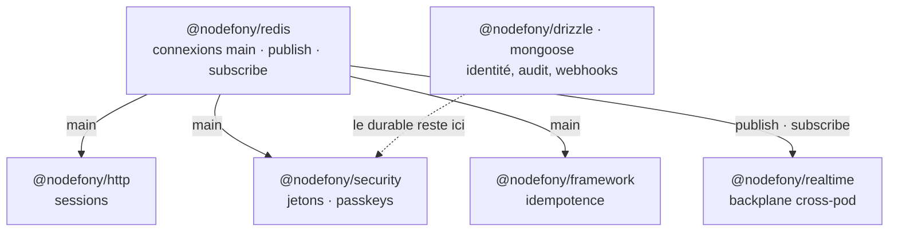

# @nodefony/redis — le magasin partagé à garantie courte

> Un carnet en mémoire vive posé **à côté** de tes process, jamais dedans. Le module ouvre et
> surveille N connexions Redis nommées, puis les prête à tout ce qui a besoin d'un état **partagé
> entre pods** : sessions, idempotence, jetons, passkeys, et le fan-out temps réel. Sa vocation tient
> en un mot — **périssable**. Redis excelle sur ce qui expire tout seul et se relit en microsecondes.
> Il ne remplace pas la base de vérité : `@nodefony/drizzle` reste le magasin durable par défaut.

📍 [Documentation](../../../../../docs/index.md) › **@nodefony/redis**

## 🧭 Par où commencer

Trois parcours selon ce que tu viens faire. L'ordre compte : chaque étape suppose la précédente.

**Je passe d'un process à plusieurs** — le besoin qui amène presque tout le monde ici. En mono-pod
tout marchait ; à deux répliques, un utilisateur connecté sur l'une est un inconnu sur l'autre.

1. [Configuration](./configuration.md) — déclarer l'accès Redis. **Commence ici** : tant que la
   connexion n'est pas déclarée, aucune brique ne basculera.
2. [Sessions](../../http/docs/session.md) — la première brique qui casse en multi-pod, et celle que
   Redis reprend **sans que tu la nommes** (voir « Ce que Redis porte »).
3. [Architecture interne](./architecture.md) — ce qui se passe quand la connexion tombe : le module
   dégrade au lieu de jeter, et il faut savoir ce que ça implique.
4. [Choisir un store de sessions](../../../../../docs/guides/session-storage.md) — le comparatif
   transverse, une fois que tu sais ce que Redis apporte.

**Je fais du temps réel sur plusieurs pods** — un message émis sur le pod A doit atteindre un client
abonné sur le pod B.

1. [Configuration](./configuration.md) — et surtout **pourquoi trois connexions** : un client abonné
   ne peut plus émettre de commandes, c'est le protocole Redis qui l'impose.
2. [Le backplane](../../realtime/docs/architecture.md) — le fan-out cross-process,
   qui consomme les connexions `publish` / `subscribe` de ce module.
3. [Architecture interne](./architecture.md) — le cloisonnement par namespace : le pub/sub Redis
   ignore le numéro de base, deux déploiements sur un Redis mutualisé se parleraient.

**Je branche les stores de sécurité sur Redis** — le cas avancé, celui où on choisit contre le défaut.

1. [Ce que Redis porte](#-ce-que-redis-porte--et-ce-quil-ne-porte-pas) — quatre briques couvertes,
   et lesquelles le framework refuse de te donner tout seul.
2. [Jetons](../../security/docs/tokens.md) — refresh, PAT et denylist JWT : la révocation immédiate
   cross-pod est le vrai argument.
3. [WebAuthn / passkeys](../../security/docs/webauthn.md) — attention, une passkey perdue est un
   utilisateur enfermé dehors.
4. [Architecture interne](./architecture.md) — le modèle de clés et ce que coûte une énumération.

## 🗂️ Les pages du module

Le module a deux pages de fond. Le tableau pour choisir en cinq secondes ; les cards pour savoir ce
qu'on y trouve.

| Page                                | Ce qu'elle résout                                        | Tu en as besoin quand…                        |
| ----------------------------------- | -------------------------------------------------------- | --------------------------------------------- |
| [Configuration](./configuration.md) | déclarer l'accès, les connexions, l'environnement        | tu branches Redis, ou tu changes de cible     |
| [Architecture](./architecture.md)   | ce qui se passe dedans : connexions, résilience, données | ça dégrade, ça reconnecte, ou tu dimensionnes |

```nodefony-cards
[
  { "icon": "⚙️", "title": "configuration", "href": "configuration.md",
    "desc": "Le schéma Zod du module et ses défauts réels, les variables d'environnement, et les situations concrètes : un Redis local en développement, une URL de PaaS, du TLS, une connexion supplémentaire dédiée.",
    "meta": "la page qu'on ouvre en premier — et la seule à changer pour viser une autre cible" },
  { "icon": "🏗️", "title": "architecture", "href": "architecture.md",
    "desc": "Les couches du module, le cycle de vie des connexions, la politique de reconnexion, la dégradation gracieuse quand Redis n'est pas joignable, et les structures de données employées par les stores.",
    "meta": "quand tu veux comprendre un comportement plutôt que le régler" }
]
```

## 🧩 Ce que Redis porte — et ce qu'il ne porte pas

Nodefony ne vise pas la parité entre backends : chaque adapter **déclare** ce qu'il couvre, selon ce
pour quoi il est bon. Redis se déclare de nature `cache` et annonce quatre briques dans son
`package.json` (clé `nodefony.stores`) — ni plus, ni moins.

La nuance décisive n'est pas « couvert / pas couvert », c'est **qui choisit**. Chaque brique déclare
la nature de sa donnée (`StoreKind`, `infra.ts:176`), et la résolution automatique ne propose Redis
que pour les natures non durables (`resolveAutoStore()`, `infra.ts:241`).

| Brique                              | Nature      | Implémentation                                  | Choisi par `auto` ?                      | Où on l'allume explicitement                                      |
| ----------------------------------- | ----------- | ----------------------------------------------- | ---------------------------------------- | ----------------------------------------------------------------- |
| **Sessions**                        | `session`   | `RedisSessionStorage` — ici                     | ✅ dès qu'une infra `cache` est déclarée | `use("@nodefony/http", { session: { store: "redis" } })`          |
| **Idempotence**                     | `ephemeral` | `RedisIdempotencyStore` — `@nodefony/framework` | ✅ idem                                  | `use("@nodefony/framework", { idempotency: { store: "redis" } })` |
| **Jetons** (refresh, PAT, denylist) | `durable`   | `RedisTokenStore` — ici                         | ❌ jamais                                | `use("@nodefony/security", { tokenStore: { store: "redis" } })`   |
| **Passkeys** (WebAuthn)             | `durable`   | `RedisWebAuthnCredentialStore` — ici            | ❌ jamais                                | `use("@nodefony/security", { passkeys: { store: "redis" } })`     |

Les briques `user`, `audit`, `webhooks` et `totp` n'ont **pas** de version Redis : ce sont des données
durables, elles vivent dans [`@nodefony/drizzle`](../../drizzle/docs/index.md) ou
[`@nodefony/mongoose`](../../mongoose/docs/index.md). Ce n'est pas un trou de couverture, c'est le
partage du travail.

En plus des stores, Redis porte le **backplane temps réel** — ce n'est pas un magasin mais un
transport : `use("@nodefony/realtime", { backplane: { driver: "redis" } })` fait transiter les
messages entre pods par pub/sub, en consommant les connexions `publish` et `subscribe` de ce module.

> [!WARNING]
> Pour les deux briques durables, tu passes outre un défaut délibéré. Redis les sert très bien
> (révocation immédiate, source unique cross-pod), mais la persistance devient **ta** responsabilité :
> une politique d'éviction qui purge des clés effacerait des passkeys — c'est-à-dire des utilisateurs
> qui ne peuvent plus se connecter. Le framework ne fera jamais ce choix à ta place.

## 🚀 Démarrage rapide

Vu depuis une application créée par `nodefony create app`. Deux fichiers, et un état partagé entre
tous les pods.

### 1. Déclarer le module

```ts
// nodefony.config.ts — l'orchestrateur de l'application
export default defineConfig(() => ({
  modules: [
    // Redis AVANT les modules qui consomment ses stores : il enregistre ses
    // fabriques au moment où le kernel enregistre les modules.
    use("@nodefony/redis", {
      // Rien à écrire ici en développement : le défaut vise localhost:6379 et le
      // mot de passe vient de l'environnement. Détails : ./configuration.md
      globalOptions: { socket: { host: "127.0.0.1", port: 6379 } },
    }),
    // La session ne nomme AUCUN store : `auto` prendra redis puisqu'une infra
    // cache est déclarée (NF_REDIS_URL). Voir « Ce que Redis porte ».
    "@nodefony/http",
    "@nodefony/framework",
  ],
}));
```

Déclare l'infra au démarrage, et la bascule se fait seule :

```bash
export NF_REDIS_URL=redis://:motdepasse@127.0.0.1:6379
```

Au boot, le log nomme le store retenu **et sa raison** (`infra cache (NF_REDIS_URL)`) — on ne devine
jamais où les sessions ont atterri.

### 2. Se servir du client pour ses propres besoins

Le module ne t'impose rien : il te tend le client Redis brut. Le service se récupère au conteneur
sous le nom `redis`, et `getClient(name)` rend la connexion voulue.

```ts
// nodefony/service/cache.ts — mémoriser un calcul coûteux, sans le rendre obligatoire
import type { RedisService } from "@nodefony/redis";

/** Mémorise le résultat 60 s. Redis absent → on calcule, on ne casse rien. */
export async function remember(
  redis: RedisService,
  key: string,
  compute: () => Promise<string>,
): Promise<string> {
  // `getClient` rend `null` tant que la connexion n'est pas ouverte (boot, arrêt,
  // incident) : on dégrade, on ne jette pas.
  const client = redis.getClient("main");
  if (!client) {
    return compute();
  }

  const hit = await client.get(key);
  if (hit !== null) {
    return hit;
  }

  const value = await compute();
  // TTL natif : Redis purge seul, aucun balayage à écrire.
  await client.set(key, value, { EX: 60 });
  return value;
}
```

## 🏛️ Place dans le framework



Le module ne connaît aucun de ses consommateurs : il expose un service, ils s'y branchent. C'est aussi
pour ça qu'il se déclare **non critique** (`Redis.critical` vaut `false`, `index.ts:36`) — un Redis
injoignable au démarrage n'empêche pas l'application de monter.

## 🧰 Surface publique

`RedisService` (le fournisseur de connexions), les trois stores — `RedisSessionStorage`,
`RedisTokenStore`, `RedisWebAuthnCredentialStore` —, le builder `defineRedisConfig` avec son schéma,
et un ré-export de la bibliothèque `redis` elle-même pour qui a besoin de ses types.

Charger le module suffit : `registerRedisFrameworkStores()` (`registerStores.ts:46`) inscrit les
fabriques `redis` dans les registres de `@nodefony/security`, et le store de session s'auto-déclare
(`SessionStorage.ts:327`). Aucun câblage applicatif — il ne reste qu'à nommer le store, ou à laisser
`auto` faire.

Les signatures exactes vivent dans le graphe généré (`jq '.symbols.RedisService' .ai/symbols.json`),
jamais recopiées ici : elles divergeraient en silence.

## 📖 Lexique

| Terme         | Sens                                                                                                                |
| ------------- | ------------------------------------------------------------------------------------------------------------------- |
| TTL           | _Time To Live_ : durée de vie posée sur une clé ; Redis l'efface seul à l'échéance, sans balayage applicatif.       |
| Pub/sub       | Publication/abonnement : un message émis sur un canal atteint tous les abonnés, sans être stocké.                   |
| Backplane     | « Fond de panier » : le transport qui relie les pods entre eux pour que le temps réel dépasse un seul process.      |
| SCAN          | Parcours incrémental du keyspace, par lots — l'alternative sûre à `KEYS`, qui bloquerait le serveur.                |
| Store         | Backend de persistance d'une brique (session, jetons…) — le vocabulaire du framework pour les **données**.          |
| PAT           | _Personal Access Token_ : clé d'API opaque et révocable, portée par le store de jetons.                             |
| Infra `cache` | L'infra éphémère partagée, déclarée par `NF_REDIS_URL` ; c'est elle qui rend les briques non durables automatiques. |

## 📡 Observabilité — Studio

L'écran **Stores** (`/nodefony/stores`) répond à la question qui compte en production : pour chaque
brique, quel store a **réellement** été retenu au démarrage, par quelle provenance (infra déclarée ou
choix explicite), et vers quelle cible réseau. Les URLs d'infra y sont affichées **crédentials
masqués**. La donnée vient du data plane `/nodefony/kernel/api/stores`.

La carte du module dans Studio expose par ailleurs sa configuration validée — le module publie son
JSON Schema, donc le formulaire est dérivé du schéma Zod, pas écrit à la main.

## 🧪 Tests & couverture

Les compteurs sont régénérés depuis vitest, jamais figés dans cette prose : ils vivent dans la carte
de l'aperçu. Ce qui doit être dit ici, c'est **comment obtenir un résultat qui veut dire quelque
chose**.

| Type        | Où                                       | Ce qui est prouvé                                         |
| ----------- | ---------------------------------------- | --------------------------------------------------------- |
| Unitaire    | `nodefony/tests/unit/**`                 | schéma, défauts, environnement, options du client         |
| Intégration | `nodefony/tests/integration/**`          | connexions réelles, pub/sub, les trois stores, pagination |
| Contrat     | bancs partagés de `@nodefony/http`       | le store Redis tient les invariants de tous les backends  |
| Résilience  | `integration/session-resilience.test.ts` | connexion absente, donnée corrompue, curseur hostile      |

> [!IMPORTANT]
> **Une suite verte ne prouve rien sans serveur Redis.** Les bancs d'intégration se **skippent** quand
> l'infra manque, et un skip compte comme un succès : on peut lire « tout est vert » sur une suite qui
> n'a rien exercé. Le module déclare donc sa gate — `REDIS_GATE` dans `vitest.gates.ts:147` — et la
> fin de run nomme la cible non testée avec la commande exacte pour la satisfaire. **Lis ce bloc avant
> de conclure.** Les variables et la commande docker viennent de là, pas de cette page : les recopier
> ici les condamnerait à diverger.

## 🔗 Pour aller plus loin

- 📄 **Les deux pages du module** : [Configuration](./configuration.md) ·
  [Architecture interne](./architecture.md)
- 🧭 **Les briques que Redis porte** : [sessions](../../http/docs/session.md) ·
  [jetons](../../security/docs/tokens.md) · [passkeys](../../security/docs/webauthn.md) ·
  [idempotence](../../framework/docs/idempotence.md)
- 🗄️ **Le durable, à côté** : [`@nodefony/drizzle`](../../drizzle/docs/index.md) (le défaut) ·
  [`@nodefony/mongoose`](../../mongoose/docs/index.md)
- 📡 **Le temps réel cross-pod** : [le backplane](../../realtime/docs/architecture.md) ·
  [la socket Nodefony](../../realtime/docs/index.md)
- 🗺️ **Se situer** : [vue d'ensemble du framework](../../../../../docs/architecture/vue-ensemble.md) ·
  [choisir un store de sessions](../../../../../docs/guides/session-storage.md) ·
  [lexique général](../../../../../docs/lexique.md)
- ⬆️ **Remonter** : [Toute la documentation](../../../../../docs/index.md)
