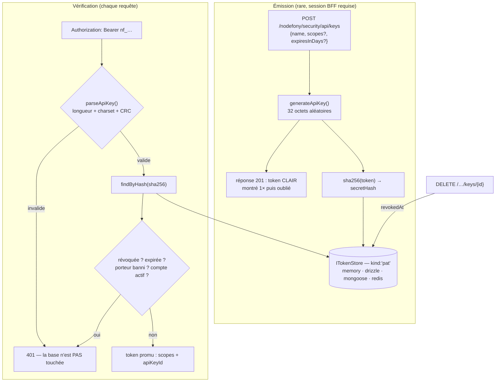

# Clés d'API — jetons opaques révocables pour les machines

> Une clé d'API Nodefony (PAT, _Personal Access Token_) est un **secret opaque**
> `nf_…` que tu remets à un script, un job CI ou un partenaire. Contrairement à un JWT, elle ne
> porte aucune information : sa vérité vit dans le store côté serveur — donc elle est **révocable
> à la seconde**. Elle est montrée **une seule fois** à l'émission, stockée **hachée**, et sa
> **forme est vérifiée hors-ligne** (checksum) avant que la base ne soit touchée. Ancré sur
> `src/packages/@nodefony/security/nodefony/service/apiKeys.ts`,
> `nodefony/src/apikey/apiKeyFormat.ts` et `nodefony/src/authenticator/ApiKeyAuthenticator.ts`.

📍 [Documentation](../../../../../docs/index.md) › [Sécurité](index.md) › **Clés d'API**

## 🧠 Le modèle mental — montrée une fois, filtrée hors-ligne, révoquée tout de suite

Trois moments dans la vie d'une clé, et ils ne coûtent pas le même prix. L'**émission** est rare et
chère (elle écrit). La **vérification** arrive à chaque requête : elle commence par un test
arithmétique local qui élimine les valeurs bidon **sans lire la base**. La **révocation** est un
simple champ posé — et elle prend effet à la requête suivante, partout.



## 📖 Lexique

| Terme            | Sens                                                                                                  |
| ---------------- | ----------------------------------------------------------------------------------------------------- |
| PAT              | _Personal Access Token_ — clé d'API rattachée à un **porteur** (utilisateur ou compte de service).    |
| Bearer           | Schéma `Authorization: Bearer <valeur>` (RFC 6750) : « celui qui porte le jeton est cru ».            |
| Opaque           | Le jeton ne contient **aucune donnée lisible** : c'est un numéro de vestiaire, pas un passeport.      |
| Auto-porté       | À l'inverse : un JWT transporte ses propres affirmations signées, vérifiables **sans** état serveur.  |
| CRC32            | Somme de contrôle (checksum) publique — détecte une clé tronquée ou inventée, **ne protège rien**.    |
| `pubid`          | Identifiant **public** de 8 caractères affiché dans la console (`nf_a1b2c3d4`) — jamais un secret.    |
| `secretHash`     | `sha256` du jeton entier : la **seule** trace stockée. Le clair n'est ni gardé ni re-dérivable.       |
| Scope            | Capacité accordée à la clé (`orders:read`) — axe distinct des rôles de l'humain.                      |
| `invalidBefore`  | Seuil par porteur : tout jeton créé avant cet instant est rejeté (déconnexion globale, bannissement). |
| Anti-énumération | Répondre pareil quel que soit l'échec, pour ne pas révéler ce qui existe (404 plutôt que 403).        |
| Shown once       | Le secret n'est affiché qu'à la création — l'oublier impose d'en émettre un nouveau.                  |
| Store de jetons  | Le `ITokenStore` partagé : il porte à la fois les PAT et les refresh tokens ([tokens](./tokens.md)).  |

## Qu'est-ce qu'une clé d'API — et la faille qu'elle ferme

Ton back-office est protégé par un login. Mais un **script de déploiement** ne peut pas taper un mot
de passe, et un **partenaire** ne doit surtout pas recevoir le tien. Il faut un identifiant de
machine : long, aléatoire, limité, et surtout **jetable**.

La faille concrète que ça ferme : **le mot de passe partagé**. Sans clés d'API, l'équipe finit par
coller le compte `admin` dans un fichier de CI. Le jour où ce fichier fuite, l'attaquant a
l'intégralité du compte — et pour couper l'accès, il faut changer le mot de passe de tout le monde.

Une clé d'API découpe le problème en trois :

1. **Portée** — elle ne peut faire que ce que ses `scopes` autorisent, pas tout ce que son porteur peut faire.
2. **Traçabilité** — chaque clé a un nom (« CI deploy », « export nocturne ») et un dernier usage.
3. **Révocabilité** — on éteint **une** clé sans déranger personne d'autre.

> [!IMPORTANT]
> Une clé d'API n'est **pas** un mot de passe et ne s'utilise pas comme tel : elle a une entropie
> de 256 bits (`SECRET_BYTES` de 32 octets, `apiKeyFormat.ts:30`) — inutile de la « complexifier »,
> impossible de la deviner. Le vrai risque n'est pas le devinage, c'est la **fuite** : d'où le
> hachage au repos, l'expiration par défaut et la révocation immédiate.

## La vision Nodefony — opaque par choix, vérifiable sans toucher la base

Nodefony aurait pu émettre un JWT longue durée : zéro lecture de base à la vérification. Le
compromis a été tranché dans l'autre sens, et c'est **le** choix structurant de cette brique.

**Pourquoi opaque plutôt qu'auto-porté** : un JWT signé reste valide jusqu'à son expiration, quoi
qu'il arrive côté serveur — révoquer exige d'ajouter… un état serveur (denylist), donc de payer la
lecture qu'on voulait éviter. Une clé d'API vit **des mois** : un jeton auto-porté de six mois qui
fuite est une porte ouverte de six mois. Le PAT inverse le compromis : sa vérité est dans le store,
donc `revokedAt` posé = accès coupé à la requête suivante, sans attendre aucune expiration
(`ApiKeyAuthenticator.authenticate()`, `ApiKeyAuthenticator.ts:107-114`).

**Ce que Nodefony fait pour que ça reste bon marché** — trois décisions ancrées au code :

- **Un filtre hors-ligne avant la base.** La forme et le checksum sont validés en O(1) sans aucun
  I/O — `parseApiKey()` (`apiKeyFormat.ts:131`). Une avalanche de chaînes au hasard ne devient
  jamais une avalanche de requêtes SQL.
- **Le secret n'existe nulle part au repos.** Seul `sha256(token)` est persisté — `hashApiKey()`
  (`apiKeyFormat.ts:70`). Une fuite de la base ne donne aucune clé utilisable.
- **Aucun store en propre.** Les clés vivent dans le **même** `ITokenStore` que les refresh tokens,
  discriminées par `kind: "pat"` (`ITokenStore.ts:74`) — une brique de moins à configurer, à
  purger et à superviser. Le propriétaire du store reste le `TokenService` ([tokens](./tokens.md)).

Et une décision assumée sur la crypto : `sha256` suffit **ici**, alors qu'un mot de passe humain
exige argon2. La raison est écrite dans le code (`apiKeyFormat.ts:22-25`) — un secret de 256 bits
tiré au hasard n'est ni brute-forçable ni exposé aux tables arc-en-ciel ; un hachage lent ne
protégerait que des secrets faibles, et coûterait sur le chemin chaud.

## 🚀 Démarrage rapide

### 1. Déclarer la zone machine et les règles d'émission

Dans une app générée par `nodefony create app`, tout se déclare dans `nodefony.config.ts`. Une zone
dont les authenticators contiennent `apikey` exige un `Authorization: Bearer nf_…` valide :

```typescript
// nodefony.config.ts (extrait) — la zone machine + la politique d'émission
use("@nodefony/security", {
  areas: {
    // Zone protégée : sans clé valide → 401 AVANT ton controller (Zero Trust).
    // `jwt` cohabite sans conflit — les deux se discriminent par la FORME du
    // bearer (JWT = a.b.c, clé d'API = nf_…).
    api: {
      pattern: "^/api/v1",
      authenticators: ["apikey", "jwt"],
      mode: "first",
    },
  },
  apiKeys: {
    prefix: "acme", // marque de TES clés : acme_… (secret-scanning + support)
    defaultExpiryDays: 90, // une clé émise sans durée meurt au bout de 90 jours
    maxPerSubject: 20, // plafond de clés ACTIVES par porteur (au-delà : 409)
    allowedScopes: ["orders:read", "orders:write"], // catalogue fermé
  },
});
```

### 2. Écrire le controller, borné par un scope

```typescript
// nodefony/controllers/OrdersController.ts — complet, compile tel quel
import {
  controller,
  Controller,
  Get,
  RequireScope,
  CurrentUser,
} from "@nodefony/framework";
import type { IUser } from "@nodefony/user";

@controller("/api/v1/orders")
class OrdersController extends Controller {
  // Le firewall a déjà validé la clé (forme, CRC, store, révocation, expiration,
  // compte actif) : `user` est le PORTEUR de la clé. @RequireScope borne ce que
  // CETTE clé peut faire — une clé émise sans `orders:read` reçoit 403.
  @RequireScope("orders:read")
  @Get("/list")
  async list(@CurrentUser() user: IUser) {
    return this.renderJson({ owner: user.identifier, orders: [] });
  }
}

export default OrdersController;
```

### 3. Émettre la clé — par l'API, avec une session

L'émission est un **endpoint fourni**, monté seulement si le service `apiKeys` existe
(`mountApiKeyRoutes()`, `ApiKeyController.ts:191`). Il n'y a **pas** de commande CLI pour créer une
clé : la création exige une **session BFF** (les routes ne sont pas `bypassFirewall` —
`ApiKeyController.ts:50-54`), parce que le porteur est **toujours** l'utilisateur courant, jamais un
paramètre.

```bash
# 0) Un compte porteur (mot de passe demandé masqué, jamais en dur)
npx nodefony security:user:add ci-bot

# 1) Session BFF : c'est elle qui autorise la création
curl -si -c /tmp/jar -H 'Content-Type: application/json' \
  -d "{\"username\":\"ci-bot\",\"password\":\"$NF_PASS\"}" \
  https://localhost:5152/nodefony/security/api/auth/login | head -1
# HTTP/1.1 200 OK

# 2) Émission → 201, le token CLAIR n'apparaît QU'ICI
curl -s -b /tmp/jar -H 'Content-Type: application/json' \
  -d '{"name":"CI deploy","scopes":["orders:read"],"expiresInDays":30}' \
  https://localhost:5152/nodefony/security/api/keys
# {"id":"3f2a…","prefix":"acme_a1b2c3d4","name":"CI deploy",
#  "scopes":["orders:read"],"expiresAt":1234567890000,
#  "token":"acme_a1b2c3d4XXXX…z9z9z9"}   ← à copier MAINTENANT

# 3) La clé authentifie le script — plus aucune session, plus aucun cookie
curl -s -H "Authorization: Bearer acme_a1b2c3d4XXXX…z9z9z9" \
  https://localhost:5152/api/v1/orders/list
# {"owner":"ci-bot","orders":[]}

# 4) Sans clé (ou avec une clé bidon) → 401, message uniforme
curl -si https://localhost:5152/api/v1/orders/list | head -1
# HTTP/1.1 401 Unauthorized
```

> [!WARNING]
> Le champ `token` de la réponse 201 est la **seule** occasion de lire le secret : il n'est pas
> stocké, donc pas re-dérivable (`IApiKeyCreated`, `IApiKey.ts:36`). Le listing ultérieur ne
> renvoie que le `prefix` public (`#toView()`, `apiKeys.ts:337`). Perdue = ré-émise.

## 🔐 Anatomie d'une clé — ce que chaque morceau paie

Format émis : `<prefix>_<pubid><secret><crc>` — **un seul** `_`, le reste est **positionnel**. La
raison est dans le code (`apiKeyFormat.ts:8-10`) : le charset base64url contient lui-même `-` et
`_`, donc un `split("_")` serait fragile ; on découpe par longueurs fixes.

| Morceau  | Taille               | Secret ? | À quoi ça sert                                                                                     |
| -------- | -------------------- | :------: | -------------------------------------------------------------------------------------------------- |
| `prefix` | ≤ 12 car. minuscules |   non    | Marque applicative — discrimine du JWT, aide le secret-scanning (`config.ts:585`)                  |
| `pubid`  | 6 octets → 8 car.    |   non    | Identifiant affichable dans la console (`nf_a1b2c3d4`) — `generateApiKey()` (`apiKeyFormat.ts:92`) |
| `secret` | 32 octets → 43 car.  | **oui**  | 256 bits d'entropie — `SECRET_BYTES` (`apiKeyFormat.ts:30`)                                        |
| `crc`    | 4 octets → 6 car.    |   non    | CRC32 du `prefix_pubid+secret` — `crcChunk()` (`apiKeyFormat.ts:63`)                               |

Le corps total fait donc 57 caractères — `BODY_LEN` (`apiKeyFormat.ts:34`), longueur vérifiée
strictement au parsing.

### À quoi sert vraiment le CRC (et à quoi il ne sert pas)

Le checksum n'est **pas** une protection : il est public, recalculable par n'importe qui. Il achète
deux choses très concrètes :

1. **Rejeter une clé malformée en O(1), sans toucher le store.** `parseApiKey()` vérifie préfixe,
   longueur, charset base64url puis CRC — et renvoie `null` avant tout I/O
   (`apiKeyFormat.ts:136-142`). C'est une défense **anti-DoS** : un attaquant qui bombarde des
   `nf_` aléatoires consomme du CPU, jamais des lectures de base.
2. **Le secret-scanning.** GitHub, GitGuardian & co. reconnaissent un motif `nf_…` **dont le
   checksum tombe juste** avec un taux de faux positifs quasi nul. Une clé poussée par erreur dans
   un dépôt est détectée par l'outillage de l'écosystème, pas seulement par toi.

La table CRC32 (IEEE 802.3) est précalculée **une fois** au chargement du module — `CRC_TABLE`
(`apiKeyFormat.ts:40`) — et l'implémentation est locale et déterministe, pour ne dépendre ni d'une
dépendance ni d'une variation de version Node (`crc32()`, `apiKeyFormat.ts:53`).

### Un test encore moins cher, pour l'aiguillage

Avant même de parser, le firewall doit savoir **quel** authenticator prend la main. C'est
`looksLikeApiKey()` (`apiKeyFormat.ts:117`) : un simple `startsWith("<prefix>_")`, appelé par
`ApiKeyAuthenticator.supports()` (`ApiKeyAuthenticator.ts:68`). C'est ce qui rend la cohabitation
`["apikey", "jwt"]` possible dans une même zone — un JWT a la structure `a.b.c`, il ne commence
jamais par le préfixe.

## 🏗️ Architecture interne — la vie d'une clé

### Émission — `ApiKeyService.createForSubject()`

`ApiKeyService.createForSubject()` (`apiKeys.ts:98`) est le seul chemin d'émission. Dans l'ordre :

1. **Validation du nom** — non vide, ≤ 100 caractères ; sinon `ApiKeyError` 400 (`#normalizeName()`,
   `apiKeys.ts:281`).
2. **Validation des scopes** — tableau de chaînes non vides, dédupliquées, et **⊆ catalogue** si
   `allowedScopes` est défini ; sinon 400 (`#normalizeScopes()`, `apiKeys.ts:292`).
3. **Résolution de l'expiration** — `expiresInDays` explicite, sinon le défaut de config, `null` =
   sans expiration ; une valeur non positive lève un 400 (`#resolveExpiry()`, `apiKeys.ts:314`).
4. **Plafond anti-abus** — on ne compte que les clés **actives** (ni révoquées ni expirées) via
   `#isActive()` (`apiKeys.ts:330`) ; au-delà de `maxPerSubject` → 409 (`apiKeys.ts:113`).
5. **Génération** — 32 octets aléatoires, `publicPrefix` et `secretHash` dérivés
   (`generateApiKey()`, `apiKeyFormat.ts:92`).
6. **Écriture** — le `record` de `kind:"pat"` posé au store par `store.put()` (`apiKeys.ts:147`).
7. **Audit** — `apikey.created`, catégorie `token`, avec l'**id public** et les scopes, **jamais le
   secret** (`apiKeys.ts:153`).

Le service ne connaît pas le store à la construction : il le résout **paresseusement** du container
au premier usage (`#resolveStore()`, `apiKeys.ts:268`) — indépendant de l'ordre de boot. Store
absent = **503 explicite**, jamais une 500 opaque.

### Vérification — `ApiKeyAuthenticator.authenticate()`

Le chemin chaud, dans l'ordre exact du code (`ApiKeyAuthenticator.ts:93`) — chaque étape est un
filtre qui coûte plus cher que la précédente :

| #   | Contrôle                                | Coût            | Ancrage                                               |
| --- | --------------------------------------- | --------------- | ----------------------------------------------------- |
| 1   | Bearer présent + préfixe                | regex           | `BEARER_SCHEME` (`ApiKeyAuthenticator.ts:12`)         |
| 2   | Longueur, charset, **CRC**              | CPU local       | `parseApiKey` (`ApiKeyAuthenticator.ts:99`)           |
| 3   | Lookup par `secretHash`                 | 1 lecture store | `findByHash` (`ApiKeyAuthenticator.ts:105`)           |
| 4   | `kind:"pat"`, non révoquée, non expirée | en mémoire      | `ApiKeyAuthenticator.ts:107-114`                      |
| 5   | Porteur banni ? (`invalidBefore`)       | 1 lecture store | `getInvalidBefore` (`ApiKeyAuthenticator.ts:117`)     |
| 6   | Compte actif et non verrouillé          | 1 lecture user  | `#resolveUserOrReject` (`ApiKeyAuthenticator.ts:159`) |
| 7   | `lastUsedAt` (throttlé)                 | 0 ou 1 écriture | `markUsed` (`ApiKeyAuthenticator.ts:133`)             |

Deux points méritent d'être soulignés parce qu'ils décident du niveau de sécurité réel :

- **Le sujet est revérifié à CHAQUE requête** (étape 6). Une clé reste techniquement valide, mais si
  le compte porteur est désactivé ou verrouillé, elle ne passe plus — les rôles sont **frais**, il
  n'y a pas de cache d'identité. C'est ce qui fait qu'un départ de collaborateur coupe ses clés
  sans avoir à les énumérer.
- **L'échec est toujours le même.** Malformée, inconnue, révoquée, expirée, porteur banni, compte
  supprimé : un unique `"Invalid token"` (`INVALID_TOKEN`, `ApiKeyAuthenticator.ts:17`). Un
  attaquant ne peut pas distinguer « cette clé n'existe pas » de « cette clé est révoquée » — c'est
  l'**anti-énumération**, la cause fine part dans l'audit, jamais au client.

En cas de succès, le jeton est promu et porte trois attributs consommés en aval : `scopes`,
`apiKeyId` et `tenantId` (`ApiKeyAuthenticator.ts:138-140`). Le challenge renvoyé sur un 401 de la
zone est un simple `Bearer` (`challenge()`, `ApiKeyAuthenticator.ts:155`).

### Câblage — d'où viennent le préfixe et le throttle

L'authenticator n'est jamais instancié à la main : le firewall le construit depuis le registre, en
lui injectant la config effective — `registerAuthenticatorFactory("apikey")`
(`authenticatorRegistry.ts:117`), qui lit `prefix` et `lastUsedThrottleS`
(`authenticatorRegistry.ts:123`). Conséquence pratique : changer `apiKeys.prefix` change **à la
fois** l'émission et la reconnaissance — les anciennes clés ne sont plus reconnues.

## Quatre parcours vécus

### Donner un accès à un script CI (sans lui donner un compte)

**Le besoin** : ton pipeline doit lire les commandes une fois par nuit. Il ne doit jamais pouvoir
écrire, ni se connecter à la console.

**La config** : un porteur dédié + un catalogue de scopes fermé.

```typescript ignore
apiKeys: {
  allowedScopes: ["orders:read"],   // le catalogue REFUSE tout le reste à l'émission
  defaultExpiryDays: 90,
}
```

**Ce qu'on observe** : `npx nodefony security:user:add ci-bot` (rôle `ROLE_USER` par défaut), login
en tant que `ci-bot`, puis émission avec `{"scopes":["orders:read"]}`. Demander
`{"scopes":["orders:write"]}` renvoie **400 `scope not allowed: orders:write`** — refusé à
l'émission, pas seulement à l'usage (`#normalizeScopes()`, `apiKeys.ts:292`).

> [!TIP]
> Le catalogue `allowedScopes` de la config est un **complément**, pas la source : la console
> propose aussi les scopes **découverts sur tes routes** (`@RequireScope`) par
> `collectDeclaredApiScopes()` (`scopeCatalog.ts:29`), agrégés dans l'endpoint `capabilities`
> (`ApiKeyController.ts:96`). Un formulaire de création qui ne ment pas.

### Faire tourner une clé sans coupure de service

**Le besoin** : la clé du CI arrive à expiration (ou tu appliques une rotation trimestrielle). Il ne
doit y avoir **aucune** fenêtre pendant laquelle le job échoue.

**Il n'y a pas de bouton « rotate »** — et c'est délibéré : une rotation atomique impliquerait
soit deux secrets valides sous le même id (ambigu à auditer), soit une coupure. Le motif est le
**recouvrement**, rendu possible par le plafond `maxPerSubject` (`apiKeys.ts:113`) :

1. Émettre une **seconde** clé (même porteur, mêmes scopes, nom `CI deploy v2`).
2. Déployer le nouveau secret dans le CI.
3. Vérifier le basculement : la colonne « dernier usage » de la v2 bouge dans Studio (`lastUsedAt`).
4. **Puis** révoquer la v1.

Ce qui rend l'étape 3 fiable : `lastUsedAt` est écrit de façon **throttlée**, pas à chaque requête —
la fenêtre par défaut est de 60 s (`lastUsedThrottleS`, `config.ts:601`). Attends donc une minute
avant de conclure qu'une clé « ne sert plus ».

### Révoquer une clé qui a fuité

**Le besoin** : le secret est apparu dans un log public. Il faut couper **maintenant**, sans toucher
aux autres clés ni au compte.

Deux chemins, selon qui agit :

| Qui        | Endpoint                                          | Portée                 | Ancrage                                 |
| ---------- | ------------------------------------------------- | ---------------------- | --------------------------------------- |
| Le porteur | `DELETE /nodefony/security/api/keys/{id}`         | **ses** clés seulement | `revokeForSubject()` (`apiKeys.ts:247`) |
| Un admin   | `POST /nodefony/security/api/apikeys/{id}/revoke` | n'importe quelle clé   | `revokeAnyPat()` (`apiKeys.ts:201`)     |

**Ce qu'on observe** : la révocation est **idempotente** et prend effet à la requête suivante —
l'authenticator lit `revokedAt` avant toute autre décision (`ApiKeyAuthenticator.ts:107-114`).
Le banc d'intégration le prouve bout en bout : 200 avant, 401 après
(`apikey-flow.test.ts:149-157`).

Une propriété de sécurité facile à manquer : si la clé n'existe pas **ou** appartient à quelqu'un
d'autre, le porteur reçoit un **404 indiscernable**, jamais un 403 (`ApiKeyController.ts:139-142`).
Un 403 dirait « cette clé existe, mais pas à toi » — assez pour énumérer les identifiants des
autres. Le banc couvre explicitement cet IDOR (`apikey-flow.test.ts:176`).

> [!WARNING]
> Si tu dois couper **toutes** les clés d'un porteur d'un coup (compte compromis, départ), ne les
> révoque pas une par une : pose le seuil `invalidBefore` du porteur
> (`revokeAllForSubject`, `ITokenStore.ts:232`). L'authenticator rejette alors toute clé créée avant
> ce seuil : `getInvalidBefore` est comparé au `createdAt` du record
> (`ApiKeyAuthenticator.ts:117-120`) — y compris pour les clés que tu aurais oubliées.

### Auditer qui a utilisé quoi

**Le besoin** : après un incident, savoir quelles clés existent, qui les porte, quand elles ont
servi et qui les a révoquées.

Trois sources, et il faut connaître les limites de chacune :

1. **L'état** — le listing d'administration paginé, tous porteurs confondus : `GET
/nodefony/security/api/apikeys` (`SecurityAdminApi.ts:394`), servi par `listPagePat()`
   (`apiKeys.ts:208`). Filtres `subjectId`, `revoked`, fenêtre `limit`/`offset`/`cursor` et tri
   `order=champ:ASC` (`parseTokenListQuery()`, `SecurityAdminApi.ts:126`), plafonnée à 200 entrées
   (`KEYS_MAX_LIMIT`, `SecurityAdminApi.ts:109`).

   Le tri n'est accepté que sur les champs que le backend branché **déclare** savoir trier
   (`sortableFields()`, `apiKeys.ts:102` → `ITokenStore.sortableFields`) : `createdAt`, `name`,
   `subjectId`, `id` sur mémoire/SQL/Mongo (`TOKEN_SORTABLE_FIELDS`, `tokenSort.ts:27`). Tout autre
   champ est refusé en **400** — jamais accepté puis ignoré. Un backend Redis ne déclare rien (son
   `SCAN` n'a pas d'ordre global) : tout `order` y est donc refusé, ce qui est la vérité de ce
   store. Les champs _nullables_ (`lastUsedAt`, `expiresAt`, `revokedAt`) sont volontairement hors
   du vocabulaire : le placement des valeurs absentes diffère d'un moteur à l'autre, et un tri dont
   l'ordre dépend de la base configurée ne vaut pas mieux qu'un tri absent.

2. **Le journal** — les événements d'audit `apikey.created` (`apiKeys.ts:153`) et `apikey.revoked`
   (`apiKeys.ts:212` côté admin, `apiKeys.ts:255` côté porteur), catégorie `token`. La révocation
   admin trace **l'acteur ET le porteur cible** — voir [audit](./audit.md).
3. **Le dernier usage** — `lastUsedAt` sur chaque clé.

Ce que tu **n'auras pas** : un journal par requête. `markUsed` est appelé avec le seul horodatage
(`ApiKeyAuthenticator.ts:133`) ; les champs `lastUsedIp` et `lastUsedUserAgent` du record
(`ITokenStore.ts:135`) restent donc à `null` — ce sont des **emplacements réservés**, pas des
données remplies. Pour de la traçabilité par appel, c'est le journal d'audit applicatif qu'il faut
alimenter, pas le store de jetons.

## ⚙️ Configuration

Table dérivée du schéma Zod `apiKeysSchema` (`config.ts:582`), branché à la racine de la config du
module (`config.ts:929`). Toutes les valeurs ci-dessous sont les **défauts réels**.

| Option              | Type             | Défaut | Effet                                                                                  |
| ------------------- | ---------------- | ------ | -------------------------------------------------------------------------------------- |
| `enabled`           | boolean          | `true` | Coupe l'émission ET le listing (l'authenticator reste déclarable) (`config.ts:584`)    |
| `prefix`            | string ≤ 12      | `"nf"` | Marque des clés ; minuscules/chiffres — discrimine du JWT (`config.ts:585`)            |
| `defaultExpiryDays` | number \| null   | `90`   | Expiration appliquée si l'appelant n'en donne pas ; `null` = jamais (`config.ts:594`)  |
| `lastUsedThrottleS` | number (s)       | `60`   | Coalescence d'écriture de `lastUsedAt` ; `0` = à chaque usage (`config.ts:601`)        |
| `maxPerSubject`     | number > 0       | `100`  | Plafond de clés **actives** par porteur ; au-delà → 409 (`config.ts:610`)              |
| `allowedScopes`     | string[] \| null | `null` | Catalogue fermé à la création ; `null` = tout scope non vide accepté (`config.ts:619`) |

Deux réglages méritent une décision consciente :

- **`prefix`** doit être **propre à ton application** (`acme`, `shop`…). C'est ce qui permet à un
  outil de secret-scanning de reconnaître **tes** clés, et à ton support d'identifier un jeton d'un
  coup d'œil. Le changer invalide la reconnaissance des clés déjà émises.
- **`defaultExpiryDays: null`** (clé éternelle) est un choix de confort qui se paie : plus rien
  n'oblige à faire tourner le secret. Préfère une durée + le motif de recouvrement décrit plus haut.

## 🧰 API publique

### Les endpoints — deux portées, jamais mélangées

**Console « mes clés »** (le porteur gère les siennes) — montées par `mountApiKeyRoutes()`
(`ApiKeyController.ts:191`) **seulement si** le service `apiKeys` existe (`framework/index.ts:385`) ;
sinon 404, zéro surface. Aucune n'est `bypassFirewall` : la zone data plane exige la session BFF.

| Méthode  | Chemin                                     | Rôle                                              | Ancrage                                     |
| -------- | ------------------------------------------ | ------------------------------------------------- | ------------------------------------------- |
| `POST`   | `/nodefony/security/api/keys`              | Émission → **201** + `token` clair (1×)           | `create()` (`ApiKeyController.ts:65`)       |
| `GET`    | `/nodefony/security/api/keys`              | Mes clés, sans secret                             | `list()` (`ApiKeyController.ts:113`)        |
| `GET`    | `/nodefony/security/api/keys/capabilities` | Plafond, scopes proposés, préfixe, durée          | `capabilities()` (`ApiKeyController.ts:96`) |
| `DELETE` | `/nodefony/security/api/keys/{id}`         | Révoque **ma** clé ; 404 sinon (anti-énumération) | `revoke()` (`ApiKeyController.ts:126`)      |

**Administration** (gouvernance, réponse à incident) — data plane `SecurityAdminApi`, RBAC
`ROLE_NODEFONY_ADMIN` :

| Méthode | Chemin                                       | Rôle                                     | Ancrage                   |
| ------- | -------------------------------------------- | ---------------------------------------- | ------------------------- |
| `GET`   | `/nodefony/security/api/apikeys`             | Toutes les clés, **paginé au store**     | `SecurityAdminApi.ts:380` |
| `GET`   | `/nodefony/security/api/apikeys/status`      | « Où on écrit » : classe réelle + driver | `SecurityAdminApi.ts:416` |
| `POST`  | `/nodefony/security/api/apikeys/{id}/revoke` | Révoque n'importe quelle clé, audité     | `SecurityAdminApi.ts:440` |

Les deux espaces de chemins sont **disjoints** (`keys` vs `apikeys`) — aucune collision, et une
console d'admin ne peut pas atterrir par erreur sur l'endpoint personnel.

Codes d'erreur mappés par duck-typing sur `code` (`#renderApiKeyError()`, `ApiKeyController.ts:164`) :
**400** validation (nom, scope, durée), **409** plafond atteint, **503** clés indisponibles (store
absent ou `enabled:false`).

### Ce qu'on importe côté application

```typescript ignore
import {
  ApiKeyService, // service (résolu du container : `this.get("apiKeys")`)
  ApiKeyAuthenticator, // enregistré sous le nom "apikey"
  generateApiKey, // helpers de FORMAT — purs, sans I/O
  parseApiKey,
  hashApiKey,
  looksLikeApiKey,
} from "@nodefony/security";
import type {
  IApiKeyView, // vue publique — sans secret ni hash
  IApiKeyCreated, // vue publique + token clair (création seule)
  IApiKeyCapabilities, // contraintes d'émission (formulaire honnête)
  ICreateApiKeyOptions,
} from "@nodefony/security";
```

Les contrats vivent dans `IApiKey.ts` : `IApiKeyView` (`IApiKey.ts:6`), `IApiKeyCreated`
(`IApiKey.ts:36`), `IApiKeyCapabilities` (`IApiKey.ts:47`), `ICreateApiKeyOptions`
(`IApiKey.ts:61`). Les signatures détaillées vivent dans le graphe TSDoc (`.ai/symbols.json`) —
cette page explique l'usage, elle ne recopie pas les prototypes.

## 🧑‍⚖️ Scopes — ce que la clé a le droit de faire

Deux axes se combinent, et les confondre est l'erreur la plus fréquente :

- **Les rôles** disent **qui tu es** — ils appartiennent au porteur (`ROLE_ADMIN`…).
- **Les scopes** disent **ce que cette clé-là peut faire** — ils appartiennent au jeton.

Une clé ne peut donc **jamais** dépasser son porteur : elle en est une restriction, pas une
extension. Concrètement, `@RequireScope("orders:read")` sur une action est tranché par le
`ScopeVoter`, dont la règle est asymétrique (`ScopeVoter.ts:50`) :

- un jeton **humain** (session, mot de passe, anonyme) n'est jamais bridé par un scope — la liste
  `NON_SCOPABLE_TOKEN_TYPES` (`ScopeVoter.ts:17`) le fait passer ; ce sont ses **rôles** qui décident ;
- un jeton **machine délégué** (`apikey`, `jwt`, `oauth2`) doit porter le scope **exact**, sinon
  refus par défaut du jury.

Le détail du jury (voters, veto, hiérarchie de rôles) est sur la page
[autorisation](./authorization.md) — la clé d'API n'y est qu'un porteur de scopes parmi d'autres.

## Persistance — un store partagé avec les jetons

Une clé d'API **n'a pas de table à elle**. Elle est un `IAccessTokenRecord` (`ITokenStore.ts:69`)
de `kind:"pat"` (`ITokenStore.ts:74`), dans la même table que les refresh tokens — les champs sans
objet pour un PAT (`family`, `replacedBy`, `audience`) valent `null`.

Les champs qui portent le sens **pour une clé d'API** :

| Champ        | Rôle pour un PAT                                              | Ancrage              |
| ------------ | ------------------------------------------------------------- | -------------------- |
| `kind`       | `"pat"` — discrimine du refresh dans la même table            | `ITokenStore.ts:74`  |
| `name`       | Libellé humain (« CI deploy ») — ce qu'on lit dans la console | `ITokenStore.ts:76`  |
| `prefix`     | Préfixe public `nf_a1b2c3d4` (jamais le secret)               | `ITokenStore.ts:78`  |
| `subjectId`  | Porteur — **référence logique**, pas une clé étrangère SQL    | `ITokenStore.ts:95`  |
| `scopes`     | Capacités de la clé (lues par le `ScopeVoter`)                | `ITokenStore.ts:103` |
| `secretHash` | `sha256` du token entier — clé de `findByHash`                | `ITokenStore.ts:111` |
| `hashAlg`    | `"sha256"` — agilité crypto pour une migration future         | `ITokenStore.ts:113` |
| `expiresAt`  | Expiration ou `null` (clé longue durée)                       | `ITokenStore.ts:131` |
| `lastUsedAt` | Dernier usage, écrit **throttlé**                             | `ITokenStore.ts:133` |
| `revokedAt`  | Révocation — le contrôle n°1 de l'authenticator               | `ITokenStore.ts:139` |

> [!NOTE]
> Les **colonnes et types par dialecte** ne sont pas dupliqués ici : le propriétaire du schéma est
> le `TokenService`, et la table est décrite une seule fois côté [tokens](./tokens.md) puis dans la
> doc de chaque adapter. Règle anti-triple-vérité — un seul endroit à corriger quand le schéma bouge.

### Bases prises en charge

**Quatre** backends portent les clés, exactement ceux du store de jetons — parce que c'est le
**même** store, résolu par le `TokenService` selon la doctrine `store:"auto"` :

| Backend    | Durable | Listing admin               | Pour…                                                    |
| ---------- | :-----: | --------------------------- | -------------------------------------------------------- |
| `memory`   |   non   | offset + total              | dev / tests mono-process                                 |
| `drizzle`  |   oui   | offset + total              | SQL (PostgreSQL, MySQL/MariaDB, SQLite) — défaut durable |
| `mongoose` |   oui   | offset + total              | MongoDB                                                  |
| `redis`    |   oui   | **curseur**, `total` absent | flotte de pods, TTL natif                                |

Ce qui **n'existe pas** : aucun autre backend n'est enregistré, et il n'y a pas de store propre aux
clés d'API. En `memory` **en production**, la conséquence est directe et annoncée au boot : les clés
sont per-pod et volatiles — une clé émise sur un pod n'est pas reconnue par les autres, et une
révocation ne traverse pas. Le détail de la résolution, des avertissements et de la purge est sur
[tokens](./tokens.md).

## 📜 Normes appliquées

| Domaine                           | Norme                                  | Ancrage                                                |
| --------------------------------- | -------------------------------------- | ------------------------------------------------------ |
| Schéma `Bearer` (transport)       | RFC 6750 §2.1                          | `BEARER_SCHEME` (`ApiKeyAuthenticator.ts:12`)          |
| `invalid_token` → 401 + challenge | RFC 6750 §3.1 · RFC 7235               | `challenge()` (`ApiKeyAuthenticator.ts:155`)           |
| Secret **jamais** stocké en clair | OWASP ASVS (secret storage)            | `hashApiKey()` (`apiKeyFormat.ts:70`)                  |
| Secret montré une seule fois      | Pratique « shown once »                | `IApiKeyCreated.token` (`IApiKey.ts:37`)               |
| Anti-énumération des ressources   | OWASP API1:2023 (BOLA/IDOR)            | 404 indiscernable (`ApiKeyController.ts:139-142`)      |
| Message d'échec uniforme          | OWASP API2:2023 (Broken Auth)          | `INVALID_TOKEN` (`ApiKeyAuthenticator.ts:17`)          |
| Révocation immédiate côté serveur | OWASP API2:2023                        | `revokedAt` vérifié (`ApiKeyAuthenticator.ts:107-114`) |
| Entropie du secret (≥ 128 bits)   | NIST SP 800-63B                        | 32 octets aléatoires (`apiKeyFormat.ts:30`)            |
| Plafond de ressources par acteur  | OWASP API4:2023 (Resource Consumption) | `maxPerSubject` (`apiKeys.ts:113`)                     |

## ⚡ Performance & mémoire

Le coût par requête authentifiée par clé est **maîtrisé par construction**, dans cet ordre :

- **Le filtre le moins cher d'abord.** `supports()` ne fait qu'un `startsWith`
  (`ApiKeyAuthenticator.ts:68`) ; le parsing complet (CRC inclus) est purement local
  (`apiKeyFormat.ts:131`). Une valeur invalide ne coûte **aucun** I/O.
- **Table CRC précalculée une fois** au chargement du module, jamais par appel
  (`CRC_TABLE`, `apiKeyFormat.ts:40`).
- **`lastUsedAt` throttlé** — sans cette coalescence, chaque requête d'API deviendrait une
  **écriture** en base. Fenêtre par défaut 60 s (`ApiKeyAuthenticator.ts:127-134`) ; `0` rétablit
  l'écriture systématique, à ne choisir qu'en connaissance de cause.
- **Dépendances résolues paresseusement** : store et fournisseur d'utilisateurs sont récupérés du
  container au premier usage et mémoïsés (`ApiKeyAuthenticator.ts:173`, `apiKeys.ts:268`) — le boot
  ne paie rien si aucune clé n'est jamais présentée.
- **Jamais N enregistrements en RAM** côté administration : le listing est paginé **au store**
  (`listPagePat()`, `apiKeys.ts:186`), fenêtre plafonnée à 200 (`SecurityAdminApi.ts:107`).

Le point de vigilance restant : `createForSubject()` compte les clés actives via `findBySubject()`
(`ITokenStore.ts:182`), qui charge **toutes** les clés du porteur. C'est borné par `maxPerSubject`
(100 par défaut) et c'est un chemin froid (émission), pas le chemin chaud.

## 📡 Observabilité — Studio

L'écran **API Keys** (`/nodefony/api-keys`, `studio/frontend/src/routes/ApiKeys.tsx`) expose les
deux portées dans une seule page :

- **Mes clés** — création, listing et révocation via le data plane personnel
  (`KEYS_ENDPOINT`, `studio/frontend/src/routes/apikeys/apiKeysModel.ts:83`). Le secret est affiché
  dans la modale de création, une fois.
- **Administration** — toutes les clés du système, pagination serveur et révocation ciblée
  (`ADMIN_KEYS_ENDPOINT`, `studio/frontend/src/routes/apikeys/apiKeysModel.ts:93`), réservé à
  `ROLE_NODEFONY_ADMIN`.
- **Badge « où on écrit »** — la classe réelle du store et son driver, lu défensivement pour que la
  console affiche toujours un état honnête (`API_KEYS_STATUS_ENDPOINT`,
  `studio/frontend/src/routes/apikeys/apiKeysModel.ts:99` ; handler `IApiKeysStatus`,
  `SecurityAdminApi.ts:416`).

Les types du front sont des **miroirs** du contrat serveur — le secret est exclu par construction,
pas masqué à l'affichage. Voir aussi l'écran **Audit** pour les événements `apikey.created` /
`apikey.revoked`.

## ⚠️ Pièges (symptôme → cause → correction)

| Symptôme                                               | Cause (dans le code)                                                                           | Correction                                                             |
| ------------------------------------------------------ | ---------------------------------------------------------------------------------------------- | ---------------------------------------------------------------------- |
| 404 sur `/nodefony/security/api/keys`                  | Routes montées seulement si le service `apiKeys` existe (`framework/index.ts:385`)             | Charger `@nodefony/security` + `apiKeys.enabled: true`                 |
| 503 « API keys unavailable »                           | Store non provisionné (`TokenService` absent/désactivé) (`apiKeys.ts:274`)                     | Vérifier `jwt`/`tokenStore` — le `TokenService` pose le store          |
| 401 à la création de clé                               | Ces routes exigent une **session** (pas de `bypassFirewall`)                                   | Se connecter d'abord (`/nodefony/security/api/auth/login`)             |
| Le token clair est introuvable après coup              | Seul `sha256` est stocké — non re-dérivable (`apiKeyFormat.ts:70`)                             | Émettre une nouvelle clé, révoquer l'ancienne                          |
| 409 « API key limit reached »                          | Plafond de clés **actives** atteint (`apiKeys.ts:113`)                                         | Révoquer les clés inutilisées ou relever `maxPerSubject`               |
| 400 « scope not allowed »                              | Scope hors du catalogue `allowedScopes` (`apiKeys.ts:292`)                                     | Ajouter le scope au catalogue, ou corriger la demande                  |
| Toutes les clés rejetées après un changement de config | `prefix` modifié → les anciennes ne sont plus reconnues (`authenticatorRegistry.ts:123`)       | Garder le `prefix` STABLE après la première émission                   |
| Clé valide mais 403 sur la route                       | Autorisation, pas authentification : scope manquant — `ScopeVoter.vote()` (`ScopeVoter.ts:50`) | Émettre une clé portant le scope exigé par `@RequireScope`             |
| Clé rejetée alors qu'elle n'est ni expirée ni révoquée | Porteur désactivé/verrouillé, ou seuil `invalidBefore` (`ApiKeyAuthenticator.ts:117-120`)      | Réactiver le compte, ou réémettre après le bannissement                |
| 404 en révoquant la clé d'un autre porteur             | Anti-énumération volontaire, jamais 403 (`ApiKeyController.ts:139-142`)                        | Attendu — passer par l'endpoint d'administration                       |
| `lastUsedAt` qui ne bouge pas tout de suite            | Écriture throttlée, 60 s par défaut (`ApiKeyAuthenticator.ts:127-134`)                         | Attendre la fenêtre, ou `lastUsedThrottleS: 0` (coût : 1 écriture/req) |
| `lastUsedIp` / `lastUsedUserAgent` toujours vides      | `markUsed` n'envoie que l'horodatage (`ApiKeyAuthenticator.ts:133`)                            | Emplacements réservés — tracer par le journal d'audit applicatif       |
| Révocation sans effet entre pods                       | Store `memory` en production (per-pod)                                                         | Store durable partagé — voir [tokens](./tokens.md)                     |
| Listing d'admin sans `total` sur Redis                 | Comptage exact refusé (O(N)) — pagination par curseur                                          | Attendu : capacité réduite annoncée, paginer par `nextCursor`          |

## 🧪 Tests & couverture

Trois familles couvrent la brique — les **chiffres exacts vivent dans la carte de l'aperçu**
(régénérée par `gen-counters.mjs` depuis vitest, jamais figée ici) :

- **unit** : `apiKeyFormat` (génération, parsing, CRC invalide, charset, longueurs),
  `apiKeyAuthenticator` (les 7 filtres : forme, hash, révocation, expiration, `invalidBefore`,
  compte inactif, throttle `lastUsedAt`), `apiKeyService` (validation nom/scopes/durée, plafond,
  anti-énumération de la révocation, vue publique sans secret) ;
- **intégration** : `apikey-flow` sur serveur HTTPS réel — le parcours complet login → émission →
  usage → révocation, **plus une matrice d'attaques sur le fil** : absence de Bearer, clé forgée à
  CRC invalide, clé révoquée, création anonyme, IDOR sur la clé d'autrui, secret jamais ré-exposé au
  listing, cohabitation JWT + PAT dans la même zone ;
- **banc de contrat** : `tokenPaginationContract` — les invariants de `listPage`/`countTokens` que
  **tous** les backends doivent tenir, donc ceux dont dépend le listing d'administration des clés.

**Ce qui manque, assumé** : pas de fichier `*.attack.test.ts` dédié aux clés d'API (les attaques
sont dans le banc d'intégration, sur le fil — c'est plus fort, mais elles ne tournent pas sans
serveur) ; pas de test de charge ni de mesure mémoire propre à la vérification de clé.

Les bancs sur serveur réel se **skippent sans leurs variables d'infra** — et un skip compte comme
vert : lire le bloc gates (`vitest.gates.ts`, affiché en fin de run) avant de conclure. Skills
utiles : `nodefony-security-review` (matrice d'attaque), `nodefony-load-test` (charge).
Couverture : `npm run coverage` dans `@nodefony/security`.

## 🔗 Pour aller plus loin

- ⬆️ **Retour au hub** : [Sécurité — vue d'ensemble](index.md) · [Toute la documentation](../../../../../docs/index.md)
- Le store partagé, son cycle de vie et ses backends → [tokens](./tokens.md)
- Ce que la clé a le droit de faire (scopes, voters, rôles) → [autorisation](./authorization.md)
- La zone qui exige la clé, et la cohabitation avec `jwt` → [firewall](./firewall.md)
- Le contrat commun à tous les authenticators → [authenticators](./authenticators.md)
- La trace des émissions et des révocations → [audit](./audit.md)
