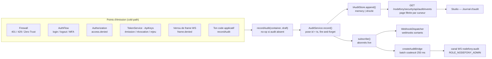
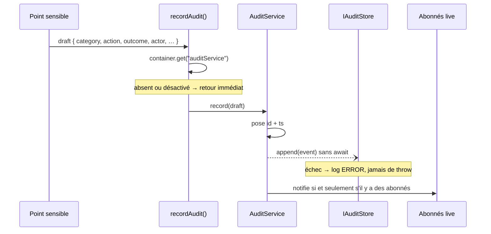

# Journal d'audit — la mémoire des décisions de sécurité

> Chaque fois qu'une **décision de sécurité** est prise — un login réussit, un accès est refusé, une
> clé d'API est révoquée, un jeton volé resurgit — Nodefony écrit une ligne dans un journal
> **append-only** : qui, quoi, quand, d'où, avec quel verdict. Pas le trafic (ça, c'est le log HTTP) :
> les **transitions d'état**. Ancré sur `AuditService` (`auditService.ts:48`), le contrat
> `IAuditEvent` (`IAuditEvent.ts:53`) et les stores de `nodefony/src/audit/`.

📍 [Documentation](../../../../../docs/index.md) › [Sécurité](index.md) › **Journal d'audit**

## 🧠 Le modèle mental — deux journaux, deux métiers

Un serveur produit **deux** flux d'écriture, et les confondre coûte cher. Le log de trafic répond à
« que s'est-il passé sur le réseau ? » ; le journal d'audit répond à « **qui a obtenu quoi, et
pourquoi** ? ».

|                | Log de trafic (`@nodefony/http`) | Journal d'audit (`@nodefony/security`)           |
| -------------- | -------------------------------- | ------------------------------------------------ |
| Volume         | **1 entrée par requête**         | 1 entrée par **transition de sécurité**          |
| Contenu        | méthode, URL, statut, durée      | acteur, action, verdict, motif machine           |
| Sur un succès  | écrit toujours                   | **muet** (le volume nominal n'est pas un signal) |
| Destination    | stdout → collecteur              | store durable, requêtable, à rétention           |
| Question posée | « le service tient-il ? »        | « qui s'est connecté cette nuit ? »              |



`AuditService.record()` (`auditService.ts:180`) est le point de passage unique : il pose l'identité et
l'horodatage, écrit **sans attendre**, et notifie les abonnés live. Tout le reste — stores, pont WS,
webhooks, console — se branche autour de lui.

## 📖 Lexique

| Terme             | Sens                                                                                               |
| ----------------- | -------------------------------------------------------------------------------------------------- |
| Événement d'audit | Une ligne du journal : acteur + action + verdict + provenance (`IAuditEvent`).                     |
| Acteur (_actor_)  | Le **libellé d'identité** de qui a agi (`token.getUserIdentifier()`), ou `null` si anonyme.        |
| Issue (_outcome_) | Le verdict : `success`, `failure` (l'acteur a raté une preuve), `denied` (une politique a refusé). |
| Catégorie         | Le sous-système concerné (`auth`, `authz`, `token`…) — union **fermée**.                           |
| Action            | Le fait, conventionné `<sujet>.<verbe>` (`login.success`) — chaîne **ouverte**.                    |
| Raison (_reason_) | Motif **machine** stable et filtrable (`invalid_credentials`, `throttled`), jamais une phrase.     |
| Append-only       | On n'ajoute que des lignes ; rien n'est modifié ni supprimé, sauf la purge de rétention.           |
| Rétention         | Durée pendant laquelle un événement reste consultable avant purge (`retentionDays`).               |
| GC                | _Garbage collection_ : la purge périodique des événements hors rétention.                          |
| Curseur           | Jeton opaque « donne-moi la suite après celui-ci » — la façon de paginer un flux qui grandit.      |
| Cold-path         | Chemin d'exception (échec, refus). Par opposition au **hot-path** : le chemin nominal, à coût nul. |
| Fire-and-forget   | On lance l'écriture sans l'attendre : le flux métier ne dépend pas de son succès.                  |
| Redaction         | Le fait de ne jamais laisser entrer un secret dans une trace.                                      |

## Qu'est-ce qu'un journal d'audit — et quelle faille il ferme

Un journal d'audit est le **magnétoscope des décisions de sécurité**. Il n'empêche aucune attaque :
il rend l'attaque **racontable après coup**.

La faille qu'il ferme n'est pas une injection, c'est le **trou noir** : sans journal, une intrusion
est indétectable et indémontrable. Concrètement, sans lui :

- une **attaque par force brute** ressemble à du trafic normal — personne ne voit les 4 000
  `login.failure` de la nuit ;
- un **jeton volé** rejoué passe inaperçu, alors que c'est le signal d'attaque le plus fort qui soit ;
- une **escalade de privilèges** ne laisse aucune trace exploitable : impossible de dire quel compte
  a tenté quoi, ni depuis quelle IP ;
- face à un auditeur (ISO 27001, SOC 2, RGPD), tu ne peux **rien prouver** — ni que les accès sont
  contrôlés, ni qu'un refus a bien eu lieu.

C'est la raison d'être des exigences de journalisation de l'**OWASP Logging Cheat Sheet** et de
l'entrée **A09:2021 – Security Logging and Monitoring Failures** du Top 10 : l'absence de trace est
elle-même classée comme une vulnérabilité.

## La vision Nodefony

Trois partis pris, tous vérifiables dans le code.

**1. Le journal trace les transitions, jamais le trafic.** Le succès nominal est **muet** : une
requête authentifiée qui passe n'écrit rien. Prouvé par les tests « SUCCÈS authentifié → AUCUNE
émission » (`auditEmissionHotPath.test.ts:229`) et « SUCCÈS anonyme EXPLICITE → AUCUNE émission »
(`auditEmissionHotPath.test.ts:243`). Conséquence directe : ce que tu lis dans le journal **est** un
signal, pas du bruit à filtrer.

**2. L'audit ne peut jamais casser le métier.** `record()` est synchrone, sans `await`, et l'écriture
part en fire-and-forget avec un `.catch()` qui se contente de logger (`auditService.ts:192`). Un
store en panne dégrade la traçabilité, il ne renvoie pas 500 à l'utilisateur.

**3. Le store est pluggable, jamais câblé en dur.** Le service résout un **nom** via un registre
(`getAuditStoreFactory()`, `auditStoreRegistry.ts:48`) ; le socle n'embarque que le builtin mémoire,
posé par `registerAuditStore("memory")` à l'import (`auditStoreRegistry.ts:64`), et les backends
lourds s'enregistrent depuis **leur** module. Un
`if (name === "drizzle")` dans le service trahirait la promesse.

## 🚀 Démarrage rapide

Dans une app générée par `nodefony create app`, l'audit est **déjà actif** (`enabled: true` par
défaut, `config.ts:729`) sur un store mémoire. Voici le parcours complet : configurer, émettre,
relire.

### 1. Choisir où le journal est écrit

```typescript
// nodefony.config.ts (extrait) — le journal survit au redémarrage et se partage entre pods
use("@nodefony/security", {
  audit: {
    // "auto" (défaut) suit l'infra database déclarée ; "drizzle" force le SQL.
    // "memory" = volatile et per-pod : parfait en dev, jamais en production.
    store: "drizzle",
    // Rétention : au-delà, la purge horaire supprime. Défaut 365 jours.
    retentionDays: 90,
  },
});
```

Rien d'autre à écrire : l'adapter `@nodefony/drizzle` déclare l'entité **et** la fabrique de store
tout seul au démarrage (`registerStores.ts:241`).

### 2. Émettre un événement depuis ton code

`recordAudit()` (`recordAudit.ts:15`) est exporté par le module. Il est **no-op** si l'audit est
absent ou désactivé — tu peux l'appeler sans garde.

```typescript
// nodefony/controllers/ExportController.ts — complet, compile tel quel
import {
  controller,
  Controller,
  Post,
  IsGranted,
  CurrentUser,
} from "@nodefony/framework";
import { recordAudit } from "@nodefony/security";
import type { IUser } from "@nodefony/user";

@controller("/api/back/export")
class ExportController extends Controller {
  @IsGranted(["ROLE_ADMIN"])
  @Post("/customers")
  async exportCustomers(@CurrentUser() user: IUser) {
    // L'export de données clients est une action sensible : elle DOIT laisser une trace.
    recordAudit(this.container, {
      category: "authz", // union fermée — voir le catalogue plus bas
      action: "data.exported", // chaîne libre, convention <sujet>.<verbe>
      outcome: "success",
      actor: user.identifier, // un libellé d'identité, JAMAIS un secret
      resource: "customers",
      reason: "admin_export",
      metadata: { rows: 4213 }, // extras applicatifs libres
    });
    return this.renderJson({ exported: 4213 });
  }
}

export default ExportController;
```

> [!IMPORTANT]
> `category` est une **union fermée** de sous-systèmes de sécurité (`IAuditEvent.ts:16`) : il n'existe
> pas de catégorie « métier ». C'est volontaire — ce journal est celui de la sécurité. Range ton
> événement dans la catégorie de sécurité qu'il concerne (ici `authz` : un accès privilégié à des
> données) et laisse `action` porter le vocabulaire métier.

### 3. Relire le journal

Le data plane d'admin sert une **page filtrée**, réservée à `ROLE_NODEFONY_ADMIN`
(`SecurityAdminApi.ts:331`) :

```bash
# Les échecs d'authentification d'un compte, sur une fenêtre donnée
curl -s -b /tmp/jar \
  'http://localhost:5151/nodefony/security/api/audit/events?category=auth&outcome=failure&actor=alice&limit=50'
```

### Ce qu'on observe

```json
{
  "items": [
    {
      "id": "9f3ac21b-1",
      "ts": 1763548800123,
      "category": "auth",
      "action": "auth.failure",
      "outcome": "failure",
      "actor": "alice",
      "resource": "nodefony-admin",
      "reason": "invalid_credentials",
      "ip": "203.0.113.9",
      "userAgent": "curl/8.6.0",
      "requestId": "req-7c1e",
      "flags": { "hasAuthorization": true, "hasCookie": false }
    }
  ],
  "limit": 50,
  "hasNext": true,
  "nextCursor": "1763548800123:9f3ac21b-1",
  "total": 137
}
```

Trois choses à remarquer : le **motif machine** (`reason`) est filtrable, la **provenance** est là
sans qu'on l'ait demandée (IP, User-Agent, `requestId`), et les `flags` disent qu'un en-tête
`Authorization` **était présent** — sans jamais donner sa valeur.

Le même journal est consultable dans **Studio → Sécurité → Journal d'audit**.

## ⚙️ Quatre situations — du besoin à la config

### Situation 1 — « Qui s'est connecté à ce compte cette nuit ? »

Un utilisateur signale une activité suspecte sur son compte. Tu veux la liste des tentatives, réussies
et ratées, sur une fenêtre précise.

Aucune configuration : les événements d'authentification sont émis par défaut. Il suffit de filtrer.
Les critères se **combinent en ET** et sont traduits par `parseAuditQuery()`
(`SecurityAdminApi.ts:191`) :

| Paramètre   | Effet                                           | Exemple                     |
| ----------- | ----------------------------------------------- | --------------------------- |
| `category`  | restreint à un sous-système                     | `category=auth`             |
| `outcome`   | restreint à un verdict                          | `outcome=failure`           |
| `actor`     | égalité **exacte** sur l'identifiant            | `actor=alice`               |
| `action`    | égalité exacte sur l'action                     | `action=login.success`      |
| `requestId` | tous les événements d'**une seule requête**     | `requestId=req-7c1e`        |
| `since`     | borne basse d'horodatage, epoch ms **inclus**   | `since=1763503200000`       |
| `until`     | borne haute d'horodatage, epoch ms **inclus**   | `until=1763524800000`       |
| `limit`     | taille de page (défaut 100, **plafonné à 500**) | `limit=200`                 |
| `cursor`    | le `nextCursor` de la page précédente           | `cursor=1763548800123:9f-1` |

```bash
# La nuit de 02:00 à 08:00, tout ce qui concerne alice
curl -s -b /tmp/jar 'http://localhost:5151/nodefony/security/api/audit/events\
?actor=alice&since=1763517600000&until=1763539200000&limit=200'
```

Ce qu'on observe : les `login.success` et `login.failure` **avec leur IP**, et un `auth.throttled`
si le backoff NIST s'est déclenché — la signature d'une attaque par essais répétés.

### Situation 2 — « Prouver à un auditeur qu'un accès refusé a bien été tracé »

Un auditeur demande la preuve que le contrôle d'accès n'est pas décoratif.

Le jury d'autorisation journalise **tout refus** et **seulement** les refus, par un appel à
`recordAudit()` (`authorization.ts:130`) : les octrois restent muets, parce qu'un octroi est du
volume, pas un signal.

```bash
curl -s -b /tmp/jar \
  'http://localhost:5151/nodefony/security/api/audit/events?outcome=denied&limit=100'
```

Ce qu'on observe : des `access.denied` dont le champ `resource` porte **l'attribut exigé**
(`ROLE_ADMIN`, `doc.edit`…) et `reason` le motif du jury (`veto`, silence des voters). Le
`requestId` permet de recoller l'événement à la trace complète de la requête.

> [!TIP]
> Le refus au niveau du **firewall** (401) et le refus au niveau de l'**autorisation** (403) sont deux
> événements différents : `auth.denied` (catégorie `auth`) contre `access.denied` (catégorie `authz`).
> Filtrer sur `category=authz&outcome=denied` isole exactement « quelqu'un d'authentifié a tenté ce
> qu'il n'avait pas le droit de faire » — le signal d'escalade de privilèges.

### Situation 3 — « Garder 90 jours sans faire exploser la base »

Ta politique de conservation impose 90 jours, pas plus (minimisation RGPD) et pas moins (obligation
de preuve).

```typescript
use("@nodefony/security", {
  audit: { store: "drizzle", retentionDays: 90 },
});
```

Ce que ça déclenche : le service arme un `GcScheduler` de purge **toutes les heures**
(`auditService.ts:152`, intervalle `GC_INTERVAL_MS` — `auditService.ts:31`), avec gigue
anti-avalanche en cluster. Chaque
tour appelle la purge du contrat — `gc()`, voisin de `listPage()` dans le même contrat
(`IAuditStore.ts:67`) — qui supprime les événements plus vieux que la fenêtre : un `DELETE` par seuil
côté SQL (`DrizzleAuditStore.ts:231`), un défilement de file tant que l'événement de tête dépasse le
`threshold` côté mémoire (`MemoryAuditStore.ts:127`).

Ce qu'on observe dans les logs : `audit gc — 1284 événement(s) purgé(s)` en niveau DEBUG.

Le store mémoire porte une **seconde** protection, indépendante du temps : un plafond de
**10 000 entrées** en FIFO (`MemoryAuditStore.ts:10`, appliqué à `MemoryAuditStore.ts:59`). Ce n'est
pas une politique de rétention, c'est un garde-fou anti-fuite : la mémoire d'un pod est bornée quoi
qu'il arrive.

### Situation 4 — « Ne rien perdre quand le store tombe »

La base est indisponible pendant trente secondes. Que se passe-t-il ?

Le choix de Nodefony est explicite : **le métier passe avant la trace**. L'écriture part en
fire-and-forget — `append()` sans `await`, échec absorbé en log ERROR (`auditService.ts:192`) ; côté SQL, si l'ORM n'est
pas connecté, `append()` est un no-op assumé (`DrizzleAuditStore.ts:131`). Un login n'échoue jamais
parce que le journal est cassé.

> [!WARNING]
> Le corollaire est une **perte possible d'événements** pendant une panne du store. Le contrat est
> best-effort, pas transactionnel : il n'existe pas de tampon de reprise ni de journal d'écriture
> anticipée. Si ta conformité exige « aucune action sans trace », il faut un store à haute
> disponibilité — le contrat `IAuditStore` (`IAuditStore.ts:48`) est le point d'extension pour ça.

Deux garde-fous limitent la casse au démarrage : un store **explicitement** configuré mais inconnu
**avorte le boot en production** (`auditService.ts:109`), et un store `memory` en production déclenche
un `WARNING` nommant précisément le risque — volatil, per-pod, rétention réglementaire impossible
(`auditService.ts:122`).

## 🔐 Le catalogue des événements audités

Deux axes de classement. La **catégorie** est une union **fermée** (`IAuditEvent.ts:16`) : c'est
l'axe de filtrage principal de la console. L'**action** est une chaîne **ouverte**
(`IAuditEvent.ts:66`) : la liste grandit sans jamais casser le contrat.

### Vue d'ensemble — choisir son filtre en cinq secondes

<!-- prettier-ignore -->
| Catégorie | Ce qu'elle trace | Actions réellement émises par le framework |
| --- | --- | --- |
| `auth` | authentification, chaîne du firewall | `auth.failure` · `auth.throttled` · `auth.denied` · `login.success` · `login.failure` · `login.throttled` · `login.mfa_required` · `user.totp_disabled` |
| `authz` | autorisation (voters, `@IsGranted`) | `access.denied` |
| `token` | jetons longue durée et clés d'API | `token.issued` · `token.reuse_detected` · `apikey.created` · `apikey.revoked` |
| `session` | cycle de vie de session | `logout` |
| `webauthn` | passkeys | `user.passkey_revoked` |
| `ws` | verrou de frame WebSocket | `frame.denied` |
| `webhook` | webhooks sortants | `webhook.created` · `webhook.updated` · `webhook.deleted` · `webhook.rotated` · `webhook.revealed` · `webhook.disabled` |
| `oauth` | login social OAuth2 | _catégorie déclarée, aucune action émise aujourd'hui_ |
| `csrf` | défense CSRF | _catégorie déclarée, aucune action émise aujourd'hui_ |
| `cors` | politique CORS | _catégorie déclarée, aucune action émise aujourd'hui_ |
| `config` | mutation de config runtime depuis Studio | _catégorie déclarée, aucune action émise aujourd'hui_ |

Les trois issues possibles (`IAuditEvent.ts:35`) ne sont pas interchangeables : `failure` = **l'acteur
a échoué une preuve** (mauvais mot de passe, signature invalide) ; `denied` = **une politique a
refusé** un acteur pourtant bien formé (Zero Trust, rôle manquant) ; `success` = l'action a abouti.
Pour un auditeur, la colonne `denied` est celle des tentatives d'accès non autorisé.

### `auth` — la chaîne d'authentification

Quatre sorties d'échec du firewall passent par le même helper `Firewall.#recordAuth()`
(`firewall.ts:693`), qui enrichit l'événement de la provenance et pose la **zone** en `resource` :

- `auth.throttled` — backoff NIST déclenché, réponse 429 (`firewall.ts:768`) ;
- `auth.failure` — un credential a été **présenté** et rejeté (`firewall.ts:794`) ;
- `auth.denied` / `no_credentials` — Zero Trust : rien n'a été présenté sur une zone protégée
  (`firewall.ts:811`) ;
- `auth.denied` / `unauthenticated` — un jeton non promu hors `anonymous` (`firewall.ts:638`).

Le parcours de login BFF émet en parallèle son propre vocabulaire depuis `AuthFlow` :
`login.failure` sur identité inconnue (`authFlow.ts:125`) ou mot de passe faux (`authFlow.ts:153`),
`login.throttled` (`authFlow.ts:139`), `login.mfa_required` quand un second facteur est réclamé
(`authFlow.ts:175`), et `login.success` après la preuve complète (`authFlow.ts:191`,
`authFlow.ts:229`).

### `authz` — le refus d'autorisation

Un seul événement, mais c'est le plus parlant : `access.denied`, émis par le jury de voters
(`authorization.ts:130`). `resource` porte l'attribut refusé, `reason` le motif de la décision.

### `token` — la vie et la mort des jetons longue durée

- `token.issued` — un couple access/refresh vient d'être émis, donc une surface d'attaque vient
  d'être créée ; les `scopes` et l'identifiant du jeton partent en `metadata` (`tokenService.ts:312`) ;
- `token.reuse_detected` — **le signal d'attaque le plus fort du journal** : un refresh déjà révoqué
  a été re-présenté, donc quelqu'un détient un jeton volé. Toute la famille est coupée
  (`tokenService.ts:353`, RFC 9700 §4.14) ;
- `apikey.created` / `apikey.revoked` — cycle de vie des clés d'API (`apiKeys.ts:153`,
  `apiKeys.ts:212`).

### `ws` — le verrou de frame WebSocket

`frame.denied` est émis par le rapporteur branché sur le verrou de frame (`firewall.ts:302`) quand une
socket tente un `api.request` vers une zone protégée ou s'abonne à un canal interdit. La frame ne
porte ni IP ni `requestId` — acteur et cible suffisent.

### `webhook` — les mutations d'endpoints et la mort d'un endpoint

Les mutations d'admin sont tracées une par une (`WebhookAdminApi.ts:305` à `WebhookAdminApi.ts:509`),
y compris `webhook.revealed` : révéler un secret en clair est une action à auditer. L'auto-désactivation
après échecs répétés émet **un seul** événement `webhook.disabled` par endpoint qui meurt, jamais un par
échec (`webhooks.ts:587`).

### `config` et Studio — les actions d'admin

Les producteurs d'admin passent par `auditAdmin()` (`adminAudit.ts:37`), qui lit le sink
défensivement, et par `adminActor()` (`adminAudit.ts:19`) pour dériver un libellé d'identité stable
depuis l'utilisateur de la requête — avec repli `"admin"`, jamais une décision d'autorisation.

## 🧰 Le contrat d'une entrée

Un événement est un objet **sérialisable JSON** (`IAuditEvent.ts:53`). L'émetteur ne fournit qu'un
brouillon `IAuditEventDraft` (`IAuditEvent.ts:105`) : `id` et `ts` sont posés par le service, ce qui
garantit un seul appel d'horloge, centralisé hors des points d'émission.

| Champ       | Type                       | Posé par | Rôle                                                         |
| ----------- | -------------------------- | -------- | ------------------------------------------------------------ |
| `id`        | `string`                   | service  | unique dans le process ; sert aussi de composante de curseur |
| `ts`        | `number` (epoch ms)        | service  | horodatage (`auditService.ts:188`)                           |
| `category`  | `AuditCategory`            | émetteur | sous-système — union fermée                                  |
| `action`    | `string`                   | émetteur | le fait, `<sujet>.<verbe>` — chaîne ouverte                  |
| `outcome`   | `success\|failure\|denied` | émetteur | le verdict                                                   |
| `actor`     | `string \| null`           | émetteur | libellé d'identité, `null` si anonyme (`IAuditEvent.ts:74`)  |
| `resource`  | `string \| null`           | émetteur | zone, route, canal, attribut — descripteur **léger**         |
| `reason`    | `string \| null`           | émetteur | motif **machine** filtrable, pas un message traduit          |
| `ip`        | `string \| null`           | contexte | provenance réseau                                            |
| `userAgent` | `string \| null`           | contexte | provenance client                                            |
| `requestId` | `string \| null`           | contexte | corrélation log ↔ audit ↔ trace                              |
| `flags`     | `IAuditEventFlags`         | contexte | **présence** de matériel sensible, jamais la valeur          |
| `metadata`  | `Record<string, unknown>`  | émetteur | extras applicatifs libres, absents par défaut                |

Les quatre derniers champs de provenance sont remplis d'un coup par `readAuditContext()`
(`readAuditContext.ts:33`), qui lit un contexte HTTP ou WS de façon défensive — tous les champs sont
optionnels, un contexte partiel ne casse rien.

## ⚡ Performance & mémoire — pourquoi l'audit ne pèse pas sur la requête

C'est un point d'honneur du framework : **l'audit ne se paie que quand il se passe quelque chose**.
Quatre mécanismes, tous prouvés par les tests.

**1. Le chemin nominal n'émet rien.** Ce n'est pas une optimisation, c'est le modèle : le firewall
n'appelle `#recordAuth()` que depuis ses quatre sorties d'échec, jamais depuis le succès
(`firewall.ts:884`). Le verrou WS ne tire sa closure `onDeny` que sur refus (`firewall.ts:341`).
Prouvé : « frame AUTORISÉE → onDeny JAMAIS appelé » (`auditEmissionHotPath.test.ts:324`).

**2. Audit désactivé = coût nul, pas juste coût faible.** `record()` sort avant toute allocation et
avant tout appel d'horloge si le service est inactif (`auditService.ts:182`). Aucun objet créé,
aucun appel d'horloge. Prouvé par le banc « audit désactivé → `issueTokens` n'est pas journalisé »
(`auditEmissionHotPath.test.ts:499`).

**3. L'écriture ne bloque pas.** `append()` part sans `await`, avec un `.catch()` qui logge
(`auditService.ts:192`). La latence du store n'entre jamais dans la latence de la requête.

**4. Tout ce qui n'est pas utilisé n'est pas alloué.** La liste d'abonnés live reste `null` tant que
personne n'écoute et **redevient** `null` au dernier désabonnement (`auditService.ts:221`). Le pont
WS n'existe qu'entre le premier et le dernier auditeur connecté, et son tampon circulaire n'est
alloué qu'au premier événement reçu (`auditBridge.ts:62`) ; son minuteur est armé à la demande et
`unref` (`auditBridge.ts:93`).

Le pont applique en plus un **coalescing borné** : au plus une frame WS toutes les 250 ms
(`auditBridge.ts:59`), tampon plafonné à 200 événements (`auditBridge.ts:60`). Sous une rafale
d'échecs de login, le tampon écrase les plus anciens et compte les omis dans `dropped`
(`auditBridge.ts:84`) — la console affiche un récapitulatif au lieu de se figer. Superviser ne doit
jamais faire tomber ce qu'on supervise.

## ⚙️ Configuration

Table dérivée du schéma Zod `auditSchema` (`config.ts:877`), rattaché à la racine sous la clé `audit`
(`config.ts:1121`).

| Option          | Type      | Défaut   | Effet                                                                                |
| --------------- | --------- | -------- | ------------------------------------------------------------------------------------ |
| `enabled`       | `boolean` | `true`   | `false` → `record()` no-op à coût nul, `listPage()` page vide, endpoint admin en 503 |
| `store`         | `string`  | `"auto"` | nom résolu par le registre : `auto`, `memory`, `drizzle`                             |
| `retentionDays` | `number`  | `365`    | fenêtre de conservation ; au-delà, la purge horaire supprime                         |
| `immutable`     | `boolean` | `true`   | déclaré au schéma — voir l'avertissement ci-dessous                                  |
| `stream`        | `boolean` | `true`   | déclaré au schéma — voir l'avertissement ci-dessous                                  |

> [!WARNING]
> `immutable` et `stream` sont déclarés dans le schéma mais **ne sont lus par aucun code** aujourd'hui.
> Les mettre à `false` ne change rien. L'immuabilité vient du **contrat** `IAuditStore`, qui n'expose
> ni `update` ni `delete` ciblé (`IAuditStore.ts:48`) ; la diffusion live est gouvernée par la
> **présence d'abonnés** — la liste `#listeners` du service (`auditService.ts:194`).

### Comment `store: "auto"` décide

Le défaut ne suppose rien : il **suit l'infrastructure déclarée**, borné aux backends réellement
enregistrés (`auditService.ts:92`, logique `resolveAutoStore()` dans `infra.ts:241`).

1. `NF_STORE` posée et le backend est enregistré pour l'audit → il gagne (levier de banc de charge) ;
2. sinon, une base est déclarée (`NF_DATABASE_URL`) → `drizzle`, ou `mongoose` selon la famille ;
3. sinon, repli **annoncé** sur `memory` — la décision est loggée en INFO, jamais silencieuse.

La résolution finale est publiée au kernel (`auditService.ts:139`), ce qui alimente l'écran des stores
de Studio : configuré, résolu, disponible, motif, emplacement physique.

## 🏗️ Architecture interne



Quatre pièces, quatre responsabilités :

- **`recordAudit()`** (`recordAudit.ts:15`) — le point d'émission côté appelant. Une résolution par le
  container, sur le cold-path uniquement. C'est ce qui rend l'audit **découplé** : module absent →
  aucun effet, jamais d'exception qui remonterait dans le flux métier.
- **`AuditService`** (`auditService.ts:48`) — le propriétaire. Il construit le store au boot, le pose
  au container sous le nom `auditStore` (`auditService.ts:138`), arme la purge, et implémente
  `IAuditSink` (`IAuditStore.ts:77`).
- **`IAuditStore`** (`IAuditStore.ts:48`) — le contrat de persistance : `append`, `listPage`, `gc`.
  **`append` est la seule écriture** : ni `update`, ni `delete` ciblé. L'immuabilité EST la garantie
  d'audit.
- **`createAuditBridge()`** (`auditBridge.ts:53`) — le pont vers le canal WS `nodefony:audit`
  (`auditBridge.ts:8`), enregistré comme canal **système** par le firewall (`firewall.ts:322`) et donc
  gardé par le plancher `security:` → `ROLE_NODEFONY_ADMIN` (`frameAuthorizer.ts:106`).

### La lecture paginée — pourquoi un curseur et pas un décalage

Un journal reçoit des écritures **pendant** qu'on le parcourt. Un `OFFSET 200` glisserait d'une page
à l'autre : on reverrait des événements déjà lus, on en manquerait d'autres. Le contrat impose donc le
**curseur** (`IAuditStore.ts:22`).

Le curseur est **composite et auto-portant** : `<ts>:<id>`. Deux propriétés que les deux backends
tiennent identiquement :

- **ordre total** — l'horodatage porte la chronologie, l'identifiant départage les collisions à la
  milliseconde. Sans ce tri `desc(ts), desc(id)`, trois échecs de login de la même milliseconde
  pourraient se répéter ou disparaître (`MemoryAuditStore.ts:83`, `DrizzleAuditStore.ts:197`) ;
- **auto-portance** — le jeton contient tout ce qu'il faut pour se comparer, donc une page reste juste
  même si l'événement qui l'a produite a été purgé entre-temps (`MemoryAuditStore.ts:115`,
  `DrizzleAuditStore.ts:219`). Un curseur réduit à un identifiant nu aurait rembobiné en silence à la
  première page — et fait boucler la console.

Le `total` est **refusable** (`withTotal: false`) : un `COUNT` filtré sur une rétention longue se
paie (`IAuditStore.ts:59`). `hasNext` et `nextCursor` restent fiables dans les deux cas, grâce à une
ligne de garde `limit + 1` (`DrizzleAuditStore.ts:198`).

## Entité de persistance et dialectes pris en charge

**Un seul backend durable** est fourni : `@nodefony/drizzle`. Le décompte honnête :

| Backend              | Store d'audit | Dialectes prouvés                   |
| -------------------- | ------------- | ----------------------------------- |
| builtin `memory`     | ✅ fourni     | — (mémoire du process, per-pod)     |
| `@nodefony/drizzle`  | ✅ fourni     | SQLite · PostgreSQL · MySQL/MariaDB |
| `@nodefony/mongoose` | ❌ absent     | —                                   |
| `@nodefony/redis`    | ❌ absent     | —                                   |

Mongoose porte session, user, jetons, passkeys et webhooks, mais **pas** l'audit ; Redis non plus.
Ces deux absences n'ont pas le même statut. Redis n'en aura pas, et la raison n'est pas
« c'est un cache » — il porte déjà des données durables comme les passkeys, en opt-in assumé. C'est
que le journal d'audit **croît sans borne**, se conserve des mois pour la conformité, et se
**consulte** (recherche, filtres, pagination) : garder tout ça en mémoire vive coûte cher pour un
motif d'accès qui n'est pas le sien. Mongo, lui, est un chemin **durable** :
l'audit y **manque**, et c'est un manque à combler (objectif « full NoSQL », `MIGRATION_STATUS.md`
P7.11) — un utilisateur choisit sa base de données, pas de perdre sa traçabilité.

En attendant, une application MongoDB qui veut un journal durable a trois voies : brancher un store
maison (voir l'extension ci-dessous), charger `@nodefony/drizzle` à côté de Mongo — même en SQLite
local, les deux modules cohabitent — ou héberger le journal sur une base SQL.

### La table `audit_event`

L'entité est déclarée en spécification logique (`auditEventEntity.ts:37`), déclinée par dialecte via
le `colKit` — mêmes **noms** de colonnes partout, donc un store dialect-agnostique. La forme de ligne
`AuditEventRow` (`auditEventEntity.ts:85`) est **identique** au contrat `IAuditEvent`, champ pour
champ : aucun mapping surprise.

| Colonne                                 | SQLite      | PostgreSQL | MySQL/MariaDB     | Note                       |
| --------------------------------------- | ----------- | ---------- | ----------------- | -------------------------- |
| `id`                                    | `text` PK   | `text` PK  | `varchar(512)` PK | identifiant de l'événement |
| `ts`                                    | `integer`   | `bigint`   | `bigint`          | epoch ms, exposé `number`  |
| `category`                              | `text`      | `text`     | `varchar(512)`    | non nul, **indexé**        |
| `action`, `outcome`                     | `text`      | `text`     | `text`            | non nuls                   |
| `actor`, `requestId`                    | `text`      | `text`     | `varchar(512)`    | **NULLABLE**, **indexés**  |
| `resource`, `reason`, `ip`, `userAgent` | `text`      | `text`     | `text`            | **NULLABLE**               |
| `flags`, `metadata`                     | `text` json | `jsonb`    | `json`            | **NULLABLE**               |

En MySQL, toute colonne texte **indexée** (ou clé primaire) devient `varchar(512)` : InnoDB ne sait
pas indexer un `TEXT` sans longueur de préfixe. Même règle pour tout le framework, portée par le
`colKit` — jamais par l'entité.

Quatre index couvrent les axes de la console (`auditEventEntity.ts:61`) : `ts` pour la pagination
chronologique, `category`, `actor` et `requestId` pour les filtres. Ils sont lus par `drizzle-kit`
pour les migrations de production ; en dev et en test, le DDL dérivé les ignore — pure performance de
filtrage, jamais de sémantique.

L'entité et la fabrique sont enregistrées automatiquement par l'adapter au démarrage
(`registerStores.ts:241`, entité via `registerAuditEntities()`, `auditEventEntity.ts:141`). Côté
implémentation, `DrizzleAuditStore` (`DrizzleAuditStore.ts:63`) résout son handle de base **à chaque
appel**, pas à la construction : l'ordre de démarrage n'est pas garanti, et l'ORM se déconnecte au
`onTerminate` avant le drain des serveurs.

## 🔐 Sécurité — ce qui n'entre JAMAIS dans le journal

La règle d'or est écrite en tête du contrat (`IAuditEvent.ts:8`) : **un secret n'entre jamais dans un
événement**. Ni mot de passe, ni jeton, ni cookie, ni corps de requête, ni en-têtes.

Ce que le code garantit, concrètement :

- **Le typage rend le secret difficile à faire entrer.** `actor` est documenté comme un _libellé
  d'identité_ (`IAuditEvent.ts:74`) et `resource` comme un _descripteur léger_ — « jamais le corps ni
  les en-têtes de la requête » (`IAuditEvent.ts:79`).
- **La présence remplace la valeur.** `IAuditEventFlags` (`IAuditEvent.ts:41`) ne porte que deux
  booléens : un en-tête `Authorization` était-il là, un cookie était-il là. `readAuditContext()`
  les calcule par un simple `Boolean(headers[…])` (`readAuditContext.ts:40`) — la valeur n'est jamais
  copiée.
- **Les émetteurs journalisent l'identifiant public, pas le secret.** Une clé d'API émet son `id`
  public en `resource`, jamais le jeton. Prouvé explicitement : le test vérifie que la sérialisation
  complète de l'événement **ne contient pas** le secret créé
  (`auditEmissionHotPath.test.ts:545`).
- **Le motif reste machine.** `reason` est une valeur stable et filtrable, pas un message d'erreur
  libre (`IAuditEvent.ts:84`) : c'est ce qui empêche une cause fine de fuir dans la trace… et qui
  permet de la garder **côté audit** alors que le client, lui, reçoit un message d'échec uniforme
  (anti-énumération).

Deux autres propriétés de sécurité valent d'être connues :

- **Pas d'événement fantôme.** Révoquer la clé d'API d'autrui n'émet **rien** : l'anti-énumération
  vaut aussi pour le journal, sinon le journal lui-même deviendrait un oracle
  (`auditEmissionHotPath.test.ts:561`).
- **Lecture réservée aux administrateurs.** L'endpoint est gardé `ROLE_NODEFONY_ADMIN`, le canal live
  aussi via le plancher irréductible `security:` (`frameAuthorizer.ts:107`) — un utilisateur ordinaire
  qui tente de s'y abonner produit lui-même un `frame.denied`.

## 📜 Normes appliquées

| Exigence                                  | Norme                             | Comment le code s'y conforme                                                      |
| ----------------------------------------- | --------------------------------- | --------------------------------------------------------------------------------- |
| Journaliser les échecs d'authentification | OWASP Logging Cheat Sheet         | `auth.failure`/`auth.throttled`/`auth.denied` (`firewall.ts:693`)                 |
| Journaliser les refus d'autorisation      | OWASP A09:2021                    | `access.denied` sur tout refus du jury (`authorization.ts:130`)                   |
| Ne jamais journaliser de secret           | OWASP Logging Cheat Sheet         | flags de **présence** seuls (`IAuditEvent.ts:41`)                                 |
| Traçabilité « qui, quoi, quand, d'où »    | ISO 27001 A.8.15 (journalisation) | acteur, action, horodatage et provenance dans `IAuditEvent` (`IAuditEvent.ts:53`) |
| Journal inaltérable                       | ISO 27001 A.8.15                  | contrat append-only, aucune mutation exposée (`IAuditStore.ts:48`)                |
| Rétention bornée / minimisation           | RGPD art. 5.1.e                   | purge par âge pilotée par `retentionDays` (`config.ts:906`)                       |
| Détection de rejeu de jeton               | RFC 9700 §4.14                    | `token.reuse_detected` + coupure de famille (`tokenService.ts:353`)               |
| Backoff de login journalisé               | NIST SP 800-63B                   | `auth.throttled` avec `reason: "throttled"` (`firewall.ts:773`)                   |

## 📡 Observabilité — Studio

L'écran **Sécurité → Journal d'audit** (`/nodefony/audit`) (`Audit.tsx:62`) consomme le data plane
`GET /nodefony/security/api/audit/events` en pagination **serveur**. Il offre :

- un tableau filtrable par heure, catégorie, action, issue, acteur, raison et IP (`Audit.tsx:227`) ;
- un indicateur du **store réellement résolu** pour la brique `audit`, alimenté par la publication de
  résolution du service (`auditService.ts:139`) ;
- un interrupteur **Temps réel** qui s'abonne au canal `nodefony:audit` (`AuditLive.tsx:20`) — pensé
  pour les pics d'activité : un journal d'audit se consulte, il ne se regarde pas défiler ;
- un renvoi vers la **trace de requête** quand l'événement porte un `requestId`, ce qui recolle
  l'événement de sécurité à toute la vie de la requête.

Quand l'audit est désactivé en configuration, l'endpoint répond **503** avec un message explicite
(`SecurityAdminApi.ts:341`) et la console l'affiche tel quel plutôt qu'un tableau vide ambigu.

### Le journal alimente les webhooks

Le flux d'audit est la **source d'événements** du dispatcher de webhooks sortants : celui-ci s'abonne
au service au démarrage (`webhooks.ts:214`) et filtre les actions souscrites avant de livrer
(`WebhookDispatcher.ts:132`). Conséquence pratique : ce qui n'est pas audité ne peut pas déclencher de
webhook. Détail des souscriptions, de la signature et des relivraisons → [webhooks](webhooks.md).

## ⚠️ Pièges

| Symptôme                                            | Cause (dans le code)                                               | Correction                                                 |
| --------------------------------------------------- | ------------------------------------------------------------------ | ---------------------------------------------------------- |
| Journal vide après un redémarrage                   | Store `memory` : volatile et per-pod (`MemoryAuditStore.ts:37`)    | `audit.store: "drizzle"` (ou déclarer `NF_DATABASE_URL`)   |
| Un pod voit des événements, l'autre non             | Store `memory` non partagé                                         | Store durable partagé                                      |
| Le boot échoue en production sur l'audit            | Store **explicite** inconnu, fail-closed (`auditService.ts:109`)   | Corriger le nom, ou charger l'adapter qui l'enregistre     |
| `limit=5000` ne rend que 500 événements             | Plafond du store (`MemoryAuditStore.ts:12`)                        | Paginer avec `nextCursor`, jamais gonfler `limit`          |
| La page 2 répète ou saute des événements            | Pagination réimplémentée en offset                                 | Repasser le `nextCursor` reçu — le curseur est opaque      |
| Filtre `?category=authen` sans effet                | Catégorie inconnue **ignorée** (`SecurityAdminApi.ts:191`)         | Utiliser une valeur de l'union (`auth`, `authz`, `token`…) |
| Le paramètre `q` ne filtre rien                     | Non appliqué sur ce journal (`IAuditStore.ts:20`)                  | Filtrer par `category`/`actor`/`action`/`requestId`        |
| `stream: false` ne coupe pas le live                | Drapeau non lu ; le live suit `#listeners` (`auditService.ts:194`) | Retirer le rôle admin, ou ne pas exposer le canal          |
| Trous dans le journal pendant une panne de base     | Écriture best-effort (`auditService.ts:192`)                       | Store à haute disponibilité si la conformité l'exige       |
| Aucun `login.success` alors que les logins marchent | Le succès du **firewall** est muet ; `login.success` vient du BFF  | Filtrer `action=login.success`, pas `category=auth` seul   |
| Endpoint d'audit en 503                             | `audit.enabled: false` (`SecurityAdminApi.ts:320`)                 | Réactiver l'audit en configuration                         |

## 🧪 Tests & couverture

Les chiffres exacts vivent dans la carte de l'aperçu (régénérée depuis vitest, jamais figée ici).
Cinq familles couvrent la brique :

- **unit — le socle** : `auditService` (store mémoire append-only, filtres, curseur, borne de volume,
  purge, instantané ; et côté service : no-op à coût nul, estampille `id`+`ts`, diffusion live,
  isolation d'un abonné qui lève) ; `auditStoreRegistry` (builtin enregistré à l'import, fabrique
  défensive sur config partielle, backend inconnu) ; `auditBridge` (coalescing borné, nettoyage,
  plancher `ROLE_NODEFONY_ADMIN` du canal).
- **unit — l'émission** : `auditEmission` prouve que `AuthFlow` et `Authorization` journalisent
  **réellement** via le container partagé, exactement comme en production.
- **unit — le hot-path** : `auditEmissionHotPath` est le banc le plus instructif de la brique. Il
  verrouille l'invariant de performance — succès authentifié et succès anonyme n'émettent **rien** —
  et couvre les quatre sorties d'échec du firewall, le câblage réel du verrou WS, l'émission des
  jetons et des clés, la non-fuite du secret, et l'absence d'événement fantôme.
- **intégration + e2e (base réelle)** : les stores Drizzle sur SQLite, plus des e2e PostgreSQL et
  MySQL/MariaDB gatés par `NF_PG_URL` / `NF_MYSQL_URL` — round-trip JSON, curseur composite avec
  collision à la milliseconde, et le compteur de purge normalisé par driver.
- **banc de contrat** : `auditPaginationContract` — **une seule** suite d'invariants de lecture,
  déroulée sur le store mémoire **et** sur Drizzle en trois dialectes. Un écart de comportement entre
  backends devient un échec de test, par construction.

Ce qui **manque** aujourd'hui : pas de test d'attaque dédié (`*.attack.test.ts`) sur le journal
lui-même — les scénarios hostiles passent par les bancs d'attaque des briques voisines
(autorisation, frames WS) ; et pas de banc de charge dédié à l'écriture d'audit.

> [!IMPORTANT]
> Un **skip est vert**. Les e2e PostgreSQL et MySQL ne s'exécutent qu'avec leurs variables d'infra ;
> sans elles, la suite passe sans avoir rien prouvé sur ces dialectes. Lancer les bases par
> `docker compose --profile postgres up -d postgres` avant de conclure.

Couverture : `npm run coverage` dans `@nodefony/security`.

## 🔗 Pour aller plus loin

- ⬆️ **Retour au hub** : [Sécurité — vue d'ensemble](index.md) · [Toute la documentation](../../../../../docs/index.md)
- Ce que le journal alimente → [webhooks](webhooks.md)
- D'où viennent les événements `auth.*` → [firewall](firewall.md) · les `login.*` → [authenticators](authenticators.md)
- D'où viennent les `access.denied` → [authorization](authorization.md)
- Les événements `token.*` → [tokens](tokens.md) · les `apikey.*` → [api-keys](api-keys.md)
- Vocabulaire transverse de la sécurité → [lexique](lexique.md)
