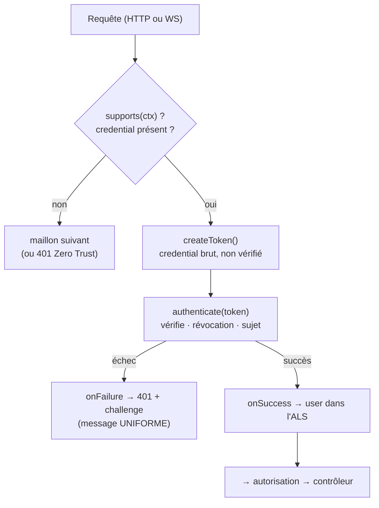

# Authenticators — prouver l'identité

> Un **authenticator** répond à une seule question : _« qui es-tu, et peux-tu le prouver ? »_. Il ne
> décide **pas** des droits (ça, c'est l'autorisation / les voters) — il établit une **identité**. Le
> firewall enchaîne les authenticators déclarés par une zone jusqu'à obtenir une preuve valide, sinon il
> ferme en 401 (Zero Trust). Nodefony en fournit **six** intégrés, tous ancrés ici sur le code
> (`src/packages/@nodefony/security/nodefony/src/authenticator/`).

## Schéma général — le cycle d'un authenticator



## Lexique

| Terme            | Sens                                                                                                               |
| ---------------- | ------------------------------------------------------------------------------------------------------------------ |
| Authentification | Établir **qui** est l'appelant (≠ autorisation, qui établit ce qu'il a le **droit** de faire).                     |
| Authenticator    | Une stratégie de preuve d'identité (`session`, `jwt`…) implémentant `IAuthenticator`.                              |
| BFF              | _Backend For Frontend_ : le web s'authentifie par **session serveur** (cookie opaque), pas par jeton exposé au JS. |
| Bearer           | Schéma `Authorization: Bearer <jeton>` (RFC 6750) — porté par les API.                                             |
| PAT              | _Personal Access Token_ : une clé API personnelle, bearer **opaque** révocable.                                    |
| JWS/JWT          | Jeton signé auto-porté (structure compacte `a.b.c`).                                                               |
| Challenge        | En-tête `WWW-Authenticate` renvoyé avec un 401 (RFC 7235) indiquant comment s'authentifier.                        |
| Zero Trust       | Sur une zone protégée, **aucune preuve valide ⇒ 401** ; l'anonymat n'est accepté que s'il est déclaré.             |

## Qu'est-ce qu'un authenticator — et quelle faille il ferme

Un serveur qui expose des données doit distinguer un appelant légitime d'un inconnu. Le faire « à la
main » dans chaque contrôleur, c'est garantir qu'un endpoint finira par être oublié — la faille la plus
banale et la plus grave. Nodefony **centralise** la preuve d'identité dans le firewall : une zone
déclare _quelles preuves elle accepte_, et rien n'atteint le contrôleur sans être passé par là. Chaque
authenticator ferme une classe d'attaque précise (énumération de comptes, brute-force, algorithm
confusion JWT, jeton volé non révocable, IDOR d'identité périmée) — détaillées brique par brique
ci-dessous.

## La vision Nodefony — un contrat, un registre, deux modes

### Le contrat `IAuthenticator`

Tout authenticator implémente le même cycle en (jusqu'à) six méthodes, ce qui rend le firewall
totalement agnostique de la stratégie :

| Méthode               | Rôle                                                                                                       |
| --------------------- | ---------------------------------------------------------------------------------------------------------- |
| `supports(ctx)`       | Test **bon marché** : le credential de cette stratégie est-il présent ? (sinon, maillon suivant)           |
| `createToken(ctx)`    | Extrait le credential **brut, non vérifié**, dans un `UserToken`.                                          |
| `authenticate(token)` | **Vérifie** (signature/hash/session), applique la **révocation**, **re-résout le sujet** — ou lève un 401. |
| `onSuccess(ctx,tok)`  | Effet de bord au succès (poser l'identité en session, audit).                                              |
| `onFailure(ctx,err)`  | Slot d'audit (le 401 + challenge sont posés par le firewall).                                              |
| `challenge()`         | La valeur `WWW-Authenticate` (RFC 7235) pour les 401 de la zone.                                           |

### Le registre pluggable

Les authenticators sont résolus par **nom** via un registre de fabriques
(`authenticatorRegistry.ts:44`), jamais par un `if (name === "jwt")` dans le firewall — ce qui
trahirait la promesse « pluggable ». Les six builtins s'enregistrent **à l'import du module** (donc
toujours avant le boot, `:72-125`) ; un plugin déclare le sien avec
`registerAuthenticatorFactory("ldap", …)` puis le référence en config — **aucun changement dans le
cœur**. La fabrique ne fait que **construire** ; les résolutions de services coûteuses (`users`,
`tokenStore`, keystore) restent **lazy** dans l'instance (cold path).

### Mode `first` vs `all`

Une zone liste ses authenticators et un `mode` (`firewall.ts:902-973`) :

- **`first`** (le plus courant) : on essaie les maillons dans l'ordre, le **premier** qui a un
  credential et réussit gagne (`:972`). Un maillon sans credential est simplement sauté (`:935`).
- **`all`** : **chaque** maillon est obligatoire (`:936`) — utile pour exiger, par exemple, une preuve
  de canal (mTLS) **et** une identité utilisateur ; le dernier maillon porte l'identité finale (`:973`).

## Analyse par brique — les six authenticators intégrés

### `anonymous` — accepter explicitement l'anonymat

Le seul authenticator autorisé à produire un token **non authentifié** sans déclencher le Zero Trust
(`AnonymousAuthenticator.ts:19`). `supports()` accepte tout, le token porte le **singleton gelé**
`anonymousUser` (zéro allocation). À ne lister **que volontairement** : `["jwt", "anonymous"]` en mode
`first` signifie « identifié si preuve présente, sinon visiteur anonyme accepté ». Sans lui, zone
protégée + aucune preuve = 401. **Faille fermée** : l'anonymat _implicite_ — ici il est un choix
explicite et auditable, jamais un défaut.

### `userpassword` — HTTP Basic + backoff NIST

Schéma **HTTP Basic** (RFC 7617) : `Authorization: Basic base64(id:mdp)`, split au **premier** `:` (le
mot de passe peut en contenir), charset UTF-8 (`UserPasswordAuthenticator.ts:24-83`). La vérification
(hash, comparaison, leurre anti-timing, re-hash transparent) est **déléguée** au `IPasswordVerifier`
(le `UserService`) — l'authenticator ne voit que le verdict. Deux défenses clés :

- **Message uniforme** `"Invalid credentials"` quelle que soit la cause (identifiant inconnu, compte
  verrouillé, mot de passe faux) → **anti-énumération de comptes** (`:13-16`, `:99`, `:112`).
- **Throttling NIST SP 800-63B** (backoff progressif par identifiant saisi) vérifié **avant** le
  verifier : un identifiant bloqué ne coûte **aucun hash** → le throttle protège aussi le serveur du
  **DoS argon2** (`:89-103`). Échec compté, succès remis à zéro. Le throttler est **partagé** avec le
  login JSON du BFF : un attaquant ne contourne pas le backoff en changeant de porte
  (`authenticatorRegistry.ts:74-79`).

### `session` — la preuve du web (BFF)

Après le login, chaque requête web prouve son identité par la **session serveur** (cookie opaque).
`supports()` exige une session **déjà reprise** porteuse d'un utilisateur (`SessionAuthenticator.ts:43`)
— le pipeline http démarre la session _avant_ le firewall ; cet authenticator ne démarre jamais rien.
Constat central : l'identité est **re-résolue à chaque requête** via `resolveSessionIdentity`
(`:70`) → **rôles frais, révocation immédiate**. Une session dont le compte a été désactivé/verrouillé
entre deux requêtes est rejetée. Pas de `challenge()` : une session absente donne un 401 nu (le client
web redirige vers son écran de login, jamais une popup Basic).

### `jwt` — Bearer signé pour les API (RFC 6750 + BCP RFC 8725)

Réservé aux **API service↔service / agents** (le web reste sur la session). Vérifie un access token
**EdDSA** signé par le keystore du serveur. Les défenses **dures** du JWT BCP (RFC 8725), toutes
prouvées en test (`JwtAuthenticator.ts:28-137`) :

| Défense                                | Comment                                                                       | Attaque fermée                                                     |
| -------------------------------------- | ----------------------------------------------------------------------------- | ------------------------------------------------------------------ |
| **Allowlist d'algorithmes**            | `algorithms: ["EdDSA"]` — jamais l'algo de l'en-tête du token (`:104`)        | `alg=none`, algorithm confusion (§3.1)                             |
| **Clé par `kid` du keyset LOCAL**      | `createLocalJWKSet` — jamais `jku`/`jwk` de l'en-tête (`:154-159`)            | injection de clé / SSRF (§3.5)                                     |
| **`aud` + `iss` + `typ` obligatoires** | `at+jwt` (§3.11) sépare access et refresh (`:105-107`)                        | refresh présenté comme access, token d'un autre service (§3.8-3.9) |
| **Révocation**                         | denylist `jti` + seuil `invalidBefore` par porteur (`:121-132`)               | jeton auto-porté volé, logout global                               |
| **Sujet revérifié**                    | `loadUserByIdentifier(sub)` → disparu/inactif/verrouillé = rejet (`:134-135`) | compte banni encore « valide » via son token (§3.10)               |

Le **message d'échec est uniforme** (`"Invalid token"`) : la cause fine (expiré, `aud`, signature,
sujet banni) part en **audit**, jamais au client — anti-oracle (`:22-24`). `jose` est importé **lazy**
(dépendance lourde, `:96`).

### `apikey` — PAT opaque révocable (P6.12)

Clé API personnelle en `Authorization: Bearer <prefix>_…`. Contrairement au JWT (auto-porté), un PAT
est un **bearer opaque** dont la vérité vit **côté serveur** (`ITokenStore`) → **révocable
immédiatement** (`ApiKeyAuthenticator.ts:27-46`). Défenses :

- **Forme + CRC validés AVANT tout accès au store** (`parseApiKey`, `:98-102`) → une valeur malformée
  n'atteint jamais la base (**anti-DoS**).
- **Lookup par hash SHA-256** (`:105`) — le secret n'existe **nulle part au repos**.
- **Révocation** (`revokedAt`) + **expiration** (`expiresAt`) + **ban en masse** du porteur
  (`invalidBefore` vs `createdAt`, `:107-120`).
- **Sujet revérifié** à chaque requête → rôles frais (`:122-123`).
- **`lastUsedAt` throttlé** : aucune écriture sur le hot path tant que la fenêtre n'est pas dépassée
  (`config.apiKeys.lastUsedThrottleS`, `:125-134`).

### `session-realtime` — l'équivalent WebSocket de `session`

Sur un handshake WS (une requête upgrade HTTP qui traverse **le même pipeline**), le firewall a
**déjà** chargé la session, re-résolu l'identité et posé l'`IUser` dans l'ALS. Cet authenticator
**réutilise** cette identité au lieu de refaire deux lectures base par connexion
(`SessionRealtimeAuthenticator.ts:16-25`) — un coût évitable sur le différenciateur temps réel. Il
câble en revanche un **revalidateur de session** appelé avant chaque action data plane : la socket peut
survivre à sa session (logout, changement de compte sur navigateur partagé), donc l'identité figée au
handshake ne doit pas resservir si la session est morte (`:59-66`, fail-closed `:104-111`).

> [!NOTE]
> **Asymétrie de révocation HTTP↔WS (assumée)** : le jeton realtime est figé au handshake (les frames
> lisent un cache O(1)) → une révocation prend effet **à la reconnexion**, pas à la frame suivante.
> C'est l'état de l'art (Socket.IO/Phoenix figent aussi au handshake) ; la révocation immédiate forte
> passe par le JWT + un canal « token révoqué ».

## Cohabitation JWT + clé API dans une même zone

Une zone d'API peut lister `["jwt", "apikey"]` : les deux sont des `Bearer`, mais Nodefony les
**discrimine sur la forme** — un JWT a la structure compacte `a.b.c` (`COMPACT_JWS`,
`JwtAuthenticator.ts:20`), un PAT porte le préfixe `<prefix>_` sans point (`looksLikeApiKey`,
`ApiKeyAuthenticator.ts:72`). Chaque `supports()` ne réclame donc que _son_ format → aucun conflit,
aucune double vérification.

## Le fil rouge : le message d'échec uniforme

Les cinq authenticators vérifiants renvoient **le même message** (`"Invalid credentials"` /
`"Invalid token"` / `"Invalid session"`) quelle que soit la cause réelle. Ce n'est pas de la paresse :
c'est une **défense anti-énumération / anti-oracle**. Distinguer « compte inconnu » de « mot de passe
faux », ou « token expiré » de « signature invalide », donnerait à un attaquant une sonde. La cause fine
part **toujours** en log d'audit ; le client n'obtient qu'un 401 + son challenge.

## Ajouter un authenticator maison

```typescript
import { registerAuthenticatorFactory } from "@nodefony/security";

registerAuthenticatorFactory("ldap", ({ container, config }) => {
  return new LdapAuthenticator(() => container.get("ldapClient"));
});
// puis en config : areas.<zone>.authenticators = ["ldap", "anonymous"]
```

À faire au chargement du module (avant le boot). Implémenter les six méthodes du contrat ; renvoyer le
**message uniforme** en cas d'échec ; laisser les résolutions de services **lazy** dans l'instance.

## Pièges (symptôme → cause → correction)

| Symptôme                                           | Cause (dans le code)                                            | Correction                                                  |
| -------------------------------------------------- | --------------------------------------------------------------- | ----------------------------------------------------------- |
| 401 systématique sur une zone protégée             | Aucune preuve + `anonymous` non listé (Zero Trust)              | Ajouter `anonymous` en dernier si l'anonymat est voulu      |
| `500` / ERROR « service "users" absent »           | Câblage : pas de `UserService` au container                     | Enregistrer un `UserService` au boot de l'app               |
| JWT rejeté alors qu'il « semble » valide           | `aud`/`iss`/`typ` non conformes, ou `alg` ≠ EdDSA               | Émettre via le `TokenService` (mêmes iss/aud/typ)           |
| Clé API révoquée encore acceptée quelques secondes | Confusion avec un JWT (auto-porté)                              | Un PAT est révoqué immédiatement ; vérifier `revokedAt`     |
| Révocation WS pas immédiate                        | Identité figée au handshake (assumé)                            | Attendre la reconnexion, ou utiliser JWT + canal révocation |
| Brute-force pas ralenti                            | `loginThrottler` absent du container (throttling off en config) | Configurer `rateLimit` pour poser le throttler              |

## Tests & couverture

Bancs unitaires dédiés (`security/tests/unit/`) : `authenticators.test.ts` (chaîne + modes),
`jwtAuthenticator.test.ts` (les 5 défenses RFC 8725), `apiKeyAuthenticator.test.ts`,
`sessionAuthenticator.test.ts`, `apiKeyFormat.test.ts` (forme+CRC), `loginThrottler.test.ts` (backoff
NIST), `jwtPipeline.test.ts` (bout en bout), `jwtKeystore.test.ts`. Les compteurs et la couverture
ci-dessus sont une **photo** générée depuis les rapports vitest — la vérité vit dans
`npm run coverage` (`@nodefony/security`).

## Pour aller plus loin

- Le firewall qui enchaîne les authenticators → [firewall](./firewall.md)
- L'autorisation (voters, rôles, scopes) après l'authentification → [authorization](./authorization.md)
- Émission/révocation des jetons (keystore, tokenStore) → [tokens](./tokens.md)
- Vue d'ensemble sécurité → [index](./index.md)
