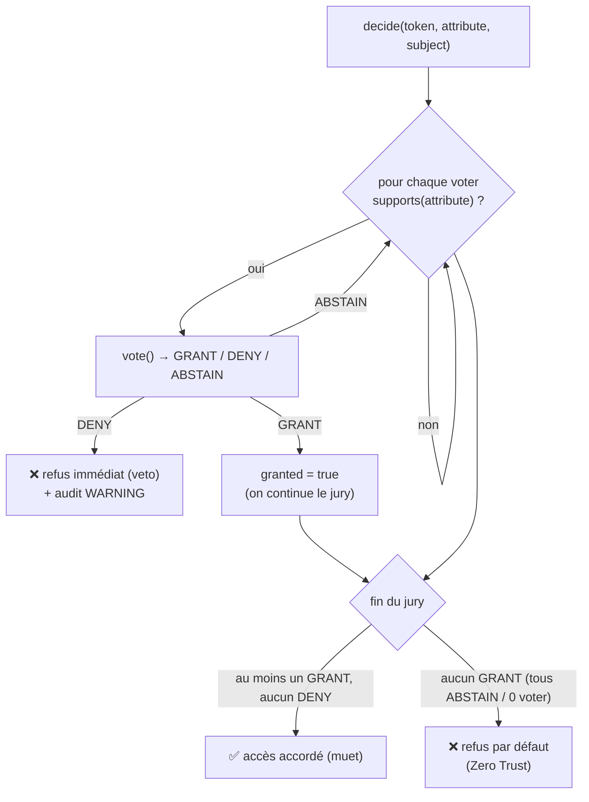

# Autorisation — le jury de voters

> L'authentification établit **qui** tu es ; l'autorisation établit ce que tu as le **droit** de
> faire. Nodefony décide de chaque accès via un **jury de voters** : stratégie **affirmative +
> veto DENY**, et **défaut DENY** (Zero Trust — le silence ferme la porte). Deux voters intégrés
> (`role`, `scope`), un contrat ouvert pour la logique métier (ownership, multi-tenant). Ancré sur
> `src/packages/@nodefony/security/nodefony/service/authorization.ts` et `nodefony/src/voter/`.

📍 [Documentation](../../../../../docs/index.md) › [Sécurité](index.md) › **Autorisation**

## 🧠 Le modèle mental — un jury qui vote



Trois règles, et une seule ferme la porte par défaut :

1. **Un `DENY` suffit** à bloquer (veto), et court-circuite le reste du jury.
2. Sinon **un `GRANT` suffit** à accorder.
3. **Silence total** (tous `ABSTAIN`, ou aucun voter compétent) → **`DENY`**. C'est le Zero
   Trust : on n'accorde jamais « par absence d'objection ».

## 📖 Lexique

| Terme               | Sens                                                                                                 |
| ------------------- | ---------------------------------------------------------------------------------------------------- |
| Autorisation        | Décider des **droits** (≠ authentification, qui décide de l'**identité**).                           |
| Voter               | Un juré : sait décider de certains attributs (`supports`) et vote `GRANT/DENY/ABSTAIN`.              |
| Attribut            | Le droit demandé : un rôle (`ROLE_ADMIN`), un scope (`api:action`), ou un verbe métier (`doc.edit`). |
| Clause              | Un groupe d'attributs déclaré par `@IsGranted` — **OR interne**, clauses empilées en **AND**.        |
| Subject (sujet)     | La donnée sur laquelle porte la décision (un id de document, un tenant) — passée au voter.           |
| RBAC                | _Role-Based Access Control_ : droits selon le rôle.                                                  |
| Scope               | Permission fine d'une **clé déléguée** (clé API, JWT d'agent) — « ce que la clé peut faire ».        |
| Hiérarchie de rôles | `ROLE_ADMIN` hérite `ROLE_USER` — résolue et aplatie au boot.                                        |
| IDOR                | _Insecure Direct Object Reference_ : atteindre la ressource d'un autre en devinant son id.           |
| OWASP A01           | _Broken Access Control_ — la faille n°1 du top 10 OWASP.                                             |
| ALS                 | _AsyncLocalStorage_ : la « bulle » par requête qui porte identité et token.                          |
| Zero Trust          | Fermé par défaut : sans `GRANT` explicite, c'est `DENY`.                                             |

## Qu'est-ce que l'autorisation — et quelle faille elle ferme

Le **contrôle d'accès défaillant** est la faille n°1 du top OWASP (A01) : un utilisateur atteint
une ressource qui n'est pas la sienne (IDOR), ou une action au-dessus de son niveau (élévation de
privilège). La cause récurrente est un contrôle **dispersé et optionnel** — un endpoint oublie de
vérifier.

Nodefony **centralise** la décision dans un service unique, appelé par les décorateurs
(`@IsGranted`, `@RequireScope`) sur tous les transports, avec une posture **fail-closed** : au
moindre doute (voter qui plante, silence du jury, moteur absent), c'est refusé — jamais accordé.

## La vision Nodefony — un jury découplé et fail-closed

`Authorization.decide(token, attribute, subject?)` (`authorization.ts:70`) itère les voters, teste
`supports()` en place — zéro allocation par appel (`authorization.ts:78-80`) — et applique la
stratégie ci-dessus. Points structurants :

- **Fail-closed sur erreur** : un voter qui `throw` (lookup DB down, bug) ne fait ni accorder
  l'accès ni planter la requête en 500 — on **refuse** cette décision + log `ERROR`
  (`authorization.ts:85-93`). Même posture que le firewall sur une erreur interne.
- **Découverte par registre** : les voters sont instanciés **une fois au boot** par
  `Authorization.#build()` (`authorization.ts:55-64`) depuis le registre — aucun nom en dur dans
  le service. Les builtins `role`/`scope` s'enregistrent à l'import (`voterRegistry.ts:55-59`).
- **Transport-agnostique** : l'audit lit `getUserIdentifier()` (et non `getUser()`), commun au
  token HTTP **et** au token WS `IRealtimeToken` (`authorization.ts:119-122`).
- **Audit asymétrique** : tout **refus** est audité par `Authorization.#auditDeny()` — WARNING +
  `recordAudit` (`authorization.ts:113-142`) ; les octrois restent **muets** (volume, pas un
  signal). Le refus porte sa raison : `veto` / `abstain` / `no-voter` / `error`.

## 🚀 Démarrage rapide

### Déclarer les droits sur tes actions — les trois axes

Dans une app `nodefony create app`, la zone `secure` du scaffold (`^/api/secure`, voir
[firewall](./firewall.md)) authentifie déjà ; ici on décide des **droits** :

```typescript
// nodefony/controllers/DocumentController.ts — complet, compile tel quel
import {
  controller,
  Controller,
  Get,
  Post,
  Param,
  IsGranted,
  RequireScope,
  CurrentUser,
} from "@nodefony/framework";
import type { ContextType } from "@nodefony/http";
import type { IUser } from "@nodefony/user";

@controller("/api/secure/documents")
class DocumentController extends Controller {
  constructor(context: ContextType) {
    super("DocumentController", context);
  }

  // Axe RÔLE (« qui tu es ») : réservé aux admins — hiérarchie résolue
  // (ROLE_NODEFONY_ADMIN hérite ROLE_ADMIN → passe aussi).
  @IsGranted("ROLE_ADMIN")
  @Post("/purge")
  purge(@CurrentUser() user: IUser) {
    return this.renderJson({ purgedBy: user.identifier });
  }

  // Axe SCOPE (« ce qu'une CLÉ peut faire ») : bride une clé API / un JWT ;
  // no-op pour une session humaine (ses droits passent par ses rôles).
  @RequireScope("documents:read")
  @Get("/")
  list(@CurrentUser() user: IUser) {
    return this.renderJson({ reader: user.identifier, roles: user.roles });
  }

  // Axe MÉTIER : le param de route `id` part au voter comme `subject`.
  @IsGranted("doc.edit", { subject: "id" })
  @Post("/{id}")
  edit(@Param("id") id: string) {
    return this.renderJson({ edited: id });
  }
}

export default DocumentController;
```

(Wiring : `@controllers([DocumentController])` dans le module de l'app — `nodefony create
controller` le fait pour toi.)

### Ce qu'on observe

```bash
# 1) Sans session : le FIREWALL répond 401 — l'autorisation n'a même pas été consultée
curl -si http://localhost:5151/api/secure/documents/ | head -1
# HTTP/1.1 401 Unauthorized

# 2) Session d'un utilisateur ROLE_USER (cookie posé par le login BFF, cf. firewall) :
#    le scope est un no-op pour un humain → 200
curl -s -b /tmp/jar http://localhost:5151/api/secure/documents/
# {"reader":"alice","roles":["ROLE_USER"]}

# 3) Même session sur l'action admin → 403 : authentifié MAIS pas autorisé
curl -si -b /tmp/jar -X POST http://localhost:5151/api/secure/documents/purge | head -1
# HTTP/1.1 403 Forbidden
```

Le refus laisse une trace côté serveur (jamais côté client) :

```
WARNING AUTHORIZATION access denied: "alice" → "ROLE_ADMIN" (abstain)
```

**401 vs 403** : 401 = « prouve qui tu es » (authentification, firewall) ; 403 = « je sais qui tu
es, tu n'as pas le droit » (autorisation, jury).

### Le voter métier — ta règle d'ownership branchée au jury

Pour l'attribut `doc.edit` déclaré ci-dessus, on enregistre un voter — découvert automatiquement
au boot, **aucun changement dans le cœur** :

```typescript
// nodefony/security/DocumentVoter.ts — chargé par le module de l'app (avant le boot)
import { registerVoterFactory, VoterVote } from "@nodefony/security";
import type { IAccessVoter, IToken } from "@nodefony/security";

/** Le repository de TES documents (posé au container par ton module). */
interface IDocumentRepository {
  find(id: string): Promise<{ ownerId: string; archived: boolean } | null>;
}

class DocumentVoter implements IAccessVoter {
  constructor(private readonly repository: () => IDocumentRepository | null) {}

  /** Ne capte QUE `doc.edit` — rôles et scopes restent aux voters intégrés. */
  supports(attribute: string): boolean {
    return attribute === "doc.edit";
  }

  async vote(
    token: IToken,
    _attribute: string,
    subject?: unknown,
  ): Promise<VoterVote> {
    const repo = this.repository();
    const doc =
      repo && typeof subject === "string" ? await repo.find(subject) : null;
    if (!doc) return VoterVote.ABSTAIN; // hors de mon domaine → les autres axes décident
    if (doc.archived) return VoterVote.DENY; // veto EXPLICITE : personne n'édite un archivé
    return doc.ownerId === token.getUserIdentifier()
      ? VoterVote.GRANT
      : VoterVote.ABSTAIN; // pas le sien → le default-DENY du jury ferme
  }
}

// Découvert automatiquement par le service `authorization` au boot.
registerVoterFactory("documentVoter", ({ container }) => {
  // Construction seule ici — la résolution du repository reste lazy.
  return new DocumentVoter(() =>
    container.get<IDocumentRepository>("documentRepository"),
  );
});
```

Observable : le propriétaire obtient 200 sur `POST /api/secure/documents/42` ; un autre
utilisateur connecté obtient **403** et le log dit `access denied: "bob" → "doc.edit" on 42
(abstain)`.

> [!WARNING]
> Dans un voter métier, renvoie **`ABSTAIN`** quand tu ne sais pas te prononcer (document
> introuvable, attribut hors domaine) — pour laisser les autres axes décider. Réserve **`DENY`**
> au **veto explicite** (ressource gelée/bannie) : un DENY bat tous les GRANT du même attribut.

## 🧑‍⚖️ La stratégie du jury en situation

### Situation 1 — rôle OU voter métier ? (l'IDOR ne se ferme pas par un rôle)

Ton app édite des documents : `POST /api/secure/documents/{id}` doit être réservé au
**propriétaire**. Or tous tes utilisateurs connectés portent `ROLE_USER` :

```typescript
@IsGranted("ROLE_USER")                    // ❌ ferme la porte aux anonymes… mais PAS l'IDOR :
@Post("/{id}") edit() {}                   //    alice peut éditer le document de bob

@IsGranted("doc.edit", { subject: "id" })  // ✅ le jury reçoit l'id → le voter tranche sur la DONNÉE
@Post("/{id}") edit() {}
```

| La requête                     | ❌ avec `ROLE_USER` | ✅ avec `doc.edit`            |
| ------------------------------ | ------------------- | ----------------------------- |
| alice édite **son** document   | 200                 | 200 (`GRANT` du propriétaire) |
| alice édite le document de bob | **200 — IDOR !**    | 403 (`abstain` → défaut DENY) |
| anonyme                        | 401 (firewall)      | 401 (firewall)                |

**Règle de choix** : un **rôle** décide d'une _catégorie_ d'action (« qui peut purger ? ») ; un
**voter métier** décide sur la _donnée_ (« CE document est-il le sien ? »). Si la réponse exige un
lookup (ownership, tenant, état), c'est un voter.

### Situation 2 — le veto DENY (gel légal : personne, même pas le propriétaire)

Conformité : un document sous **gel légal** (litige en cours) ne doit être édité par personne —
pas même son propriétaire. On ajoute un second voter qui capte le même attribut `doc.edit` :

```typescript
class LegalHoldVoter implements IAccessVoter {
  supports(attribute: string): boolean {
    return attribute === "doc.edit";
  }
  async vote(
    _token: IToken,
    _attribute: string,
    subject?: unknown,
  ): Promise<VoterVote> {
    return (await isUnderLegalHold(subject))
      ? VoterVote.DENY
      : VoterVote.ABSTAIN;
  }
}
```

| Le jury sur `doc.edit`                                          | Verdict                                |
| --------------------------------------------------------------- | -------------------------------------- |
| `DocumentVoter` GRANT (propriétaire) + `LegalHoldVoter` ABSTAIN | ✅ 200                                 |
| `DocumentVoter` GRANT + `LegalHoldVoter` **DENY**               | ❌ 403 (`veto`) — le DENY bat le GRANT |

Dès le `DENY`, le jury **s'arrête** — court-circuit, inutile de finir (`authorization.ts:94-97`).

**Contre-exemple piégeux** : le veto ne traverse **pas** une clause OR. Dans
`@IsGranted(["ROLE_ADMIN", "doc.edit"])`, chaque attribut est un **jury séparé**
(`Resolver.ts:592-600`) : si `ROLE_ADMIN` est accordé, `doc.edit` — et son veto — n'est même pas
consulté. Un interdit absolu se porte en clause **AND** : empiler `@IsGranted("ROLE_ADMIN")` puis
`@IsGranted("doc.edit", { subject: "id" })`.

### Situation 3 — le silence ferme la porte (la typo devient un 403, pas une faille)

Tu déploies `@IsGranted("doc.edti")` (faute de frappe), ou tu as oublié d'enregistrer ton voter.
**Aucun voter compétent** → refus par défaut (`!granted`, `authorization.ts:100-108`) : la route répond 403
systématiquement, et le log nomme la cause :

```
WARNING AUTHORIZATION access denied: "alice" → "doc.edti" (no-voter)
```

Un framework fail-open aurait laissé passer — la typo serait une **faille silencieuse**. Ici elle
se voit au premier test.

> [!TIP]
> La raison entre parenthèses dit quoi corriger : `no-voter` = aucun voter ne capte l'attribut
> (typo, voter non enregistré) · `abstain` = des voters ont regardé, aucun n'a accordé (droit
> manquant) · `veto` = un DENY explicite · `error` = un voter a planté (voir le log ERROR).

## 🧰 Déclarer l'exigence — `@IsGranted`, `@RequireScope`, `@Anonymous`

Les décorateurs n'écrivent **que des métadonnées** (0 import `@nodefony/security`, 0 cycle) ; le
moteur `authorization` est résolu **par nom** au runtime (`Resolver.ts:577-578`) :

| Déclaration                                 | Sémantique                                                                                                                       |
| ------------------------------------------- | -------------------------------------------------------------------------------------------------------------------------------- |
| `@IsGranted("ROLE_ADMIN")`                  | un attribut — rôle, scope ou verbe métier (`IsGranted()`, `routerDecorators.ts:839`)                                             |
| `@IsGranted(["A", "B"])`                    | **OR interne** — un attribut accordé suffit (`SecurityClause.anyOf`, `routerDecorators.ts:407-412`)                              |
| empiler `@IsGranted` / `@RequireScope`      | **AND** — toutes les clauses doivent passer (`SecurityRequirement.clauses`, `routerDecorators.ts:426`)                           |
| décorateur de classe + de méthode           | fusion en **AND**, figée UNE fois par route (`computeSecurityRequirement()`, `routerDecorators.ts:1469`)                         |
| `@IsGranted("doc.edit", { subject: "id" })` | le param de route `id` est passé au voter (`Resolver._resolveSubject()`, `Resolver.ts:613-617`)                                  |
| `@RequireScope("orders:read")`              | axe scope — metadata dédiée, fusionnée dans le même `SecurityRequirement` (`RequireScope()`, `routerDecorators.ts:760`)          |
| `@Anonymous()`                              | action **publique** — override les gardes de classe (`security: null`) + skip l'authn (`Anonymous()`, `routerDecorators.ts:887`) |
| `@CurrentUser()`                            | injecte l'utilisateur de l'ALS — jamais le credential (`CurrentUser`, `routerDecorators.ts:1205`)                                |

La garde s'évalue dans `Resolver.executeAction()` **AVANT** l'instanciation DI du controller — un
403 court-circuite tout, y compris `initialize()` (`_enforceSecurity`, `Resolver.ts:331-336`). Le
même `executeAction` sert le pipeline HTTP **et** l'invoke WS-RPC : une garde, tous les
transports. L'enforcement déroule chaque clause : OR interne via un `decide()` par attribut, AND
entre clauses (`Resolver._enforceSecurity()`, `Resolver.ts:576-606`).

> [!IMPORTANT]
> **Fail-closed intégral** : route gardée mais moteur `authorization` absent (module security non
> chargé) OU aucune identité résolue (route **hors zone** firewall) → **403** direct
> (`Resolver.ts:582-584`). Une route gardée doit être couverte par une zone — voir
> [firewall](./firewall.md).

## 🧑‍⚖️ Les voters intégrés — deux axes, un même jury

| Voter (registre) | Axe                            | Capte         | Non-satisfait →                        |
| ---------------- | ------------------------------ | ------------- | -------------------------------------- |
| `role`           | qui es-tu ?                    | `ROLE_*`      | `ABSTAIN`                              |
| `scope`          | que peut faire cette **clé** ? | `api:action`  | `ABSTAIN` (machine) / `GRANT` (humain) |
| le tien          | est-ce **ta** ressource ?      | `doc.edit`, … | `ABSTAIN` conseillé (veto = `DENY`)    |

### `role` — l'axe « qui tu es »

Capte les attributs `ROLE_*` (`RoleVoter.supports()`, `RoleVoter.ts:25-27`) et vote :

- **`GRANT`** si l'utilisateur possède le rôle, hiérarchie résolue ; **`ABSTAIN` sinon — jamais
  `DENY`** (`RoleVoter.vote()`, `RoleVoter.ts:33-35`). L'absence d'un rôle ne doit pas opposer un
  **veto** aux autres axes (un accès peut être légitime via un scope ou l'ownership) : c'est le
  default-DENY du jury qui ferme, pas ce voter. C'est aussi ce qui rend l'OR
  (`@IsGranted(["A","B"])`) possible.
- La hiérarchie est lue **en lazy** depuis le container — clé `roleHierarchy`
  (`RoleVoter.ts:30-32`), posée par le firewall au boot (`firewall.ts:206`).
- Sync par nature → `Promise.resolve`, pas de wrapper `async` inutile (`RoleVoter.ts:36-38`).

### `scope` — l'axe « ce qu'une clé déléguée peut faire »

Frère du `role` sur l'autre axe. Capte la forme conventionnée `api:action` — un `:`, jamais
`ROLE_*` (`ScopeVoter.supports()`, `ScopeVoter.ts:46-48`) → aucune collision avec les rôles ni un
verbe métier. Le cœur est le **modèle de confiance** :

- **Jeton humain** (`session`, `userpassword`, `anonymous`) → `GRANT` no-op : un scope ne bride
  **jamais** un humain, son autorisation passe par ses rôles (`ScopeVoter.ts:52-54`).
- **Jeton machine** (`apikey`, `jwt`, `oauth2`, ou tout type futur) → `GRANT` si le scope exact
  est présent, sinon `ABSTAIN` (`ScopeVoter.ts:57-61`).
- **Fail-closed côté machine** : `NON_SCOPABLE_TOKEN_TYPES` est une **allowlist d'humains**
  (`ScopeVoter.ts:17-21`) — tout type absent (`mtls`, `agent`…) est considéré **scopable**, donc
  bridé par défaut. Un nouveau type de jeton délégué est **fermé par oubli**, jamais ouvert.
- Pur : aucune dépendance, aucune I/O — instancié une fois au boot.

### La hiérarchie de rôles — aplatie et vérifiée au boot

`RoleHierarchyWalker` se déclare dans la config (`use("@nodefony/security", { roleHierarchy })`,
voir [firewall](./firewall.md)) et fait deux choses au boot :

- **Aplatissement DFS précalculé** (`#detectCycles()` puis `#precompute()`,
  `RoleHierarchyWalker.ts:13-14`) → `RoleHierarchyWalker.hasRole()` est **O(1)** sur le hot path
  (`RoleHierarchyWalker.ts:23-30`).
- **Détection de cycles** par DFS coloré — un arc vers un nœud « en cours de visite » = cycle, et
  le boot **jette avec le chemin complet** `A → B → A` (`RoleHierarchyWalker.ts:69-95`) : jamais
  de boucle infinie silencieuse en production.

## 🧩 Étendre le jury — le contrat et le registre

Le contrat `IAccessVoter` (`IAccessVoter.ts:20-26`) tient en deux méthodes :

- `supports(attribute, subject?)` — test **bon marché** : ce voter sait-il décider de cet
  attribut ? Appelé sur chaque voter à chaque `decide()`.
- `vote(token, attribute, subject?)` — **async** (les voters métier font des lookups DB) ; renvoie
  un `VoterVote` : `GRANT` / `DENY` / `ABSTAIN` (`IAccessVoter.ts:7-11`).

L'enregistrement passe par le registre — `registerVoterFactory(name, factory)`
(`voterRegistry.ts:39-44`), consommé une fois au boot (`listVoterFactories()`,
`voterRegistry.ts:47-49`). La fabrique reçoit `{ container }` et ne fait **que construire** : les
résolutions coûteuses restent lazy dans l'instance (cf. le `DocumentVoter` du Démarrage rapide).

Pourquoi un registre et pas un scan DI des `@injectable` : les interfaces TS sont **effacées à la
compilation** — rien à scanner au runtime ; le registre **est** le marqueur explicite
(`voterRegistry.ts:10-16`). Convention-frère : `authenticatorRegistry`, `tokenStoreRegistry`.

## 🔌 HTTP et WebSocket — une garde, N transports

- **La même garde** : `Resolver.executeAction()` (`Resolver.ts:317`) est le point unique
  d'enforcement — pipeline HTTP classique **et** invoke WS-RPC (pont `api.request`). Un
  `@IsGranted` protège donc l'action quel que soit le transport (prouvé bout en bout par le banc
  `ws-isgranted-jwt`).
- **Le service ignore le transport** : l'audit lit `getUserIdentifier()`, commun à `IToken` (HTTP)
  et `IRealtimeToken` (WS) (`authorization.ts:119-122`).
- **Le verrou de frame** (canaux realtime) applique son RBAC par canal avec la **même
  hiérarchie** : `satisfies()` (`frameAuthorizer.ts:240-250`) délègue à `Firewall.hasRole()`
  (`firewall.ts:466`) — les rôles exigés par un canal héritent comme partout ailleurs.

## 📜 Normes appliquées

| Domaine                    | Norme / posture                        | Ancrage                                                   |
| -------------------------- | -------------------------------------- | --------------------------------------------------------- |
| Contrôle d'accès           | OWASP Top 10 **A01** (IDOR, élévation) | défaut `DENY` du jury (`authorization.ts:100-108`)        |
| Modèle                     | **Zero Trust** (fermé par défaut)      | 403 fail-closed du Resolver (`Resolver.ts:582-584`)       |
| Journalisation de sécurité | audit des refus, jamais des octrois    | `#auditDeny` → `recordAudit` (`authorization.ts:113-142`) |

## ⚡ Performance & mémoire

- **Hot path à coût nul** : une route non gardée porte `security: null` → 0 lookup, 0 await, 0
  alloc (`Resolver.ts:334-336`) ; l'exigence est **figée une fois** par route et partagée entre
  requêtes (`SecurityRequirement`, `routerDecorators.ts:424`).
- **`decide()` sans allocation** : itération en place des voters (`authorization.ts:78-80`),
  instanciés **une seule fois** au boot (`authorization.ts:55-64`).
- **`hasRole()` O(1)** : hiérarchie aplatie au boot, rien de récursif par requête
  (`RoleHierarchyWalker.ts:23-30`).
- **Audit = cold path** : uniquement sur refus, avec un descripteur léger du sujet — jamais de
  `JSON.stringify` aveugle (`describeSubject()`, `authorization.ts:159-165`).

## ⚠️ Pièges (symptôme → cause → correction)

| Symptôme                               | Cause (dans le code)                                                                | Correction                                                     |
| -------------------------------------- | ----------------------------------------------------------------------------------- | -------------------------------------------------------------- |
| Accès refusé alors que le rôle existe  | Attribut mal formé (pas `ROLE_…`) → le `RoleVoter` n'entre pas                      | Respecter le préfixe `ROLE_`                                   |
| 403 systématique sur une route gardée  | Moteur absent OU identité non résolue — route **hors zone** (`Resolver.ts:582-584`) | Couvrir la route par une zone firewall                         |
| Un voter métier bloque tout            | Il renvoie `DENY` au lieu d'`ABSTAIN` quand il ne s'applique pas                    | Renvoyer `ABSTAIN` hors de son domaine                         |
| Un `DENY` n'a pas bloqué               | Attributs d'une clause = jurys **séparés** (OR) — un autre attribut a accordé       | Porter l'interdit en clause AND (empiler les `@IsGranted`)     |
| Clé API accède à une action non prévue | Type de jeton traité comme humain (allowlist)                                       | Vérifier que le type n'est pas dans `NON_SCOPABLE_TOKEN_TYPES` |
| `ROLE_ADMIN` n'hérite pas `ROLE_USER`  | Hiérarchie non déclarée / non posée au container                                    | Déclarer `roleHierarchy` (config security) au boot             |
| Boot qui plante « cycle détecté »      | Hiérarchie de rôles cyclique                                                        | Casser le cycle (le message nomme le chemin)                   |
| Accès accordé à un voter qui a planté  | (n'arrive pas) fail-closed : une erreur de voter = refus                            | Corriger le voter ; l'erreur est loggée ERROR                  |

## 📡 Observabilité — Studio

Écran **Roles** (`studio/frontend/src/routes/Roles.tsx`) : la hiérarchie de rôles consommée par
les voters. Écran **Audit** : les refus du jury (catégorie `authz`, action `access.denied`, avec
la raison). Écran **Firewall** : zones et trace de décision — l'amont du jury.

## 🧪 Tests & couverture

Quatre familles couvrent la brique — les **chiffres exacts vivent dans la carte de l'aperçu**
(régénérée depuis vitest, jamais figée ici) :

- **unit** : `authorization.test` (le jury + la stratégie + le RoleVoter/hiérarchie),
  `scopeVoter` (l'axe scope + fail-closed machine), `securityDecorators` et
  `securityEnforcement` (framework : métadonnées + garde du Resolver), `realtimeFrameLock` (le
  verrou de frame) ;
- **intégration** : `securityGuard.integration` (framework, la garde `@IsGranted` sur serveur
  réel), `ws-data-plane-auth` (http, le pont WS authentifié) ;
- **e2e transport** : `ws-isgranted-jwt` (http — `@IsGranted` bout en bout sur WebSocket + JWT) ;
- **attaque** : `authorization.attack` (escalade verticale, cycle DoS, confusion d'attribut,
  composition d'axes), `frameAuthorizer.attack` et `realtimeFramePollution.attack` (frames WS
  hostiles).

Couverture : `npm run coverage` dans `@nodefony/security`.

## 🔗 Pour aller plus loin

- ⬆️ **Retour au hub** : [Sécurité — vue d'ensemble](index.md) · [Toute la documentation](../../../../../docs/index.md)
- 🧭 **Pages sœurs** : [Firewall](firewall.md) · [Jetons](tokens.md)

- L'authentification qui précède l'autorisation → [authenticators](./authenticators.md)
- Le firewall qui pose l'identité et appelle le jury (zones, WS) → [firewall](./firewall.md)
- Vue d'ensemble sécurité → [index](./index.md)
