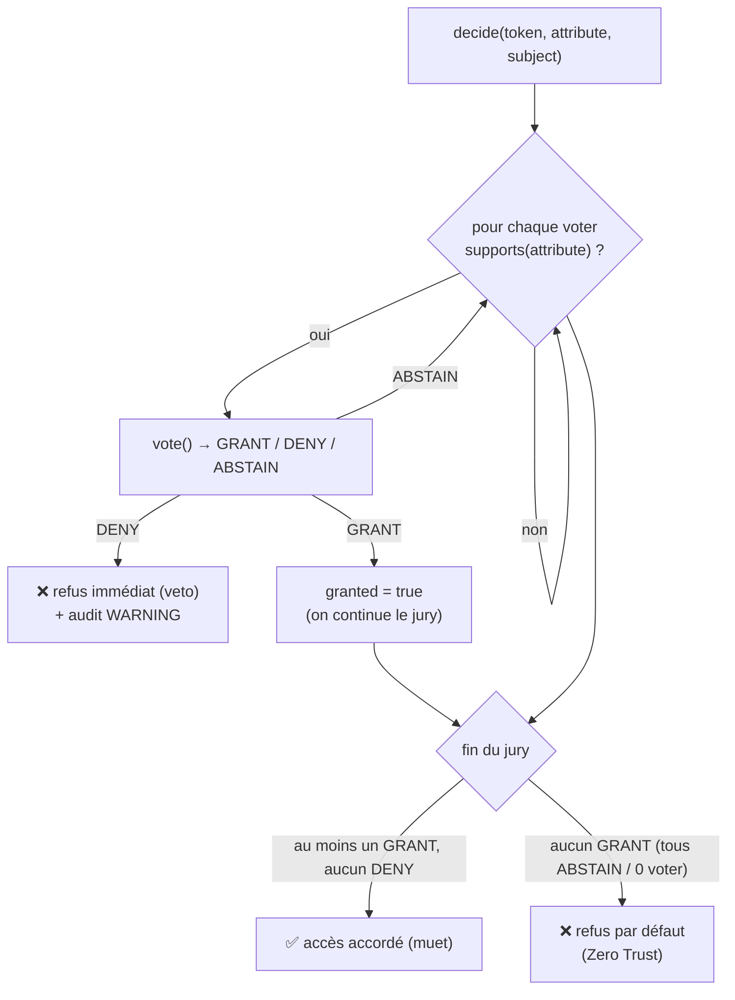

# Autorisation — le jury de voters

> L'authentification établit **qui** tu es ; l'autorisation établit ce que tu as le **droit** de faire.
> Nodefony décide de chaque accès via un **jury de voters** : stratégie **affirmative + veto DENY**, et
> **défaut DENY** (Zero Trust — le silence ferme la porte). Deux voters intégrés (`role`, `scope`), et
> un contrat ouvert pour la logique métier (ownership, multi-tenant). Ancré sur
> `src/packages/@nodefony/security/nodefony/service/authorization.ts` et `src/voter/`.

## Le modèle mental — un jury qui vote



Trois règles, et une seule ferme la porte par défaut :

1. **Un `DENY` suffit** à bloquer (veto), et court-circuite le reste du jury.
2. Sinon **un `GRANT` suffit** à accorder.
3. **Silence total** (tous `ABSTAIN`, ou aucun voter compétent) → **`DENY`**. C'est le Zero Trust : on
   n'accorde jamais « par absence d'objection ».

## Lexique

| Terme               | Sens                                                                                                 |
| ------------------- | ---------------------------------------------------------------------------------------------------- |
| Autorisation        | Décider des **droits** (≠ authentification, qui décide de l'**identité**).                           |
| Voter               | Un juré : sait décider de certains attributs (`supports`) et vote `GRANT/DENY/ABSTAIN`.              |
| Attribut            | Le droit demandé : un rôle (`ROLE_ADMIN`), un scope (`api:action`), ou un verbe métier (`doc.edit`). |
| RBAC                | _Role-Based Access Control_ : droits selon le rôle.                                                  |
| Scope               | Permission fine d'une **clé déléguée** (clé API, JWT d'agent) — « ce que la clé peut faire ».        |
| Hiérarchie de rôles | `ROLE_ADMIN` hérite `ROLE_USER` — résolue et aplatie au boot.                                        |
| Zero Trust          | Fermé par défaut : sans `GRANT` explicite, c'est `DENY`.                                             |

## Qu'est-ce que l'autorisation — et quelle faille elle ferme

Le **contrôle d'accès défaillant** est la faille n°1 du top OWASP (A01) : un utilisateur atteint une
ressource qui n'est pas la sienne (IDOR), ou une action au-dessus de son niveau (élévation de
privilège). La cause récurrente est un contrôle _dispersé et optionnel_ — un endpoint oublie de vérifier.
Nodefony **centralise** la décision dans un service unique, appelé par les décorateurs (`@IsGranted`) et
le verrou de frame WebSocket, avec une posture **fail-closed** : au moindre doute (voter qui plante,
silence du jury), c'est refusé, jamais accordé.

## La vision Nodefony — un jury découplé et fail-closed

`AuthorizationService.decide(token, attribute, subject)` (`authorization.ts:70`) itère les voters, teste
`supports()` en place (zéro allocation par appel, `:78-80`) et applique la stratégie ci-dessus. Points
structurants :

- **Fail-closed sur erreur** : un voter qui `throw` (lookup DB down, bug) ne fait ni accorder l'accès ni
  planter la requête en 500 — on **refuse** cette décision + log `ERROR` (`:85-93`). Même posture que le
  firewall sur une erreur interne.
- **Découverte par registre** : les voters sont instanciés **une fois au boot** depuis le `voterRegistry`
  (`:55-63`) — aucun nom en dur dans le service. Les builtins (`role`, `scope`) s'enregistrent à l'import
  (`voterRegistry.ts:55-59`) ; une app ajoute le sien avec `registerVoterFactory("projectVoter", …)`.
- **Transport-agnostique** : l'audit lit `getUserIdentifier()` (et non `getUser()`), commun au token
  HTTP **et** au token WS (`IRealtimeToken`) — « **1 garde = N transports** » (`:119-122`).
- **Audit asymétrique** : tout **refus** est audité (`WARNING` + `recordAudit`, `:113-142`) ; les accès
  **accordés restent muets** (volume, pas un signal). Le refus porte sa raison : `veto` / `abstain` /
  `no-voter` / `error`.

## Analyse par voter (§8bis)

### `RoleVoter` — l'axe « qui tu es » (niveau A)

Capte les attributs `ROLE_*` (`RoleVoter.ts:25`) et vote `GRANT` si l'utilisateur possède le rôle,
**`ABSTAIN` sinon — jamais `DENY`** (`:33-35`). Constat important : l'absence d'un rôle ne doit pas
opposer un **veto** aux autres axes (un accès peut être légitime via un scope ou l'ownership). C'est le
`default DENY` du service qui ferme, pas ce voter. La hiérarchie est lue en lazy depuis le container
(`roleHierarchy`, posée par le firewall au boot).

### La hiérarchie de rôles — résolue et vérifiée au boot

`RoleHierarchyWalker` **aplatit** la hiérarchie en DFS **au boot** → `hasRole()` est O(1) sur le hot path
(`RoleHierarchyWalker.ts:23`). Surtout, il **détecte les cycles au boot** par un DFS coloré (un arc vers
un nœud « en cours de visite » = cycle) et **jette avec le chemin complet** `A → B → A`
(`RoleHierarchyWalker.ts:69-95`) — jamais de boucle infinie silencieuse en production. Couverture : 100 %.

### `ScopeVoter` — l'axe « ce qu'une clé déléguée peut faire » (P6.8)

Frère du RoleVoter sur l'autre axe. Capte la forme conventionnée `api:action` (un `:`, jamais `ROLE_*`,
`ScopeVoter.ts:46-48`) → aucune collision avec les rôles ni un verbe métier. Le constat de sûreté est le
**modèle de confiance** :

- **Jeton humain** (`session`, `userpassword`, `anonymous`) → `GRANT` : un scope ne bride **jamais** un
  humain ; son autorisation passe par ses rôles (`:51-54`).
- **Jeton machine** (`apikey`, `jwt`, `oauth2`, ou tout type **futur**) → `GRANT` si le scope exact est
  présent, sinon `ABSTAIN` (`:57-61`).
- **Fail-closed côté machine** : la liste `NON_SCOPABLE_TOKEN_TYPES` est une **allowlist d'humains**
  (`:17-21`) — tout type absent est considéré **scopable**, donc bridé par défaut. Un nouveau type de
  jeton délégué est donc **fermé par oubli**, jamais ouvert. Pur, sans I/O, instancié une fois au boot.

### Voters métier — la killer feature (ownership, multi-tenant)

Le contrat `IAccessVoter` (`IAccessVoter.ts:20-26`) reçoit le **token ET le sujet** : « cet utilisateur
édite-t-il **son** projet ? », « ce tenant accède-t-il à **sa** ressource ? ». C'est là que se traite
l'IDOR fin, impossible à couvrir par les seuls rôles. On l'enregistre au boot :

```typescript
import { registerVoterFactory } from "@nodefony/security";

registerVoterFactory(
  "projectVoter",
  ({ container }) => new ProjectVoter(() => container.get("projectRepository")),
);
// ProjectVoter.supports("project.edit", subject) → true
// ProjectVoter.vote(token, "project.edit", project) → GRANT si project.ownerId === token.getUserIdentifier()
```

Renvoie `ABSTAIN` (pas `DENY`) quand ton voter ne s'applique pas, pour laisser les autres axes décider —
et `DENY` seulement pour un **veto explicite** (ex. ressource bannie).

## Les deux axes, côte à côte

| Axe    | Attribut      | Répond à…                      | Voter        | Non-satisfait →                        |
| ------ | ------------- | ------------------------------ | ------------ | -------------------------------------- |
| Rôles  | `ROLE_*`      | qui es-tu ?                    | `RoleVoter`  | `ABSTAIN`                              |
| Scopes | `api:action`  | que peut faire cette **clé** ? | `ScopeVoter` | `ABSTAIN` (machine) / `GRANT` (humain) |
| Métier | `doc.edit`, … | est-ce **ta** ressource ?      | voter d'app  | à toi de choisir                       |

Une clause `@IsGranted` peut combiner plusieurs attributs : chacun passe par le jury, la stratégie
affirmative les fait tenir ensemble (au moins un GRANT, aucun DENY).

## Pièges (symptôme → cause → correction)

| Symptôme                               | Cause (dans le code)                                             | Correction                                                              |
| -------------------------------------- | ---------------------------------------------------------------- | ----------------------------------------------------------------------- |
| Accès refusé alors que le rôle existe  | Attribut mal formé (pas `ROLE_…`) → RoleVoter n'entre pas        | Respecter le préfixe `ROLE_`                                            |
| Un voter métier bloque tout            | Il renvoie `DENY` au lieu d'`ABSTAIN` quand il ne s'applique pas | Renvoyer `ABSTAIN` hors de son domaine                                  |
| Clé API accède à une action non prévue | Scope manquant mais type traité comme humain                     | Vérifier que le type de jeton n'est pas dans `NON_SCOPABLE_TOKEN_TYPES` |
| `ROLE_ADMIN` n'hérite pas `ROLE_USER`  | Hiérarchie non déclarée / non posée au container                 | Déclarer `roleHierarchy` (firewall) au boot                             |
| Boot qui plante « cycle détecté »      | Hiérarchie de rôles cyclique                                     | Casser le cycle (le message nomme le chemin)                            |
| Accès accordé à un voter qui a planté  | (n'arrive pas) fail-closed : une erreur de voter = refus         | Corriger le voter ; l'erreur est loggée ERROR                           |

## Tests & couverture

L'autorisation est couverte par **25 cas unit/intégration + 28 tests d'attaque** :
`authorization.test` (11, le jury + stratégie), `scopeVoter` (12, l'axe scope + fail-closed machine),
l'intégration WS `ws-isgranted-jwt` (2, `@IsGranted` bout en bout sur WebSocket + JWT), plus la red-team
`authorization.attack` (17) et `frameAuthorizer.attack` (11, le verrou de frame WS). La couverture des
fichiers cœur est maximale (`authorization.ts` ~90 %, `RoleVoter`/`ScopeVoter`/`RoleHierarchyWalker`
**100 %**). Photo régénérée depuis vitest (`npm run coverage` dans `@nodefony/security`).

## Pour aller plus loin

- L'authentification qui précède l'autorisation → [authenticators](./authenticators.md)
- Le firewall qui appelle le jury (zones, `@IsGranted`, frame WS) → [firewall](./firewall.md)
- Vue d'ensemble sécurité → [index](./index.md)
