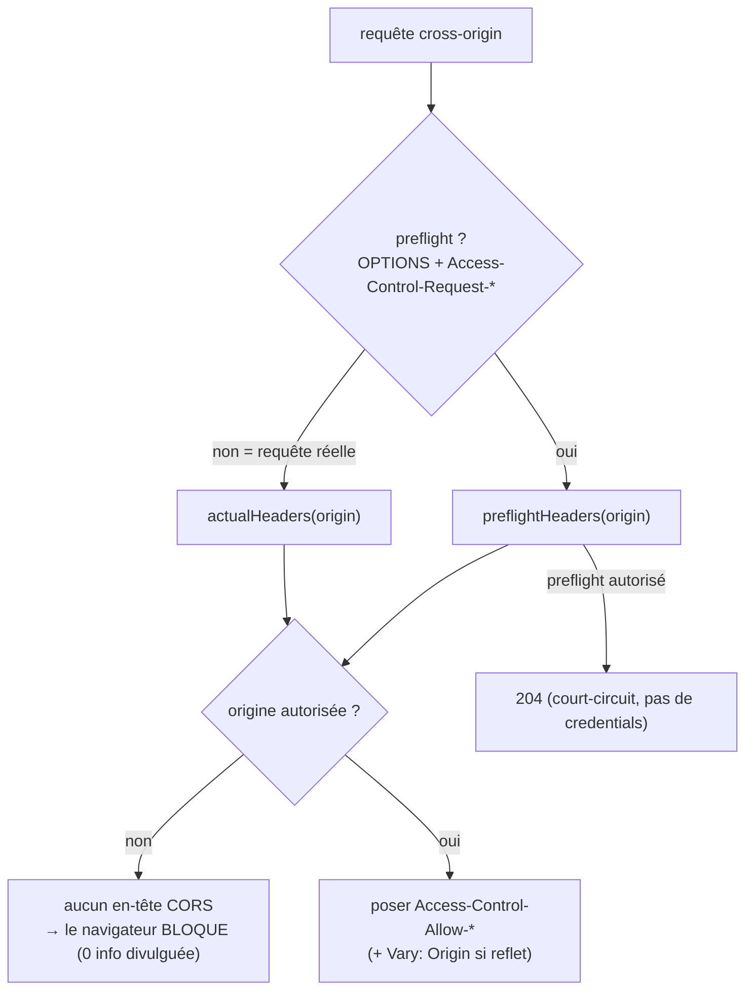

# CORS — autoriser (ou non) les appels cross-origin

> Par défaut, un navigateur **interdit** à un site d'appeler une autre origine (Same-Origin Policy).
> CORS est le protocole qui **assouplit** cette règle, côté serveur, en posant des en-têtes
> `Access-Control-*`. Ce n'est pas une défense contre le CSRF — c'est l'inverse : un moyen d'**ouvrir**
> des portes précises sans tout ouvrir. Nodefony en fait une politique **pure** et **fail-safe**. Ancré
> sur `src/packages/@nodefony/security/nodefony/service/cors.ts`.

## Le modèle mental — deux moments, une whitelist

Deux moments distincts : le **preflight** (`OPTIONS` que le navigateur envoie _avant_ une requête « non
simple », pour demander la permission) et la **requête réelle**. Les deux consultent la même whitelist
d'origines ; une origine absente ⇒ **aucun en-tête** ⇒ le navigateur bloque de lui-même.

## Lexique

| Terme                         | Sens                                                                              |
| ----------------------------- | --------------------------------------------------------------------------------- |
| SOP                           | _Same-Origin Policy_ : un navigateur isole les origines par défaut.               |
| CORS                          | _Cross-Origin Resource Sharing_ : le protocole qui autorise des exceptions.       |
| Preflight                     | Requête `OPTIONS` d'autorisation envoyée **avant** une requête non simple.        |
| `Access-Control-Allow-Origin` | Quelle origine est autorisée à lire la réponse (`*` ou une origine reflétée).     |
| Credentials                   | Cookies/Authorization envoyés cross-origin (nécessite un opt-in explicite).       |
| Reflet d'origine              | Renvoyer l'origine du client comme valeur Allow-Origin (au lieu de `*`).          |
| `Vary: Origin`                | Dit aux caches que la réponse dépend de l'origine (évite d'empoisonner le cache). |

## Qu'est-ce que le CORS — et ce qu'il n'est PAS

Le CORS **relâche** la SOP ; il ne « protège » rien en soi. La faille classique n'est donc pas
« absence de CORS » mais un CORS **trop permissif** : refléter _n'importe quelle_ origine **avec
credentials** revient à laisser tout site lire les données authentifiées de vos utilisateurs. Les deux
invariants OWASP que Nodefony impose ferment exactement ça (ci-dessous). À ne pas confondre avec le
[CSRF](./csrf.md), qui protège les **mutations** : CORS régit la **lecture** cross-origin ; ce que CORS
autorise explicitement est d'ailleurs traité comme non-CSRF (cohérence câblée par le firewall).

## La vision Nodefony — pure, fail-safe, invariants au boot

`Cors` (`cors.ts:33`) est une politique **pure et synchrone** : elle calcule les en-têtes
`Access-Control-*` à poser, instanciée une fois au boot par le firewall (`firewall.ts:213-214`),
testable sans serveur. Trois invariants de sécurité :

- **Jamais `*` + credentials** : la combinaison est **rejetée au boot** (refine Zod) — le navigateur la
  refuserait de toute façon. En pratique, `*` n'est émis **que si `credentials=false`** ; avec
  credentials, l'origine est **reflétée** (`#allowOrigin`, `cors.ts:57-60`, commentaire `firewall.ts:212`).
- **Reflet d'origine ⇒ `Vary: Origin`** : dès que la valeur Allow-Origin n'est pas `*`, la politique
  signale qu'il faut poser `Vary: Origin` (`reflectsOrigin`, `:62-65`, appliqué `:81`, `:94`) — sinon un
  cache partagé servirait la réponse d'une origine à une autre (empoisonnement).
- **Origine non whitelistée ⇒ `null` ⇒ aucun en-tête** (`:59`, `:74`, `:92`) : la réponse n'est pas
  partageable, le navigateur bloque, **zéro information divulguée** (pas de message d'erreur exploitable).

## Preflight vs requête réelle

| Moment             | Méthode    | En-têtes posés                                                            | Anchor          |
| ------------------ | ---------- | ------------------------------------------------------------------------- | --------------- |
| **Preflight**      | `OPTIONS`  | Allow-Origin, Allow-Methods, Allow-Headers, Max-Age (+Vary, +Credentials) | `cors.ts:72-84` |
| **Requête réelle** | GET/POST/… | Allow-Origin (+Vary, +Credentials, +**Expose-Headers** pour le JS)        | `cors.ts:90-99` |

Côté firewall, `handleCors` (`firewall.ts:797`) court-circuite un preflight `OPTIONS` autorisé en **204**
(un preflight ne porte jamais de credentials, `:790-812`) ; la requête réelle reçoit ses en-têtes puis
continue le pipeline. La whitelist CORS est unie aux origines de confiance CSRF (`firewall.ts:193`) —
une origine explicitement autorisée en CORS n'est pas traitée comme une tentative CSRF.

## Pièges (symptôme → cause → correction)

| Symptôme                                         | Cause (dans le code / config)                             | Correction                                                |
| ------------------------------------------------ | --------------------------------------------------------- | --------------------------------------------------------- |
| Boot refusé « `*` + credentials »                | Config `origins:["*"]` **et** `credentials:true`          | Lister les origines explicitement, ou `credentials:false` |
| Requête cross-origin bloquée par le navigateur   | Origine absente de la whitelist → aucun en-tête (voulu)   | Ajouter l'origine à `cors.origins`                        |
| Réponse d'une origine servie à une autre (cache) | `Vary: Origin` absent (n'arrive pas : posé au reflet)     | Aucune action — la politique le pose automatiquement      |
| Un en-tête custom illisible côté JS              | Non déclaré dans `exposedHeaders`                         | Ajouter l'en-tête à `cors.exposedHeaders`                 |
| Preflight qui repart dans le pipeline            | (n'arrive pas) : `OPTIONS` autorisé court-circuité en 204 | —                                                         |

## Tests & couverture

CORS est couvert par **18 cas unit + 5 tests d'attaque** : `cors.test` (12, la politique — reflet,
whitelist, credentials), le `cors.test` du pipeline http (6, preflight de bout en bout) et
`cors.attack.test` (5, la red-team — origines forgées, tentative `*`+credentials). Le fichier `cors.ts`
est à **100 %** (lignes, branches, fonctions). Photo régénérée depuis vitest (`npm run coverage` dans
`@nodefony/security`).

## Pour aller plus loin

- CSRF (protège les mutations ; distinct de CORS) → [csrf](./csrf.md)
- Le firewall qui pose les en-têtes et court-circuite le preflight → [firewall](./firewall.md)
- En-têtes de sécurité de socle (CSP, HSTS…) → [headers](./headers.md)
- Vue d'ensemble sécurité → [index](./index.md)
