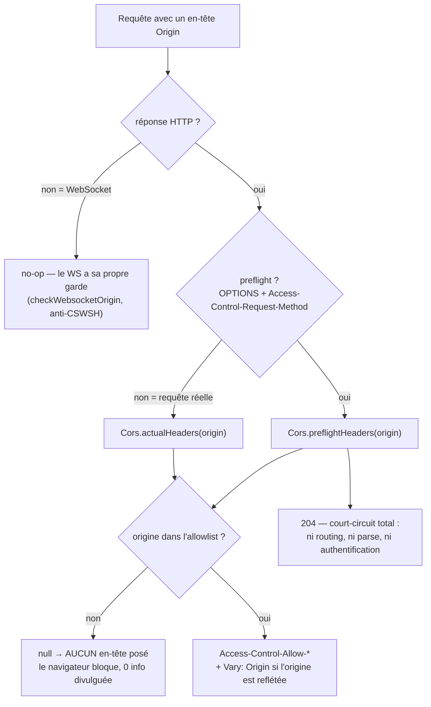
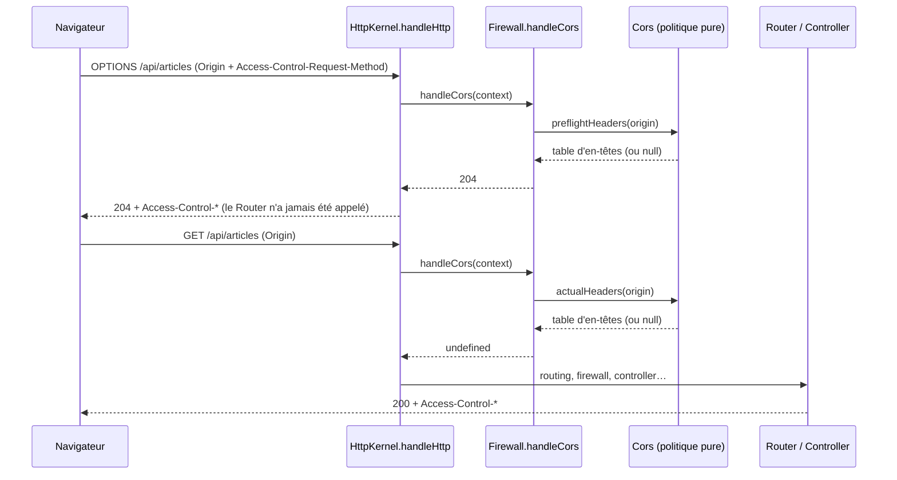

# CORS — autoriser (ou non) les appels cross-origin

> Par défaut un navigateur **interdit** à `https://app.example.com` de lire la réponse de
> `https://api.example.com` (Same-Origin Policy). CORS est le protocole qui **assouplit** cette règle,
> côté serveur, en posant des en-têtes `Access-Control-*`. Ce n'est pas une défense — c'est l'inverse :
> un moyen d'**ouvrir** des portes précises sans tout ouvrir. Nodefony en fait une politique **pure**,
> **fail-safe** et **verrouillée au boot**. Ancré sur
> `src/packages/@nodefony/security/nodefony/service/cors.ts`.

📍 [Documentation](../../../../../docs/index.md) › [Sécurité](index.md) › **CORS**

## 🧠 Le modèle mental — deux moments, une allowlist



Deux moments distincts, une seule allowlist. Le **preflight** est l'`OPTIONS` que le navigateur envoie
_de lui-même_, avant une requête « non simple », pour demander la permission. La **requête réelle** est
celle que ton code a écrite. Les deux consultent la même liste d'origines : une origine absente ⇒
**aucun en-tête** ⇒ le navigateur bloque tout seul.

## 📖 Lexique

| Terme                | Sens                                                                                                         |
| -------------------- | ------------------------------------------------------------------------------------------------------------ |
| **Origine**          | Le triplet `scheme://host:port` (`https://app.example.com`). Deux ports différents = deux origines.          |
| **SOP**              | _Same-Origin Policy_ : le navigateur isole les origines et refuse par défaut la lecture cross-origin.        |
| **CORS**             | _Cross-Origin Resource Sharing_ : le protocole par lequel le serveur déclare ses exceptions à la SOP.        |
| **Preflight**        | Requête `OPTIONS` d'autorisation, envoyée par le navigateur **avant** une requête non simple.                |
| **Requête simple**   | GET/HEAD/POST avec un `Content-Type` basique — pas de preflight, le navigateur envoie directement.           |
| **Credentials**      | Cookies / `Authorization` transportés cross-origin. Exige un opt-in explicite des deux côtés.                |
| **Reflet d'origine** | Renvoyer l'origine du client comme valeur `Access-Control-Allow-Origin`, au lieu du joker `*`.               |
| `Vary: Origin`       | Dit aux caches que la réponse **dépend** de l'`Origin` — sans lui, un cache partagé mélange les origines.    |
| **Allowlist**        | La liste blanche d'origines autorisées (`cors.origins`). Match **exact**, jamais par sous-chaîne.            |
| **CSWSH**            | _Cross-Site WebSocket Hijacking_ : une page tierce ouvre un WebSocket authentifié par le cookie du visiteur. |
| **Fetch Standard**   | La norme WHATWG qui définit le protocole CORS (elle a remplacé la recommandation W3C CORS).                  |

## Qu'est-ce que le CORS — et ce qu'il n'est PAS

Une analogie : la SOP est un **portier** qui, par défaut, refuse de remettre le courrier d'un immeuble
à quelqu'un d'un autre immeuble. CORS n'est pas un vigile de plus — c'est la **liste des voisins**
que le propriétaire affiche au portier : « à ceux-là, tu peux remettre le courrier ».

Trois conséquences que beaucoup de développeurs découvrent trop tard :

1. **CORS ne protège pas ton serveur.** Il s'applique dans le **navigateur**. Un `curl`, un script
   Python, un agent — tout ce qui n'est pas un navigateur — ignore CORS et reçoit ta réponse en entier.
   La protection du serveur, c'est le [firewall](./firewall.md) et l'authentification.
2. **La faille n'est donc jamais « CORS absent », mais « CORS trop permissif ».** Refléter
   _n'importe quelle_ origine **avec credentials**, c'est autoriser tout site du web à lire les données
   authentifiées de tes utilisateurs, avec leur propre cookie de session. C'est le vecteur n°1 des
   fuites CORS recensées par l'OWASP.
3. **CORS ≠ CSRF.** CORS régit la **lecture** cross-origin d'une réponse ; le [CSRF](./csrf.md) protège
   l'**écriture** (une mutation déclenchée à l'insu du visiteur). Les deux se croisent : une origine
   que tu autorises explicitement en CORS n'est pas traitée comme une tentative CSRF (voir plus bas).

> [!IMPORTANT]
> Ouvrir une origine en CORS, c'est autoriser **le JavaScript de cette origine à lire tes réponses**,
> pas juste « à t'appeler ». Si la route renvoie des données d'un utilisateur connecté et que
> `credentials` est actif, l'origine ajoutée devient de facto un lecteur légitime de ces données.

## La vision Nodefony — une politique pure, fail-safe, verrouillée au boot

`Cors` (`cors.ts:33`) est une classe **pure et synchrone** : elle ne touche ni au réseau, ni à la
requête — elle prend une origine et renvoie la table des en-têtes à poser, ou `null`. Elle est
instanciée **une seule fois au boot** par le firewall, si et seulement si la section est activée
(`firewall.ts:213`). Conséquence directe : la politique est **testable sans serveur**, et son coût par
requête se réduit à une lecture de `Set` (voir Performance).

Trois invariants de sécurité, tenus par construction :

- **Jamais `*` avec credentials.** La combinaison est **rejetée au boot** par un `refine` Zod
  (`config.ts:144`) — le navigateur la refuserait de toute façon. Défense en profondeur : même
  instanciée à la main avec cette combinaison, `Cors.#allowOrigin()` **reflète l'origine** au lieu
  d'émettre `*` (`cors.ts:58`).
- **Reflet d'origine ⇒ `Vary: Origin`.** Dès que la valeur `Allow-Origin` n'est pas `*`, la politique
  ajoute `Vary` elle-même, sans que l'appelant ait à y penser (`Cors.reflectsOrigin()`, `cors.ts:63` ;
  posé en `cors.ts:81` et `cors.ts:94`). Sans lui, un cache partagé servirait à une origine la réponse
  taillée pour une autre — un empoisonnement de cache.
- **Origine inconnue ⇒ `null` ⇒ aucun en-tête.** Pas de message d'erreur, pas de 403 bavard
  (`cors.ts:74`, `cors.ts:92`). La réponse part normalement mais n'est pas partageable : le navigateur
  bloque, et un attaquant n'apprend **rien** sur le contenu de ton allowlist.

Le contrat d'entrée est `ICorsOptions` (`cors.ts:4`) — exactement le sous-ensemble `cors` de la config
du module, rien de plus. La sortie est une table nom → valeur (`CorsHeaders`, `cors.ts:15`) que
l'appelant recopie sur la réponse.

## 🚀 Démarrage rapide

**Le besoin.** Ton API Nodefony sert `https://api.example.com`. Ton front est déployé sur
`https://app.example.com` — **une autre origine**. Il s'authentifie avec le cookie de session (BFF), et
il affiche une pagination qui lit un en-tête `X-Total-Count`. Sans configuration, le navigateur bloque
chaque appel du front.

### 1. La config — dans `nodefony.config.ts`

```typescript
// nodefony.config.ts (extrait généré par `nodefony create app`, puis complété)
use("@nodefony/security", {
  cors: {
    // Allowlist EXACTE : scheme + host + port. Un sous-domaine n'est PAS inclus.
    origins: ["https://app.example.com"],
    // Le front envoie le cookie de session → opt-in obligatoire des deux côtés.
    // Avec credentials, `*` est refusé au boot : on liste les origines.
    credentials: true,
    // Ce que le JS du front a le droit de LIRE dans la réponse (au-delà des
    // en-têtes « sûrs » que le navigateur expose toujours).
    exposedHeaders: ["X-Total-Count"],
    // Le navigateur met le résultat du preflight en cache 10 minutes.
    maxAgeS: 600,
  },
});
```

### 2. Le controller — rien de spécifique à CORS

```typescript
// nodefony/controllers/ArticleController.ts — complet, compile tel quel
import { controller, Controller, Get } from "@nodefony/framework";

@controller("/api/articles")
class ArticleController extends Controller {
  // Aucun code CORS ici : la politique est GLOBALE et posée AVANT le routing.
  // Un preflight n'atteint même jamais cette classe.
  @Get("/")
  async list() {
    return this.renderJson([{ id: 1, title: "Hello" }]);
  }
}

export default ArticleController;
```

### 3. Ce qu'on observe

```bash
# 1) LE PREFLIGHT — celui que le navigateur envoie tout seul avant un fetch non simple.
curl -si -X OPTIONS http://localhost:5151/api/articles \
  -H 'Origin: https://app.example.com' \
  -H 'Access-Control-Request-Method: GET'
# HTTP/1.1 204 No Content
# Access-Control-Allow-Origin: https://app.example.com
# Access-Control-Allow-Methods: GET, POST, PUT, PATCH, DELETE, OPTIONS
# Access-Control-Allow-Headers: Authorization, Content-Type, X-Requested-With
# Access-Control-Max-Age: 600
# Access-Control-Allow-Credentials: true
# Vary: Origin
```

```bash
# 2) LA REQUÊTE RÉELLE — Expose-Headers apparaît ici, jamais au preflight.
curl -si http://localhost:5151/api/articles -H 'Origin: https://app.example.com'
# HTTP/1.1 200 OK
# Access-Control-Allow-Origin: https://app.example.com
# Access-Control-Allow-Credentials: true
# Access-Control-Expose-Headers: X-Total-Count
# Vary: Origin

# 3) UNE ORIGINE INCONNUE — la réponse part, SANS aucun en-tête CORS.
curl -si http://localhost:5151/api/articles -H 'Origin: https://evil.com'
# HTTP/1.1 200 OK
#   (aucun Access-Control-* → le navigateur refuse de livrer le corps au JS ;
#    curl, lui, voit tout : CORS s'applique dans le navigateur, pas au serveur)
```

## ⚙️ Configuration et mises en situation

La section `cors` de la config du module (`corsSchema`, `config.ts:117` ; branchée à la racine en
`config.ts:117`). Toutes les clés ont un défaut sûr — une section omise donne une politique **fermée**.

<!-- prettier-ignore -->
| Option | Type | Défaut | Effet |
| --- | --- | --- | --- |
| `enabled` | `boolean` | `true` | `false` ⇒ aucune politique instanciée, `handleCors` est un no-op total. |
| `origins` | `string[]` | `[]` | L'allowlist. **`[]` = aucune origine autorisée** (fermé par défaut). |
| `credentials` | `boolean` | `false` | Autorise cookies/`Authorization` cross-origin. Interdit avec `origins:["*"]`. |
| `methods` | `string[]` | `GET, POST, PUT, PATCH, DELETE, OPTIONS` | Annoncées au preflight via `Access-Control-Allow-Methods`. |
| `allowedHeaders` | `string[]` | `Authorization, Content-Type, X-Requested-With` | En-têtes de requête que le front a le droit d'envoyer. |
| `exposedHeaders` | `string[]` | `[]` | En-têtes de **réponse** que le JS a le droit de lire. Requête réelle seulement. |
| `maxAgeS` | `int` | `600` | Durée de cache du preflight, en secondes. |

> [!TIP]
> Le défaut `origins: []` avec `enabled: true` n'est pas une incohérence : la politique existe, mais
> refuse **toutes** les origines. Une app qui ne configure rien n'a donc aucune ouverture cross-origin
> accidentelle — il faut un geste explicite pour ouvrir.

### Situation 1 — un front sur un autre domaine, avec session (le cas courant)

Ton SPA est sur `https://app.example.com`, ton API sur `https://api.example.com`, et l'utilisateur est
connecté par cookie. Il faut **deux** opt-ins : le serveur (`credentials: true`) et le client
(`fetch(url, { credentials: "include" })`).

```typescript
cors: {
  origins: ["https://app.example.com"],
  credentials: true,
}
```

| Le client envoie…                        | Le serveur répond…                                                                   |
| ---------------------------------------- | ------------------------------------------------------------------------------------ |
| `Origin: https://app.example.com`        | `Allow-Origin: https://app.example.com` + `Allow-Credentials: true` + `Vary: Origin` |
| `Origin: https://app.example.com:8443`   | rien — le **port** fait partie de l'origine, match exact                             |
| `Origin: https://sub.app.example.com`    | rien — un sous-domaine n'est **pas** couvert par le parent                           |
| `Origin: http://app.example.com`         | rien — le **scheme** fait partie de l'origine (downgrade refusé)                     |
| aucun `Origin` (même origine, ou `curl`) | rien — la requête suit le pipeline normal (`firewall.ts:997`)                        |

### Situation 2 — une API publique en lecture seule (le joker `*`)

Une API de documentation, de statut, de tarifs : pas d'identité, pas de cookie, n'importe qui peut la
lire depuis n'importe quelle page.

```typescript
cors: {
  origins: ["*"],
  credentials: false, // OBLIGATOIRE avec le joker
}
```

Ici, et seulement ici, la politique émet littéralement `*` (`cors.ts:58`) — et donc **pas de
`Vary: Origin`** : la réponse est identique pour tout le monde, elle est cachable telle quelle.

### Situation 3 — le contre-exemple piégeux : `*` + credentials

C'est la configuration qu'on écrit « pour débloquer le dev » et qui devient une fuite en production.

```typescript
// ❌ REFUSÉ AU BOOT — l'app ne démarre pas
cors: { origins: ["*"], credentials: true }

// ✅ Lister les origines explicitement
cors: { origins: ["https://app.example.com", "https://admin.example.com"], credentials: true }
```

> [!WARNING]
> `origins: ["*"]` **avec** `credentials: true` est rejeté par le schéma Zod au démarrage
> (`config.ts:144`), avec un message qui dit quoi faire. La raison n'est pas cosmétique : cette
> combinaison, si un serveur la contournait en reflétant chaque origine, laisserait **tout site du
> web** lire les réponses authentifiées de tes utilisateurs. Ne « corrige » jamais cette erreur en
> reflétant l'origine reçue sans la valider.

### Situation 4 — le front doit lire un en-tête que tu ajoutes

Ton API pagine et renvoie `X-Total-Count`. Le JS appelle `response.headers.get("X-Total-Count")` et
récupère… `null`. Ce n'est pas un bug : le navigateur n'expose au JS qu'une poignée d'en-têtes sûrs.
Tout le reste doit être **déclaré**.

```typescript
cors: {
  origins: ["https://app.example.com"],
  exposedHeaders: ["X-Total-Count", "X-Request-Id", "ETag"],
}
```

Cet en-tête n'est posé **que sur la requête réelle** (`cors.ts:96`), jamais sur le preflight — un
preflight ne transporte pas de corps, il n'y a rien à exposer. Symétrie à ne pas confondre :
`allowedHeaders` = ce que le front a le droit d'**envoyer** ; `exposedHeaders` = ce qu'il a le droit de
**lire**.

## 🏗️ Architecture interne — où la politique s'insère



`Firewall.handleCors()` (`firewall.ts:991`) est appelé **en tête de** `HttpKernel.handleHttp()`
(`http-kernel.ts:1258`), à la ligne `http-kernel.ts:1258` — **avant le routing**. La raison est
concrète : un preflight `OPTIONS /api/articles` n'a **pas de route déclarée** ; s'il traversait le
router, il repartirait en 405. Et selon le Fetch Standard, un preflight ne transporte jamais de
credentials — il ne doit donc ni s'authentifier, ni exécuter le moindre code applicatif.

Quatre sorties en no-op, dans cet ordre (`firewall.ts:797`) :

1. CORS désactivé ⇒ `#cors` est `null`, retour immédiat ;
2. pas d'en-tête `Origin` ⇒ requête same-origin ou client non-navigateur (`firewall.ts:587`) ;
3. la réponse n'expose pas `setHeader` ⇒ c'est un **WebSocket**, il n'y a pas d'en-tête HTTP à poser
   (`firewall.ts:1013`) ;
4. origine hors allowlist ⇒ la table est `null`, aucun en-tête n'est posé — mais un preflight reste
   court-circuité en 204 (`firewall.ts:822`).

**La détection du preflight est stricte** : méthode `OPTIONS` **et** présence de
`Access-Control-Request-Method` (`firewall.ts:808`). Un `OPTIONS` nu — celui d'un client qui interroge
les méthodes supportées d'une route — est donc traité comme une requête réelle et continue le pipeline.

### Ce que chaque moment pose

| Moment             | Déclencheur                                 | En-têtes posés                                                                                | Ancrage      |
| ------------------ | ------------------------------------------- | --------------------------------------------------------------------------------------------- | ------------ |
| **Preflight**      | `OPTIONS` + `Access-Control-Request-Method` | `Allow-Origin`, `Allow-Methods`, `Allow-Headers`, `Max-Age` (+ `Vary`, + `Allow-Credentials`) | `cors.ts:72` |
| **Requête réelle** | tout le reste, avec un `Origin`             | `Allow-Origin` (+ `Vary`, + `Allow-Credentials`, + **`Expose-Headers`**)                      | `cors.ts:90` |

Deux nuances utiles :

- **`Allow-Headers` est statique**, dérivé de la config — la politique ne réfléchit pas le
  `Access-Control-Request-Headers` du client (`cors.ts:78`). Ce que tu déclares est ce qui est annoncé,
  point. Un en-tête custom non déclaré fait échouer le preflight côté navigateur.
- **Les fichiers statiques sont couverts.** `handleCors` s'exécute avant le fallback `serve-static`
  (`http-kernel.ts:1200`) : une police ou une image servie cross-origin reçoit les mêmes en-têtes que
  tes routes.

Le contrat est publié dans l'interface du firewall (`IFirewall.ts:34`) : `number | undefined` — `204`
signifie « je suis un preflight, réponds et arrête-toi ».

## 🛡️ CORS, CSRF et en-têtes de sécurité — qui protège quoi

Trois briques voisines, souvent confondues. Une seule ligne chacune :

| Brique                                   | Régit…                                 | S'applique…            | Menace bloquée                       |
| ---------------------------------------- | -------------------------------------- | ---------------------- | ------------------------------------ |
| **CORS**                                 | la **lecture** cross-origin            | dans le navigateur     | fuite de données authentifiées       |
| **[CSRF](./csrf.md)**                    | l'**écriture** cross-site              | au serveur (rejet 403) | mutation déclenchée à l'insu du user |
| **[En-têtes](./headers.md)** (CSP, COOP) | ce que la **page** a le droit de faire | dans le navigateur     | XSS, injection, fenêtres croisées    |

Les deux premières se parlent. Au boot, la liste des origines de confiance CSRF est l'**union** de
`csrf.trustedOrigins` et de `cors.origins` (`firewall.ts:589`) : ce que tu autorises explicitement en
CORS ne peut pas être, au même instant, traité comme une tentative CSRF.

L'inverse n'est pas vrai, et c'est délibéré : `csrf.trustedOrigins` déclare un **alias de domaine**
légitime de ton app (une façade multi-domaine) sans pour autant exposer tes réponses au JS de cette
origine (`config.ts:180`). Ajouter une origine à `cors.origins` est **plus** permissif que l'ajouter à
`csrf.trustedOrigins`.

## 🔌 Et le WebSocket ?

**Les navigateurs n'appliquent pas CORS aux WebSockets.** Une page tierce peut ouvrir un
`new WebSocket("wss://api.example.com/…")` et le handshake partira **avec le cookie de session de la
victime** : c'est le CSWSH. C'est pourquoi `handleCors` s'arrête net sur un contexte WS
(`firewall.ts:991`) — il n'y aurait rien à protéger avec des en-têtes que personne ne lit.

La garde équivalente vit dans le transport : `HttpKernel.checkWebsocketOrigin()`
(`http-kernel.ts:599`) valide l'`Origin` **au handshake**, avant l'accept, et ferme en code WS `1008`
si elle est refusée. Sa doctrine :

- **same-origin par défaut** : l'`Origin` du handshake doit correspondre au `Host` servi ;
- **loopback toléré en development** uniquement, pour le cross-port Vite ↔ serveur ;
- **allowlist explicite** `allowedOrigins` par type de serveur pour une SPA cross-origin en production
  (compilée une seule fois puis mémoïsée) ;
- **pas d'`Origin` ⇒ accepté** : un client non-navigateur n'a aucun besoin de CSWSH, il se connecte
  directement — refuser ne protégerait personne et casserait tous les clients légitimes.

Retenir : `cors.origins` ouvre le **HTTP**, `allowedOrigins` (config `@nodefony/http`) ouvre le **WS**.
Deux réglages distincts, parce que deux mécanismes navigateur distincts.

## 📜 Normes appliquées

| Sujet                             | Norme                       | Comment le code s'y conforme                                                |
| --------------------------------- | --------------------------- | --------------------------------------------------------------------------- |
| Protocole CORS                    | Fetch Standard (WHATWG)     | `Cors` (`cors.ts:33`) — preflight vs requête réelle séparés                 |
| Preflight sans credentials        | Fetch Standard              | court-circuit en 204 avant auth/routing (`firewall.ts:822`)                 |
| `*` incompatible avec credentials | Fetch Standard · OWASP CORS | rejet au boot (`config.ts:144`) + reflet défensif (`cors.ts:58`)            |
| Correction de cache               | RFC 9110 (`Vary`)           | `Vary: Origin` dès que l'origine est reflétée (`cors.ts:81`, `cors.ts:94`)  |
| Comparaison d'origines            | RFC 6454 (Web Origin)       | match **exact** `scheme://host:port` — `Cors.#allowOrigin()` (`cors.ts:57`) |
| Anti-CSWSH                        | OWASP WSTG-CLNT-10          | `HttpKernel.checkWebsocketOrigin()` (`http-kernel.ts:599`)                  |

## ⚡ Performance & mémoire

La politique est **précalculée au boot** : les listes `methods`, `allowedHeaders`, `exposedHeaders` et
`maxAgeS` sont jointes/converties une fois dans le constructeur (`cors.ts:42`), jamais par requête. Il
ne reste à l'exécution qu'un `Set.has()` sur l'origine.

Le coût par requête est donc :

- **0 pour une requête same-origin** — pas d'en-tête `Origin`, sortie immédiate (`firewall.ts:997`) ;
- **0 pour un WebSocket** — sortie sur l'absence de `setHeader` (`firewall.ts:1013`) ;
- **0 si la section est désactivée** — `#cors` reste `null`, aucun objet n'est alloué (`firewall.ts:166`) ;
- **une petite table d'en-têtes** allouée uniquement pour une requête cross-origin autorisée. Une
  origine refusée n'alloue rien du tout (retour `null` avant construction de la table, `cors.ts:74`).

## 📡 Observabilité — Studio

La configuration CORS **résolue** (celle qui tourne réellement, pas le fichier source) est exposée par
`Firewall.describe()` (`firewall.ts:505`), qui délègue à `Firewall.#describeDefenses()`
(`firewall.ts:547`). La projection CORS y expose `origins`, `credentials`, `methods`,
`allowedHeaders`, `exposedHeaders` et `maxAgeS` (`firewall.ts:594`) — aucun secret ne transite par
cette surface.

- **Data plane** : `GET /nodefony/security/api/firewall` (`SecurityAdminApi.ts:348`), protégé
  `ROLE_NODEFONY_ADMIN`.
- **Écran** : console **Firewall** → section _Défenses_ (`FirewallDefenses`,
  `FirewallDefenses.tsx:114`), carte CORS à côté des cartes CSRF, en-têtes et throttle.
- **Schéma de config** : `securityConfigJsonSchema()` alimente le formulaire d'édition de Studio —
  la section `cors` y apparaît avec ses libellés et défauts, sans UI écrite à la main.

Utile en incident : comparer ce que Studio affiche avec ce que tu crois avoir déployé règle en dix
secondes les « pourtant j'ai bien mis l'origine ».

## ⚠️ Pièges (symptôme → cause → correction)

| Symptôme                                                  | Cause                                                                                  | Correction                                                                                |
| --------------------------------------------------------- | -------------------------------------------------------------------------------------- | ----------------------------------------------------------------------------------------- |
| Le boot échoue sur la config CORS                         | `origins:["*"]` **et** `credentials:true` (`config.ts:144`)                            | Lister les origines, ou passer `credentials:false`                                        |
| Requête bloquée alors que l'origine « est » dans la liste | Match **exact** : port, scheme ou sous-domaine divergent                               | Écrire l'origine complète `scheme://host:port`, une entrée par variante                   |
| `curl` fonctionne, le navigateur non                      | CORS s'applique dans le navigateur, pas au serveur                                     | Normal — reproduire avec un `Origin` explicite (`curl -H 'Origin: …'`)                    |
| Cookie non envoyé malgré `credentials:true`               | Opt-in serveur seul : le client n'a pas `credentials: "include"`                       | Activer les deux côtés (et un cookie `SameSite=None; Secure` en cross-site)               |
| `response.headers.get("X-…")` renvoie `null`              | En-tête non déclaré dans `exposedHeaders` (`cors.ts:96`)                               | L'ajouter à `cors.exposedHeaders`                                                         |
| Le preflight échoue sur un en-tête custom                 | `allowedHeaders` est statique, il ne reflète pas la demande du client (`cors.ts:78`)   | Déclarer l'en-tête dans `cors.allowedHeaders`                                             |
| Un cache sert la réponse d'une origine à une autre        | `Vary: Origin` écrasé en aval (la politique le pose, `cors.ts:81`)                     | Ne pas `setHeader("Vary", …)` dans un controller — utiliser `appendHeader`                |
| `OPTIONS` renvoie 405 au lieu de 204                      | Requête `OPTIONS` **sans** `Access-Control-Request-Method` : ce n'est pas un preflight | Envoyer l'en-tête, ou déclarer une route `OPTIONS`                                        |
| Page tierce qui ouvre un WebSocket authentifié            | CORS ne couvre pas le WS                                                               | C'est `checkWebsocketOrigin` qui garde (`http-kernel.ts:599`) — vérifier `allowedOrigins` |
| Ouverture CORS « temporaire » restée en production        | `origins:["*"]` posé en dev                                                            | Vérifier la valeur **résolue** dans Studio, pas le fichier source                         |

## 🧪 Tests & couverture

Trois familles couvrent la brique — les compteurs exacts vivent dans la carte de l'aperçu, régénérée
depuis vitest, jamais figés ici :

- **unitaires** — `cors.test.ts` (`src/packages/@nodefony/security/tests/unit/`) : la matrice
  fonctionnelle de la politique pure. Allowlist et reflet, joker sans credentials, credentials
  (reflet obligatoire, jamais `*`), `exposedHeaders` présent sur la requête réelle et **absent** du
  preflight, `reflectsOrigin`.
- **attaque (red-team)** — `cors.attack.test.ts` (même dossier), dérivé de la **menace** et non de
  l'implémentation. Vecteur central : le _allowlist bypass_ — neuf origines qu'un comparateur naïf
  (sous-chaîne, préfixe, `endsWith`, casse, slash final, `userinfo`, port ajouté, downgrade de scheme)
  accepterait à tort, plus le cas `Origin: null` des iframes sandbox et redirections. Chacune doit
  renvoyer `null` au preflight **et** à la requête réelle. Un contrôle **positif** garde le banc
  honnête : sans lui, « tout refuser » serait trivialement vert.
- **intégration (serveur réel)** — `cors.test.ts` (`src/packages/@nodefony/http/nodefony/tests/http/`) :
  le câblage de bout en bout sur le serveur live, origine de confiance `https://trusted.example`.
  Preflight autorisé → 204 + en-têtes + `Vary` ; preflight non autorisé → 204 **sans** `Allow-Origin` ;
  requête réelle reflétée ; requête same-origin sans aucun en-tête CORS.

Ce qui **n'existe pas** et n'est pas nécessaire : pas de test de charge dédié à CORS (le chemin chaud
est un `Set.has()` couvert par les bancs de charge HTTP généraux), pas de banc de contrat multi-backend
(la brique ne persiste rien, elle n'a pas d'adapter).

Couverture : `npm run coverage` dans `@nodefony/security`. Revue de sécurité de la brique → skill
`nodefony-security-review` (mode red/blue-team), conformité aux normes → skill `nodefony-rfc`.

## 🔗 Pour aller plus loin

- ⬆️ **Retour au hub** : [Sécurité — vue d'ensemble](index.md) · [Toute la documentation](../../../../../docs/index.md)
- 🧭 **Pages sœurs** : [En-têtes de sécurité](headers.md) · [CSRF](csrf.md)

- Protéger les **mutations** cross-site (distinct de CORS) → [csrf](./csrf.md)
- Le pare-feu qui pose les en-têtes et court-circuite le preflight → [firewall](./firewall.md)
- CSP, HSTS, COOP/COEP/CORP → [headers](./headers.md)
- Vue d'ensemble du module → [index](./index.md)
- Où CORS s'insère dans le pipeline → [pipeline-requete](../../../../../docs/architecture/pipeline-requete.md)
