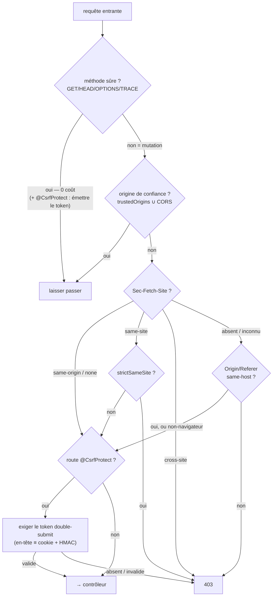

# CSRF — empêcher les requêtes forgées cross-site

> Le CSRF fait exécuter au navigateur d'une victime **déjà authentifiée** une mutation qu'elle n'a
> pas voulue (son cookie de session part automatiquement). Nodefony défend en **deux couches** : une
> défense **globale** par _Fetch Metadata_ (le navigateur tamponne lui-même la provenance), et une
> défense **en profondeur opt-in** par _synchronizer token_ signé (`@CsrfProtect`, double-submit).
> Ancré sur `src/packages/@nodefony/security/nodefony/service/csrf.ts` et `src/csrfToken.ts`.

## 🧠 Le modèle mental — deux couches, zéro friction la plupart du temps



La couche 1 (provenance) est **globale et active par défaut** ; la couche 2 (token) n'est payée que
sur les routes décorées `@CsrfProtect`.

## 📖 Lexique

| Terme              | Sens                                                                                                   |
| ------------------ | ------------------------------------------------------------------------------------------------------ |
| CSRF               | _Cross-Site Request Forgery_ : un site tiers déclenche une action authentifiée à l'insu de la victime. |
| Méthode sûre       | GET/HEAD/OPTIONS/TRACE — sans effet de bord (RFC 9110 §9.2.1), hors vecteur CSRF.                      |
| Fetch Metadata     | En-têtes `Sec-Fetch-*` posés **par le navigateur** (infalsifiables par un script).                     |
| `Sec-Fetch-Site`   | `same-origin` / `same-site` / `cross-site` / `none` : d'où vient la requête.                           |
| Synchronizer token | Jeton anti-CSRF rejoué par le client pour prouver l'intention.                                         |
| Double-submit      | Le token est à la fois dans un **cookie lisible** et dans un **en-tête** ; les deux doivent coïncider. |
| HMAC               | _Hash-based MAC_ : signature symétrique — sans le secret, impossible de forger un token valide.        |
| SOP                | _Same-Origin Policy_ : un script tiers ne peut pas lire les cookies d'un autre site.                   |
| BFF                | _Backend-For-Frontend_ : le serveur gère session/jetons pour le front web.                             |

## Qu'est-ce que le CSRF ? — l'attaque, vue de la victime

1. Tu es connecté·e à `app.example.org` — ton **cookie de session** est en poche.
2. Un autre onglet affiche `evil.site` : la page embarque un `<form>` invisible pointant sur
   `https://app.example.org/api/profile/email`, soumis automatiquement en JS.
3. Ton navigateur envoie la requête **avec ton cookie** — c'est le comportement normal des cookies,
   `evil.site` n'a rien volé.
4. Sans défense, le serveur voit une mutation authentifiée : l'email du compte est remplacé, et le
   « mot de passe oublié » part chez l'attaquant.

Ce que la défense bloque : à l'étape 3, le navigateur tamponne lui-même `Sec-Fetch-Site: cross-site`
— un script attaquant **ne peut pas** falsifier cet en-tête. Le serveur répond **403 avant tout
contrôleur** : l'attaque meurt sans avoir touché ton code.

## La vision Nodefony

- **Vérifier la provenance d'abord** (OWASP 2025, modèle Go 1.25 `CrossOriginProtection`) : la
  couche 1 est la défense **par défaut**, `csrf.enabled: true` (`config.ts:151-156`).
- **Globale, pas liée aux zones** : toute mutation cross-site est refusée, route publique ou non —
  branchée dans le pipeline HTTP — l'appel `enforceCsrf` (`http-kernel.ts:1283`) arrive **après** le
  resolve (les marqueurs de route sont lisibles) et **avant** la session (rejet précoce : un
  attaquant ne coûte ni lecture de session ni authentification).
- **Logique pure** : la classe `Csrf` est synchrone, sans I/O ni allocation sur le hot-path —
  testable sans serveur, instanciée une fois au boot (`csrf.ts:56`).
- La couche 2 (`@CsrfProtect`) est la ceinture-et-bretelles des mutations à haute valeur ; la
  couche 3 côté cookies (attribut `SameSite`) reste portée par les émetteurs de cookies.

## 🚀 Démarrage rapide

### Dans une app `nodefony create app`, la couche 1 est DÉJÀ active

Rien à écrire ni à configurer : toute mutation dont la provenance est un site tiers reçoit **403**,
sur toutes tes routes. Les clients non-navigateurs (curl, CI) passent — ils n'embarquent pas les
cookies d'une victime, ils sont hors vecteur (`csrf.ts:113`).

### Opt-in couche 2 : `@CsrfProtect` sur une mutation à haute valeur

Les décorateurs `CsrfProtect`/`CsrfExempt` sont exportés par `@nodefony/framework` (`framework/index.ts:86-87`) :

```typescript
// nodefony/controllers/ProfileController.ts — complet, compile tel quel
import {
  controller,
  Controller,
  Get,
  Post,
  Body,
  CsrfProtect,
} from "@nodefony/framework";

@controller("/api/profile")
class ProfileController extends Controller {
  // Requête SÛRE vers une route @CsrfProtect : le firewall MINT le token →
  // la réponse pose le cookie lisible `csrf-token` (et on le rend au SPA).
  @CsrfProtect()
  @Get("/csrf")
  csrf() {
    return this.renderJson({ token: this.context?.csrfToken ?? null });
  }

  // Mutation @CsrfProtect : couche 1 (provenance) PUIS couche 2 —
  // en-tête `x-csrf-token` ≡ cookie `csrf-token` + HMAC valide, sinon 403.
  @CsrfProtect()
  @Post("/email")
  async changeEmail(@Body() body: { email: string }) {
    return this.renderJson({ ok: true, email: body.email });
  }
}

export default ProfileController;
```

(Wiring : `@controllers([ProfileController])` dans le module de l'app — `nodefony create controller`
le fait pour toi. Posé sur la **classe**, `@CsrfProtect()` couvre toutes les actions : les marqueurs
`csrfProtect`/`csrfExempt` acceptent méthode OU classe, `routerDecorators.ts:1370-1375`.)

### Comment le front obtient — puis rejoue — le token

1. **Obtenir** : une requête **sûre** (GET) vers n'importe quelle route `@CsrfProtect` sème le token
   (`firewall.ts:753-757`) ; la réponse pose le cookie **lisible** `csrf-token` — non `HttpOnly`
   exprès, `SameSite=Strict`, `Secure` en HTTPS (`HttpContext.writeHead()`, `HttpContext.ts:419-432`).
2. **Rejouer** : le SPA lit le cookie et renvoie sa valeur **à l'identique** dans l'en-tête
   `x-csrf-token` sur chaque mutation.

```typescript
// Côté SPA (fragment) — lire le cookie lisible, le rejouer dans l'en-tête
const token = document.cookie.match(/(?:^|;\s*)csrf-token=([^;]+)/)?.[1] ?? "";
await fetch("/api/profile/email", {
  method: "POST",
  headers: {
    "content-type": "application/json",
    "x-csrf-token": decodeURIComponent(token),
  },
  body: JSON.stringify({ email: "ada@example.org" }),
});
```

### Ce qu'on observe

```bash
# 1) Mutation forgée cross-site (ce que déclenche evil.site) → 403, couche 1
curl -si -X POST -H 'Sec-Fetch-Site: cross-site' \
  http://localhost:5151/api/profile/email | head -1
# HTTP/1.1 403 Forbidden

# 2) Provenance saine MAIS pas de token (route @CsrfProtect) → 403, couche 2
curl -si -X POST -H 'Sec-Fetch-Site: same-origin' \
  http://localhost:5151/api/profile/email | head -1
# HTTP/1.1 403 Forbidden

# 3) Semer le token (requête sûre), puis rejouer cookie + en-tête → 200
TOKEN=$(curl -s -c /tmp/jar http://localhost:5151/api/profile/csrf \
  | sed -E 's/.*"token":"([^"]+)".*/\1/')
curl -si -b /tmp/jar -H "x-csrf-token: $TOKEN" \
  -H 'Content-Type: application/json' -d '{"email":"ada@example.org"}' \
  -X POST http://localhost:5151/api/profile/email | head -1
# HTTP/1.1 200 OK
```

> [!IMPORTANT]
> En **prod/cluster**, le secret du synchronizer doit être **fixé et partagé entre process** —
> absent, un secret **éphémère** est généré (dev) : un redémarrage invalide les tokens en cours, et
> chaque pod rejette les tokens des autres (`firewall.ts:199-209`). Générer et câbler :
> `npx nodefony security:secrets` (`security-secrets.ts:39`) → `NF_CSRF_SECRET` →
> `use("@nodefony/security", { csrf: { secret: ctx.env.NF_CSRF_SECRET } })`.

## ⚙️ Choisir sa défense — trois situations

### Situation 1 — l'app web classique : la couche 1 suffit (défaut)

Ton SPA + BFF session sert des utilisateurs connectés ; tu ne veux **aucune friction**. Rien à
configurer : le navigateur tamponne la provenance, le serveur tranche.

| Le client envoie…                                        | Couche 1 (provenance)        | Résultat |
| -------------------------------------------------------- | ---------------------------- | :------: |
| SPA same-origin, cookie de session                       | `same-origin` → passe        | **200**  |
| `evil.site` (form auto-soumis, cookie embarqué de force) | `cross-site`                 | **403**  |
| curl / script CI (aucun en-tête navigateur)              | non-navigateur, hors vecteur | **200**  |

### Situation 2 — mutation à haute valeur : ajouter `@CsrfProtect`

Changement d'email/mot de passe, virement : tu veux que la mutation tienne **même si** un signal de
provenance manque (proxy qui strippe, navigateur ancien, valeur `Sec-Fetch-Site` future). Le token
prouve l'**intention** en plus de la provenance :

| Le client envoie…                              | Couche 1 | Couche 2 (token)      | Résultat |
| ---------------------------------------------- | -------- | --------------------- | :------: |
| SPA : cookie + en-tête `x-csrf-token` ≡ cookie | passe    | signature HMAC valide | **200**  |
| SPA qui oublie l'en-tête                       | passe    | token absent          | **403**  |
| curl sans rien (passait en situation 1)        | passe    | token **exigé**       | **403**  |
| curl après GET du token (cookie + en-tête)     | passe    | signature HMAC valide | **200**  |

### Situation 3 — webhook entrant : `@CsrfExempt`, jamais `@BypassFirewall`

Un provider (paiement, git) POST cross-origin **légitimement**, authentifié autrement (signature
HMAC du provider, clé API). La route sort de la défense CSRF **en conservant** authentification et
autorisation :

```typescript
@CsrfExempt()      // ✅ hors défense CSRF, l'auth de la zone RESTE appliquée
@BypassFirewall()  // ❌ coupe AUSSI l'authentification — porte grande ouverte
```

> [!WARNING]
> `@CsrfExempt` (`routerDecorators.ts:895`) est un opt-out **ciblé CSRF**. Ne jamais « débloquer un
> webhook » avec `@BypassFirewall`/`@Anonymous` : eux désactivent l'authentification de la zone.

Cas voisin — **façade multi-domaine** (`www.example.com` poste vers l'API d'un autre domaine à toi) :
déclarer l'alias dans `csrf.trustedOrigins` (match exact d'origine), pas dans `cors.origins` — CORS
ouvrirait **aussi** la lecture des réponses au JS tiers (`config.ts:176-181`).

## 🏗️ Architecture interne

### Couche 1 — la chaîne de décision (`Csrf.enforce()`)

`Csrf.enforce()` (`csrf.ts:85`) est **pure, synchrone, zéro I/O**, no-op immédiat sur les méthodes
sûres → coût nul sur le GET dominant (`csrf.ts:88`). Pour une mutation, dans l'ordre :

1. **Origine de confiance** — `csrf.trustedOrigins` ∪ whitelist CORS → passe même en cross-site : ce
   que CORS autorise déjà explicitement **n'est pas** du CSRF (`csrf.ts:93`, union construite par le
   firewall au boot, `firewall.ts:190-194`).
2. **Fetch Metadata** (`Sec-Fetch-Site`, infalsifiable par un script) : `same-origin`/`none` → OK ;
   `same-site` → OK sauf `strictSameSite` (`csrf.ts:102-104`) ; `cross-site` → **403** ; valeur
   inconnue → on **délègue au repli** (forward-compat, le W3C dit « SHOULD ignore », `csrf.ts:98-109`).
3. **Repli `Origin`/`Referer`** (vieux navigateur, ou `Sec-Fetch-Site` absent) : **aucune** des
   deux → client non-navigateur, hors vecteur → OK ; sinon **same-host** exigé, mismatch → **403**
   (`csrf.ts:112-116`).

Lectures durcies côté firewall :

- en-têtes lus en **première occurrence** — jamais un tableau d'en-têtes répétés (garde d'injection,
  `headerValue()`, `firewall.ts:77-83`) ; cookie extrait de l'en-tête **brut**, sans dépendre du
  parse du contexte (`cookieValue()`, `firewall.ts:90-103`) ;
- hôte cible **brut avec port** — `:authority` en HTTP/2, `context.domain` en dernier recours
  (`firewall.ts:772-775`) ;
- le refus est un `CsrfError` **403 au message générique** : la politique (en-têtes inspectés,
  whitelist) ne fuite jamais au client (`CsrfError.ts:17-21`).

### Couche 2 — le token signé (`CsrfTokenManager`)

`CsrfTokenManager` (`csrfToken.ts:23`) implémente le **signed double-submit** (OWASP Cheat Sheet) :

- token = `nonce.HMAC-SHA256(secret, nonce)` en base64url — nonce de 144 bits (`csrfToken.ts:27`),
  émis par `issue()` (`csrfToken.ts:34`) ;
- `verify()` exige en-tête **et** cookie **présents**, **égaux** (double-submit) et la **signature
  valide** (`csrfToken.ts:49-63`) — comparaisons à **temps constant**, jamais d'exception
  (`csrfToken.ts:71-76`).

Pourquoi ça tient : le secret HMAC empêche un script tiers de **forger** un token (il ne peut pas
calculer la signature) ; le double-submit l'empêche d'en **injecter** un (il ne peut ni écrire
l'en-tête custom — préflight CORS — ni lire le cookie de la victime — SameSite + SOP). Et c'est
**stateless** : aucune session requise → couvre le BFF web **et** l'API JWT sans coupler au stockage
de session (TSDoc `CsrfTokenManager`, `csrfToken.ts:12-15`).

### Le câblage dans le pipeline (du décorateur au 403)

1. `@CsrfProtect`/`@CsrfExempt` posent un **marqueur** de metadata — zéro import de
   `@nodefony/security` côté framework, zéro cycle (`routerDecorators.ts:886`).
2. Au match de la route, `Resolver.match()` recopie les marqueurs sur le contexte
   (`Resolver.ts:152-153`) — champs portés par le `Context` de base, HTTP comme WS
   (`Context.ts:181-183`).
3. `Firewall.enforceCsrf()` (`firewall.ts:741`) fait les trois rôles : **émission** du token sur
   requête sûre `@CsrfProtect`, **couche 1** sur toute mutation, **couche 2** en plus si
   `@CsrfProtect`. Les routes `bypassFirewall` (callbacks OAuth) sont exemptées
   (`firewall.ts:743-745`), les `@CsrfExempt` sortent après la barrière méthode sûre
   (`firewall.ts:760`).
4. `HttpContext.writeHead()` matérialise `context.csrfToken` en cookie `csrf-token` — flush groupé
   avec le cookie de session (`HttpContext.ts:419-432`).

## ⚙️ Configuration (schéma Zod `csrfSchema`, `config.ts:149-192`)

| Option           | Type · défaut        | Effet                                                                                                                                                      |
| ---------------- | -------------------- | ---------------------------------------------------------------------------------------------------------------------------------------------------------- |
| `enabled`        | boolean · `true`     | Active toute la défense — couches 1 **et** 2 (`config.ts:151-156`).                                                                                        |
| `fetchMetadata`  | boolean · `true`     | Défense primaire `Sec-Fetch-Site` (`config.ts:157-162`).                                                                                                   |
| `checkOrigin`    | boolean · `true`     | Repli `Origin`/`Referer` same-host pour les navigateurs sans `Sec-Fetch-*` (`config.ts:164-169`).                                                          |
| `strictSameSite` | boolean · `false`    | `true` = refuser aussi `same-site` (sous-domaine non maîtrisé / multi-tenant) — distinct de l'attribut cookie (`config.ts:170-175`).                       |
| `sameSite`       | enum · `Lax`         | **Déclaratif** : surfacé dans l'introspection (`firewall.ts:468`) ; l'attribut effectif du cookie `csrf-token` est `Strict` en dur (`HttpContext.ts:428`). |
| `trustedOrigins` | string[] · `[]`      | Alias **exacts** (`scheme://host[:port]`) autorisés même cross-site — sans ouvrir la lecture CORS (`config.ts:176-181`).                                   |
| `secret`         | string ≥ 16 car. · — | Secret HMAC du synchronizer — PROD : via env, **partagé cluster** ; absent = éphémère dev (`config.ts:182-188`).                                           |

## 📜 Normes appliquées

| Domaine                        | Norme                             | Ancrage                                |
| ------------------------------ | --------------------------------- | -------------------------------------- |
| Méthodes sûres                 | RFC 9110 §9.2.1                   | `SAFE_METHODS` (`csrf.ts:8-13`)        |
| Provenance                     | W3C Fetch Metadata                | `Csrf.enforce()` (`csrf.ts:96-109`)    |
| Valeur `site` inconnue → repli | Fetch Metadata « SHOULD ignore »  | `csrf.ts:107`                          |
| Token signé                    | OWASP Signed Double-Submit Cookie | `CsrfTokenManager` (`csrfToken.ts:23`) |
| Refus 403                      | RFC 9110 §15.5.4                  | `CsrfError` (`CsrfError.ts:17-21`)     |
| Modèle de référence            | Go 1.25 `CrossOriginProtection`   | TSDoc `Csrf` (`csrf.ts:38-41`)         |
| Cookies (SameSite)             | RFC 6265bis §8.8.1                | TSDoc `Csrf` (`csrf.ts:54`)            |

## ⚡ Performance & mémoire

- **GET = 0** : retour immédiat avant toute lecture d'en-tête (`csrf.ts:88`) ; seule exception, une
  route `@CsrfProtect` mint le token **une fois** (skip si déjà posé, `firewall.ts:753-757`).
- **Zéro microtask** : la chaîne est synchrone de bout en bout (pas d'`async` pour du pur calcul).
- **Lazy** : `#csrf`/`#csrfTokens` restent `null` si la défense est désactivée — aucune structure
  allouée « au cas où » (`firewall.ts:135-138`).
- Le coût HMAC (1 à l'émission, 1 à la vérif) n'est payé **que** sur les routes `@CsrfProtect` ; les
  marqueurs sont lus depuis le memo de route — 0 `Reflect` par requête (`Resolver.ts:142`).

## 📡 Observabilité — Studio

L'écran **Firewall** de Studio expose la défense dans son onglet Défenses (`FirewallDefenses`,
`Firewall.tsx:313-314`). La projection est **sans secret par construction** :
`Firewall.#describeDefenses()` (`firewall.ts:461`) publie la config résolue, et `synchronizerToken`
n'est que la **présence** du secret armé — jamais sa valeur (`firewall.ts:471`).

## ⚠️ Pièges (symptôme → cause → correction)

| Symptôme                                       | Cause (dans le code)                                                                           | Correction                                                                |
| ---------------------------------------------- | ---------------------------------------------------------------------------------------------- | ------------------------------------------------------------------------- |
| Mutation légitime cross-domaine bloquée en 403 | Domaine alias non déclaré                                                                      | Ajouter l'origine à `csrf.trustedOrigins` (ou CORS si lecture voulue)     |
| Client non-navigateur (curl/CI) refusé         | N'arrive pas sur une route non décorée : ni Fetch Metadata ni `Origin` → passe (`csrf.ts:113`) | Attendu ; sur `@CsrfProtect`, semer le token (GET) avant la mutation      |
| `@CsrfProtect` échoue en 403 côté SPA          | En-tête `x-csrf-token` non rejoué, ou ≠ cookie (`firewall.ts:778-783`)                         | Relire le cookie `csrf-token` et le rejouer à l'identique                 |
| Tokens invalidés au redémarrage / entre pods   | `csrf.secret` absent → secret éphémère par process (`firewall.ts:199-209`)                     | Fixer `csrf.secret` (≥ 16 car., partagé cluster) — `security:secrets`     |
| `same-site` refusé alors qu'attendu OK         | `strictSameSite` activé (`csrf.ts:102-104`)                                                    | Le désactiver si les sous-domaines sont de confiance                      |
| `http://` accepté par le repli (même hôte)     | Le repli compare l'**hôte seul**, jamais le scheme (`Csrf.#sameHost()`, `csrf.ts:130-136`)     | Limite documentée (banc red-team) ; Fetch Metadata prime sur nav. moderne |
| Webhook provider bloqué en 403                 | POST cross-site légitime, hors whitelist                                                       | `@CsrfExempt` sur la route — jamais `@BypassFirewall`                     |

> [!TIP]
> Un banc d'intégration **live** du repo exerce exactement ce flow (émission GET, double-submit,
> exemption) sur les routes `/csrf/token`, `/csrf/submit` et `/csrf/webhook` du module de test
> (`FrameworkController.ts:139-160`) — la référence exécutable si un comportement te surprend.

## 🧪 Tests & couverture

Trois familles couvrent la brique — les **chiffres exacts vivent dans la carte de l'aperçu**
(régénérée par `gen-counters.mjs` depuis vitest, jamais figée ici) :

- **unit** : `csrf.test.ts` (la chaîne de décision couche 1 : Fetch Metadata, `strictSameSite`,
  repli, origines de confiance), `csrfToken.test.ts` (le double-submit signé : émission, formats,
  vérification) ;
- **attaque** : `csrf.attack.test.ts` (red-team — spoofing d'`Origin` host-exact, provenance
  illisible, token malformé, **splicing** nonce/signature de deux vrais tokens, et la limite
  host-only du repli **documentée par test**) ;
- **intégration live** : `tests/http/csrf.test.ts` chez `@nodefony/http` (serveur réel — défense
  globale, flow double-submit `@CsrfProtect`, opt-out `@CsrfExempt`).

Couverture : `npm run coverage` dans `@nodefony/security`.

## 🔗 Pour aller plus loin

- Le firewall qui câble les deux couches → [firewall](./firewall.md)
- CORS (ce qui est autorisé cross-origin, ∪ des origines de confiance CSRF) → [cors](./cors.md)
- En-têtes de sécurité (CSP, isolation) → [headers](./headers.md)
- Vue d'ensemble sécurité → [index](./index.md)
