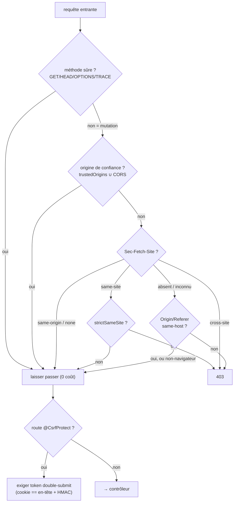

# CSRF — empêcher les requêtes forgées cross-site

> Le CSRF fait exécuter au navigateur d'une victime **déjà authentifiée** une mutation qu'elle n'a pas
> voulue (son cookie de session part automatiquement). Nodefony défend en **deux couches** : une défense
> **globale** par _Fetch Metadata_ (le navigateur tamponne lui-même la provenance), et une défense
> **en profondeur opt-in** par _synchronizer token_ signé (double-submit). Ancré sur
> `src/packages/@nodefony/security/nodefony/service/csrf.ts` et `src/csrfToken.ts`.

## Le modèle mental — deux couches, la plupart du temps zéro friction

## Lexique

| Terme              | Sens                                                                                                   |
| ------------------ | ------------------------------------------------------------------------------------------------------ |
| CSRF               | _Cross-Site Request Forgery_ : un site tiers déclenche une action authentifiée à l'insu de la victime. |
| Méthode sûre       | GET/HEAD/OPTIONS/TRACE — sans effet de bord (RFC 9110 §9.2.1), hors vecteur CSRF.                      |
| Fetch Metadata     | En-têtes `Sec-Fetch-*` posés **par le navigateur** (infalsifiables par un script).                     |
| `Sec-Fetch-Site`   | `same-origin` / `same-site` / `cross-site` / `none` : d'où vient la requête.                           |
| Synchronizer token | Jeton anti-CSRF rejoué par le client pour prouver l'intention.                                         |
| Double-submit      | Le token est à la fois dans un **cookie lisible** et dans un **en-tête** ; les deux doivent coïncider. |

## Qu'est-ce que le CSRF — et pourquoi deux couches

Le navigateur envoie **automatiquement** les cookies d'un site vers ce site, même quand la requête est
déclenchée depuis une page tierce (un `<form>` malveillant, un `fetch`). Si le serveur se fie au seul
cookie de session, un site attaquant peut donc déclencher « virer de l'argent », « changer l'email » au
nom d'une victime connectée. La parade moderne (OWASP 2025, modèle Go 1.25 `CrossOriginProtection`) est
de **vérifier la provenance** de toute mutation. Nodefony en fait la défense **par défaut** (couche 1) ;
la couche 2 (token) est une ceinture-et-bretelles pour les routes les plus sensibles.

## Couche 1 — la défense globale (Fetch Metadata d'abord)

`Csrf.enforce(req)` (`csrf.ts:85`) est **pure, synchrone, zéro I/O**, et **no-op sur les méthodes sûres**
→ coût nul sur le GET dominant (`:87-88`). Pour une mutation, la chaîne de décision (`:90-116`) :

1. **Origine de confiance** — `csrf.trustedOrigins` ∪ whitelist CORS → laisser passer même en cross-site.
   Constat de cohérence : ce que CORS autorise déjà explicitement **n'est pas** du CSRF (`:92-93`, câblé
   par le firewall `firewall.ts:190-192`).
2. **Fetch Metadata** (`Sec-Fetch-Site`, infalsifiable par un script) : `same-origin`/`none` → OK ;
   `same-site` → OK sauf si `strictSameSite` ; `cross-site` → **403** ; valeur inconnue → on **délègue au
   repli** (forward-compat, le W3C dit « SHOULD ignore », `:96-109`).
3. **Repli `Origin`/`Referer`** (vieux navigateur, ou `Sec-Fetch-Site` absent) : **aucune** des deux →
   client non-navigateur, hors vecteur CSRF → OK ; sinon **same-host** requis, mismatch → **403**
   (`:111-116`).

La défense est **globale** (pas liée aux zones) : toute mutation cross-site est refusée par défaut. Elle
lit `Sec-Fetch-Site`/`Origin`/`Referer`/`Host` en **première occurrence** (jamais un tableau d'en-têtes
répétés, garde d'injection d'en-tête, `firewall.ts:74-88`).

## Couche 2 — le synchronizer token (`@CsrfProtect`, opt-in)

Pour les routes les plus sensibles, `CsrfTokenManager` (`csrfToken.ts:23`) ajoute le modèle **signed
double-submit** (OWASP Cheat Sheet) : le token est `nonce.HMAC-SHA256(secret, nonce)` (base64url), posé
dans un **cookie lisible** (`csrf-token`, non HttpOnly) **et** rejoué par le client dans l'en-tête
`x-csrf-token`. `@CsrfProtect` exige les deux **présents**, **égaux** (double-submit, comparaison à
**temps constant** `:71-76`) et la **signature HMAC valide** (`verify`, `:49-63`).

Pourquoi ça tient (`csrfToken.ts:10-19`) : le secret HMAC empêche un script tiers de **forger** un token
(il ne peut pas calculer la signature) ; le double-submit empêche un attaquant cross-site d'en
**injecter** un (il ne peut ni écrire l'en-tête custom — préflight CORS — ni lire le cookie de la victime
— SameSite + Same-Origin Policy). Surtout, c'est **stateless** : aucune session requise → couvre le BFF
web **et** l'API JWT sans coupler au stockage de session. Coût : 1 HMAC à l'émission, 1 à la vérif —
**payé uniquement** sur les routes `@CsrfProtect` (la couche 1 reste primaire, GET = 0).

> [!IMPORTANT]
> Le secret du synchronizer (`csrf.secret`) doit être **fixé et partagé entre process** en prod/cluster
> (`firewall.ts:195-209`). Absent → un secret **éphémère** est généré (dev) : un redémarrage invalide les
> tokens en cours, et il est incohérent en cluster. Fixer `csrf.secret` (≥ 16 car.).

## Pièges (symptôme → cause → correction)

| Symptôme                                       | Cause (dans le code)                                         | Correction                                                         |
| ---------------------------------------------- | ------------------------------------------------------------ | ------------------------------------------------------------------ |
| Mutation légitime cross-domaine bloquée en 403 | Domaine alias non déclaré                                    | Ajouter l'origine à `csrf.trustedOrigins` (ou CORS)                |
| Client non-navigateur (curl/CI) refusé         | (n'arrive pas) : ni Fetch Metadata ni Origin → laissé passer | Rien — c'est le comportement attendu                               |
| `@CsrfProtect` échoue en 403 côté SPA          | En-tête `x-csrf-token` non renvoyé, ou ≠ cookie              | Relire le cookie `csrf-token` et le rejouer à l'identique          |
| Tokens CSRF invalidés à chaque redémarrage     | `csrf.secret` éphémère (non configuré)                       | Fixer `csrf.secret` (≥16 car., partagé cluster)                    |
| `same-site` refusé alors qu'attendu OK         | `strictSameSite` activé                                      | Désactiver `strictSameSite` si les sous-domaines sont de confiance |

## Tests & couverture

La défense CSRF est couverte par **35 cas unit + 13 tests d'attaque** : `csrf.test` (25, la chaîne de
décision Fetch Metadata + repli), `csrfToken.test` (10, le double-submit signé) et `csrf.attack.test`
(13, la red-team — origines forgées, en-têtes injectés, tokens rejoués). Les deux fichiers cœur sont à
**100 %** de couverture. Photo régénérée depuis vitest (`npm run coverage` dans `@nodefony/security`).

## Pour aller plus loin

- Le firewall qui câble les deux couches → [firewall](./firewall.md)
- CORS (ce qui est autorisé cross-origin, ∪ des origines de confiance CSRF) → [cors](./cors.md)
- Vue d'ensemble sécurité → [index](./index.md)
