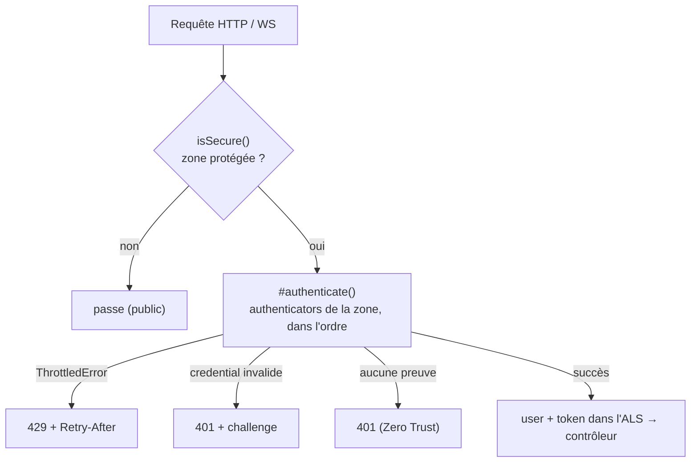

# Firewall — le pare-feu applicatif

> Pour **chaque** requête (HTTP comme WebSocket), le firewall répond à trois questions dans l'ordre :
> est-ce une zone protégée ? qui es-tu ? as-tu le droit ? La politique par défaut est **Zero Trust** :
> sur une zone protégée, pas de preuve d'identité valide = 401. Ancré sur
> `src/packages/@nodefony/security/nodefony/service/firewall.ts` et les authenticators de
> `nodefony/src/authenticator/`.

## Le modèle mental — chemin chaud, chemin froid

Le firewall sépare **détecter** (chaud, sur chaque requête) et **décider** (froid, seulement zone
protégée) — pour ne pas payer l'authentification sur les routes publiques.



`isSecure()` (`firewall.ts:537-555`) rattache la requête à une **zone** (`matchPath` `:529-535`) ;
`handleSecurity()` (`:561-659`) décide. Les zones sont triées par **spécificité** — le motif le plus
long gagne, pas le premier déclaré (`:223-232`).

## Lexique

| Terme         | Sens                                                                            |
| ------------- | ------------------------------------------------------------------------------- |
| Zone          | Un motif d'URL (+ host) avec sa politique (`config.areas`).                     |
| Authenticator | Une stratégie d'identification (session, userpassword, jwt, apikey, anonymous). |
| Zero Trust    | Sans preuve valide sur une zone protégée → 401.                                 |
| Challenge     | En-tête `WWW-Authenticate` (RFC 7235) qui dit comment s'authentifier.           |
| BFF           | Backend-For-Frontend : le serveur gère session/jetons pour le front web.        |
| PAT           | Personal Access Token : une clé d'API opaque, révocable côté serveur.           |
| Bearer        | Schéma `Authorization: Bearer <token>` (RFC 6750).                              |

## Démarrage rapide

### 1) Protéger une zone web (session, le cas le plus courant)

Le web suit le modèle **BFF** : l'utilisateur se connecte une fois (formulaire → le serveur pose un
cookie de session), puis chaque requête est prouvée par la **session**. Trois étapes :

```typescript
// (a) déclarer la zone protégée dans la config sécurité
use("@nodefony/security", {
  areas: [
    {
      name: "app",
      pattern: "^/(?!login)",
      authenticators: ["session"],
      mode: "first",
    },
  ],
});
```

```typescript
// (b) le login : le contrôleur BFF vérifie l'identifiant/mot de passe et ouvre la session
//     (AuthFlow.login pose l'identité dans le blob de session + régénère l'ID — anti-fixation)
@controller("/login")
class LoginController extends Controller {
  @Post("/")
  async login(@Body() body: { username: string; password: string }) {
    const outcome = await this.get("authFlow").login(
      this.context,
      body.username,
      body.password,
    );
    return this.renderJson(outcome); // Set-Cookie de session émis par le pipeline
  }
}
```

```typescript
// (c) une route protégée : à ce stade, context.user est GARANTI (le firewall a authentifié)
@controller("/account")
class AccountController extends Controller {
  @IsGranted(["ROLE_USER"])
  @Get("/me")
  async me() {
    return this.renderJson({ me: this.context.user }); // ré-résolu à chaque requête (rôles frais)
  }
}
```

Ce que voit le client : après `(b)`, son navigateur détient le cookie ; il ne renvoie **rien d'autre**
— la session est la preuve. Une session absente/expirée sur `/account/me` → **401 nu**, et le front
redirige vers son écran de login (pas de popup Basic).

### 2) Protéger une API (jwt et/ou apikey)

```typescript
use("@nodefony/security", {
  areas: [
    // jwt et apikey cohabitent : ils se distinguent par la FORME du bearer (voir plus bas)
    {
      name: "api",
      pattern: "^/api",
      authenticators: ["jwt", "apikey"],
      mode: "first",
    },
  ],
});
```

Le client envoie l'un ou l'autre :

```
Authorization: Bearer eyJhbGciOiJFZERTQS␣…␣.␣…␣.␣…        # un JWT (structure a.b.c)
Authorization: Bearer nfp_9a2c…                          # une clé API (préfixe nfp_)
```

## Les authenticators intégrés

Tous respectent le **même contrat** (`IAuthenticator`) : `supports(context)` (test bon marché : la
requête porte-t-elle ce type de credential ?), `createToken()` (extrait le credential brut),
`authenticate(token)` (valide + promeut, ou lève un 401), `challenge()` (l'en-tête `WWW-Authenticate`).
Point commun de sécurité : **message d'échec uniforme** (`"Invalid token"` / `"Invalid credentials"`)
— la cause fine (expiré, révoqué, sujet banni…) part dans l'audit, jamais au client (anti-énumération).

| Nom            | Credential                              | Vérité     | Révocable | Pour…                             |
| -------------- | --------------------------------------- | ---------- | :-------: | --------------------------------- |
| `session`      | cookie de session (identifiant en blob) | serveur    | immédiate | le **web** après login (BFF)      |
| `userpassword` | `Authorization: Basic base64(id:mdp)`   | verifier   |    n/a    | outils/scripts, brique login      |
| `jwt`          | `Authorization: Bearer <a.b.c>`         | auto-porté | via état  | API service↔service, agents       |
| `apikey`       | `Authorization: Bearer <prefix>_…`      | serveur    | immédiate | API/CI/scripts d'un user          |
| `anonymous`    | (aucun)                                 | —          |     —     | accepter l'anonymat explicitement |

### `session` — la preuve du web après login

Credential = l'**identifiant** posé dans le blob de session (jamais un secret). `supports()` exige une
session **reprise** portant un user (`context.session.user`, `SessionAuthenticator.ts:43-46`) — il ne
démarre jamais la session lui-même (le pipeline le fait avant le firewall). Constat clé : l'identité
est **re-résolue à chaque requête** via `resolveSessionIdentity` (`:70`) → rôles frais, révocation et
verrouillage effectifs **immédiatement**. Pas de `challenge()` : session absente = 401 nu → le front
redirige. Piège : c'est `AuthFlow.login` (BFF) qui ouvre la session et régénère l'ID (anti-fixation),
pas cet authenticator.

### `userpassword` — HTTP Basic, avec throttle NIST

Credential = `Authorization: Basic base64(identifiant:motdepasse)` (RFC 7617, split au **premier** `:`,
`UserPasswordAuthenticator.ts:74-81`). La vérification (hash, comparaison, leurre anti-timing, re-hash)
est **déléguée** au `IPasswordVerifier` (le `UserService`) — l'authenticator ne voit que le verdict.
Constat de sécurité fort : le **throttling NIST SP 800-63B** vérifie l'identifiant **AVANT** d'appeler
le verifier (`:101-104`) → un identifiant bloqué ne coûte **aucun hash argon2** (protège le serveur
d'un DoS par hachage), échec → backoff, `ThrottledError` → **429 + `Retry-After`**. Challenge :
`Basic realm="nodefony"`. Piège : le login **par formulaire** (JSON) n'est **pas** ici — il passe par
le BFF (`AuthController`) qui appelle le verifier directement ; Basic sert l'outillage.

### `jwt` — Bearer JWT signé, durci RFC 8725

Credential = `Authorization: Bearer <jws>` de structure compacte `a.b.c` (`JwtAuthenticator.ts:14-20`).
Réservé API service↔service / agents (le web reste sur la session). Access token **EdDSA** signé par le
keystore du serveur. Défenses **dures**, prouvées en test (RFC 8725 JWT BCP) :

- **allowlist d'algorithmes** `["EdDSA"]` — l'algo n'est **jamais** choisi d'après l'en-tête du token ;
  `alg=none` rejeté (`:104`).
- **clé par `kid` depuis le JWKS LOCAL** (`createLocalJWKSet`) — jamais `jku`/`jwk` de l'en-tête
  (anti-injection de clé / SSRF, `:155-159`).
- **`aud` + `iss` obligatoires** + `typ:"at+jwt"` (un refresh présenté comme access est rejeté) + exp/nbf
  (`:105-108`).
- **révocation** malgré l'auto-portage : denylist `jti` + `invalidBefore` par sujet (`:122-132`).
- **sujet revérifié** à réception (`loadUserByIdentifier(sub)`) : compte disparu/inactif/verrouillé =
  rejet (`:174-187`).

Le token promu porte `scopes`, `jti`, `claims` (`:162-172`). Piège : un JWT est auto-porté → sans état
serveur il n'est **pas** révocable ; c'est la denylist/`invalidBefore` qui le rend révocable.

### `apikey` — clé d'API opaque (PAT), révocable

Credential = `Authorization: Bearer <prefix>_…` (`ApiKeyAuthenticator.ts:67-73`). Contrairement au JWT,
c'est un **bearer opaque** : sa vérité vit côté serveur (`ITokenStore`) → **révocable immédiatement**.
Défenses : **forme + CRC validés AVANT tout accès au store** (`parseApiKey`, anti-DoS, `:98-102`),
lookup par **hash sha256** (le secret n'existe nulle part au repos, `:105`), révocation (`revokedAt`) +
expiration (`expiresAt`) + **ban en masse** du porteur (`invalidBefore` vs `createdAt`, `:117-120`),
sujet revérifié (rôles frais, `:122-123`), `lastUsedAt` écrit en **throttlé** (`:127-134`). Le token
porte `scopes`, `apiKeyId`, `tenantId` (`:138-140`). Constat : `jwt` et `apikey` **cohabitent** dans une
zone car ils se discriminent par la forme (JWT = `a.b.c`, PAT = `prefix_…`).

### `anonymous` — accepter l'anonymat, explicitement

Le **seul** authenticator qui produit un token non authentifié **sans** déclencher le Zero Trust
(`AnonymousAuthenticator.ts:6-18`). À lister **volontairement** : `["jwt", "anonymous"]` en mode
`first` = « identifié si preuve présente, sinon **visiteur anonyme accepté** ». En mode `all`, utile en
dernier : « le canal doit être prouvé (ex. mTLS), l'identité utilisateur est optionnelle ». Coût nul :
`supports()` accepte tout, le token porte le singleton gelé `anonymousUser` (0 allocation). Piège :
sans lui, zone protégée + aucune preuve = 401.

### `session-realtime` — la session, côté WebSocket (câblé auto)

Équivalent WS de `session`, **enregistré automatiquement** par le firewall au handshake des zones
protégées `realtime` (`firewall.ts:269`). Constat de perf : il **ne relit pas la base** — il réutilise
l'identité déjà posée en ALS par le firewall (handshake + frames tournent dans **la même bulle ALS**),
évitant 2 lectures base par connexion (`SessionRealtimeAuthenticator.ts:16-25`). Asymétrie **assumée**
HTTP↔WS : le jeton est **figé au handshake** (les frames lisent un cache O(1)) → une révocation prend
effet **à la reconnexion**, pas à la frame suivante — c'est l'état de l'art (Socket.IO/Phoenix figent
aussi). Un revalidator re-lit la session avant chaque action data plane ; fail-closed → fermeture 4001.

## Ordre et modes (`mode: "first"` vs `"all"`)

L'ordre effectif = la liste `area.authenticators` (`firewall.ts:918-976`) :

- **`first`** : le premier dont `supports()` est vrai authentifie. Un credential **présenté mais
  invalide échoue sans fallback** (`:934-935`) — on ne réessaie pas un autre authenticator avec le même
  credential. C'est le mode courant.
- **`all`** : chaque maillon est **obligatoire** ; le **dernier** token porte l'identité (`:936-939`).
  Pour empiler des exigences (ex. `session` **puis** un facteur supplémentaire).

Un nom d'authenticator inconnu en config **fait échouer le boot** (fail-closed, `:363-387`) — jamais de
zone « protégée » silencieusement ouverte.

## Autorisation — rôles, scopes, voters (« as-tu le droit ? »)

L'authentification dit **qui** tu es ; l'autorisation dit **ce que tu peux faire**. On déclare
l'exigence sur l'action, un **jury de voters** tranche. La garde s'applique **avant l'instanciation du
contrôleur** (seam Resolver) — une action protégée ne s'exécute jamais pour un non-autorisé.

```typescript
@IsGranted(["ROLE_ADMIN"])                 // rôle — OR interne : un seul attribut suffit
@Post("/users") async create() {}

@RequireScope("users:write")               // scope — pour une clé/JWT délégué
@Delete("/users/{id}") async remove(@Param("id") id: string) {}

@IsGranted("doc.edit", { subject: "id" })  // règle métier — le param de route `id` est passé au voter
@Put("/docs/{id}") async edit() {}
```

### Le jury et sa stratégie

`Authorization.decide(token, attribut, subject?)` (`service/authorization.ts:70`) applique une stratégie
**affirmative + DENY veto**, fermée par défaut (**Zero Trust**) :

- un seul **`DENY`** bloque (veto, court-circuit — inutile de finir le jury, `:94-97`) ;
- sinon un **`GRANT`** suffit ;
- **silence total** (tous `ABSTAIN`, ou aucun voter compétent) → **`DENY`** (`:100-108`) ;
- un voter qui **throw** → **`DENY`** + log ERROR (fail-closed : jamais 500, jamais octroi, `:85-93`).

Tout refus est audité (WARNING + `recordAudit`, `:113-142`) ; les octrois restent muets (volume, pas un
signal). Les voters sont instanciés **une fois au boot** via le registre (aucun nom en dur, `:55-64`).

### Les voters intégrés — deux axes

- **RoleVoter** (`role`, attributs `ROLE_*`) — `GRANT` si l'utilisateur a le rôle, **hiérarchie
  résolue** ; **`ABSTAIN` sinon**, jamais `DENY` (`RoleVoter.ts:25-39`). Constat : l'absence d'un rôle
  ne doit pas opposer son veto aux autres axes — c'est le **default-DENY du jury** qui ferme la porte,
  pas ce voter. C'est ce qui rend une clause OR (`@IsGranted(["A","B"])`) possible.
- **ScopeVoter** (`scope`, attributs `api:action`) — le constat le plus important : un scope **ne bride
  jamais un humain**. Un jeton `session`/`userpassword`/`anonymous` → `GRANT` (no-op : l'autorisation
  d'un humain passe par ses **rôles**). Un jeton **machine délégué** (`apikey`/`jwt`/`oauth2`) → `GRANT`
  si le scope exact est présent, `ABSTAIN` sinon. Et c'est **fail-closed côté machine** : tout type de
  jeton **hors** de la liste « non scopable » — présent ou futur (`mtls`, `agent`…) — est traité comme
  scopable, donc **bridé par défaut** (`ScopeVoter.ts:17-62`). Rôles = qui tu es ; scopes = ce qu'une
  **clé** a le droit de faire.

### La hiérarchie de rôles

`RoleHierarchyWalker` (`src/RoleHierarchyWalker.ts`) : `ROLE_ADMIN` hérite `ROLE_USER`, etc.
**Aplatissement précalculé au boot** → `hasRole()` est O(1) sur le hot path (`:23-30`), et les **cycles
sont détectés au boot** (throw avec le chemin complet, pas de fail-silent, `:69-95`). La hiérarchie est
posée au container par le firewall au boot ; le `RoleVoter` la lit en lazy.

### Voters métier (le vrai pouvoir applicatif)

Pour une règle qui dépend des **données** (ownership, tenant, état), on enregistre une fabrique :

```typescript
registerVoterFactory(
  "projectVoter",
  ({ container }) => new ProjectVoter(container),
);
// ProjectVoter.supports("doc.edit") → true ; vote(token, "doc.edit", subject) → lookup DB async :
//   l'utilisateur est-il propriétaire/membre du `subject` ? GRANT / DENY / ABSTAIN.
```

Le voter est **découvert automatiquement** par l'`AuthorizationService`, aucun changement dans le cœur
(`voterRegistry.ts:39-59`). Pourquoi un registre et pas un scan DI des `@injectable` : les interfaces TS
sont **effacées à la compilation** — rien à scanner ; le registre **est** le marqueur explicite
(`voterRegistry.ts:6-16`). Trois axes (rôles, scopes, métier), un même jury, combinables.

## HTTP et WebSocket — le même firewall

`#wireRealtime()` (`firewall.ts:253-331`) câble, pour toute zone protégée `realtime !== false`
(opt-out, `:262`), le `SessionRealtimeAuthenticator` au handshake (`:269`) **et** un `frameAuthorizer`
(RBAC par canal, `:297-311`). Même résolution de zone que HTTP. Sur une socket, un refus n'a pas
d'en-tête `WWW-Authenticate` (`:981-992`) : le **code de fermeture** suffit.

## En-têtes de sécurité, CSRF, CORS

- **`applySecurityHeaders()`** (`:835-866`) : CSP, Referrer-Policy, COOP/COEP/CORP au-dessus du socle
  transport de `@nodefony/http`. **Nonce CSP paresseux** (`:855-865`) : alloué seulement si une
  directive en a besoin.
- **`enforceCsrf()`** (défense en profondeur) : Fetch Metadata (`Sec-Fetch-Site`) + garde `Origin`
  (`:764-776`), puis double-submit `x-csrf-token` ≡ cookie + HMAC (`:778-784`).
- **`handleCors()`** : preflight `OPTIONS` → 204 (`:797-823`).

## Normes appliquées

| Domaine                | Norme           | Ancrage                                                |
| ---------------------- | --------------- | ------------------------------------------------------ |
| Challenge d'auth (401) | RFC 7235        | `firewall.ts:122,559,978`                              |
| Bearer                 | RFC 6750        | `JwtAuthenticator.ts:13` · `ApiKeyAuthenticator.ts:11` |
| JWT (BCP)              | RFC 7519, 8725  | `JwtAuthenticator.ts:33-44,104-108`                    |
| HTTP Basic             | RFC 7617        | `UserPasswordAuthenticator.ts:10-28`                   |
| Rate limit (429)       | RFC 6585        | `firewall.ts:585-587`                                  |
| Backoff de login       | NIST SP 800-63B | `UserPasswordAuthenticator.ts:43-46,101-104`           |
| CSRF                   | Fetch Metadata  | `firewall.ts:764,791`                                  |
| Modèle                 | Zero Trust      | `firewall.ts:113,611`                                  |

## Performance & mémoire

Le découpage chaud/froid EST l'optimisation : `isSecure()` (chaque requête) ne fait qu'un `matchPath` ;
`handleSecurity()` (throttler, authenticators, nonce CSP, `securityTrace`) n'est payé que sur zone
protégée. Les dépendances des authenticators (keystore, tokenStore, userProvider, verifier, jose) sont
résolues **paresseusement** au premier usage (cold path) ; `jose` est importé lazy (dep lourde). Le
nonce CSP et le `securityTrace` sont alloués à la demande. Une route publique ne paie quasiment rien.

## Pièges (symptôme → cause → correction)

| Symptôme                                | Cause (dans le code)                                    | Correction                                                      |
| --------------------------------------- | ------------------------------------------------------- | --------------------------------------------------------------- |
| Boot « authenticator inconnu »          | Nom absent du registre (fail-closed)                    | Corriger le nom / enregistrer l'authenticator                   |
| 401 alors qu'un credential est envoyé   | Mode `first` : credential invalide échoue sans fallback | Vérifier le format/authenticator attendu                        |
| API : JWT et clé API se marchent dessus | —                                                       | Rien à faire : discriminés par la forme (`a.b.c` vs `prefix_…`) |
| JWT révoqué encore accepté              | Auto-portage : révocation = état serveur                | S'assurer que `tokenStore` porte la denylist/`invalidBefore`    |
| WS : révocation pas immédiate           | Jeton figé au handshake (asymétrie assumée)             | Effet à la reconnexion ; pour l'immédiat, canal JWT (J4)        |
| 429 au login                            | Throttle NIST (backoff par identifiant)                 | Respecter `Retry-After` ; attendu sous attaque                  |

## Observabilité — Studio

Écran **Firewall** (`studio/frontend/src/routes/Firewall.tsx`) : zones, authenticators, décisions
(`securityTrace`). Écran **Roles** : hiérarchie de rôles consommée par les voters. Écran **ApiKeys** :
gestion/révocation des PAT.

## Tests & couverture

Le firewall est couvert par **35 cas unitaires + 11 tests d'attaque** : `firewallChain` (18, la chaîne
d'authenticators + modes), `firewallIntrospection` (10, l'introspection Studio), `firewallSecurityTrace`
(7, la radiographie de décision) et `frameAuthorizer.attack` (11, les attaques sur le filtrage des
trames WS). S'y ajoutent les bancs des authenticators (voir [authenticators](./authenticators.md)) et
les tests d'attaque transverses (csrf, cors, authorization). Photo régénérée depuis vitest
(`npm run coverage` dans `@nodefony/security`).

## Pour aller plus loin

- Vue du module → [index](./index.md) · Autorisation (voters, rôles, scopes) → [authorization](./authorization.md)
- JWT/OAuth2/WebAuthn/TOTP/API keys en détail → pages dédiées du module
- Où le firewall s'insère → [pipeline-requete](../../../docs/architecture/pipeline-requete.md)
