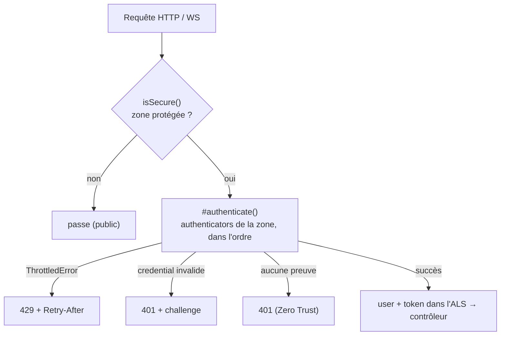

# Firewall — le pare-feu applicatif

> Pour **chaque** requête (HTTP comme WebSocket), le firewall répond à trois questions dans l'ordre :
> est-ce une zone protégée ? qui es-tu ? as-tu le droit ? La politique par défaut est **Zero Trust** :
> sur une zone protégée, pas de preuve d'identité valide = 401. Ancré sur
> `src/packages/@nodefony/security/nodefony/service/firewall.ts` et les authenticators de
> `nodefony/src/authenticator/`.

📍 [Documentation](../../../../../docs/index.md) › [Sécurité](index.md) › **Firewall**

## 🧠 Le modèle mental — chemin chaud, chemin froid

Le firewall sépare **détecter** (chaud, sur chaque requête) et **décider** (froid, seulement zone
protégée) — pour ne pas payer l'authentification sur les routes publiques.



`Firewall.isSecure()` (`firewall.ts:538`) rattache la requête à une **zone** via
`Firewall.matchPath()` (`firewall.ts:529`) ; `Firewall.handleSecurity()` (`firewall.ts:561`) décide.
Les zones sont triées par **spécificité** dans `#build()` — `list.sort` par longueur de motif :
le plus long gagne, pas le premier déclaré (`firewall.ts:191`).

## 📖 Lexique

| Terme         | Sens                                                                            |
| ------------- | ------------------------------------------------------------------------------- |
| Zone          | Un motif d'URL (+ host) avec sa politique (`config.areas`, un objet par nom).   |
| Authenticator | Une stratégie d'identification (session, userpassword, jwt, apikey, anonymous). |
| Zero Trust    | Sans preuve valide sur une zone protégée → 401.                                 |
| Challenge     | En-tête `WWW-Authenticate` (RFC 7235) qui dit comment s'authentifier.           |
| BFF           | Backend-For-Frontend : le serveur gère session/jetons pour le front web.        |
| PAT           | Personal Access Token : une clé d'API opaque, révocable côté serveur.           |
| Bearer        | Schéma `Authorization: Bearer <token>` (RFC 6750).                              |

## 🚀 Démarrage rapide

### Dans une app `nodefony create app`, le firewall est DÉJÀ actif

Le scaffold déclare deux zones dans `nodefony.config.ts` — c'est la forme canonique (un **objet par
nom**, validé Zod au boot : `areas: z.record(...)`, `config.ts:902`) :

```typescript
// nodefony.config.ts (extrait généré par `nodefony create app`)
use("@nodefony/security", {
  areas: {
    // Zone de TES routes : `session` PUIS `anonymous` → identifié si cookie,
    // sinon visiteur accepté. Hors zone, l'identité n'est JAMAIS résolue.
    main: {
      pattern: "^/api",
      authenticators: ["session", "anonymous"],
    },
    // Zone PROTÉGÉE — pattern PLUS SPÉCIFIQUE que ^/api : le firewall trie
    // par longueur → /api/secure/* tombe ICI. Pas d'`anonymous` : sans
    // session → 401 AVANT ton controller (Zero Trust).
    secure: {
      pattern: "^/api/secure",
      authenticators: ["session"],
    },
  },
  roleHierarchy: {
    ROLE_NODEFONY_ADMIN: ["ROLE_ADMIN", "ROLE_SUPERVISOR", "ROLE_DEV"],
    ROLE_ADMIN: ["ROLE_USER"],
  },
});
```

> [!IMPORTANT]
> **Hors zone, l'identité n'est JAMAIS résolue** — même connecté, une route non couverte par une
> zone ne sait pas qui tu es. Une route « publique » qui veut connaître l'utilisateur se couvre
> par `["session", "anonymous"]`.

**Le login est FOURNI** : le module security expose le BFF `POST /nodefony/security/api/auth/login`
(body `{ username, password }` → `Set-Cookie` de session ; `AuthFlow.login` régénère l'ID de session
— anti-fixation OWASP). Pas de LoginController à écrire.

### Ce que TU écris : le controller protégé

```typescript
// nodefony/controllers/AccountController.ts — complet, compile tel quel
import {
  controller,
  Controller,
  Get,
  IsGranted,
  CurrentUser,
} from "@nodefony/framework";
import type { ContextType } from "@nodefony/http";
import type { IUser } from "@nodefony/user";

@controller("/api/secure/account")
class AccountController extends Controller {
  // Zone `secure` : context.user est GARANTI ici (le firewall a authentifié).
  // @IsGranted ajoute l'AUTORISATION : il faut aussi le rôle.
  @IsGranted(["ROLE_USER"])
  @Get("/me")
  async me(@CurrentUser() user: IUser) {
    // identité ré-résolue à chaque requête → rôles frais, révocation immédiate
    return this.renderJson({ identifier: user.identifier, roles: user.roles });
  }
}

export default AccountController;
```

(Wiring : `@controllers([AccountController])` dans le module de l'app — `nodefony create controller`
le fait pour toi.)

### Ce qu'on observe

```bash
# 1) Sans session : Zero Trust → 401 (aucun code à toi n'a tourné)
curl -si http://localhost:5151/api/secure/account/me | head -1
# HTTP/1.1 401 Unauthorized

# 2) Login BFF (compte dev seedé admin/admin) → cookie de session
curl -si -c /tmp/jar -H 'Content-Type: application/json' \
  -d '{"username":"admin","password":"admin"}' \
  http://localhost:5151/nodefony/security/api/auth/login | head -1
# HTTP/1.1 200 OK

# 3) Rejouer avec le cookie → 200, identité résolue
curl -s -b /tmp/jar http://localhost:5151/api/secure/account/me
# {"identifier":"admin","roles":["ROLE_NODEFONY_ADMIN", …]}
```

### Protéger une API machine (jwt et/ou apikey)

```typescript
use("@nodefony/security", {
  areas: {
    // jwt et apikey cohabitent : discriminés par la FORME du bearer (voir plus bas)
    api: {
      pattern: "^/api/v1",
      authenticators: ["jwt", "apikey"],
      mode: "first",
    },
  },
});
```

Le client envoie l'un ou l'autre :

```
Authorization: Bearer eyJhbGciOiJFZERTQS␣…␣.␣…␣.␣…        # un JWT (structure a.b.c)
Authorization: Bearer nf_9a2c…                           # une clé API (préfixe nf_)
```

## 🔐 Les authenticators intégrés

Tous respectent le **même contrat** (`IAuthenticator`) : `supports(context)` (test bon marché : la
requête porte-t-elle ce type de credential ?), `createToken()` (extrait le credential brut),
`authenticate(token)` (valide + promeut, ou lève un 401), `challenge()` (l'en-tête `WWW-Authenticate`).
Point commun de sécurité : **message d'échec uniforme** (`"Invalid token"` / `"Invalid credentials"`)
— la cause fine (expiré, révoqué, sujet banni…) part dans l'audit, jamais au client (anti-énumération).

| Nom            | Credential                              | Vérité     | Révocable | Pour…                             |
| -------------- | --------------------------------------- | ---------- | :-------: | --------------------------------- |
| `session`      | cookie de session (identifiant en blob) | serveur    | immédiate | le **web** après login (BFF)      |
| `userpassword` | `Authorization: Basic base64(id:mdp)`   | verifier   |    n/a    | outils/scripts, brique login      |
| `jwt`          | `Authorization: Bearer <a.b.c>`         | auto-porté | via état  | API service↔service, agents       |
| `apikey`       | `Authorization: Bearer <prefix>_…`      | serveur    | immédiate | API/CI/scripts d'un user          |
| `anonymous`    | (aucun)                                 | —          |     —     | accepter l'anonymat explicitement |

### `session` — la preuve du web après login

Credential = l'**identifiant** posé dans le blob de session (jamais un secret).

- **N'ouvre jamais la session lui-même** : il exige une session reprise portant un user
  (`supports()`, `SessionAuthenticator.ts:43`). C'est `AuthFlow.login()` (BFF) qui ouvre et
  régénère l'ID (anti-fixation).
- **L'identité est re-résolue à CHAQUE requête** (`SessionAuthenticator.ts:70`) → rôles frais,
  révocation et verrouillage effectifs immédiatement.
- **Pas de `challenge()`** : session absente = 401 nu → le front redirige vers son écran de login
  (pas de popup Basic).

### `userpassword` — HTTP Basic, avec throttle NIST

Credential = `Authorization: Basic base64(identifiant:motdepasse)` — RFC 7617, split au **premier**
`:` (`UserPasswordAuthenticator.ts:74`).

- **La vérification est déléguée** au `IPasswordVerifier` (le `UserService`) : hash, comparaison,
  leurre anti-timing, re-hash. L'authenticator ne voit que le verdict.
- **Le throttle NIST SP 800-63B passe AVANT le verifier** (`UserPasswordAuthenticator.ts:101`) :
  un identifiant bloqué ne coûte **aucun hash argon2** — protège d'un DoS par hachage.
  Échec → backoff ; `ThrottledError` → **429 + `Retry-After`**.
- Challenge : `Basic realm="nodefony"`.
- **Piège** : le login par formulaire (JSON) n'est **pas** ici — c'est le BFF
  (`/nodefony/security/api/auth/login`). Basic sert l'outillage (scripts, CLI).

### `jwt` — Bearer JWT signé, durci RFC 8725

Credential = `Authorization: Bearer <jws>` de structure compacte `a.b.c` (`JwtAuthenticator.ts:14`).
Réservé API service↔service / agents (le web reste sur la session). Access token **EdDSA** signé par
le keystore du serveur. Défenses **dures**, prouvées en test (RFC 8725 JWT BCP), toutes dans
`JwtAuthenticator.authenticate()` :

- **allowlist d'algorithmes** `["EdDSA"]` — l'algo n'est **jamais** choisi d'après l'en-tête du
  token ; `alg=none` rejeté (`JwtAuthenticator.ts:104`).
- **clé par `kid` depuis le JWKS LOCAL** (`createLocalJWKSet`) — jamais `jku`/`jwk` de l'en-tête
  (anti-injection de clé / SSRF, `JwtAuthenticator.ts:155`).
- **`aud` + `iss` obligatoires** + `typ:"at+jwt"` (un refresh présenté comme access est rejeté) +
  exp/nbf (`JwtAuthenticator.ts:105-108`).
- **révocation** malgré l'auto-portage : denylist `jti` + `invalidBefore` par sujet
  (`JwtAuthenticator.ts:122-132`).
- **sujet revérifié** à réception (`loadUserByIdentifier(sub)`) : compte disparu/inactif/verrouillé
  = rejet (`JwtAuthenticator.ts:174-187`).

Le token promu porte `scopes`, `jti`, `claims` (`JwtAuthenticator.ts:162-172`).

> [!WARNING]
> Un JWT est **auto-porté** : sans état serveur il n'est **pas** révocable. C'est la denylist
> `jti` + `invalidBefore` (état serveur) qui le rend révocable — vérifie que ton `tokenStore`
> les porte.

### `apikey` — clé d'API opaque (PAT), révocable

Credential = `Authorization: Bearer <prefix>_…` (`ApiKeyAuthenticator.ts:67`). Contrairement au JWT,
c'est un **bearer opaque** : sa vérité vit côté serveur (`ITokenStore`) → **révocable immédiatement**.

Défenses de `ApiKeyAuthenticator.authenticate()` :

- **forme + CRC validés AVANT tout accès au store** — anti-DoS (`parseApiKey()`,
  `ApiKeyAuthenticator.ts:98`) ;
- lookup par **hash sha256** : le secret n'existe nulle part au repos (`:105`) ;
- révocation (`revokedAt`), expiration (`expiresAt`), **ban en masse** du porteur
  (`invalidBefore` vs `createdAt`, `:117-120`) ;
- **sujet revérifié** à chaque requête — rôles frais (`:122`) ;
- `lastUsedAt` écrit en **throttlé** — pas une écriture par requête (`:127-134`).

Le token porte `scopes`, `apiKeyId`, `tenantId` (`:138-140`). `jwt` et `apikey` **cohabitent** dans
une zone : ils se discriminent par la forme (JWT = `a.b.c`, PAT = `prefix_…`).

### `anonymous` — accepter l'anonymat, explicitement

Le **seul** authenticator qui produit un token non authentifié **sans** déclencher le Zero Trust
(`AnonymousAuthenticator.ts:6-18`). À lister **volontairement** : `["jwt", "anonymous"]` en mode
`first` = « identifié si preuve présente, sinon **visiteur anonyme accepté** ». En mode `all`, utile
en dernier : « le canal doit être prouvé (ex. mTLS), l'identité utilisateur est optionnelle ». Coût
nul : `supports()` accepte tout, le token porte le singleton gelé `anonymousUser` (0 allocation).
Sans lui, zone protégée + aucune preuve = 401.

### `firewall-realtime` — l'identité du firewall, côté WebSocket (câblé auto)

Il promeut en jeton realtime **toute** identité que le firewall a résolue — session BFF comme jeton
porteur (JWT, clé d'API). **Enregistré automatiquement** par `Firewall.#wireRealtime()` au
handshake des zones protégées `realtime` (`firewall.ts:289`).

- **Perf : il ne relit pas la base.** Handshake et frames tournent dans la même bulle ALS —
  l'identité déjà posée est réutilisée, 2 lectures base économisées par connexion
  (`FirewallRealtimeAuthenticator.ts:24-30`).
- **Asymétrie HTTP↔WS assumée** : le jeton est **figé au handshake** (les frames lisent un cache
  O(1)) → une révocation prend effet **en une fenêtre** (tick du hub, et devant chaque
  `api.request`), pas à la frame suivante (`FirewallRealtimeAuthenticator.ts:51-55`). C'est l'état
  de l'art (Socket.IO et Phoenix figent aussi).
- **Filet** : un revalidator re-lit la session avant chaque action data plane ; fail-closed →
  fermeture 4001.

## ⚙️ Ordre et modes (`mode: "first"` vs `"all"`)

La liste `area.authenticators` se lit **dans l'ordre**, déroulée par `Firewall.#authenticate()`
(`firewall.ts:1112`). Le `mode` dit comment la parcourir. Trois situations concrètes :

### Situation 1 — humains ET machines sur la même API (`first`, le mode courant)

Ton back-office est appelé par le **navigateur** des utilisateurs connectés ET par un **script CI**.
Deux preuves différentes, mêmes routes :

```typescript
back: {
  pattern: "^/api/back",
  authenticators: ["session", "apikey"],
  mode: "first",   // (défaut) le PREMIER qui reconnaît la requête authentifie
},
```

Ce qui se passe, requête par requête :

<!-- prettier-ignore -->
| Le client envoie… | `supports()` vrai pour… | Résultat |
| --- | --- | --- |
| le cookie de session | `session` | identifié, `apikey` jamais consulté |
| `Authorization: Bearer nf_…` | `apikey` | identifié (session ne matche pas, on passe) |
| une clé **révoquée** `nf_…` | `apikey` | **401 direct** — l'échec d'`authenticate()` remonte, pas de fallback (`firewall.ts:947-952`) |
| rien | aucun | **401** (Zero Trust) |

### Situation 2 — le piège de l'ordre (`anonymous` toujours EN DERNIER)

Tu veux « identifié si connecté, sinon visiteur » :

```typescript
authenticators: ["session", "anonymous"],   // ✅ session d'abord
authenticators: ["anonymous", "session"],   // ❌ anonymous accepte TOUT le monde
```

`AnonymousAuthenticator.supports()` accepte **toutes** les requêtes — placé en premier en mode
`first`, il court-circuite la liste : **personne n'est jamais identifié**, même avec un cookie
valide. L'ordre est ta politique.

### Situation 3 — le « sudo mode » (`all` : empiler les preuves)

Une action destructrice (suppression de compte, rotation des clés) doit exiger la session **ET**
une re-saisie du mot de passe — même logique que GitHub avant une action sensible :

```typescript
danger: {
  pattern: "^/api/back/danger",
  authenticators: ["session", "userpassword"],
  mode: "all",   // CHAQUE maillon est obligatoire
},
```

Le client doit présenter **les deux preuves** dans la même requête (cookie + `Authorization:
Basic …`). Une seule manque → 401. Le **dernier** token de la chaîne porte l'identité
(`firewall.ts:936-939`) — ici la preuve mot de passe, la plus fraîche.

> [!TIP]
> Un nom d'authenticator inconnu en config **fait échouer le boot** —
> `Firewall.#instantiateAuthenticators()` est fail-closed (`firewall.ts:402`) : jamais de zone
> « protégée » silencieusement ouverte à cause d'une faute de frappe.

## 🧑‍⚖️ Autorisation — rôles, scopes, voters (« as-tu le droit ? »)

L'authentification dit **qui** tu es ; l'autorisation dit **ce que tu peux faire**. On déclare
l'exigence sur l'action, un **jury de voters** tranche. La garde s'applique **avant l'instanciation
du contrôleur** (seam Resolver) — une action protégée ne s'exécute jamais pour un non-autorisé.

```typescript
@IsGranted(["ROLE_ADMIN"])                 // rôle — OR interne : un seul attribut suffit
@Post("/users") async create() {}

@RequireScope("users:write")               // scope — pour une clé/JWT délégué
@Delete("/users/{id}") async remove(@Param("id") id: string) {}

@IsGranted("doc.edit", { subject: "id" })  // règle métier — le param de route `id` est passé au voter
@Put("/docs/{id}") async edit() {}
```

### Le jury et sa stratégie

`Authorization.decide(token, attribut, subject?)` (`service/authorization.ts:70`) applique une
stratégie **affirmative + DENY veto**, fermée par défaut (**Zero Trust**) :

- un seul **`DENY`** bloque (veto, court-circuit — inutile de finir le jury,
  `authorization.ts:94-97`) ;
- sinon un **`GRANT`** suffit ;
- **silence total** (tous `ABSTAIN`, ou aucun voter compétent) → **`DENY`**
  (`authorization.ts:100-108`) ;
- un voter qui **throw** → **`DENY`** + log ERROR (fail-closed : jamais 500, jamais octroi,
  `authorization.ts:85-93`).

Tout refus est audité (WARNING + `recordAudit`, `authorization.ts:113-142`) ; les octrois restent
muets (volume, pas un signal). Les voters sont instanciés **une fois au boot** via le registre
(aucun nom en dur, `authorization.ts:55-64`).

### Les voters intégrés — deux axes

- **RoleVoter** (`role`, attributs `ROLE_*`) — `GRANT` si l'utilisateur a le rôle, **hiérarchie
  résolue** ; **`ABSTAIN` sinon**, jamais `DENY` (`RoleVoter.vote()`, `RoleVoter.ts:25-39`).
  Constat : l'absence d'un rôle ne doit pas opposer son veto aux autres axes — c'est le
  **default-DENY du jury** qui ferme la porte, pas ce voter. C'est ce qui rend une clause OR
  (`@IsGranted(["A","B"])`) possible.
- **ScopeVoter** (`scope`, attributs `api:action`) — un scope **ne bride jamais un humain**
  (`ScopeVoter.ts:17-62`) :
  - jeton humain (`session`/`userpassword`/`anonymous`) → `GRANT` no-op : l'autorisation d'un
    humain passe par ses **rôles** ;
  - jeton **machine délégué** (`apikey`/`jwt`/`oauth2`) → `GRANT` si le scope exact est présent,
    `ABSTAIN` sinon ;
  - **fail-closed côté machine** : tout type de jeton hors de la liste « non scopable » — présent
    ou futur (`mtls`, `agent`…) — est traité comme scopable, donc **bridé par défaut**.
  - En une ligne : rôles = qui tu es ; scopes = ce qu'une **clé** a le droit de faire.

### La hiérarchie de rôles

`RoleHierarchyWalker` (`src/RoleHierarchyWalker.ts`) : `ROLE_ADMIN` hérite `ROLE_USER`, etc.
**Aplatissement précalculé au boot** → `hasRole()` est O(1) sur le hot path
(`RoleHierarchyWalker.ts:23-30`), et les **cycles sont détectés au boot** (throw avec le chemin
complet, pas de fail-silent, `RoleHierarchyWalker.ts:69-95`). La hiérarchie est posée au container
par le firewall au boot ; le `RoleVoter` la lit en lazy.

### Voters métier (le vrai pouvoir applicatif)

Pour une règle qui dépend des **données** (ownership, tenant, état), on enregistre une fabrique :

```typescript
import { registerVoterFactory } from "@nodefony/security";

registerVoterFactory(
  "projectVoter",
  ({ container }) => new ProjectVoter(container),
);
// ProjectVoter.supports("doc.edit") → true ; vote(token, "doc.edit", subject) → lookup DB async :
//   l'utilisateur est-il propriétaire/membre du `subject` ? GRANT / DENY / ABSTAIN.
```

Le voter est **découvert automatiquement** par l'`AuthorizationService` — aucun changement dans le
cœur (`registerVoterFactory()`, `voterRegistry.ts:40`). Pourquoi un registre et pas un scan DI des
`@injectable` : les interfaces TS sont **effacées à la compilation** — rien à scanner ; le registre
**est** le marqueur explicite (TSDoc du registre, `voterRegistry.ts:6-16`). Trois axes (rôles,
scopes, métier), un même jury, combinables.

## 🔌 HTTP et WebSocket — le même firewall

`Firewall.#wireRealtime()` (`firewall.ts:268`) câble, pour toute zone protégée `realtime !== false`
(opt-out, `firewall.ts:277`), le `FirewallRealtimeAuthenticator` au handshake (`firewall.ts:289`)
**et** un `frameAuthorizer` (RBAC par canal, `firewall.ts:337`). Même résolution de zone que HTTP.
Sur une socket, un refus n'a pas d'en-tête `WWW-Authenticate` (`Firewall.#setChallenge()`,
`firewall.ts:1191`) : le **code de fermeture** suffit.

## 🛡️ En-têtes de sécurité, CSRF, CORS

- **`Firewall.applySecurityHeaders()`** (`firewall.ts:1029`) : CSP, Referrer-Policy, COOP/COEP/CORP
  au-dessus du socle transport de `@nodefony/http`. **Nonce CSP paresseux** (`hasNonce`, `firewall.ts:855`) :
  alloué seulement si une directive en a besoin.
- **`Firewall.enforceCsrf()`** (défense en profondeur, `firewall.ts:932`) : Fetch Metadata
  (`Sec-Fetch-Site`) + garde `Origin` (`firewall.ts:764`), puis double-submit `x-csrf-token` ≡
  cookie + HMAC (`firewall.ts:778`).
- **`Firewall.handleCors()`** : preflight `OPTIONS` → 204 (`firewall.ts:154`).

## 📜 Normes appliquées

| Domaine                | Norme           | Ancrage                                                |
| ---------------------- | --------------- | ------------------------------------------------------ |
| Challenge d'auth (401) | RFC 7235        | `Firewall.#setChallenge()` (`firewall.ts:1191`)        |
| Bearer                 | RFC 6750        | `JwtAuthenticator.ts:13` · `ApiKeyAuthenticator.ts:11` |
| JWT (BCP)              | RFC 7519, 8725  | `JwtAuthenticator.ts:33-44,104-108`                    |
| HTTP Basic             | RFC 7617        | `UserPasswordAuthenticator.ts:10-28`                   |
| Rate limit (429)       | RFC 6585        | 429 + `Retry-After` (`firewall.ts:585`)                |
| Backoff de login       | NIST SP 800-63B | `UserPasswordAuthenticator.ts:43-46,101-104`           |
| CSRF                   | Fetch Metadata  | `Firewall.enforceCsrf()` (`firewall.ts:932`)           |
| Modèle                 | Zero Trust      | `firewall.ts:611` (aucune preuve → 401)                |

## ⚡ Performance & mémoire

Le découpage chaud/froid EST l'optimisation : `isSecure()` (chaque requête) ne fait qu'un
`matchPath` ; `handleSecurity()` (throttler, authenticators, nonce CSP, `securityTrace`) n'est payé
que sur zone protégée. Les dépendances des authenticators (keystore, tokenStore, userProvider,
verifier, jose) sont résolues **paresseusement** au premier usage (cold path) ; `jose` est importé
lazy (dep lourde). Le nonce CSP et le `securityTrace` sont alloués à la demande. Une route publique
ne paie quasiment rien.

## ⚠️ Pièges (symptôme → cause → correction)

| Symptôme                                 | Cause (dans le code)                                    | Correction                                                      |
| ---------------------------------------- | ------------------------------------------------------- | --------------------------------------------------------------- |
| Boot rejette la config (`areas`)         | `areas` déclaré en **tableau** — c'est un objet par nom | `areas: { monNom: { pattern, authenticators } }`                |
| Boot « authenticator inconnu »           | Nom absent du registre (fail-closed)                    | Corriger le nom / enregistrer l'authenticator                   |
| 401 alors qu'un credential est envoyé    | Mode `first` : credential invalide échoue sans fallback | Vérifier le format/authenticator attendu                        |
| Route « publique » ne voit jamais l'user | Hors zone, l'identité n'est **jamais** résolue          | Couvrir la route par une zone `["session", "anonymous"]`        |
| API : JWT et clé API se marchent dessus  | —                                                       | Rien à faire : discriminés par la forme (`a.b.c` vs `prefix_…`) |
| JWT révoqué encore accepté               | Auto-portage : révocation = état serveur                | S'assurer que `tokenStore` porte la denylist/`invalidBefore`    |
| WS : révocation pas immédiate            | Jeton figé au handshake (asymétrie assumée)             | Effet à la reconnexion ; pour l'immédiat, canal JWT (J4)        |
| 429 au login                             | Throttle NIST (backoff par identifiant)                 | Respecter `Retry-After` ; attendu sous attaque                  |

## 📡 Observabilité — Studio

Écran **Firewall** (`studio/frontend/src/routes/Firewall.tsx`) : zones, authenticators, décisions
(`securityTrace`). Écran **Roles** : hiérarchie de rôles consommée par les voters. Écran **ApiKeys** :
gestion/révocation des PAT.

## 🧪 Tests & couverture

Quatre familles couvrent la brique — les **chiffres exacts vivent dans la carte de l'aperçu**
(régénérée par `gen-counters.mjs` depuis vitest, jamais figée ici) :

- **unit** : `firewallChain` (la chaîne d'authenticators + modes first/all), `securedArea` (match
  pattern/host), `firewallIntrospection` (l'écran Studio), `firewallSecurityTrace` (la radiographie
  de décision) ;
- **intégration** : `firewall-auth` (serveur réel : zones + login BFF), `securityGuard` (la garde
  `@IsGranted` au Resolver) ;
- **e2e** : `realtimeFirewallWiring` (le câblage WS réel) ;
- **attaque** : les bancs transverses (csrf, cors, authorization, frames WS) exercent le firewall en
  conditions hostiles — voir [authenticators](./authenticators.md) et
  [authorization](./authorization.md).

Couverture : `npm run coverage` dans `@nodefony/security`.

## 🔗 Pour aller plus loin

- ⬆️ **Retour au hub** : [Sécurité — vue d'ensemble](index.md) · [Toute la documentation](../../../../../docs/index.md)
- 🧭 **Pages sœurs** : [Authenticators](authenticators.md) · [Autorisation](authorization.md)

- Vue du module → [index](./index.md) · Autorisation (voters, rôles, scopes) → [authorization](./authorization.md)
- JWT/OAuth2/WebAuthn/TOTP/API keys en détail → pages dédiées du module
- Où le firewall s'insère → [pipeline-requete](../../../../../docs/architecture/pipeline-requete.md)
