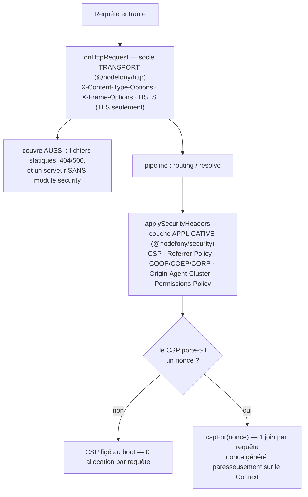

# En-têtes de sécurité — le contrat passé au navigateur

> Ton serveur ne contrôle pas le navigateur de tes visiteurs — il ne peut que **lui donner des
> ordres**, et ces ordres sont des en-têtes HTTP. Une douzaine de lignes ferment des classes
> entières d'attaques : XSS, clickjacking, sniffing MIME, fuite d'URL, downgrade HTTPS. Nodefony
> les pose en **deux couches, une seule autorité par en-tête** : le socle **transport**
> (`@nodefony/http`, dès l'entrée brute — couvre aussi les fichiers statiques et les erreurs) et la
> couche **applicative** (`@nodefony/security`, dans le pipeline — CSP, Referrer-Policy, isolation
> cross-origin). Ancré sur `SecurityHeaders` (`securityHeaders.ts:42`) et
> `Firewall.applySecurityHeaders()` (`firewall.ts:1029`).

📍 [Documentation](../../../../../docs/index.md) › [Sécurité](index.md) › **En-têtes de sécurité**

## 🧠 Le modèle mental — deux couches, deux moments

Un en-tête de sécurité n'a de valeur que s'il est **sur toutes les réponses**. Le piège classique
n'est pas d'en oublier un : c'est de le poser **de façon inégale** — présent sur les routes de
contrôleur, absent sur un fichier statique ou une page d'erreur 404, c'est-à-dire exactement là où
un attaquant dépose son contenu.

D'où le découpage : ce qui doit couvrir **tout ce qui sort du process** est posé au plus tôt ; ce
qui dépend de la **réponse applicative** (le CSP, qui doit connaître le nonce et la route) est posé
après le routage.



**Une seule source par en-tête** : `@nodefony/security` ne ré-émet **jamais** les trois en-têtes
transport — c'est écrit noir sur blanc dans le contrat de la couche applicative
(`ISecurityHeadersOptions`, `securityHeaders.ts:12`). Pas de double émission, donc pas de valeurs
contradictoires sur la même réponse.

## 📖 Lexique

| Terme              | Développé — et ce que ça veut dire                                                                                                 |
| ------------------ | ---------------------------------------------------------------------------------------------------------------------------------- |
| CSP                | _Content-Security-Policy_ : liste blanche des sources autorisées (scripts, styles, images…). Première barrière anti-XSS.           |
| XSS                | _Cross-Site Scripting_ : un attaquant fait exécuter **son** JavaScript dans la page de ta victime, avec ses cookies.               |
| Nonce              | _number used once_ : jeton aléatoire régénéré à **chaque requête**, qui autorise un `<script>` inline **précis** et lui seul.      |
| Clickjacking       | Ton site est chargé en `<iframe>` transparente au-dessus d'un piège : la victime croit cliquer ailleurs, elle clique chez toi.     |
| MIME sniffing      | Le navigateur ignore le `Content-Type` et **devine** le type d'un fichier — un `.txt` uploadé peut finir exécuté comme script.     |
| HSTS               | _HTTP Strict-Transport-Security_ (RFC 6797) : le navigateur mémorise « ce domaine, c'est HTTPS uniquement ».                       |
| Referrer           | En-tête que le navigateur envoie au site suivant pour dire d'où l'on vient — donc une **fuite d'URL** potentielle.                 |
| COOP / COEP / CORP | _Cross-Origin **Opener** / **Embedder** / **Resource** Policy_ : trois verrous d'isolation entre origines (Spectre, vol d'assets). |
| OAC                | _Origin-Agent-Cluster_ : demande au navigateur d'isoler l'origine dans son propre processus/heap.                                  |
| Permissions-Policy | Coupe l'accès aux API sensibles du navigateur (caméra, micro, géolocalisation) pour la page **et ses iframes**.                    |
| Fragment CSP       | Directives additionnelles déclarées par un module (`directive → sources`), fusionnées dans le CSP de base.                         |
| Downgrade          | Un attaquant réseau force la connexion en HTTP clair pour la lire ou la modifier.                                                  |

## Qu'est-ce que c'est ? — un panneau d'instructions collé sur chaque réponse

Imagine que tu envoies un colis. Le contenu, c'est ton HTML. Les en-têtes de sécurité, c'est
l'**étiquette** collée dessus : « ne pas ouvrir avec un autre outil que celui-ci », « ne pas
transporter dans un autre camion », « interdiction de recopier l'adresse de l'expéditeur ». Le
transporteur — le navigateur — les respecte. Sans étiquette, il improvise, et improviser c'est
exactement ce qu'un attaquant attend.

Chaque en-tête ferme **une** faille concrète :

- **CSP** — un attaquant réussit à injecter `<script src="https://evil.tld/x.js">` dans un
  commentaire de ton site ; sans CSP, le navigateur l'exécute avec la session de la victime.
- **X-Frame-Options / `frame-ancestors`** — un site pirate charge ta page « Supprimer mon compte »
  en iframe invisible sous un bouton « Jouer » : la victime clique, c'est chez toi que ça s'applique.
- **`nosniff`** — un avatar téléversé est en réalité du JavaScript ; un navigateur « serviable »
  devine le type et l'exécute **sur ton origine**, donc avec tes cookies.
- **Referrer-Policy** — un clic vers l'extérieur transmet ton URL interne complète
  (`/admin/facture/8123?client=ACME`) dans le `Referer` du site suivant.
- **HSTS** — sur un Wi-Fi public, la première requête part en clair et peut être interceptée puis
  maintenue en HTTP ; HSTS mémorisé force le HTTPS **avant** toute émission.
- **COOP / COEP / CORP** — isolent ton document des autres origines (fenêtres ouvrantes, ressources
  embarquées) : réponse aux canaux auxiliaires type Spectre et au vol d'assets par inclusion.

Le détail de chaque en-tête — menace, valeur par défaut, compromis — est dans le catalogue plus bas.

## La vision Nodefony — pré-calculé au boot, quasi gratuit par requête

Un framework qui recalcule ses en-têtes à chaque requête paie ce confort en allocations. Nodefony
fait l'inverse : **tout ce qui est constant est calculé une fois au démarrage**.

- `SecurityHeaders` (`securityHeaders.ts:42`) construit **au boot** la table des en-têtes constants
  (Referrer-Policy, COOP/COEP/CORP, Origin-Agent-Cluster, Permissions-Policy, et le CSP quand il est
  statique) et la **gèle** avec `Object.freeze` (`securityHeaders.ts:77`). Par requête, le firewall
  se contente de la parcourir et de la poser : zéro concaténation, zéro objet créé.
- Côté transport, même principe : `HttpKernel.computeSecurityHeaderCaches()`
  (`http-kernel.ts:330`) précalcule la chaîne HSTS (`max-age`, `includeSubDomains`, `preload`) au
  boot ; `onHttpRequest` (`http-kernel.ts:819`) ne fait plus que trois `setHeader`.
- Le seul coût variable est le **nonce CSP**, et il est **paresseux** : `Context.cspNonce`
  (`Context.ts:192`) ne génère ses 128 bits (`randomBytes(16)` en base64) qu'à la première lecture,
  puis mémoïse. Une réponse qui n'a aucun script inline à signer ne paie aucun appel crypto.

Le second parti pris est la **séparation d'autorité** décrite plus haut : un seul émetteur par
en-tête, donc un comportement prévisible et testable — le banc live vérifie les deux couches sur la
même réponse (`security-headers.test.ts:30`).

> [!IMPORTANT]
> `@nodefony/security` est **optionnel**, pas le socle. Une app Nodefony sans module security émet
> quand même `nosniff`, `X-Frame-Options` et HSTS : c'est du _secure-by-default_. Ce que tu perds
> sans security, c'est le CSP, la Referrer-Policy et l'isolation cross-origin.

## 🚀 Démarrage rapide

Point de départ : une app générée par `nodefony create app`. Les en-têtes sont **déjà actifs** — ce
que tu écris ci-dessous, ce sont tes **écarts** au défaut.

### 1. Déclarer la politique dans `nodefony.config.ts`

```typescript
// nodefony.config.ts — l'app n'écrit QUE ses écarts ; le reste prend le défaut du framework.
import { defineConfig, use } from "nodefony";

export default defineConfig(() => ({
  modules: [
    "@nodefony/http",
    "@nodefony/framework",
    use("@nodefony/security", {
      headers: {
        // `{{nonce}}` est substitué par un jeton FRAIS à chaque requête (cf plus bas).
        csp:
          "default-src 'self'; script-src 'self' 'nonce-{{nonce}}'; " +
          "style-src 'self' 'unsafe-inline'; img-src 'self' data:; " +
          "object-src 'none'; base-uri 'self'; form-action 'self'",
        cspNonces: true,
        // Ne fuiter que l'origine, et rien vers un site en clair.
        referrerPolicy: "strict-origin-when-cross-origin",
        // Isolation cross-origin : ABSENTE par défaut, on l'active explicitement.
        coop: "same-origin",
        corp: "same-origin",
        permissionsPolicy: "camera=(), microphone=(), geolocation=()",
      },
    }),
  ],
}));
```

Les clés sont **typées et auto-complétées** : le module augmente le registre `NodefonyModuleConfig`
du core (`index.ts:28`), donc `use("@nodefony/security", …)` propose les clés **et** les valeurs
d'enum (`referrerPolicy`, `coop`, `corp`…). Une valeur hors enum casse le boot, pas la production.

### 2. Ce qu'on observe

```bash
# Route applicative : socle transport + couche applicative, sur la MÊME réponse.
curl -sI http://localhost:5151/nodefony/test/index

# HTTP/1.1 200 OK
# X-Content-Type-Options: nosniff              ← transport (@nodefony/http)
# X-Frame-Options: DENY                        ← transport (@nodefony/http)
# Content-Security-Policy: default-src 'self'; script-src 'self' 'nonce-vZ9…'; …
# Referrer-Policy: strict-origin-when-cross-origin
# Cross-Origin-Opener-Policy: same-origin
# Cross-Origin-Resource-Policy: same-origin
# Permissions-Policy: camera=(), microphone=(), geolocation=()
```

```bash
# Le nonce change à CHAQUE requête — deux appels, deux jetons.
curl -sI http://localhost:5151/nodefony/test/index | grep -o "nonce-[^']*"
curl -sI http://localhost:5151/nodefony/test/index | grep -o "nonce-[^']*"
# nonce-2Qk1r0h8…      (≠)
# nonce-Xa7pLd3f…

# Une URL inexistante : le socle transport est TOUJOURS là (l'applicatif ne s'exécute pas).
curl -sI http://localhost:5151/nodefony/test/__inexistant__ | grep -i x-content-type
# X-Content-Type-Options: nosniff
```

### 3. Un besoin ponctuel : élargir le CSP d'UNE route

Tu dois embarquer une iframe YouTube sur une seule page. Élargir le CSP global serait une faute :
tu ouvrirais l'ensemble du site. `@Csp` déclare l'écart **à l'échelle de l'action**.

```typescript
// nodefony/controllers/EmbedController.ts — complet, compile tel quel.
import { controller, Controller, Get, Csp } from "@nodefony/framework";

@controller("/embed")
class EmbedController extends Controller {
  // `frame-src` n'existe QUE sur cette route ; le reste du site garde le CSP strict.
  @Csp({ "frame-src": ["https://www.youtube.com"] })
  @Get("/video")
  video() {
    return this.renderJson({ embed: true });
  }
}

export default EmbedController;
```

```bash
curl -sI http://localhost:5151/embed/video | grep -i content-security-policy
# … ; frame-src https://www.youtube.com      ← ajouté ICI seulement
curl -sI http://localhost:5151/nodefony/test/index | grep -c youtube
# 0                                          ← isolation prouvée (security-headers.test.ts:83)
```

## 🛡️ Le catalogue des en-têtes

Choisir en cinq secondes — puis le détail dans les cartes.

| En-tête                        | Ce qu'il bloque                      | Défaut Nodefony                            | Qui l'émet          |
| ------------------------------ | ------------------------------------ | ------------------------------------------ | ------------------- |
| `Content-Security-Policy`      | XSS, injection de source             | politique « secure-but-usable » + nonce    | security (pipeline) |
| `X-Frame-Options`              | Clickjacking                         | `DENY`                                     | http (transport)    |
| `X-Content-Type-Options`       | MIME sniffing                        | `nosniff`                                  | http (transport)    |
| `Strict-Transport-Security`    | Downgrade HTTPS → HTTP               | `max-age=31536000; includeSubDomains`, TLS | http (transport)    |
| `Referrer-Policy`              | Fuite d'URL vers des tiers           | `no-referrer`                              | security (pipeline) |
| `Cross-Origin-Opener-Policy`   | Attaques par fenêtre ouvrante        | **absent** (opt-in)                        | security (pipeline) |
| `Cross-Origin-Embedder-Policy` | Chargement de ressources non signées | **absent** (opt-in)                        | security (pipeline) |
| `Cross-Origin-Resource-Policy` | Inclusion de tes assets par un tiers | **absent** (opt-in)                        | security (pipeline) |
| `Origin-Agent-Cluster`         | Partage de heap entre origines       | **absent** (opt-in)                        | security (pipeline) |
| `Permissions-Policy`           | Accès caméra/micro/géoloc            | **absent** (opt-in)                        | security (pipeline) |

### `Content-Security-Policy` — la liste blanche des sources

**La menace** : n'importe quelle entrée non échappée (commentaire, nom d'utilisateur, paramètre
réfléchi) devient un vecteur d'exécution de code. Le CSP est le filet quand l'échappement a raté.

**Le défaut Nodefony** est délibérément « secure-but-usable » (`config.ts:218`) : seul `script-src`
est **strict** — `'self'` plus le nonce de la requête, ce qui est la vraie défense XSS. Le reste
couvre les besoins réels d'une app moderne (CSS-in-JS via `style-src 'unsafe-inline'`, images
`data:`/`blob:`, workers, fetch/WS same-origin) et ajoute les durcissements gratuits :
`object-src 'none'`, `base-uri 'self'`, `form-action 'self'`.

**Pourquoi ce compromis** : un CSP qui casse l'application est désactivé par le premier développeur
pressé. Un CSP strict là où ça compte (`script-src`) et permissif là où ça ne coûte rien (styles,
images) survit en production — c'est celui-là qui protège vraiment.

Le CSP couvre aussi le clickjacking, via `frame-ancestors`, plus finement que `X-Frame-Options`
(liste d'origines plutôt que tout-ou-rien). Les deux cohabitent : les navigateurs modernes
privilégient `frame-ancestors`, `X-Frame-Options` reste le filet pour les anciens.

### `X-Frame-Options` — non, tu ne m'encadres pas

**La menace** : le clickjacking. Ta page est superposée, invisible, à une page appât ; le clic de la
victime est capté par ton interface.

Posé par le **transport** depuis un cache calculé au boot — `secFrameOptions`
(`http-kernel.ts:270`) — et configuré côté `@nodefony/http` avec `frameOptions`
(`http/nodefony/config/config.ts:121`), qui vaut `DENY` par défaut. `SAMEORIGIN` si ton propre site
s'auto-encadre. C'est un des trois en-têtes que security **ne ré-émet pas** : il doit valoir aussi
pour un HTML statique servi directement depuis `public/`.

### `X-Content-Type-Options` — arrête de deviner

**La menace** : le MIME sniffing. Un fichier téléversé, servi avec un `Content-Type` imprécis, est
« deviné » par le navigateur — et un fichier deviné exécutable s'exécute sur **ton** origine, donc
avec tes cookies.

Valeur unique reconnue : `nosniff`, posée depuis le cache `secContentTypeOptions`
(`http-kernel.ts:834`). C'est **l'en-tête qui justifie le mieux la couche transport** : le danger
vient précisément des fichiers servis hors pipeline applicatif — un banc live le prouve sur une 404
(`security-headers.test.ts:38`).

### `Strict-Transport-Security` — HTTPS, et rien d'autre

**La menace** : le downgrade. Sur un réseau hostile, la toute première requête en clair suffit à
installer un intercepteur.

La chaîne est assemblée au boot par `HttpKernel.computeSecurityHeaderCaches()`
(`http-kernel.ts:330`) : `max-age`, puis `includeSubDomains` et `preload` selon la config.

Elle n'est posée que **sur une réponse HTTPS ou HTTP/2** — le cache `secHsts` est conditionné au type
de serveur (`http-kernel.ts:839`). C'est conforme à la RFC 6797, qui veut qu'un HSTS reçu en clair
soit ignoré : l'émettre sur du HTTP simple ne ferait que polluer. Défaut : un an, sous-domaines
inclus.

> [!CAUTION]
> `preload: true` (`http/nodefony/config/config.ts:92`) inscrit ton domaine dans la liste
> pré-chargée des navigateurs. C'est un **engagement quasi irréversible** : tout sous-domaine
> incapable de servir en HTTPS devient inaccessible, et la sortie de liste prend des mois. À ne
> jamais activer « pour voir ».

### `Referrer-Policy` — ne raconte pas d'où tu viens

**La menace** : la fuite d'URL. Chemins parlants, identifiants de session dans une query, jetons de
réinitialisation — tout part chez le site suivant via le `Referer`.

Défaut Nodefony : `no-referrer` (`config.ts:239`), la valeur la plus stricte. La valeur est un
**enum W3C fermé** — huit valeurs validées au boot, donc pas de faute de frappe qui passerait en
silence (l'écriture libre `no-refferer` casserait la protection sans prévenir).

Le choix usuel pour un site public reste `strict-origin-when-cross-origin` : URL complète en
interne, origine seule vers l'extérieur, rien du tout vers du HTTP en clair.

### `Cross-Origin-Opener-Policy` — coupe le lien avec la fenêtre ouvrante

**La menace** : une page ouverte par la tienne (ou qui t'a ouverte) garde une référence
`window.opener` et partage un groupe de contexte de navigation — surface d'attaque pour du
_tabnabbing_ et pour les canaux auxiliaires type Spectre.

`same-origin` (`securityHeaders.ts:71`) rompt ce lien. C'est aussi, avec COEP, l'une des deux
conditions de l'**isolation cross-origin**, indispensable si tu veux `SharedArrayBuffer` ou des
timers haute résolution.

### `Cross-Origin-Embedder-Policy` — je n'embarque que du consenti

**La menace** : ta page embarque des ressources tierces qui n'ont jamais donné leur accord, et les
place dans ton processus.

`require-corp` (`securityHeaders.ts:72`) exige que **chaque** ressource tierce s'annonce comme
partageable (CORP ou CORS). C'est le complément de COOP pour l'isolation complète.

> [!WARNING]
> `coep: "require-corp"` **casse toutes les ressources tierces non conformes** — polices Google,
> images de CDN, iframes de paiement. C'est pour cette raison qu'il est absent des défauts, et
> volontairement exclu du banc de test (`security-headers.test.ts:62`). À activer seulement si tu
> as besoin de l'isolation cross-origin, et après audit de tes assets.

### `Cross-Origin-Resource-Policy` — mes assets ne s'incluent pas ailleurs

**La menace** : symétrique du précédent. Un site tiers inclut tes images ou tes scripts pour les
mesurer, les mettre en cache, ou monter une attaque par inclusion.

`same-origin` (`securityHeaders.ts:73`) interdit toute inclusion externe ; `same-site` autorise tes
propres sous-domaines ; `cross-origin` ouvre — c'est ce qu'il faut sur une CDN publique assumée.

### `Origin-Agent-Cluster` — un bac à sable par origine

**La menace** : plusieurs origines partageant heap et processus, donc des canaux auxiliaires
mesurables.

Nodefony l'émet comme un **booléen de champ structuré** RFC 8941 : la valeur est littéralement `?1`
(`securityHeaders.ts:75`). C'est une **demande**, pas une garantie — le navigateur décide.

### `Permissions-Policy` — coupe le micro par défaut

**La menace** : une iframe tierce (widget, publicité) demande la caméra, le micro ou la position, et
la boîte de dialogue s'affiche sous **ton** nom de domaine.

Valeur libre — le champ `permissionsPolicy` est recopié tel quel (`securityHeaders.ts:76`),
typiquement `camera=(), microphone=(), geolocation=()` : la
liste vide signifie « personne, pas même moi ». Absent par défaut car la liste des fonctionnalités
dépend entièrement de l'application.

## ⚙️ Configuration — deux sections, deux modules

Réflexe à acquérir : **le nom du module dit qui pose l'en-tête**. Chercher `frameOptions` dans la
config security est la première source de confusion sur ce sujet.

### Couche applicative — `use("@nodefony/security", { headers })`

Dérivé du schéma Zod `headersSchema` (`config.ts:194`).

<!-- prettier-ignore -->
| Option | Type | Défaut | Effet |
| --- | --- | --- | --- |
| `enabled` | booléen | `true` | Coupe toute la couche applicative. |
| `csp` | chaîne | politique « secure-but-usable » | Valeur de `Content-Security-Policy`. |
| `cspNonces` | booléen | `true` | Active la substitution de `{{nonce}}` par requête. |
| `referrerPolicy` | enum W3C (8 valeurs) | `no-referrer` | Valeur de `Referrer-Policy`. |
| `coop` | enum, optionnel | absent | `Cross-Origin-Opener-Policy`. |
| `coep` | enum, optionnel | absent | `Cross-Origin-Embedder-Policy`. |
| `corp` | enum, optionnel | absent | `Cross-Origin-Resource-Policy`. |
| `originAgentCluster` | booléen, optionnel | absent | Émet `Origin-Agent-Cluster: ?1`. |
| `permissionsPolicy` | chaîne, optionnelle | absent | Valeur de `Permissions-Policy`. |

### Socle transport — `use("@nodefony/http", { securityHeaders })`

Dérivé de `securityHeadersSchema` (`http/nodefony/config/config.ts:108`). Ces trois réglages sont
**éditables à chaud** (`runtimeMutable`) : `HttpKernel.onConfigChanged()` (`http-kernel.ts:290`)
recalcule les caches, donc la valeur suivante s'applique sans redémarrage.

| Option                                      | Type              | Défaut     | Effet                                                              |
| ------------------------------------------- | ----------------- | ---------- | ------------------------------------------------------------------ |
| `contentTypeOptions`                        | chaîne ou `null`  | `nosniff`  | `X-Content-Type-Options` ; `null` = ne pas émettre.                |
| `frameOptions`                              | chaîne ou `null`  | `DENY`     | `X-Frame-Options` ; `SAMEORIGIN` si auto-encadrement.              |
| `strictTransportSecurity`                   | objet ou `null`   | activé     | `null` = pas de HSTS du tout.                                      |
| `strictTransportSecurity.maxAge`            | entier (secondes) | `31536000` | Durée mémorisée par le navigateur (un an, recommandé OWASP).       |
| `strictTransportSecurity.includeSubDomains` | booléen           | `true`     | Étend la contrainte à tous les sous-domaines.                      |
| `strictTransportSecurity.preload`           | booléen           | `false`    | Inscription à la liste pré-chargée — **irréversible en pratique**. |

> [!WARNING]
> Les clés `hsts`, `hstsMaxAgeS`, `frameguard` et `noSniff` **existent** dans la config security
> (`config.ts:200`, `config.ts:227`, `config.ts:233`) mais **ne pilotent rien** : la couche
> applicative ne les lit pas (`securityHeaders.ts:6`), elles ne servent qu'à l'introspection
> affichée dans Studio. Pour changer réellement `X-Frame-Options`, c'est `securityHeaders.frameOptions`
> **du module http**. Même remarque pour `hidePoweredBy` (`config.ts:254`) : Nodefony n'émet aucun
> `X-Powered-By`, l'option est un no-op documenté.

## 🏗️ Le CSP en détail — deux régimes, trois façons de l'étendre

### Régime 1 — CSP statique (0 allocation par requête)

Si le CSP ne contient pas `{{nonce}}`, ou si `cspNonces` est à `false`, la chaîne est rangée telle
quelle dans la table gelée du boot (`securityHeaders.ts:66`). Par requête : une lecture, un
`setHeader`. Rien d'autre.

Détail de robustesse : si tu désactives `cspNonces` en laissant le placeholder dans la chaîne, le
token résiduel `'nonce-{{nonce}}'` est **purgé** (`securityHeaders.ts:63`). Sans ça, tu servirais un
CSP contenant un nonce littéral jamais émis — donc un `script-src` qui bloque **tout**, y compris tes
propres scripts. Le code refuse de produire un CSP cassé.

### Régime 2 — nonce par requête (la vraie défense anti-XSS)

Un nonce autorise **l'inline que tu as toi-même rendu**, et lui seul. Un script injecté par un
attaquant ne peut pas deviner la valeur : il est refusé même s'il est syntaxiquement identique.

Le chemin complet, sans surprise :

1. **Au boot**, la chaîne CSP est **pré-découpée** autour de `{{nonce}}` (`securityHeaders.ts:58`).
   Aucun parsing ni regex n'aura lieu pendant une requête.
2. **Par requête**, `Firewall.applySecurityHeaders()` (`firewall.ts:835`) lit `context.cspNonce` —
   ce qui **génère** le jeton à cet instant (`Context.ts:192`) — puis appelle
   `SecurityHeaders.cspFor()` (`securityHeaders.ts:100`) : un seul `join`.
3. **Dans la vue**, le contrôleur relit `context.cspNonce`, qui est **mémoïsé** : l'en-tête et le
   `<script nonce="…">` portent forcément la même valeur. C'est le motif employé par le contrôleur
   de Studio (`StudioController.ts:62`).

`SecurityHeaders.hasNonce` (`securityHeaders.ts:88`) est le drapeau qui décide du régime : à `false`,
pas une seule opération crypto. Il n'y a **aucun setter** pour `cspNonce` : un jeton serveur doit
rester imprévisible, jamais pilotable par le client — contrairement au `requestId`, qui, lui, accepte
une corrélation entrante.

**Placement dans le pipeline** : `applySecurityHeaders` est appelé **après le resolve** et **avant**
le repli statique et le `writeHead` (`http-kernel.ts:1193`). Cet ordre n'est pas cosmétique : il
faut que le routeur ait posé les directives `@Csp` de la route pour pouvoir les fusionner, et il faut
être avant l'écriture des en-têtes pour pouvoir en poser.

### Étendre le CSP — trois portées, une seule mécanique

| Portée             | Outil                           | Pour quoi                                       | Recalculé           |
| ------------------ | ------------------------------- | ----------------------------------------------- | ------------------- |
| Application        | `headers.csp` en config         | ta politique de base                            | au boot             |
| Module             | `Firewall.registerCspOrigins()` | besoin **permanent** d'un module (ex. Vite)     | à l'enregistrement  |
| Route / contrôleur | `@Csp({ … })`                   | besoin **ponctuel** d'une réponse (iframe, CDN) | par requête décorée |

Les trois convergent vers `mergeCspFragments()` (`csp.ts:56`), et c'est un **merge structuré**, pas
une concaténation. Pourquoi c'est vital : en CSP, une directive **répétée est ignorée** après sa
première occurrence (W3C CSP Level 3 §3, rationnel documenté `csp.ts:8`). Concaténer
`"script-src 'self'"` et `"script-src https://cdn"` produirait un en-tête où la seconde est purement
et simplement jetée — une extension silencieusement sans effet, le pire des deux mondes.

Le merge fusionne donc les sources **dans une seule directive**, dédoublonnées, base d'abord ; une
directive absente est ajoutée en fin. La fonction est **pure et déterministe** (`parseCsp()`
`csp.ts:25` → `serializeCsp()` `csp.ts:34`), ce qui rend l'en-tête stable d'une requête à l'autre et
les tests fiables.

**Coût** : le merge d'un module est payé **une fois**, au (dés)enregistrement
(`Firewall.#rebuildSecurityHeaders()`, `firewall.ts:1085`), jamais par requête. Le merge d'une route
`@Csp` est payé **uniquement sur les routes décorées** (`SecurityHeaders.cspForExtra()`,
`securityHeaders.ts:115`) ; le cas courant reste le simple `join`.

## 🧩 Extension — déclarer un fragment CSP depuis son module

Un module qui a besoin d'origines supplémentaires ne doit **jamais** poser l'en-tête lui-même : il en
émettrait un second, et le navigateur applique alors l'intersection la plus stricte — au mieux
inefficace, au pire il casse la page. Il **déclare** son besoin, security fusionne.

```typescript
// Dans le service d'un module — le firewall est résolu PAR NOM (aucun import de security).
const firewall = this.container?.get?.("firewall") as
  | { registerCspOrigins?(m: string, f: Record<string, string[]>): void }
  | undefined;

firewall?.registerCspOrigins?.("mon-module", {
  "connect-src": ["https://api.partenaire.tld"],
  "img-src": ["https://cdn.partenaire.tld"],
});
```

Trois propriétés à retenir :

- **Aucun couplage** : la résolution par nom de service évite un cycle de dépendances, et
  `registerCspOrigins` est optionnel — un module fonctionne dans une app **sans** security.
- **Réversible** : `Firewall.unregisterCspOrigins()` (`firewall.ts:1074`) retire le fragment et
  reconstruit le CSP de base. C'est ce que fait `@nodefony/frontend` à l'arrêt du serveur Vite.
- **Idempotent** : la reconstruction repart **toujours** du `headers.csp` d'origine
  (`firewall.ts:1088`), jamais d'un CSP déjà fusionné — pas d'accumulation entre deux
  enregistrements.

L'exemple de référence vit dans le framework : en développement, `@nodefony/frontend` déclare les
origines du serveur Vite et `'unsafe-eval'` (exigé par le Fast Refresh de React) via
`FrontendService.#viteCspFragment()` (`FrontendService.ts:909`) — ce qui explique qu'un CSP observé
en dev soit plus large qu'en production, où ce fragment n'existe pas.

## 📜 Normes appliquées

| Domaine                              | Norme                            | Ancrage dans le code                                         |
| ------------------------------------ | -------------------------------- | ------------------------------------------------------------ |
| Politique de sécurité du contenu     | W3C CSP Level 3                  | `mergeCspFragments()` (`csp.ts:56`), directive non dupliquée |
| Nonce CSP (unicité, imprévisibilité) | W3C CSP Level 3 §6.7.4           | `Context.cspNonce` — 128 bits CSPRNG (`Context.ts:193`)      |
| HSTS                                 | RFC 6797                         | posé sur TLS uniquement (`http-kernel.ts:839`)               |
| Champ structuré booléen              | RFC 8941                         | `Origin-Agent-Cluster: ?1` (`securityHeaders.ts:75`)         |
| Referrer-Policy                      | W3C Referrer Policy (enum fermé) | 8 valeurs validées au boot (`config.ts:239`)                 |
| Isolation cross-origin               | WHATWG HTML (COOP/COEP/CORP)     | `securityHeaders.ts:71`                                      |
| Anti-MIME-sniffing                   | WHATWG Fetch (`nosniff`)         | `secContentTypeOptions` (`http-kernel.ts:834`)               |
| Durcissement en-têtes                | OWASP Secure Headers             | `computeSecurityHeaderCaches()` (`http-kernel.ts:330`)       |

## ⚡ Performance & mémoire

Le coût est concentré au boot, par construction :

- **En-têtes constants** : une seule table, gelée (`securityHeaders.ts:77`). Par requête, une boucle
  `for…in` sur un objet de 1 à 6 entrées et autant de `setHeader`. Aucune allocation.
- **CSP statique** : rien de plus — la chaîne est dans la table.
- **CSP à nonce** : `randomBytes(16)` plus un `join` par requête. C'est le seul coût variable, et il
  n'existe **que** si le CSP porte un placeholder : `hasNonce` (`securityHeaders.ts:88`)
  court-circuite entièrement ce chemin sinon. La paresse de `Context.cspNonce` (`Context.ts:192`)
  protège en plus les chemins internes qui n'atteignent jamais le firewall.
- **Merge CSP** : jamais dans le chemin chaud. Le fragment d'un module est fusionné à
  l'enregistrement (`firewall.ts:891`) ; celui d'une route ne coûte que sur les routes `@Csp`.
- **Socle transport** : trois `setHeader` sur des chaînes précalculées (`http-kernel.ts:833`), avec
  un test `!== null` qui annule le coût des en-têtes désactivés.

Le module n'attache aucun écouteur d'événement et ne conserve aucun état par requête : il n'entre pas
dans le périmètre du gate mémoire, qu'il ne peut structurellement pas dégrader.

## 📡 Observabilité — Studio

L'écran **Firewall** de Studio affiche la section « En-têtes de sécurité » — pilotée par
`headers.enabled` (`FirewallDefenses.tsx:219`) — avec le CSP effectif, l'état du nonce par requête, la
Referrer-Policy et les valeurs d'isolation. Les données
viennent de `Firewall.describe()` (`firewall.ts:505`), qui projette la config **sans aucun secret**,
exposée par `GET /nodefony/security/api/firewall`.

L'onglet **Configuration** de Studio rend les mêmes options depuis le schéma Zod — chaque champ y
porte sa description, ce qui en fait la référence toujours à jour des défauts.

> [!NOTE]
> La ligne « frameguard » de cet écran reflète la **config security**, pas la valeur réellement émise
> par le transport. La source de vérité pour `X-Frame-Options`, c'est la réponse HTTP elle-même :
> `curl -I` tranche en une seconde.

## ⚠️ Pièges (symptôme → cause → correction)

| Symptôme                                                 | Cause dans le code                                                          | Correction                                                                      |
| -------------------------------------------------------- | --------------------------------------------------------------------------- | ------------------------------------------------------------------------------- |
| `frameguard: "sameorigin"` en config security sans effet | Clé **inerte** — non lue par la couche applicative (`securityHeaders.ts:6`) | Régler `securityHeaders.frameOptions` du module **http**                        |
| `<script>` inline bloqué                                 | Le template ne reprend pas le nonce                                         | Rendre `<script nonce="…">` depuis `context.cspNonce`                           |
| CSP contenant `'nonce-{{nonce}}'` littéral               | `cspNonces` désactivé, placeholder laissé                                   | Nodefony purge le résiduel (`securityHeaders.ts:63`) ; retirer le placeholder   |
| Une extension `script-src` de module sans effet          | Second en-tête / directive dupliquée (ignorée, W3C CSP3 §3)                 | Déclarer un fragment via `registerCspOrigins()`, jamais un `setHeader`          |
| Assets tiers cassés après activation de l'isolation      | `coep: "require-corp"` exige CORP/CORS sur **chaque** ressource             | Retirer `coep` ou faire annoncer les ressources                                 |
| HSTS absent en développement                             | Posé sur TLS uniquement (`http-kernel.ts:839`)                              | Comportement conforme RFC 6797 — vérifier sur le port HTTPS                     |
| Le CSP est plus large en dev qu'en prod                  | `@nodefony/frontend` déclare les origines Vite (`FrontendService.ts:695`)   | Attendu : le fragment n'existe pas en production                                |
| Aucun en-tête applicatif                                 | Module security absent ou `headers.enabled: false`                          | Le socle transport reste actif ; réactiver security pour CSP/Referrer/isolation |
| Domaine injoignable après activation de `preload`        | Inscription à la liste pré-chargée, sortie très lente                       | Ne jamais activer sans plan HTTPS sur **tous** les sous-domaines                |

## 🧪 Tests & couverture

Trois familles couvrent la brique — les compteurs exacts vivent dans la carte de l'aperçu, régénérée
depuis vitest :

- **Unitaires** (`@nodefony/security`) — `securityHeaders.test` : la table figée, la séparation
  transport/applicatif prouvée par l'absence des trois en-têtes transport, les avancés opt-in, les
  deux régimes CSP, la purge du résiduel, et `cspForExtra` (fusion, ajout, substitution du nonce) ;
  `csp.test` : parse, merge et sérialisation des fragments.
- **Intégration sur serveur réel** (`@nodefony/http`, port 5151) — `security-headers.test` vérifie les
  deux couches sur une **vraie** réponse. Quatre invariants y sont prouvés :
  - le socle transport survit à une 404, avec `x-content-type-options` sur une route inexistante
    (`security-headers.test.ts:38`) ;
  - le CSP applicatif complète cette réponse avec `content-security-policy`
    (`security-headers.test.ts:43`) ;
  - une route décorée voit sa directive `frame-src` fusionnée, sans dupliquer `img-src`
    (`security-headers.test.ts:73`) ;
  - deux requêtes concurrentes reçoivent deux nonces différents (`security-headers.test.ts:100`).

  `headers.test` et `security.test` couvrent le reste du contrat d'en-têtes.

- **Absent, assumé** : pas de banc d'**attaque** dédié à cette brique (contrairement à CSRF, CORS ou
  l'autorisation, qui ont leur `*.attack.test.ts`), et pas de test de **charge** propre — le coût est
  structurellement nul par requête, et le pipeline complet est déjà couvert par le gate mémoire de
  `@nodefony/http`.

Couverture : `npm run coverage` dans `@nodefony/security`. Revue de sécurité d'un diff touchant cette
brique : skill `nodefony-security-review`.

## 🔗 Pour aller plus loin

- ⬆️ **Retour au hub** : [Sécurité — vue d'ensemble](index.md) · [Toute la documentation](../../../../../docs/index.md)
- 🧭 **Pages sœurs** : [CORS](cors.md) · [CSRF](csrf.md)

- Le pare-feu qui pose la couche applicative → [firewall](./firewall.md)
- CORS, l'autre famille d'en-têtes (`Access-Control-*`) → [cors](./cors.md)
- CSRF, la défense complémentaire contre les requêtes forcées → [csrf](./csrf.md)
- Vue d'ensemble du module → [index](./index.md)
- Où les deux couches s'insèrent dans le pipeline → [pipeline-requete](../../../../../docs/architecture/pipeline-requete.md)
