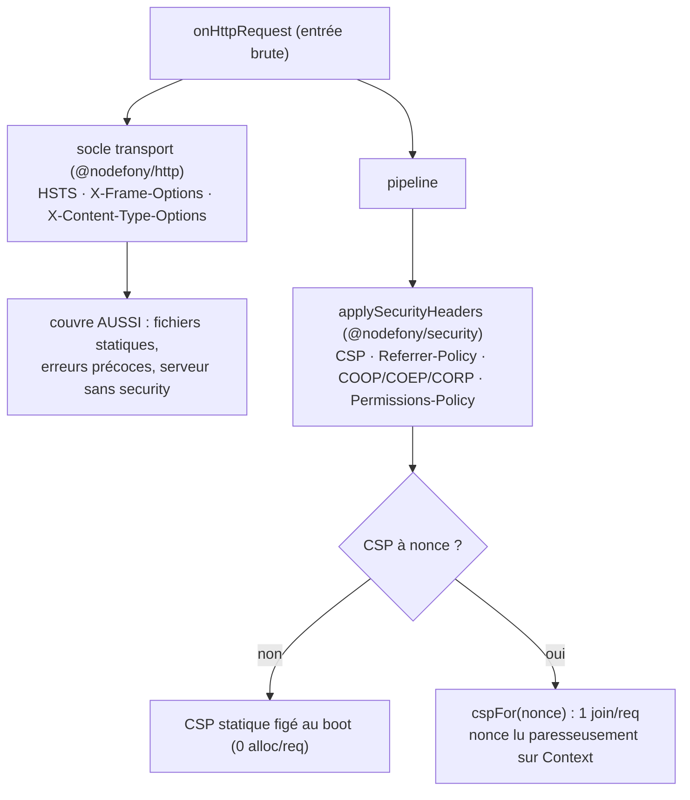

# En-têtes de sécurité — socle transport + CSP

> Une poignée d'en-têtes HTTP ferment des classes entières d'attaques (XSS, clickjacking, sniffing MIME,
> fuite de referrer, downgrade HTTP). Nodefony les pose en **deux couches, une autorité par en-tête** :
> le **socle transport** (HSTS, `X-Frame-Options`, `X-Content-Type-Options`) par `@nodefony/http` **dès
> l'entrée brute** — donc _secure-by-default_, même sans module security — et les en-têtes
> **applicatifs** (CSP, Referrer-Policy, isolation cross-origin) par `@nodefony/security`. Ancré sur
> `securityHeaders.ts` et `src/csp.ts`.

## Le modèle mental — deux couches, deux moments

Le principe directeur : **une seule source par en-tête**. Les trois en-têtes transport sont posés à
l'entrée brute (avant le pipeline) pour couvrir _aussi_ les statiques et les erreurs précoces ;
`@nodefony/security` **ne les ré-émet pas** (`securityHeaders.ts:6-10`). Pas de double émission, pas de
conflit de valeurs.

## Lexique

| Terme                    | Sens                                                                                  |
| ------------------------ | ------------------------------------------------------------------------------------- |
| CSP                      | _Content-Security-Policy_ : liste blanche des sources de scripts/styles/… (anti-XSS). |
| Nonce                    | Jeton aléatoire par requête autorisant un `<script nonce>` inline précis.             |
| HSTS                     | _Strict-Transport-Security_ : force le HTTPS (anti-downgrade).                        |
| `X-Frame-Options`        | Interdit l'affichage en iframe (anti-clickjacking).                                   |
| `X-Content-Type-Options` | `nosniff` : le navigateur ne « devine » pas le type MIME.                             |
| COOP/COEP/CORP           | Isolation cross-origin (avancés, opt-in).                                             |
| Fragment CSP             | Directives additionnelles qu'un module déclare (`directive → sources`).               |

## Qu'est-ce que ça résout — les failles fermées

Chaque en-tête neutralise une attaque précise : **CSP** limite d'où viennent les scripts (première
barrière anti-XSS) ; **`X-Frame-Options`** bloque le clickjacking ; **`X-Content-Type-Options: nosniff`**
empêche qu'un fichier uploadé soit interprété comme un script ; **HSTS** empêche un attaquant
réseau de rétrograder la connexion en HTTP ; **Referrer-Policy** évite de fuiter l'URL courante vers des
tiers. Le piège classique n'est pas d'en oublier un — c'est de les poser **de façon incohérente** (une
route les a, une autre non ; les statiques échappent). Nodefony les centralise pour que ça n'arrive pas.

## La vision Nodefony — pré-calcul au boot, coût nul par requête

`SecurityHeaders` (`securityHeaders.ts:42`) **pré-calcule une fois au boot** la table des en-têtes
constants (Referrer-Policy, COOP/COEP/CORP, Origin-Agent-Cluster `?1` en _structured field_ RFC 8941,
Permissions-Policy) — figée par `Object.freeze` (`:77`), posée telle quelle par le firewall → **zéro
alloc, zéro concaténation par requête**. Le socle transport côté http est lui aussi pré-calculé
(`http-kernel.ts:272-275` HSTS, `:834` nosniff, `:837` X-Frame-Options, `:840` HSTS posé).

### CSP : deux régimes mutuellement exclusifs

- **Statique** (défaut) : le CSP est posé tel quel, figé dans la table du boot → 0 alloc/req
  (`securityHeaders.ts:59-66`).
- **Nonce par requête** (`cspNonces` + placeholder `{{nonce}}` dans le CSP) : le CSP est **pré-split au
  boot** autour de `{{nonce}}` (`:58`) ; par requête, `cspFor(nonce)` fait **un seul `join`** — aucun
  parse/regex dans le hot-path (`:100-102`). Le nonce est **base64** (jamais `'`, `;` ni espace) → aucune
  évasion possible du token CSP.

Constat de cohérence du nonce : lire `context.cspNonce` **génère le nonce paresseusement et le mémoïse**
(`firewall.ts:851-859`) → le `Content-Security-Policy` de la réponse et le `<script nonce="X">` rendu par
le contrôleur lisent **la même valeur**. Si le nonce est désactivé, un token résiduel
`'nonce-{{nonce}}'` non substitué (= CSP cassé) est **purgé** (`securityHeaders.ts:63-65`).

### Étendre le CSP — par route et par module

- **Par route** : `@Csp` déclare des directives additionnelles ; `cspForExtra` (`:115`) les fusionne
  dans le CSP de base **uniquement sur les routes décorées** (le cas courant reste `cspFor`, 1 `join`).
- **Par module** : un module (ex. `@nodefony/frontend` en dev : origines Vite + `'unsafe-eval'` pour le
  Fast Refresh) **déclare** un fragment `directive → sources` ; `@nodefony/security` le **merge** sans
  connaître sa sémantique (`registerCspFragment`, `firewall.ts:869-875`).

Pourquoi un **merge structuré** et pas une concaténation (`csp.ts:8-12`) : en CSP, une directive
**répétée est ignorée** après sa 1ʳᵉ occurrence (W3C CSP3 §3) — concaténer deux `script-src` perdrait le
second. `mergeCspFragments` (`csp.ts:56`) fusionne donc les sources dans **une** directive (dédupliquées,
ordre base d'abord ; directive absente ajoutée en fin) et reste **pur + déterministe** (recalculé au
(dé)enregistrement d'un module, jamais par requête).

## Les en-têtes, et qui les pose

| En-tête                                  | Couche                        | Rôle / faille fermée           |
| ---------------------------------------- | ----------------------------- | ------------------------------ |
| `Strict-Transport-Security`              | transport (http)              | Force HTTPS (anti-downgrade)   |
| `X-Frame-Options`                        | transport (http)              | Anti-clickjacking              |
| `X-Content-Type-Options`                 | transport (http)              | `nosniff` (anti-MIME-sniffing) |
| `Content-Security-Policy`                | applicatif (security)         | Anti-XSS (sources autorisées)  |
| `Referrer-Policy`                        | applicatif (security)         | Limite la fuite d'URL          |
| `Cross-Origin-*-Policy` (COOP/COEP/CORP) | applicatif (security, opt-in) | Isolation cross-origin         |
| `Origin-Agent-Cluster`                   | applicatif (security, opt-in) | Isolation d'agent (`?1`)       |
| `Permissions-Policy`                     | applicatif (security, opt-in) | Restreint les API navigateur   |

## Pièges (symptôme → cause → correction)

| Symptôme                                        | Cause (dans le code)                                   | Correction                                                      |
| ----------------------------------------------- | ------------------------------------------------------ | --------------------------------------------------------------- |
| `<script>` inline bloqué par le CSP             | Pas de nonce, ou nonce non repris dans le template     | Activer `cspNonces` + `{{nonce}}` ; rendre `<script nonce="…">` |
| CSP « cassé » avec `'nonce-{{nonce}}'` littéral | `cspNonces` désactivé mais placeholder laissé          | Nodefony purge le résiduel — ou retirer le placeholder          |
| Un `script-src` de module écrasé                | Attendu si on concatène ; ici merge structuré          | Déclarer un fragment CSP (merge, pas de perte)                  |
| Statiques sans en-têtes de sécurité             | (n'arrive pas) : socle transport posé à l'entrée brute | —                                                               |
| HSTS absent en dev                              | Souvent désactivé hors prod (pas de HTTPS local)       | Vérifier `strictTransportSecurity` par environnement            |
| Double `Content-Security-Policy`                | Un module ré-émet l'en-tête                            | Une seule source (security) ; étendre via fragment/@Csp         |

## Tests & couverture

Les en-têtes sont couverts par **47 cas** sur 4 fichiers : `securityHeaders.test` (20, table + régimes
CSP), `csp.test` (9, parse/merge/serialize des fragments), et côté http `headers.test` (8) +
`security-headers.test` (10, le socle transport). Les deux fichiers cœur security sont à **100 %** de
couverture lignes (`securityHeaders.ts`, `csp.ts`). Photo régénérée depuis vitest (`npm run coverage`).

## Pour aller plus loin

- CORS (en-têtes `Access-Control-*`, autre famille) → [cors](./cors.md)
- Le firewall qui applique CSP + nonce par requête → [firewall](./firewall.md)
- Le nonce CSP porté par le contexte → [pipeline-requete](../../../docs/architecture/pipeline-requete.md)
- Vue d'ensemble sécurité → [index](./index.md)
