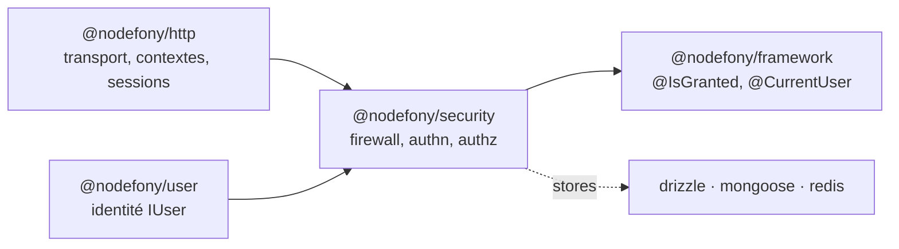

# @nodefony/security — la sécurité de bout en bout

> Le pare-feu applicatif de Nodefony : un modèle par **zones**, des **authenticators** enfichables,
> des **voters** de droits, et les briques qui vont avec (jetons, passkeys, 2FA, OAuth2, CSRF, CORS,
> en-têtes, webhooks, audit). Principe directeur : **Zero Trust** — sur une zone protégée, pas de
> preuve d'identité valide, pas d'accès. Le **même** firewall protège HTTP et WebSocket.

📍 [Documentation](../../../../../docs/index.md) › **Sécurité**

## 🧭 Par où commencer

Quatre parcours selon ce que tu viens faire. L'ordre compte : chaque étape suppose la précédente.

**Je découvre la sécurité Nodefony** — comprendre le modèle avant de configurer quoi que ce soit.

1. [Firewall](firewall.md) — zones, Zero Trust, la chaîne de décision. **Tout part d'ici.**
2. [Authenticators](authenticators.md) — les six façons de prouver **qui** appelle.
3. [Autorisation](authorization.md) — rôles, scopes, voters : **ce qu'il a le droit** de faire.
4. [Jetons](tokens.md) — ce qui matérialise une identité prouvée, et comment on la révoque.

**Je protège une API pour des machines** — scripts, CI, partenaires, agents.

1. [Firewall](firewall.md) — déclarer la zone et ses authenticators.
2. [Clés d'API](api-keys.md) — émettre, faire tourner, révoquer une clé opaque.
3. [Jetons](tokens.md) — le JWT quand la vérification doit rester sans état.
4. [Autorisation](authorization.md) — borner chaque clé par des scopes.

**J'ouvre un login à des humains** — navigateur, comptes, second facteur.

1. [Authenticators](authenticators.md) — la session BFF, et pourquoi le login est **déjà fourni**.
2. [OAuth2](oauth2.md) — « se connecter avec GitHub/Google » et le Shadow User.
3. [WebAuthn / passkeys](webauthn.md) — se connecter sans mot de passe, résistant au phishing.
4. [TOTP](totp.md) — le second facteur classique, et l'élévation de privilège (step-up).

**J'audite avant une mise en production** — la passe qu'on regrette de ne pas avoir faite.

1. [En-têtes de sécurité](headers.md) — CSP, HSTS, COOP/COEP : ce que le navigateur applique pour toi.
2. [CSRF](csrf.md) — empêcher un site tiers d'agir au nom de ton utilisateur.
3. [CORS](cors.md) — qui a le droit de **lire** tes réponses.
4. [Journal d'audit](audit.md) — prouver après coup qui a fait quoi.
5. [Webhooks](webhooks.md) — notifier un système tiers sans se faire piéger (SSRF).

## 🗂️ Les briques du module

Le tableau pour choisir en cinq secondes ; les cards en dessous pour le détail.

| Brique                              | Ce qu'elle résout                             | Tu en as besoin quand…                           |
| ----------------------------------- | --------------------------------------------- | ------------------------------------------------ |
| [Firewall](firewall.md)             | qui passe, qui est bloqué, sur quelles routes | toujours — c'est la fondation                    |
| [Authenticators](authenticators.md) | prouver l'identité de l'appelant              | tu as autre chose que du public                  |
| [Autorisation](authorization.md)    | rôles, scopes, voters métier                  | tous tes utilisateurs n'ont pas les mêmes droits |
| [Jetons](tokens.md)                 | émission, keystore, rotation, révocation      | API sans état, ou révocation immédiate           |
| [Clés d'API](api-keys.md)           | accès machine révocable (PAT opaque)          | un script/CI/partenaire appelle ton API          |
| [CSRF](csrf.md)                     | requête authentifiée forgée par un site tiers | tu sers un front avec cookie de session          |
| [CORS](cors.md)                     | lecture cross-origine de tes réponses         | ton front est sur un autre domaine               |
| [En-têtes](headers.md)              | CSP, HSTS, COOP/COEP, Referrer-Policy         | tu sers du HTML à un navigateur                  |
| [OAuth2](oauth2.md)                 | login social + provisionnement d'identité     | « se connecter avec … »                          |
| [WebAuthn](webauthn.md)             | passkeys, connexion résistante au phishing    | tu veux supprimer les mots de passe              |
| [TOTP](totp.md)                     | second facteur temporel + step-up             | 2FA, ou re-preuve avant une action sensible      |
| [Webhooks](webhooks.md)             | notifier un tiers, signé et sans SSRF         | un système externe doit réagir à tes événements  |
| [Journal d'audit](audit.md)         | tracer les événements de sécurité             | conformité, investigation, supervision           |

### [`firewall`](firewall.md) — le pare-feu applicatif

Il répond à trois questions pour **chaque** requête : est-ce une zone protégée ? qui es-tu ? as-tu le
droit ? Il sépare le chemin chaud (détecter) du chemin froid (décider) pour ne rien payer sur les
routes publiques. **Lis-le en premier** : toutes les autres briques se branchent dessus.

### [`authenticators`](authenticators.md) — prouver qui appelle

Six stratégies au même contrat : `session`, `userpassword`, `jwt`, `apikey`, `anonymous`,
`session-realtime`. Elles se composent dans l'ordre au sein d'une zone. Commence par la section
« Ordre et modes » : c'est là que se logent les pièges de configuration.

### [`authorization`](authorization.md) — décider des droits

Rôles hiérarchisés, scopes, et **voters** métier qui portent le vrai pouvoir applicatif. Le jury vote,
la stratégie tranche. À lire juste après les authenticators — authentifier sans autoriser ne protège rien.

### [`tokens`](tokens.md) — l'identité matérialisée

Émission, keystore, rotation, révocation. La page explique le choix structurant du framework : session
opaque côté serveur pour le web, JWT pour les API — et pourquoi ce n'est pas « full stateless ».

### [`audit`](audit.md) — la mémoire de ce qui s'est passé

Qui s'est connecté, quel accès a été refusé, quelle clé a été révoquée. Conçu pour ne **pas** peser
sur le chemin chaud de la requête. Alimente aussi les [webhooks](webhooks.md).

## 🏛️ Place dans le framework

Le module consomme `@nodefony/user` (jamais l'inverse) et n'importe `@nodefony/http` / `framework`
qu'en **type-only** — le couplage runtime resterait une dette.

## 🧰 Surface publique

Services `Firewall`, `AuthFlow`, `TokenService`, `ApiKeyService`, `Authorization`, `WebAuthnService`,
`OAuth2Service`, `AuditService`, `TotpService`, `WebhookService` ; briques `SecuredArea`,
`Csrf`/`CsrfTokenManager`, `Cors`, `SecurityHeaders`, `RoleHierarchyWalker` ; voters `RoleVoter`,
`ScopeVoter` ; les `*Authenticator` ; stores mémoire et `JwtKeystore`.

Les signatures exactes vivent dans le graphe généré — `jq '.symbols.Firewall' .ai/symbols.json` —
jamais recopiées ici (elles divergeraient).

## ⚙️ Configuration

Un seul point d'entrée : `use("@nodefony/security", { … })` dans `nodefony.config.ts`, validé par Zod
au boot. Blocs : `areas` (zones + authenticators), `cors`, `csrf`, `headers`, `loginThrottle`
(backoff NIST), puis un bloc par brique (`jwt`, `apiKeys`, `totp`, `webhooks`, `audit`, `passkeys`,
`oauth2`). **Chaque page de brique détaille son bloc**, avec une table dérivée du schéma.

## 📜 Normes appliquées

| Domaine                | Normes                                                 |
| ---------------------- | ------------------------------------------------------ |
| Auth / challenge (401) | RFC 7235                                               |
| JWT                    | RFC 7519, 8725 (BCP)                                   |
| OAuth 2                | RFC 9700 (BCP), 8707, 8693, 9449 (DPoP)                |
| Passkeys               | W3C WebAuthn L3, CTAP2                                 |
| TOTP / HOTP            | RFC 6238, 4226                                         |
| Mots de passe / 2FA    | NIST SP 800-63B (throttling, timeouts)                 |
| Cookies                | RFC 6265bis (`SameSite`, `__Host-`)                    |
| CSRF                   | Fetch Metadata (`Sec-Fetch-Site`) + `Origin`/`Referer` |
| En-têtes               | CSP (W3C), HSTS (RFC 6797), COOP/COEP/CORP             |
| Rate limit             | RFC 6585 (429)                                         |
| Général                | OWASP Top 10, OWASP ASVS                               |

## 📖 Lexique

| Sigle      | Sens                                                                             |
| ---------- | -------------------------------------------------------------------------------- |
| WAF        | Web Application Firewall : filtre applicatif des requêtes selon des règles.      |
| Zero Trust | « ne rien accorder sans preuve » : aucune requête n'est de confiance par défaut. |
| JWT        | JSON Web Token : jeton signé porté par le client (RFC 7519).                     |
| OAuth 2    | Protocole de délégation d'autorisation (RFC 9700 BCP).                           |
| WebAuthn   | Authentification par passkey/clé (W3C WebAuthn L3).                              |
| TOTP/HOTP  | Codes à usage unique temporels/à compteur — 2FA (RFC 6238 / 4226).               |
| MFA / 2FA  | Authentification à plusieurs / deux facteurs.                                    |
| CSRF       | Cross-Site Request Forgery : requête authentifiée forgée par un site tiers.      |
| CORS       | Cross-Origin Resource Sharing : règles d'appel cross-origine.                    |
| CSP        | Content-Security-Policy : restreint les sources de scripts (anti-XSS).           |
| HSTS       | HTTP Strict Transport Security : force le TLS (RFC 6797).                        |
| RBAC       | Role-Based Access Control : droits selon le rôle.                                |
| Voter      | Composant qui vote « accès accordé/refusé » sur un critère (rôle, scope).        |
| BFF        | Backend-For-Frontend : le serveur gère la session/les jetons pour le front.      |
| PAT        | Personal Access Token : une clé d'API opaque, révocable côté serveur.            |

## 📡 Observabilité — Studio

Quatre écrans dédiés (`@nodefony/studio/frontend/src/routes/`) : **Firewall** (zones et décisions,
état runtime), **ApiKeys**, **Audit** (journal), **Webhooks** — plus les pages `Roles`, `Sessions`,
`Login`, `Users`. Data plane admin : `SecurityAdminApi` / `WebhookAdminApi` sous
`/nodefony/security/api/*`.

## 🧪 Tests & couverture

Le module est le plus testé du framework. Chaque page de brique porte l'**inventaire de ses tests**
(unitaires, intégration, E2E sur base réelle, bancs de contrat, tests d'attaque) **et dit ce qui
manque** — un trou de couverture nommé vaut mieux qu'un chiffre flatteur. Les compteurs sont
recomptés à chaque génération, jamais figés dans le texte.

## 🔗 Pour aller plus loin

- ⬆️ **Remonter** : [Toute la documentation](../../../../../docs/index.md)
- 🧭 **Modules voisins** : [`@nodefony/user`](../../user/docs/index.md) (l'identité) ·
  [`@nodefony/http`](../../http/docs/index.md) (transport et sessions) ·
  [`@nodefony/framework`](../../framework/docs/index.md) (décorateurs `@IsGranted`, `@CurrentUser`)
- 🏛️ **Transverse** : [pipeline de requête](../../../../../docs/architecture/pipeline-requete.md) —
  où le firewall s'insère exactement dans le trajet d'une requête.
- 📖 [Lexique général](../../../../../docs/lexique.md) du framework.
